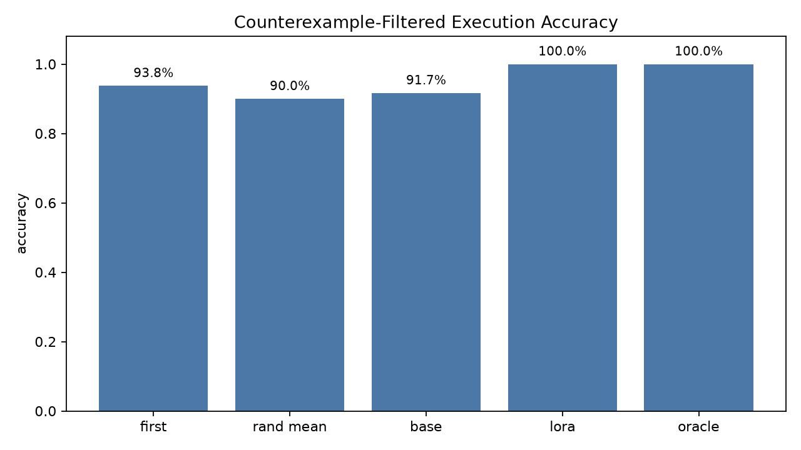
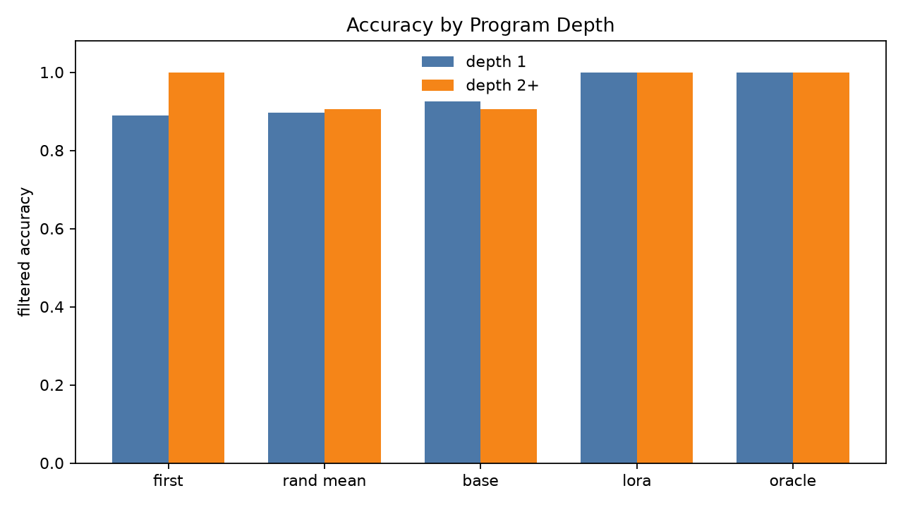
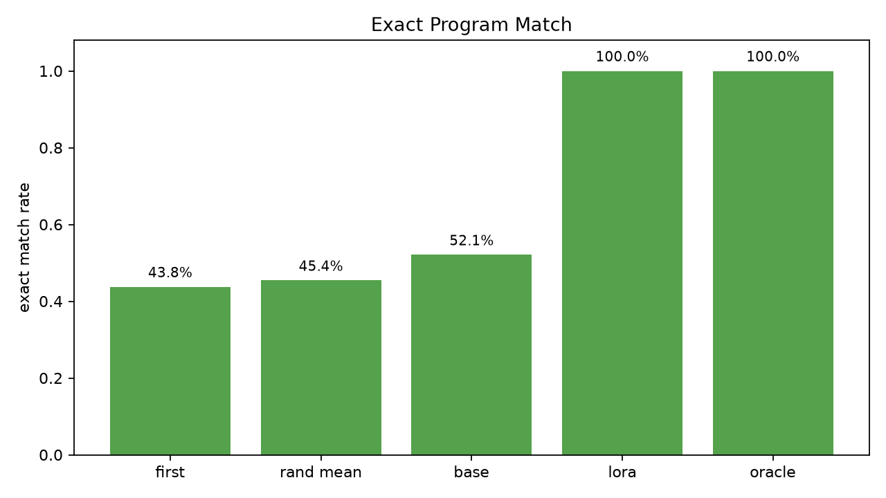
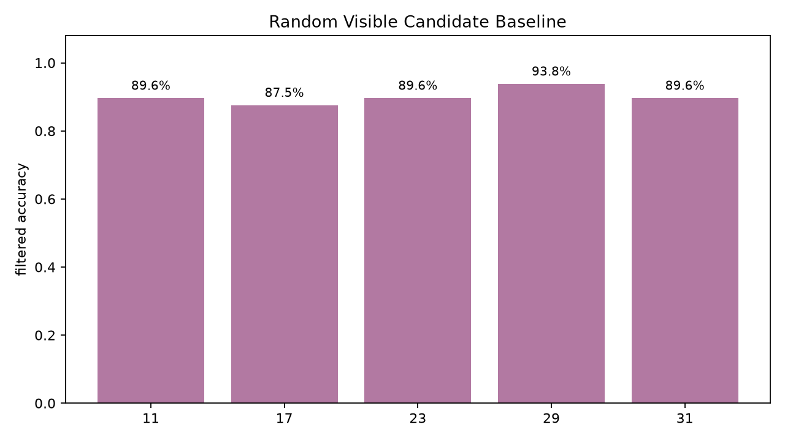

# Qwen3.5-4B Transform ABI Compiler Pilot

## Summary

This pilot tested a constrained compiler surface for deterministic transformation tasks. Candidate ABI programs were enumerated, Qwen scored each candidate under the task prompt, and the selected program was executed by a deterministic interpreter. This removes JSON syntax validity as a confound and isolates operation/composition choice.

The QLoRA scorer reached **48/48 filtered execution accuracy (100.0%)**, compared with **44/48 (91.7%)** for frozen Qwen and **48/48 (100.0%)** for the oracle. On the composition slice, QLoRA reached **21/21 (100.0%)** versus frozen Qwen's **19/21 (90.5%)**.

This is a positive compiler-learnability result inside the generated transformation distribution. It should not be read as a broad production result: the tasks are generated from the same frozen ABI grammar, and most coverage remains shallow. The next gate is a less-curated task source with the ABI frozen before task inspection.

## Charts

## Dataset

- Train records: 180
- Validation records: 40
- Eval records: 48
- Eval depth counts: `{'1': 27, '2': 15, '3': 6}`
- Eval domain counts: `{'csv_etl': 30, 'date_id_irregular': 18}`
- Mean eval candidate count: 29.5

## Results

| Arm | Overall filtered | Depth-1 filtered | Depth-2+ filtered | Exact program |
| --- | --- | --- | --- | --- |
| First visible | 93.8% | 88.9% | 100.0% | 43.8% |
| Random visible mean | 90.0% | 89.6% | 90.5% | 45.4% |
| Frozen Qwen scorer | 91.7% | 92.6% | 90.5% | 52.1% |
| QLoRA scorer | 100.0% | 100.0% | 100.0% | 100.0% |
| Oracle | 100.0% | 100.0% | 100.0% | 100.0% |

Random visible baseline seed range: 87.5%-93.8%, mean 90.0%.

## Base Misses Recovered By QLoRA

| Task | Domain | Depth | Base selected | Target |
| --- | --- | --- | --- | --- |
| eval_0001_score_select | csv_etl | 2 | {"steps":[{"cols":["name","score"],"op":"select_cols"},{"col":"id","numeric":false,"op":"sort_by","reverse":false},{"col":"id","numeric":false,"op":"sort_by","reverse":true}]} | {"steps":[{"cmp":"ge","col":"score","op":"filter_num_cmp","threshold":50},{"cols":["name","score"],"op":"select_cols"}]} |
| eval_0018_ticket | date_id_irregular | 1 | {"steps":[{"op":"extract_regex","pattern":"sku_like"},{"op":"extract_regex","pattern":"sku_like"},{"op":"extract_regex","pattern":"sku_like"}]} | {"steps":[{"op":"extract_regex","pattern":"ticket"}]} |
| eval_0020_score_select | csv_etl | 2 | {"steps":[{"cols":["name","score"],"op":"select_cols"},{"col":"amount","numeric":false,"op":"sort_by","reverse":false},{"col":"amount","numeric":false,"op":"sort_by","reverse":true}]} | {"steps":[{"cmp":"ge","col":"score","op":"filter_num_cmp","threshold":50},{"cols":["name","score"],"op":"select_cols"}]} |
| eval_0037_ticket | date_id_irregular | 1 | {"steps":[{"op":"extract_regex","pattern":"sku_like"},{"op":"extract_regex","pattern":"sku_like"},{"op":"extract_regex","pattern":"sku_like"}]} | {"steps":[{"op":"extract_regex","pattern":"ticket"}]} |

## Training

- Trainable LoRA parameters: 10.6M.
- Training steps: 80.
- Final train loss reported by Trainer: 0.1261.
- Training runtime: 546.2s.

The adapter learned the compact compiler language strongly. Because the constrained scorer evaluates candidate programs directly, the gain is not from better parseability; it is from moving target ABI programs above plausible visible-consistent alternatives.

## Interpretation

The useful signal is the depth-2+ result: the adapter recovered the two composition tasks frozen Qwen missed and closed the oracle gap on this generated suite. That supports running a harder compiler pilot on a less-curated transformation benchmark.

The limiting caveat is also clear: the non-model baselines are already strong because candidate enumeration filters by visible examples. First-visible reached 93.8%, and random-visible averaged 90.0%. Future tasks need more adversarial visible-equivalent candidates and a less templated source to distinguish robust compiler skill from an easy candidate set.

## Decision

Proceed to the next gate only if the ABI and task set are frozen from an external source before evaluation. The next experiment should keep the constrained scorer, but use a larger less-curated pipeline-transform corpus and report depth-1 operation selection separately from depth-2+ composition.
