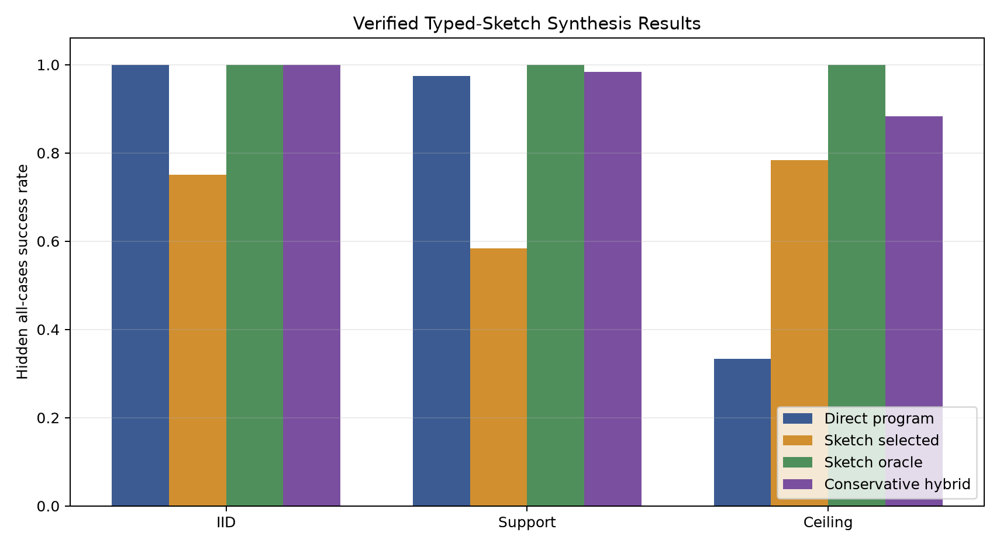
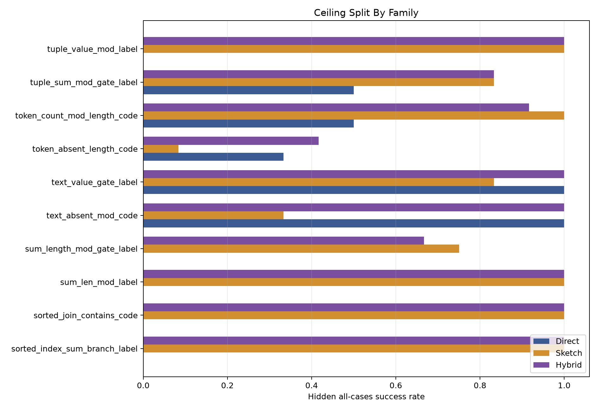
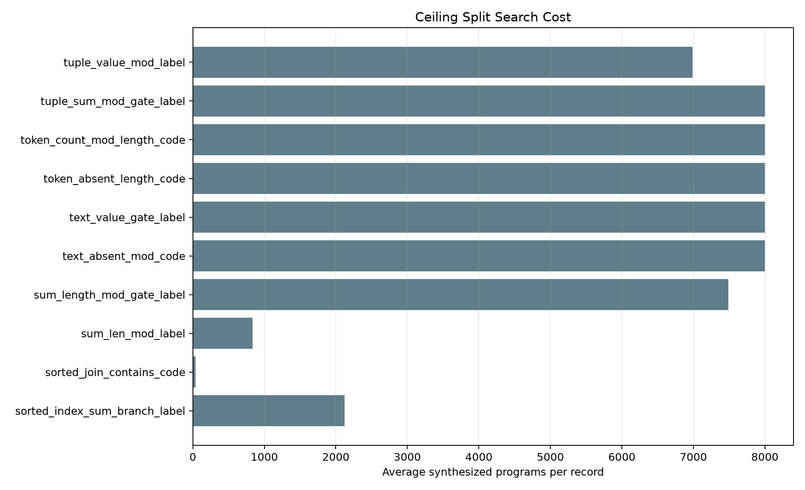

# Qwen 3.5 4B Typed Sketch Synthesis

## Objective

Test whether Qwen 3.5 4B can produce typed executable sketches that a verifier completes into better DSL repairs than direct program generation.

## Method

- Base model: `Qwen/Qwen3.5-4B`, revision `851bf6e806efd8d0a36b00ddf55e13ccb7b8cd0a`.
- Training data: 240 records for each adapter.
- Adapters:
  - `program_lora`: trained to emit complete DSL programs.
  - `sketch_lora`: trained to emit typed sketches with `?NUM`, `?TEXT`, `?SEQ`, and `?PRED` holes.
- Verifier:
  - Completes typed holes from a schema-derived expression bank.
  - Runs candidates on visible cases.
  - Reports selected hidden success and hidden-oracle coverage.
- Final selection rule:
  - Keep the direct-program result if it passes every visible case.
  - Otherwise use sketch synthesis when it passes every visible case.
  - Otherwise choose the candidate with more visible passes.

## Iterations

1. Deterministic target sketches recovered the target program on all train, IID, support, and ceiling records under the planned caps.
2. Initial model-generated sketch synthesis failed on a five-record ceiling smoke test: target synthesis was 0/5 and oracle hidden success was 0/5.
3. Added structural abstraction variants such as `(if ?PRED0 high_label low_label)` and `(format "X{}" ?NUM0)`, plus deeper numeric and predicate expression-bank entries.
4. Changed visible-pass tie-breaking to prefer input-dependent, structurally richer candidates instead of shorter programs.
5. Fixed candidate tag merging so targeted predicates promote generic candidates already in the bank.

## Results

| Split | Direct program | Sketch selected | Sketch oracle | Conservative hybrid |
| --- | --- | --- | --- | --- |
| IID | 60/60 (100.0%) | 45/60 (75.0%) | 60/60 (100.0%) | 60/60 (100.0%) |
| Support | 117/120 (97.5%) | 70/120 (58.3%) | 120/120 (100.0%) | 118/120 (98.3%) |
| Ceiling | 40/120 (33.3%) | 94/120 (78.3%) | 120/120 (100.0%) | 106/120 (88.3%) |

The ceiling split is the important result. Direct program generation solved 40/120 (33.3%). Sketch synthesis selected by visible cases solved 94/120 (78.3%). The conservative hybrid solved 106/120 (88.3%). Hidden-oracle coverage was 120/120 (100.0%), which means the verifier search space contained every target program on the ceiling split.

Ceiling family breakdown:

| Family | Direct | Sketch | Oracle | Hybrid | Avg candidates |
| --- | --- | --- | --- | --- | --- |
| sorted_index_sum_branch_label | 0 | 12 | 12 | 12 | 2123.3 |
| sorted_join_contains_code | 0 | 12 | 12 | 12 | 38.0 |
| sum_len_mod_label | 0 | 12 | 12 | 12 | 833.0 |
| sum_length_mod_gate_label | 0 | 9 | 12 | 8 | 7486.5 |
| text_absent_mod_code | 12 | 4 | 12 | 12 | 8000.0 |
| text_value_gate_label | 12 | 10 | 12 | 12 | 8000.0 |
| token_absent_length_code | 4 | 1 | 12 | 5 | 8000.0 |
| token_count_mod_length_code | 6 | 12 | 12 | 11 | 8000.0 |
| tuple_sum_mod_gate_label | 6 | 10 | 12 | 10 | 8000.0 |
| tuple_value_mod_label | 0 | 12 | 12 | 12 | 6987.0 |

## Interpretation

Typed sketch synthesis changed the ceiling result from 40/120 to 94/120 with sketch selection alone and to 106/120 with the conservative hybrid. The oracle result of 120/120 shows that the remaining failures are not expression coverage failures; they are visible-case selection failures.

The experiment did not produce a universal training tweak by itself. It did produce a strong concrete mechanism: use Qwen 3.5 4B to identify output format and coarse control structure, then let a typed verifier search deeper compositions than the model reliably emits token-by-token.

## Failure Modes

- Sketch-alone selection is unsafe on easy splits: IID direct generation is 60/60, while sketch-alone is 45/60 because many visible-equivalent candidates exist.
- The conservative hybrid protects solved visible-all direct outputs, but ceiling still has 14 hidden failures versus a 120/120 oracle.
- Several families hit the 8,000-candidate cap, so runtime is still dominated by broad symbolic enumeration.
- The expression bank is manually engineered for this DSL. The result is evidence for the typed-sketch/verifier direction, not for a domain-independent recipe yet.

## Next Experiment

The next experiment should make selection adaptive: after sketch synthesis finds many visible-equivalent programs, generate new discriminating visible cases on the fly, rerun the candidates, and train or evaluate the policy on that counterexample-acquisition loop. The MDP framing is direct: state is the candidate set plus visible traces, actions request additional cases or commit to a program, and reward is verified generalization under a fixed case budget.

## Artifacts

- Compact experiment directory: `/workspace/experiments/qwen35_4b_typed_sketch_synthesis`
- Large adapter/checkpoint root: `/workspace/large_artifacts/qwen35_4b_typed_sketch_synthesis`
- Direct evals: `reports/eval/program_iid.json`, `reports/eval/program_support.json`, `reports/eval/program_ceiling.json`
- Sketch evals: `reports/eval/sketch_iid.json`, `reports/eval/sketch_support.json`, `reports/eval/sketch_ceiling.json`
- Training logs: `run_logs/training_program_lora_console.log`, `run_logs/training_sketch_lora_console.log`
