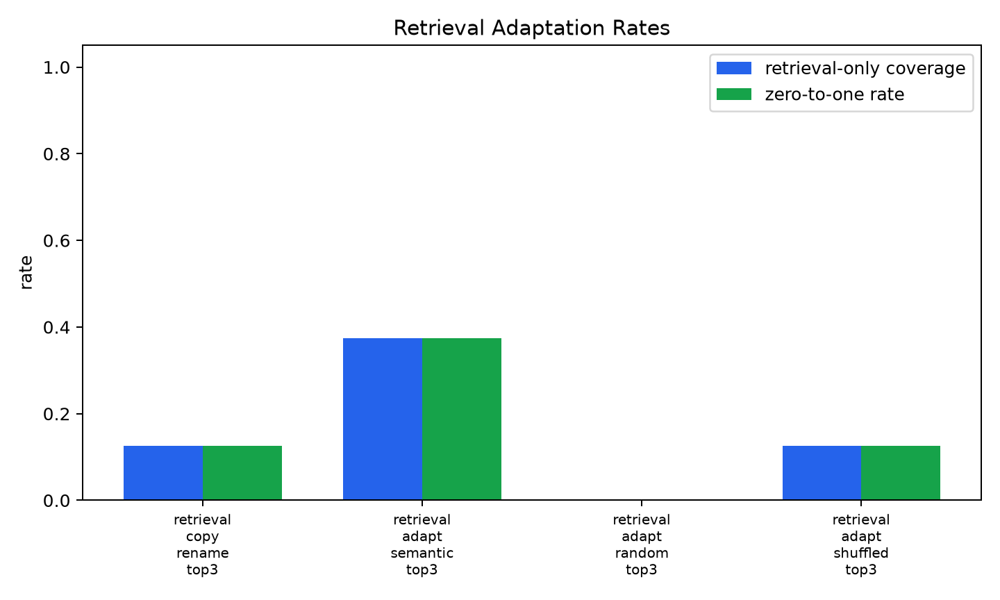
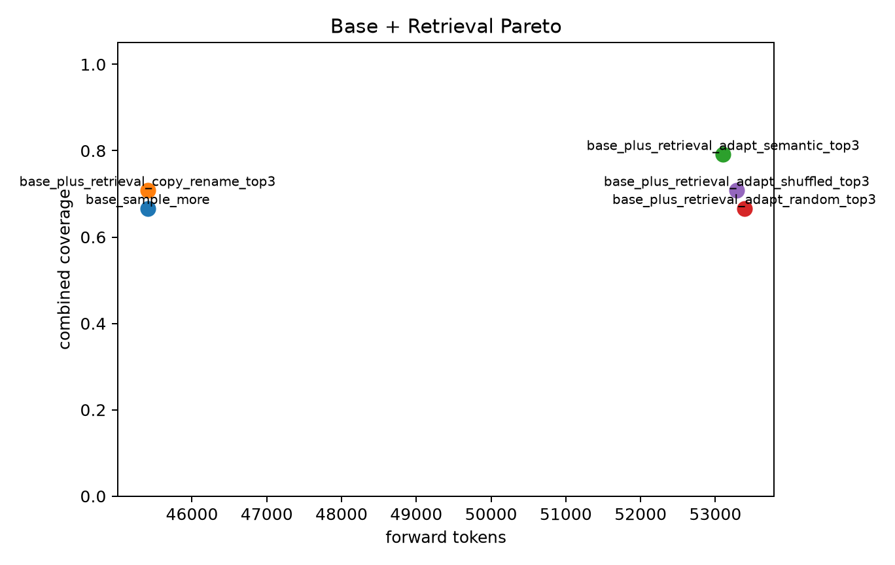

# qwen35_4b_verified_algorithm_retrieval_adaptation

## Question

Can verified algorithm retrieval plus Qwen adaptation recover held-out tasks that direct sampling missed?

The experiment builds a verified algorithm library from training tasks, retrieves top-k candidate algorithms for each held-out miss, adapts them to the target task with Qwen, and evaluates hidden tests only after candidate generation.

## Setup

- Verified library entries: 364
- Eval baseline tasks: 24
- Direct sample-more coverage: 66.7%
- Direct sample-more misses: [15, 16, 20, 21, 24, 25, 26, 31]
- Retrieval top-k: 3

## Retrieval-Only Results

| arm | retrieval coverage | zero-to-one | visible-pass hidden-wrong | parse/task | tokens |
|---|---:|---:|---:|---:|---:|
| retrieval_copy_rename_top3 | 12.5% | 1 (12.5%) | 2/3 (66.7%) | 3.00 | 0 |
| retrieval_adapt_semantic_top3 | 37.5% | 3 (37.5%) | 4/7 (57.1%) | 2.62 | 7699 |
| retrieval_adapt_random_top3 | 0.0% | 0 (0.0%) | 5/5 (100.0%) | 2.75 | 7982 |
| retrieval_adapt_shuffled_top3 | 12.5% | 1 (12.5%) | 6/7 (85.7%) | 2.88 | 7881 |

## Combined With Direct Sampling

| combined arm | coverage | zero-to-one tasks | forward tokens |
|---|---:|---:|---:|
| base_sample_more | 66.7% | [] | 45406 |
| base_plus_retrieval_copy_rename_top3 | 70.8% | [20] | 45406 |
| base_plus_retrieval_adapt_semantic_top3 | 79.2% | [15, 20, 25] | 53105 |
| base_plus_retrieval_adapt_random_top3 | 66.7% | [] | 53388 |
| base_plus_retrieval_adapt_shuffled_top3 | 70.8% | [20] | 53287 |

## Recovered Tasks

| arm | recovered task | task | winner sources |
|---|---:|---|---|
| retrieval_copy_rename_top3 | 20 | Write a function to check if the given number is woodball or not. | ['retrieval_copy_rename_top3_semantic_r0'] |
| retrieval_adapt_semantic_top3 | 15 | Write a function to split a string at lowercase letters. | ['retrieval_adapt_semantic_top3_semantic_r0_s0'] |
| retrieval_adapt_semantic_top3 | 20 | Write a function to check if the given number is woodball or not. | ['retrieval_adapt_semantic_top3_semantic_r0_s0'] |
| retrieval_adapt_semantic_top3 | 25 | Write a python function to find the product of non-repeated elements in a given array. | ['retrieval_adapt_semantic_top3_semantic_r0_s0'] |
| retrieval_adapt_shuffled_top3 | 20 | Write a function to check if the given number is woodball or not. | ['retrieval_adapt_shuffled_top3_shuffled_r0_s0'] |

## Gate Readout

Semantic retrieval adaptation recovered 3 direct-sampling misses.
Random retrieval adaptation recovered 0.
Shuffled retrieval adaptation recovered 1.

## Interpretation

Semantic retrieval adaptation passes the primary pilot gate: it recovers three direct-sampling misses, compared with zero for random retrieval and one for shuffled retrieval. Combined with the direct sample-more pool, coverage rises from 66.7% to 79.2% on this 24-task slice at an additional 7,699 forward tokens.

The control read is important. Copy/rename and shuffled retrieval both recover task 20, so that task is not strong evidence for semantic matching. The stronger semantic-specific lift is tasks 15 and 25, where matched retrieved algorithms map cleanly onto the target operation family.

The main failure mode is also clear: visible-pass hidden-wrong rates are high for all retrieval arms. Retrieval gives Qwen useful external algorithmic memory, but public tests are too thin to safely commit every visible-passing adaptation. The next iteration should scale this to a larger held-out slice and add a retrieval-candidate verifier/reranker or generated counterexample tests before commit.
