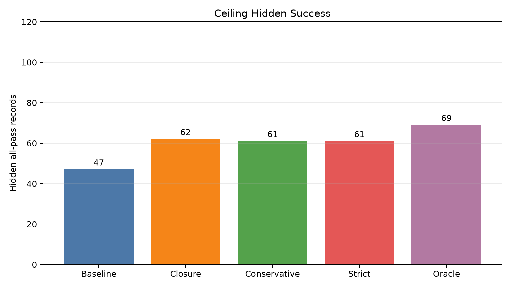
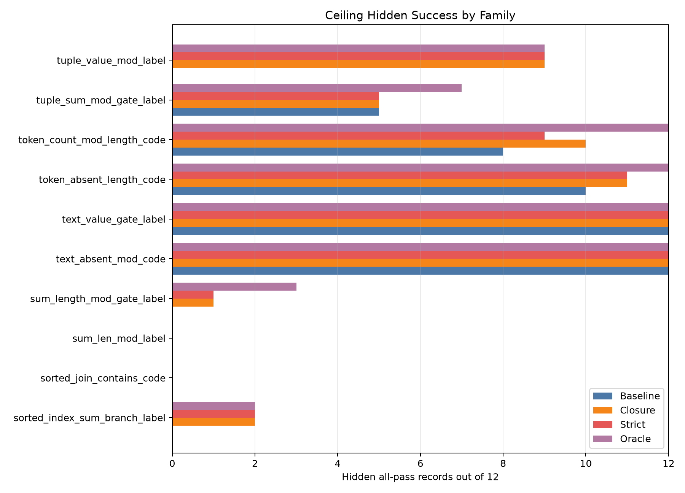
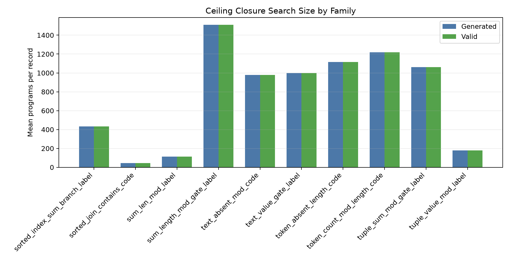

# Qwen3.5-4B Verified DSL Edit Closure

## Executive Summary

A fresh `Qwen/Qwen3.5-4B` LoRA adapter solved IID and support DSL evals perfectly. On the held-out ceiling split, normal visible reranking reached 47/120 hidden all-pass records. Bounded symbolic edit closure raised visible-selected hidden all-pass to 62/120, while the hidden oracle inside the same closure neighborhoods reached 69/120.

The main positive result is that local verified edits added real recoverable capability on hard held-out compositions. The main negative result is that six visible cases are not enough to choose safely in every family: the strict visible-all acceptance policy kept 61/120 hidden all-pass and reduced pass-count damage to 4 records, but it did not eliminate it.

## Setup

- Base model: `Qwen/Qwen3.5-4B`.
- Adapter: LoRA, trained for 2 epochs on 240 static DSL records.
- Data: 60 IID eval records, 120 support eval records, 120 held-out ceiling records.
- Each eval record has 6 visible cases and 18 hidden cases.
- Normal baseline: greedy plus three sampled candidates for support and ceiling, selected by visible execution.
- Closure: bounded two-round local DSL edits from up to four model candidates, selected by visible execution.
- Strict policy: accept a closure program only when it reaches all visible cases and the baseline did not.
- Hidden oracle: best hidden-case result inside the closure candidate set, used only as a diagnostic.

## Split Results

| Split | Records | Greedy Hidden | Rerank Hidden | Closure Hidden | Strict Hidden | Oracle Hidden |
| --- | --- | --- | --- | --- | --- | --- |
| IID | 60 | 60/60 (100.0%) | 60/60 (100.0%) | 60/60 (100.0%) | 60/60 (100.0%) | 60/60 (100.0%) |
| Support | 120 | 120/120 (100.0%) | 120/120 (100.0%) | 120/120 (100.0%) | 120/120 (100.0%) | 120/120 (100.0%) |
| Ceiling | 120 | 48/120 (40.0%) | 47/120 (39.2%) | 62/120 (51.7%) | 61/120 (50.8%) | 69/120 (57.5%) |

## Ceiling Policies

| Policy | Hidden All-Pass | Visible All-Pass | Hidden Pass-Count Improved | Hidden Pass-Count Damaged | Accepted |
| --- | --- | --- | --- | --- | --- |
| Baseline visible rerank | 47/120 (39.2%) | 53/120 (44.2%) | 0 | 0 | 0 |
| Closure visible select | 62/120 (51.7%) | 92/120 (76.7%) | 49 | 8 | 120 |
| Conservative accept visible gain | 61/120 (50.8%) | 92/120 (76.7%) | 48 | 8 | 59 |
| Strict accept visible all | 61/120 (50.8%) | 92/120 (76.7%) | 33 | 4 | 39 |
| Hidden oracle diagnostic | 69/120 (57.5%) | hidden-only | diagnostic | diagnostic | 120 |

## Ceiling Families

| Family | Base | Closure | Strict | Oracle | Strict Accepted | Strict Damaged |
| --- | --- | --- | --- | --- | --- | --- |
| sorted_index_sum_branch_label | 0 | 2 | 2 | 2 | 9 | 0 |
| sorted_join_contains_code | 0 | 0 | 0 | 0 | 4 | 0 |
| sum_len_mod_label | 0 | 0 | 0 | 0 | 0 | 0 |
| sum_length_mod_gate_label | 0 | 1 | 1 | 3 | 6 | 0 |
| text_absent_mod_code | 12 | 12 | 12 | 12 | 0 | 0 |
| text_value_gate_label | 12 | 12 | 12 | 12 | 0 | 0 |
| token_absent_length_code | 10 | 11 | 11 | 12 | 1 | 0 |
| token_count_mod_length_code | 8 | 10 | 9 | 12 | 4 | 0 |
| tuple_sum_mod_gate_label | 5 | 5 | 5 | 7 | 6 | 4 |
| tuple_value_mod_label | 0 | 9 | 9 | 9 | 9 | 0 |

## Search Budget

| Split | Generated Median | Generated P90 | Valid Median | Valid P90 |
| --- | --- | --- | --- | --- |
| IID | 23 | 971 | 23 | 971 |
| Support | 970 | 989 | 970 | 989 |
| Ceiling | 973 | 1358 | 973 | 1358 |

## Interpretation

The edit closure helped most when the model produced a structurally nearby but semantically wrong program. The clearest gains were in `tuple_value_mod_label`, `sorted_index_sum_branch_label`, and `token_count_mod_length_code`. These are cases where the symbolic neighborhood contained useful repairs and visible execution usually moved selection in the right direction.

The ceiling oracle result, 69/120, is only seven records above pure visible closure at 62/120. That means the local edit space is a real constraint, not just the selector. Families such as `sorted_join_contains_code` and `sum_len_mod_label` had zero hidden-oracle all-pass records, so the current edit operators do not generate the needed programs for those records.

The strict policy is the better deployable readout than pure closure: it gives nearly the same hidden all-pass count as conservative closure, accepts fewer edits, and halves pass-count damage. The remaining damage is concentrated in `tuple_sum_mod_gate_label`, where visible cases are ambiguous among several plausible tuple and sum predicates.

## Iteration Notes

The first closure selector used shortest-program tie-breaking among visible-equivalent programs. That caused IID hidden regressions by selecting degenerate but visible-perfect simplifications. The selector was changed to stable first-seen tie-breaking, which preserves the nearest seed candidate under ties. After that change, IID and support closure both stayed perfect.

A second policy layer was then added: conservative acceptance requires visible pass-count gain, and strict acceptance additionally requires all visible cases. Strict acceptance is the cleanest summary of what a visible-only repair policy can safely claim here.

## Conclusion

This experiment supports the hypothesis that a symbolic program-edit region can amplify a small LLM's held-out executable-task performance, but not enough by itself for a step-change result. The next most direct improvement is not more LoRA training. It is stronger visible discrimination: adaptive counterexample generation or active visible-case expansion targeted at closure ties.
