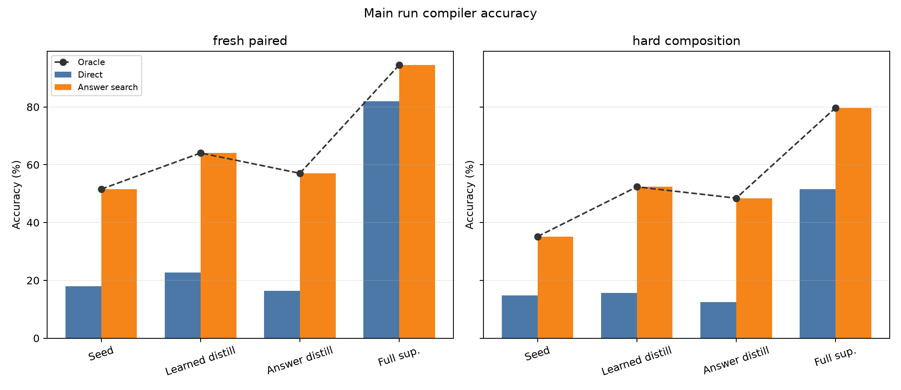
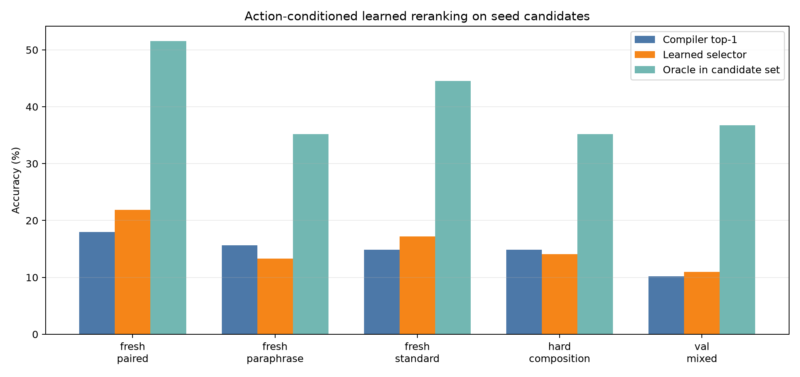
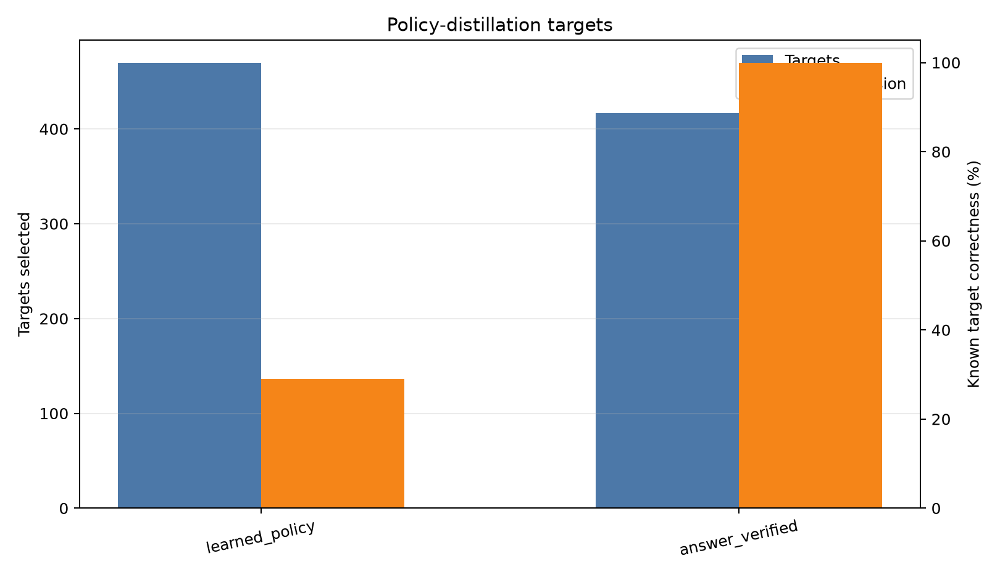
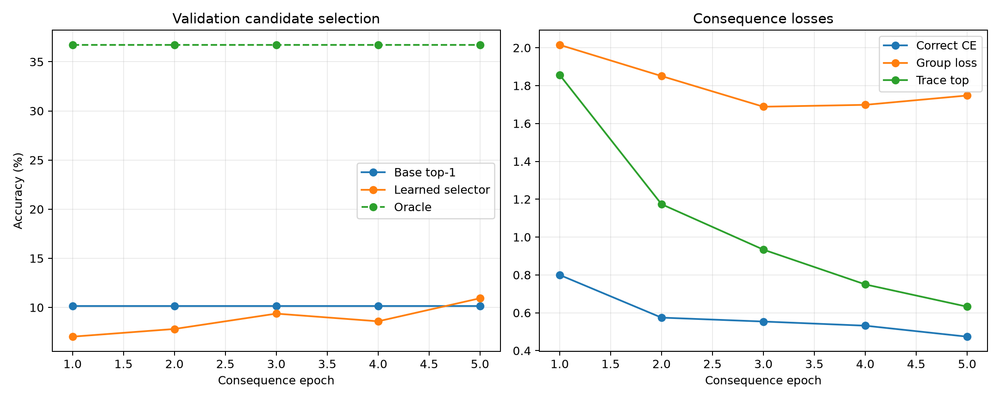
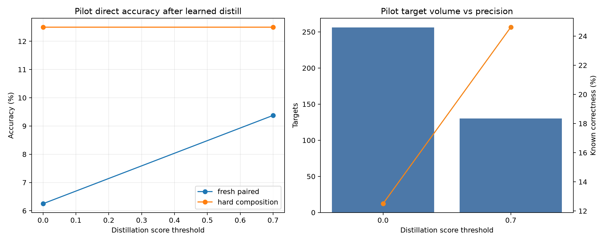

# Action-Conditioned VM-ECHO Policy Iteration

## Abstract

This experiment tests a candidate-conditioned route from program search to better direct program emission. A frozen-Qwen compiler first proposes typed bytecode candidates. A consequence model then receives the prompt representation and a candidate program, and learns from VM execution labels: validity, final value, stack trace, and whether that candidate solves the prompt. The learned selector is then used to choose policy-distillation targets for the compiler.

The main result is mixed. The learned consequence selector did not close the oracle gap in the main run: on validation candidates it moved from 10.2% base top-1 accuracy to 10.9%, with an oracle of 36.7%. However, filtered learned-policy distillation still improved the compiler on several generalization splits. Fresh-paired direct accuracy increased from 18.0% to 22.7%, and hard-composition answer-search accuracy increased from 35.2% to 52.3%. The fully supervised ceiling remained much higher: fresh-paired direct accuracy reached 82.0%.

## Setup

- Base model: `Qwen/Qwen3-4B`, used only as a frozen hidden-state feature extractor.
- Seed examples: `192`.
- Candidate-training prompts: `1024`.
- Full-supervised examples: `1024`.
- Fresh split size: `128`.
- Candidate search: top-k `3`, second-order argument pairs `8`, max candidates `256`.
- Learned-target threshold: `0.7`.
- Checkpoints: `large_artifacts/qwen_action_conditioned_vm_echo_policy_iteration/checkpoints/main_action_vm_echo_s192_thr070/`.

## Main Results

| Phase | Split | Direct | Answer search | Oracle | Learned selector | Program exact |
| --- | --- | --- | --- | --- | --- | --- |
| Seed | fresh_paired | 18.0% | 51.6% | 51.6% |  | 0.8% |
| Seed | fresh_paraphrase | 15.6% | 35.2% | 35.2% |  | 3.1% |
| Seed | fresh_standard | 14.8% | 44.5% | 44.5% |  | 2.3% |
| Seed | hard_composition | 14.8% | 35.2% | 35.2% |  | 1.6% |
| Learned distill | fresh_paired | 22.7% | 64.1% | 64.1% | 17.2% | 3.1% |
| Learned distill | fresh_paraphrase | 14.8% | 43.0% | 43.0% | 7.0% | 0.8% |
| Learned distill | fresh_standard | 19.5% | 52.3% | 52.3% | 17.2% | 3.1% |
| Learned distill | hard_composition | 15.6% | 52.3% | 52.3% | 13.3% | 1.6% |
| Answer distill | fresh_paired | 16.4% | 57.0% | 57.0% | 18.8% | 0.8% |
| Answer distill | fresh_paraphrase | 14.8% | 48.4% | 48.4% | 13.3% | 2.3% |
| Answer distill | fresh_standard | 18.0% | 57.0% | 57.0% | 18.8% | 4.7% |
| Answer distill | hard_composition | 12.5% | 48.4% | 48.4% | 14.1% | 0.0% |
| Full sup. | fresh_paired | 82.0% | 94.5% | 94.5% | 32.0% | 70.3% |
| Full sup. | fresh_paraphrase | 72.7% | 90.6% | 90.6% | 30.5% | 57.0% |
| Full sup. | fresh_standard | 69.5% | 85.9% | 85.9% | 28.1% | 46.9% |
| Full sup. | hard_composition | 51.6% | 79.7% | 79.7% | 28.9% | 28.9% |

## Learned Candidate Selection

The action-conditioned selector learned a real but weak signal. It selected mostly valid programs, but it did not reliably select answer-correct programs at main scale.

Training candidate set:

- Groups: `1024` prompts.
- Candidates: `246910` programs.
- Positive candidate rate: 9.3%.
- Prompts with at least one positive candidate: 40.7%.

## Policy-Distillation Targets

| phase | targets | oracle_found_rate | selected_correct_rate | selected_valid_rate | changed_rate | mean_selected_score |
| --- | --- | --- | --- | --- | --- | --- |
| learned_policy | 470 | 40.7% | 28.9% | 99.6% | 100.0% | 0.884 |
| answer_verified | 417 | 40.7% | 100.0% | 100.0% | 62.6% |  |

The learned selector chose more targets than answer verification, but with much lower known precision. The useful signal is that even imperfect learned targets improved some direct and search metrics, suggesting that consequence-conditioned filtering is not useless. The limiting factor is selector precision.

## Training Dynamics

## Threshold Pilot

A small threshold sweep was used to avoid using every learned-selected target. The higher threshold traded volume for precision and produced better pilot direct accuracy.

## Interpretation

The candidate-conditioned objective is closer to the desired mechanism than target-trace-only supervision: it asks what a proposed program will do, not only what the correct program should look like. But this implementation still underfits the hardest part: comparing candidate consequences to the prompt-implied answer. The next improvement should strengthen the selector, not the compiler head. Good next changes are pairwise preference training over candidates from the same prompt, harder negative mining, and using the compiler's answer representation directly inside the consequence model.

## Artifacts

- `experiments/qwen_action_conditioned_vm_echo_policy_iteration/runs/main_action_vm_echo_s192_thr070/metrics.csv`
- `experiments/qwen_action_conditioned_vm_echo_policy_iteration/runs/main_action_vm_echo_s192_thr070/target_selection.csv`
- `experiments/qwen_action_conditioned_vm_echo_policy_iteration/runs/main_action_vm_echo_s192_thr070/consequence_train_log.csv`
- `experiments/qwen_action_conditioned_vm_echo_policy_iteration/analysis/main_metrics.csv`
- `experiments/qwen_action_conditioned_vm_echo_policy_iteration/reports/qwen_action_conditioned_vm_echo_policy_iteration_report.md`
- `experiments/qwen_action_conditioned_vm_echo_policy_iteration/reports/qwen_action_conditioned_vm_echo_policy_iteration_report.html`
