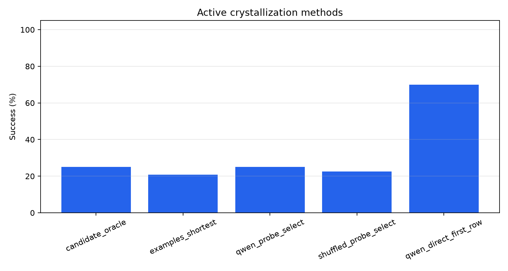
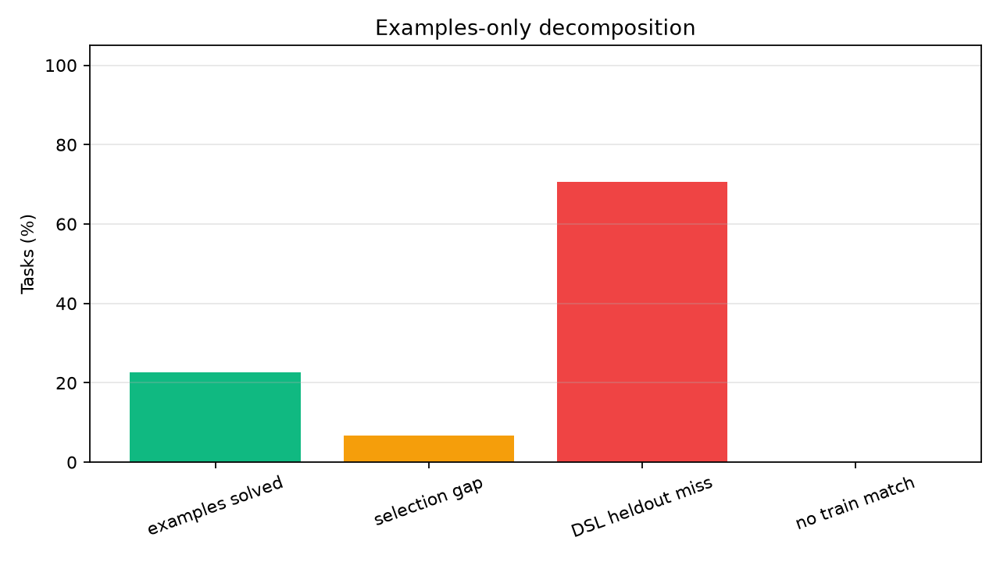
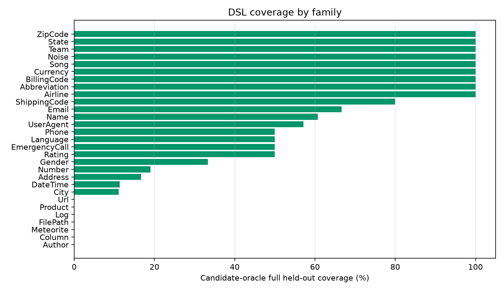
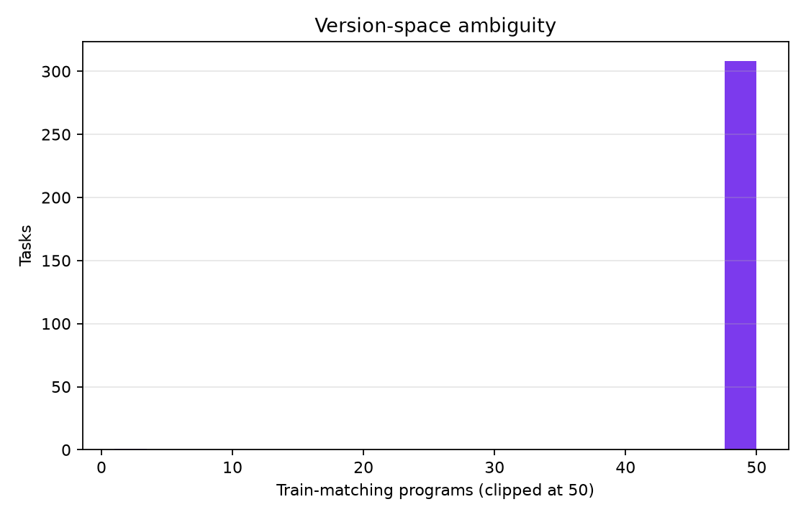
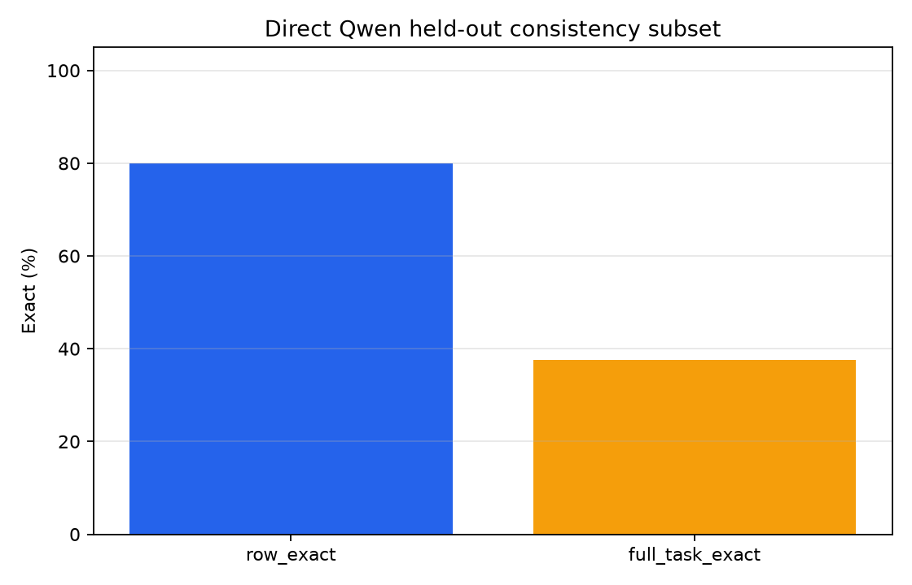

# Qwen Active Crystallizer Public Gate

## Abstract

This standalone experiment tests whether frozen Qwen probe labels can select a deterministic transformation program from sparse examples. The model labels synthetic train-like probes; held-out benchmark rows are used only for evaluation.

## Method

- Dataset: public Microsoft PROSE `Transformation.Text` tasks.
- Split: first `4` examples are train examples; up to `50` following examples are held out.
- Candidate DSL: extraction, casing, regex groups, date/time/number utilities, affixes, two-part concatenation, and small finite maps.
- Candidate oracle: whether any train-fitting candidate also matches all held-out rows.
- Examples-only selector: shortest train-fitting candidate.
- Active crystallizer: Qwen labels synthetic train-like probes chosen to maximize candidate disagreement; the selected program is then evaluated on all held-out rows.
- Shuffled-label control: same probes, but labels are rotated before program selection.
- Direct Qwen baseline: one held-out query per sampled task, not a full-task program-consistency metric.

## Run Configuration

- Suite: `main`.
- Static candidate tasks: `309`.
- Qwen-probe tasks: `120`.
- Qwen model: `Qwen/Qwen3-4B`.
- Max candidates per task: `40000`.
- Max Qwen probes per task: `4`.

## Primary Results

### Static Candidate Coverage

|method|tasks|score|
|---|---|---|
|candidate_oracle|309|29.4%|
|examples_shortest|309|22.7%|
|has_train_match|309|100.0%|

### Qwen-Probe Subset

|method|tasks|score|
|---|---|---|
|candidate_oracle|120|25.0%|
|examples_shortest|120|20.8%|
|qwen_probe_select|120|25.0%|
|shuffled_probe_select|120|22.5%|
|qwen_direct_first_row|120|70.0%|

### Strict Direct-Qwen Full-Heldout Diagnostic

This diagnostic uses the same train examples and asks frozen Qwen to answer every held-out row for a capped task subset. A task counts only if every held-out row is exact.

|metric|tasks|rows|score|
|---|---|---|---|
|row_exact|40|458|79.9%|
|full_task_exact|40|458|37.5%|

- On the same `40` tasks, active selected-program full-task exact is 12.5% (5/40).
- Direct Qwen full-task exact is 37.5% (15/40).

### Family Breakdown

|family|tasks|oracle_coverage|examples_score|train_match_rate|
|---|---|---|---|---|
|Author|1|0.00|0.00|100.0%|
|Column|2|0.00|0.00|100.0%|
|Meteorite|1|0.00|0.00|100.0%|
|FilePath|1|0.00|0.00|100.0%|
|Log|4|0.00|0.00|100.0%|
|Product|2|0.00|0.00|100.0%|
|Url|1|0.00|0.00|100.0%|
|City|9|0.11|0.00|100.0%|
|DateTime|106|0.11|0.09|100.0%|
|Address|6|0.17|0.00|100.0%|
|Number|84|0.19|0.13|100.0%|
|Gender|3|0.33|0.33|100.0%|
|Rating|2|0.50|0.50|100.0%|
|EmergencyCall|2|0.50|0.00|100.0%|
|Language|2|0.50|0.50|100.0%|
|Phone|16|0.50|0.38|100.0%|
|UserAgent|7|0.57|0.43|100.0%|
|Name|28|0.61|0.43|100.0%|
|Email|6|0.67|0.67|100.0%|
|ShippingCode|10|0.80|0.70|100.0%|
|Airline|1|1.00|1.00|100.0%|
|Abbreviation|1|1.00|1.00|100.0%|
|BillingCode|6|1.00|0.67|100.0%|
|Currency|3|1.00|1.00|100.0%|
|Song|1|1.00|1.00|100.0%|
|Noise|1|1.00|1.00|100.0%|
|Team|1|1.00|1.00|100.0%|
|State|1|1.00|1.00|100.0%|
|ZipCode|1|1.00|1.00|100.0%|

### Qwen-Probe Task Examples

|task_id|family|features|oracle_covered|examples_full_exact|qwen_probe_full_exact|shuffled_probe_full_exact|qwen_direct_first_exact|probe_count|qwen_program|
|---|---|---|---|---|---|---|---|---|---|
|Abbreviation.000001|Abbreviation|Concatenation,Conditional,Substring|True|True|True|True|True|4|initials(COL0)|
|BillingCode.000007|BillingCode|Concatenation|True|True|True|True|False|4|affix[&#x27;&#x27;,&#x27;]&#x27;](COL0)|
|DateTime.000003|DateTime|DateTime|True|True|True|True|True|4|number_int(COL0)|
|DateTime.000004|DateTime|Concatenation,DateTime,Multicolumn|True|True|True|True|True|4|concat[&#x27; &#x27;](COL0,COL1)|
|DateTime.000013|DateTime|Conditional,DateTime|True|True|True|True|True|4|COL0|
|DateTime.000103|DateTime|DateTime|True|True|True|True|True|0|word[4](COL0)|
|DateTime.000104|DateTime|DateTime|True|True|True|True|True|4|title(alpha(COL0))|
|DateTime.000107|DateTime|DateTime|True|True|True|True|True|4|word[2](COL0)|
|EmergencyCall.000003|EmergencyCall|Casing,Substring|True|False|True|True|True|4|title(field[;,1](COL0))|
|Gender.000003|Gender|Conditional|True|True|True|True|True|1|map[l-&gt;0,m-&gt;1,k-&gt;2](slice[2:3](COL0))|
|Language.000002|Language|Multicolumn,Substring|True|True|True|True|True|4|word[3](COL1)|
|Name.000017|Name|Substring|True|True|True|True|False|4|title(slice[0:4](COL0))|
|Name.000027|Name|Substring|True|True|True|True|True|4|alpha(COL0)|
|Name.000028|Name|Substring|True|True|True|True|True|4|word[0](COL0)|
|Name.000029|Name|Concatenation,Substring|True|False|True|True|True|4|concat[&#x27;, &#x27;](word[1](COL0),word[0](COL0))|
|Name.000038|Name|Casing,Concatenation,Substring|True|False|True|True|True|4|affix[&#x27;&#x27;,&#x27;@&#x27;](lower(word[0](COL0)))|
|Number.000007|Number|Numeric,NumericRounding|True|False|True|True|True|4|affix[&#x27;&#x27;,&#x27;0&#x27;](number_1dp(COL0))|
|Number.000029|Number|Numeric,NumericRounding|True|True|True|True|True|4|number_round10(COL0)|
|Number.000044|Number|Numeric|True|True|True|True|True|4|number_int(COL0)|
|Number.000049|Number|Numeric,NumericRounding|True|True|True|False|False|4|number_round100(COL0)|
|Number.000051|Number|Numeric,NumericRounding|True|True|True|True|True|4|number_round100(COL0)|
|Number.000077|Number|Numeric,NumericRounding|True|False|True|False|False|4|affix[&#x27;&#x27;,&#x27;0&#x27;](drop_last[1](COL0))|
|Number.000078|Number|Numeric,NumericRounding|True|True|True|True|True|4|number_round10(COL0)|
|Phone.000011|Phone|Concatenation,Substring|True|True|True|True|True|4|title(COL0)|

### Qwen-Probe Misses

|task_id|family|features|oracle_covered|qwen_probe_full_exact|qwen_direct_first_exact|direct_target|direct_prediction|
|---|---|---|---|---|---|---|---|
|Address.000002|Address|Substring|False|False|False|880 81th Place|880 81th Place SE|
|Address.000003|Address|Substring|False|False|True|319 09th Lane|319 09th Lane|
|Address.000013|Address|Conditional,Substring|False|False|True|89|89|
|City.000004|City|Conditional|False|False|True|San Francisco|San Francisco|
|City.000008|City|Conditional|False|False|False|||
|City.000010|City|Conditional,Numeric|False|False|True|9|9|
|City.000011|City|Conditional|False|False|True|New York City|New York City|
|Column.000001|Column|Concatenation,Conditional,Substring|False|False|True|Col1|Col1|
|DateTime.000005|DateTime|Conditional,DateTime|False|False|True|Jun 2027|Jun 2027|
|DateTime.000007|DateTime|DateTime|False|False|True|Sep 2007|Sep 2007|
|DateTime.000012|DateTime|Conditional,DateTime|False|False|True|2033|2033|
|DateTime.000014|DateTime|DateTime|False|False|False|Friday #1 February 2013|Saturday #1 February 2013|
|DateTime.000015|DateTime|DateTime|False|False|False|Friday, 2013W05|Thursday, 2013W01|
|DateTime.000017|DateTime|DateTime|False|False|True|30/3/2241|30/3/2241|
|DateTime.000018|DateTime|DateTime|False|False|True|30 Mar 2241|30 Mar 2241|
|DateTime.000023|DateTime|DateTime|False|False|True|03302241|03302241|
|DateTime.000025|DateTime|DateTime|False|False|True|Mar 41|Mar 41|
|DateTime.000027|DateTime|DateTime|False|False|False|Q1 &#x27;2241|Q1 &#x27;241|
|DateTime.000029|DateTime|DateTime|False|False|False|Tuesday|Sunday|
|DateTime.000032|DateTime|DateTime|False|False|True|10:02 PM|10:02 PM|
|DateTime.000034|DateTime|DateTime,Substring|False|False|True|2002-09-12 16:15:08|2002-09-12 16:15:08|
|DateTime.000035|DateTime|DateTime,Multicolumn|False|False|True|2002-09-12 16:15:08|2002-09-12 16:15:08|
|DateTime.000040|DateTime|DateTime,Substring|False|False|True|January 31, 1846|January 31, 1846|
|DateTime.000044|DateTime|DateTime|False|False|False|January the 31th 1846|January the 31st 1846|

## Interpretation

On the Qwen-probe subset, active crystallization selects a full held-out-valid program for 25.0% of tasks, compared with 22.5% for the shuffled-label control and a candidate-oracle ceiling of 25.0%.
Frozen Qwen direct answering reaches 70.0% on one held-out row per sampled task, which is a different metric: it measures row-level inference, not whether a single executable program generalizes over all held-out rows.
The strict direct-Qwen diagnostic narrows that comparison: direct row accuracy is 79.9%, but full-task consistency drops to 37.5%. Direct Qwen is still ahead of active selected programs on the matched subset, but it is not a solved consistency baseline.
Across all static tasks, the candidate DSL has a full-heldout oracle ceiling of 29.4%, while examples-only shortest selection reaches 22.7%.
The main failure is not a lack of train-fitting programs: finite maps can fit train examples for every task. The failure is that most train-fitting programs are not held-out-valid, and Qwen probe labels only add a small margin over the shuffled-label control. Under this setup, fuzzy model labels did not crystallize Qwen's row-level competence into broadly reliable executable programs.

## Limitations

This run uses synthetic probes generated from train inputs, not human-authored counterexamples. The Qwen-probe subset is capped for runtime. Direct Qwen is scored on one held-out row per task, while program methods require one executable program to match all held-out rows.

## Artifacts

- Static details: `analysis/static_details.csv`
- Qwen-probe details: `analysis/qwen_probe_details.csv`
- Static summary: `analysis/static_summary.csv`
- Qwen summary: `analysis/qwen_summary.csv`
- Strict direct-Qwen full-heldout diagnostic: `analysis/qwen_direct_full_summary.csv`
- Public benchmark checkout: `/workspace/large_artifacts/qwen_active_crystallizer_public_gate/prose-benchmarks`
