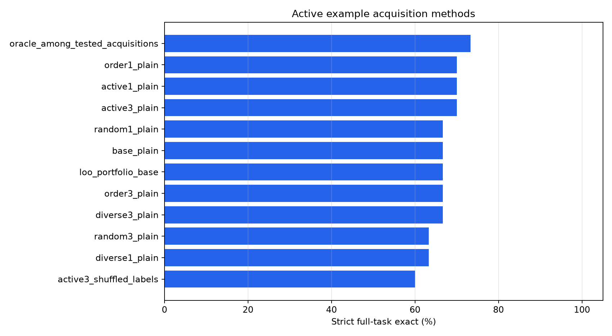
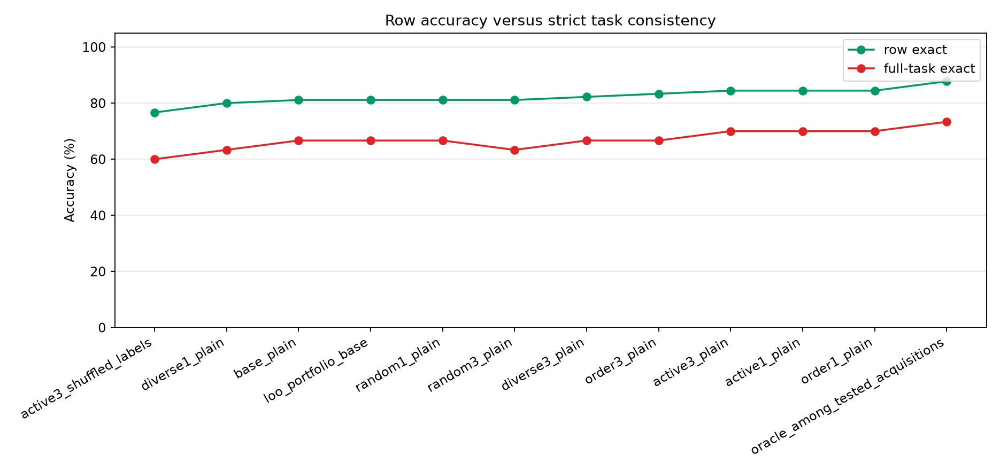
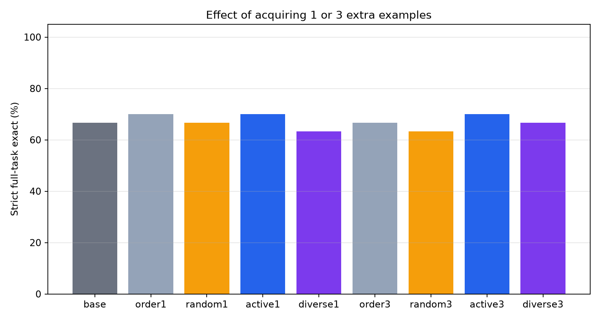
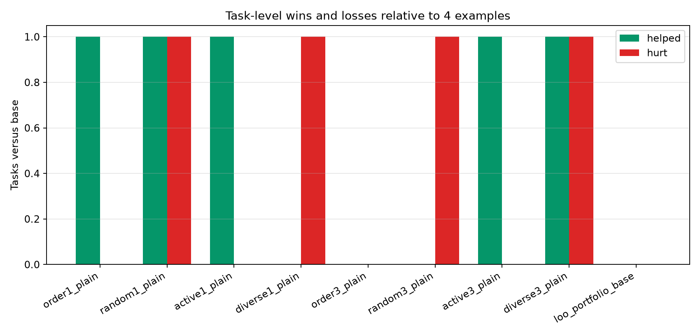
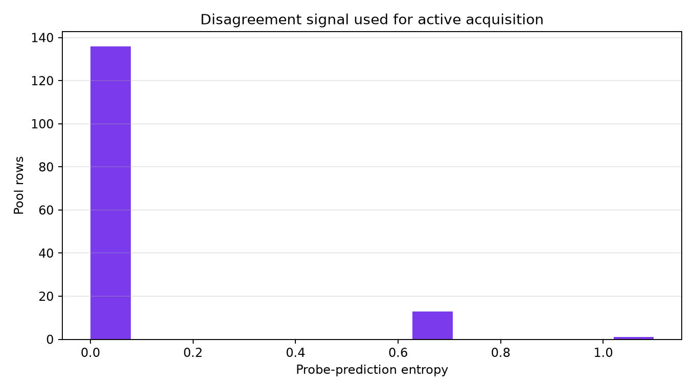
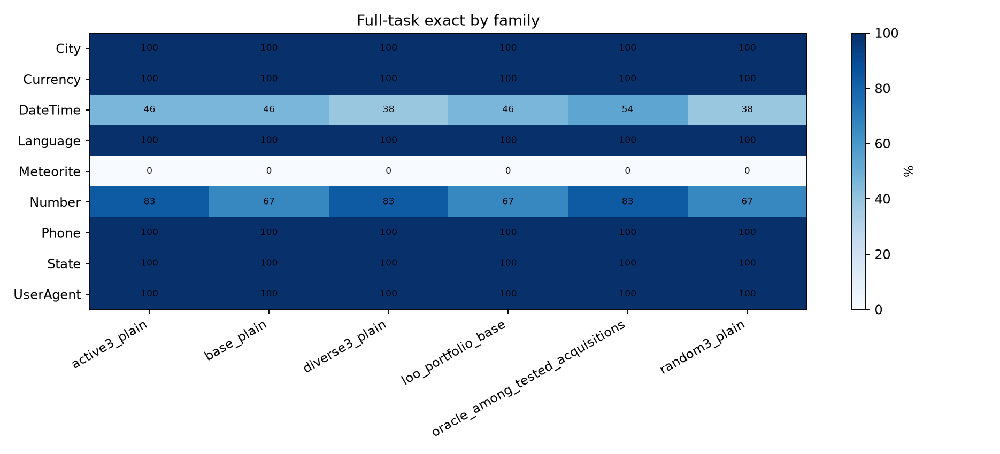

# Active Example Acquisition

## Question

Can a small number of actively selected clarifying examples improve strict held-out text-transformation accuracy?

Each task starts with four visible examples. The selector may reveal one or three additional examples from a separate acquisition pool before the model answers three held-out rows. The held-out rows are never used for acquisition.

## Setup

- Run: `main_final`
- Dataset: public text-transformation tasks.
- Tasks: `30`
- Visible examples per task: `4`
- Acquisition pool examples per task: `5`
- Held-out evaluation rows per task: `3`
- Probe variants for active disagreement: `plain, format, consistency`
- Generation records: `1890`

## Main Result

|method|tasks|mean_budget|row_exact|full_task_exact|
|---|---|---|---|---|
|oracle_among_tested_acquisitions|30|1.13|87.8%|73.3%|
|active1_plain|30|1.00|84.4%|70.0%|
|order1_plain|30|1.00|84.4%|70.0%|
|active3_plain|30|3.00|84.4%|70.0%|
|random1_plain|30|1.00|81.1%|66.7%|
|base_plain|30|0.00|81.1%|66.7%|
|loo_portfolio_base|30|0.00|81.1%|66.7%|
|diverse3_plain|30|3.00|82.2%|66.7%|
|order3_plain|30|3.00|83.3%|66.7%|
|diverse1_plain|30|1.00|80.0%|63.3%|
|random3_plain|30|3.00|81.1%|63.3%|
|active3_shuffled_labels|30|3.00|76.7%|60.0%|

## Interpretation

The baseline with four examples solves `66.7%` of tasks. Active acquisition solves `70.0%` with one extra example and `70.0%` with three extra examples. Input-diversity acquisition solves `66.7%` with three extra examples. Random three-example acquisition solves `63.3%`, order-three solves `66.7%`, and the shuffled-label control solves `60.0%`.

The hidden diagnostic oracle over the tested acquisition policies reaches `73.3%`, which measures whether any tested extra-example choice contained a better move. Visible-example portfolio selection reaches `66.7%`.

## Charts

## Task-Level Active Versus Random

|task_id|family|features|base|active3_exact|random3_exact|active_helped|active_hurt|active3_indices|random3_indices|loo_variant|
|---|---|---|---|---|---|---|---|---|---|---|
|Number.000017|Number|Numeric,NumericRounding|False|True|False|True|False|[3, 0, 1]|[1, 2, 4]|plain|
|City.000004|City|Conditional|True|True|True|False|False|[0, 1, 2]|[2, 3, 4]|plain|
|City.000012|City|Substring|True|True|True|False|False|[0, 1, 2]|[2, 3, 4]|plain|
|Currency.000003|Currency|Numeric,Substring|True|True|True|False|False|[0, 1, 2]|[0, 1, 2]|plain|
|Currency.000004|Currency|Numeric,Substring|True|True|True|False|False|[0, 1, 2]|[1, 2, 3]|plain|
|DateTime.000007|DateTime|DateTime|True|True|True|False|False|[0, 1, 2]|[1, 2, 4]|plain|
|DateTime.000015|DateTime|DateTime|False|False|False|False|False|[1, 2, 3]|[1, 2, 4]|plain|
|DateTime.000022|DateTime|DateTime|True|True|True|False|False|[0, 1, 2]|[0, 1, 2]|plain|
|DateTime.000023|DateTime|DateTime|False|False|False|False|False|[0, 1, 2]|[0, 2, 3]|plain|
|DateTime.000026|DateTime|DateTime|False|False|False|False|False|[0, 1, 2]|[1, 2, 4]|consistency|
|DateTime.000028|DateTime|DateTime|False|False|False|False|False|[1, 4, 0]|[0, 1, 3]|plain|
|DateTime.000029|DateTime|DateTime|False|False|False|False|False|[0, 2, 4]|[0, 1, 4]|plain|
|DateTime.000034|DateTime|DateTime,Substring|True|True|True|False|False|[0, 1, 2]|[0, 2, 4]|plain|
|DateTime.000090|DateTime|DateTime|True|True|False|False|False|[0, 1, 2]|[2, 3, 4]|plain|
|DateTime.000092|DateTime|DateTime|True|True|True|False|False|[0, 1, 2]|[0, 1, 3]|plain|
|DateTime.000107|DateTime|DateTime|True|True|True|False|False|[0, 1, 2]|[0, 2, 3]|plain|
|DateTime.000109|DateTime|DateTime|False|False|False|False|False|[0, 1, 3]|[0, 1, 4]|plain|
|DateTime.000115|DateTime|DateTimeRange,DateTimeRounding,DateTime|False|False|False|False|False|[0, 1, 2]|[0, 1, 3]|plain|
|Language.000002|Language|Multicolumn,Substring|True|True|True|False|False|[0, 1, 2]|[1, 3, 4]|plain|
|Meteorite.000001|Meteorite|Casing,Concatenation,DateTime,Multicolumn,Numeric,Substring|False|False|False|False|False|[3, 0, 1]|[1, 2, 4]|consistency|
|Number.000011|Number|Numeric,NumericRounding|True|True|True|False|False|[0, 1, 2]|[1, 2, 3]|plain|
|Number.000082|Number|Numeric|True|True|True|False|False|[0, 1, 2]|[1, 3, 4]|consistency|
|Number.000084|Number|Numeric,NumericRange,NumericRounding|False|False|False|False|False|[3, 0, 1]|[2, 3, 4]|plain|
|Number.000087|Number|Numeric,NumericRange,NumericRounding|True|True|True|False|False|[0, 1, 2]|[0, 3, 4]|plain|
|Number.000088|Number|Substring|True|True|True|False|False|[0, 1, 2]|[0, 1, 2]|plain|
|Phone.000003|Phone|Substring|True|True|True|False|False|[0, 1, 2]|[1, 2, 3]|plain|
|Phone.000005|Phone|Substring|True|True|True|False|False|[0, 1, 2]|[1, 2, 4]|plain|
|Phone.000006|Phone|Substring|True|True|True|False|False|[0, 1, 2]|[1, 2, 4]|plain|
|State.000003|State|Substring|True|True|True|False|False|[0, 1, 2]|[0, 2, 4]|plain|
|UserAgent.000006|UserAgent|Substring|True|True|True|False|False|[0, 1, 2]|[0, 2, 3]|plain|

## Acquisition Diagnostics

|task_id|family|features|active1|active3|diverse1|diverse3|random1|random3|loo_variant|loo_plain|loo_format|loo_consistency|
|---|---|---|---|---|---|---|---|---|---|---|---|---|
|City.000004|City|Conditional|[0]|[0, 1, 2]|[0]|[0, 1, 2]|[2]|[2, 3, 4]|plain|75.0%|75.0%|75.0%|
|City.000012|City|Substring|[0]|[0, 1, 2]|[2]|[2, 0, 4]|[2]|[2, 3, 4]|plain|100.0%|100.0%|100.0%|
|Currency.000003|Currency|Numeric,Substring|[0]|[0, 1, 2]|[0]|[0, 1, 2]|[2]|[0, 1, 2]|plain|100.0%|100.0%|100.0%|
|Currency.000004|Currency|Numeric,Substring|[0]|[0, 1, 2]|[0]|[0, 1, 2]|[2]|[1, 2, 3]|plain|100.0%|100.0%|100.0%|
|DateTime.000007|DateTime|DateTime|[0]|[0, 1, 2]|[0]|[0, 1, 2]|[2]|[1, 2, 4]|plain|100.0%|100.0%|100.0%|
|DateTime.000015|DateTime|DateTime|[1]|[1, 2, 3]|[4]|[4, 3, 0]|[4]|[1, 2, 4]|plain|0.0%|0.0%|0.0%|
|DateTime.000022|DateTime|DateTime|[0]|[0, 1, 2]|[3]|[3, 0, 1]|[2]|[0, 1, 2]|plain|75.0%|75.0%|50.0%|
|DateTime.000023|DateTime|DateTime|[0]|[0, 1, 2]|[3]|[3, 0, 1]|[0]|[0, 2, 3]|plain|75.0%|75.0%|75.0%|
|DateTime.000026|DateTime|DateTime|[0]|[0, 1, 2]|[3]|[3, 0, 1]|[1]|[1, 2, 4]|consistency|75.0%|75.0%|100.0%|
|DateTime.000028|DateTime|DateTime|[1]|[1, 4, 0]|[3]|[3, 2, 0]|[1]|[0, 1, 3]|plain|0.0%|0.0%|0.0%|
|DateTime.000029|DateTime|DateTime|[0]|[0, 2, 4]|[3]|[3, 0, 1]|[1]|[0, 1, 4]|plain|25.0%|0.0%|25.0%|
|DateTime.000034|DateTime|DateTime,Substring|[0]|[0, 1, 2]|[0]|[0, 1, 2]|[0]|[0, 2, 4]|plain|100.0%|100.0%|100.0%|
|DateTime.000090|DateTime|DateTime|[0]|[0, 1, 2]|[0]|[0, 1, 2]|[3]|[2, 3, 4]|plain|50.0%|50.0%|50.0%|
|DateTime.000092|DateTime|DateTime|[0]|[0, 1, 2]|[0]|[0, 1, 2]|[3]|[0, 1, 3]|plain|100.0%|100.0%|100.0%|
|DateTime.000107|DateTime|DateTime|[0]|[0, 1, 2]|[0]|[0, 1, 2]|[0]|[0, 2, 3]|plain|100.0%|100.0%|100.0%|
|DateTime.000109|DateTime|DateTime|[0]|[0, 1, 3]|[0]|[0, 1, 2]|[4]|[0, 1, 4]|plain|25.0%|25.0%|25.0%|
|DateTime.000115|DateTime|DateTimeRange,DateTimeRounding,DateTime|[0]|[0, 1, 2]|[0]|[0, 1, 2]|[1]|[0, 1, 3]|plain|100.0%|100.0%|100.0%|
|Language.000002|Language|Multicolumn,Substring|[0]|[0, 1, 2]|[2]|[2, 4, 3]|[4]|[1, 3, 4]|plain|100.0%|100.0%|100.0%|
|Meteorite.000001|Meteorite|Casing,Concatenation,DateTime,Multicolumn,Numeric,Substring|[3]|[3, 0, 1]|[3]|[3, 1, 4]|[2]|[1, 2, 4]|consistency|0.0%|0.0%|25.0%|
|Number.000011|Number|Numeric,NumericRounding|[0]|[0, 1, 2]|[1]|[1, 0, 2]|[3]|[1, 2, 3]|plain|75.0%|75.0%|75.0%|
|Number.000017|Number|Numeric,NumericRounding|[3]|[3, 0, 1]|[1]|[1, 0, 2]|[1]|[1, 2, 4]|plain|50.0%|50.0%|25.0%|
|Number.000082|Number|Numeric|[0]|[0, 1, 2]|[0]|[0, 1, 2]|[3]|[1, 3, 4]|consistency|75.0%|75.0%|100.0%|
|Number.000084|Number|Numeric,NumericRange,NumericRounding|[3]|[3, 0, 1]|[3]|[3, 0, 1]|[2]|[2, 3, 4]|plain|100.0%|100.0%|75.0%|
|Number.000087|Number|Numeric,NumericRange,NumericRounding|[0]|[0, 1, 2]|[0]|[0, 1, 2]|[0]|[0, 3, 4]|plain|100.0%|75.0%|75.0%|
|Number.000088|Number|Substring|[0]|[0, 1, 2]|[2]|[2, 0, 4]|[2]|[0, 1, 2]|plain|100.0%|100.0%|100.0%|
|Phone.000003|Phone|Substring|[0]|[0, 1, 2]|[0]|[0, 1, 2]|[2]|[1, 2, 3]|plain|100.0%|100.0%|100.0%|
|Phone.000005|Phone|Substring|[0]|[0, 1, 2]|[3]|[3, 0, 1]|[2]|[1, 2, 4]|plain|100.0%|75.0%|100.0%|
|Phone.000006|Phone|Substring|[0]|[0, 1, 2]|[3]|[3, 2, 4]|[2]|[1, 2, 4]|plain|100.0%|100.0%|100.0%|
|State.000003|State|Substring|[0]|[0, 1, 2]|[2]|[2, 0, 4]|[4]|[0, 2, 4]|plain|100.0%|100.0%|100.0%|
|UserAgent.000006|UserAgent|Substring|[0]|[0, 1, 2]|[0]|[0, 1, 2]|[3]|[0, 2, 3]|plain|100.0%|100.0%|100.0%|

## Family Breakdown

|method|family|tasks|row_exact|full_task_exact|
|---|---|---|---|---|
|active1_plain|City|2|100.0%|100.0%|
|active1_plain|Currency|2|100.0%|100.0%|
|active1_plain|DateTime|13|74.4%|53.8%|
|active1_plain|Language|1|100.0%|100.0%|
|active1_plain|Meteorite|1|33.3%|0.0%|
|active1_plain|Number|6|88.9%|66.7%|
|active1_plain|Phone|3|100.0%|100.0%|
|active1_plain|State|1|100.0%|100.0%|
|active1_plain|UserAgent|1|100.0%|100.0%|
|active3_plain|City|2|100.0%|100.0%|
|active3_plain|Currency|2|100.0%|100.0%|
|active3_plain|DateTime|13|69.2%|46.2%|
|active3_plain|Language|1|100.0%|100.0%|
|active3_plain|Meteorite|1|66.7%|0.0%|
|active3_plain|Number|6|94.4%|83.3%|
|active3_plain|Phone|3|100.0%|100.0%|
|active3_plain|State|1|100.0%|100.0%|
|active3_plain|UserAgent|1|100.0%|100.0%|
|active3_shuffled_labels|City|2|100.0%|100.0%|
|active3_shuffled_labels|Currency|2|100.0%|100.0%|
|active3_shuffled_labels|DateTime|13|66.7%|38.5%|
|active3_shuffled_labels|Language|1|100.0%|100.0%|
|active3_shuffled_labels|Meteorite|1|33.3%|0.0%|
|active3_shuffled_labels|Number|6|66.7%|50.0%|
|active3_shuffled_labels|Phone|3|100.0%|100.0%|
|active3_shuffled_labels|State|1|100.0%|100.0%|
|active3_shuffled_labels|UserAgent|1|100.0%|100.0%|
|base_plain|City|2|100.0%|100.0%|
|base_plain|Currency|2|100.0%|100.0%|
|base_plain|DateTime|13|69.2%|46.2%|
|base_plain|Language|1|100.0%|100.0%|
|base_plain|Meteorite|1|33.3%|0.0%|
|base_plain|Number|6|83.3%|66.7%|
|base_plain|Phone|3|100.0%|100.0%|
|base_plain|State|1|100.0%|100.0%|
|base_plain|UserAgent|1|100.0%|100.0%|
|diverse1_plain|City|2|100.0%|100.0%|
|diverse1_plain|Currency|2|100.0%|100.0%|
|diverse1_plain|DateTime|13|64.1%|38.5%|
|diverse1_plain|Language|1|100.0%|100.0%|
|diverse1_plain|Meteorite|1|33.3%|0.0%|
|diverse1_plain|Number|6|88.9%|66.7%|
|diverse1_plain|Phone|3|100.0%|100.0%|
|diverse1_plain|State|1|100.0%|100.0%|
|diverse1_plain|UserAgent|1|100.0%|100.0%|
|diverse3_plain|City|2|100.0%|100.0%|
|diverse3_plain|Currency|2|100.0%|100.0%|
|diverse3_plain|DateTime|13|66.7%|38.5%|
|diverse3_plain|Language|1|100.0%|100.0%|
|diverse3_plain|Meteorite|1|33.3%|0.0%|
|diverse3_plain|Number|6|94.4%|83.3%|
|diverse3_plain|Phone|3|100.0%|100.0%|
|diverse3_plain|State|1|100.0%|100.0%|
|diverse3_plain|UserAgent|1|100.0%|100.0%|
|loo_portfolio_base|City|2|100.0%|100.0%|
|loo_portfolio_base|Currency|2|100.0%|100.0%|
|loo_portfolio_base|DateTime|13|69.2%|46.2%|
|loo_portfolio_base|Language|1|100.0%|100.0%|
|loo_portfolio_base|Meteorite|1|33.3%|0.0%|
|loo_portfolio_base|Number|6|83.3%|66.7%|
|loo_portfolio_base|Phone|3|100.0%|100.0%|
|loo_portfolio_base|State|1|100.0%|100.0%|
|loo_portfolio_base|UserAgent|1|100.0%|100.0%|
|oracle_among_tested_acquisitions|City|2|100.0%|100.0%|
|oracle_among_tested_acquisitions|Currency|2|100.0%|100.0%|
|oracle_among_tested_acquisitions|DateTime|13|76.9%|53.8%|
|oracle_among_tested_acquisitions|Language|1|100.0%|100.0%|
|oracle_among_tested_acquisitions|Meteorite|1|66.7%|0.0%|
|oracle_among_tested_acquisitions|Number|6|94.4%|83.3%|
|oracle_among_tested_acquisitions|Phone|3|100.0%|100.0%|
|oracle_among_tested_acquisitions|State|1|100.0%|100.0%|
|oracle_among_tested_acquisitions|UserAgent|1|100.0%|100.0%|
|order1_plain|City|2|100.0%|100.0%|
|order1_plain|Currency|2|100.0%|100.0%|
|order1_plain|DateTime|13|71.8%|53.8%|
|order1_plain|Language|1|100.0%|100.0%|
|order1_plain|Meteorite|1|66.7%|0.0%|
|order1_plain|Number|6|88.9%|66.7%|
|order1_plain|Phone|3|100.0%|100.0%|
|order1_plain|State|1|100.0%|100.0%|
|order1_plain|UserAgent|1|100.0%|100.0%|
|order3_plain|City|2|100.0%|100.0%|
|order3_plain|Currency|2|100.0%|100.0%|
|order3_plain|DateTime|13|71.8%|46.2%|
|order3_plain|Language|1|100.0%|100.0%|
|order3_plain|Meteorite|1|33.3%|0.0%|
|order3_plain|Number|6|88.9%|66.7%|
|order3_plain|Phone|3|100.0%|100.0%|
|order3_plain|State|1|100.0%|100.0%|
|order3_plain|UserAgent|1|100.0%|100.0%|
|random1_plain|City|2|100.0%|100.0%|
|random1_plain|Currency|2|100.0%|100.0%|
|random1_plain|DateTime|13|66.7%|46.2%|
|random1_plain|Language|1|100.0%|100.0%|
|random1_plain|Meteorite|1|33.3%|0.0%|
|random1_plain|Number|6|88.9%|66.7%|
|random1_plain|Phone|3|100.0%|100.0%|
|random1_plain|State|1|100.0%|100.0%|
|random1_plain|UserAgent|1|100.0%|100.0%|
|random3_plain|City|2|100.0%|100.0%|
|random3_plain|Currency|2|100.0%|100.0%|
|random3_plain|DateTime|13|66.7%|38.5%|
|random3_plain|Language|1|100.0%|100.0%|
|random3_plain|Meteorite|1|33.3%|0.0%|
|random3_plain|Number|6|88.9%|66.7%|
|random3_plain|Phone|3|100.0%|100.0%|
|random3_plain|State|1|100.0%|100.0%|
|random3_plain|UserAgent|1|100.0%|100.0%|

## Files

- `runs/main_final/generations.csv`
- `runs/main_final/method_details.csv`
- `runs/main_final/acquisition_details.csv`
- `runs/main_final/summary.csv`
- `analysis/summary.csv`
- `analysis/method_details.csv`
- `analysis/acquisition_details.csv`
- `analysis/family_summary.csv`
