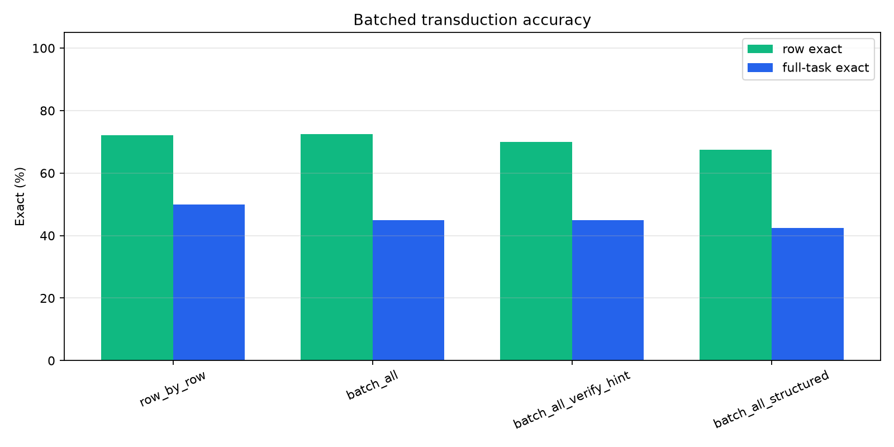
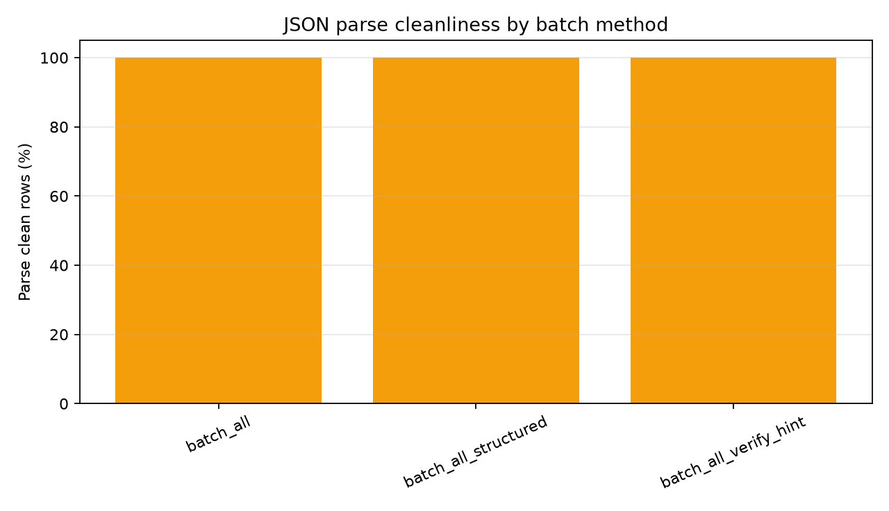
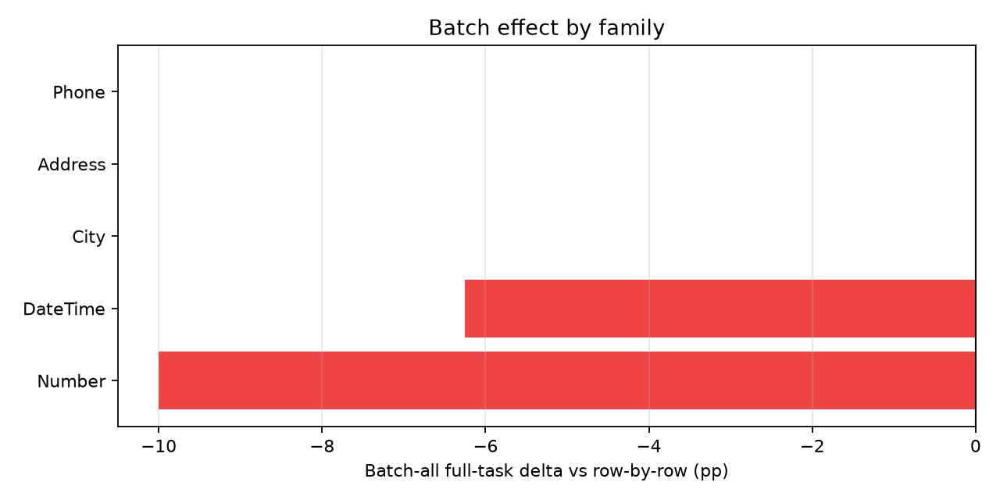
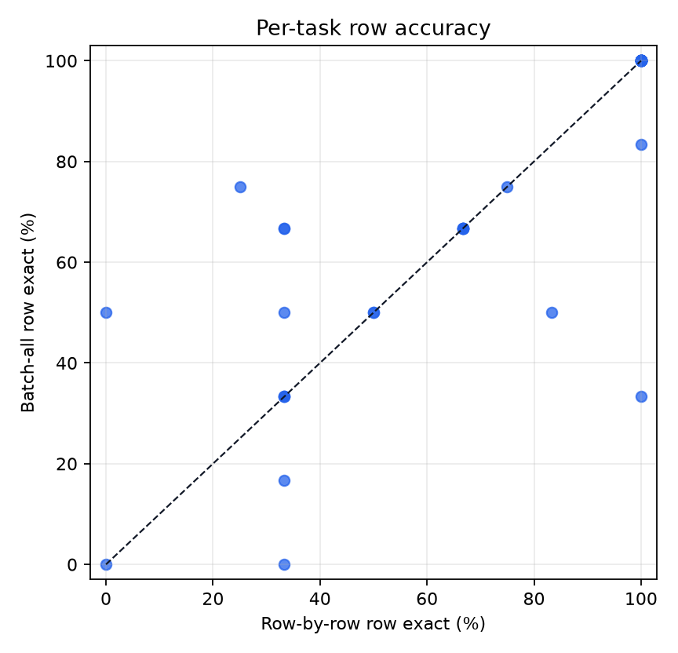
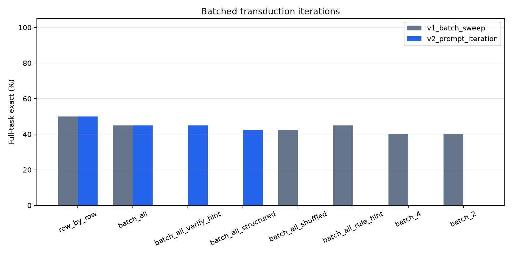

# Qwen Batched Transduction Consistency

## Abstract

This standalone experiment tests whether answering multiple query rows in one shared generation context improves task-level consistency on public text-transformation tasks. The strict primary metric is full-task exact: all held-out rows for a task must be answered exactly.

## Method

- Dataset: public `Transformation.Text` tasks.
- Split: first `4` examples are train examples; up to `6` held-out examples are scored.
- Row-by-row baseline: one prompt per held-out row.
- Batched transduction: one JSON-array output per query batch, with batch sizes 2, 4, and all held-out rows.
- Shuffled-order control: query rows are shuffled inside the batch and then unshuffled for scoring.
- Rule-hint arm: one-batch output with an instruction to use one consistent internal rule.
- Parse failures are counted directly; malformed or wrong-length JSON arrays receive empty predictions for missing rows.

## Run Configuration

- Suite: `main_v2_prompt_iteration`.
- Qwen model: `Qwen/Qwen3-4B`.
- Tasks: `40`.
- Held-out cap: `6`.
- Sample seed: `20260627`.

## Primary Results

### Prompt Iteration Result

|method|tasks|full_task_exact|row_exact|parse_ok_rate|
|---|---|---|---|---|
|batch_all|40|45.0%|72.5%|100.0%|
|batch_all_structured|40|42.5%|67.5%|100.0%|
|batch_all_verify_hint|40|45.0%|70.0%|100.0%|
|row_by_row|40|50.0%|72.1%|100.0%|

### Iteration Comparison

The first main run swept batch size and basic controls. The second main run kept the same 40-task sample and tested stricter batch prompts.

|iteration|method|tasks|full_task_exact|row_exact|parse_ok_rate|
|---|---|---|---|---|---|
|v1_batch_sweep|row_by_row|40|50.0%|72.1%|100.0%|
|v1_batch_sweep|batch_2|40|40.0%|70.2%|99.2%|
|v1_batch_sweep|batch_4|40|40.0%|71.7%|99.2%|
|v1_batch_sweep|batch_all|40|45.0%|72.5%|100.0%|
|v1_batch_sweep|batch_all_shuffled|40|42.5%|65.8%|100.0%|
|v1_batch_sweep|batch_all_rule_hint|40|45.0%|69.0%|100.0%|
|v2_prompt_iteration|row_by_row|40|50.0%|72.1%|100.0%|
|v2_prompt_iteration|batch_all|40|45.0%|72.5%|100.0%|
|v2_prompt_iteration|batch_all_verify_hint|40|45.0%|70.0%|100.0%|
|v2_prompt_iteration|batch_all_structured|40|42.5%|67.5%|100.0%|

### Batch-All Task Flips

- Batch-all wins over row-by-row on `0` tasks.
- Batch-all loses to row-by-row on `2` tasks.
- Batch-all ties row-by-row on `38` tasks.

### Family Summary

|family|method|tasks|full_task_exact|row_exact|
|---|---|---|---|---|
|Address|batch_all|2|0.0%|50.0%|
|Address|batch_all_structured|2|0.0%|50.0%|
|Address|batch_all_verify_hint|2|0.0%|50.0%|
|Address|row_by_row|2|0.0%|50.0%|
|BillingCode|batch_all|1|0.0%|0.0%|
|BillingCode|batch_all_structured|1|0.0%|0.0%|
|BillingCode|batch_all_verify_hint|1|0.0%|0.0%|
|BillingCode|row_by_row|1|0.0%|33.3%|
|City|batch_all|2|50.0%|87.5%|
|City|batch_all_structured|2|100.0%|100.0%|
|City|batch_all_verify_hint|2|100.0%|100.0%|
|City|row_by_row|2|50.0%|87.5%|
|Column|batch_all|1|100.0%|100.0%|
|Column|batch_all_structured|1|100.0%|100.0%|
|Column|batch_all_verify_hint|1|100.0%|100.0%|
|Column|row_by_row|1|100.0%|100.0%|
|DateTime|batch_all|16|50.0%|75.0%|
|DateTime|batch_all_structured|16|37.5%|69.8%|
|DateTime|batch_all_verify_hint|16|43.8%|72.9%|
|DateTime|row_by_row|16|56.2%|70.8%|
|FilePath|batch_all|1|100.0%|100.0%|
|FilePath|batch_all_structured|1|100.0%|100.0%|
|FilePath|batch_all_verify_hint|1|100.0%|100.0%|
|FilePath|row_by_row|1|100.0%|100.0%|
|Gender|batch_all|1|0.0%|66.7%|
|Gender|batch_all_structured|1|0.0%|66.7%|
|Gender|batch_all_verify_hint|1|0.0%|66.7%|
|Gender|row_by_row|1|0.0%|66.7%|
|Language|batch_all|1|100.0%|100.0%|
|Language|batch_all_structured|1|100.0%|100.0%|
|Language|batch_all_verify_hint|1|100.0%|100.0%|
|Language|row_by_row|1|100.0%|100.0%|
|Name|batch_all|1|100.0%|100.0%|
|Name|batch_all_structured|1|100.0%|100.0%|
|Name|batch_all_verify_hint|1|100.0%|100.0%|
|Name|row_by_row|1|100.0%|100.0%|
|Number|batch_all|10|20.0%|62.5%|
|Number|batch_all_structured|10|20.0%|48.3%|
|Number|batch_all_verify_hint|10|20.0%|53.3%|
|Number|row_by_row|10|30.0%|64.2%|
|Phone|batch_all|2|100.0%|100.0%|
|Phone|batch_all_structured|2|100.0%|100.0%|
|Phone|batch_all_verify_hint|2|100.0%|100.0%|
|Phone|row_by_row|2|100.0%|100.0%|
|ShippingCode|batch_all|1|0.0%|33.3%|
|ShippingCode|batch_all_structured|1|0.0%|33.3%|
|ShippingCode|batch_all_verify_hint|1|0.0%|33.3%|
|ShippingCode|row_by_row|1|0.0%|33.3%|
|UserAgent|batch_all|1|100.0%|100.0%|
|UserAgent|batch_all_structured|1|100.0%|100.0%|
|UserAgent|batch_all_verify_hint|1|100.0%|100.0%|
|UserAgent|row_by_row|1|100.0%|100.0%|

### Task Details

|task_id|family|method|heldout_rows|full_task_exact|row_exact|parse_ok_rate|
|---|---|---|---|---|---|---|
|Address.000002|Address|batch_all|3|False|33.3%|100.0%|
|Address.000002|Address|row_by_row|3|False|33.3%|100.0%|
|Address.000013|Address|batch_all|6|False|66.7%|100.0%|
|Address.000013|Address|row_by_row|6|False|66.7%|100.0%|
|BillingCode.000007|BillingCode|batch_all|3|False|0.0%|100.0%|
|BillingCode.000007|BillingCode|row_by_row|3|False|33.3%|100.0%|
|City.000010|City|batch_all|3|True|100.0%|100.0%|
|City.000010|City|row_by_row|3|True|100.0%|100.0%|
|City.000011|City|batch_all|4|False|75.0%|100.0%|
|City.000011|City|row_by_row|4|False|75.0%|100.0%|
|Column.000001|Column|batch_all|6|True|100.0%|100.0%|
|Column.000001|Column|row_by_row|6|True|100.0%|100.0%|
|DateTime.000004|DateTime|batch_all|6|True|100.0%|100.0%|
|DateTime.000004|DateTime|row_by_row|6|True|100.0%|100.0%|
|DateTime.000007|DateTime|batch_all|6|True|100.0%|100.0%|
|DateTime.000007|DateTime|row_by_row|6|True|100.0%|100.0%|
|DateTime.000017|DateTime|batch_all|6|True|100.0%|100.0%|
|DateTime.000017|DateTime|row_by_row|6|True|100.0%|100.0%|
|DateTime.000025|DateTime|batch_all|6|True|100.0%|100.0%|
|DateTime.000025|DateTime|row_by_row|6|True|100.0%|100.0%|
|DateTime.000027|DateTime|batch_all|6|False|66.7%|100.0%|
|DateTime.000027|DateTime|row_by_row|6|False|33.3%|100.0%|
|DateTime.000034|DateTime|batch_all|6|True|100.0%|100.0%|
|DateTime.000034|DateTime|row_by_row|6|True|100.0%|100.0%|
|DateTime.000051|DateTime|batch_all|3|False|33.3%|100.0%|
|DateTime.000051|DateTime|row_by_row|3|False|33.3%|100.0%|
|DateTime.000076|DateTime|batch_all|6|False|66.7%|100.0%|
|DateTime.000076|DateTime|row_by_row|6|False|66.7%|100.0%|
|DateTime.000081|DateTime|batch_all|6|False|50.0%|100.0%|
|DateTime.000081|DateTime|row_by_row|6|False|50.0%|100.0%|
|DateTime.000094|DateTime|batch_all|4|True|100.0%|100.0%|
|DateTime.000094|DateTime|row_by_row|4|True|100.0%|100.0%|
|DateTime.000104|DateTime|batch_all|6|True|100.0%|100.0%|
|DateTime.000104|DateTime|row_by_row|6|True|100.0%|100.0%|
|DateTime.000108|DateTime|batch_all|6|True|100.0%|100.0%|
|DateTime.000108|DateTime|row_by_row|6|True|100.0%|100.0%|
|DateTime.000111|DateTime|batch_all|6|False|83.3%|100.0%|
|DateTime.000111|DateTime|row_by_row|6|True|100.0%|100.0%|
|DateTime.000114|DateTime|batch_all|6|False|50.0%|100.0%|
|DateTime.000114|DateTime|row_by_row|6|False|0.0%|100.0%|
|DateTime.000115|DateTime|batch_all|6|False|0.0%|100.0%|
|DateTime.000115|DateTime|row_by_row|6|False|0.0%|100.0%|
|DateTime.000116|DateTime|batch_all|6|False|50.0%|100.0%|
|DateTime.000116|DateTime|row_by_row|6|False|50.0%|100.0%|
|FilePath.000001|FilePath|batch_all|6|True|100.0%|100.0%|
|FilePath.000001|FilePath|row_by_row|6|True|100.0%|100.0%|
|Gender.000001|Gender|batch_all|3|False|66.7%|100.0%|
|Gender.000001|Gender|row_by_row|3|False|66.7%|100.0%|
|Language.000002|Language|batch_all|6|True|100.0%|100.0%|
|Language.000002|Language|row_by_row|6|True|100.0%|100.0%|
|Name.000028|Name|batch_all|6|True|100.0%|100.0%|
|Name.000028|Name|row_by_row|6|True|100.0%|100.0%|
|Number.000008|Number|batch_all|6|False|16.7%|100.0%|
|Number.000008|Number|row_by_row|6|False|33.3%|100.0%|
|Number.000015|Number|batch_all|6|False|50.0%|100.0%|
|Number.000015|Number|row_by_row|6|False|33.3%|100.0%|
|Number.000016|Number|batch_all|6|False|50.0%|100.0%|
|Number.000016|Number|row_by_row|6|False|83.3%|100.0%|
|Number.000022|Number|batch_all|6|False|33.3%|100.0%|
|Number.000022|Number|row_by_row|6|True|100.0%|100.0%|
|Number.000028|Number|batch_all|3|True|100.0%|100.0%|
|Number.000028|Number|row_by_row|3|True|100.0%|100.0%|
|Number.000029|Number|batch_all|3|False|66.7%|100.0%|
|Number.000029|Number|row_by_row|3|False|66.7%|100.0%|
|Number.000043|Number|batch_all|6|True|100.0%|100.0%|
|Number.000043|Number|row_by_row|6|True|100.0%|100.0%|
|Number.000049|Number|batch_all|4|False|75.0%|100.0%|
|Number.000049|Number|row_by_row|4|False|25.0%|100.0%|
|Number.000075|Number|batch_all|6|False|66.7%|100.0%|
|Number.000075|Number|row_by_row|6|False|66.7%|100.0%|
|Number.000077|Number|batch_all|3|False|66.7%|100.0%|
|Number.000077|Number|row_by_row|3|False|33.3%|100.0%|
|Phone.000008|Phone|batch_all|6|True|100.0%|100.0%|
|Phone.000008|Phone|row_by_row|6|True|100.0%|100.0%|
|Phone.000011|Phone|batch_all|3|True|100.0%|100.0%|
|Phone.000011|Phone|row_by_row|3|True|100.0%|100.0%|
|ShippingCode.000008|ShippingCode|batch_all|3|False|33.3%|100.0%|
|ShippingCode.000008|ShippingCode|row_by_row|3|False|33.3%|100.0%|
|UserAgent.000003|UserAgent|batch_all|6|True|100.0%|100.0%|
|UserAgent.000003|UserAgent|row_by_row|6|True|100.0%|100.0%|

## Figures

## Interpretation

Row-by-row inference reaches 72.1% row exact and 50.0% full-task exact. Batch-all reaches 72.5% row exact and 45.0% full-task exact, a full-task delta of -5.0% and a row-exact delta of 0.4%.
The result is a clean negative for batched transduction as a general consistency fix in this setup. Batch-all slightly improves average row exact, but it never flips a row-by-row-failed task into a full-task success on the 40-task sample, and it loses two tasks that row-by-row solved. The batch-size sweep shows larger batches are better than smaller batches, but the best batched arm still trails row-by-row on full-task exact. The stricter prompt iteration does not recover the gap: verify-hint batch-all ties plain batch-all at 45.0%, while structured JSON input falls to 42.5%.
The shuffled-order control is lower than normal batch-all, so ordering and shared context carry some signal. The signal is not enough to overcome the new batch failure mode: one wrong element in the JSON array spoils full-task exact, and batch prompting sometimes changes correct row-by-row outputs into wrong batched outputs.

## Limitations

This run uses deterministic decoding and a capped task sample. Batched JSON output is stricter than ordinary text output, so parse cleanliness is reported separately. Full-task exact is intentionally harsh; a method can have high row exact while failing full-task exact because one row is wrong.

## Artifacts

- Task-level details: `analysis/task_details.csv`
- Row-level details: `analysis/row_details.csv`
- Summary: `analysis/summary.csv`
- Iteration comparison: `analysis/iteration_comparison.csv`
- Figures: `analysis/figures/`
- Benchmark mirror: `/workspace/large_artifacts/qwen_batched_transduction_consistency/prose-benchmarks`
