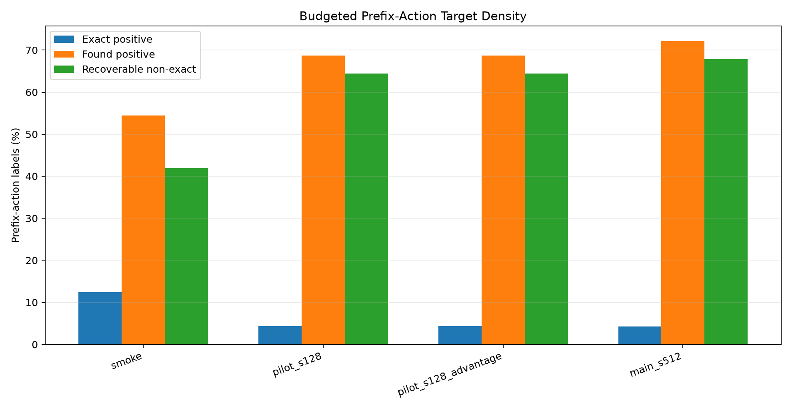
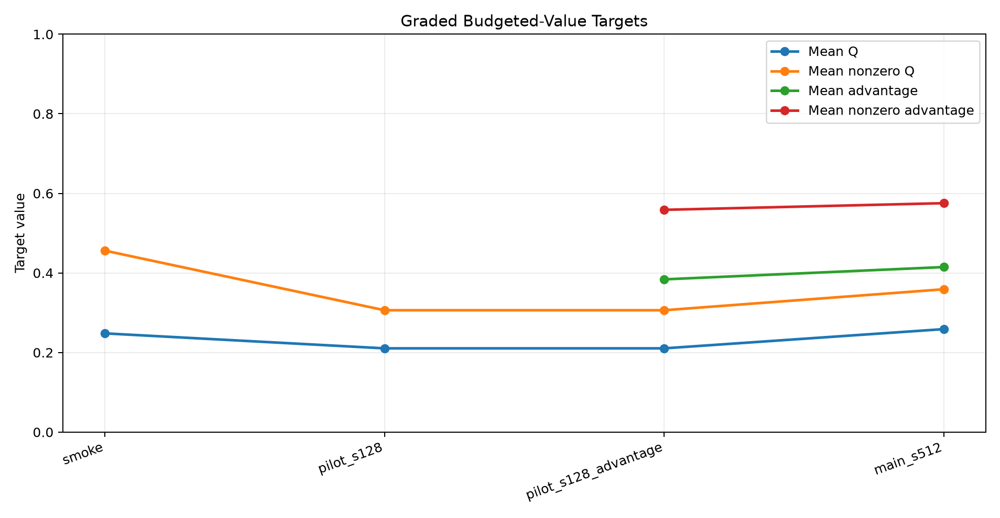
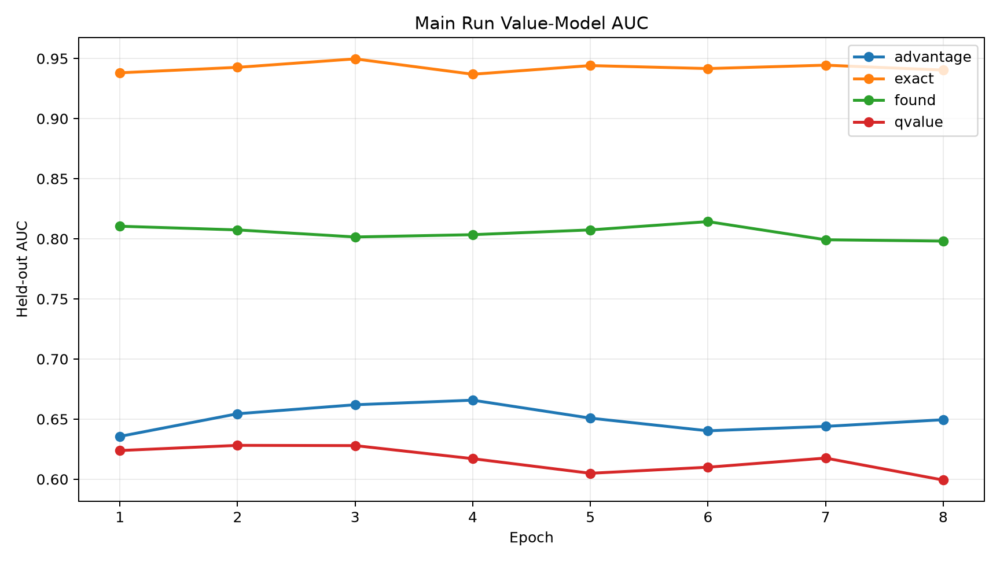
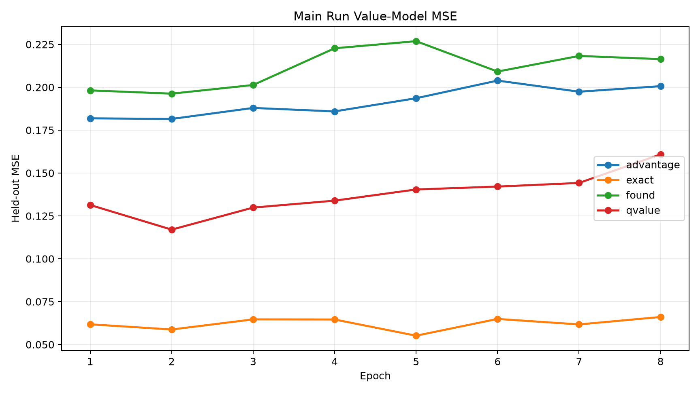
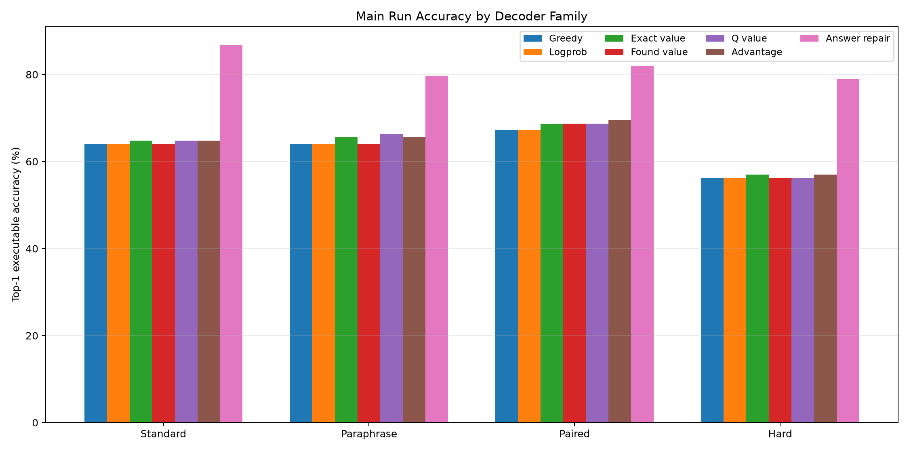
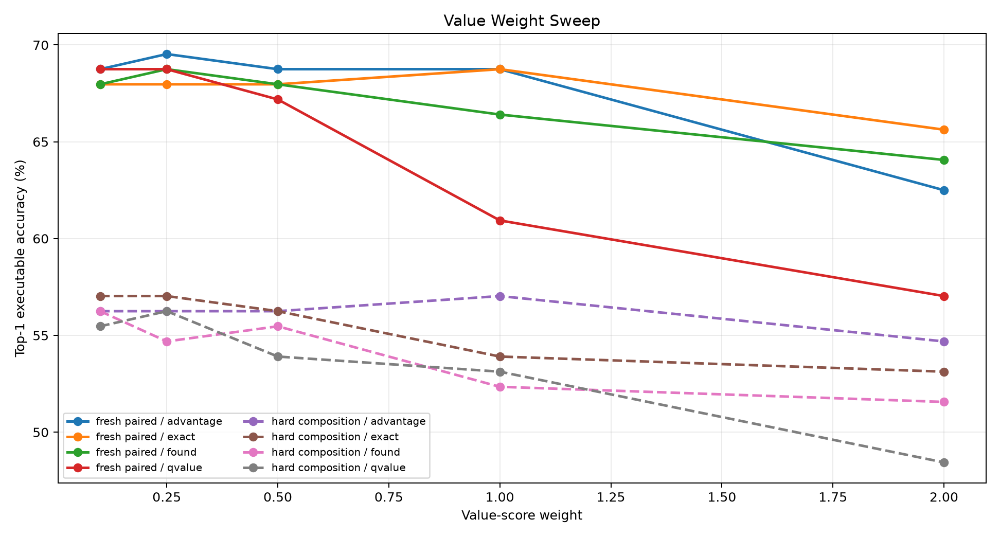
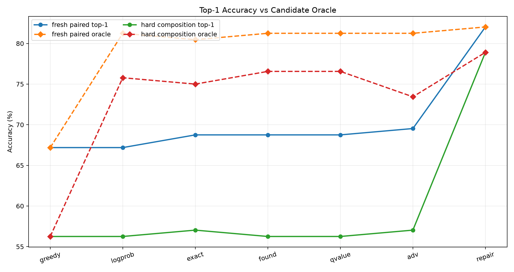
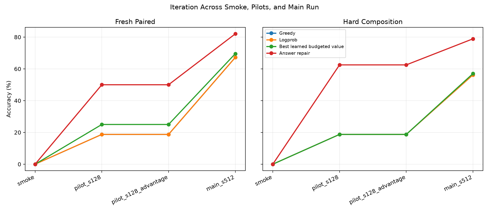

# Qwen Budgeted Action-Value Compiler

## Abstract

This experiment tests whether a frozen Qwen/Qwen3-4B prompt encoder can be paired with a small posttraining head that compiles natural-language tasks into executable typed bytecode, then uses learned budgeted action values to improve search without revealing the target answer at decode time.

The method trains a bytecode compiler head from supervised traces, collects prefix-action labels by bounded suffix search in a typed stack VM, and trains four action-value targets: canonical exact-prefix, binary recoverability, graded budgeted Q, and sibling-normalized advantage. The most important question is whether the learned values can close the gap between top-1 typed beam search and an answer-verified local repair oracle.

The answer is partly positive but not decisive. In the main run, the compiler reached 71.9% quick bytecode accuracy. On fresh paired tasks, greedy and logprob beam were 67.2%; the best learned budgeted value was 69.5% with `beam_advantage_w0.25`, and the answer-verified repair control reached 82.0%. On hard composition, greedy/logprob were 56.2%; learned value guidance reached 57.0% with `beam_advantage_w1`, while answer-verified repair reached 78.9%. The learned value signal is real, but the current lightweight ranker does not yet reproduce the oracle-like gains.

## Experimental Setup

The task distribution emits short natural-language prompts whose answers are computed by hidden programs over a compact typed stack VM. Programs can push constants, combine stack values with arithmetic and comparisons, take modulus 97, and read from two lookup tables. Evaluation is executable: a decoded program is valid only if it is stack-safe and returns the correct value.

The trainable system has two pieces:

- A frozen-Qwen feature extractor plus a small compiler head that predicts opcode logits, argument logits, and an auxiliary direct answer head.
- A partial-program value model that scores typed candidate actions during beam search.

The value data is collected from the compiler itself. For each partial prefix, the collector expands candidate actions, executes them into VM states, and runs bounded suffix search. Each action receives:

- `exact`: 1 if the action preserves the canonical supervised trace.
- `found`: 1 if a bounded suffix search can still complete to the correct answer.
- `qvalue`: a graded return based on the rank and margin of the best correct suffix completion.
- `advantage`: the action Q divided by the best sibling Q from the same prefix.

The answer-verified local repair decoder is included as a diagnostic upper-bound control. It is not a deployable no-answer decoder because it selects among candidate programs by executing them against the known target answer.

## Runs and Artifacts

The standalone directory contains a smoke run, two pilot runs, and the main run. Checkpoints are stored outside the experiment tree at `large_artifacts/qwen_budgeted_action_value_compiler/checkpoints/`.

Main run hardware: NVIDIA RTX 6000 Ada Generation.

## Target Distribution

*Budgeted suffix search makes many non-canonical actions recoverable; exact-prefix labels remain rare.*

*Raw Q and sibling-normalized advantage provide graded targets instead of only binary recoverability.*

| run_dir                                    | split   |   prefix_samples | exact_positive_rate   | found_positive_rate   |   mean_q_value | mean_advantage_value   |   mean_correct_rank |
|:-------------------------------------------|:--------|-----------------:|:----------------------|:----------------------|---------------:|:-----------------------|--------------------:|
| smoke_budgeted_action_value                | train   |             1386 | 12.5%                 | 54.4%                 |          0.248 | n/a                    |               3.617 |
| pilot_budgeted_action_value_s128           | train   |            15712 | 4.3%                  | 68.7%                 |          0.21  | n/a                    |               8.683 |
| pilot_budgeted_action_value_s128_advantage | train   |            15712 | 4.3%                  | 68.7%                 |          0.21  | 0.384                  |               8.683 |
| main_budgeted_action_value_s512            | train   |            67233 | 4.3%                  | 72.1%                 |          0.259 | 0.415                  |               7.686 |

In the main run, exact positives were 4.3% of train prefix actions, while recoverable `found` positives were 72.1%. This confirms that canonical trace supervision is too narrow to describe the action space: most actions are not canonical, but many can still be completed to the right answer.

## Value Training

*Exact-prefix labels are easiest to discriminate; found is learnable; graded Q and advantage are harder with this lightweight value head.*

*Graded targets have moderate regression error but weaker ranking AUC than exact-prefix supervision.*

Best held-out AUCs in the main run were exact 0.950, found 0.814, qvalue 0.628, and advantage 0.666. The result is consistent with the target definitions: exact-prefix classification is sparse but clean, found classification is broad and noisy, and graded budgeted values are richer but difficult to calibrate from the available features.

## Decoder Results

*Learned value guidance gives small top-1 gains over greedy/logprob search; answer-verified repair remains much stronger.*

| split            | family        | decoder              | accuracy   | program_exact   | oracle   |   mean_completed |
|:-----------------|:--------------|:---------------------|:-----------|:----------------|:---------|-----------------:|
| fresh_standard   | greedy        | greedy               | 64.1%      | 44.5%           | 64.1%    |              1   |
| fresh_standard   | logprob       | beam_logprob         | 64.1%      | 44.5%           | 83.6%    |             26.8 |
| fresh_standard   | exact         | beam_exact_w1        | 64.8%      | 46.9%           | 83.6%    |             26.3 |
| fresh_standard   | found         | beam_found_w0.1      | 64.1%      | 46.1%           | 82.8%    |             27   |
| fresh_standard   | qvalue        | beam_qvalue_w0.1     | 64.8%      | 46.1%           | 85.2%    |             27   |
| fresh_standard   | advantage     | beam_advantage_w0.5  | 64.8%      | 45.3%           | 85.2%    |             27.1 |
| fresh_standard   | answer_repair | local_answer         | 86.7%      | 53.1%           | 86.7%    |              1   |
| fresh_paraphrase | greedy        | greedy               | 64.1%      | 49.2%           | 64.1%    |              1   |
| fresh_paraphrase | logprob       | beam_logprob         | 64.1%      | 49.2%           | 78.9%    |             25.5 |
| fresh_paraphrase | exact         | beam_exact_w2        | 65.6%      | 50.0%           | 80.5%    |             25.4 |
| fresh_paraphrase | found         | beam_found_w0.1      | 64.1%      | 49.2%           | 78.9%    |             25.8 |
| fresh_paraphrase | qvalue        | beam_qvalue_w0.1     | 66.4%      | 49.2%           | 78.9%    |             25.8 |
| fresh_paraphrase | advantage     | beam_advantage_w0.25 | 65.6%      | 49.2%           | 78.9%    |             26   |
| fresh_paraphrase | answer_repair | local_answer         | 79.7%      | 53.1%           | 79.7%    |              1   |
| fresh_paired     | greedy        | greedy               | 67.2%      | 48.4%           | 67.2%    |              1   |
| fresh_paired     | logprob       | beam_logprob         | 67.2%      | 48.4%           | 81.2%    |             26.1 |
| fresh_paired     | exact         | beam_exact_w1        | 68.8%      | 49.2%           | 80.5%    |             26.1 |
| fresh_paired     | found         | beam_found_w0.25     | 68.8%      | 48.4%           | 81.2%    |             26.8 |
| fresh_paired     | qvalue        | beam_qvalue_w0.1     | 68.8%      | 48.4%           | 81.2%    |             26.5 |
| fresh_paired     | advantage     | beam_advantage_w0.25 | 69.5%      | 48.4%           | 81.2%    |             26.8 |
| fresh_paired     | answer_repair | local_answer         | 82.0%      | 54.7%           | 82.0%    |              1   |
| hard_composition | greedy        | greedy               | 56.2%      | 29.7%           | 56.2%    |              1   |
| hard_composition | logprob       | beam_logprob         | 56.2%      | 29.7%           | 75.8%    |             27.7 |
| hard_composition | exact         | beam_exact_w0.25     | 57.0%      | 29.7%           | 75.0%    |             27.5 |
| hard_composition | found         | beam_found_w0.1      | 56.2%      | 29.7%           | 76.6%    |             27.9 |
| hard_composition | qvalue        | beam_qvalue_w0.25    | 56.2%      | 29.7%           | 76.6%    |             28   |
| hard_composition | advantage     | beam_advantage_w1    | 57.0%      | 30.5%           | 73.4%    |             28.9 |
| hard_composition | answer_repair | local_answer         | 78.9%      | 32.8%           | 78.9%    |              1   |

Fresh paired accuracy improved from 67.2% greedy/logprob to 69.5% with the best advantage-guided beam and 68.8% with the best exact-prefix beam. Hard composition improved only slightly, from 56.2% to 57.0% for exact-prefix value and 57.0% for advantage value.

## Weight Sensitivity

*The useful value-weight range is narrow; over-weighting learned values tends to hurt beam ranking.*

The sweep shows that the learned value heads are not calibrated enough to dominate compiler log-probability. Small weights sometimes help, but larger weights frequently collapse back toward worse rankings. That matters because a scalable posttraining tweak needs a value signal that can safely override a local token or action prior when the prior is myopic.

## Oracle Gap

*Candidate sets often contain correct programs that the no-answer scorers fail to rank first.*

On fresh paired tasks, logprob beam top-1 accuracy was 67.2%, but its candidate oracle was 81.2%. On hard composition, logprob beam top-1 accuracy was 56.2%, while the candidate oracle was 75.8%. The value models recover only a small part of this slack. The repair control recovers much more because it uses the answer itself as a perfect verifier.

## Iteration Within This Experiment

*The main run strengthened the compiler and exposed the remaining gap between learned value ranking and answer-verified repair.*

The pilots were useful because they separated three failure modes: a weak compiler, overly broad recoverability labels, and weak calibration of graded values. The main run addressed the first issue but preserved the ranking gap. This points away from simply scaling the same value head and toward training methods that make the model imitate the answer-verified selector or learn from execution traces more directly.

## Interpretation

The experiment supports three claims.

1. A small posttraining head can compile frozen-Qwen prompt features into executable bytecode with nontrivial generalization.
2. Bounded suffix search reveals a much broader recoverable action set than canonical trace supervision.
3. A lightweight learned value ranker is not enough to reproduce the gains of answer-verified candidate selection.

The third point is the critical one. The system already generates correct programs in the candidate set more often than it selects them. The next high-impact direction is therefore not another partial-program classifier. It is a stronger supervision loop that distills the answer-verified selector into a deployable scorer, or a policy-gradient procedure that uses execution reward to update the program policy over complete candidates.

## Recommended Next Experiment

Train a selector or reranker directly on complete candidate programs sampled from the compiler beam, with positives chosen by execution and negatives chosen from near-miss candidates. The reranker should consume the prompt, bytecode, execution trace, and final stack state, then predict correctness without seeing the answer. That moves supervision much closer to the 82%/79% repair oracle while preserving a deployable no-answer inference path.

The strongest variant would combine supervised contrastive reranking with hard-negative mining:

- Generate 32-64 complete candidate programs per prompt.
- Execute all candidates during training only.
- Mark candidates correct by target answer and retain hard incorrect candidates with high compiler score.
- Train a frozen-Qwen-attached reranker, optionally with LoRA or PEFT, to score complete programs.
- Decode by compiler beam plus reranker top-1, with local repair retained only as an oracle control.

This is the shortest path from the current result toward a practical Qwen-attached program executor: it attacks the observed ranking bottleneck directly instead of hoping that prefix-level value targets will indirectly learn the same selection rule.
