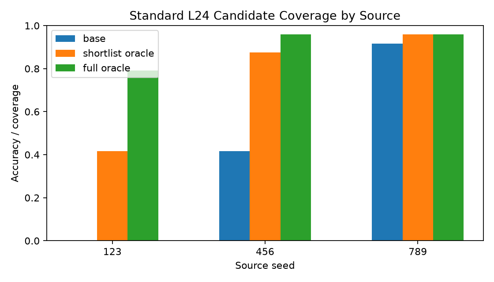
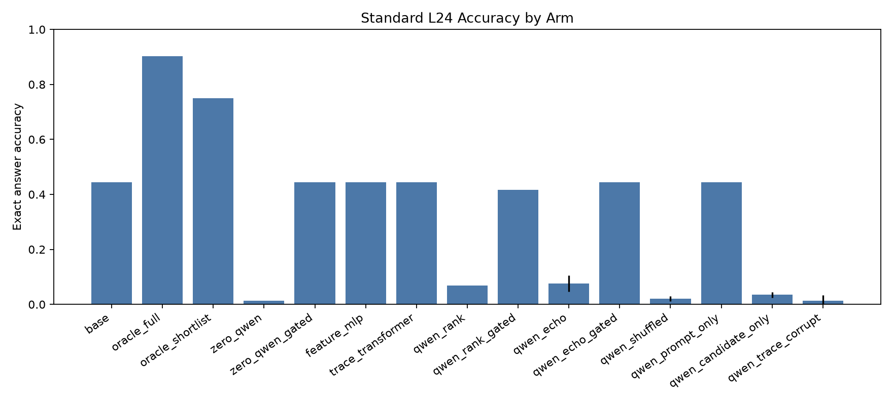
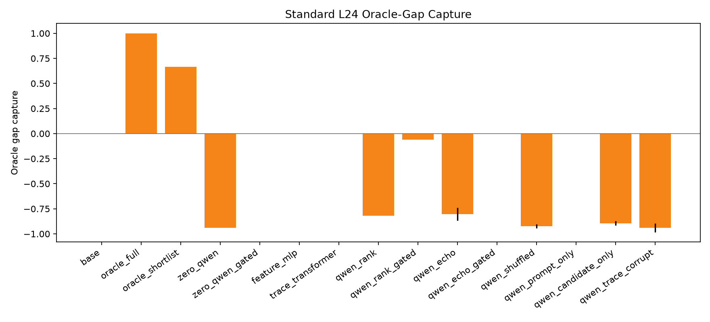
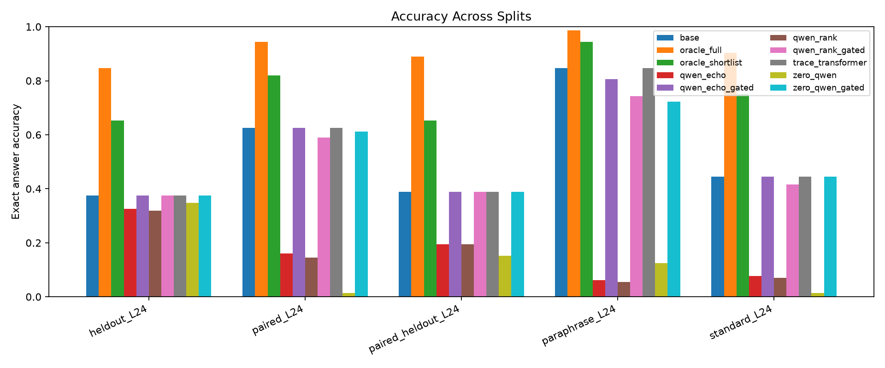

# Qwen Candidate-Conditioned Trace Verifier Report

## Summary

This standalone experiment tests whether a Qwen reader can score concrete executable repair candidates. Each candidate contains a program and execution trace. Learned selectors are trained only from offline labels; at inference they do not receive the target answer or target state.

On `standard_L24`, no non-oracle selector improved over the no-repair base policy: base was 44.4%, the best tied selector accuracy was 44.4% (feature_mlp, qwen_echo_gated, trace_transformer, zero_qwen_gated), deployable-shortlist oracle accuracy was 75.0%, and full-pool oracle accuracy was 90.3%.

Ungated candidate-conditioned Qwen selectors usually over-edited and damaged correct base programs; validation-gated variants avoided most damage by falling back to the base candidate, but did not recover the reachable repair gap.

## Setup

- Base reader: `Qwen/Qwen3-4B`.

- Candidate shortlist size: `64`.

- Held-out source seed: `789`.

- Train groups per non-held-out source: `32`; validation groups per non-held-out source: `12`; eval groups per source/split: `24`.

Selectors:

- `base`: no repair.

- `oracle_full`: best answer-correct candidate in the full candidate pool.

- `oracle_shortlist`: best answer-correct candidate in the deployable shortlist.

- `zero_qwen`: frozen Qwen yes/no score with no training.

- `zero_qwen_gated`: frozen Qwen score with validation-tuned base fallback.

- `feature_mlp`: feature-only learned baseline.

- `trace_transformer`: small trace-only learned baseline.

- `qwen_rank`: Qwen embedding plus groupwise ranking head.

- `qwen_rank_gated`: Qwen ranking head with validation-tuned base fallback.

- `qwen_echo`: same ranking head with auxiliary candidate trace prediction.

- `qwen_echo_gated`: ECHO-ablation head with validation-tuned base fallback.

- Control arms: shuffled labels, prompt-only, candidate-only, and trace-corrupted candidate reading.

## Candidate Coverage

| split              |   groups |   avg_full_candidates |   avg_shortlist | base_accuracy   | shortlist_oracle_accuracy   | full_oracle_accuracy   | shortlist_oracle_capture   |
|:-------------------|---------:|----------------------:|----------------:|:----------------|:----------------------------|:-----------------------|:---------------------------|
| heldout_L24        |       72 |                   177 |              64 | 37.5%           | 65.3%                       | 84.7%                  | 77.0%                      |
| paired_L24         |       72 |                   177 |              64 | 62.5%           | 81.9%                       | 94.4%                  | 86.8%                      |
| paired_heldout_L24 |       72 |                   177 |              64 | 38.9%           | 65.3%                       | 88.9%                  | 73.4%                      |
| paraphrase_L24     |       72 |                   177 |              64 | 84.7%           | 94.4%                       | 98.6%                  | 95.8%                      |
| standard_L24       |       72 |                   177 |              64 | 44.4%           | 75.0%                       | 90.3%                  | 83.1%                      |
| train_mixed_L24    |       64 |                   177 |              64 | 81.2%           | 96.9%                       | 100.0%                 | 96.9%                      |
| val_mixed_L24      |       24 |                   177 |              64 | 75.0%           | 83.3%                       | 91.7%                  | 90.9%                      |

## Standard L24 Gate

| arm                 | mean_accuracy   | mean_gap_capture   |   mean_changed |   mean_damage |   mean_recovery |
|:--------------------|:----------------|:-------------------|---------------:|--------------:|----------------:|
| base                | 44.4%           | 0.0%               |          0     |         0     |           0     |
| feature_mlp         | 44.4%           | 0.0%               |          0     |         0     |           0     |
| oracle_full         | 90.3%           | 100.0%             |          0.458 |         0     |           0.825 |
| oracle_shortlist    | 75.0%           | 66.7%              |          0.306 |         0     |           0.55  |
| qwen_candidate_only | 3.5%            | -89.4%             |          0.993 |         0.922 |           0     |
| qwen_echo           | 7.6%            | -80.3%             |          0.924 |         0.859 |           0.025 |
| qwen_echo_gated     | 44.4%           | 0.0%               |          0.035 |         0     |           0     |
| qwen_prompt_only    | 44.4%           | 0.0%               |          0     |         0     |           0     |
| qwen_rank           | 6.9%            | -81.8%             |          0.924 |         0.875 |           0.025 |
| qwen_rank_gated     | 41.7%           | -6.1%              |          0.104 |         0.062 |           0     |
| qwen_shuffled       | 2.1%            | -92.4%             |          0.979 |         0.969 |           0.013 |
| qwen_trace_corrupt  | 1.4%            | -93.9%             |          0.979 |         0.984 |           0.013 |
| trace_transformer   | 44.4%           | 0.0%               |          0     |         0     |           0     |
| zero_qwen           | 1.4%            | -93.9%             |          0.972 |         0.969 |           0     |
| zero_qwen_gated     | 44.4%           | 0.0%               |          0     |         0     |           0     |

## Split Results

| split              | arm               |   seed | accuracy   | gap_capture   | changed_fraction   | damage_rate   | recovery_rate   |
|:-------------------|:------------------|-------:|:-----------|:--------------|:-------------------|:--------------|:----------------|
| heldout_L24        | base              |     -1 | 37.5%      | 0.0%          | 0.0%               | 0.0%          | 0.0%            |
| paired_L24         | base              |     -1 | 62.5%      | 0.0%          | 0.0%               | 0.0%          | 0.0%            |
| paired_heldout_L24 | base              |     -1 | 38.9%      | 0.0%          | 0.0%               | 0.0%          | 0.0%            |
| paraphrase_L24     | base              |     -1 | 84.7%      | 0.0%          | 0.0%               | 0.0%          | 0.0%            |
| standard_L24       | base              |     -1 | 44.4%      | 0.0%          | 0.0%               | 0.0%          | 0.0%            |
| heldout_L24        | oracle_full       |     -1 | 84.7%      | 100.0%        | 47.2%              | 0.0%          | 75.6%           |
| paired_L24         | oracle_full       |     -1 | 94.4%      | 100.0%        | 31.9%              | 0.0%          | 85.2%           |
| paired_heldout_L24 | oracle_full       |     -1 | 88.9%      | 100.0%        | 50.0%              | 0.0%          | 81.8%           |
| paraphrase_L24     | oracle_full       |     -1 | 98.6%      | 100.0%        | 13.9%              | 0.0%          | 90.9%           |
| standard_L24       | oracle_full       |     -1 | 90.3%      | 100.0%        | 45.8%              | 0.0%          | 82.5%           |
| heldout_L24        | oracle_shortlist  |     -1 | 65.3%      | 58.8%         | 27.8%              | 0.0%          | 44.4%           |
| paired_L24         | oracle_shortlist  |     -1 | 81.9%      | 60.9%         | 19.4%              | 0.0%          | 51.9%           |
| paired_heldout_L24 | oracle_shortlist  |     -1 | 65.3%      | 52.8%         | 26.4%              | 0.0%          | 43.2%           |
| paraphrase_L24     | oracle_shortlist  |     -1 | 94.4%      | 70.0%         | 9.7%               | 0.0%          | 63.6%           |
| standard_L24       | oracle_shortlist  |     -1 | 75.0%      | 66.7%         | 30.6%              | 0.0%          | 55.0%           |
| heldout_L24        | zero_qwen         |     -1 | 34.7%      | -5.9%         | 4.2%               | 7.4%          | 0.0%            |
| paired_L24         | zero_qwen         |     -1 | 1.4%       | -191.3%       | 98.6%              | 100.0%        | 3.7%            |
| paired_heldout_L24 | zero_qwen         |     -1 | 15.3%      | -47.2%        | 54.2%              | 60.7%         | 0.0%            |
| paraphrase_L24     | zero_qwen         |     -1 | 12.5%      | -520.0%       | 87.5%              | 85.2%         | 0.0%            |
| standard_L24       | zero_qwen         |     -1 | 1.4%       | -93.9%        | 97.2%              | 96.9%         | 0.0%            |
| heldout_L24        | zero_qwen_gated   |     -1 | 37.5%      | 0.0%          | 0.0%               | 0.0%          | 0.0%            |
| paired_L24         | zero_qwen_gated   |     -1 | 61.1%      | -4.3%         | 1.4%               | 2.2%          | 0.0%            |
| paired_heldout_L24 | zero_qwen_gated   |     -1 | 38.9%      | 0.0%          | 0.0%               | 0.0%          | 0.0%            |
| paraphrase_L24     | zero_qwen_gated   |     -1 | 72.2%      | -90.0%        | 12.5%              | 14.8%         | 0.0%            |
| standard_L24       | zero_qwen_gated   |     -1 | 44.4%      | 0.0%          | 0.0%               | 0.0%          | 0.0%            |
| heldout_L24        | feature_mlp       |    101 | 37.5%      | 0.0%          | 0.0%               | 0.0%          | 0.0%            |
| paired_L24         | feature_mlp       |    101 | 62.5%      | 0.0%          | 0.0%               | 0.0%          | 0.0%            |
| paired_heldout_L24 | feature_mlp       |    101 | 38.9%      | 0.0%          | 0.0%               | 0.0%          | 0.0%            |
| paraphrase_L24     | feature_mlp       |    101 | 84.7%      | 0.0%          | 0.0%               | 0.0%          | 0.0%            |
| standard_L24       | feature_mlp       |    101 | 44.4%      | 0.0%          | 0.0%               | 0.0%          | 0.0%            |
| heldout_L24        | trace_transformer |    101 | 37.5%      | 0.0%          | 0.0%               | 0.0%          | 0.0%            |
| paired_L24         | trace_transformer |    101 | 62.5%      | 0.0%          | 0.0%               | 0.0%          | 0.0%            |
| paired_heldout_L24 | trace_transformer |    101 | 38.9%      | 0.0%          | 0.0%               | 0.0%          | 0.0%            |
| paraphrase_L24     | trace_transformer |    101 | 84.7%      | 0.0%          | 0.0%               | 0.0%          | 0.0%            |
| standard_L24       | trace_transformer |    101 | 44.4%      | 0.0%          | 0.0%               | 0.0%          | 0.0%            |
| heldout_L24        | qwen_rank         |    101 | 31.9%      | -11.8%        | 13.9%              | 14.8%         | 0.0%            |
| paired_L24         | qwen_rank         |    101 | 16.7%      | -143.5%       | 86.1%              | 77.8%         | 7.4%            |
| paired_heldout_L24 | qwen_rank         |    101 | 19.4%      | -38.9%        | 61.1%              | 57.1%         | 4.5%            |
| paraphrase_L24     | qwen_rank         |    101 | 6.9%       | -560.0%       | 94.4%              | 93.4%         | 9.1%            |
| standard_L24       | qwen_rank         |    101 | 6.9%       | -81.8%        | 91.7%              | 87.5%         | 2.5%            |
| heldout_L24        | qwen_rank_gated   |    101 | 37.5%      | 0.0%          | 0.0%               | 0.0%          | 0.0%            |
| paired_L24         | qwen_rank_gated   |    101 | 59.7%      | -8.7%         | 9.7%               | 6.7%          | 3.7%            |
| paired_heldout_L24 | qwen_rank_gated   |    101 | 38.9%      | 0.0%          | 0.0%               | 0.0%          | 0.0%            |
| paraphrase_L24     | qwen_rank_gated   |    101 | 73.6%      | -80.0%        | 13.9%              | 14.8%         | 9.1%            |
| standard_L24       | qwen_rank_gated   |    101 | 41.7%      | -6.1%         | 9.7%               | 6.2%          | 0.0%            |
| heldout_L24        | qwen_echo         |    101 | 31.9%      | -11.8%        | 15.3%              | 14.8%         | 0.0%            |
| paired_L24         | qwen_echo         |    101 | 16.7%      | -143.5%       | 86.1%              | 77.8%         | 7.4%            |
| paired_heldout_L24 | qwen_echo         |    101 | 22.2%      | -33.3%        | 56.9%              | 50.0%         | 4.5%            |
| paraphrase_L24     | qwen_echo         |    101 | 5.6%       | -570.0%       | 94.4%              | 93.4%         | 0.0%            |
| standard_L24       | qwen_echo         |    101 | 9.7%       | -75.8%        | 90.3%              | 81.2%         | 2.5%            |
| heldout_L24        | qwen_echo_gated   |    101 | 37.5%      | 0.0%          | 0.0%               | 0.0%          | 0.0%            |
| paired_L24         | qwen_echo_gated   |    101 | 62.5%      | 0.0%          | 1.4%               | 0.0%          | 0.0%            |
| paired_heldout_L24 | qwen_echo_gated   |    101 | 38.9%      | 0.0%          | 0.0%               | 0.0%          | 0.0%            |
| paraphrase_L24     | qwen_echo_gated   |    101 | 80.6%      | -30.0%        | 4.2%               | 4.9%          | 0.0%            |
| standard_L24       | qwen_echo_gated   |    101 | 44.4%      | 0.0%          | 6.9%               | 0.0%          | 0.0%            |
| heldout_L24        | feature_mlp       |    202 | 37.5%      | 0.0%          | 0.0%               | 0.0%          | 0.0%            |
| paired_L24         | feature_mlp       |    202 | 62.5%      | 0.0%          | 0.0%               | 0.0%          | 0.0%            |
| paired_heldout_L24 | feature_mlp       |    202 | 38.9%      | 0.0%          | 0.0%               | 0.0%          | 0.0%            |
| paraphrase_L24     | feature_mlp       |    202 | 84.7%      | 0.0%          | 0.0%               | 0.0%          | 0.0%            |
| standard_L24       | feature_mlp       |    202 | 44.4%      | 0.0%          | 0.0%               | 0.0%          | 0.0%            |
| heldout_L24        | trace_transformer |    202 | 37.5%      | 0.0%          | 0.0%               | 0.0%          | 0.0%            |
| paired_L24         | trace_transformer |    202 | 62.5%      | 0.0%          | 0.0%               | 0.0%          | 0.0%            |
| paired_heldout_L24 | trace_transformer |    202 | 38.9%      | 0.0%          | 0.0%               | 0.0%          | 0.0%            |
| paraphrase_L24     | trace_transformer |    202 | 84.7%      | 0.0%          | 0.0%               | 0.0%          | 0.0%            |
| standard_L24       | trace_transformer |    202 | 44.4%      | 0.0%          | 0.0%               | 0.0%          | 0.0%            |
| heldout_L24        | qwen_rank         |    202 | 31.9%      | -11.8%        | 15.3%              | 14.8%         | 0.0%            |
| paired_L24         | qwen_rank         |    202 | 12.5%      | -156.5%       | 88.9%              | 84.4%         | 7.4%            |
| paired_heldout_L24 | qwen_rank         |    202 | 19.4%      | -38.9%        | 61.1%              | 53.6%         | 2.3%            |
| paraphrase_L24     | qwen_rank         |    202 | 4.2%       | -580.0%       | 95.8%              | 95.1%         | 0.0%            |
| standard_L24       | qwen_rank         |    202 | 6.9%       | -81.8%        | 93.1%              | 87.5%         | 2.5%            |
| heldout_L24        | qwen_rank_gated   |    202 | 37.5%      | 0.0%          | 0.0%               | 0.0%          | 0.0%            |
| paired_L24         | qwen_rank_gated   |    202 | 58.3%      | -13.0%        | 9.7%               | 6.7%          | 0.0%            |
| paired_heldout_L24 | qwen_rank_gated   |    202 | 38.9%      | 0.0%          | 1.4%               | 0.0%          | 0.0%            |
| paraphrase_L24     | qwen_rank_gated   |    202 | 75.0%      | -70.0%        | 13.9%              | 11.5%         | 0.0%            |
| standard_L24       | qwen_rank_gated   |    202 | 41.7%      | -6.1%         | 11.1%              | 6.2%          | 0.0%            |
| heldout_L24        | qwen_echo         |    202 | 33.3%      | -8.8%         | 11.1%              | 11.1%         | 0.0%            |
| paired_L24         | qwen_echo         |    202 | 15.3%      | -147.8%       | 87.5%              | 80.0%         | 7.4%            |
| paired_heldout_L24 | qwen_echo         |    202 | 16.7%      | -44.4%        | 62.5%              | 60.7%         | 2.3%            |
| paraphrase_L24     | qwen_echo         |    202 | 6.9%       | -560.0%       | 93.1%              | 91.8%         | 0.0%            |
| standard_L24       | qwen_echo         |    202 | 5.6%       | -84.8%        | 94.4%              | 90.6%         | 2.5%            |

## Held-Out Source Readout

| arm                 |   seed | accuracy   | base_accuracy   | oracle_accuracy   | gap_capture   | changed_fraction   | damage_rate   | recovery_rate   |
|:--------------------|-------:|:-----------|:----------------|:------------------|:--------------|:-------------------|:--------------|:----------------|
| base                |     -1 | 91.7%      | 91.7%           | 95.8%             | 0.0%          | 0.0%               | 0.0%          | 0.0%            |
| oracle_full         |     -1 | 95.8%      | 91.7%           | 95.8%             | 100.0%        | 4.2%               | 0.0%          | 50.0%           |
| oracle_shortlist    |     -1 | 95.8%      | 91.7%           | 95.8%             | 100.0%        | 4.2%               | 0.0%          | 50.0%           |
| zero_qwen           |     -1 | 0.0%       | 91.7%           | 95.8%             | -2200.0%      | 100.0%             | 100.0%        | 0.0%            |
| zero_qwen_gated     |     -1 | 91.7%      | 91.7%           | 95.8%             | 0.0%          | 0.0%               | 0.0%          | 0.0%            |
| feature_mlp         |    101 | 91.7%      | 91.7%           | 95.8%             | 0.0%          | 0.0%               | 0.0%          | 0.0%            |
| trace_transformer   |    101 | 91.7%      | 91.7%           | 95.8%             | 0.0%          | 0.0%               | 0.0%          | 0.0%            |
| qwen_rank           |    101 | 8.3%       | 91.7%           | 95.8%             | -2000.0%      | 91.7%              | 90.9%         | 0.0%            |
| qwen_rank_gated     |    101 | 87.5%      | 91.7%           | 95.8%             | -100.0%       | 4.2%               | 4.5%          | 0.0%            |
| qwen_echo           |    101 | 12.5%      | 91.7%           | 95.8%             | -1900.0%      | 87.5%              | 86.4%         | 0.0%            |
| qwen_echo_gated     |    101 | 91.7%      | 91.7%           | 95.8%             | 0.0%          | 0.0%               | 0.0%          | 0.0%            |
| qwen_shuffled       |    101 | 4.2%       | 91.7%           | 95.8%             | -2100.0%      | 95.8%              | 95.5%         | 0.0%            |
| qwen_prompt_only    |    101 | 91.7%      | 91.7%           | 95.8%             | 0.0%          | 0.0%               | 0.0%          | 0.0%            |
| qwen_candidate_only |    101 | 4.2%       | 91.7%           | 95.8%             | -2100.0%      | 100.0%             | 95.5%         | 0.0%            |
| qwen_trace_corrupt  |    101 | 4.2%       | 91.7%           | 95.8%             | -2100.0%      | 100.0%             | 95.5%         | 0.0%            |
| feature_mlp         |    202 | 91.7%      | 91.7%           | 95.8%             | 0.0%          | 0.0%               | 0.0%          | 0.0%            |
| trace_transformer   |    202 | 91.7%      | 91.7%           | 95.8%             | 0.0%          | 0.0%               | 0.0%          | 0.0%            |
| qwen_rank           |    202 | 8.3%       | 91.7%           | 95.8%             | -2000.0%      | 91.7%              | 90.9%         | 0.0%            |
| qwen_rank_gated     |    202 | 87.5%      | 91.7%           | 95.8%             | -100.0%       | 4.2%               | 4.5%          | 0.0%            |
| qwen_echo           |    202 | 8.3%       | 91.7%           | 95.8%             | -2000.0%      | 91.7%              | 90.9%         | 0.0%            |
| qwen_echo_gated     |    202 | 91.7%      | 91.7%           | 95.8%             | 0.0%          | 0.0%               | 0.0%          | 0.0%            |
| qwen_shuffled       |    202 | 4.2%       | 91.7%           | 95.8%             | -2100.0%      | 95.8%              | 95.5%         | 0.0%            |
| qwen_prompt_only    |    202 | 91.7%      | 91.7%           | 95.8%             | 0.0%          | 0.0%               | 0.0%          | 0.0%            |
| qwen_candidate_only |    202 | 8.3%       | 91.7%           | 95.8%             | -2000.0%      | 100.0%             | 90.9%         | 0.0%            |
| qwen_trace_corrupt  |    202 | 0.0%       | 91.7%           | 95.8%             | -2200.0%      | 100.0%             | 100.0%        | 0.0%            |

## Training Dynamics

| arm                 |   seed |   epoch |   train_loss | val_accuracy   | val_damage_rate   | val_recovery_rate   |   val_utility |
|:--------------------|-------:|--------:|-------------:|:---------------|:------------------|:--------------------|--------------:|
| qwen_trace_corrupt  |    101 |       8 |        3.935 | 0.0%           | 100.0%            | 0.0%                |        -0.75  |
| qwen_candidate_only |    101 |       8 |        3.559 | 4.2%           | 94.4%             | 0.0%                |        -0.667 |
| qwen_shuffled       |    101 |       8 |        3.833 | 4.2%           | 94.4%             | 0.0%                |        -0.667 |
| qwen_prompt_only    |    101 |       8 |        3.728 | 75.0%          | 0.0%              | 0.0%                |         0.75  |
| trace_transformer   |    101 |       8 |        1.435 | 75.0%          | 0.0%              | 0.0%                |         0.75  |
| feature_mlp         |    101 |       8 |        0.062 | 75.0%          | 0.0%              | 0.0%                |         0.75  |
| qwen_rank           |    101 |       8 |        3.273 | 12.5%          | 88.9%             | 16.7%               |        -0.5   |
| qwen_echo           |    101 |       8 |        4.684 | 12.5%          | 88.9%             | 16.7%               |        -0.5   |
| qwen_echo           |    202 |       8 |        4.633 | 8.3%           | 88.9%             | 0.0%                |        -0.583 |
| qwen_rank           |    202 |       8 |        3.295 | 8.3%           | 88.9%             | 0.0%                |        -0.583 |
| feature_mlp         |    202 |       8 |        0.067 | 75.0%          | 0.0%              | 0.0%                |         0.75  |
| trace_transformer   |    202 |       8 |        1.372 | 75.0%          | 0.0%              | 0.0%                |         0.75  |
| qwen_prompt_only    |    202 |       8 |        3.679 | 75.0%          | 0.0%              | 0.0%                |         0.75  |
| qwen_shuffled       |    202 |       8 |        3.673 | 0.0%           | 100.0%            | 0.0%                |        -0.75  |
| qwen_candidate_only |    202 |       8 |        3.714 | 0.0%           | 100.0%            | 0.0%                |        -0.75  |
| qwen_trace_corrupt  |    202 |       8 |        3.562 | 0.0%           | 100.0%            | 0.0%                |        -0.75  |

## Interpretation

The decisive measurement is not raw accuracy alone. The report separates candidate coverage from selector capture, because a selector cannot choose a correct program that is absent from its candidate shortlist. A useful selector should capture a stable fraction of the available oracle gap, make nontrivial repairs, and avoid damaging already-correct base programs.

## Artifacts

- Run directory: `/workspace/experiments/qwen_candidate_conditioned_trace_verifier/runs/main_candidate_conditioned_qwen_trace_verifier_v2`

- Large embeddings: `/workspace/large_artifacts/qwen_candidate_conditioned_trace_verifier/embeddings/main_candidate_conditioned_qwen_trace_verifier_v1`

- Large checkpoints: `/workspace/large_artifacts/qwen_candidate_conditioned_trace_verifier/checkpoints/main_candidate_conditioned_qwen_trace_verifier_v2`

- Metrics CSV: `/workspace/experiments/qwen_candidate_conditioned_trace_verifier/reports/metrics.csv`

- Candidate summary CSV: `/workspace/experiments/qwen_candidate_conditioned_trace_verifier/reports/candidate_summary.csv`
