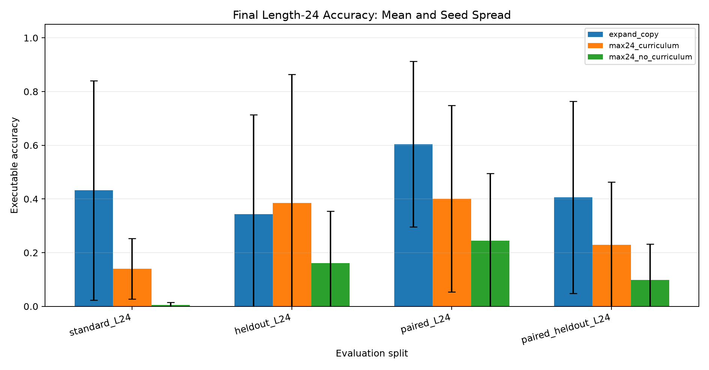
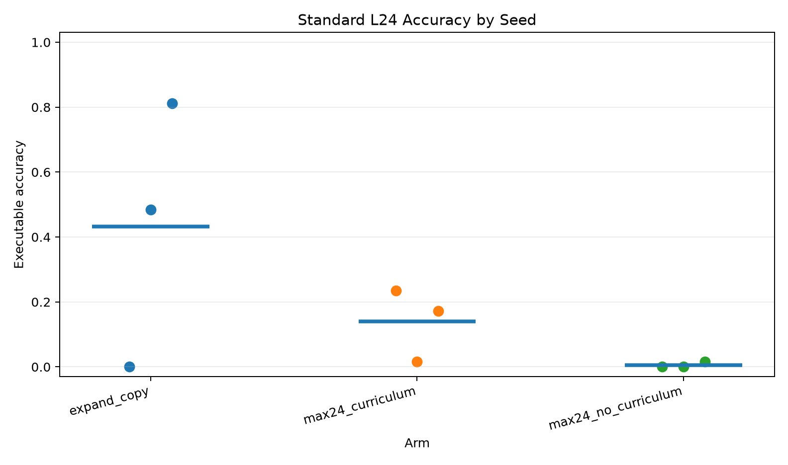
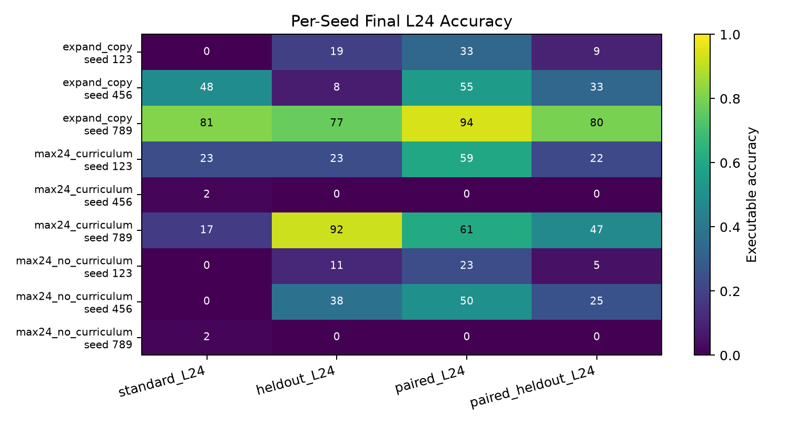
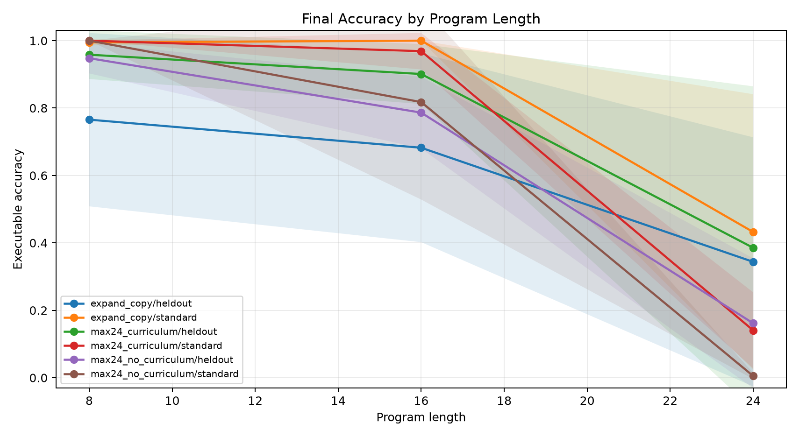
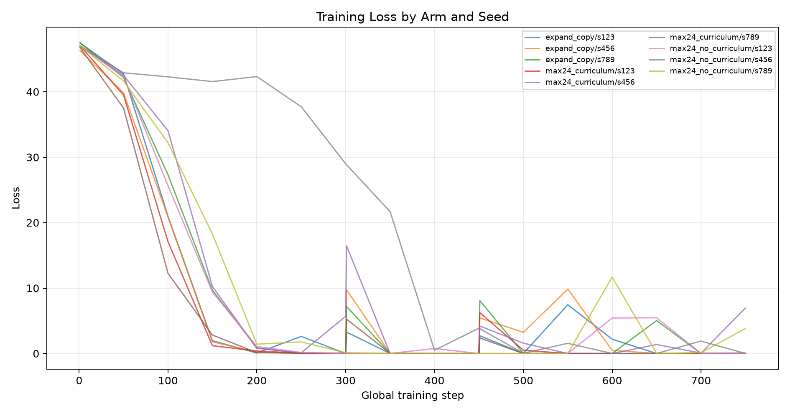
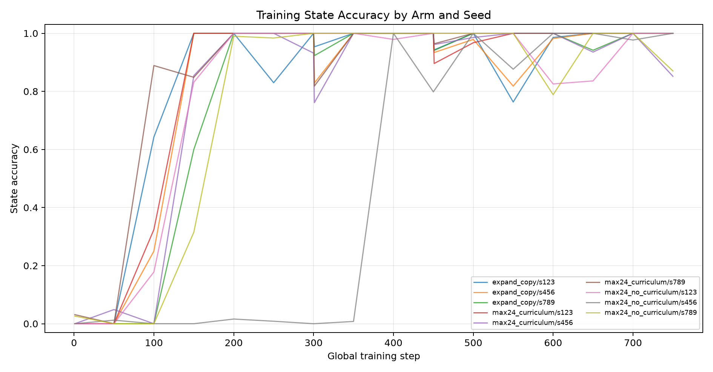

# Qwen Compiler Multi-Seed Reattribution

## Question

Does a one-shot executable latent compiler reliably learn length-24 modular programs across random seeds, and which training factor best explains the result: staged length curriculum, copied structural expansion, or same-budget no-curriculum training?

## Method

- Each arm uses Qwen/Qwen3-4B with QLoRA and a direct executable compiler head.
- The compiler predicts one initial value and a sequence of typed operation and argument slots.
- A differentiable modular executor supervises final answers and intermediate state traces.
- The same seed set is used for each arm, so the main readout is mean and spread across matched random seeds.
- Evaluation includes standard templates, held-out wording templates, seen-family paired consistency, and held-out paired consistency.

## Arms

- `max24_curriculum`: max-24 compiler from the start, with staged train lengths.
- `expand_copy`: compiler capacity expands in stages and newly introduced slots copy the last learned slot.
- `max24_no_curriculum`: max-24 compiler from the start, trained on the full length range immediately.

## Runs

| run                               | arm                 |   seed |   elapsed_sec | stage_max_steps   | stage_steps   |   train_examples |   eval_examples | gpu                            |
|:----------------------------------|:--------------------|-------:|--------------:|:------------------|:--------------|-----------------:|----------------:|:-------------------------------|
| main_expand_copy_seed123          | expand_copy         |    123 |       1912    | 8,16,24           | 300,150,300   |              512 |              64 | NVIDIA RTX 6000 Ada Generation |
| main_expand_copy_seed456          | expand_copy         |    456 |       1914    | 8,16,24           | 300,150,300   |              512 |              64 | NVIDIA RTX 6000 Ada Generation |
| main_expand_copy_seed789          | expand_copy         |    789 |       1908    | 8,16,24           | 300,150,300   |              512 |              64 | NVIDIA RTX 6000 Ada Generation |
| main_max24_curriculum_seed123     | max24_curriculum    |    123 |       2722    | 24,24,24          | 300,150,300   |              512 |              64 | NVIDIA RTX 6000 Ada Generation |
| main_max24_curriculum_seed456     | max24_curriculum    |    456 |       2721    | 24,24,24          | 300,150,300   |              512 |              64 | NVIDIA RTX 6000 Ada Generation |
| main_max24_curriculum_seed789     | max24_curriculum    |    789 |       2717    | 24,24,24          | 300,150,300   |              512 |              64 | NVIDIA RTX 6000 Ada Generation |
| main_max24_no_curriculum_seed123  | max24_no_curriculum |    123 |       2691    | 24                | 750           |              512 |              64 | NVIDIA RTX 6000 Ada Generation |
| main_max24_no_curriculum_seed456  | max24_no_curriculum |    456 |       2693    | 24                | 750           |              512 |              64 | NVIDIA RTX 6000 Ada Generation |
| main_max24_no_curriculum_seed789  | max24_no_curriculum |    789 |       2695    | 24                | 750           |              512 |              64 | NVIDIA RTX 6000 Ada Generation |
| pilot_expand_copy_seed123         | expand_copy         |    123 |         30.61 | 8,16,24           | 4,2,4         |               32 |               8 | NVIDIA RTX 6000 Ada Generation |
| pilot_expand_copy_seed456         | expand_copy         |    456 |         30.93 | 8,16,24           | 4,2,4         |               32 |               8 | NVIDIA RTX 6000 Ada Generation |
| pilot_max24_curriculum_seed123    | max24_curriculum    |    123 |         52.45 | 24,24,24          | 4,2,4         |               32 |               8 | NVIDIA RTX 6000 Ada Generation |
| pilot_max24_curriculum_seed456    | max24_curriculum    |    456 |         53.34 | 24,24,24          | 4,2,4         |               32 |               8 | NVIDIA RTX 6000 Ada Generation |
| pilot_max24_no_curriculum_seed123 | max24_no_curriculum |    123 |         23.18 | 24                | 10            |               32 |               8 | NVIDIA RTX 6000 Ada Generation |
| pilot_max24_no_curriculum_seed456 | max24_no_curriculum |    456 |         23.11 | 24                | 10            |               32 |               8 | NVIDIA RTX 6000 Ada Generation |
| smoke_max24_curriculum_seed123    | max24_curriculum    |    123 |         24.01 | 24,24,24          | 1,1,1         |               12 |               4 | NVIDIA RTX 6000 Ada Generation |

## Results

Final length-24 executable accuracy, mean +/- standard deviation across seeds:

## Key Findings

- `standard_L24`: best mean is `expand_copy` at 43.2% with 40.9 percentage points seed standard deviation.
- `paired_L24`: best mean is `expand_copy` at 60.4% with 30.9 percentage points seed standard deviation.
- `heldout_L24`: best mean is `max24_curriculum` at 38.5% with 47.9 percentage points seed standard deviation.
- State-prefix recovery is high even when exact execution fails: `standard_L24` ranges from 70.0% mean prefix recovery for `max24_no_curriculum` to 87.3% for `expand_copy`.
- Same-budget no-curriculum training is the weakest standard-L24 arm at 0.5% mean accuracy.

| arm                 | standard_L24                   | heldout_L24                    | paired_L24                      | paired_heldout_L24             |
|:--------------------|:-------------------------------|:-------------------------------|:--------------------------------|:-------------------------------|
| expand_copy         | 43.2% +/- 40.9 (0.0-81.2, n=3) | 34.4% +/- 36.9 (7.8-76.6, n=3) | 60.4% +/- 30.9 (32.8-93.8, n=3) | 40.6% +/- 35.8 (9.4-79.7, n=3) |
| max24_curriculum    | 14.1% +/- 11.3 (1.6-23.4, n=3) | 38.5% +/- 47.9 (0.0-92.2, n=3) | 40.1% +/- 34.7 (0.0-60.9, n=3)  | 22.9% +/- 23.5 (0.0-46.9, n=3) |
| max24_no_curriculum | 0.5% +/- 0.9 (0.0-1.6, n=3)    | 16.1% +/- 19.3 (0.0-37.5, n=3) | 24.5% +/- 25.0 (0.0-50.0, n=3)  | 9.9% +/- 13.3 (0.0-25.0, n=3)  |

Per-seed final length-24 executable accuracy:

| arm                 |   seed | run                              | standard_L24   | heldout_L24   | paired_L24   | paired_heldout_L24   |
|:--------------------|-------:|:---------------------------------|:---------------|:--------------|:-------------|:---------------------|
| expand_copy         |    123 | main_expand_copy_seed123         | 0.0%           | 18.8%         | 32.8%        | 9.4%                 |
| expand_copy         |    456 | main_expand_copy_seed456         | 48.4%          | 7.8%          | 54.7%        | 32.8%                |
| expand_copy         |    789 | main_expand_copy_seed789         | 81.2%          | 76.6%         | 93.8%        | 79.7%                |
| max24_curriculum    |    123 | main_max24_curriculum_seed123    | 23.4%          | 23.4%         | 59.4%        | 21.9%                |
| max24_curriculum    |    456 | main_max24_curriculum_seed456    | 1.6%           | 0.0%          | 0.0%         | 0.0%                 |
| max24_curriculum    |    789 | main_max24_curriculum_seed789    | 17.2%          | 92.2%         | 60.9%        | 46.9%                |
| max24_no_curriculum |    123 | main_max24_no_curriculum_seed123 | 0.0%           | 10.9%         | 23.4%        | 4.7%                 |
| max24_no_curriculum |    456 | main_max24_no_curriculum_seed456 | 0.0%           | 37.5%         | 50.0%        | 25.0%                |
| max24_no_curriculum |    789 | main_max24_no_curriculum_seed789 | 1.6%           | 0.0%          | 0.0%         | 0.0%                 |

Exact program recovery, aggregated across seeds:

| arm                 | standard_L24                   | heldout_L24                    | paired_L24                      | paired_heldout_L24             |
|:--------------------|:-------------------------------|:-------------------------------|:--------------------------------|:-------------------------------|
| expand_copy         | 42.2% +/- 40.7 (0.0-81.2, n=3) | 32.3% +/- 38.4 (7.8-76.6, n=3) | 59.9% +/- 31.6 (31.2-93.8, n=3) | 39.1% +/- 37.3 (6.2-79.7, n=3) |
| max24_curriculum    | 10.4% +/- 9.2 (0.0-17.2, n=3)  | 38.0% +/- 48.2 (0.0-92.2, n=3) | 38.5% +/- 33.4 (0.0-59.4, n=3)  | 22.4% +/- 22.7 (0.0-45.3, n=3) |
| max24_no_curriculum | 0.0% +/- 0.0 (0.0-0.0, n=3)    | 16.1% +/- 19.3 (0.0-37.5, n=3) | 23.4% +/- 25.1 (0.0-50.0, n=3)  | 9.9% +/- 13.3 (0.0-25.0, n=3)  |

State-prefix recovery, aggregated across seeds:

| arm                 | standard_L24                    | heldout_L24                     | paired_L24                      | paired_heldout_L24              |
|:--------------------|:--------------------------------|:--------------------------------|:--------------------------------|:--------------------------------|
| expand_copy         | 87.3% +/- 13.4 (71.7-95.1, n=3) | 70.5% +/- 24.9 (43.7-92.8, n=3) | 92.2% +/- 6.6 (84.6-96.6, n=3)  | 78.4% +/- 21.0 (54.9-95.6, n=3) |
| max24_curriculum    | 81.4% +/- 8.5 (71.8-87.9, n=3)  | 82.7% +/- 13.9 (74.6-98.7, n=3) | 86.8% +/- 11.1 (74.1-93.7, n=3) | 81.6% +/- 8.5 (73.0-89.9, n=3)  |
| max24_no_curriculum | 70.0% +/- 8.5 (62.2-79.0, n=3)  | 72.0% +/- 6.6 (66.1-79.2, n=3)  | 78.0% +/- 9.8 (71.4-89.2, n=3)  | 72.2% +/- 9.6 (66.0-83.3, n=3)  |

Final split rows:

| arm                 |   seed | run                              | split              |   n | executor_accuracy   | program_exact   | state_prefix_fraction   | executor_pair_both_correct   | compiler_pair_state_consistency   |
|:--------------------|-------:|:---------------------------------|:-------------------|----:|:--------------------|:----------------|:------------------------|:-----------------------------|:----------------------------------|
| expand_copy         |    123 | main_expand_copy_seed123         | standard_L24       |  64 | 0.0%                | 0.0%            | 71.7%                   |                              |                                   |
| expand_copy         |    123 | main_expand_copy_seed123         | paraphrase_L24     |  64 | 78.1%               | 71.9%           | 97.3%                   |                              |                                   |
| expand_copy         |    123 | main_expand_copy_seed123         | heldout_L24        |  64 | 18.8%               | 12.5%           | 43.7%                   |                              |                                   |
| expand_copy         |    123 | main_expand_copy_seed123         | paired_L24         |  64 | 32.8%               | 31.2%           | 84.6%                   | 0.0%                         | 0.0%                              |
| expand_copy         |    123 | main_expand_copy_seed123         | paired_heldout_L24 |  64 | 9.4%                | 6.2%            | 54.9%                   | 0.0%                         | 0.0%                              |
| expand_copy         |    456 | main_expand_copy_seed456         | standard_L24       |  64 | 48.4%               | 45.3%           | 95.1%                   |                              |                                   |
| expand_copy         |    456 | main_expand_copy_seed456         | paraphrase_L24     |  64 | 73.4%               | 71.9%           | 96.8%                   |                              |                                   |
| expand_copy         |    456 | main_expand_copy_seed456         | heldout_L24        |  64 | 7.8%                | 7.8%            | 74.9%                   |                              |                                   |
| expand_copy         |    456 | main_expand_copy_seed456         | paired_L24         |  64 | 54.7%               | 54.7%           | 95.3%                   | 21.9%                        | 21.9%                             |
| expand_copy         |    456 | main_expand_copy_seed456         | paired_heldout_L24 |  64 | 32.8%               | 31.2%           | 84.5%                   | 3.1%                         | 3.1%                              |
| expand_copy         |    789 | main_expand_copy_seed789         | standard_L24       |  64 | 81.2%               | 81.2%           | 94.9%                   |                              |                                   |
| expand_copy         |    789 | main_expand_copy_seed789         | paraphrase_L24     |  64 | 98.4%               | 98.4%           | 98.4%                   |                              |                                   |
| expand_copy         |    789 | main_expand_copy_seed789         | heldout_L24        |  64 | 76.6%               | 76.6%           | 92.8%                   |                              |                                   |
| expand_copy         |    789 | main_expand_copy_seed789         | paired_L24         |  64 | 93.8%               | 93.8%           | 96.6%                   | 90.6%                        | 93.8%                             |
| expand_copy         |    789 | main_expand_copy_seed789         | paired_heldout_L24 |  64 | 79.7%               | 79.7%           | 95.6%                   | 59.4%                        | 59.4%                             |
| max24_curriculum    |    123 | main_max24_curriculum_seed123    | standard_L24       |  64 | 23.4%               | 17.2%           | 87.9%                   |                              |                                   |
| max24_curriculum    |    123 | main_max24_curriculum_seed123    | paraphrase_L24     |  64 | 92.2%               | 90.6%           | 99.3%                   |                              |                                   |
| max24_curriculum    |    123 | main_max24_curriculum_seed123    | heldout_L24        |  64 | 23.4%               | 21.9%           | 74.7%                   |                              |                                   |
| max24_curriculum    |    123 | main_max24_curriculum_seed123    | paired_L24         |  64 | 59.4%               | 56.2%           | 93.7%                   | 25.0%                        | 18.8%                             |
| max24_curriculum    |    123 | main_max24_curriculum_seed123    | paired_heldout_L24 |  64 | 21.9%               | 21.9%           | 81.8%                   | 3.1%                         | 3.1%                              |
| max24_curriculum    |    456 | main_max24_curriculum_seed456    | standard_L24       |  64 | 1.6%                | 0.0%            | 71.8%                   |                              |                                   |
| max24_curriculum    |    456 | main_max24_curriculum_seed456    | paraphrase_L24     |  64 | 1.6%                | 0.0%            | 73.0%                   |                              |                                   |
| max24_curriculum    |    456 | main_max24_curriculum_seed456    | heldout_L24        |  64 | 0.0%                | 0.0%            | 74.6%                   |                              |                                   |
| max24_curriculum    |    456 | main_max24_curriculum_seed456    | paired_L24         |  64 | 0.0%                | 0.0%            | 74.1%                   | 0.0%                         | 0.0%                              |
| max24_curriculum    |    456 | main_max24_curriculum_seed456    | paired_heldout_L24 |  64 | 0.0%                | 0.0%            | 73.0%                   | 0.0%                         | 0.0%                              |
| max24_curriculum    |    789 | main_max24_curriculum_seed789    | standard_L24       |  64 | 17.2%               | 14.1%           | 84.6%                   |                              |                                   |
| max24_curriculum    |    789 | main_max24_curriculum_seed789    | paraphrase_L24     |  64 | 98.4%               | 98.4%           | 99.9%                   |                              |                                   |
| max24_curriculum    |    789 | main_max24_curriculum_seed789    | heldout_L24        |  64 | 92.2%               | 92.2%           | 98.7%                   |                              |                                   |
| max24_curriculum    |    789 | main_max24_curriculum_seed789    | paired_L24         |  64 | 60.9%               | 59.4%           | 92.8%                   | 21.9%                        | 18.8%                             |
| max24_curriculum    |    789 | main_max24_curriculum_seed789    | paired_heldout_L24 |  64 | 46.9%               | 45.3%           | 89.9%                   | 21.9%                        | 21.9%                             |
| max24_no_curriculum |    123 | main_max24_no_curriculum_seed123 | standard_L24       |  64 | 0.0%                | 0.0%            | 62.2%                   |                              |                                   |
| max24_no_curriculum |    123 | main_max24_no_curriculum_seed123 | paraphrase_L24     |  64 | 46.9%               | 46.9%           | 78.8%                   |                              |                                   |
| max24_no_curriculum |    123 | main_max24_no_curriculum_seed123 | heldout_L24        |  64 | 10.9%               | 10.9%           | 66.1%                   |                              |                                   |
| max24_no_curriculum |    123 | main_max24_no_curriculum_seed123 | paired_L24         |  64 | 23.4%               | 20.3%           | 71.4%                   | 3.1%                         | 0.0%                              |
| max24_no_curriculum |    123 | main_max24_no_curriculum_seed123 | paired_heldout_L24 |  64 | 4.7%                | 4.7%            | 67.2%                   | 0.0%                         | 0.0%                              |
| max24_no_curriculum |    456 | main_max24_no_curriculum_seed456 | standard_L24       |  64 | 0.0%                | 0.0%            | 79.0%                   |                              |                                   |
| max24_no_curriculum |    456 | main_max24_no_curriculum_seed456 | paraphrase_L24     |  64 | 100.0%              | 100.0%          | 100.0%                  |                              |                                   |
| max24_no_curriculum |    456 | main_max24_no_curriculum_seed456 | heldout_L24        |  64 | 37.5%               | 37.5%           | 79.2%                   |                              |                                   |
| max24_no_curriculum |    456 | main_max24_no_curriculum_seed456 | paired_L24         |  64 | 50.0%               | 50.0%           | 89.2%                   | 3.1%                         | 3.1%                              |
| max24_no_curriculum |    456 | main_max24_no_curriculum_seed456 | paired_heldout_L24 |  64 | 25.0%               | 25.0%           | 83.3%                   | 0.0%                         | 0.0%                              |
| max24_no_curriculum |    789 | main_max24_no_curriculum_seed789 | standard_L24       |  64 | 1.6%                | 0.0%            | 68.8%                   |                              |                                   |
| max24_no_curriculum |    789 | main_max24_no_curriculum_seed789 | paraphrase_L24     |  64 | 0.0%                | 0.0%            | 77.5%                   |                              |                                   |
| max24_no_curriculum |    789 | main_max24_no_curriculum_seed789 | heldout_L24        |  64 | 0.0%                | 0.0%            | 70.8%                   |                              |                                   |
| max24_no_curriculum |    789 | main_max24_no_curriculum_seed789 | paired_L24         |  64 | 0.0%                | 0.0%            | 73.3%                   | 0.0%                         | 0.0%                              |
| max24_no_curriculum |    789 | main_max24_no_curriculum_seed789 | paired_heldout_L24 |  64 | 0.0%                | 0.0%            | 66.0%                   | 0.0%                         | 0.0%                              |

## Figures

## Interpretation

On the standard length-24 split, the strongest mean arm is `expand_copy` at 43.2% with 40.9 percentage points of seed standard deviation.
The decisive criterion is whether the arm ranking remains stable across seeds and whether any arm's seed spread is large enough to make a single-seed conclusion unreliable.
The observed spread is large enough that no single seed supports a stable attribution claim. Copied expansion has the best mean in this seed set, but it ranges from complete standard-L24 failure to strong performance. Full-width curriculum is also unstable, and no-curriculum training is especially weak on standard-L24 despite sometimes doing well on other wording splits.
A second conclusion is that partial execution is not the bottleneck: every arm recovers long state prefixes far more often than it recovers exact length-24 programs. The remaining failure is late-step/global program consistency, not the absence of local operator knowledge.

## Artifacts

- Run outputs: `experiments/qwen_compiler_multiseed_reattribution/runs/`
- Reports and figures: `experiments/qwen_compiler_multiseed_reattribution/reports/`
- Large checkpoints: `large_artifacts/qwen_compiler_multiseed_reattribution/checkpoints/`
