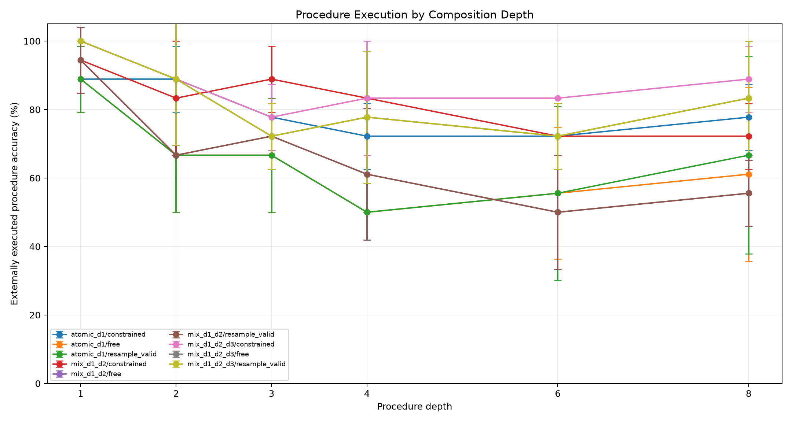
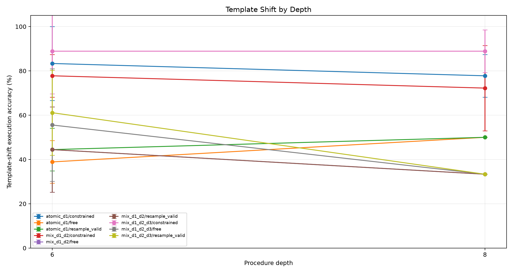
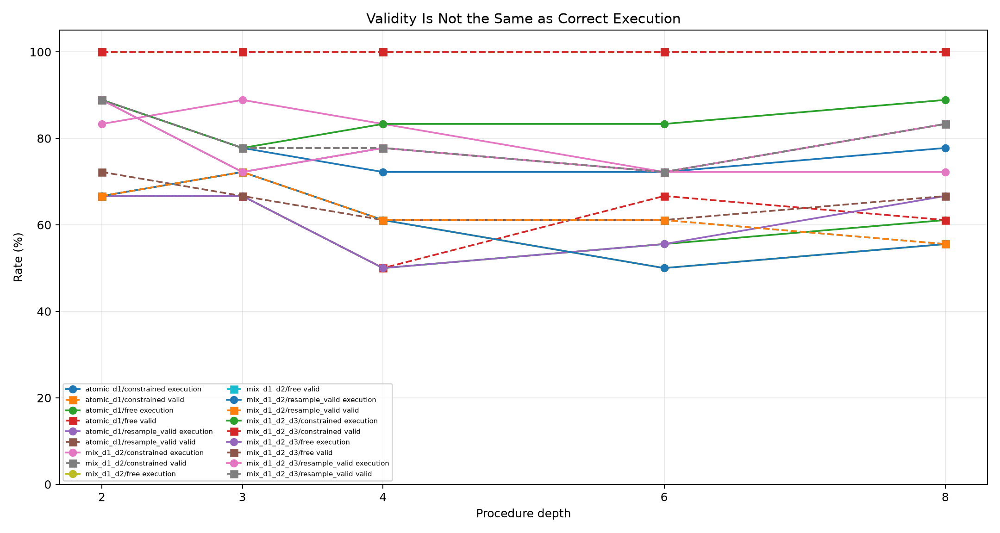
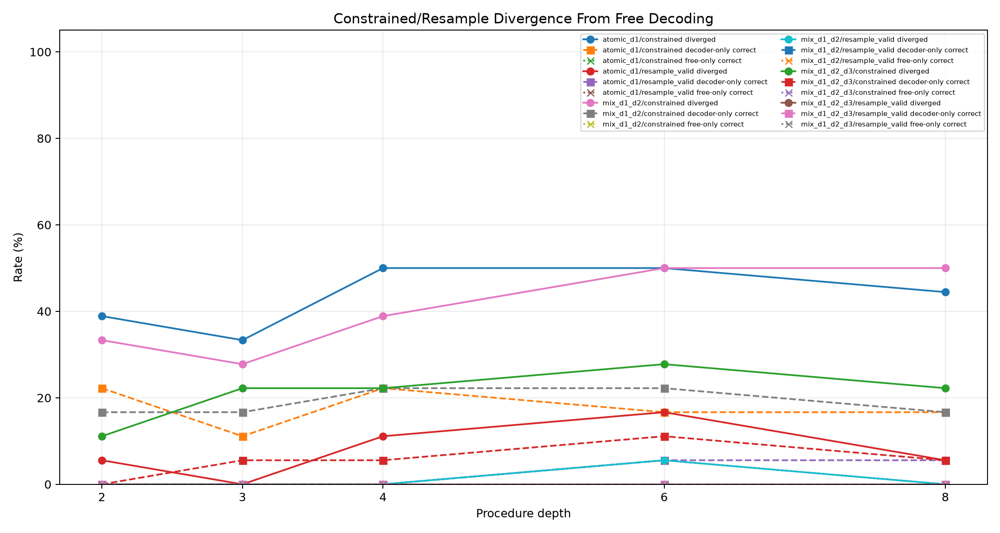
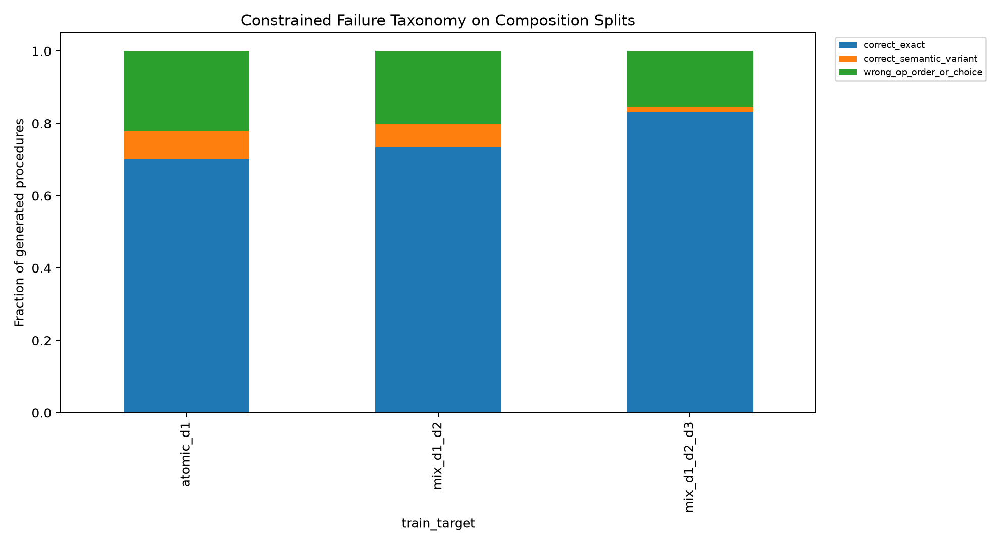
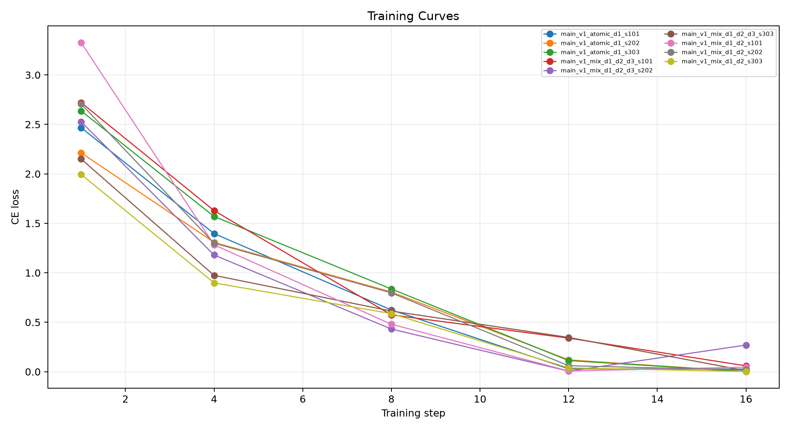

# Qwen Compositional Curriculum ABI

## Abstract

This standalone experiment tests whether shallow composed-procedure supervision makes a small language model a more reliable compiler into a deterministic stack ABI. The model never needs to execute the procedure itself; success is measured by executing the generated ABI program in an external interpreter.

## Method

Three QLoRA adapters are trained with the same ABI target and different curriculum depths:
- `atomic_d1`: only one-operation tasks.
- `mix_d1_d2`: a balanced mix of one- and two-operation tasks.
- `mix_d1_d2_d3`: a balanced mix of one-, two-, and three-operation tasks.

Evaluation sweeps procedure depth 1, 2, 3, 4, 6, and 8. Depths above a curriculum's maximum are held-out composition tests. Separate wording-shift splits test whether the compiler is robust to surface phrasing. Each trained adapter is evaluated with free greedy decoding, finite-state constrained decoding, and a resample-to-valid baseline. A gold ABI sanity arm checks the interpreter.

The primary criterion is external execution accuracy on held-out deeper depths, especially depth 6 and depth 8. Valid-program rate alone is not a success metric; a useful curriculum must reduce valid-but-wrong composition errors, not only improve syntax.

## Run Configuration

- Primary suite: `main`.
- Seeds: `101,202,303`.
- Evaluation rows: `240` metric rows, `1440` scored examples across curricula and decoder arms.
- QLoRA update steps per adapter: `16`.
- Large adapters are stored outside the experiment tree.

## Primary Results

- Constrained depth-6 execution: `atomic_d1` 72.2%; `mix_d1_d2` 72.2%; `mix_d1_d2_d3` 83.3%.
- Depth-6 gain from adding d2/d3 examples: `mix_d1_d2` minus atomic 0.0%; `mix_d1_d2_d3` minus atomic 11.1%.
- Depth-6 correct-given-valid: atomic 72.2%; d1/d2 mix 72.2%; d1/d2/d3 mix 83.3%.
- Constrained depth-8 execution: atomic 77.8%; d1/d2/d3 mix 88.9%; delta 11.1%.
- Template-shift depth-6 constrained execution: atomic 83.3%; d1/d2/d3 mix 88.9%; delta 5.6%.
- Gold ABI depth-6 sanity: 100.0% execution and 100.0% validity.
- Depth-6 d1/d2/d3 curriculum beats atomic on `2/3` matched seeds; mean per-seed delta 11.1%.

|train_target|arm|split|depth|runs|n_total|exec_accuracy_mean|exec_accuracy_std|valid_exec_rate_mean|correct_given_valid_mean|divergence_rate_mean|constrained_only_rate_mean|free_only_rate_mean|mean_attempts_mean|
|---|---|---|---|---|---|---|---|---|---|---|---|---|---|
|atomic_d1|program_stack_constrained|eval_comp_d4|4|3|18|72.2%|9.6%|100.0%|72.2%|50.0%|22.2%|0.0%|1.00|
|atomic_d1|program_stack_free|eval_comp_d4|4|3|18|50.0%|0.0%|50.0%|100.0%|n/a|n/a|n/a|1.00|
|atomic_d1|program_stack_resample_valid|eval_comp_d4|4|3|18|50.0%|0.0%|61.1%|83.3%|11.1%|0.0%|0.0%|1.44|
|mix_d1_d2|program_stack_constrained|eval_comp_d4|4|3|18|83.3%|0.0%|100.0%|83.3%|38.9%|22.2%|0.0%|1.00|
|mix_d1_d2|program_stack_free|eval_comp_d4|4|3|18|61.1%|19.2%|61.1%|100.0%|n/a|n/a|n/a|1.00|
|mix_d1_d2|program_stack_resample_valid|eval_comp_d4|4|3|18|61.1%|19.2%|61.1%|100.0%|0.0%|0.0%|0.0%|1.39|
|mix_d1_d2_d3|program_stack_constrained|eval_comp_d4|4|3|18|83.3%|16.7%|100.0%|83.3%|22.2%|5.6%|0.0%|1.00|
|mix_d1_d2_d3|program_stack_free|eval_comp_d4|4|3|18|77.8%|19.2%|77.8%|100.0%|n/a|n/a|n/a|1.00|
|mix_d1_d2_d3|program_stack_resample_valid|eval_comp_d4|4|3|18|77.8%|19.2%|77.8%|100.0%|0.0%|0.0%|0.0%|1.22|
|oracle|gold_abi_constrained|eval_comp_d4|4|3|18|100.0%|0.0%|100.0%|100.0%|n/a|n/a|n/a|0.00|
|atomic_d1|program_stack_constrained|eval_comp_d6|6|3|18|72.2%|9.6%|100.0%|72.2%|50.0%|16.7%|0.0%|1.00|
|atomic_d1|program_stack_free|eval_comp_d6|6|3|18|55.6%|19.2%|66.7%|82.2%|n/a|n/a|n/a|1.00|
|atomic_d1|program_stack_resample_valid|eval_comp_d6|6|3|18|55.6%|25.5%|61.1%|88.9%|16.7%|5.6%|5.6%|1.39|
|mix_d1_d2|program_stack_constrained|eval_comp_d6|6|3|18|72.2%|9.6%|100.0%|72.2%|50.0%|22.2%|0.0%|1.00|
|mix_d1_d2|program_stack_free|eval_comp_d6|6|3|18|50.0%|16.7%|61.1%|83.3%|n/a|n/a|n/a|1.00|
|mix_d1_d2|program_stack_resample_valid|eval_comp_d6|6|3|18|50.0%|16.7%|61.1%|83.3%|5.6%|0.0%|0.0%|1.39|
|mix_d1_d2_d3|program_stack_constrained|eval_comp_d6|6|3|18|83.3%|0.0%|100.0%|83.3%|27.8%|11.1%|0.0%|1.00|
|mix_d1_d2_d3|program_stack_free|eval_comp_d6|6|3|18|72.2%|9.6%|72.2%|100.0%|n/a|n/a|n/a|1.00|
|mix_d1_d2_d3|program_stack_resample_valid|eval_comp_d6|6|3|18|72.2%|9.6%|72.2%|100.0%|0.0%|0.0%|0.0%|1.28|
|oracle|gold_abi_constrained|eval_comp_d6|6|3|18|100.0%|0.0%|100.0%|100.0%|n/a|n/a|n/a|0.00|
|atomic_d1|program_stack_constrained|eval_comp_d8|8|3|18|77.8%|9.6%|100.0%|77.8%|44.4%|16.7%|0.0%|1.00|
|atomic_d1|program_stack_free|eval_comp_d8|8|3|18|61.1%|25.5%|61.1%|100.0%|n/a|n/a|n/a|1.00|
|atomic_d1|program_stack_resample_valid|eval_comp_d8|8|3|18|66.7%|28.9%|66.7%|100.0%|5.6%|5.6%|0.0%|1.39|
|mix_d1_d2|program_stack_constrained|eval_comp_d8|8|3|18|72.2%|9.6%|100.0%|72.2%|50.0%|16.7%|0.0%|1.00|
|mix_d1_d2|program_stack_free|eval_comp_d8|8|3|18|55.6%|9.6%|55.6%|100.0%|n/a|n/a|n/a|1.00|
|mix_d1_d2|program_stack_resample_valid|eval_comp_d8|8|3|18|55.6%|9.6%|55.6%|100.0%|0.0%|0.0%|0.0%|1.44|
|mix_d1_d2_d3|program_stack_constrained|eval_comp_d8|8|3|18|88.9%|9.6%|100.0%|88.9%|22.2%|5.6%|0.0%|1.00|
|mix_d1_d2_d3|program_stack_free|eval_comp_d8|8|3|18|83.3%|16.7%|83.3%|100.0%|n/a|n/a|n/a|1.00|
|mix_d1_d2_d3|program_stack_resample_valid|eval_comp_d8|8|3|18|83.3%|16.7%|83.3%|100.0%|0.0%|0.0%|0.0%|1.17|
|oracle|gold_abi_constrained|eval_comp_d8|8|3|18|100.0%|0.0%|100.0%|100.0%|n/a|n/a|n/a|0.00|
|atomic_d1|program_stack_constrained|eval_template_d6|6|3|18|83.3%|16.7%|100.0%|83.3%|61.1%|44.4%|0.0%|1.00|
|atomic_d1|program_stack_free|eval_template_d6|6|3|18|38.9%|9.6%|38.9%|100.0%|n/a|n/a|n/a|1.00|
|atomic_d1|program_stack_resample_valid|eval_template_d6|6|3|18|44.4%|9.6%|44.4%|100.0%|5.6%|5.6%|0.0%|1.61|
|mix_d1_d2|program_stack_constrained|eval_template_d6|6|3|18|77.8%|9.6%|100.0%|77.8%|61.1%|38.9%|5.6%|1.00|
|mix_d1_d2|program_stack_free|eval_template_d6|6|3|18|44.4%|19.2%|44.4%|100.0%|n/a|n/a|n/a|1.00|
|mix_d1_d2|program_stack_resample_valid|eval_template_d6|6|3|18|44.4%|19.2%|44.4%|100.0%|0.0%|0.0%|0.0%|1.56|
|mix_d1_d2_d3|program_stack_constrained|eval_template_d6|6|3|18|88.9%|19.2%|100.0%|88.9%|44.4%|33.3%|0.0%|1.00|
|mix_d1_d2_d3|program_stack_free|eval_template_d6|6|3|18|55.6%|25.5%|55.6%|100.0%|n/a|n/a|n/a|1.00|
|mix_d1_d2_d3|program_stack_resample_valid|eval_template_d6|6|3|18|61.1%|19.2%|61.1%|100.0%|5.6%|5.6%|0.0%|1.44|
|oracle|gold_abi_constrained|eval_template_d6|6|3|18|100.0%|0.0%|100.0%|100.0%|n/a|n/a|n/a|0.00|
|atomic_d1|program_stack_constrained|eval_template_d8|8|3|18|77.8%|9.6%|100.0%|77.8%|50.0%|27.8%|0.0%|1.00|
|atomic_d1|program_stack_free|eval_template_d8|8|3|18|50.0%|0.0%|50.0%|100.0%|n/a|n/a|n/a|1.00|
|atomic_d1|program_stack_resample_valid|eval_template_d8|8|3|18|50.0%|0.0%|55.6%|91.7%|16.7%|0.0%|0.0%|1.50|
|mix_d1_d2|program_stack_constrained|eval_template_d8|8|3|18|72.2%|19.2%|100.0%|72.2%|66.7%|38.9%|0.0%|1.00|
|mix_d1_d2|program_stack_free|eval_template_d8|8|3|18|33.3%|0.0%|38.9%|88.9%|n/a|n/a|n/a|1.00|
|mix_d1_d2|program_stack_resample_valid|eval_template_d8|8|3|18|33.3%|0.0%|38.9%|88.9%|5.6%|0.0%|0.0%|1.61|
|mix_d1_d2_d3|program_stack_constrained|eval_template_d8|8|3|18|88.9%|9.6%|100.0%|88.9%|66.7%|55.6%|0.0%|1.00|
|mix_d1_d2_d3|program_stack_free|eval_template_d8|8|3|18|33.3%|0.0%|38.9%|88.9%|n/a|n/a|n/a|1.00|
|mix_d1_d2_d3|program_stack_resample_valid|eval_template_d8|8|3|18|33.3%|0.0%|44.4%|77.8%|11.1%|0.0%|0.0%|1.61|
|oracle|gold_abi_constrained|eval_template_d8|8|3|18|100.0%|0.0%|100.0%|100.0%|n/a|n/a|n/a|0.00|

## Interpretation

The experiment isolates a training-data question. If shallow composition examples improve depth-6 and depth-8 execution without merely increasing valid-rate, the remaining valid-but-wrong errors are partly a coverage problem: the compiler needed to see short composition traces to stabilize longer composition. If the depth curve does not improve, the remaining errors are a deeper sequencing or grounding limit.
At depth 6, the d1/d2/d3 curriculum changes execution by 11.1% and correct-given-valid by 11.1% relative to atomic-only training.
At depth 8, the same curriculum changes execution by 11.1% relative to atomic-only training.
For `atomic_d1` constrained decoding on depth-6/depth-8 composition splits, procedures break down as: correct_exact 61.1%, wrong_op_order_or_choice 25.0%, correct_semantic_variant 13.9%.
For `mix_d1_d2` constrained decoding on depth-6/depth-8 composition splits, procedures break down as: correct_exact 63.9%, wrong_op_order_or_choice 27.8%, correct_semantic_variant 8.3%.
For `mix_d1_d2_d3` constrained decoding on depth-6/depth-8 composition splits, procedures break down as: correct_exact 83.3%, wrong_op_order_or_choice 13.9%, correct_semantic_variant 2.8%.

## Limitations

This experiment tests compilation over a fixed known primitive library. It does not test invention of operations outside the ABI. The finite-state decoder is tied to the task schema and uses task-visible constants and type information. Depth-2 and depth-3 examples in the training curricula are supervised generated data, so gains should be read as curriculum effects rather than unsupervised discovery.

## Artifacts

- Metrics: `analysis/summary_by_arm.csv` and `analysis/all_metrics.csv`
- Details: `analysis/all_details.csv`
- Training logs: `analysis/all_train_logs.csv`
- Checkpoints: `/workspace/large_artifacts/qwen_compositional_curriculum_abi/checkpoints`
