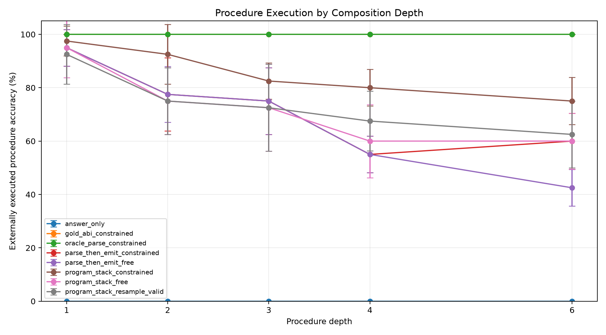
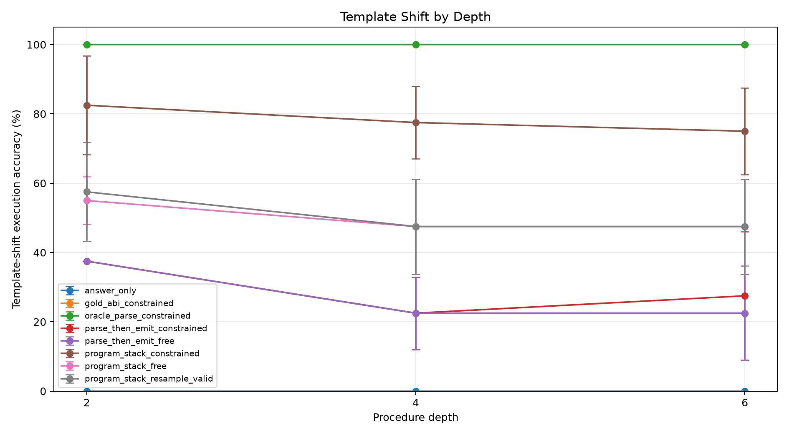
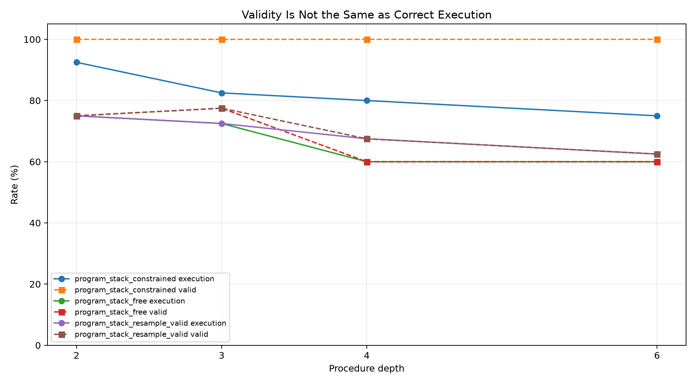
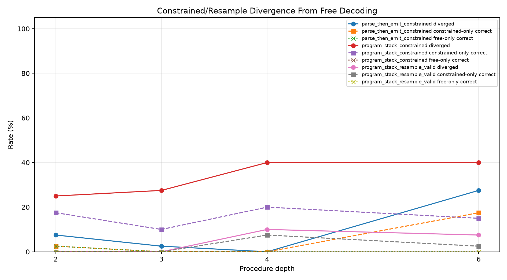
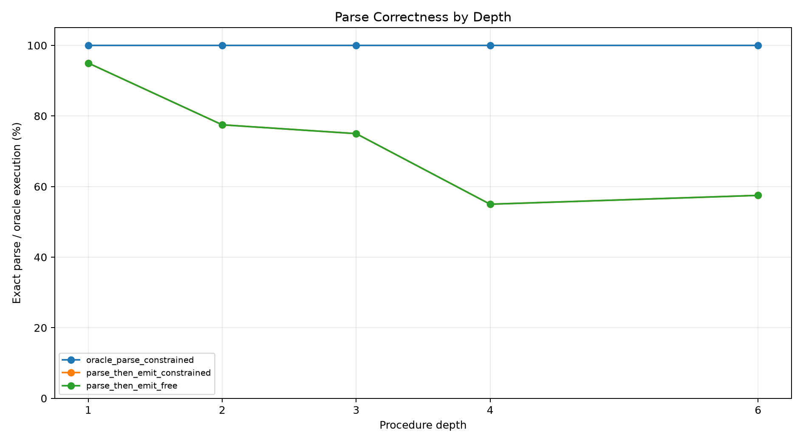
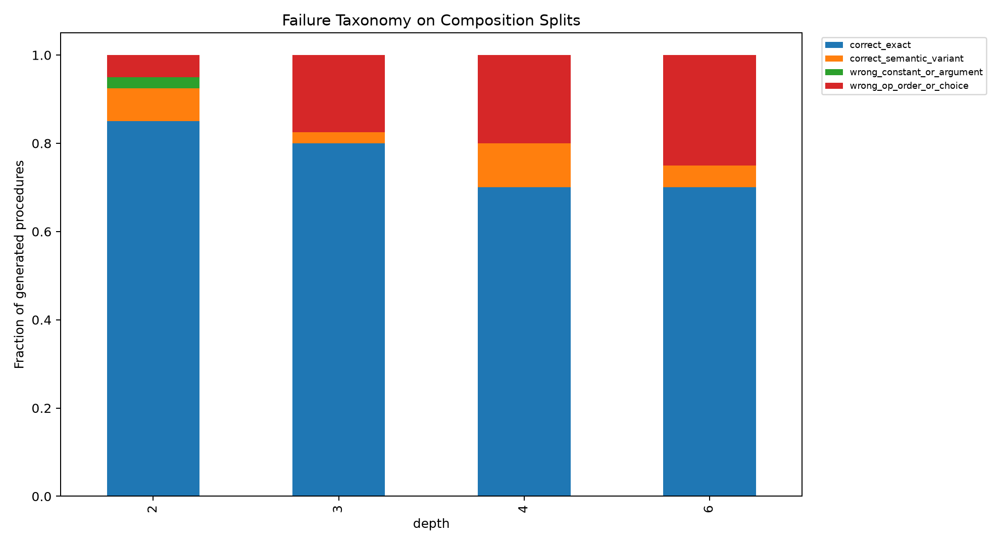
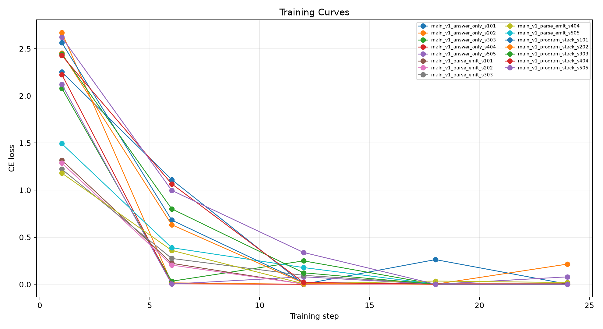

# Qwen Constrained ABI Parser

## Abstract

This standalone experiment tests whether a finite-state stack-ABI decoder and a canonical parse stage make a small model a more reliable compiler from natural language into executable procedures. The headline metric is external execution accuracy, not valid-program rate.

## Method

Training examples contain one primitive operation. Evaluation uses held-out procedure depths 2, 3, 4, and 6, plus wording-shifted prompts at depths 2, 4, and 6. The task families are string, number, table, date, list, and path transformations.

Three targets are trained: direct final answers, raw stack programs, and parse-plus-program outputs. The raw stack adapter is evaluated with free greedy decoding, finite-state constrained decoding, and a resample-to-valid baseline. The parse adapter is evaluated both by executing its free program section and by deterministically emitting a stack program from its parse block. Oracle parse and gold ABI sanity arms bound the decoder and interpreter.

A valid-rate increase alone is pre-registered as insufficient. A useful constraint must improve execution accuracy while preserving correct-given-valid accuracy; otherwise the grammar merely forces wrong programs to become well formed.

## Run Configuration

- Primary suite: `main`.
- Seeds: `101,202,303,404,505`.
- Evaluation rows: `320` metric rows, `2560` scored examples across arms.
- QLoRA update steps per adapter: `24`.
- Large adapters are stored outside the experiment tree.

## Primary Results

- Depth-6 standard execution: free raw stack 60.0%; constrained raw stack 75.0%; constraint delta 15.0%.
- Depth-6 valid-rate/correct-given-valid: free valid 60.0%, cgv 100.0%; constrained valid 100.0%, cgv 75.0%.
- Depth-6 constrained raw stack beats free decoding on `5/5` seeds; mean per-seed delta 15.0%.
- Depth-6 divergence: constrained-only correct 15.0%; free-only correct 0.0%.
- Depth-6 resample-to-valid execution: 62.5%; delta versus free 2.5%; mean attempts 1.40.
- Depth-6 parse-then-emit execution: 60.0%; parse exactness 57.5%.
- Depth-6 direct-answer baseline: 0.0%.
- Template-shift depth-6 constrained execution: 75.0%; drop from standard constrained depth-6 0.0%.
- Template-shift depth-6 free execution: 47.5%; drop from standard free depth-6 12.5%.
- Template-shift depth-6 constraint delta over free: 27.5%.
- Oracle parse and gold ABI depth-6 sanity: oracle parse 100.0%; gold ABI 100.0%.

|arm|split|depth|runs|n_total|exec_accuracy_mean|exec_accuracy_std|valid_exec_rate_mean|correct_given_valid_mean|parse_exact_rate_mean|divergence_rate_mean|constrained_only_rate_mean|free_only_rate_mean|mean_attempts_mean|
|---|---|---|---|---|---|---|---|---|---|---|---|---|---|
|answer_only|eval_comp_d2|2|5|40|0.0%|0.0%|0.0%|n/a|0.0%|n/a|n/a|n/a|1.00|
|gold_abi_constrained|eval_comp_d2|2|5|40|100.0%|0.0%|100.0%|100.0%|0.0%|n/a|n/a|n/a|0.00|
|oracle_parse_constrained|eval_comp_d2|2|5|40|100.0%|0.0%|100.0%|100.0%|100.0%|n/a|n/a|n/a|0.00|
|parse_then_emit_constrained|eval_comp_d2|2|5|40|77.5%|13.7%|82.5%|93.8%|77.5%|7.5%|2.5%|2.5%|1.00|
|parse_then_emit_free|eval_comp_d2|2|5|40|77.5%|10.5%|80.0%|96.7%|77.5%|n/a|n/a|n/a|1.00|
|program_stack_constrained|eval_comp_d2|2|5|40|92.5%|11.2%|100.0%|92.5%|0.0%|25.0%|17.5%|0.0%|1.00|
|program_stack_free|eval_comp_d2|2|5|40|75.0%|12.5%|75.0%|100.0%|0.0%|n/a|n/a|n/a|1.00|
|program_stack_resample_valid|eval_comp_d2|2|5|40|75.0%|12.5%|75.0%|100.0%|0.0%|0.0%|0.0%|0.0%|1.25|
|answer_only|eval_comp_d3|3|5|40|0.0%|0.0%|0.0%|n/a|0.0%|n/a|n/a|n/a|1.00|
|gold_abi_constrained|eval_comp_d3|3|5|40|100.0%|0.0%|100.0%|100.0%|0.0%|n/a|n/a|n/a|0.00|
|oracle_parse_constrained|eval_comp_d3|3|5|40|100.0%|0.0%|100.0%|100.0%|100.0%|n/a|n/a|n/a|0.00|
|parse_then_emit_constrained|eval_comp_d3|3|5|40|75.0%|12.5%|80.0%|94.2%|75.0%|2.5%|0.0%|0.0%|1.00|
|parse_then_emit_free|eval_comp_d3|3|5|40|75.0%|12.5%|80.0%|94.2%|75.0%|n/a|n/a|n/a|1.00|
|program_stack_constrained|eval_comp_d3|3|5|40|82.5%|6.8%|100.0%|82.5%|0.0%|27.5%|10.0%|0.0%|1.00|
|program_stack_free|eval_comp_d3|3|5|40|72.5%|16.3%|77.5%|93.1%|0.0%|n/a|n/a|n/a|1.00|
|program_stack_resample_valid|eval_comp_d3|3|5|40|72.5%|16.3%|77.5%|93.1%|0.0%|0.0%|0.0%|0.0%|1.23|
|answer_only|eval_comp_d4|4|5|40|0.0%|0.0%|0.0%|n/a|0.0%|n/a|n/a|n/a|1.00|
|gold_abi_constrained|eval_comp_d4|4|5|40|100.0%|0.0%|100.0%|100.0%|0.0%|n/a|n/a|n/a|0.00|
|oracle_parse_constrained|eval_comp_d4|4|5|40|100.0%|0.0%|100.0%|100.0%|100.0%|n/a|n/a|n/a|0.00|
|parse_then_emit_constrained|eval_comp_d4|4|5|40|55.0%|6.8%|62.5%|88.7%|55.0%|0.0%|0.0%|0.0%|1.00|
|parse_then_emit_free|eval_comp_d4|4|5|40|55.0%|6.8%|62.5%|88.7%|55.0%|n/a|n/a|n/a|1.00|
|program_stack_constrained|eval_comp_d4|4|5|40|80.0%|6.8%|100.0%|80.0%|0.0%|40.0%|20.0%|0.0%|1.00|
|program_stack_free|eval_comp_d4|4|5|40|60.0%|13.7%|60.0%|100.0%|0.0%|n/a|n/a|n/a|1.00|
|program_stack_resample_valid|eval_comp_d4|4|5|40|67.5%|11.2%|67.5%|100.0%|0.0%|10.0%|7.5%|0.0%|1.40|
|answer_only|eval_comp_d6|6|5|40|0.0%|0.0%|0.0%|n/a|0.0%|n/a|n/a|n/a|1.00|
|gold_abi_constrained|eval_comp_d6|6|5|40|100.0%|0.0%|100.0%|100.0%|0.0%|n/a|n/a|n/a|0.00|
|oracle_parse_constrained|eval_comp_d6|6|5|40|100.0%|0.0%|100.0%|100.0%|100.0%|n/a|n/a|n/a|0.00|
|parse_then_emit_constrained|eval_comp_d6|6|5|40|60.0%|10.5%|60.0%|100.0%|57.5%|27.5%|17.5%|0.0%|1.00|
|parse_then_emit_free|eval_comp_d6|6|5|40|42.5%|6.8%|45.0%|96.0%|57.5%|n/a|n/a|n/a|1.00|
|program_stack_constrained|eval_comp_d6|6|5|40|75.0%|8.8%|100.0%|75.0%|0.0%|40.0%|15.0%|0.0%|1.00|
|program_stack_free|eval_comp_d6|6|5|40|60.0%|10.5%|60.0%|100.0%|0.0%|n/a|n/a|n/a|1.00|
|program_stack_resample_valid|eval_comp_d6|6|5|40|62.5%|12.5%|62.5%|100.0%|0.0%|7.5%|2.5%|0.0%|1.40|
|answer_only|eval_indist_d1|1|5|40|0.0%|0.0%|0.0%|n/a|0.0%|n/a|n/a|n/a|1.00|
|gold_abi_constrained|eval_indist_d1|1|5|40|100.0%|0.0%|100.0%|100.0%|0.0%|n/a|n/a|n/a|0.00|
|oracle_parse_constrained|eval_indist_d1|1|5|40|100.0%|0.0%|100.0%|100.0%|100.0%|n/a|n/a|n/a|0.00|
|parse_then_emit_constrained|eval_indist_d1|1|5|40|95.0%|6.8%|97.5%|97.5%|95.0%|7.5%|2.5%|2.5%|1.00|
|parse_then_emit_free|eval_indist_d1|1|5|40|95.0%|6.8%|97.5%|97.5%|95.0%|n/a|n/a|n/a|1.00|
|program_stack_constrained|eval_indist_d1|1|5|40|97.5%|5.6%|100.0%|97.5%|0.0%|2.5%|2.5%|0.0%|1.00|
|program_stack_free|eval_indist_d1|1|5|40|95.0%|11.2%|97.5%|97.1%|0.0%|n/a|n/a|n/a|1.00|
|program_stack_resample_valid|eval_indist_d1|1|5|40|92.5%|11.2%|95.0%|97.1%|0.0%|2.5%|0.0%|2.5%|1.05|
|answer_only|eval_template_d2|2|5|40|0.0%|0.0%|0.0%|n/a|0.0%|n/a|n/a|n/a|1.00|
|gold_abi_constrained|eval_template_d2|2|5|40|100.0%|0.0%|100.0%|100.0%|0.0%|n/a|n/a|n/a|0.00|
|oracle_parse_constrained|eval_template_d2|2|5|40|100.0%|0.0%|100.0%|100.0%|100.0%|n/a|n/a|n/a|0.00|
|parse_then_emit_constrained|eval_template_d2|2|5|40|37.5%|0.0%|42.5%|92.0%|32.5%|7.5%|0.0%|0.0%|1.00|
|parse_then_emit_free|eval_template_d2|2|5|40|37.5%|0.0%|37.5%|100.0%|32.5%|n/a|n/a|n/a|1.00|
|program_stack_constrained|eval_template_d2|2|5|40|82.5%|14.3%|100.0%|82.5%|0.0%|52.5%|30.0%|2.5%|1.00|
|program_stack_free|eval_template_d2|2|5|40|55.0%|6.8%|57.5%|96.0%|0.0%|n/a|n/a|n/a|1.00|
|program_stack_resample_valid|eval_template_d2|2|5|40|57.5%|14.3%|62.5%|91.0%|0.0%|12.5%|5.0%|2.5%|1.43|
|answer_only|eval_template_d4|4|5|40|0.0%|0.0%|0.0%|n/a|0.0%|n/a|n/a|n/a|1.00|
|gold_abi_constrained|eval_template_d4|4|5|40|100.0%|0.0%|100.0%|100.0%|0.0%|n/a|n/a|n/a|0.00|
|oracle_parse_constrained|eval_template_d4|4|5|40|100.0%|0.0%|100.0%|100.0%|100.0%|n/a|n/a|n/a|0.00|
|parse_then_emit_constrained|eval_template_d4|4|5|40|22.5%|10.5%|25.0%|93.3%|22.5%|5.0%|0.0%|0.0%|1.00|
|parse_then_emit_free|eval_template_d4|4|5|40|22.5%|10.5%|22.5%|100.0%|22.5%|n/a|n/a|n/a|1.00|
|program_stack_constrained|eval_template_d4|4|5|40|77.5%|10.5%|100.0%|77.5%|0.0%|57.5%|35.0%|5.0%|1.00|
|program_stack_free|eval_template_d4|4|5|40|47.5%|13.7%|47.5%|100.0%|0.0%|n/a|n/a|n/a|1.00|
|program_stack_resample_valid|eval_template_d4|4|5|40|47.5%|13.7%|50.0%|95.0%|0.0%|2.5%|0.0%|0.0%|1.50|
|answer_only|eval_template_d6|6|5|40|0.0%|0.0%|0.0%|n/a|0.0%|n/a|n/a|n/a|1.00|
|gold_abi_constrained|eval_template_d6|6|5|40|100.0%|0.0%|100.0%|100.0%|0.0%|n/a|n/a|n/a|0.00|
|oracle_parse_constrained|eval_template_d6|6|5|40|100.0%|0.0%|100.0%|100.0%|100.0%|n/a|n/a|n/a|0.00|
|parse_then_emit_constrained|eval_template_d6|6|5|40|27.5%|18.5%|27.5%|100.0%|25.0%|22.5%|5.0%|0.0%|1.00|
|parse_then_emit_free|eval_template_d6|6|5|40|22.5%|13.7%|25.0%|91.7%|25.0%|n/a|n/a|n/a|1.00|
|program_stack_constrained|eval_template_d6|6|5|40|75.0%|12.5%|100.0%|75.0%|0.0%|50.0%|30.0%|2.5%|1.00|
|program_stack_free|eval_template_d6|6|5|40|47.5%|13.7%|55.0%|86.7%|0.0%|n/a|n/a|n/a|1.00|
|program_stack_resample_valid|eval_template_d6|6|5|40|47.5%|13.7%|52.5%|90.0%|0.0%|10.0%|0.0%|0.0%|1.48|

## Interpretation

The experiment separates two possible bottlenecks. If constrained decoding increases validity and execution together, malformed syntax was suppressing an otherwise useful compiler. If validity rises while execution stays flat or correct-given-valid falls, malformed syntax was mainly a symptom of unresolved semantic uncertainty. The divergence diagnostics show whether the grammar rescues examples free decoding missed or overrides examples free decoding already had right.
At depth 6, constrained decoding changes execution by 15.0% relative to free raw-stack decoding. The valid-rate change is 40.0%, and the correct-given-valid change is -25.0%.
The resample-to-valid baseline is the cheap alternative. At depth 6 it is -12.5% versus the constrained decoder, so this comparison determines whether a full grammar adds value beyond simply rejecting invalid samples.
The parse stage helps standard depth-6 execution relative to its own free program section: 60.0% versus 42.5%.
But the parse stage does not solve wording shift in this form: template depth-6 parse-then-emit is 27.5%, far below constrained raw stack at 75.0%.
For constrained raw-stack decoding on composition splits, generated procedures break down as: correct_exact 76.2%, wrong_op_order_or_choice 16.9%, correct_semantic_variant 6.2%, wrong_constant_or_argument 0.6%.

## Limitations

This experiment tests robustness of compilation over a fixed known primitive library. It does not test invention of operations outside the ABI. The finite-state grammar is tied to the synthetic task schema and uses task-visible constants and type information.

## Artifacts

- Metrics: `analysis/summary_by_arm.csv` and `analysis/all_metrics.csv`
- Details: `analysis/all_details.csv`
- Training logs: `analysis/all_train_logs.csv`
- Checkpoints: `/workspace/large_artifacts/qwen_constrained_abi_parser/checkpoints`
