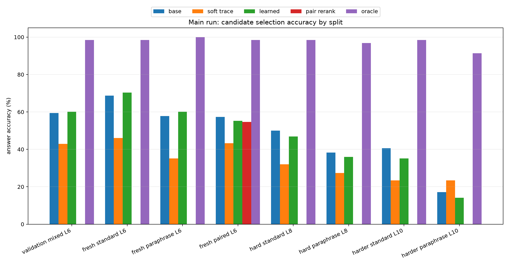
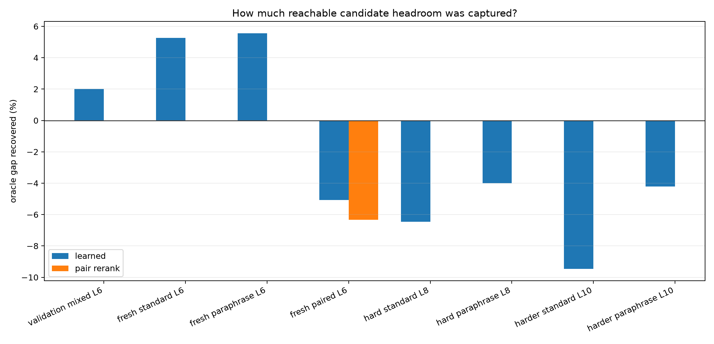
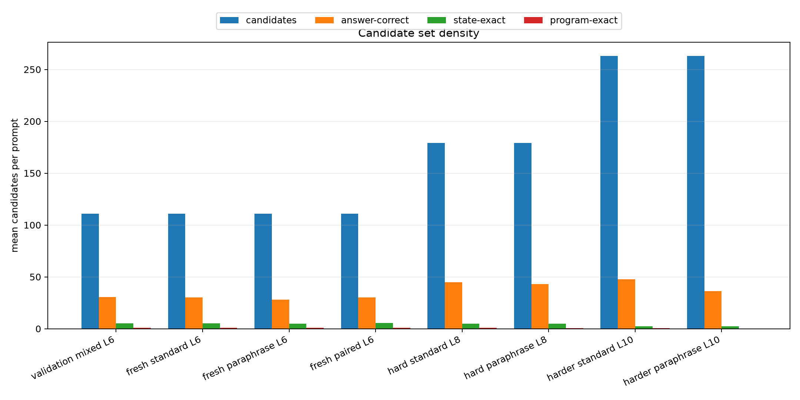
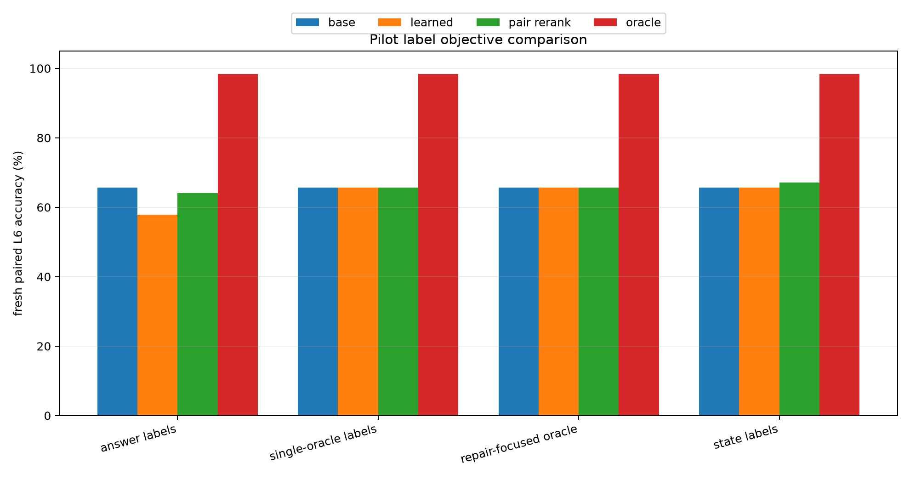
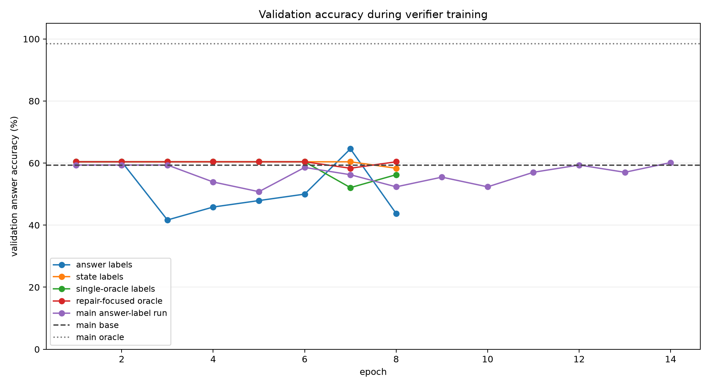
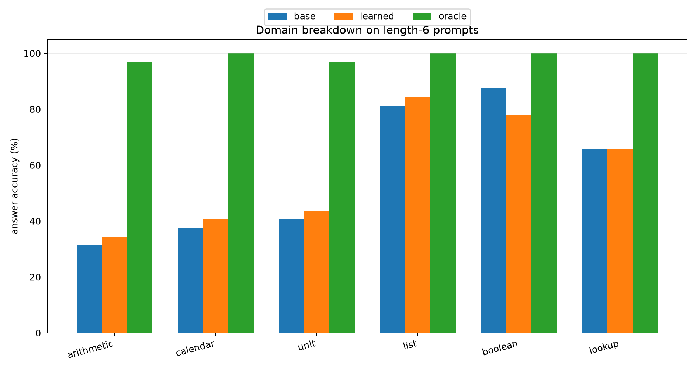

# Qwen Context-Conditioned Trace Reranker

## Abstract

This experiment tests a complete-program posttraining route for improving a frozen local Qwen compiler. A Qwen3-4B hidden-state adapter emits a compact virtual-machine program. Around that program, the system enumerates local executable edits and trains a small context-conditioned verifier to select the best candidate using only prompt hidden-state context, candidate features, and execution traces. The verifier never sees the target answer at inference time.

The result is diagnostic rather than successful. The candidate search contains answer-correct programs for 91.4% to 100.0% of the main evaluation prompts, so the executable candidate set has substantial reachable headroom. The learned verifier captures only small in-distribution gains and loses accuracy on paired and longer-chain splits. The bottleneck is therefore candidate selection and credit assignment, not candidate availability.

## Question

Can a small posttraining module make a frozen Qwen-attached compiler select better complete programs by inspecting executable traces, without forcing the model to generate every intermediate reasoning step as text?

## Method

- Base model: `Qwen/Qwen3-4B`.
- Value space: arithmetic over modulus `97` with up to `10` VM steps.
- Frozen compiler: Qwen hidden states feed a trained hidden-VM compiler checkpoint.
- Candidate generator: local edits around the compiler argmax program, with top-k alternatives and up to `2` edits.
- Verifier input: candidate execution trace, scalar candidate features, and compact prompt hidden-state summaries.
- Main verifier: `3` trace-transformer layers, width `128`, `4` heads.
- Main training set: `384` prompts, length range `1` to `6`, positive label `answer`.
- Main checkpoint selection: best validation learned accuracy; selected epoch `14`.

The key baselines are:

- `base`: the frozen compiler argmax program.
- `soft trace`: a differentiable executor scoring heuristic.
- `learned`: the trained verifier top-1 selection.
- `pair rerank`: pair-level consistency reranking for paraphrase pairs.
- `oracle`: any answer-correct candidate in the generated local neighborhood.

## Main Results

| split | base | soft trace | learned | pair rerank | oracle | learned gap recovered | avg candidates | answer positives |
|---|---:|---:|---:|---:|---:|---:|---:|---:|
| validation mixed L6 | 59.4% | 43.0% | 60.2% | n/a | 98.4% | 2.0% | 111.0 | 30.4 |
| fresh standard L6 | 68.8% | 46.1% | 70.3% | n/a | 98.4% | 5.3% | 111.0 | 30.3 |
| fresh paraphrase L6 | 57.8% | 35.2% | 60.2% | n/a | 100.0% | 5.6% | 111.0 | 27.9 |
| fresh paired L6 | 57.3% | 43.2% | 55.2% | 54.7% | 98.4% | -5.1% | 111.0 | 30.2 |
| hard standard L8 | 50.0% | 32.0% | 46.9% | n/a | 98.4% | -6.5% | 179.0 | 44.7 |
| hard paraphrase L8 | 38.3% | 27.3% | 35.9% | n/a | 96.9% | -4.0% | 179.0 | 43.2 |
| harder standard L10 | 40.6% | 23.4% | 35.2% | n/a | 98.4% | -9.5% | 263.0 | 47.6 |
| harder paraphrase L10 | 17.2% | 23.4% | 14.1% | n/a | 91.4% | -4.2% | 263.0 | 36.2 |

Fresh length-6 standard prompts improved from 68.8% to 70.3%, a 1.6% absolute gain. Fresh length-6 paraphrase prompts improved from 57.8% to 60.2%. These gains are real but small relative to the oracle.

The same selector did not extrapolate. Fresh paired length-6 accuracy moved from 57.3% to 55.2%, a -2.1% absolute change. Harder standard length-10 moved from 40.6% to 35.2%, a -5.5% absolute change. The oracle stayed high on these splits, so the selector failed to locate available correct candidates.

## Candidate Geometry

The candidate generator is broad. On length-6 fresh splits it produces about 111 candidates per prompt, with roughly 28 to 30 answer-correct candidates. On length-10 splits it produces 263 candidates per prompt, with many answer-correct candidates but far fewer state-exact or program-exact candidates. This explains why answer-only labels are easy to satisfy but weakly identify the best computational trace.

## Objective Pilots

Several label objectives were tested before the main run:

- Answer-correct labels learned a nontrivial selector on validation but were noisy because many candidates share the final answer.
- State-exact labels were too conservative and mostly preserved the base program.
- Single-oracle labels were sharper but still mostly preserved the base program.
- Repair-focused weighting did not overcome the base-preservation tendency.

The main run eventually recovered the best validation learned accuracy at epoch 14, but validation gains were small while train accuracy rose strongly. That is the signature of a selector that can fit candidate artifacts without learning a robust preference rule for unseen prompts.

## Domain Breakdown

| domain | base | learned | oracle | learned delta |
|---|---:|---:|---:|---:|
| arithmetic | 31.2% | 34.4% | 96.9% | 3.1% |
| calendar | 37.5% | 40.6% | 100.0% | 3.1% |
| unit | 40.6% | 43.8% | 96.9% | 3.1% |
| list | 81.2% | 84.4% | 100.0% | 3.1% |
| boolean | 87.5% | 78.1% | 100.0% | -9.4% |
| lookup | 65.6% | 65.6% | 100.0% | 0.0% |

The verifier helped arithmetic, calendar, unit, and list prompts modestly, left lookup unchanged, and hurt boolean prompts. Boolean has many answer-correct candidates but relatively little trace-identifying signal because final answers collapse to few values.

## Interpretation

This experiment answers one useful subquestion: local executable candidate search is not the limiting factor. The oracle remains high even when the base compiler is weak. The limiting factor is how to train a verifier that identifies the right complete program from a dense equivalence class of answer-correct candidates.

The current learned verifier is too passive. It sees traces and context, but its supervision says many different programs are equally good whenever they hit the final answer. Sharper labels alone did not fix this because the base program dominates many training groups and the correct non-base candidates are sparse. The result argues against scaling this exact reranker unchanged.

## Most Impactful Next Options

1. Train the selector from executable teacher traces, not just final answers.
   Use the oracle candidate to produce dense supervision over every intermediate state and operation, then train the verifier or compiler with a margin that explicitly ranks state-consistent candidates above answer-only candidates. This directly targets the observed dense-label failure.

2. Convert reranking into preference learning on repairable failures.
   Filter training to groups where the base program is wrong and at least one non-base candidate is right, then train pairwise preferences with hard negatives that share the answer but diverge in state. This removes the base-preservation shortcut.

3. Let Qwen read serialized candidate traces.
   Instead of only a small verifier, serialize a small shortlist of candidate programs and traces back into Qwen hidden states or text tokens, then train a LoRA selector head. This tests whether the frozen model already has the semantic machinery needed to choose among executable candidates when the candidates are made legible.

4. Train a differentiable interpreter objective upstream.
   Backpropagate through the soft executor into the adapter with auxiliary losses on intermediate states, then use the discrete candidate oracle only for evaluation. This attacks the compiler's crystallized program quality rather than relying on post-hoc selection.

The first option is the cleanest next experiment because it directly matches the failure mode found here: answer-correct candidate availability is high, but answer-only selection is underdetermined.

## Artifacts

- Aggregate metrics: `experiments/qwen_context_trace_verifier/analysis/all_final_metrics.csv`
- Main metrics: `experiments/qwen_context_trace_verifier/analysis/final_metrics.csv`
- Training logs: `experiments/qwen_context_trace_verifier/analysis/verifier_train_logs.csv`
- Checkpoint manifest: `experiments/qwen_context_trace_verifier/checkpoint_manifest.csv`
- Large checkpoints: `large_artifacts/qwen_context_trace_verifier/checkpoints`
