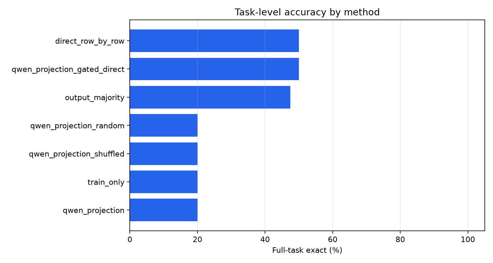
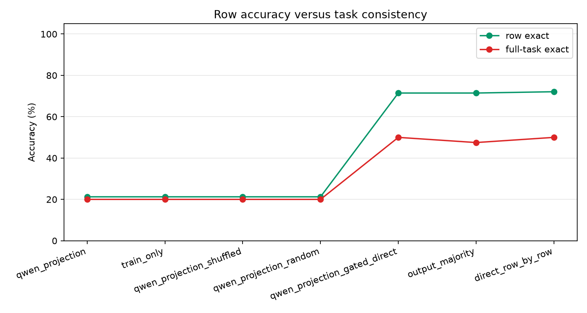
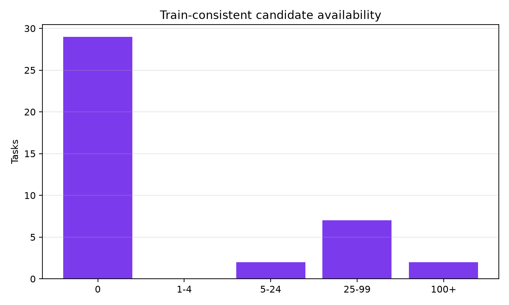
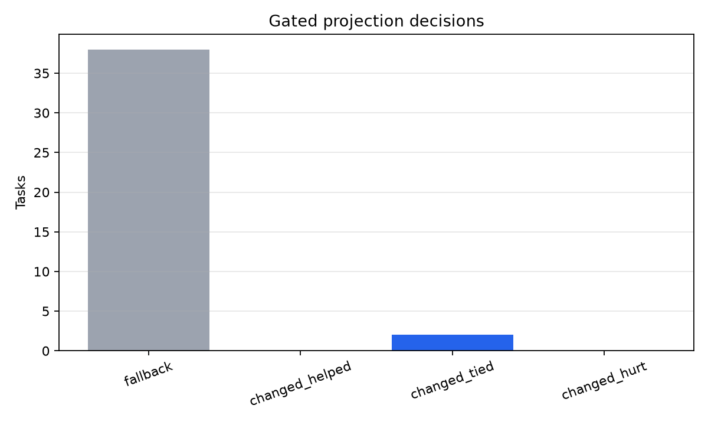
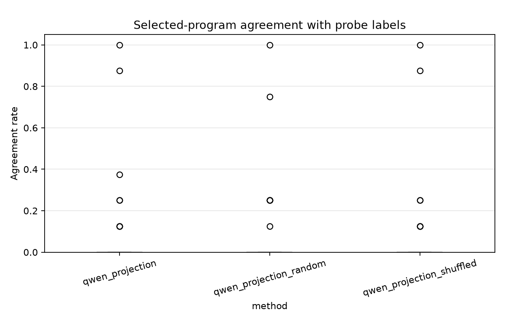
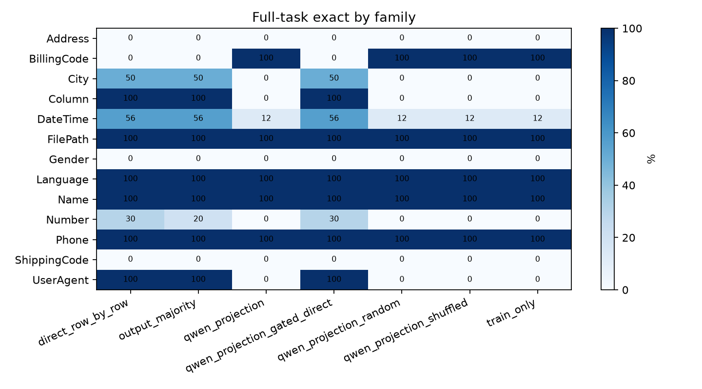

# Counterexample-Guided Consistency Projection

## Question

Can noisy row-level model guesses be converted into a stable task-level deterministic transformation?

The experiment generates counterexample-style probe inputs from each task's training examples, labels those probes with a row-level model, and selects among train-consistent deterministic expressions using probe-label agreement plus a small complexity penalty. The selected expression is then evaluated on held-out rows from the same public transformation tasks.

## Setup

- Benchmark root: `/workspace/large_artifacts/qwen_counterexample_guided_projection/prose-benchmarks`
- Run: `main_qwen_probe_40`
- Tasks: 40
- Train rows per task: 4
- Held-out cap per task: 6
- Generated probes per task: 8
- Candidate cap per task: 400
- Probe labels used: 320
- New probe-label calls during this invocation: no

## Main Result

|method|tasks|row_exact|full_task_exact|median_candidates|median_probe_agreement|
|---|---|---|---|---|---|
|direct_row_by_row|40|72.1%|50.0%|0.00|0.0%|
|qwen_projection_gated_direct|40|71.5%|50.0%|0.00|0.0%|
|output_majority|40|71.5%|47.5%|0.00|0.0%|
|qwen_projection|40|21.2%|20.0%|0.00|0.0%|
|qwen_projection_random|40|21.2%|20.0%|0.00|0.0%|
|qwen_projection_shuffled|40|21.2%|20.0%|0.00|0.0%|
|train_only|40|21.2%|20.0%|0.00|0.0%|

## Interpretation

The probe-guided projection underperformed direct row inference by 30.0 points. Real and shuffled probe labels were separated by only 0.0 points. Probe-guided and train-only deterministic selection were separated by only 0.0 points.

The primary success condition is not row-level accuracy alone. The goal is to improve strict full-task exactness: every held-out row for a task must be correct under one stable transformation.

## Diagnostic Findings

- Candidate availability was the main bottleneck: 29 of 40 tasks had zero train-consistent deterministic candidates, 11 had at least one, and 11 had more than one.
- The ungated projection did not improve over train-only selection. This means the probe labels did not rescue the candidate-selection objective on this benchmark slice.
- The gated projection changed 2 tasks: 0 helped, 2 tied, and 0 hurt relative to direct row inference on strict full-task exactness.
- The output-majority baseline did not improve over direct row inference, so simple agreement among prompt variants was not enough to stabilize full-task behavior.

## Charts

## Family Breakdown

|method|family|tasks|row_exact|full_task_exact|
|---|---|---|---|---|
|direct_row_by_row|Address|2|50.0%|0.0%|
|direct_row_by_row|BillingCode|1|33.3%|0.0%|
|direct_row_by_row|City|2|87.5%|50.0%|
|direct_row_by_row|Column|1|100.0%|100.0%|
|direct_row_by_row|DateTime|16|70.8%|56.2%|
|direct_row_by_row|FilePath|1|100.0%|100.0%|
|direct_row_by_row|Gender|1|66.7%|0.0%|
|direct_row_by_row|Language|1|100.0%|100.0%|
|direct_row_by_row|Name|1|100.0%|100.0%|
|direct_row_by_row|Number|10|64.2%|30.0%|
|direct_row_by_row|Phone|2|100.0%|100.0%|
|direct_row_by_row|ShippingCode|1|33.3%|0.0%|
|direct_row_by_row|UserAgent|1|100.0%|100.0%|
|output_majority|Address|2|50.0%|0.0%|
|output_majority|BillingCode|1|0.0%|0.0%|
|output_majority|City|2|87.5%|50.0%|
|output_majority|Column|1|100.0%|100.0%|
|output_majority|DateTime|16|76.0%|56.2%|
|output_majority|FilePath|1|100.0%|100.0%|
|output_majority|Gender|1|66.7%|0.0%|
|output_majority|Language|1|100.0%|100.0%|
|output_majority|Name|1|100.0%|100.0%|
|output_majority|Number|10|56.7%|20.0%|
|output_majority|Phone|2|100.0%|100.0%|
|output_majority|ShippingCode|1|33.3%|0.0%|
|output_majority|UserAgent|1|100.0%|100.0%|
|qwen_projection|Address|2|0.0%|0.0%|
|qwen_projection|BillingCode|1|100.0%|100.0%|
|qwen_projection|City|2|25.0%|0.0%|
|qwen_projection|Column|1|0.0%|0.0%|
|qwen_projection|DateTime|16|12.5%|12.5%|
|qwen_projection|FilePath|1|100.0%|100.0%|
|qwen_projection|Gender|1|0.0%|0.0%|
|qwen_projection|Language|1|100.0%|100.0%|
|qwen_projection|Name|1|100.0%|100.0%|
|qwen_projection|Number|10|0.0%|0.0%|
|qwen_projection|Phone|2|100.0%|100.0%|
|qwen_projection|ShippingCode|1|0.0%|0.0%|
|qwen_projection|UserAgent|1|0.0%|0.0%|
|qwen_projection_gated_direct|Address|2|50.0%|0.0%|
|qwen_projection_gated_direct|BillingCode|1|33.3%|0.0%|
|qwen_projection_gated_direct|City|2|75.0%|50.0%|
|qwen_projection_gated_direct|Column|1|100.0%|100.0%|
|qwen_projection_gated_direct|DateTime|16|70.8%|56.2%|
|qwen_projection_gated_direct|FilePath|1|100.0%|100.0%|
|qwen_projection_gated_direct|Gender|1|66.7%|0.0%|
|qwen_projection_gated_direct|Language|1|100.0%|100.0%|
|qwen_projection_gated_direct|Name|1|100.0%|100.0%|
|qwen_projection_gated_direct|Number|10|64.2%|30.0%|
|qwen_projection_gated_direct|Phone|2|100.0%|100.0%|
|qwen_projection_gated_direct|ShippingCode|1|33.3%|0.0%|
|qwen_projection_gated_direct|UserAgent|1|100.0%|100.0%|
|qwen_projection_random|Address|2|0.0%|0.0%|
|qwen_projection_random|BillingCode|1|100.0%|100.0%|
|qwen_projection_random|City|2|25.0%|0.0%|
|qwen_projection_random|Column|1|0.0%|0.0%|
|qwen_projection_random|DateTime|16|12.5%|12.5%|
|qwen_projection_random|FilePath|1|100.0%|100.0%|
|qwen_projection_random|Gender|1|0.0%|0.0%|
|qwen_projection_random|Language|1|100.0%|100.0%|
|qwen_projection_random|Name|1|100.0%|100.0%|
|qwen_projection_random|Number|10|0.0%|0.0%|
|qwen_projection_random|Phone|2|100.0%|100.0%|
|qwen_projection_random|ShippingCode|1|0.0%|0.0%|
|qwen_projection_random|UserAgent|1|0.0%|0.0%|
|qwen_projection_shuffled|Address|2|0.0%|0.0%|
|qwen_projection_shuffled|BillingCode|1|100.0%|100.0%|
|qwen_projection_shuffled|City|2|25.0%|0.0%|
|qwen_projection_shuffled|Column|1|0.0%|0.0%|
|qwen_projection_shuffled|DateTime|16|12.5%|12.5%|
|qwen_projection_shuffled|FilePath|1|100.0%|100.0%|
|qwen_projection_shuffled|Gender|1|0.0%|0.0%|
|qwen_projection_shuffled|Language|1|100.0%|100.0%|
|qwen_projection_shuffled|Name|1|100.0%|100.0%|
|qwen_projection_shuffled|Number|10|0.0%|0.0%|
|qwen_projection_shuffled|Phone|2|100.0%|100.0%|
|qwen_projection_shuffled|ShippingCode|1|0.0%|0.0%|
|qwen_projection_shuffled|UserAgent|1|0.0%|0.0%|
|train_only|Address|2|0.0%|0.0%|
|train_only|BillingCode|1|100.0%|100.0%|
|train_only|City|2|25.0%|0.0%|
|train_only|Column|1|0.0%|0.0%|
|train_only|DateTime|16|12.5%|12.5%|
|train_only|FilePath|1|100.0%|100.0%|
|train_only|Gender|1|0.0%|0.0%|
|train_only|Language|1|100.0%|100.0%|
|train_only|Name|1|100.0%|100.0%|
|train_only|Number|10|0.0%|0.0%|
|train_only|Phone|2|100.0%|100.0%|
|train_only|ShippingCode|1|0.0%|0.0%|
|train_only|UserAgent|1|0.0%|0.0%|

## Selected Program Examples

|task_id|family|method|candidate_count|probe_agreement_rate|program|row_exact|full_task_exact|
|---|---|---|---|---|---|---|---|
|Address.000002|Address|direct_row_by_row|0|0.0%||33.3%|False|
|Address.000013|Address|direct_row_by_row|0|0.0%||66.7%|False|
|BillingCode.000007|BillingCode|direct_row_by_row|104|0.0%||33.3%|False|
|City.000010|City|direct_row_by_row|0|0.0%||100.0%|True|
|City.000011|City|direct_row_by_row|59|0.0%||75.0%|False|
|Column.000001|Column|direct_row_by_row|0|0.0%||100.0%|True|
|DateTime.000004|DateTime|direct_row_by_row|400|0.0%||100.0%|True|
|DateTime.000007|DateTime|direct_row_by_row|0|0.0%||100.0%|True|
|DateTime.000017|DateTime|direct_row_by_row|0|0.0%||100.0%|True|
|DateTime.000025|DateTime|direct_row_by_row|0|0.0%||100.0%|True|
|DateTime.000027|DateTime|direct_row_by_row|0|0.0%||33.3%|False|
|DateTime.000034|DateTime|direct_row_by_row|0|0.0%||100.0%|True|
|DateTime.000051|DateTime|direct_row_by_row|0|0.0%||33.3%|False|
|DateTime.000076|DateTime|direct_row_by_row|0|0.0%||66.7%|False|
|DateTime.000081|DateTime|direct_row_by_row|0|0.0%||50.0%|False|
|DateTime.000094|DateTime|direct_row_by_row|0|0.0%||100.0%|True|
|DateTime.000104|DateTime|direct_row_by_row|90|0.0%||100.0%|True|
|DateTime.000108|DateTime|direct_row_by_row|0|0.0%||100.0%|True|
|DateTime.000111|DateTime|direct_row_by_row|0|0.0%||100.0%|True|
|DateTime.000114|DateTime|direct_row_by_row|0|0.0%||0.0%|False|
|DateTime.000115|DateTime|direct_row_by_row|31|0.0%||0.0%|False|
|DateTime.000116|DateTime|direct_row_by_row|0|0.0%||50.0%|False|
|FilePath.000001|FilePath|direct_row_by_row|88|0.0%||100.0%|True|
|Gender.000001|Gender|direct_row_by_row|0|0.0%||66.7%|False|
|Language.000002|Language|direct_row_by_row|53|0.0%||100.0%|True|
|Name.000028|Name|direct_row_by_row|24|0.0%||100.0%|True|
|Number.000008|Number|direct_row_by_row|0|0.0%||33.3%|False|
|Number.000015|Number|direct_row_by_row|0|0.0%||33.3%|False|
|Number.000016|Number|direct_row_by_row|0|0.0%||83.3%|False|
|Number.000022|Number|direct_row_by_row|0|0.0%||100.0%|True|
|Number.000028|Number|direct_row_by_row|0|0.0%||100.0%|True|
|Number.000029|Number|direct_row_by_row|0|0.0%||66.7%|False|
|Number.000043|Number|direct_row_by_row|0|0.0%||100.0%|True|
|Number.000049|Number|direct_row_by_row|0|0.0%||25.0%|False|
|Number.000075|Number|direct_row_by_row|0|0.0%||66.7%|False|
|Number.000077|Number|direct_row_by_row|77|0.0%||33.3%|False|
|Phone.000008|Phone|direct_row_by_row|8|0.0%||100.0%|True|
|Phone.000011|Phone|direct_row_by_row|44|0.0%||100.0%|True|
|ShippingCode.000008|ShippingCode|direct_row_by_row|0|0.0%||33.3%|False|
|UserAgent.000003|UserAgent|direct_row_by_row|0|0.0%||100.0%|True|
|Address.000002|Address|output_majority|0|0.0%||33.3%|False|
|Address.000013|Address|output_majority|0|0.0%||66.7%|False|
|BillingCode.000007|BillingCode|output_majority|104|0.0%||0.0%|False|
|City.000010|City|output_majority|0|0.0%||100.0%|True|
|City.000011|City|output_majority|59|0.0%||75.0%|False|
|Column.000001|Column|output_majority|0|0.0%||100.0%|True|
|DateTime.000004|DateTime|output_majority|400|0.0%||100.0%|True|
|DateTime.000007|DateTime|output_majority|0|0.0%||100.0%|True|
|DateTime.000017|DateTime|output_majority|0|0.0%||100.0%|True|
|DateTime.000025|DateTime|output_majority|0|0.0%||100.0%|True|
|DateTime.000027|DateTime|output_majority|0|0.0%||66.7%|False|
|DateTime.000034|DateTime|output_majority|0|0.0%||100.0%|True|
|DateTime.000051|DateTime|output_majority|0|0.0%||33.3%|False|
|DateTime.000076|DateTime|output_majority|0|0.0%||66.7%|False|
|DateTime.000081|DateTime|output_majority|0|0.0%||50.0%|False|
|DateTime.000094|DateTime|output_majority|0|0.0%||100.0%|True|
|DateTime.000104|DateTime|output_majority|90|0.0%||100.0%|True|
|DateTime.000108|DateTime|output_majority|0|0.0%||100.0%|True|
|DateTime.000111|DateTime|output_majority|0|0.0%||100.0%|True|
|DateTime.000114|DateTime|output_majority|0|0.0%||50.0%|False|
|DateTime.000115|DateTime|output_majority|31|0.0%||0.0%|False|
|DateTime.000116|DateTime|output_majority|0|0.0%||50.0%|False|
|FilePath.000001|FilePath|output_majority|88|0.0%||100.0%|True|
|Gender.000001|Gender|output_majority|0|0.0%||66.7%|False|
|Language.000002|Language|output_majority|53|0.0%||100.0%|True|
|Name.000028|Name|output_majority|24|0.0%||100.0%|True|
|Number.000008|Number|output_majority|0|0.0%||16.7%|False|
|Number.000015|Number|output_majority|0|0.0%||50.0%|False|
|Number.000016|Number|output_majority|0|0.0%||50.0%|False|
|Number.000022|Number|output_majority|0|0.0%||33.3%|False|
|Number.000028|Number|output_majority|0|0.0%||100.0%|True|
|Number.000029|Number|output_majority|0|0.0%||66.7%|False|
|Number.000043|Number|output_majority|0|0.0%||100.0%|True|
|Number.000049|Number|output_majority|0|0.0%||0.0%|False|
|Number.000075|Number|output_majority|0|0.0%||83.3%|False|
|Number.000077|Number|output_majority|77|0.0%||66.7%|False|
|Phone.000008|Phone|output_majority|8|0.0%||100.0%|True|
|Phone.000011|Phone|output_majority|44|0.0%||100.0%|True|
|ShippingCode.000008|ShippingCode|output_majority|0|0.0%||33.3%|False|
|UserAgent.000003|UserAgent|output_majority|0|0.0%||100.0%|True|

## Projection-Induced Program Changes

|task_id|probe_agreement_rate|train_only_program|projection_program|train_only_full_task_exact|projection_full_task_exact|train_only_row_exact|projection_row_exact|
|---|---|---|---|---|---|---|---|
|BillingCode.000007|25.0%|affix(&#x27;&#x27;,COL0,&#x27;]&#x27;)|affix(&#x27;&#x27;,upper(COL0),&#x27;]&#x27;)|True|True|100.0%|100.0%|
|Language.000002|37.5%|file_stem(COL1)|lower(file_stem(COL1))|True|True|100.0%|100.0%|
|Name.000028|12.5%|first_word(COL0)|title(first_word(COL0))|True|True|100.0%|100.0%|

## Gated Projection Changes

|task_id|probe_agreement_rate|program|direct_row|gated_row|direct_full|gated_full|
|---|---|---|---|---|---|---|
|City.000011|87.5%|const(&#x27;New York City&#x27;)|0.75|0.50|False|False|
|DateTime.000115|100.0%|const(&#x27;0-20&#x27;)|0.00|0.00|False|False|

## Files

- `runs/main_qwen_probe_40/task_details.csv`
- `runs/main_qwen_probe_40/row_details.csv`
- `runs/main_qwen_probe_40/probe_details.csv`
- `runs/main_qwen_probe_40/qwen_probe_labels.csv`
- `analysis/summary.csv`
- `analysis/family_summary.csv`
- `analysis/task_details.csv`
- `analysis/row_details.csv`
- `analysis/probe_details.csv`
