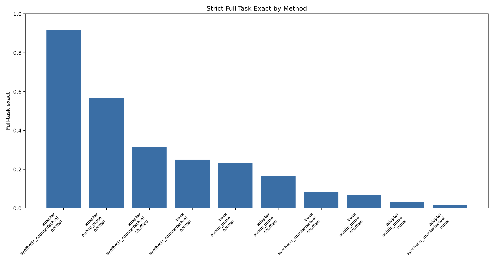
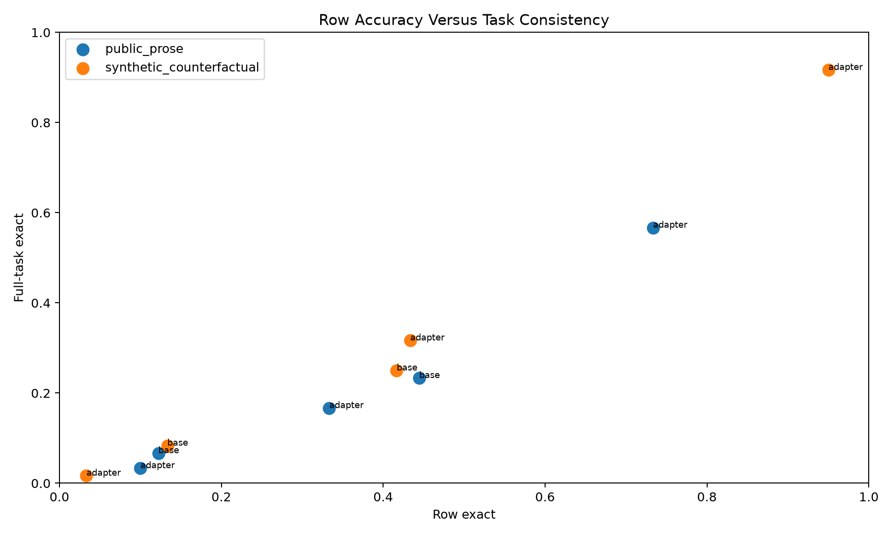
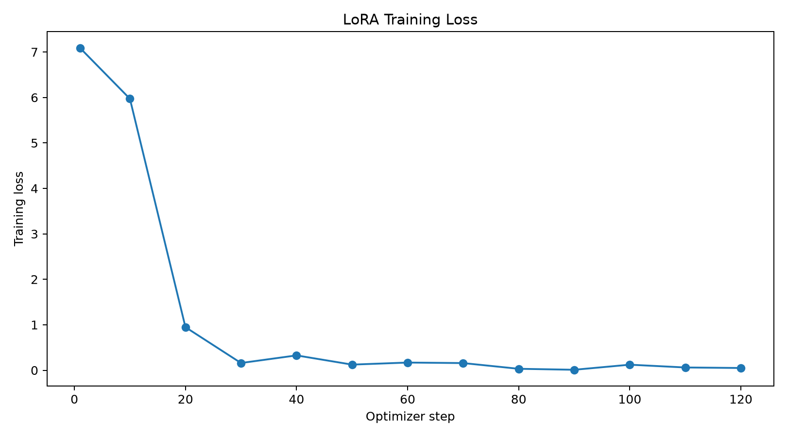
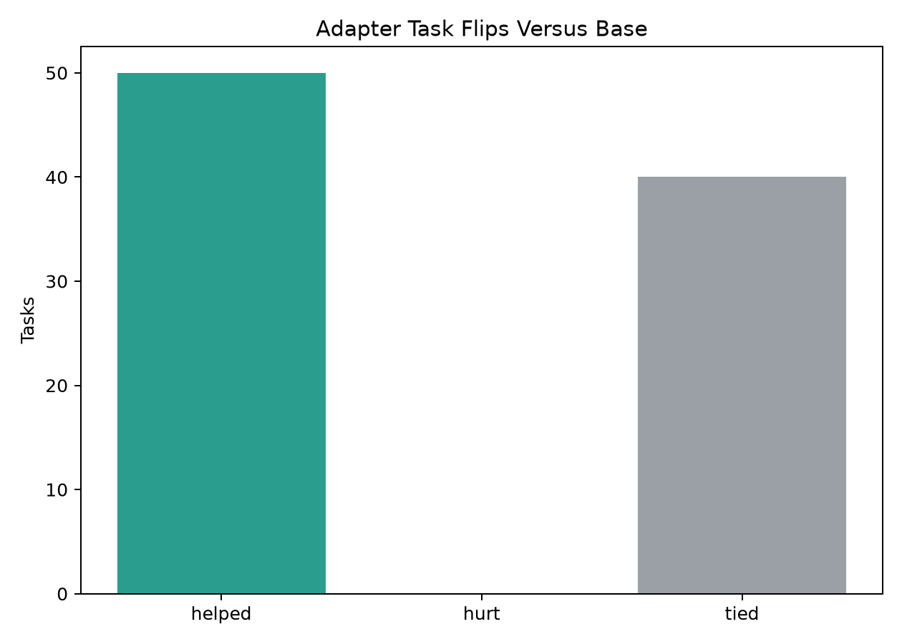

# Counterfactual Episodic ICL Posttraining

## Question

Can answer-only LoRA posttraining on counterfactual few-shot episodes improve a 4B model's ability to infer a task from support examples, rather than relying on a task-family prior?

The training episodes are synthetic and deliberately counterfactual: the same kind of query input can require incompatible outputs depending on the support examples. Public benchmark outputs are used only for evaluation.

## Setup

- Run: `main_v2`
- Model: `Qwen/Qwen3-4B`
- Train episodes: `800`
- Train steps: `120`
- LoRA rank: `16`
- Synthetic eval counterfactual pairs: `30`
- Public PROSE tasks: `30`
- Elapsed seconds: `588.9`

## Main Result

| method   | split                    | support_mode   |   tasks |   rows | row_exact   | full_task_exact   |
|:---------|:-------------------------|:---------------|--------:|-------:|:------------|:------------------|
| adapter  | public_prose             | none           |      30 |     90 | 10.0%       | 3.3%              |
| adapter  | public_prose             | normal         |      30 |     90 | 73.3%       | 56.7%             |
| adapter  | public_prose             | shuffled       |      30 |     90 | 33.3%       | 16.7%             |
| base     | public_prose             | normal         |      30 |     90 | 44.4%       | 23.3%             |
| base     | public_prose             | shuffled       |      30 |     90 | 12.2%       | 6.7%              |
| adapter  | synthetic_counterfactual | none           |      60 |    120 | 3.3%        | 1.7%              |
| adapter  | synthetic_counterfactual | normal         |      60 |    120 | 95.0%       | 91.7%             |
| adapter  | synthetic_counterfactual | shuffled       |      60 |    120 | 43.3%       | 31.7%             |
| base     | synthetic_counterfactual | normal         |      60 |    120 | 41.7%       | 25.0%             |
| base     | synthetic_counterfactual | shuffled       |      60 |    120 | 13.3%       | 8.3%              |

## Interpretation

On held-out synthetic counterfactual episodes, the adapter changes full-task exactness from `25.0%` to `91.7%`. With shuffled support examples, the adapter scores `31.7%`.
On the public text-transformation sample, the adapter changes full-task exactness from `23.3%` to `56.7%`. With shuffled support examples, the adapter scores `16.7%`.

The synthetic split shows a real support-conditioning effect: performance improves and shuffled support degrades it. The public split determines whether that learned behavior transfers outside the synthetic generator.
The public benchmark transfer is positive at the tested scale.

## Charts

## Task-Level Details

| method   | split        | support_mode   | task_id         | family   | row_exact   | full_task_exact   |   rows |
|:---------|:-------------|:---------------|:----------------|:---------|:------------|:------------------|-------:|
| adapter  | public_prose | none           | Address.000014  | Address  | 0.0%        | 0.0%              |      3 |
| adapter  | public_prose | normal         | Address.000014  | Address  | 100.0%      | 100.0%            |      3 |
| adapter  | public_prose | shuffled       | Address.000014  | Address  | 100.0%      | 100.0%            |      3 |
| base     | public_prose | normal         | Address.000014  | Address  | 100.0%      | 100.0%            |      3 |
| base     | public_prose | shuffled       | Address.000014  | Address  | 0.0%        | 0.0%              |      3 |
| adapter  | public_prose | none           | Currency.000003 | Currency | 66.7%       | 0.0%              |      3 |
| adapter  | public_prose | normal         | Currency.000003 | Currency | 100.0%      | 100.0%            |      3 |
| adapter  | public_prose | shuffled       | Currency.000003 | Currency | 0.0%        | 0.0%              |      3 |
| base     | public_prose | normal         | Currency.000003 | Currency | 66.7%       | 0.0%              |      3 |
| base     | public_prose | shuffled       | Currency.000003 | Currency | 0.0%        | 0.0%              |      3 |
| adapter  | public_prose | none           | DateTime.000003 | DateTime | 0.0%        | 0.0%              |      3 |
| adapter  | public_prose | normal         | DateTime.000003 | DateTime | 100.0%      | 100.0%            |      3 |
| adapter  | public_prose | shuffled       | DateTime.000003 | DateTime | 0.0%        | 0.0%              |      3 |
| base     | public_prose | normal         | DateTime.000003 | DateTime | 33.3%       | 0.0%              |      3 |
| base     | public_prose | shuffled       | DateTime.000003 | DateTime | 0.0%        | 0.0%              |      3 |
| adapter  | public_prose | none           | DateTime.000009 | DateTime | 0.0%        | 0.0%              |      3 |
| adapter  | public_prose | normal         | DateTime.000009 | DateTime | 100.0%      | 100.0%            |      3 |
| adapter  | public_prose | shuffled       | DateTime.000009 | DateTime | 100.0%      | 100.0%            |      3 |
| base     | public_prose | normal         | DateTime.000009 | DateTime | 0.0%        | 0.0%              |      3 |
| base     | public_prose | shuffled       | DateTime.000009 | DateTime | 0.0%        | 0.0%              |      3 |
| adapter  | public_prose | none           | DateTime.000012 | DateTime | 66.7%       | 0.0%              |      3 |
| adapter  | public_prose | normal         | DateTime.000012 | DateTime | 66.7%       | 0.0%              |      3 |
| adapter  | public_prose | shuffled       | DateTime.000012 | DateTime | 0.0%        | 0.0%              |      3 |
| base     | public_prose | normal         | DateTime.000012 | DateTime | 66.7%       | 0.0%              |      3 |
| base     | public_prose | shuffled       | DateTime.000012 | DateTime | 0.0%        | 0.0%              |      3 |
| adapter  | public_prose | none           | DateTime.000018 | DateTime | 0.0%        | 0.0%              |      3 |
| adapter  | public_prose | normal         | DateTime.000018 | DateTime | 100.0%      | 100.0%            |      3 |
| adapter  | public_prose | shuffled       | DateTime.000018 | DateTime | 66.7%       | 0.0%              |      3 |
| base     | public_prose | normal         | DateTime.000018 | DateTime | 0.0%        | 0.0%              |      3 |
| base     | public_prose | shuffled       | DateTime.000018 | DateTime | 0.0%        | 0.0%              |      3 |
| adapter  | public_prose | none           | DateTime.000030 | DateTime | 0.0%        | 0.0%              |      3 |
| adapter  | public_prose | normal         | DateTime.000030 | DateTime | 0.0%        | 0.0%              |      3 |
| adapter  | public_prose | shuffled       | DateTime.000030 | DateTime | 0.0%        | 0.0%              |      3 |
| base     | public_prose | normal         | DateTime.000030 | DateTime | 33.3%       | 0.0%              |      3 |
| base     | public_prose | shuffled       | DateTime.000030 | DateTime | 0.0%        | 0.0%              |      3 |
| adapter  | public_prose | none           | DateTime.000032 | DateTime | 0.0%        | 0.0%              |      3 |
| adapter  | public_prose | normal         | DateTime.000032 | DateTime | 66.7%       | 0.0%              |      3 |
| adapter  | public_prose | shuffled       | DateTime.000032 | DateTime | 33.3%       | 0.0%              |      3 |
| base     | public_prose | normal         | DateTime.000032 | DateTime | 33.3%       | 0.0%              |      3 |
| base     | public_prose | shuffled       | DateTime.000032 | DateTime | 33.3%       | 0.0%              |      3 |
| adapter  | public_prose | none           | DateTime.000033 | DateTime | 0.0%        | 0.0%              |      3 |
| adapter  | public_prose | normal         | DateTime.000033 | DateTime | 100.0%      | 100.0%            |      3 |
| adapter  | public_prose | shuffled       | DateTime.000033 | DateTime | 0.0%        | 0.0%              |      3 |
| base     | public_prose | normal         | DateTime.000033 | DateTime | 33.3%       | 0.0%              |      3 |
| base     | public_prose | shuffled       | DateTime.000033 | DateTime | 0.0%        | 0.0%              |      3 |
| adapter  | public_prose | none           | DateTime.000075 | DateTime | 0.0%        | 0.0%              |      3 |
| adapter  | public_prose | normal         | DateTime.000075 | DateTime | 66.7%       | 0.0%              |      3 |
| adapter  | public_prose | shuffled       | DateTime.000075 | DateTime | 0.0%        | 0.0%              |      3 |
| base     | public_prose | normal         | DateTime.000075 | DateTime | 33.3%       | 0.0%              |      3 |
| base     | public_prose | shuffled       | DateTime.000075 | DateTime | 0.0%        | 0.0%              |      3 |
| adapter  | public_prose | none           | DateTime.000091 | DateTime | 0.0%        | 0.0%              |      3 |
| adapter  | public_prose | normal         | DateTime.000091 | DateTime | 100.0%      | 100.0%            |      3 |
| adapter  | public_prose | shuffled       | DateTime.000091 | DateTime | 66.7%       | 0.0%              |      3 |
| base     | public_prose | normal         | DateTime.000091 | DateTime | 100.0%      | 100.0%            |      3 |
| base     | public_prose | shuffled       | DateTime.000091 | DateTime | 0.0%        | 0.0%              |      3 |
| adapter  | public_prose | none           | DateTime.000097 | DateTime | 0.0%        | 0.0%              |      3 |
| adapter  | public_prose | normal         | DateTime.000097 | DateTime | 66.7%       | 0.0%              |      3 |
| adapter  | public_prose | shuffled       | DateTime.000097 | DateTime | 33.3%       | 0.0%              |      3 |
| base     | public_prose | normal         | DateTime.000097 | DateTime | 66.7%       | 0.0%              |      3 |
| base     | public_prose | shuffled       | DateTime.000097 | DateTime | 0.0%        | 0.0%              |      3 |
| adapter  | public_prose | none           | DateTime.000116 | DateTime | 0.0%        | 0.0%              |      3 |
| adapter  | public_prose | normal         | DateTime.000116 | DateTime | 66.7%       | 0.0%              |      3 |
| adapter  | public_prose | shuffled       | DateTime.000116 | DateTime | 66.7%       | 0.0%              |      3 |
| base     | public_prose | normal         | DateTime.000116 | DateTime | 66.7%       | 0.0%              |      3 |
| base     | public_prose | shuffled       | DateTime.000116 | DateTime | 66.7%       | 0.0%              |      3 |
| adapter  | public_prose | none           | Email.000013    | Email    | 0.0%        | 0.0%              |      3 |
| adapter  | public_prose | normal         | Email.000013    | Email    | 100.0%      | 100.0%            |      3 |
| adapter  | public_prose | shuffled       | Email.000013    | Email    | 100.0%      | 100.0%            |      3 |
| base     | public_prose | normal         | Email.000013    | Email    | 100.0%      | 100.0%            |      3 |
| base     | public_prose | shuffled       | Email.000013    | Email    | 100.0%      | 100.0%            |      3 |
| adapter  | public_prose | none           | Language.000002 | Language | 0.0%        | 0.0%              |      3 |
| adapter  | public_prose | normal         | Language.000002 | Language | 100.0%      | 100.0%            |      3 |
| adapter  | public_prose | shuffled       | Language.000002 | Language | 0.0%        | 0.0%              |      3 |
| base     | public_prose | normal         | Language.000002 | Language | 66.7%       | 0.0%              |      3 |
| base     | public_prose | shuffled       | Language.000002 | Language | 0.0%        | 0.0%              |      3 |
| adapter  | public_prose | none           | Name.000008     | Name     | 0.0%        | 0.0%              |      3 |
| adapter  | public_prose | normal         | Name.000008     | Name     | 0.0%        | 0.0%              |      3 |
| adapter  | public_prose | shuffled       | Name.000008     | Name     | 0.0%        | 0.0%              |      3 |
| base     | public_prose | normal         | Name.000008     | Name     | 0.0%        | 0.0%              |      3 |
| base     | public_prose | shuffled       | Name.000008     | Name     | 0.0%        | 0.0%              |      3 |
| adapter  | public_prose | none           | Name.000025     | Name     | 0.0%        | 0.0%              |      3 |
| adapter  | public_prose | normal         | Name.000025     | Name     | 100.0%      | 100.0%            |      3 |
| adapter  | public_prose | shuffled       | Name.000025     | Name     | 0.0%        | 0.0%              |      3 |
| base     | public_prose | normal         | Name.000025     | Name     | 0.0%        | 0.0%              |      3 |
| base     | public_prose | shuffled       | Name.000025     | Name     | 0.0%        | 0.0%              |      3 |
| adapter  | public_prose | none           | Name.000037     | Name     | 0.0%        | 0.0%              |      3 |
| adapter  | public_prose | normal         | Name.000037     | Name     | 0.0%        | 0.0%              |      3 |
| adapter  | public_prose | shuffled       | Name.000037     | Name     | 33.3%       | 0.0%              |      3 |
| base     | public_prose | normal         | Name.000037     | Name     | 33.3%       | 0.0%              |      3 |
| base     | public_prose | shuffled       | Name.000037     | Name     | 33.3%       | 0.0%              |      3 |
| adapter  | public_prose | none           | Number.000047   | Number   | 0.0%        | 0.0%              |      3 |
| adapter  | public_prose | normal         | Number.000047   | Number   | 0.0%        | 0.0%              |      3 |
| adapter  | public_prose | shuffled       | Number.000047   | Number   | 33.3%       | 0.0%              |      3 |
| base     | public_prose | normal         | Number.000047   | Number   | 0.0%        | 0.0%              |      3 |
| base     | public_prose | shuffled       | Number.000047   | Number   | 0.0%        | 0.0%              |      3 |
| adapter  | public_prose | none           | Number.000054   | Number   | 33.3%       | 0.0%              |      3 |
| adapter  | public_prose | normal         | Number.000054   | Number   | 66.7%       | 0.0%              |      3 |
| adapter  | public_prose | shuffled       | Number.000054   | Number   | 66.7%       | 0.0%              |      3 |
| base     | public_prose | normal         | Number.000054   | Number   | 33.3%       | 0.0%              |      3 |
| base     | public_prose | shuffled       | Number.000054   | Number   | 0.0%        | 0.0%              |      3 |
| adapter  | public_prose | none           | Number.000062   | Number   | 0.0%        | 0.0%              |      3 |
| adapter  | public_prose | normal         | Number.000062   | Number   | 100.0%      | 100.0%            |      3 |
| adapter  | public_prose | shuffled       | Number.000062   | Number   | 0.0%        | 0.0%              |      3 |
| base     | public_prose | normal         | Number.000062   | Number   | 0.0%        | 0.0%              |      3 |
| base     | public_prose | shuffled       | Number.000062   | Number   | 0.0%        | 0.0%              |      3 |
| adapter  | public_prose | none           | Number.000069   | Number   | 0.0%        | 0.0%              |      3 |
| adapter  | public_prose | normal         | Number.000069   | Number   | 0.0%        | 0.0%              |      3 |
| adapter  | public_prose | shuffled       | Number.000069   | Number   | 0.0%        | 0.0%              |      3 |
| base     | public_prose | normal         | Number.000069   | Number   | 0.0%        | 0.0%              |      3 |
| base     | public_prose | shuffled       | Number.000069   | Number   | 0.0%        | 0.0%              |      3 |
| adapter  | public_prose | none           | Number.000082   | Number   | 100.0%      | 100.0%            |      3 |
| adapter  | public_prose | normal         | Number.000082   | Number   | 100.0%      | 100.0%            |      3 |
| adapter  | public_prose | shuffled       | Number.000082   | Number   | 0.0%        | 0.0%              |      3 |
| base     | public_prose | normal         | Number.000082   | Number   | 100.0%      | 100.0%            |      3 |
| base     | public_prose | shuffled       | Number.000082   | Number   | 33.3%       | 0.0%              |      3 |
| adapter  | public_prose | none           | Number.000084   | Number   | 0.0%        | 0.0%              |      3 |
| adapter  | public_prose | normal         | Number.000084   | Number   | 66.7%       | 0.0%              |      3 |
| adapter  | public_prose | shuffled       | Number.000084   | Number   | 33.3%       | 0.0%              |      3 |
| base     | public_prose | normal         | Number.000084   | Number   | 33.3%       | 0.0%              |      3 |
| base     | public_prose | shuffled       | Number.000084   | Number   | 0.0%        | 0.0%              |      3 |

## Error Examples

| split                    | task_id              | family   | rule_name    | input                        | target                   | prediction                   |
|:-------------------------|:---------------------|:---------|:-------------|:-----------------------------|:-------------------------|:-----------------------------|
| synthetic_counterfactual | cf_0002_number_last2 | number   | number_last2 | COBALT 321                   | 21                       | 13                           |
| synthetic_counterfactual | cf_0005_last_three   | span     | last_three   | harbordelta                  | lta                      | delta                        |
| synthetic_counterfactual | cf_0013_initials     | words    | initials     | Sonia Rees Cobalt            | SRC                      | SRE                          |
| synthetic_counterfactual | cf_0017_last_three   | span     | last_three   | fablelambda                  | bda                      | amb                          |
| synthetic_counterfactual | cf_0017_last_three   | span     | last_three   | fablenectar                  | tar                      | ter                          |
| synthetic_counterfactual | cf_0022_last_three   | span     | last_three   | cobaltlambda                 | bda                      | lambda                       |
| public_prose             | Name.000008          | Name     | public       | Antonia A. Guachiac          | A G                      | A A                          |
| public_prose             | Name.000008          | Name     | public       | Nikolajs Serdar Pirc         | N P                      | N S                          |
| public_prose             | Name.000008          | Name     | public       | Jaap H. Kleefstra            | J K                      | J H                          |
| public_prose             | Name.000037          | Name     | public       | Dr. Christophe Beaulieu, Sr. | Sr.                      | Sr                           |
| public_prose             | Name.000037          | Name     | public       | Marcela Kubatova             | NULL                     | null                         |
| public_prose             | Name.000037          | Name     | public       | Mr. Hadar Caspit             | NULL                     |                              |
| public_prose             | Number.000084        | Number   | public       | 199                          | 190-209                  | 190-199                      |
| public_prose             | DateTime.000030      | DateTime | public       | 03302241                     | Tuesday, March 30, 2241  | Saturday, March 30, 2241     |
| public_prose             | DateTime.000030      | DateTime | public       | 02-Aug-2160                  | Saturday, August 2, 2160 | Monday, August 2, 2160       |
| public_prose             | DateTime.000030      | DateTime | public       | 23 May 1984                  | Wednesday, May 23, 1984  | Monday, May 23, 1984         |
| public_prose             | DateTime.000075      | DateTime | public       | 10:24PM                      | 10:00PM-10:29PM          | 10:30PM-10:59PM              |
| public_prose             | DateTime.000012      | DateTime | public       | Unknown                      | None                     | Unknown                      |
| public_prose             | Number.000047        | Number   | public       | 1284.42                      | 1285.00                  | 1280.00                      |
| public_prose             | Number.000047        | Number   | public       | 23224.98                     | 23225.00                 | 23200.00                     |
| public_prose             | Number.000047        | Number   | public       | 1024.21                      | 1025.00                  | 1020.00                      |
| public_prose             | DateTime.000097      | DateTime | public       | 6.30.2220                    | 6                        | 2220                         |
| public_prose             | Number.000054        | Number   | public       | 12541253                     | 12541253                 | 000012541253                 |
| public_prose             | DateTime.000032      | DateTime | public       | 1956-12-16 20:18             | 8:18 PM                  | December 16, 2056 at 8:18 PM |
| public_prose             | Number.000093        | Number   | public       | 4759                         | 04759                    | 4759                         |
| public_prose             | Number.000093        | Number   | public       | 7204                         | 07204                    | 7204                         |
| public_prose             | DateTime.000116      | DateTime | public       | 20-Dec-2033 18:36:29         | 5PM-7PM                  | 6PM-8PM                      |
| public_prose             | Number.000069        | Number   | public       | 1202.3433                    | 1200                     | 1202                         |
| public_prose             | Number.000069        | Number   | public       | 23224.1                      | 23225                    | 23224                        |
| public_prose             | Number.000069        | Number   | public       | -23224.1                     | -23225                   | -23224                       |

## Artifacts

- Run directory: `/workspace/experiments/qwen_counterfactual_episodic_icl/runs/main_v2`
- Adapter checkpoint: `/workspace/large_artifacts/qwen_counterfactual_episodic_icl/checkpoints/main_v2/adapter`
- Row predictions: `/workspace/experiments/qwen_counterfactual_episodic_icl/runs/main_v2/row_predictions.csv`
- Task metrics: `/workspace/experiments/qwen_counterfactual_episodic_icl/runs/main_v2/task_metrics.csv`
- Summary: `/workspace/experiments/qwen_counterfactual_episodic_icl/runs/main_v2/summary.csv`
- Training log: `/workspace/experiments/qwen_counterfactual_episodic_icl/runs/main_v2/training_log.csv`
- Large artifacts directory: `/workspace/large_artifacts/qwen_counterfactual_episodic_icl`

## Limitations

This run trains on synthetic counterfactual transformations, so public benchmark transfer is the decisive external signal. The public evaluation is capped for runtime. Exact-match scoring is intentionally strict and does not award partial credit for near-correct formats.