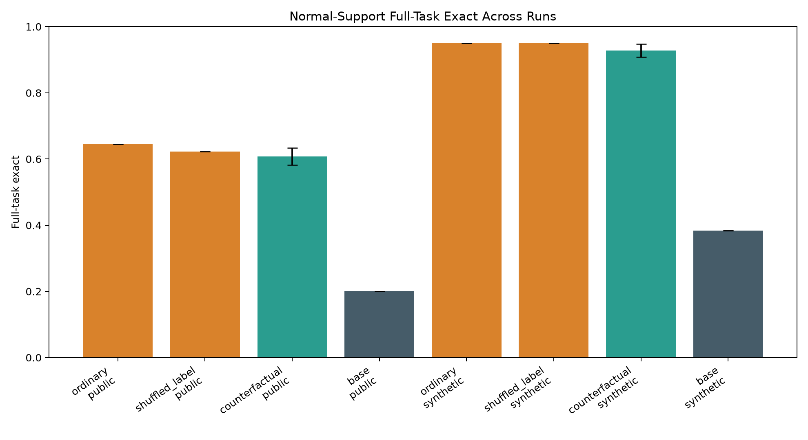
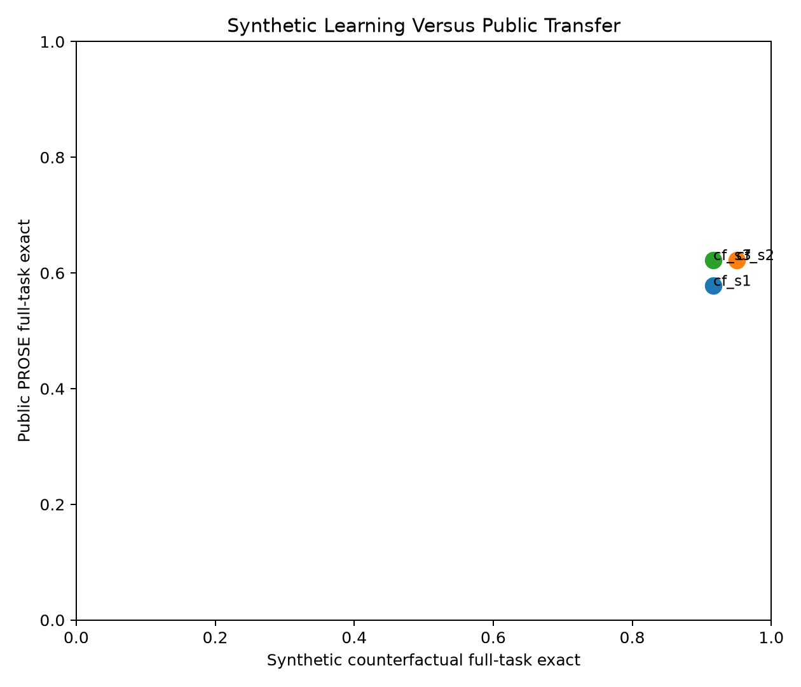
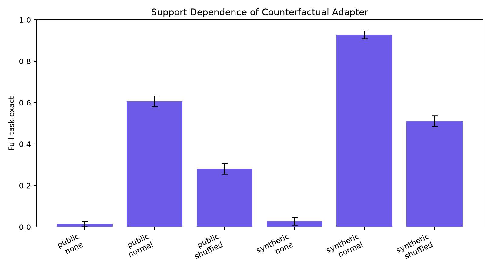
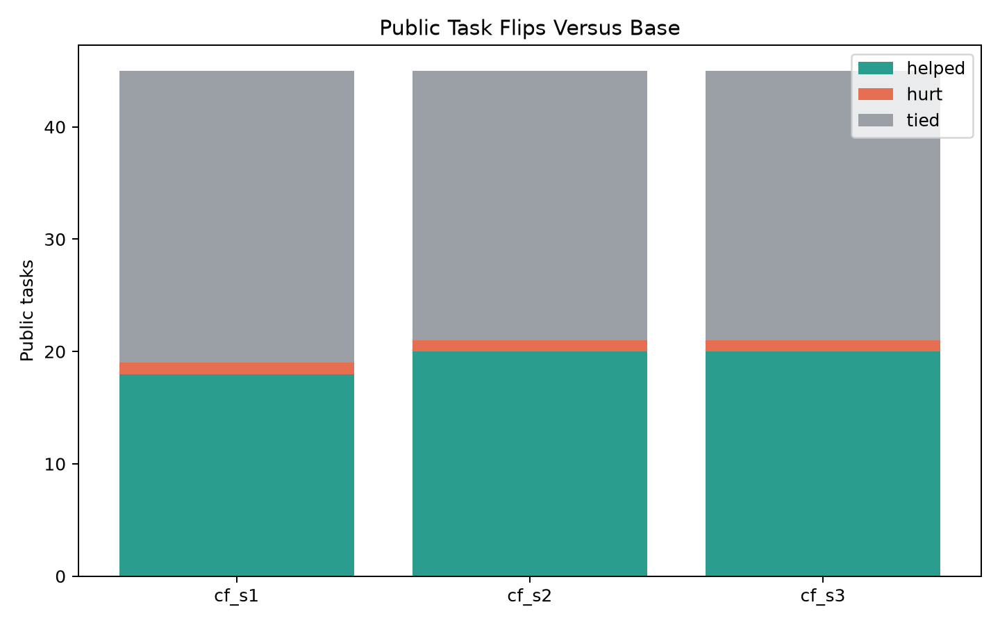
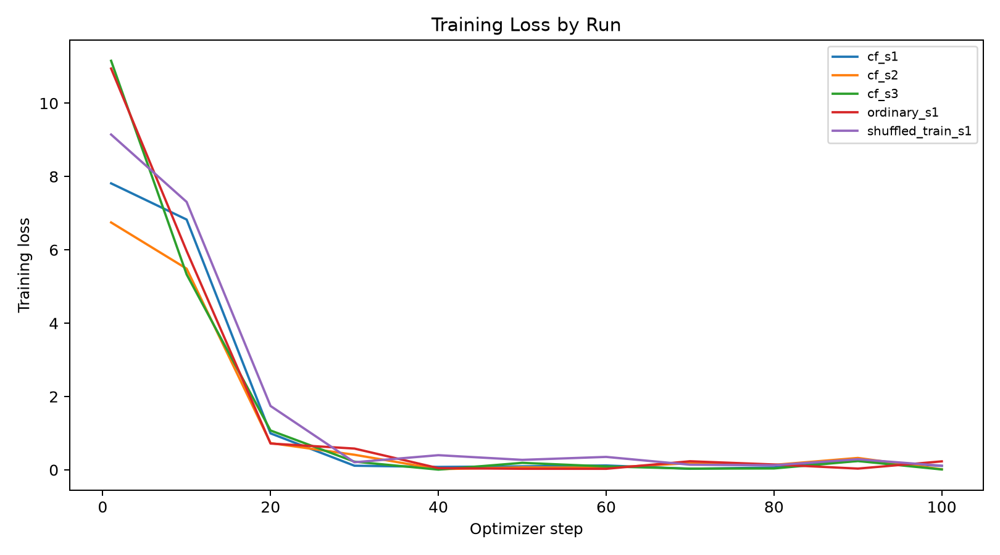

# Counterfactual ICL Public Multiseed Gate

## Question

Can LoRA posttraining on counterfactual few-shot episodes make Qwen3-4B rely more on the support examples of a text-transformation task, and does that transfer to a public benchmark rather than only to the synthetic generator?

The training signal is answer-only. No public benchmark labels are used for training. The controls test whether the effect survives support shuffling, no-support prompts, ordinary synthetic training, and deliberately shuffled training support labels.

## Headline

- Public PROSE full-task exact: base `20.0%`; counterfactual adapter mean `60.7%` with seed spread `2.6%`; delta `40.7%`.
- Synthetic counterfactual full-task exact: base `38.3%`; counterfactual adapter mean `92.8%`.
- Public support controls for the counterfactual adapter: normal `60.7%`, shuffled `28.1%`, no support `1.5%`.
- Ordinary synthetic-training control on public PROSE: `64.4%`.
- Shuffled-label training control on public PROSE: `62.2%`.

## Aggregate Metrics

| arm                    | split                    | support_mode   |   runs |   tasks |   rows | row_exact_mean   | row_exact_std   | full_task_exact_mean   | full_task_exact_std   |
|:-----------------------|:-------------------------|:---------------|-------:|--------:|-------:|:-----------------|:----------------|:-----------------------|:----------------------|
| base                   | public_prose             | normal         |      1 |      45 |    135 | 37.0%            | 0.0%            | 20.0%                  | 0.0%                  |
| base                   | public_prose             | shuffled       |      1 |      45 |    135 | 11.1%            | 0.0%            | 2.2%                   | 0.0%                  |
| counterfactual_adapter | public_prose             | none           |      3 |      45 |    135 | 3.7%             | 0.7%            | 1.5%                   | 1.3%                  |
| counterfactual_adapter | public_prose             | normal         |      3 |      45 |    135 | 70.6%            | 1.5%            | 60.7%                  | 2.6%                  |
| counterfactual_adapter | public_prose             | shuffled       |      3 |      45 |    135 | 45.4%            | 3.7%            | 28.1%                  | 2.6%                  |
| ordinary_adapter       | public_prose             | none           |      1 |      45 |    135 | 5.2%             | 0.0%            | 0.0%                   | 0.0%                  |
| ordinary_adapter       | public_prose             | normal         |      1 |      45 |    135 | 74.1%            | 0.0%            | 64.4%                  | 0.0%                  |
| ordinary_adapter       | public_prose             | shuffled       |      1 |      45 |    135 | 48.9%            | 0.0%            | 26.7%                  | 0.0%                  |
| shuffled_label_adapter | public_prose             | none           |      1 |      45 |    135 | 4.4%             | 0.0%            | 2.2%                   | 0.0%                  |
| shuffled_label_adapter | public_prose             | normal         |      1 |      45 |    135 | 74.1%            | 0.0%            | 62.2%                  | 0.0%                  |
| shuffled_label_adapter | public_prose             | shuffled       |      1 |      45 |    135 | 64.4%            | 0.0%            | 51.1%                  | 0.0%                  |
| base                   | synthetic_counterfactual | normal         |      1 |      60 |    120 | 53.3%            | 0.0%            | 38.3%                  | 0.0%                  |
| base                   | synthetic_counterfactual | shuffled       |      1 |      60 |    120 | 20.8%            | 0.0%            | 16.7%                  | 0.0%                  |
| counterfactual_adapter | synthetic_counterfactual | none           |      3 |      60 |    120 | 5.3%             | 3.4%            | 2.8%                   | 1.9%                  |
| counterfactual_adapter | synthetic_counterfactual | normal         |      3 |      60 |    120 | 96.1%            | 0.5%            | 92.8%                  | 1.9%                  |
| counterfactual_adapter | synthetic_counterfactual | shuffled       |      3 |      60 |    120 | 60.3%            | 2.9%            | 51.1%                  | 2.5%                  |
| ordinary_adapter       | synthetic_counterfactual | none           |      1 |      60 |    120 | 2.5%             | 0.0%            | 0.0%                   | 0.0%                  |
| ordinary_adapter       | synthetic_counterfactual | normal         |      1 |      60 |    120 | 96.7%            | 0.0%            | 95.0%                  | 0.0%                  |
| ordinary_adapter       | synthetic_counterfactual | shuffled       |      1 |      60 |    120 | 58.3%            | 0.0%            | 46.7%                  | 0.0%                  |
| shuffled_label_adapter | synthetic_counterfactual | none           |      1 |      60 |    120 | 0.8%             | 0.0%            | 0.0%                   | 0.0%                  |
| shuffled_label_adapter | synthetic_counterfactual | normal         |      1 |      60 |    120 | 97.5%            | 0.0%            | 95.0%                  | 0.0%                  |
| shuffled_label_adapter | synthetic_counterfactual | shuffled       |      1 |      60 |    120 | 95.8%            | 0.0%            | 91.7%                  | 0.0%                  |

## Seed-Level Normal-Support Metrics

| run_name          |     seed | arm                    | split                    |   tasks |   rows | row_exact   | full_task_exact   |
|:------------------|---------:|:-----------------------|:-------------------------|--------:|-------:|:------------|:------------------|
| cf_s1             | 20260628 | base                   | public_prose             |      45 |    135 | 37.0%       | 20.0%             |
| cf_s1             | 20260628 | base                   | synthetic_counterfactual |      60 |    120 | 53.3%       | 38.3%             |
| cf_s1             | 20260628 | counterfactual_adapter | public_prose             |      45 |    135 | 68.9%       | 57.8%             |
| cf_s1             | 20260628 | counterfactual_adapter | synthetic_counterfactual |      60 |    120 | 95.8%       | 91.7%             |
| cf_s2             | 20260629 | counterfactual_adapter | public_prose             |      45 |    135 | 71.1%       | 62.2%             |
| cf_s2             | 20260629 | counterfactual_adapter | synthetic_counterfactual |      60 |    120 | 96.7%       | 95.0%             |
| cf_s3             | 20260630 | counterfactual_adapter | public_prose             |      45 |    135 | 71.9%       | 62.2%             |
| cf_s3             | 20260630 | counterfactual_adapter | synthetic_counterfactual |      60 |    120 | 95.8%       | 91.7%             |
| ordinary_s1       | 20260628 | ordinary_adapter       | public_prose             |      45 |    135 | 74.1%       | 64.4%             |
| ordinary_s1       | 20260628 | ordinary_adapter       | synthetic_counterfactual |      60 |    120 | 96.7%       | 95.0%             |
| shuffled_train_s1 | 20260628 | shuffled_label_adapter | public_prose             |      45 |    135 | 74.1%       | 62.2%             |
| shuffled_train_s1 | 20260628 | shuffled_label_adapter | synthetic_counterfactual |      60 |    120 | 97.5%       | 95.0%             |

## Interpretation

The synthetic counterfactual split shows the intended training effect: the adapter improves strict task consistency, and that improvement depends on intact support examples.
The public split shows positive transfer from synthetic counterfactual episodes to unseen public text-transformation tasks.
The public gain is support-sensitive: corrupting the support examples removes a material fraction of the effect.
The ordinary synthetic control is close enough that the counterfactual ingredient is not isolated.
The shuffled-label training control is close enough that a formatting explanation remains plausible.

## Charts

## Public Task Flips Versus Base

| run_name   |     seed |   helped |   hurt |   tied |   tasks |
|:-----------|---------:|---------:|-------:|-------:|--------:|
| cf_s1      | 20260628 |       18 |      1 |     26 |      45 |
| cf_s2      | 20260629 |       20 |      1 |     24 |      45 |
| cf_s3      | 20260630 |       20 |      1 |     24 |      45 |

## Public Family Breakdown

| family        |   tasks_base |   tasks_counterfactual_adapter | full_task_exact_base   | full_task_exact_counterfactual_adapter   | row_exact_base   | row_exact_counterfactual_adapter   | delta   |
|:--------------|-------------:|-------------------------------:|:-----------------------|:-----------------------------------------|:-----------------|:-----------------------------------|:--------|
| Column        |            1 |                              1 | 0.0%                   | 100.0%                                   | 0.0%             | 100.0%                             | 100.0%  |
| Currency      |            1 |                              1 | 0.0%                   | 100.0%                                   | 66.7%            | 100.0%                             | 100.0%  |
| EmergencyCall |            1 |                              1 | 0.0%                   | 100.0%                                   | 0.0%             | 100.0%                             | 100.0%  |
| FilePath      |            1 |                              1 | 0.0%                   | 100.0%                                   | 0.0%             | 100.0%                             | 100.0%  |
| ShippingCode  |            3 |                              3 | 0.0%                   | 88.9%                                    | 33.3%            | 92.6%                              | 88.9%   |
| Number        |           10 |                             10 | 10.0%                  | 63.3%                                    | 30.0%            | 72.2%                              | 53.3%   |
| Name          |            5 |                              5 | 0.0%                   | 53.3%                                    | 20.0%            | 68.9%                              | 53.3%   |
| Phone         |            3 |                              3 | 66.7%                  | 100.0%                                   | 66.7%            | 100.0%                             | 33.3%   |
| DateTime      |           15 |                             15 | 20.0%                  | 44.4%                                    | 35.6%            | 53.3%                              | 24.4%   |
| Meteorite     |            1 |                              1 | 0.0%                   | 0.0%                                     | 0.0%             | 0.0%                               | 0.0%    |
| Email         |            2 |                              2 | 50.0%                  | 50.0%                                    | 83.3%            | 83.3%                              | 0.0%    |
| Song          |            1 |                              1 | 100.0%                 | 100.0%                                   | 100.0%           | 100.0%                             | 0.0%    |
| Address       |            1 |                              1 | 100.0%                 | 0.0%                                     | 100.0%           | 66.7%                              | -100.0% |

## Public Error Sample

| run_name   | task_id             | family       | input                                                        | target                                                                                    | prediction                                                         |
|:-----------|:--------------------|:-------------|:-------------------------------------------------------------|:------------------------------------------------------------------------------------------|:-------------------------------------------------------------------|
| cf_s1      | Address.000013      | Address      | One Main Parkway, Allentown, ND 41230                        | nan                                                                                       | One                                                                |
| cf_s1      | DateTime.000016     | DateTime     | Jan 10 1975                                                  | Fri W2                                                                                    | Wed W1                                                             |
| cf_s1      | DateTime.000016     | DateTime     | 1 Feb 2013                                                   | Fri W5                                                                                    | Wed W5                                                             |
| cf_s1      | DateTime.000016     | DateTime     | 12 Dec 2002                                                  | Thu W50                                                                                   | Wed W46                                                            |
| cf_s1      | DateTime.000017     | DateTime     | 03302241                                                     | 30/3/2241                                                                                 | 3/3/2241                                                           |
| cf_s1      | DateTime.000029     | DateTime     | 03302241                                                     | Tuesday                                                                                   | Monday                                                             |
| cf_s1      | DateTime.000029     | DateTime     | 02-Aug-2160                                                  | Saturday                                                                                  | Monday                                                             |
| cf_s1      | DateTime.000029     | DateTime     | 23 May 1984                                                  | Wednesday                                                                                 | Thursday                                                           |
| cf_s1      | DateTime.000032     | DateTime     | 09:53                                                        | 9:53 AM                                                                                   | 09:53 AM                                                           |
| cf_s1      | DateTime.000032     | DateTime     | 1956-12-16 20:18                                             | 8:18 PM                                                                                   | December 16, 1956 at 8:18 PM                                       |
| cf_s1      | DateTime.000041     | DateTime     | 4.2.1743                                                     | 2/4/1743                                                                                  | 4.2.1743                                                           |
| cf_s1      | DateTime.000081     | DateTime     | 11:48PM                                                      | 11:45PM-12:15AM                                                                           | 11:15PM-11:45PM                                                    |
| cf_s1      | DateTime.000084     | DateTime     | 3/30/2241 16:15                                              | Tue 4:30 PM                                                                               | Fri 16:15                                                          |
| cf_s1      | DateTime.000084     | DateTime     | 8/2/2160 23:48                                               | Sat 12:00 AM                                                                              | Wed 12:00 AM                                                       |
| cf_s1      | DateTime.000084     | DateTime     | 5/23/1984 22:24                                              | Wed 10:30 PM                                                                              | Thu 10:00 PM                                                       |
| cf_s1      | DateTime.000086     | DateTime     | 16:15:08                                                     | 4:00PM                                                                                    | 4:15PM                                                             |
| cf_s1      | DateTime.000086     | DateTime     | 23:48:20                                                     | 11:30PM                                                                                   | 11:48PM                                                            |
| cf_s1      | DateTime.000086     | DateTime     | 22:24:59                                                     | 10:00PM                                                                                   | 10:24PM                                                            |
| cf_s1      | DateTime.000109     | DateTime     | 21-Jan-1985 05:44:43                                         | Monday, January 21, 1985                                                                  | Wednesday, January 21, 1985                                        |
| cf_s1      | DateTime.000109     | DateTime     | 16-Aug-1985 01:11:56                                         | Friday, August 16, 1985                                                                   | Wednesday, August 16, 1985                                         |
| cf_s1      | DateTime.000109     | DateTime     | 20-Dec-2033 18:36:29                                         | Tuesday, December 20, 2033                                                                | Friday, December 20, 2033                                          |
| cf_s1      | DateTime.000115     | DateTime     | 21-Jan-1985 05:44:43                                         | 40-60                                                                                     | 0-20                                                               |
| cf_s1      | DateTime.000115     | DateTime     | 16-Aug-1985 01:11:56                                         | 40-60                                                                                     | 0-20                                                               |
| cf_s1      | DateTime.000115     | DateTime     | 20-Dec-2033 18:36:29                                         | 20-40                                                                                     | 0-20                                                               |
| cf_s1      | Email.000006        | Email        | iñaki                                                        | iñaki@proseware.com                                                                       | iñaki@contoso.com                                                  |
| cf_s1      | Meteorite.000001    | Meteorite    | Zunyi | 682 | 2243-10-11 11:33:09 | (27.396943, -143.663257) | The meteorite named ZUNYI weighing 0.682 kg fell in 2243 near lat/long (27.4, -143.7)     | The meteorite named ZUNYI weighing 0.682 kg fell in 2243 near      |
| cf_s1      | Meteorite.000001    | Meteorite    | Elgin | 53648 | 2139-04-25 19:02:49 | (47.61, 8.20)          | The meteorite named ELGIN weighing 53.648 kg fell in 2139 near lat/long (47.6, 8.2)       | The meteorite named ELGIN weighing 53.648 kg fell in 2139 near lat |
| cf_s1      | Meteorite.000001    | Meteorite    | New Haven | 066 | 2041-05-26 22:15:47 | (-50.16, 144.04)     | The meteorite named NEW HAVEN weighing 0.066 kg fell in 2041 near lat/long (-50.2, 144.0) | The meteorite named NEW HAVEN weighing 0.066 kg fell in 2041 near  |
| cf_s1      | Name.000023         | Name         | Cecep Sutresna                                               | Sutr                                                                                      | Sutre                                                              |
| cf_s1      | Name.000023         | Name         | Milica Zujovic                                               | Zujo                                                                                      | Zujovic                                                            |
| cf_s1      | Name.000037         | Name         | Marcela Kubatova                                             | nan                                                                                       | ova                                                                |
| cf_s1      | Name.000037         | Name         | Mr. Hadar Caspit                                             | nan                                                                                       | Mr.                                                                |
| cf_s1      | Number.000008       | Number       | -13578                                                       | -135.78                                                                                   | -13.578                                                            |
| cf_s1      | Number.000008       | Number       | -1961.1180                                                   | -19.611180                                                                                | -19.6118                                                           |
| cf_s1      | Number.000047       | Number       | 1284.42                                                      | 1285.00                                                                                   | 1280.00                                                            |
| cf_s1      | Number.000047       | Number       | 23224.98                                                     | 23225.00                                                                                  | 23220.00                                                           |
| cf_s1      | Number.000047       | Number       | 1024.21                                                      | 1025.00                                                                                   | 1020.00                                                            |
| cf_s1      | Number.000069       | Number       | 1202.3433                                                    | 1200                                                                                      | 1202                                                               |
| cf_s1      | Number.000069       | Number       | 23224.1                                                      | 23225                                                                                     | 23224                                                              |
| cf_s1      | Number.000069       | Number       | -23224.1                                                     | -23225                                                                                    | -23224                                                             |
| cf_s1      | ShippingCode.000002 | ShippingCode | 1Z I81 6QF 90 9601 169 4                                     | 6QF                                                                                       | I81                                                                |
| cf_s1      | ShippingCode.000002 | ShippingCode | 1Z O63 B7Z 35 2550 248 6                                     | B7Z                                                                                       | O63                                                                |
| cf_s2      | Address.000013      | Address      | One Main Parkway, Allentown, ND 41230                        | nan                                                                                       | One                                                                |
| cf_s2      | DateTime.000016     | DateTime     | Jan 10 1975                                                  | Fri W2                                                                                    | Wed W52                                                            |
| cf_s2      | DateTime.000016     | DateTime     | 12 Dec 2002                                                  | Thu W50                                                                                   | Thu W49                                                            |
| cf_s2      | DateTime.000029     | DateTime     | 03302241                                                     | Tuesday                                                                                   | Monday                                                             |
| cf_s2      | DateTime.000029     | DateTime     | 02-Aug-2160                                                  | Saturday                                                                                  | Monday                                                             |
| cf_s2      | DateTime.000029     | DateTime     | 23 May 1984                                                  | Wednesday                                                                                 | Monday                                                             |
| cf_s2      | DateTime.000081     | DateTime     | 4:15PM                                                       | 4:15PM-4:45PM                                                                             | 4:00PM-4:30PM                                                      |
| cf_s2      | DateTime.000081     | DateTime     | 11:48PM                                                      | 11:45PM-12:15AM                                                                           | 11:15PM-11:45PM                                                    |
| cf_s2      | DateTime.000084     | DateTime     | 3/30/2241 16:15                                              | Tue 4:30 PM                                                                               | Fri 4:00 PM                                                        |
| cf_s2      | DateTime.000084     | DateTime     | 8/2/2160 23:48                                               | Sat 12:00 AM                                                                              | Wed 12:00 AM                                                       |
| cf_s2      | DateTime.000084     | DateTime     | 5/23/1984 22:24                                              | Wed 10:30 PM                                                                              | Tue 10:00 PM                                                       |
| cf_s2      | DateTime.000086     | DateTime     | 16:15:08                                                     | 4:00PM                                                                                    | 4:15PM                                                             |
| cf_s2      | DateTime.000086     | DateTime     | 23:48:20                                                     | 11:30PM                                                                                   | 11:40PM                                                            |
| cf_s2      | DateTime.000086     | DateTime     | 22:24:59                                                     | 10:00PM                                                                                   | 10:15PM                                                            |
| cf_s2      | DateTime.000109     | DateTime     | 21-Jan-1985 05:44:43                                         | Monday, January 21, 1985                                                                  | Wednesday, January 21, 1985                                        |
| cf_s2      | DateTime.000109     | DateTime     | 16-Aug-1985 01:11:56                                         | Friday, August 16, 1985                                                                   | Monday, August 16, 1985                                            |
| cf_s2      | DateTime.000109     | DateTime     | 20-Dec-2033 18:36:29                                         | Tuesday, December 20, 2033                                                                | Monday, December 20, 2033                                          |
| cf_s2      | DateTime.000115     | DateTime     | 21-Jan-1985 05:44:43                                         | 40-60                                                                                     | 0-20                                                               |

## Artifacts

- Experiment root: `/workspace/experiments/qwen_counterfactual_icl_public_multiseed`
- Large artifacts root: `/workspace/large_artifacts/qwen_counterfactual_icl_public_multiseed`
- Per-run artifacts: `/workspace/experiments/qwen_counterfactual_icl_public_multiseed/runs`
- Adapter checkpoints: `/workspace/large_artifacts/qwen_counterfactual_icl_public_multiseed/checkpoints`
- Aggregate CSV: `/workspace/experiments/qwen_counterfactual_icl_public_multiseed/analysis/aggregate_summary.csv`
- Combined row predictions: `/workspace/experiments/qwen_counterfactual_icl_public_multiseed/analysis/aggregate_row_predictions.csv`
- Combined task metrics: `/workspace/experiments/qwen_counterfactual_icl_public_multiseed/analysis/aggregate_task_metrics.csv`

## Limitations

The public evaluation is capped for runtime, and exact-match scoring is strict. The main counterfactual arm is multiseed; ordinary and shuffled-label controls are single-seed controls in this run. The experiment tests transfer from a synthetic counterfactual training distribution, not broad open-ended transformation ability.