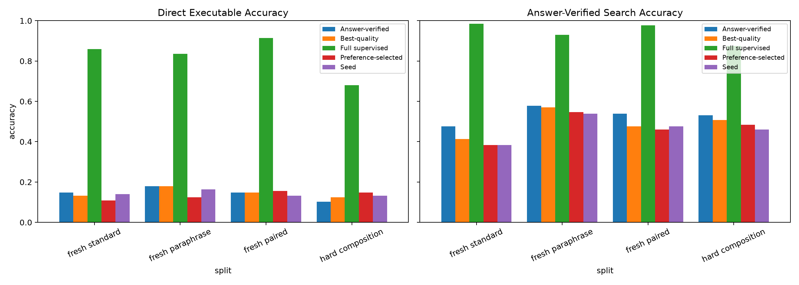
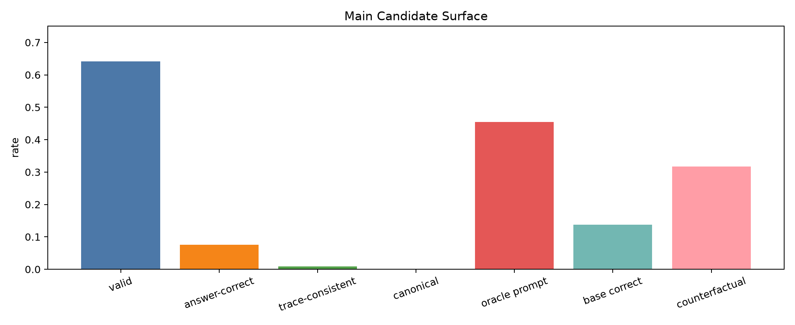
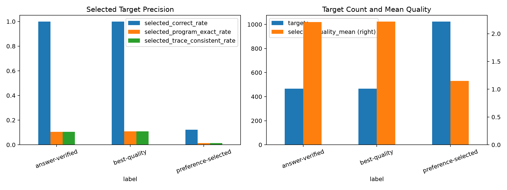
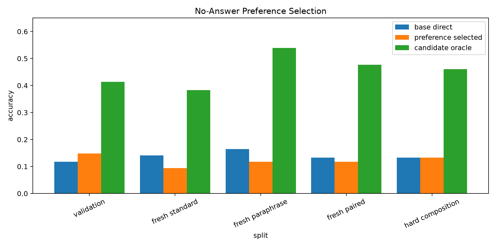
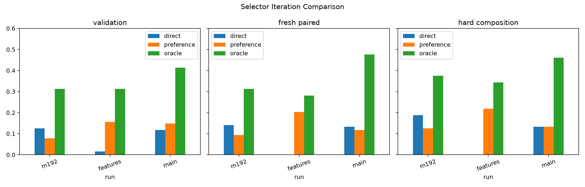
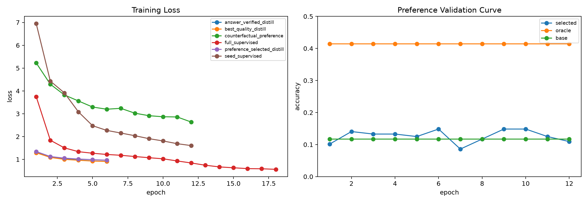

# Counterfactual Trace Preference Distillation

## Abstract

This standalone experiment tests whether a Qwen-attached typed-bytecode compiler can learn a no-answer repair selector from hard counterfactual execution traces. The compiler emits executable VM programs from frozen `Qwen/Qwen3-4B` hidden states. Each prompt gets a local candidate set; every candidate is executed; and candidates are ranked by this quality order:

`invalid < valid_wrong < answer_correct < trace_consistent < canonical`

The main run generated `246784` candidates from `1024` training prompts. The candidate surface was real: `45.5%` of prompts had an answer-correct candidate, while only `13.8%` were already correct at the base decode. That left `31.7%` true counterfactual repair groups.

The result is mixed. The feature-bridged preference selector learned a weak but real signal on validation, reaching `14.8%` selection accuracy against a `41.4%` oracle. It did not generalize robustly across all held-out splits: fresh-paired selection was `11.7%` against a `47.7%` oracle.

Distilling the learned selector produced small direct gains on the hardest held-out cells but degraded search relative to answer-verified targets. Fresh-paired direct accuracy was `15.6%` for preference-selected distillation versus `14.8%` for answer-verified distillation. Hard-composition direct accuracy was `14.8%` versus `10.2%`. But fresh-paired search was lower: `46.1%` versus `53.9%`.

The full-supervised ceiling stayed high: `91.4%` direct and `97.7%` search on fresh paired, with `68.0%` direct on hard composition. The substrate can learn the executable compiler; the preference selector is still the bottleneck.

## Setup

- Base model: frozen `Qwen/Qwen3-4B` hidden-state extractor.
- Compiler: transformer slot decoder that emits typed stack-machine bytecode.
- Candidate generation: local edit/search around the base decode, capped at `256` candidates per prompt.
- Preference training set: only counterfactual groups where a better candidate exists than the base decode.
- Preference inputs: prompt feature, candidate bytecode, normalized program prior, prompt answer-head logprob of the candidate's VM final value, VM validity, and VM final value.
- Main run: `192` seed examples, `1024` candidate prompts, `128` examples per eval split.
- Large checkpoints: `large_artifacts/qwen_counterfactual_trace_preference_distillation/checkpoints/main_counterfactual_trace_preference_s192_c1024/`.

## Main Results

| Phase | Split | Direct | Answer search | Oracle | Preference rerank | Program exact |
| --- | --- | ---: | ---: | ---: | ---: | ---: |
| Seed | fresh standard | 14.1% | 38.3% | 38.3% |  | 0.8% |
| Seed | fresh paraphrase | 16.4% | 53.9% | 53.9% |  | 3.1% |
| Seed | fresh paired | 13.3% | 47.7% | 47.7% |  | 0.0% |
| Seed | hard composition | 13.3% | 46.1% | 46.1% |  | 1.6% |
| Preference selector | fresh standard | 14.1% | 38.3% | 38.3% | 9.4% | 0.8% |
| Preference selector | fresh paraphrase | 16.4% | 53.9% | 53.9% | 11.7% | 3.1% |
| Preference selector | fresh paired | 13.3% | 47.7% | 47.7% | 11.7% | 0.0% |
| Preference selector | hard composition | 13.3% | 46.1% | 46.1% | 13.3% | 1.6% |
| Answer-verified | fresh standard | 14.8% | 47.7% | 47.7% |  | 1.6% |
| Answer-verified | fresh paraphrase | 18.0% | 57.8% | 57.8% |  | 3.9% |
| Answer-verified | fresh paired | 14.8% | 53.9% | 53.9% |  | 1.6% |
| Answer-verified | hard composition | 10.2% | 53.1% | 53.1% |  | 2.3% |
| Preference-selected | fresh standard | 10.9% | 38.3% | 38.3% |  | 0.0% |
| Preference-selected | fresh paraphrase | 12.5% | 54.7% | 54.7% |  | 0.8% |
| Preference-selected | fresh paired | 15.6% | 46.1% | 46.1% |  | 1.6% |
| Preference-selected | hard composition | 14.8% | 48.4% | 48.4% |  | 0.8% |
| Best-quality | fresh standard | 13.3% | 41.4% | 41.4% |  | 1.6% |
| Best-quality | fresh paraphrase | 18.0% | 57.0% | 57.0% |  | 3.1% |
| Best-quality | fresh paired | 14.8% | 47.7% | 47.7% |  | 0.0% |
| Best-quality | hard composition | 12.5% | 50.8% | 50.8% |  | 1.6% |
| Full supervised | fresh standard | 85.9% | 98.4% | 98.4% |  | 76.6% |
| Full supervised | fresh paraphrase | 83.6% | 93.0% | 93.0% |  | 73.4% |
| Full supervised | fresh paired | 91.4% | 97.7% | 97.7% |  | 78.1% |
| Full supervised | hard composition | 68.0% | 87.5% | 87.5% |  | 51.6% |

## Candidate Surface

The surface had enough headroom to test selection. Candidate-level answer correctness was only `7.6%`, but prompt-level oracle accuracy was `45.5%`. Trace-consistent and canonical candidates were much rarer: `0.9%` and `0.0%` at candidate level. That means the intended quality order was active, but most supervision was still effectively answer-correct versus valid-wrong.

## Target Quality

| Target source | Targets | Correct | Canonical | Trace-consistent | Mean quality | Changed |
| --- | ---: | ---: | ---: | ---: | ---: | ---: |
| answer_verified_targets | 466 | 100.0% | 10.5% | 10.5% | 2.21 | 69.7% |
| best_quality_targets | 466 | 100.0% | 10.9% | 10.9% | 2.22 | 69.7% |
| preference_selected_targets | 1024 | 12.2% | 1.4% | 1.4% | 1.15 | 100.0% |

Preference-selected targets were broad but noisy: `1024` targets with only `12.2%` answer-correct precision. Answer-verified and best-quality targets were perfectly answer-correct by construction, but they covered only `466` prompts. Best-quality targets slightly increased canonical/trace-consistent selection from `10.5%` to `10.9%`, but this was too small to change deployable accuracy.

## Preference Selection

The preference selector did not solve no-answer credit assignment. Its best validation checkpoint improved over the base decode on validation, but on fresh standard, fresh paraphrase, and fresh paired it selected worse than the base direct program. The model learned to stay valid, but not reliably to identify the prompt-correct final value.

## Iterations

The first pilot had true counterfactual groups but a weak selector. Adding candidate features, especially the prompt answer-head logprob of the candidate's final value, improved the pilot selector substantially. The scaled main run retained a validation signal but lost much of the held-out gain, which points to calibration/generalization rather than candidate availability as the remaining issue.

## Training

The full-supervised branch separated sharply after about eight epochs and reached the high ceiling. The repair-distillation branches trained smoothly but plateaued far below that ceiling, consistent with target quality and selector precision being the limiting factors.

## Interpretation

The experiment answers the core question narrowly. Counterfactual trace preference learning can find some no-answer repair signal, and it can produce small direct gains on hard held-out cells. It does not yet provide a reliable path to folding the repair oracle into the compiler. The main failure is that selected preference targets are too noisy: the selector chooses valid programs almost always, but answer-correct programs only `12.2%` of the time.

The most useful next step is not simply scaling this objective. The next design should either filter preference-selected targets by confidence to raise precision, or move candidate comparison into a richer Qwen-readable representation where the model can compare prompt semantics, VM final values, and execution traces more directly.

## Artifacts

- `experiments/qwen_counterfactual_trace_preference_distillation/runs/main_counterfactual_trace_preference_s192_c1024/metrics.csv`
- `experiments/qwen_counterfactual_trace_preference_distillation/runs/main_counterfactual_trace_preference_s192_c1024/train_log.csv`
- `experiments/qwen_counterfactual_trace_preference_distillation/runs/main_counterfactual_trace_preference_s192_c1024/target_selection.csv`
- `experiments/qwen_counterfactual_trace_preference_distillation/analysis/main_metrics.csv`
- `experiments/qwen_counterfactual_trace_preference_distillation/reports/qwen_counterfactual_trace_preference_distillation_report.md`
- `experiments/qwen_counterfactual_trace_preference_distillation/reports/qwen_counterfactual_trace_preference_distillation_report.html`
