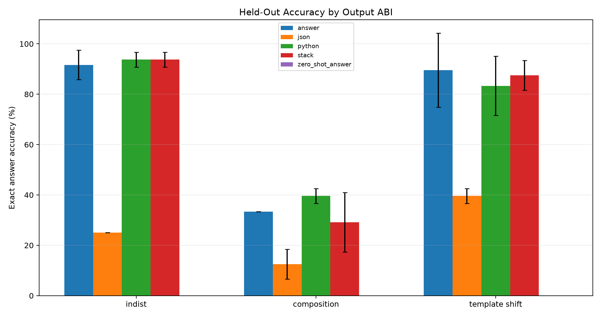
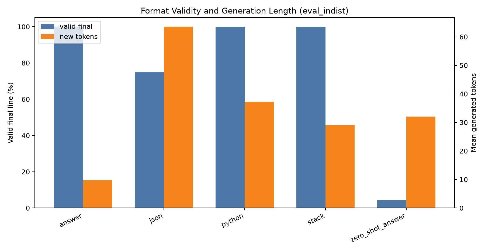
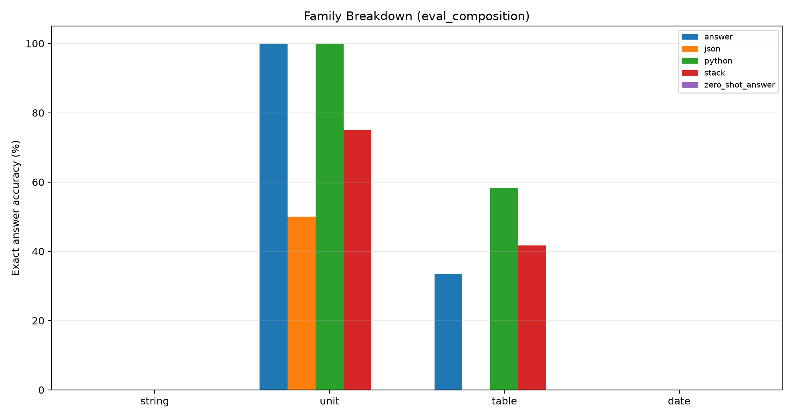
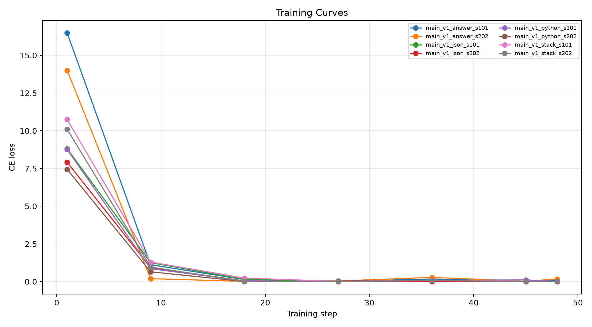

# Qwen Crystallized Trace ABI Tournament

## Abstract

This experiment tests whether a local 4B language model learns practical deterministic procedures better when supervised with compact executable traces instead of final answers alone. The same generated tasks are rendered through four output ABIs: final-answer text, Python-like trace, JSON IR, and stack-style IR. Each trained arm uses the same QLoRA budget and is evaluated on fresh values, unseen operation compositions, and template-shifted prompts.

## Method

The task factory creates examples from four families: string normalization, unit conversion, lookup-table calculation, and date arithmetic. Every example has a deterministic answer and a gold procedural rendering for each ABI. Evaluation uses greedy generation and exact matching of the parsed `FINAL` value.

## Run Configuration

- Primary suite: `main`.
- Adapter seeds: `101,202`.
- QLoRA update steps per adapter: `48`.
- Total trained-arm evaluation examples: `eval_composition`=192, `eval_indist`=192, `eval_template_shift`=192.
- Output ABIs: `answer`, `python`, `json`, and `stack`.

## Primary Results

- Best fresh-value arm: `python` at 93.8%.
- Best unseen-composition arm: `python` at 39.6%.
- Best template-shift arm: `answer` at 89.6%.
- Primary suite summarized below: `main`.

|suite|arm|split|runs|n_total|accuracy_mean|accuracy_std|valid_mean|tokens_mean|
|---|---|---|---|---|---|---|---|---|
|main|python|eval_composition|2|48|39.6%|2.9%|100.0%|44.60|
|main|answer|eval_composition|2|48|33.3%|0.0%|100.0%|9.60|
|main|stack|eval_composition|2|48|29.2%|11.8%|100.0%|31.94|
|main|json|eval_composition|2|48|12.5%|5.9%|68.8%|63.88|
|main|zero_shot_answer|eval_composition|1|24|0.0%|0.0%|20.8%|32.00|
|main|python|eval_indist|2|48|93.8%|2.9%|100.0%|37.25|
|main|stack|eval_indist|2|48|93.8%|2.9%|100.0%|29.08|
|main|answer|eval_indist|2|48|91.7%|5.9%|100.0%|9.73|
|main|json|eval_indist|2|48|25.0%|0.0%|75.0%|63.56|
|main|zero_shot_answer|eval_indist|1|24|0.0%|0.0%|4.2%|32.00|
|main|answer|eval_template_shift|2|48|89.6%|14.7%|100.0%|9.42|
|main|stack|eval_template_shift|2|48|87.5%|5.9%|100.0%|28.71|
|main|python|eval_template_shift|2|48|83.3%|11.8%|100.0%|37.35|
|main|json|eval_template_shift|2|48|39.6%|2.9%|72.9%|62.83|
|main|zero_shot_answer|eval_template_shift|1|24|0.0%|0.0%|4.2%|32.00|

## Interpretation

The composition gap for the best fresh-value arm is 54.2 percentage points. A small or negative gap would indicate that the learned representation transfers across operation combinations; a large positive gap indicates that the model mainly learned the easier in-distribution mapping.
On fresh values, the best trace ABI scored 93.8% and answer-only scored 91.7%. The shortest strong trace ABI used 29.1 generated tokens on average, while answer-only used 9.7. This is a weak trace advantage in accuracy and a large trace cost in tokens.
For the best unseen-composition arm, family accuracy was: string 0.0%, unit 100.0%, table 58.3%, date 0.0%. The composition failures are concentrated in families that require a new operation combination, while direct unit conversion remains easy.
The JSON ABI had an average valid-final rate of 72.2% across primary splits, showing that a verbose structured object can be harder to emit reliably than line-oriented formats.

## Limitations

This is a compact experiment. It is designed to reveal representation sensitivity and supervision effects, not to maximize absolute performance. The generated tasks are deterministic and intentionally narrow enough to allow controlled held-out splits. Larger task coverage and longer training would be needed before treating any ABI as a production recipe.

## Artifacts

- Metrics: `analysis/summary_by_arm.csv` and `analysis/all_metrics.csv`
- Details: `analysis/all_details.csv`
- Training logs: `analysis/all_train_logs.csv`
- Checkpoints: `/workspace/large_artifacts/qwen_crystallized_trace_abi_tournament/checkpoints`
