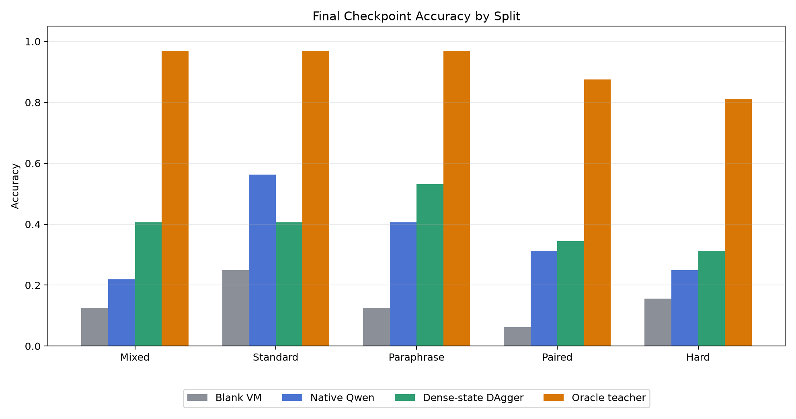
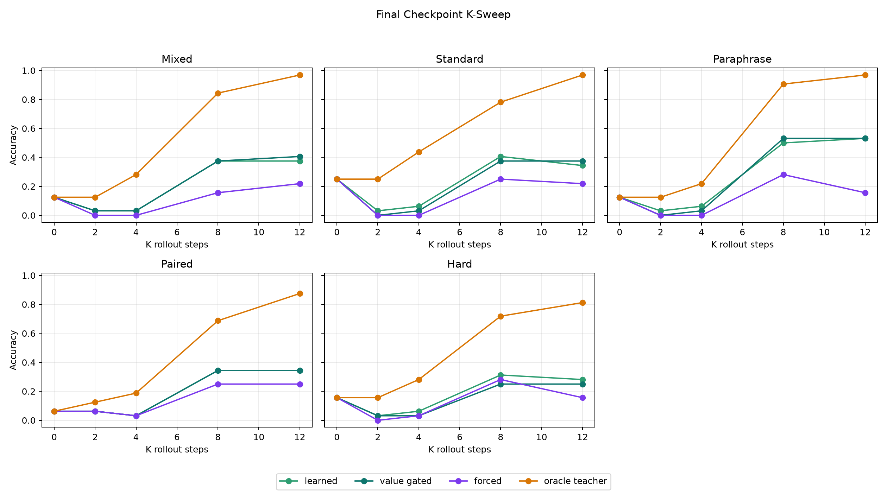
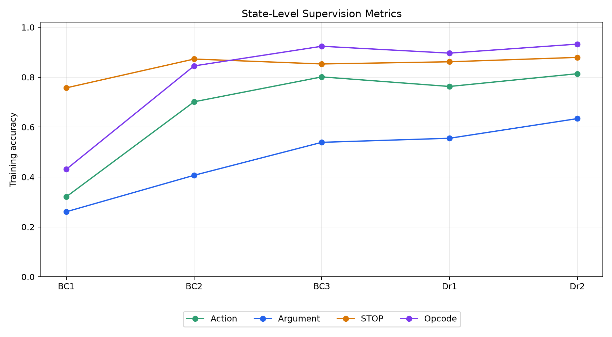
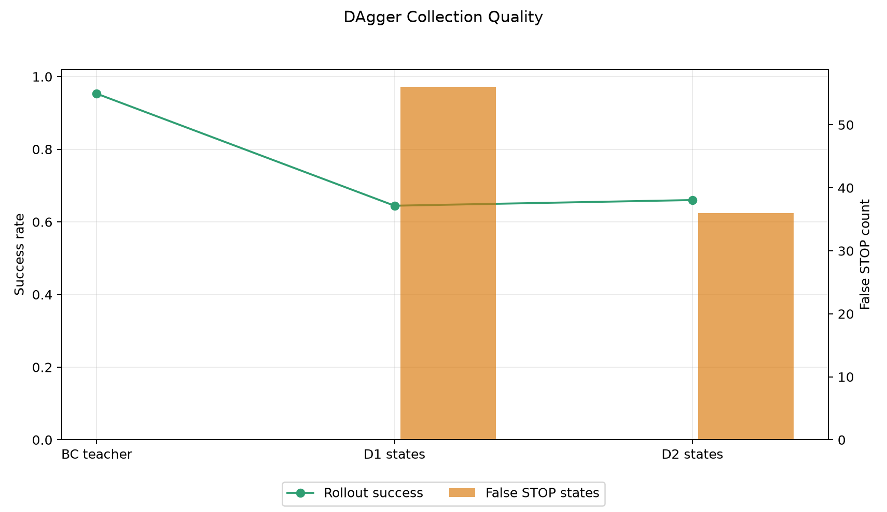

# Dense-State DAgger VM Agent

## Summary

This standalone experiment tests whether a small posttraining adapter can turn `Qwen/Qwen3-4B` into one transition of a recurrent typed-bytecode VM controller. Each inference turn receives the task prompt plus dense VM-state tokens, predicts one edit action or `STOP`, executes that action in a fixed VM, and repeats for up to K steps.

The strongest result is not oracle-close, but it is nontrivial. The final checkpoint beats direct native Qwen on four of five evaluation splits, including hard composition, while remaining far below the oracle teacher. The gap says the learned loop is useful but not yet a substitute for the privileged teacher/search process.

| Split | Blank VM | Native Qwen | Final VM | Best Observed VM | Oracle Teacher |
| --- | --- | --- | --- | --- | --- |
| Mixed | 12.5% | 21.9% | 40.6% (value_gated, K=12) | 40.6% (dagger_r1_policy, learned, K=8) | 96.9% |
| Standard | 25.0% | 56.2% | 40.6% (learned, K=8) | 40.6% (dagger_r2_policy, learned, K=8) | 96.9% |
| Paraphrase | 12.5% | 40.6% | 53.1% (value_gated, K=8) | 56.2% (dagger_r1_policy, learned, K=8) | 96.9% |
| Paired | 6.2% | 31.2% | 34.4% (learned, K=8) | 43.8% (bc_policy, value_gated, K=12) | 87.5% |
| Hard | 15.6% | 25.0% | 31.2% (learned, K=8) | 31.2% (dagger_r2_policy, learned, K=8) | 81.2% |

## Method

- Base model: `Qwen/Qwen3-4B` loaded in 4-bit NF4 with LoRA rank 8.
- Trainable parameters: LoRA adapters, dense VM-state encoder, direct action heads, solved head, and distance head.
- State interface: prompt tokens plus 17 dense VM-state tokens through `inputs_embeds`.
- Action interface: joint scoring over `STOP`, opcode edits, and argument edits.
- Copy bias: argument edits are masked to constants visible in the prompt, plus VM constants `0` and `7`.
- Training: behavior cloning from oracle edit traces, then two DAgger rounds on policy-visited states.
- Main run scale: 256 train tasks, 32 validation tasks, 32 fresh tasks per split, 32 hard-composition tasks.

## K-Sweep

The final checkpoint usually benefits from additional rollout steps up to K=8 or K=12, but the curve is not cleanly monotonic. Value-gated stopping reduces false STOP in several cases, but it can also suppress correct stopping.

| Split | Final Learned Accuracy by K | Final Value-Gated Accuracy by K |
| --- | --- | --- |
| Mixed | K0:12.5%, K2:3.1%, K4:3.1%, K8:37.5%, K12:37.5% | K0:12.5%, K2:3.1%, K4:3.1%, K8:37.5%, K12:40.6% |
| Standard | K0:25.0%, K2:3.1%, K4:6.2%, K8:40.6%, K12:34.4% | K0:25.0%, K2:0.0%, K4:3.1%, K8:37.5%, K12:37.5% |
| Paraphrase | K0:12.5%, K2:3.1%, K4:6.2%, K8:50.0%, K12:53.1% | K0:12.5%, K2:0.0%, K4:3.1%, K8:53.1%, K12:53.1% |
| Paired | K0:6.2%, K2:6.2%, K4:3.1%, K8:34.4%, K12:34.4% | K0:6.2%, K2:6.2%, K4:3.1%, K8:34.4%, K12:34.4% |
| Hard | K0:15.6%, K2:3.1%, K4:6.2%, K8:31.2%, K12:28.1% | K0:15.6%, K2:3.1%, K4:3.1%, K8:25.0%, K12:25.0% |

## Training Dynamics

State-level supervision becomes strong at the main scale. Argument accuracy is still the weakest supervised component, but the prompt-constant mask raises it enough for the recurrent loop to work.

| Phase | Epoch | Action | Argument | STOP | States |
| --- | --- | --- | --- | --- | --- |
| bc_policy | 1 | 32.1% | 26.1% | 75.7% | 1855 |
| bc_policy | 2 | 70.1% | 40.7% | 87.3% | 1855 |
| bc_policy | 3 | 80.1% | 53.9% | 85.3% | 1855 |
| dagger_r1_policy | 1 | 76.3% | 55.5% | 86.2% | 3663 |
| dagger_r2_policy | 1 | 81.4% | 63.4% | 87.9% | 5468 |

## DAgger Dynamics

DAgger collected policy-visited states without collapsing STOP calibration in the calibrated main run. Round-2 collection slightly improved rollout success and reduced false STOP states.

| Collection | States | False STOP States | Rollout Success | Mean Policy Steps |
| --- | --- | --- | --- | --- |
| bc_teacher | 1855 | 0 | 95.3% | 6.29 |
| dagger_r1_states | 1808 | 56 | 64.5% | 6.24 |
| dagger_r2_states | 1805 | 36 | 66.0% | 6.26 |

## Interpretation

The experiment supports a narrow claim: dense-state recurrent control over a fixed typed VM can improve a 4B model on some synthetic compositional tasks using a small posttraining adapter. It does not support the stronger claim that this approach closes the oracle gap.

The main limiting factors are visible:

- The oracle teacher reaches 81.2% to 96.9% on the same splits, while the final learned VM tops out at 31.2% to 53.1%.
- Native Qwen remains stronger on the fresh-standard split.
- False STOP remains substantial on high-K learned rollouts.
- Argument prediction, although improved, is still the weakest state-level target.
- Evaluation and DAgger training are expensive because each VM step is a full Qwen pass.

## Next Experiment

The next high-impact step is to move from one-step action imitation to oracle-like correction pressure over complete rollouts. Concretely: keep the dense-state VM loop, but train with a search-augmented teacher that labels policy states with repaired complete programs or value-ranked action sequences. This should target the observed failure directly: the model can learn many local edit actions, but it does not yet reliably choose globally useful edit trajectories.

## Artifacts

- Run directory: `experiments/qwen_dense_state_dagger_vm_agent/runs/main_joint_action_calibrated_s256_r2/`
- Source: `experiments/qwen_dense_state_dagger_vm_agent/src/dense_state_dagger_vm_agent.py`
- Report figures: `experiments/qwen_dense_state_dagger_vm_agent/reports/figures/`
- Large checkpoints: `large_artifacts/qwen_dense_state_dagger_vm_agent/checkpoints/main_joint_action_calibrated_s256_r2/`
