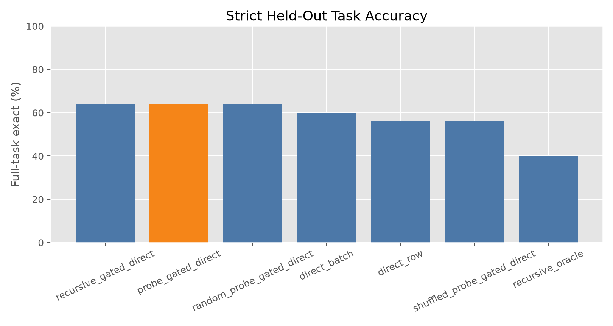
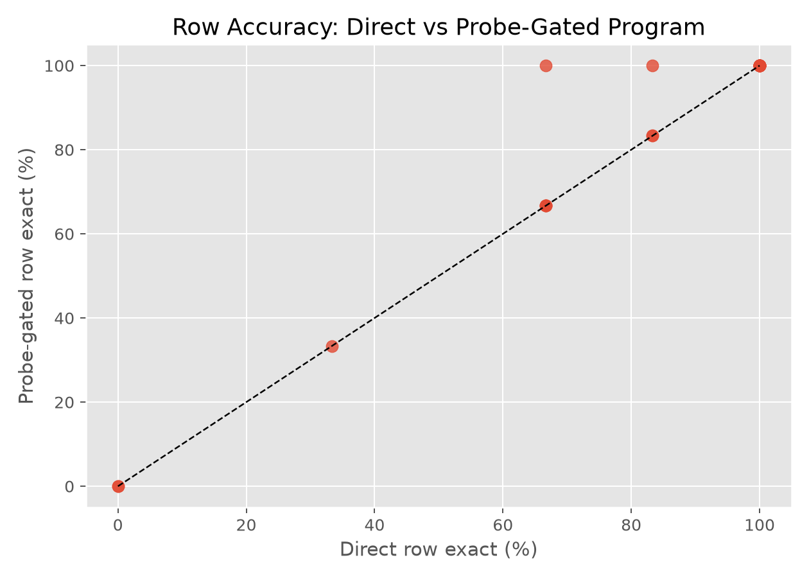
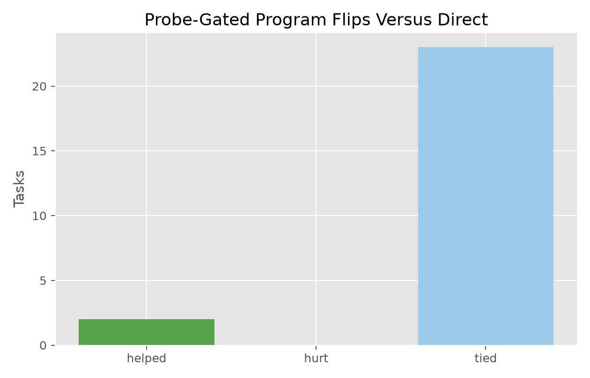
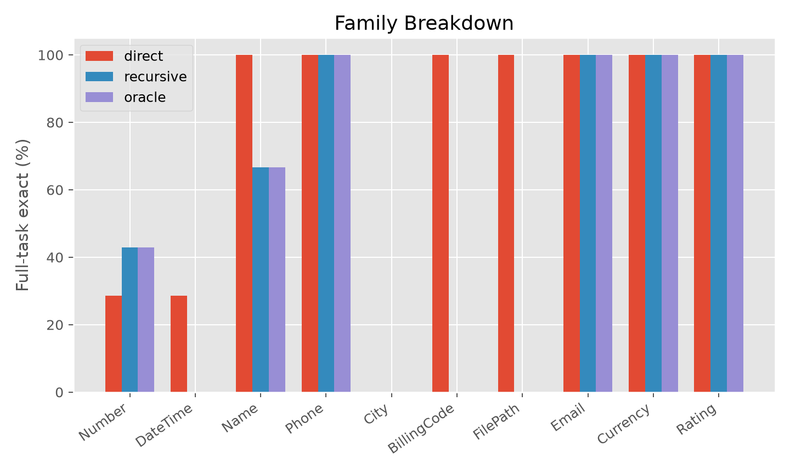
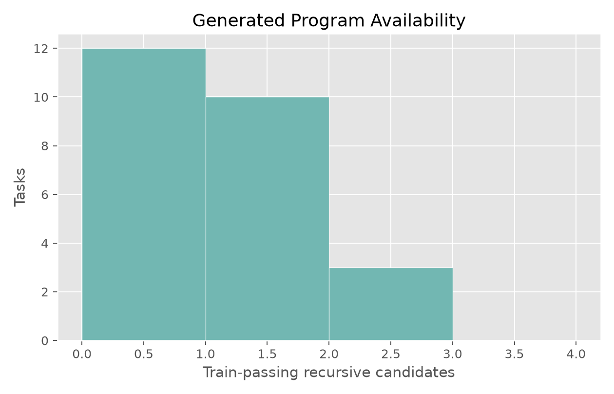
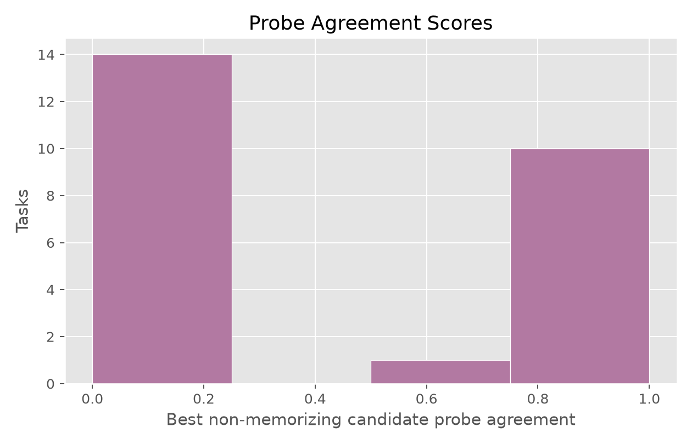

# Disagreement-Probe Program Induction

## Question

Can model-labeled disagreement probes select better task-local executable programs than visible examples alone?

The method asks the model to write Python `transform(row)` candidate functions. Candidate programs are executed on visible examples. Synthetic probe inputs are generated from the visible examples, ranked by candidate disagreement, and labeled by the model. Program selection uses visible examples plus probe labels. Held-out rows are used only for final scoring.

## Setup

- Run: `main_v1`
- Dataset: public text-transformation tasks.
- Tasks: `25`
- Visible examples per task: `4`
- Held-out cap per task: `6`
- Program variants: `monolithic,robust`
- Repair rounds: `1`
- Disagreement probes per task: `4`
- Probe label variants: `plain,consistency`
- Probe score threshold for gated use: `0.67`
- Elapsed seconds: `1556.2`

## Main Result

| method                      |   tasks | row_exact   | full_task_exact   | train_pass_rate   |   tasks_helped_vs_direct |   tasks_hurt_vs_direct |
|:----------------------------|--------:|:------------|:------------------|:------------------|-------------------------:|-----------------------:|
| recursive_gated_direct      |      25 | 82.7%       | 64.0%             | 44.0%             |                        2 |                      0 |
| probe_gated_direct          |      25 | 82.7%       | 64.0%             | 40.0%             |                        2 |                      0 |
| random_probe_gated_direct   |      25 | 82.7%       | 64.0%             | 40.0%             |                        2 |                      0 |
| direct_batch                |      25 | 76.0%       | 60.0%             |                   |                        2 |                      1 |
| direct_row                  |      25 | 80.7%       | 56.0%             |                   |                        0 |                      0 |
| shuffled_probe_gated_direct |      25 | 80.7%       | 56.0%             | 0.0%              |                        0 |                      0 |
| recursive_program           |      25 | 44.7%       | 40.0%             | 52.0%             |                        2 |                      6 |
| probe_program               |      25 | 44.7%       | 40.0%             | 52.0%             |                        2 |                      6 |
| recursive_oracle            |      25 | 44.7%       | 40.0%             | 52.0%             |                        2 |                      6 |
| monolithic_program          |      25 | 40.7%       | 36.0%             | 48.0%             |                        2 |                      7 |
| recursive_shuffled          |      25 | 6.0%        | 4.0%              | 20.0%             |                        1 |                     14 |

## Interpretation

Direct row-by-row answering solves `56.0%` of tasks under strict full-task exactness. The selected executable program without probe selection solves `40.0%`. The non-probe gated method solves `64.0%`. The disagreement-probe gated method solves `64.0%`. Random-probe gated selection solves `64.0%`, and shuffled-label probe selection solves `56.0%`.

The disagreement-probe gated method helps `2` tasks and hurts `0` tasks relative to direct row-by-row answering. The hidden diagnostic oracle over train-passing generated programs solves `40.0%`, and at least one candidate passes visible examples on `52.0%` of tasks.

The shuffled-label control checks whether probe labels matter. The random-probe control checks whether disagreement ranking matters. A useful result should beat direct answering, the non-probe gate, and both probe controls.

## Verdict

Disagreement probes did not add measurable selection power in this run. The probe-gated method tied the non-probe gate at `64.0%` and tied the random-probe gate at `64.0%`. Probe-gated and non-probe gated decisions differed on `0` of `25` tasks, while probe-gated and random-probe gated outcomes matched on `25` of `25` tasks.

The deployable gain came from the conservative direct-fallback gate: it used generated programs on `11` tasks and improved full-task exactness from `56.0%` to `64.0%` without hurting any direct-answer successes. The disagreement-probe gate used generated programs on `10` tasks, and the random-probe gate used generated programs on `10` tasks, but neither improved on that simpler gate.

## Program Diagnostics

The raw executable-program arm is not deployable by itself: train-passing programs can be too narrow, often literal branches or partial parsers. The gated arms use a generated program only when the selected train-passing candidate does not look like a literal example table and its probe agreement clears the configured threshold; otherwise they fall back to direct row-by-row answering.

The probe score distribution is reported separately because a method that only wins by falling back everywhere is not a useful program selector.

## Charts

## Task Details

| task_id            | family      |   heldout_rows | direct_full_exact   | recursive_full_exact   | recursive_gated_full_exact   | probe_gated_full_exact   | random_probe_gated_full_exact   | shuffled_probe_gated_full_exact   | recursive_oracle_full_exact   |   recursive_train_pass_count | probe_gated_used_program   |   probe_gated_score | probe_gated_helped_vs_direct   | probe_gated_hurt_vs_direct   |
|:-------------------|:------------|---------------:|:--------------------|:-----------------------|:-----------------------------|:-------------------------|:--------------------------------|:----------------------------------|:------------------------------|-----------------------------:|:---------------------------|--------------------:|:-------------------------------|:-----------------------------|
| Number.000044      | Number      |              6 | False               | True                   | True                         | True                     | True                            | False                             | True                          |                            1 | True                       |                0.75 | True                           | False                        |
| Number.000093      | Number      |              3 | False               | True                   | True                         | True                     | True                            | False                             | True                          |                            1 | True                       |                0.75 | True                           | False                        |
| BillingCode.000002 | BillingCode |              6 | True                | False                  | True                         | True                     | True                            | True                              | False                         |                            0 | False                      |                0    | False                          | False                        |
| City.000011        | City        |              3 | False               | False                  | False                        | False                    | False                           | False                             | False                         |                            1 | False                      |                0    | False                          | False                        |
| Currency.000004    | Currency    |              6 | True                | True                   | True                         | True                     | True                            | True                              | True                          |                            1 | True                       |                1    | False                          | False                        |
| DateTime.000012    | DateTime    |              6 | False               | False                  | False                        | False                    | False                           | False                             | False                         |                            1 | True                       |                1    | False                          | False                        |
| DateTime.000035    | DateTime    |              6 | True                | False                  | True                         | True                     | True                            | True                              | False                         |                            0 | False                      |                0    | False                          | False                        |
| DateTime.000077    | DateTime    |              6 | False               | False                  | False                        | False                    | False                           | False                             | False                         |                            0 | False                      |                0    | False                          | False                        |
| DateTime.000083    | DateTime    |              6 | False               | False                  | False                        | False                    | False                           | False                             | False                         |                            0 | False                      |                0    | False                          | False                        |
| DateTime.000088    | DateTime    |              6 | False               | False                  | False                        | False                    | False                           | False                             | False                         |                            0 | False                      |                0    | False                          | False                        |
| DateTime.000094    | DateTime    |              4 | True                | False                  | True                         | True                     | True                            | True                              | False                         |                            0 | False                      |                0    | False                          | False                        |
| DateTime.000098    | DateTime    |              6 | False               | False                  | False                        | False                    | False                           | False                             | False                         |                            0 | False                      |                0    | False                          | False                        |
| Email.000013       | Email       |              6 | True                | True                   | True                         | True                     | True                            | True                              | True                          |                            2 | True                       |                1    | False                          | False                        |
| FilePath.000001    | FilePath    |              6 | True                | False                  | True                         | True                     | True                            | True                              | False                         |                            0 | False                      |                0    | False                          | False                        |
| Name.000013        | Name        |              6 | True                | True                   | True                         | True                     | True                            | True                              | True                          |                            2 | False                      |                0.5  | False                          | False                        |
| Name.000026        | Name        |              6 | True                | False                  | True                         | True                     | True                            | True                              | False                         |                            0 | False                      |                0    | False                          | False                        |
| Name.000028        | Name        |              6 | True                | True                   | True                         | True                     | True                            | True                              | True                          |                            2 | True                       |                1    | False                          | False                        |
| Number.000048      | Number      |              4 | True                | False                  | True                         | True                     | True                            | True                              | False                         |                            0 | False                      |                0    | False                          | False                        |
| Number.000074      | Number      |              6 | False               | False                  | False                        | False                    | False                           | False                             | False                         |                            0 | False                      |                0    | False                          | False                        |
| Number.000075      | Number      |              6 | False               | False                  | False                        | False                    | False                           | False                             | False                         |                            0 | False                      |                0    | False                          | False                        |
| Number.000081      | Number      |              6 | False               | False                  | False                        | False                    | False                           | False                             | False                         |                            1 | False                      |                0    | False                          | False                        |
| Number.000088      | Number      |              6 | True                | True                   | True                         | True                     | True                            | True                              | True                          |                            1 | True                       |                1    | False                          | False                        |
| Phone.000005       | Phone       |              6 | True                | True                   | True                         | True                     | True                            | True                              | True                          |                            1 | True                       |                1    | False                          | False                        |
| Phone.000017       | Phone       |              6 | True                | True                   | True                         | True                     | True                            | True                              | True                          |                            1 | True                       |                1    | False                          | False                        |
| Rating.000001      | Rating      |              6 | True                | True                   | True                         | True                     | True                            | True                              | True                          |                            1 | True                       |                1    | False                          | False                        |

## Family Summary

| family      |   direct_row |   monolithic_program |   probe_gated_direct |   recursive_gated_direct |   recursive_oracle |   recursive_program |
|:------------|-------------:|---------------------:|---------------------:|-------------------------:|-------------------:|--------------------:|
| BillingCode |        1     |                0     |                1     |                    1     |              0     |               0     |
| City        |        0     |                0     |                0     |                    0     |              0     |               0     |
| Currency    |        1     |                1     |                1     |                    1     |              1     |               1     |
| DateTime    |        0.286 |                0     |                0.286 |                    0.286 |              0     |               0     |
| Email       |        1     |                1     |                1     |                    1     |              1     |               1     |
| FilePath    |        1     |                0     |                1     |                    1     |              0     |               0     |
| Name        |        1     |                0.667 |                1     |                    1     |              0.667 |               0.667 |
| Number      |        0.286 |                0.429 |                0.571 |                    0.571 |              0.429 |               0.429 |
| Phone       |        1     |                1     |                1     |                    1     |              1     |               1     |
| Rating      |        1     |                0     |                1     |                    1     |              1     |               1     |

## Limitations

Generated code is sandboxed by a conservative AST pass, so some potentially valid programs may be rejected. The benchmark tasks are public text transformations and do not cover arbitrary software engineering problems. Full-task exact is intentionally strict and can be much lower than row accuracy.

## Artifacts

- Run directory: `/workspace/experiments/qwen_disagreement_probe_program_induction/runs/main_v1`
- Summary: `analysis/summary.csv`
- Task details: `analysis/task_summary.csv`
- Candidate programs: `analysis/candidates.csv`
- Probe labels: `analysis/probe_labels.csv`
- Figures: `analysis/figures/`
