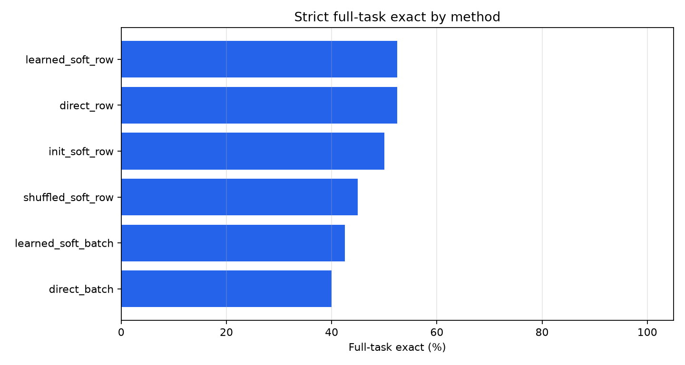
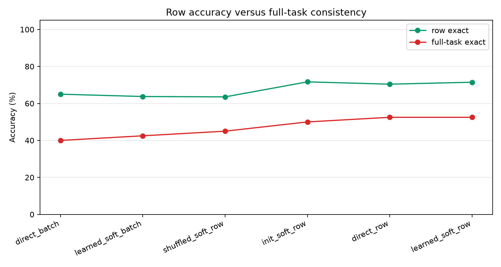
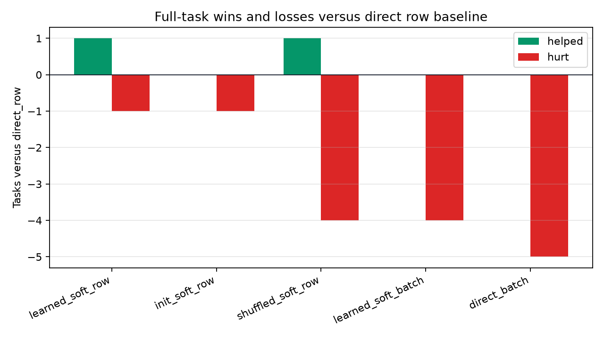
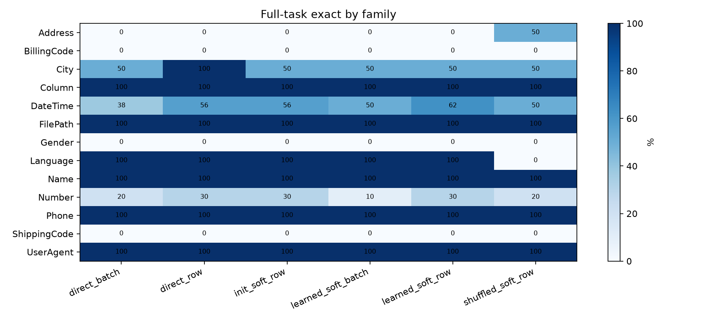
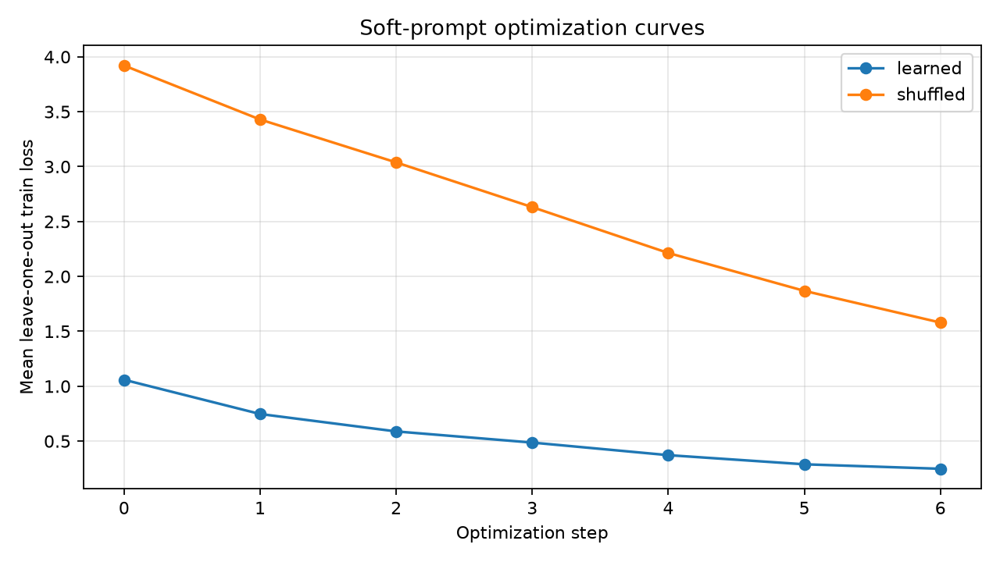

# Episodic Soft-Prompt Task Vectors

## Question

Can a frozen language model become more consistent on text-transformation tasks by learning a small continuous task vector from that task's examples?

Each task receives its own optimized soft prefix. The model weights are frozen. The prefix is trained on leave-one-out versions of the task's training rows, then evaluated on held-out rows.

## Setup

- Dataset root: `/workspace/large_artifacts/qwen_episodic_soft_prompt_task_vectors/prose-benchmarks`
- Run: `main_qwen_soft_prompt_40_s6_lr001`
- Model: `Qwen/Qwen3-4B`
- Tasks: 40
- Soft tokens: 8
- Optimization steps: 6
- Learning rate: 0.01
- Train examples per task: 4
- Held-out cap per task: 4

## Main Result

|method|tasks|row_exact|full_task_exact|parse_ok|avg_outputs|
|---|---|---|---|---|---|
|direct_row|40|70.4%|52.5%|100.0%|3.750|
|learned_soft_row|40|71.5%|52.5%|100.0%|3.750|
|init_soft_row|40|71.7%|50.0%|100.0%|3.750|
|shuffled_soft_row|40|63.5%|45.0%|100.0%|3.750|
|learned_soft_batch|40|63.7%|42.5%|95.0%|3.750|
|direct_batch|40|65.0%|40.0%|95.0%|3.750|

## Interpretation

The learned soft-prompt row method changes strict full-task exact by 0.0 points relative to direct row-by-row inference. It changes full-task exact by 2.5 points relative to the untrained initialized prefix and by 7.5 points relative to a prefix optimized on shuffled training outputs.

The learned prefix changes row exact by 1.0 points relative to direct row-by-row inference. It helps 1 tasks and hurts 1 tasks on strict full-task exact. A positive result requires `learned_soft_row` to beat direct inference and both soft-prefix controls.

This run is neutral for strict full-task exact and weakly positive only at row level. The learned prefix beats the shuffled-label control, showing that the optimization target matters, but it does not improve the number of fully solved tasks over direct row-by-row inference.

## Charts

## Deltas Versus Direct Row Baseline

|method|tasks|full_task_delta|row_exact_delta|tasks_helped|tasks_hurt|tasks_tied|
|---|---|---|---|---|---|---|
|learned_soft_row|40|0.0%|1.0%|1|1|38|
|init_soft_row|40|-2.5%|1.2%|0|1|39|
|shuffled_soft_row|40|-7.5%|-6.9%|1|4|35|
|learned_soft_batch|40|-10.0%|-6.7%|0|4|36|
|direct_batch|40|-12.5%|-5.4%|0|5|35|

## Task Details

|task_id|family|method|row_exact|full_task_exact|parse_ok|parse_status|output_count|
|---|---|---|---|---|---|---|---|
|Address.000002|Address|direct_batch|33.3%|False|True|ok|3|
|Address.000013|Address|direct_batch|50.0%|False|True|ok|4|
|BillingCode.000007|BillingCode|direct_batch|0.0%|False|True|ok|3|
|City.000010|City|direct_batch|100.0%|True|True|ok|3|
|City.000011|City|direct_batch|75.0%|False|True|ok|4|
|Column.000001|Column|direct_batch|100.0%|True|True|ok|4|
|DateTime.000004|DateTime|direct_batch|100.0%|True|True|ok|4|
|DateTime.000007|DateTime|direct_batch|100.0%|True|True|ok|4|
|DateTime.000017|DateTime|direct_batch|75.0%|False|True|ok|4|
|DateTime.000025|DateTime|direct_batch|75.0%|False|True|ok|4|
|DateTime.000027|DateTime|direct_batch|50.0%|False|True|ok|4|
|DateTime.000034|DateTime|direct_batch|100.0%|True|True|ok|4|
|DateTime.000051|DateTime|direct_batch|0.0%|False|True|ok|3|
|DateTime.000076|DateTime|direct_batch|75.0%|False|True|ok|4|
|DateTime.000081|DateTime|direct_batch|0.0%|False|True|ok|4|
|DateTime.000094|DateTime|direct_batch|100.0%|True|True|ok|4|
|DateTime.000104|DateTime|direct_batch|100.0%|True|True|ok|4|
|DateTime.000108|DateTime|direct_batch|100.0%|True|True|ok|4|
|DateTime.000111|DateTime|direct_batch|75.0%|False|True|ok|4|
|DateTime.000114|DateTime|direct_batch|75.0%|False|True|ok|4|
|DateTime.000115|DateTime|direct_batch|0.0%|False|True|ok|4|
|DateTime.000116|DateTime|direct_batch|50.0%|False|True|ok|4|
|FilePath.000001|FilePath|direct_batch|100.0%|True|True|ok|4|
|Gender.000001|Gender|direct_batch|66.7%|False|True|ok|3|
|Language.000002|Language|direct_batch|100.0%|True|True|ok|4|
|Name.000028|Name|direct_batch|100.0%|True|True|ok|4|
|Number.000008|Number|direct_batch|25.0%|False|True|ok|4|
|Number.000015|Number|direct_batch|75.0%|False|True|ok|4|
|Number.000016|Number|direct_batch|0.0%|False|False|parse_fail|4|
|Number.000022|Number|direct_batch|50.0%|False|True|ok|4|
|Number.000028|Number|direct_batch|100.0%|True|True|ok|3|
|Number.000029|Number|direct_batch|0.0%|False|True|ok|3|
|Number.000043|Number|direct_batch|100.0%|True|True|ok|4|
|Number.000049|Number|direct_batch|0.0%|False|False|parse_fail|4|
|Number.000075|Number|direct_batch|50.0%|False|True|ok|4|
|Number.000077|Number|direct_batch|66.7%|False|True|ok|3|
|Phone.000008|Phone|direct_batch|100.0%|True|True|ok|4|
|Phone.000011|Phone|direct_batch|100.0%|True|True|ok|3|
|ShippingCode.000008|ShippingCode|direct_batch|33.3%|False|True|ok|3|
|UserAgent.000003|UserAgent|direct_batch|100.0%|True|True|ok|4|
|Address.000002|Address|direct_row|33.3%|False|True|row_clean|3|
|Address.000013|Address|direct_row|50.0%|False|True|row_clean|4|
|BillingCode.000007|BillingCode|direct_row|33.3%|False|True|row_clean|3|
|City.000010|City|direct_row|100.0%|True|True|row_clean|3|
|City.000011|City|direct_row|100.0%|True|True|row_clean|4|
|Column.000001|Column|direct_row|100.0%|True|True|row_clean|4|
|DateTime.000004|DateTime|direct_row|100.0%|True|True|row_clean|4|
|DateTime.000007|DateTime|direct_row|100.0%|True|True|row_clean|4|
|DateTime.000017|DateTime|direct_row|100.0%|True|True|row_clean|4|
|DateTime.000025|DateTime|direct_row|100.0%|True|True|row_clean|4|
|DateTime.000027|DateTime|direct_row|25.0%|False|True|row_clean|4|
|DateTime.000034|DateTime|direct_row|100.0%|True|True|row_clean|4|
|DateTime.000051|DateTime|direct_row|33.3%|False|True|row_clean|3|
|DateTime.000076|DateTime|direct_row|50.0%|False|True|row_clean|4|
|DateTime.000081|DateTime|direct_row|50.0%|False|True|row_clean|4|
|DateTime.000094|DateTime|direct_row|100.0%|True|True|row_clean|4|
|DateTime.000104|DateTime|direct_row|100.0%|True|True|row_clean|4|
|DateTime.000108|DateTime|direct_row|100.0%|True|True|row_clean|4|
|DateTime.000111|DateTime|direct_row|100.0%|True|True|row_clean|4|
|DateTime.000114|DateTime|direct_row|0.0%|False|True|row_clean|4|
|DateTime.000115|DateTime|direct_row|0.0%|False|True|row_clean|4|
|DateTime.000116|DateTime|direct_row|50.0%|False|True|row_clean|4|
|FilePath.000001|FilePath|direct_row|100.0%|True|True|row_clean|4|
|Gender.000001|Gender|direct_row|66.7%|False|True|row_clean|3|
|Language.000002|Language|direct_row|100.0%|True|True|row_clean|4|
|Name.000028|Name|direct_row|100.0%|True|True|row_clean|4|
|Number.000008|Number|direct_row|50.0%|False|True|row_clean|4|
|Number.000015|Number|direct_row|25.0%|False|True|row_clean|4|
|Number.000016|Number|direct_row|50.0%|False|True|row_clean|4|
|Number.000022|Number|direct_row|100.0%|True|True|row_clean|4|
|Number.000028|Number|direct_row|100.0%|True|True|row_clean|3|
|Number.000029|Number|direct_row|33.3%|False|True|row_clean|3|
|Number.000043|Number|direct_row|100.0%|True|True|row_clean|4|
|Number.000049|Number|direct_row|50.0%|False|True|row_clean|4|
|Number.000075|Number|direct_row|50.0%|False|True|row_clean|4|
|Number.000077|Number|direct_row|33.3%|False|True|row_clean|3|
|Phone.000008|Phone|direct_row|100.0%|True|True|row_clean|4|
|Phone.000011|Phone|direct_row|100.0%|True|True|row_clean|3|
|ShippingCode.000008|ShippingCode|direct_row|33.3%|False|True|row_clean|3|
|UserAgent.000003|UserAgent|direct_row|100.0%|True|True|row_clean|4|
|Address.000002|Address|init_soft_row|33.3%|False|True|row_clean|3|
|Address.000013|Address|init_soft_row|50.0%|False|True|row_clean|4|
|BillingCode.000007|BillingCode|init_soft_row|33.3%|False|True|row_clean|3|
|City.000010|City|init_soft_row|100.0%|True|True|row_clean|3|
|City.000011|City|init_soft_row|75.0%|False|True|row_clean|4|
|Column.000001|Column|init_soft_row|100.0%|True|True|row_clean|4|
|DateTime.000004|DateTime|init_soft_row|100.0%|True|True|row_clean|4|
|DateTime.000007|DateTime|init_soft_row|100.0%|True|True|row_clean|4|
|DateTime.000017|DateTime|init_soft_row|100.0%|True|True|row_clean|4|
|DateTime.000025|DateTime|init_soft_row|100.0%|True|True|row_clean|4|
|DateTime.000027|DateTime|init_soft_row|50.0%|False|True|row_clean|4|
|DateTime.000034|DateTime|init_soft_row|100.0%|True|True|row_clean|4|
|DateTime.000051|DateTime|init_soft_row|33.3%|False|True|row_clean|3|
|DateTime.000076|DateTime|init_soft_row|75.0%|False|True|row_clean|4|
|DateTime.000081|DateTime|init_soft_row|50.0%|False|True|row_clean|4|
|DateTime.000094|DateTime|init_soft_row|100.0%|True|True|row_clean|4|
|DateTime.000104|DateTime|init_soft_row|100.0%|True|True|row_clean|4|
|DateTime.000108|DateTime|init_soft_row|100.0%|True|True|row_clean|4|
|DateTime.000111|DateTime|init_soft_row|100.0%|True|True|row_clean|4|
|DateTime.000114|DateTime|init_soft_row|25.0%|False|True|row_clean|4|
|DateTime.000115|DateTime|init_soft_row|0.0%|False|True|row_clean|4|
|DateTime.000116|DateTime|init_soft_row|50.0%|False|True|row_clean|4|
|FilePath.000001|FilePath|init_soft_row|100.0%|True|True|row_clean|4|
|Gender.000001|Gender|init_soft_row|66.7%|False|True|row_clean|3|
|Language.000002|Language|init_soft_row|100.0%|True|True|row_clean|4|
|Name.000028|Name|init_soft_row|100.0%|True|True|row_clean|4|
|Number.000008|Number|init_soft_row|50.0%|False|True|row_clean|4|
|Number.000015|Number|init_soft_row|25.0%|False|True|row_clean|4|
|Number.000016|Number|init_soft_row|50.0%|False|True|row_clean|4|
|Number.000022|Number|init_soft_row|100.0%|True|True|row_clean|4|
|Number.000028|Number|init_soft_row|100.0%|True|True|row_clean|3|
|Number.000029|Number|init_soft_row|33.3%|False|True|row_clean|3|
|Number.000043|Number|init_soft_row|100.0%|True|True|row_clean|4|
|Number.000049|Number|init_soft_row|50.0%|False|True|row_clean|4|
|Number.000075|Number|init_soft_row|50.0%|False|True|row_clean|4|
|Number.000077|Number|init_soft_row|33.3%|False|True|row_clean|3|
|Phone.000008|Phone|init_soft_row|100.0%|True|True|row_clean|4|
|Phone.000011|Phone|init_soft_row|100.0%|True|True|row_clean|3|
|ShippingCode.000008|ShippingCode|init_soft_row|33.3%|False|True|row_clean|3|
|UserAgent.000003|UserAgent|init_soft_row|100.0%|True|True|row_clean|4|
|Address.000002|Address|learned_soft_batch|33.3%|False|True|ok|3|
|Address.000013|Address|learned_soft_batch|50.0%|False|True|ok|4|
|BillingCode.000007|BillingCode|learned_soft_batch|0.0%|False|True|ok|3|
|City.000010|City|learned_soft_batch|100.0%|True|True|ok|3|
|City.000011|City|learned_soft_batch|50.0%|False|True|ok|4|
|Column.000001|Column|learned_soft_batch|100.0%|True|True|ok|4|
|DateTime.000004|DateTime|learned_soft_batch|100.0%|True|True|ok|4|
|DateTime.000007|DateTime|learned_soft_batch|100.0%|True|True|ok|4|
|DateTime.000017|DateTime|learned_soft_batch|100.0%|True|True|ok|4|
|DateTime.000025|DateTime|learned_soft_batch|100.0%|True|True|ok|4|
|DateTime.000027|DateTime|learned_soft_batch|25.0%|False|True|ok|4|
|DateTime.000034|DateTime|learned_soft_batch|100.0%|True|True|ok|4|
|DateTime.000051|DateTime|learned_soft_batch|0.0%|False|True|ok|3|
|DateTime.000076|DateTime|learned_soft_batch|75.0%|False|True|ok|4|
|DateTime.000081|DateTime|learned_soft_batch|0.0%|False|True|ok|4|
|DateTime.000094|DateTime|learned_soft_batch|100.0%|True|True|ok|4|
|DateTime.000104|DateTime|learned_soft_batch|100.0%|True|True|ok|4|
|DateTime.000108|DateTime|learned_soft_batch|100.0%|True|True|ok|4|
|DateTime.000111|DateTime|learned_soft_batch|75.0%|False|True|ok|4|
|DateTime.000114|DateTime|learned_soft_batch|0.0%|False|False|parse_fail|4|
|DateTime.000115|DateTime|learned_soft_batch|0.0%|False|True|ok|4|
|DateTime.000116|DateTime|learned_soft_batch|50.0%|False|True|ok|4|
|FilePath.000001|FilePath|learned_soft_batch|100.0%|True|True|ok|4|
|Gender.000001|Gender|learned_soft_batch|66.7%|False|True|ok|3|
|Language.000002|Language|learned_soft_batch|100.0%|True|True|ok|4|
|Name.000028|Name|learned_soft_batch|100.0%|True|True|ok|4|
|Number.000008|Number|learned_soft_batch|50.0%|False|True|ok|4|
|Number.000015|Number|learned_soft_batch|75.0%|False|True|ok|4|
|Number.000016|Number|learned_soft_batch|50.0%|False|True|ok|4|
|Number.000022|Number|learned_soft_batch|50.0%|False|True|ok|4|
|Number.000028|Number|learned_soft_batch|0.0%|False|False|parse_fail|3|
|Number.000029|Number|learned_soft_batch|66.7%|False|True|ok|3|
|Number.000043|Number|learned_soft_batch|100.0%|True|True|ok|4|
|Number.000049|Number|learned_soft_batch|50.0%|False|True|ok|4|
|Number.000075|Number|learned_soft_batch|50.0%|False|True|ok|4|
|Number.000077|Number|learned_soft_batch|33.3%|False|True|ok|3|
|Phone.000008|Phone|learned_soft_batch|100.0%|True|True|ok|4|
|Phone.000011|Phone|learned_soft_batch|100.0%|True|True|ok|3|
|ShippingCode.000008|ShippingCode|learned_soft_batch|0.0%|False|True|ok|3|
|UserAgent.000003|UserAgent|learned_soft_batch|100.0%|True|True|ok|4|
|Address.000002|Address|learned_soft_row|33.3%|False|True|row_clean|3|
|Address.000013|Address|learned_soft_row|50.0%|False|True|row_clean|4|
|BillingCode.000007|BillingCode|learned_soft_row|33.3%|False|True|row_clean|3|
|City.000010|City|learned_soft_row|100.0%|True|True|row_clean|3|
|City.000011|City|learned_soft_row|50.0%|False|True|row_clean|4|
|Column.000001|Column|learned_soft_row|100.0%|True|True|row_clean|4|
|DateTime.000004|DateTime|learned_soft_row|100.0%|True|True|row_clean|4|
|DateTime.000007|DateTime|learned_soft_row|100.0%|True|True|row_clean|4|
|DateTime.000017|DateTime|learned_soft_row|100.0%|True|True|row_clean|4|
|DateTime.000025|DateTime|learned_soft_row|100.0%|True|True|row_clean|4|
|DateTime.000027|DateTime|learned_soft_row|75.0%|False|True|row_clean|4|
|DateTime.000034|DateTime|learned_soft_row|100.0%|True|True|row_clean|4|
|DateTime.000051|DateTime|learned_soft_row|33.3%|False|True|row_clean|3|
|DateTime.000076|DateTime|learned_soft_row|100.0%|True|True|row_clean|4|
|DateTime.000081|DateTime|learned_soft_row|50.0%|False|True|row_clean|4|
|DateTime.000094|DateTime|learned_soft_row|100.0%|True|True|row_clean|4|
|DateTime.000104|DateTime|learned_soft_row|100.0%|True|True|row_clean|4|
|DateTime.000108|DateTime|learned_soft_row|100.0%|True|True|row_clean|4|
|DateTime.000111|DateTime|learned_soft_row|100.0%|True|True|row_clean|4|
|DateTime.000114|DateTime|learned_soft_row|25.0%|False|True|row_clean|4|
|DateTime.000115|DateTime|learned_soft_row|0.0%|False|True|row_clean|4|
|DateTime.000116|DateTime|learned_soft_row|50.0%|False|True|row_clean|4|
|FilePath.000001|FilePath|learned_soft_row|100.0%|True|True|row_clean|4|
|Gender.000001|Gender|learned_soft_row|66.7%|False|True|row_clean|3|
|Language.000002|Language|learned_soft_row|100.0%|True|True|row_clean|4|
|Name.000028|Name|learned_soft_row|100.0%|True|True|row_clean|4|
|Number.000008|Number|learned_soft_row|50.0%|False|True|row_clean|4|
|Number.000015|Number|learned_soft_row|25.0%|False|True|row_clean|4|
|Number.000016|Number|learned_soft_row|75.0%|False|True|row_clean|4|
|Number.000022|Number|learned_soft_row|100.0%|True|True|row_clean|4|
|Number.000028|Number|learned_soft_row|100.0%|True|True|row_clean|3|
|Number.000029|Number|learned_soft_row|66.7%|False|True|row_clean|3|
|Number.000043|Number|learned_soft_row|100.0%|True|True|row_clean|4|
|Number.000049|Number|learned_soft_row|25.0%|False|True|row_clean|4|
|Number.000075|Number|learned_soft_row|50.0%|False|True|row_clean|4|
|Number.000077|Number|learned_soft_row|0.0%|False|True|row_clean|3|
|Phone.000008|Phone|learned_soft_row|100.0%|True|True|row_clean|4|
|Phone.000011|Phone|learned_soft_row|100.0%|True|True|row_clean|3|
|ShippingCode.000008|ShippingCode|learned_soft_row|0.0%|False|True|row_clean|3|
|UserAgent.000003|UserAgent|learned_soft_row|100.0%|True|True|row_clean|4|
|Address.000002|Address|shuffled_soft_row|33.3%|False|True|row_clean|3|
|Address.000013|Address|shuffled_soft_row|100.0%|True|True|row_clean|4|
|BillingCode.000007|BillingCode|shuffled_soft_row|33.3%|False|True|row_clean|3|
|City.000010|City|shuffled_soft_row|100.0%|True|True|row_clean|3|
|City.000011|City|shuffled_soft_row|50.0%|False|True|row_clean|4|
|Column.000001|Column|shuffled_soft_row|100.0%|True|True|row_clean|4|
|DateTime.000004|DateTime|shuffled_soft_row|100.0%|True|True|row_clean|4|
|DateTime.000007|DateTime|shuffled_soft_row|100.0%|True|True|row_clean|4|
|DateTime.000017|DateTime|shuffled_soft_row|75.0%|False|True|row_clean|4|
|DateTime.000025|DateTime|shuffled_soft_row|100.0%|True|True|row_clean|4|
|DateTime.000027|DateTime|shuffled_soft_row|25.0%|False|True|row_clean|4|
|DateTime.000034|DateTime|shuffled_soft_row|100.0%|True|True|row_clean|4|
|DateTime.000051|DateTime|shuffled_soft_row|33.3%|False|True|row_clean|3|
|DateTime.000076|DateTime|shuffled_soft_row|75.0%|False|True|row_clean|4|
|DateTime.000081|DateTime|shuffled_soft_row|25.0%|False|True|row_clean|4|
|DateTime.000094|DateTime|shuffled_soft_row|100.0%|True|True|row_clean|4|
|DateTime.000104|DateTime|shuffled_soft_row|100.0%|True|True|row_clean|4|
|DateTime.000108|DateTime|shuffled_soft_row|100.0%|True|True|row_clean|4|
|DateTime.000111|DateTime|shuffled_soft_row|100.0%|True|True|row_clean|4|
|DateTime.000114|DateTime|shuffled_soft_row|25.0%|False|True|row_clean|4|

## Train Loss Log

|arm|step|loss|
|---|---|---|
|learned|0|1.059|
|learned|1|0.747|
|learned|2|0.588|
|learned|3|0.487|
|learned|4|0.372|
|learned|5|0.289|
|learned|6|0.248|
|shuffled|0|3.920|
|shuffled|1|3.429|
|shuffled|2|3.038|
|shuffled|3|2.631|
|shuffled|4|2.213|
|shuffled|5|1.868|
|shuffled|6|1.580|

## Files

- `runs/main_qwen_soft_prompt_40_s6_lr001/task_details.csv`
- `runs/main_qwen_soft_prompt_40_s6_lr001/row_details.csv`
- `runs/main_qwen_soft_prompt_40_s6_lr001/train_log.csv`
- `runs/main_qwen_soft_prompt_40_s6_lr001/summary.csv`
- `runs/main_qwen_soft_prompt_40_s6_lr001/method_deltas.csv`
- `analysis/summary.csv`
- `analysis/method_deltas.csv`
- `analysis/task_details.csv`
- `analysis/row_details.csv`
- `analysis/train_log.csv`
