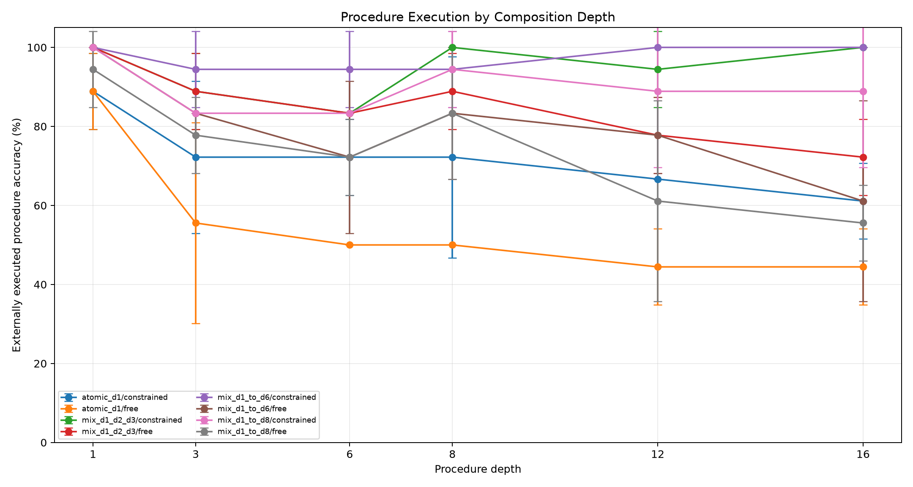
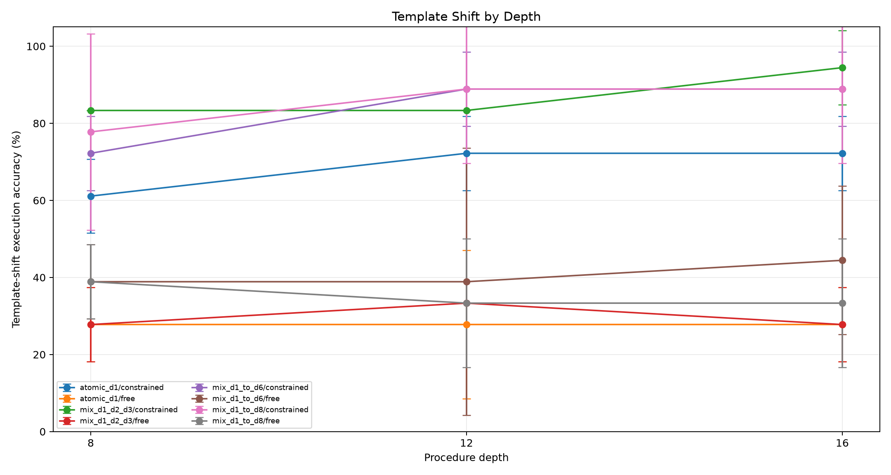
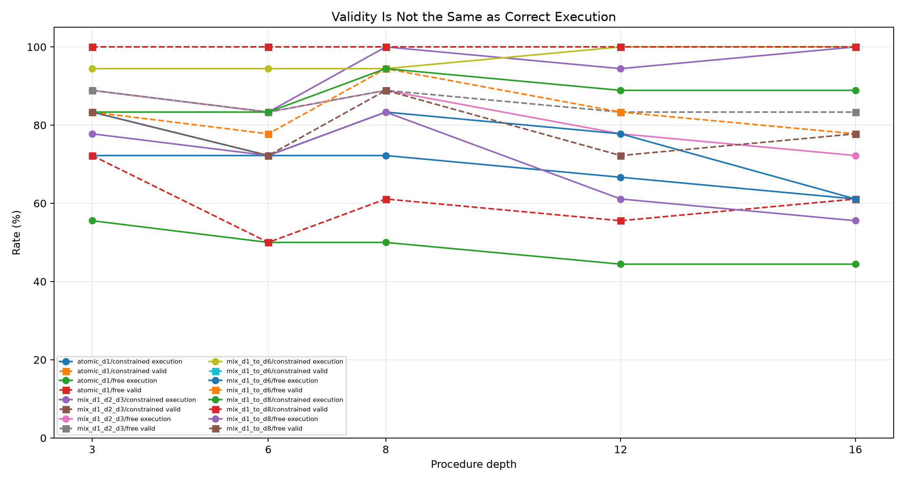
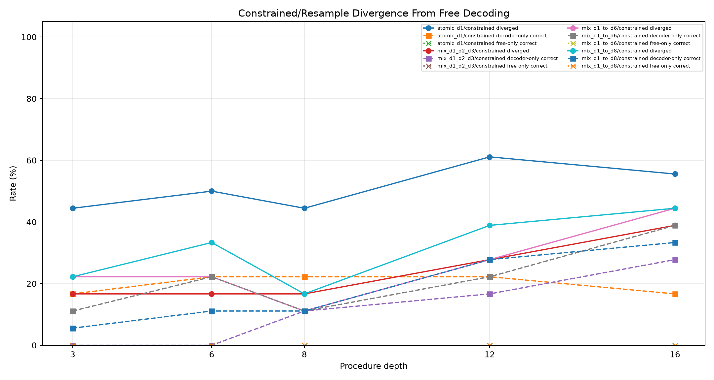
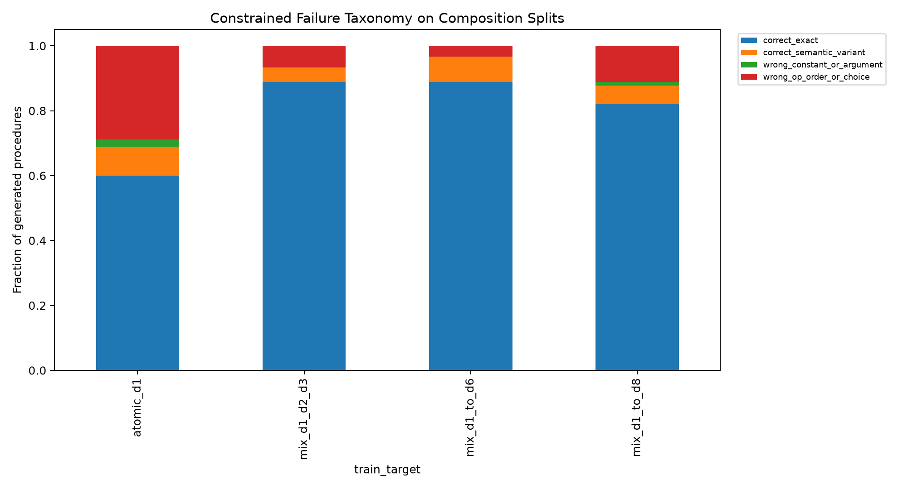
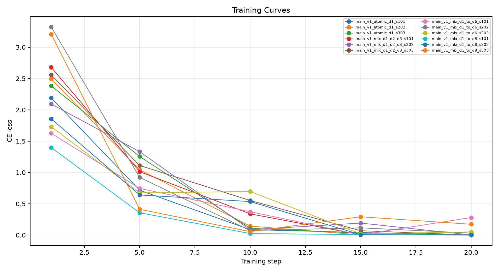

# Qwen Extrapolation-Bound ABI

## Abstract

This standalone experiment measures how far a constrained stack-ABI compiler extrapolates beyond its maximum supervised composition depth. The model emits a program; a deterministic interpreter executes it. The central question is whether shallow composition training is enough for long procedures, or whether the curriculum must reach roughly half the deployment depth.

## Method

Four QLoRA adapters are trained with the same ABI target and different maximum curriculum depths:
- `atomic_d1`: only one-operation tasks.
- `mix_d1_d2_d3`: a balanced mix of one-, two-, and three-operation tasks.
- `mix_d1_to_d6`: a balanced mix of depths 1, 2, 3, 4, and 6.
- `mix_d1_to_d8`: a balanced mix of depths 1, 2, 3, 4, 6, and 8.

Evaluation sweeps standard prompts at depths 1, 3, 6, 8, 12, and 16, plus wording-shifted prompts at depths 8, 12, and 16. Each trained adapter is evaluated with free greedy decoding and finite-state constrained decoding. A gold ABI sanity arm checks the interpreter.

The primary criterion is constrained external execution accuracy at depths 12 and 16. Valid-program rate alone is not a success metric; a deeper curriculum must reduce valid-but-wrong composition errors, not only improve syntax.

## Run Configuration

- Primary suite: `main`.
- Seeds: `101,202,303`.
- Evaluation rows: `243` metric rows, `1458` scored examples across curricula and decoder arms.
- QLoRA update steps per adapter: `20`.
- Large adapters are stored outside the experiment tree.

## Primary Results

- Constrained depth-6: `atomic_d1` 72.2%; `mix_d1_d2_d3` 83.3%; `mix_d1_to_d6` 94.4%; `mix_d1_to_d8` 83.3%.
  Depth-6 deltas: max3 minus atomic 11.1%; max6 minus max3 11.1%; max8 minus max6 -11.1%.
- Constrained depth-8: `atomic_d1` 72.2%; `mix_d1_d2_d3` 100.0%; `mix_d1_to_d6` 94.4%; `mix_d1_to_d8` 94.4%.
  Depth-8 deltas: max3 minus atomic 27.8%; max6 minus max3 -5.6%; max8 minus max6 0.0%.
- Constrained depth-12: `atomic_d1` 66.7%; `mix_d1_d2_d3` 94.4%; `mix_d1_to_d6` 100.0%; `mix_d1_to_d8` 88.9%.
  Depth-12 deltas: max3 minus atomic 27.8%; max6 minus max3 5.6%; max8 minus max6 -11.1%.
- Constrained depth-16: `atomic_d1` 61.1%; `mix_d1_d2_d3` 100.0%; `mix_d1_to_d6` 100.0%; `mix_d1_to_d8` 88.9%.
  Depth-16 deltas: max3 minus atomic 38.9%; max6 minus max3 0.0%; max8 minus max6 -11.1%.
- Template depth-8: atomic 61.1%; max3 83.3%; max6 72.2%; max8 77.8%.
- Template depth-12: atomic 72.2%; max3 83.3%; max6 88.9%; max8 88.9%.
- Template depth-16: atomic 72.2%; max3 94.4%; max6 88.9%; max8 88.9%.
- Gold ABI depth-16 sanity: 100.0% execution and 100.0% validity.
- At depth 16, max-depth-8 beats max-depth-3 on `0/3` matched seeds; mean per-seed delta -11.1%.

|train_target|arm|split|depth|runs|n_total|exec_accuracy_mean|exec_accuracy_std|valid_exec_rate_mean|correct_given_valid_mean|divergence_rate_mean|constrained_only_rate_mean|free_only_rate_mean|mean_attempts_mean|
|---|---|---|---|---|---|---|---|---|---|---|---|---|---|
|atomic_d1|program_stack_constrained|eval_comp_d12|12|3|18|66.7%|0.0%|100.0%|66.7%|61.1%|22.2%|0.0%|1.00|
|atomic_d1|program_stack_free|eval_comp_d12|12|3|18|44.4%|9.6%|55.6%|80.6%|n/a|n/a|n/a|1.00|
|mix_d1_d2_d3|program_stack_constrained|eval_comp_d12|12|3|18|94.4%|9.6%|100.0%|94.4%|27.8%|16.7%|0.0%|1.00|
|mix_d1_d2_d3|program_stack_free|eval_comp_d12|12|3|18|77.8%|9.6%|83.3%|94.4%|n/a|n/a|n/a|1.00|
|mix_d1_to_d6|program_stack_constrained|eval_comp_d12|12|3|18|100.0%|0.0%|100.0%|100.0%|27.8%|22.2%|0.0%|1.00|
|mix_d1_to_d6|program_stack_free|eval_comp_d12|12|3|18|77.8%|9.6%|83.3%|94.4%|n/a|n/a|n/a|1.00|
|mix_d1_to_d8|program_stack_constrained|eval_comp_d12|12|3|18|88.9%|19.2%|100.0%|88.9%|38.9%|27.8%|0.0%|1.00|
|mix_d1_to_d8|program_stack_free|eval_comp_d12|12|3|18|61.1%|25.5%|72.2%|83.3%|n/a|n/a|n/a|1.00|
|oracle|gold_abi_constrained|eval_comp_d12|12|3|18|100.0%|0.0%|100.0%|100.0%|n/a|n/a|n/a|0.00|
|atomic_d1|program_stack_constrained|eval_comp_d16|16|3|18|61.1%|9.6%|100.0%|61.1%|55.6%|16.7%|0.0%|1.00|
|atomic_d1|program_stack_free|eval_comp_d16|16|3|18|44.4%|9.6%|61.1%|72.2%|n/a|n/a|n/a|1.00|
|mix_d1_d2_d3|program_stack_constrained|eval_comp_d16|16|3|18|100.0%|0.0%|100.0%|100.0%|38.9%|27.8%|0.0%|1.00|
|mix_d1_d2_d3|program_stack_free|eval_comp_d16|16|3|18|72.2%|9.6%|83.3%|87.8%|n/a|n/a|n/a|1.00|
|mix_d1_to_d6|program_stack_constrained|eval_comp_d16|16|3|18|100.0%|0.0%|100.0%|100.0%|44.4%|38.9%|0.0%|1.00|
|mix_d1_to_d6|program_stack_free|eval_comp_d16|16|3|18|61.1%|25.5%|77.8%|76.7%|n/a|n/a|n/a|1.00|
|mix_d1_to_d8|program_stack_constrained|eval_comp_d16|16|3|18|88.9%|19.2%|100.0%|88.9%|44.4%|33.3%|0.0%|1.00|
|mix_d1_to_d8|program_stack_free|eval_comp_d16|16|3|18|55.6%|9.6%|77.8%|71.7%|n/a|n/a|n/a|1.00|
|oracle|gold_abi_constrained|eval_comp_d16|16|3|18|100.0%|0.0%|100.0%|100.0%|n/a|n/a|n/a|0.00|
|atomic_d1|program_stack_constrained|eval_comp_d6|6|3|18|72.2%|9.6%|100.0%|72.2%|50.0%|22.2%|0.0%|1.00|
|atomic_d1|program_stack_free|eval_comp_d6|6|3|18|50.0%|0.0%|50.0%|100.0%|n/a|n/a|n/a|1.00|
|mix_d1_d2_d3|program_stack_constrained|eval_comp_d6|6|3|18|83.3%|0.0%|100.0%|83.3%|16.7%|0.0%|0.0%|1.00|
|mix_d1_d2_d3|program_stack_free|eval_comp_d6|6|3|18|83.3%|0.0%|83.3%|100.0%|n/a|n/a|n/a|1.00|
|mix_d1_to_d6|program_stack_constrained|eval_comp_d6|6|3|18|94.4%|9.6%|100.0%|94.4%|22.2%|22.2%|0.0%|1.00|
|mix_d1_to_d6|program_stack_free|eval_comp_d6|6|3|18|72.2%|19.2%|77.8%|91.7%|n/a|n/a|n/a|1.00|
|mix_d1_to_d8|program_stack_constrained|eval_comp_d6|6|3|18|83.3%|0.0%|100.0%|83.3%|33.3%|11.1%|0.0%|1.00|
|mix_d1_to_d8|program_stack_free|eval_comp_d6|6|3|18|72.2%|9.6%|72.2%|100.0%|n/a|n/a|n/a|1.00|
|oracle|gold_abi_constrained|eval_comp_d6|6|3|18|100.0%|0.0%|100.0%|100.0%|n/a|n/a|n/a|0.00|
|atomic_d1|program_stack_constrained|eval_comp_d8|8|3|18|72.2%|25.5%|100.0%|72.2%|44.4%|22.2%|0.0%|1.00|
|atomic_d1|program_stack_free|eval_comp_d8|8|3|18|50.0%|0.0%|61.1%|83.3%|n/a|n/a|n/a|1.00|
|mix_d1_d2_d3|program_stack_constrained|eval_comp_d8|8|3|18|100.0%|0.0%|100.0%|100.0%|16.7%|11.1%|0.0%|1.00|
|mix_d1_d2_d3|program_stack_free|eval_comp_d8|8|3|18|88.9%|9.6%|88.9%|100.0%|n/a|n/a|n/a|1.00|
|mix_d1_to_d6|program_stack_constrained|eval_comp_d8|8|3|18|94.4%|9.6%|100.0%|94.4%|11.1%|11.1%|0.0%|1.00|
|mix_d1_to_d6|program_stack_free|eval_comp_d8|8|3|18|83.3%|16.7%|94.4%|88.9%|n/a|n/a|n/a|1.00|
|mix_d1_to_d8|program_stack_constrained|eval_comp_d8|8|3|18|94.4%|9.6%|100.0%|94.4%|16.7%|11.1%|0.0%|1.00|
|mix_d1_to_d8|program_stack_free|eval_comp_d8|8|3|18|83.3%|16.7%|88.9%|93.3%|n/a|n/a|n/a|1.00|
|oracle|gold_abi_constrained|eval_comp_d8|8|3|18|100.0%|0.0%|100.0%|100.0%|n/a|n/a|n/a|0.00|
|atomic_d1|program_stack_constrained|eval_template_d12|12|3|18|72.2%|9.6%|100.0%|72.2%|72.2%|44.4%|0.0%|1.00|
|atomic_d1|program_stack_free|eval_template_d12|12|3|18|27.8%|19.2%|33.3%|83.3%|n/a|n/a|n/a|1.00|
|mix_d1_d2_d3|program_stack_constrained|eval_template_d12|12|3|18|83.3%|0.0%|100.0%|83.3%|66.7%|50.0%|0.0%|1.00|
|mix_d1_d2_d3|program_stack_free|eval_template_d12|12|3|18|33.3%|0.0%|33.3%|100.0%|n/a|n/a|n/a|1.00|
|mix_d1_to_d6|program_stack_constrained|eval_template_d12|12|3|18|88.9%|9.6%|100.0%|88.9%|66.7%|55.6%|5.6%|1.00|
|mix_d1_to_d6|program_stack_free|eval_template_d12|12|3|18|38.9%|34.7%|38.9%|100.0%|n/a|n/a|n/a|1.00|
|mix_d1_to_d8|program_stack_constrained|eval_template_d12|12|3|18|88.9%|19.2%|100.0%|88.9%|66.7%|55.6%|0.0%|1.00|
|mix_d1_to_d8|program_stack_free|eval_template_d12|12|3|18|33.3%|16.7%|38.9%|83.3%|n/a|n/a|n/a|1.00|
|oracle|gold_abi_constrained|eval_template_d12|12|3|18|100.0%|0.0%|100.0%|100.0%|n/a|n/a|n/a|0.00|
|atomic_d1|program_stack_constrained|eval_template_d16|16|3|18|72.2%|9.6%|100.0%|72.2%|77.8%|44.4%|0.0%|1.00|
|atomic_d1|program_stack_free|eval_template_d16|16|3|18|27.8%|9.6%|38.9%|83.3%|n/a|n/a|n/a|1.00|
|mix_d1_d2_d3|program_stack_constrained|eval_template_d16|16|3|18|94.4%|9.6%|100.0%|94.4%|72.2%|66.7%|0.0%|1.00|
|mix_d1_d2_d3|program_stack_free|eval_template_d16|16|3|18|27.8%|9.6%|33.3%|83.3%|n/a|n/a|n/a|1.00|
|mix_d1_to_d6|program_stack_constrained|eval_template_d16|16|3|18|88.9%|9.6%|100.0%|88.9%|55.6%|44.4%|0.0%|1.00|
|mix_d1_to_d6|program_stack_free|eval_template_d16|16|3|18|44.4%|19.2%|50.0%|88.9%|n/a|n/a|n/a|1.00|
|mix_d1_to_d8|program_stack_constrained|eval_template_d16|16|3|18|88.9%|19.2%|100.0%|88.9%|72.2%|55.6%|0.0%|1.00|
|mix_d1_to_d8|program_stack_free|eval_template_d16|16|3|18|33.3%|16.7%|38.9%|83.3%|n/a|n/a|n/a|1.00|
|oracle|gold_abi_constrained|eval_template_d16|16|3|18|100.0%|0.0%|100.0%|100.0%|n/a|n/a|n/a|0.00|

## Interpretation

This experiment identifies the useful extrapolation span of supervised composition curricula. If max-depth-3 training holds through depth 12 or 16, a large ABI corpus can stay shallow. If max-depth-6 or max-depth-8 training is needed for depth-12 or depth-16 reliability, the corpus should include composed procedures up to roughly half the expected deployment depth.
The main result is that depth-3 compositional supervision is sufficient for this depth range: standard depth-16 constrained execution rises from 61.1% with atomic-only training to 100.0% with `mix_d1_d2_d3`. Training through depth 6 matches it at 100.0%, while training through depth 8 falls to 88.9%.
The same pattern holds on the wording-shifted endpoint: `mix_d1_d2_d3` reaches 94.4% at template depth 16, versus 88.9% for max-depth-6 and 88.9% for max-depth-8.
Because constrained validity is 100% throughout the trained arms, these gains are reductions in valid-but-wrong composition errors rather than syntax improvements.
At depth 16, max-depth-8 training changes execution by -11.1% and correct-given-valid by -11.1% relative to max-depth-3 training.
For `atomic_d1` constrained decoding on depth-12/depth-16 composition splits, procedures break down as: correct_exact 47.2%, wrong_op_order_or_choice 30.6%, correct_semantic_variant 16.7%, wrong_constant_or_argument 5.6%.
For `mix_d1_d2_d3` constrained decoding on depth-12/depth-16 composition splits, procedures break down as: correct_exact 88.9%, correct_semantic_variant 8.3%, wrong_op_order_or_choice 2.8%.
For `mix_d1_to_d6` constrained decoding on depth-12/depth-16 composition splits, procedures break down as: correct_exact 88.9%, correct_semantic_variant 11.1%.
For `mix_d1_to_d8` constrained decoding on depth-12/depth-16 composition splits, procedures break down as: correct_exact 86.1%, wrong_op_order_or_choice 8.3%, correct_semantic_variant 2.8%, wrong_constant_or_argument 2.8%.

## Limitations

This experiment tests compilation over a fixed known primitive library. It does not test invention of operations outside the ABI. The finite-state decoder is tied to the task schema and uses task-visible constants and type information. Composed examples in the curricula are supervised generated data, so gains should be read as curriculum effects rather than unsupervised discovery.

## Artifacts

- Metrics: `analysis/summary_by_arm.csv` and `analysis/all_metrics.csv`
- Details: `analysis/all_details.csv`
- Training logs: `analysis/all_train_logs.csv`
- Checkpoints: `/workspace/large_artifacts/qwen_extrapolation_bound_abi/checkpoints`
