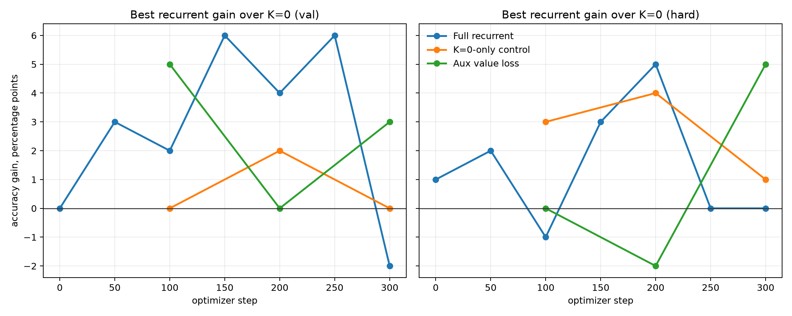
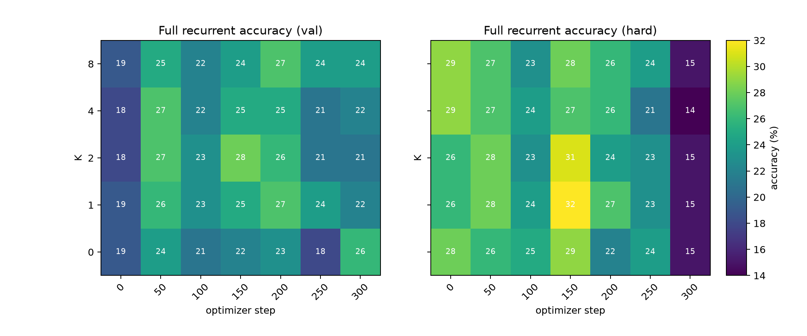
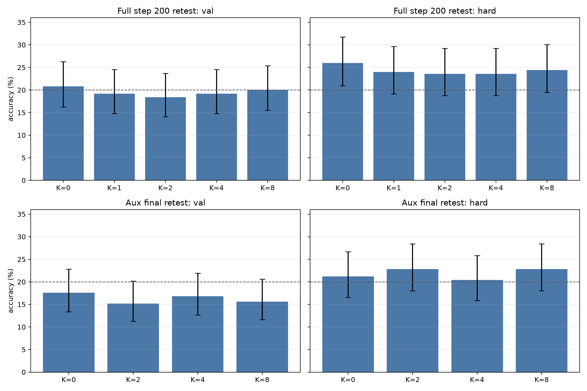

# Did a Small Latent Recurrent Fast-Weight Runtime Make Qwen Compute Better?

**A local single-GPU experiment on invisible recurrent computation inside Qwen3.5-4B**

## Abstract

We tested whether a frozen Qwen3.5-4B model augmented with a small internal recurrent fast-weight runtime gains accuracy when given more invisible latent compute steps `K`. The experiment used generated, exactly-verifiable modular arithmetic multiple-choice tasks, with a harder held-out split containing longer operation chains. The core result is negative: the current implementation does **not** demonstrate robust K-scaling. Several 100-example checkpoints showed small apparent gains from recurrence, but larger 250-example retests erased or reversed the most favorable effects. A `K=0`-only training control also produced occasional small K bumps despite never training the recurrent core, showing that isolated few-point gains are not reliable evidence. The best-supported conclusion is that this small bolt-on recurrent adapter sometimes perturbs predictions beneficially, but did not learn stable serial latent computation under this training setup.

## Lay Summary

The idea was to give a language model a private scratchpad loop inside its neural network, instead of forcing it to think by writing words. If that worked, giving the model more private steps should make it more accurate on multi-step arithmetic.

We built and ran that test. The model sometimes looked better with a few private steps, but when we checked those promising moments on more examples, the improvement went away. The experiment was still useful: it showed how to run this kind of test, what controls are needed, and why small apparent improvements can be misleading.

## 1. Motivation

A normal language model has two recurrence channels:

1. It can attend over the input sequence inside one forward pass.
2. It can generate more output tokens and feed them back into itself.

The second channel is powerful but visible and expensive. The motivating hypothesis was that a model might benefit from an internal recurrent machine:

```text
prompt -> compiler layers -> latent workspace/runtime -> decoder layers -> answer
```

In the target design, the model does not emit a DSL or call a tool. It updates temporary internal state: workspace tokens, gates over low-rank operators, and differentiable fast-weight memory. The key empirical signature should be:

```text
accuracy(K=0) < accuracy(K=1) < accuracy(K=2/4/8), especially on longer held-out chains
```

## 2. Important Architecture Caveat

One design assumption was that the backbone would behave like a plain transformer. The actual default model, `Qwen/Qwen3.5-4B`, is more interesting: its Hugging Face model card describes it as a causal language model with a vision encoder, 4B language-model parameters, hidden size 2560, 32 layers, and a repeated hidden layout of three Gated DeltaNet layers followed by one gated attention layer. NVIDIA's Qwen3.5 documentation likewise describes Qwen3.5 as a hybrid Gated DeltaNet plus standard-attention architecture, with dense and MoE variants in the broader family.

That matters. Gated DeltaNet is already a kind of learned fast-weight/linear-attention substrate. Therefore this experiment should not be read as adding fast weights to a model that lacks them entirely. The sharper question is narrower:

> Does adding a small recurrent-depth axis over invisible workspace tokens improve this already hybrid Qwen3.5 model?

Sources: [Qwen/Qwen3.5-4B model card](https://huggingface.co/Qwen/Qwen3.5-4B), [NVIDIA Qwen3.5 documentation](https://docs.nvidia.com/nemo/megatron-bridge/0.4.1/models/vlm/qwen35-vl.html).

## 3. Experimental Setup

### Backbone

- Model: `Qwen/Qwen3.5-4B`
- Loader: `AutoModelForMultimodalLM`
- Quantization: 4-bit bitsandbytes
- Frozen base parameters: 2,590,093,824 counted in the loaded text/vision model object
- Detected language layers: `model.language_model.layers`
- Hook insertion point: layer index 28 of 32 (`--hook_layer -4`)
- GPU: NVIDIA RTX 6000 Ada, about 48 GB VRAM

### Runtime Adapter

The adapter reads prompt hidden states only, initializes eight latent workspace tokens, runs `K` recurrent steps, and writes a residual delta back into the hidden stream before later Qwen layers decode the answer.

Core components:

- workspace tokens: 8
- runtime width: 256
- dynamic low-rank transform bank: 12 bases, rank 16
- temporary fast-weight memory: 128 x 128
- recurrent training budgets: `K in {1,2,4}`
- evaluation budgets: `K in {0,1,2,4,8}`

`K=0` is not the frozen model. It is the trained prompt-conditioned injection with zero recurrent loop iterations. The true frozen-model baseline was measured separately with the hook disabled.

### Task

The task generator creates exact modular arithmetic problems modulo 97 with five answer choices. Families include single-register chains, reverse-worded chains, and two-register updates. The hard split uses longer operation chains than training by adding three extra steps.

The model is scored by multiple-choice answer-letter log-likelihood. For each candidate letter, we compute the average negative log-likelihood of that answer token and choose the lowest-NLL candidate.

### Runs

Three main runs were completed:

| Run | Training `K` | Extra objective | Purpose |
|---|---:|---|---|
| Full recurrent | `1,2,4` | none | Primary test of recurrent latent compute |
| `K=0`-only control | `0` | none | Tests whether untrained recurrent steps create similar bumps |
| Auxiliary value loss | `1,2,4` | `0.2 * CE(answer mod 97)` | Tests whether denser numeric supervision helps |

Training used 300 optimizer steps, batch size 4, and 100-example validation/hard evaluations at checkpoints. The most favorable checkpoints were retested on 250 examples per split.

## 4. Results

### Frozen Baseline

The first concern was whether the task was too easy. It was not.

Frozen Qwen3.5-4B, hook disabled:

| Split | Accuracy |
|---|---:|
| Validation | 18.0% |
| Hard | 21.0% |

Chance is 20% because there are five choices. This gave the recurrent runtime real headroom.

### Training Checkpoints



At 100-example checkpoint evaluations, the full recurrent run sometimes showed positive `K>0` gains. For example, at step 150 validation improved from 22% at `K=0` to 28% at `K=2`, and hard improved from 29% at `K=0` to 32% at `K=1`.

But the effect was unstable:

- It was not monotonic in `K`.
- It appeared and disappeared across checkpoints.
- The final full recurrent checkpoint was negative on validation: `K=0` was 26%, while `K=1/2/4/8` were 22%, 21%, 22%, and 24%.
- The hard split did not show reliable length-generalization gains.

The heatmap below shows the full recurrent run across all checkpoints.



### Control Run

The `K=0`-only control trained the same prompt-conditioned injection path but never trained the recurrent core. If untrained recurrence still creates small K bumps, then isolated gains in the full run are not enough.

That is what happened. At step 200, the control hard split improved from 26% at `K=0` to 30% at `K=4`, even though recurrent dynamics were untrained. This does not mean the control learned recurrence. It means 100-example K sweeps are noisy enough to produce misleading few-point bumps.

### Larger Retests

The most important verification was retesting promising checkpoints on 250 examples per split with Wilson 95% intervals.



The strongest apparent full-run checkpoint was step 200. On larger retest:

| Split | K=0 | Best K>0 | Result |
|---|---:|---:|---|
| Validation | 20.8% | 20.0% (`K=8`) | no gain |
| Hard | 26.0% | 24.4% (`K=8`) | no gain |

The auxiliary final checkpoint also failed to show a robust effect:

| Split | K=0 | Best K>0 | Result |
|---|---:|---:|---|
| Validation | 17.6% | 16.8% (`K=4`) | no gain |
| Hard | 21.2% | 22.8% (`K=2/8`) | +1.6 points, not compelling |

The auxiliary value loss itself remained close to random prediction of one of 97 residues, so it did not provide evidence that the workspace learned exact arithmetic.

## 5. Interpretation

The experiment did **not** validate the strong hypothesis:

> More latent recurrent compute reliably improves accuracy on serial-depth-bound arithmetic.

Instead, it supports a weaker and more cautionary conclusion:

> This small 256-dimensional recurrent adapter can perturb Qwen's answer distribution, sometimes beneficially, but under this training budget it does not produce stable, generalizing, monotonic internal computation.

Several observations point in the same direction:

1. `K=0` was often as good as or better than `K>0` under larger retesting.
2. Apparent K gains were not monotonic.
3. The hard length-generalization split did not improve reliably.
4. A `K=0`-only control produced occasional K bumps despite untrained recurrence.
5. The auxiliary value-prediction head did not learn the numeric target.

## 6. What This Falsifies and What It Does Not

This does **not** falsify latent recurrent reasoning as a general idea. It falsifies a narrower implementation claim:

> A small, hook-inserted, 256-dimensional recurrent fast-weight adapter trained for 300 steps with answer-letter NLL is sufficient to produce robust K-scaling on these modular arithmetic tasks.

That claim is not supported.

The broader idea remains plausible because this implementation is thin relative to the proposal:

- The recurrent loop operates in a small adapter, not through repeated full-width Qwen layers.
- The final objective is mostly one answer-letter token, a low-bandwidth signal.
- The fast-weight memory is a simple leaky outer-product accumulator.
- There is no monotonic-refinement loss, halting objective, teacher trace distillation, or paired per-example recurrence analysis.
- Qwen3.5 already contains Gated DeltaNet layers, so the added fast-weight memory may be redundant unless the recurrent axis is made much stronger.

## 7. Recommended Next Experiment

The next version should target the failure modes directly:

1. **Use paired per-example evaluation.** Record whether the same example flips correct/incorrect as K changes, then use paired tests rather than independent binomial intervals.
2. **Train with a real workspace target.** Predict the numeric answer from `S_K`, but make that objective strong enough to learn; the current auxiliary head did not.
3. **Iterate a wider computation.** Re-run a small slice of upper Qwen layers with workspace conditioning, not only a 256-dimensional adapter.
4. **Preserve all checkpoints automatically.** This is now patched in the script.
5. **Reduce intermediate eval cost.** Use small checkpoint sweeps, then large retests only for selected checkpoints.
6. **Add a refinement objective.** Train `V(S_{t+1})` to be more predictive than `V(S_t)` so recurrence is pressured to improve state rather than merely move it.
7. **Use cleaner gates if interpretability matters.** Softmax mixtures are poor evidence for discrete latent opcodes; sigmoid/top-k or vector-quantized program codes would make clustering tests more meaningful.

## 8. Reproducibility

Primary files:

- Experiment script: `../src/latent_qwen_fastweight_experiment.py`
- Analysis script: `../src/analyze_latent_results.py`
- Experiment log: `experiment_log.md`
- Long-form checkpoint data: `../analysis/training_accuracy_long.csv`
- Larger retests: `../analysis/large_retests_long.csv`
- Figures: `../analysis/figures/`

Primary run directories:

- `../runs/main_qwen35_hook_full_seed7`
- `../runs/control_qwen35_hook_traink0_seed7`
- `../runs/main_qwen35_hook_aux02_seed7`
- `../runs/eval_main_step200_n250`
- `../runs/eval_aux_final_n250`

Large adapter checkpoints are stored outside the experiment bundle under:

- `../../../large_artifacts/qwen_fastweight_hook/checkpoints/`

Environment:

- Python 3.12.3
- PyTorch 2.8.0+cu128
- Transformers 5.12.1
- bitsandbytes 0.49.2
- GPU: NVIDIA RTX 6000 Ada Generation

## 9. Bottom Line

This was a useful negative result. The experiment found real headroom and successfully inserted an invisible recurrent runtime into Qwen3.5-4B, but it did not find robust evidence that more latent recurrent steps improve exact modular arithmetic. The strongest early positive signs did not survive larger retesting. The next experiment should move from a small residual adapter toward a stronger recurrent-depth mechanism with denser supervision and paired statistical evaluation.
