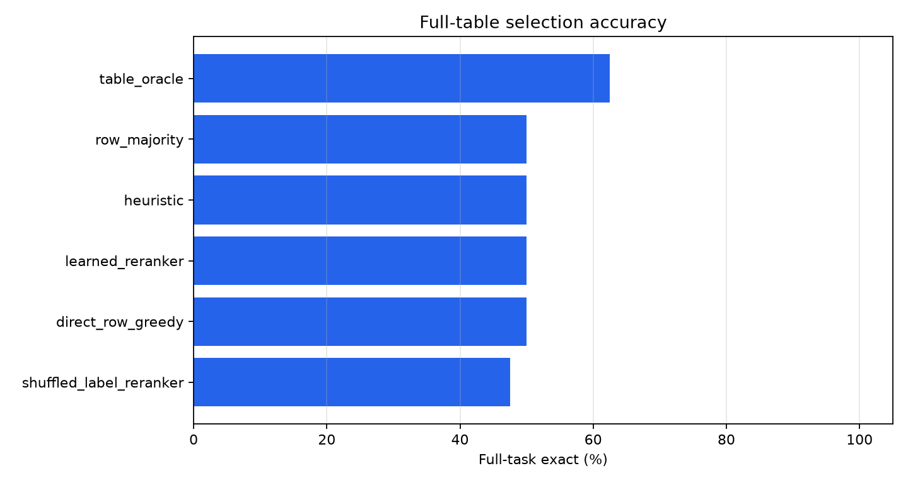
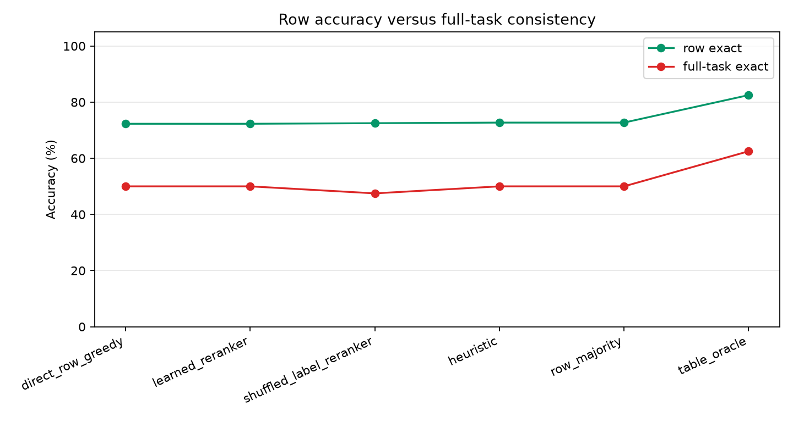
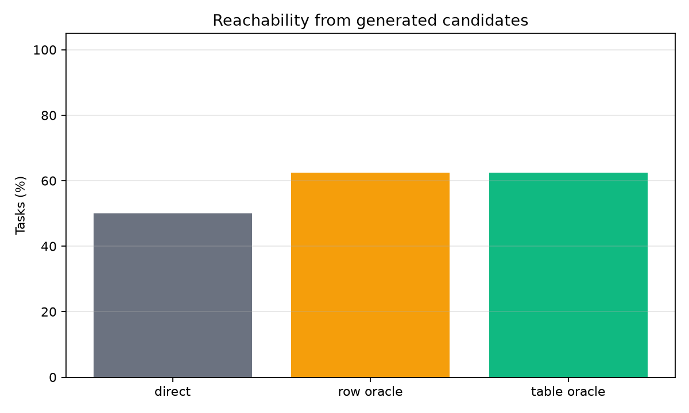
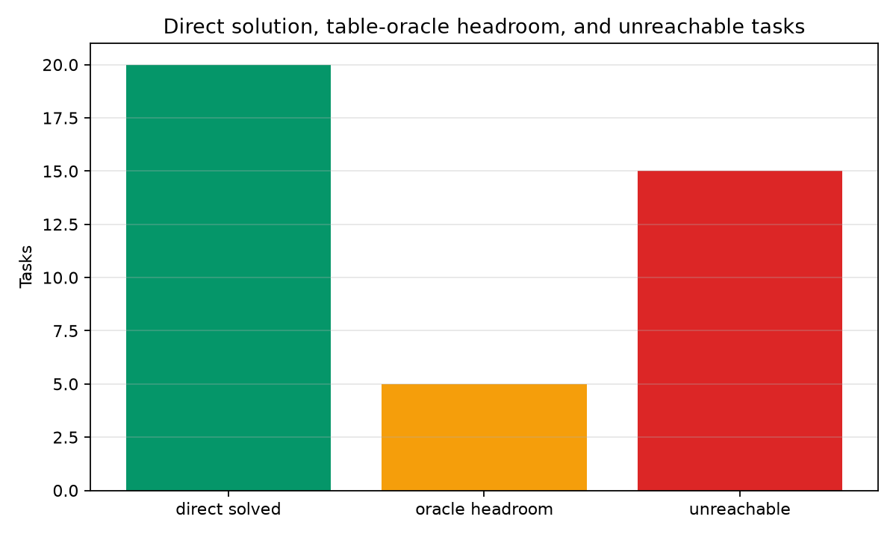
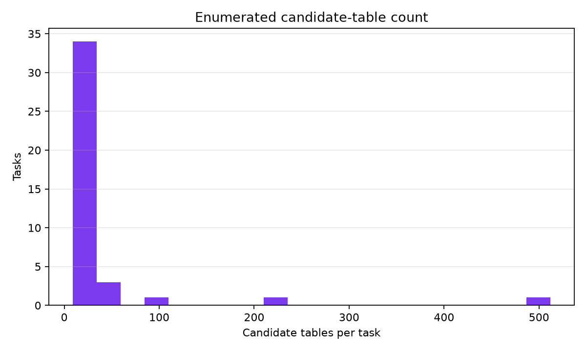
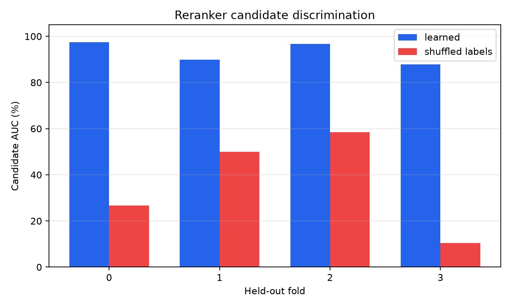
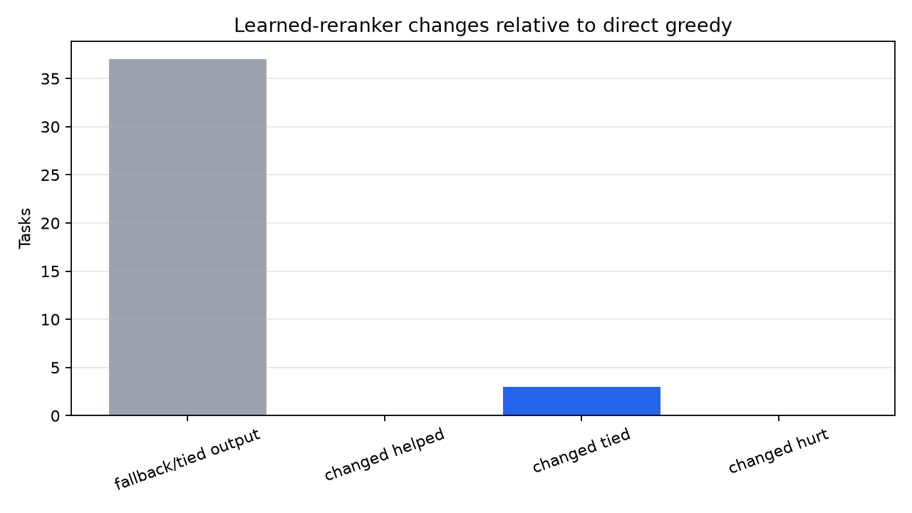
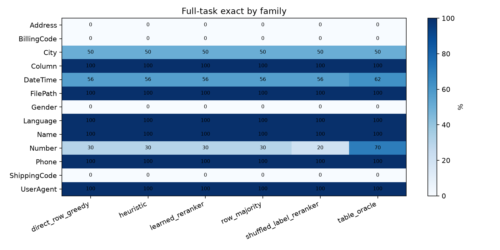

# Full-Table Consistency Reranker

## Question

Can multiple row-level model guesses be converted into task-level consistency by selecting an entire candidate output table?

The experiment generates several candidate outputs for each held-out row, enumerates full-table candidates, and trains a task-held-out consistency scorer to choose one table. The primary metric is strict full-task exactness: every held-out row for a task must be correct.

## Setup

- Benchmark root: `/workspace/large_artifacts/qwen_full_table_consistency_reranker/prose-benchmarks`
- Run: `main_qwen_table_40`
- Tasks: 40
- Train rows per task: 4
- Held-out cap per task: 6
- Row samples per row: 2
- Max candidate tables per task: 512
- Cross-validation folds: 4

## Main Result

|method|tasks|row_exact|full_task_exact|table_oracle_rate|row_oracle_rate|median_candidate_tables|
|---|---|---|---|---|---|---|
|table_oracle|40|82.5%|62.5%|62.5%|62.5%|9.50|
|direct_row_greedy|40|72.3%|50.0%|62.5%|62.5%|9.50|
|heuristic|40|72.7%|50.0%|62.5%|62.5%|9.50|
|learned_reranker|40|72.3%|50.0%|62.5%|62.5%|9.50|
|row_majority|40|72.7%|50.0%|62.5%|62.5%|9.50|
|shuffled_label_reranker|40|72.5%|47.5%|62.5%|62.5%|9.50|

## Interpretation

The generated row-candidate sets make the exact table reachable on 62.5% of tasks after enumeration, while the per-row oracle is 62.5%. The learned reranker changes full-task exact by 0.0 points relative to direct greedy row inference. The learned reranker is separated from the shuffled-label control by 2.5 points. Mean candidate-level AUC is 92.9% versus 36.4% for shuffled labels, but that discrimination does not translate into task-level headroom capture.

If oracle reachability is high but the learned reranker does not improve over direct row inference, the bottleneck is table selection. If oracle reachability is low, the bottleneck is generation diversity.

## Diagnostic Findings

- Direct greedy solves 20 of 40 tasks.
- The table oracle solves 25 of 40 tasks, leaving 5 tasks of reachable headroom beyond direct greedy.
- The learned reranker solves 20 of 40 tasks and captures 0 of the 5 reachable-headroom tasks.
- The learned reranker changes the selected output table on 3 tasks: 0 helped, 3 tied, and 0 hurt on strict full-task exactness.

## Charts

## Fold Diagnostics

|fold|train_tasks|test_tasks|train_candidates|test_candidates|train_positive_rate|test_positive_rate|candidate_auc|shuffled_candidate_auc|
|---|---|---|---|---|---|---|---|---|
|0|30|10|750|620|15.7%|9.2%|97.4%|26.7%|
|1|30|10|1258|112|9.6%|48.2%|89.8%|50.0%|
|2|30|10|1210|160|11.7%|20.6%|96.7%|58.5%|
|3|30|10|892|478|16.1%|6.5%|87.9%|10.5%|

## Family Breakdown

|method|family|tasks|row_exact|full_task_exact|
|---|---|---|---|---|
|direct_row_greedy|Address|2|50.0%|0.0%|
|direct_row_greedy|BillingCode|1|33.3%|0.0%|
|direct_row_greedy|City|2|87.5%|50.0%|
|direct_row_greedy|Column|1|100.0%|100.0%|
|direct_row_greedy|DateTime|16|72.9%|56.2%|
|direct_row_greedy|FilePath|1|100.0%|100.0%|
|direct_row_greedy|Gender|1|66.7%|0.0%|
|direct_row_greedy|Language|1|100.0%|100.0%|
|direct_row_greedy|Name|1|100.0%|100.0%|
|direct_row_greedy|Number|10|61.7%|30.0%|
|direct_row_greedy|Phone|2|100.0%|100.0%|
|direct_row_greedy|ShippingCode|1|33.3%|0.0%|
|direct_row_greedy|UserAgent|1|100.0%|100.0%|
|heuristic|Address|2|50.0%|0.0%|
|heuristic|BillingCode|1|33.3%|0.0%|
|heuristic|City|2|87.5%|50.0%|
|heuristic|Column|1|100.0%|100.0%|
|heuristic|DateTime|16|74.0%|56.2%|
|heuristic|FilePath|1|100.0%|100.0%|
|heuristic|Gender|1|66.7%|0.0%|
|heuristic|Language|1|100.0%|100.0%|
|heuristic|Name|1|100.0%|100.0%|
|heuristic|Number|10|61.7%|30.0%|
|heuristic|Phone|2|100.0%|100.0%|
|heuristic|ShippingCode|1|33.3%|0.0%|
|heuristic|UserAgent|1|100.0%|100.0%|
|learned_reranker|Address|2|50.0%|0.0%|
|learned_reranker|BillingCode|1|33.3%|0.0%|
|learned_reranker|City|2|87.5%|50.0%|
|learned_reranker|Column|1|100.0%|100.0%|
|learned_reranker|DateTime|16|72.9%|56.2%|
|learned_reranker|FilePath|1|100.0%|100.0%|
|learned_reranker|Gender|1|66.7%|0.0%|
|learned_reranker|Language|1|100.0%|100.0%|
|learned_reranker|Name|1|100.0%|100.0%|
|learned_reranker|Number|10|61.7%|30.0%|
|learned_reranker|Phone|2|100.0%|100.0%|
|learned_reranker|ShippingCode|1|33.3%|0.0%|
|learned_reranker|UserAgent|1|100.0%|100.0%|
|row_majority|Address|2|50.0%|0.0%|
|row_majority|BillingCode|1|33.3%|0.0%|
|row_majority|City|2|87.5%|50.0%|
|row_majority|Column|1|100.0%|100.0%|
|row_majority|DateTime|16|74.0%|56.2%|
|row_majority|FilePath|1|100.0%|100.0%|
|row_majority|Gender|1|66.7%|0.0%|
|row_majority|Language|1|100.0%|100.0%|
|row_majority|Name|1|100.0%|100.0%|
|row_majority|Number|10|61.7%|30.0%|
|row_majority|Phone|2|100.0%|100.0%|
|row_majority|ShippingCode|1|33.3%|0.0%|
|row_majority|UserAgent|1|100.0%|100.0%|
|shuffled_label_reranker|Address|2|50.0%|0.0%|
|shuffled_label_reranker|BillingCode|1|33.3%|0.0%|
|shuffled_label_reranker|City|2|87.5%|50.0%|
|shuffled_label_reranker|Column|1|100.0%|100.0%|
|shuffled_label_reranker|DateTime|16|72.9%|56.2%|
|shuffled_label_reranker|FilePath|1|100.0%|100.0%|
|shuffled_label_reranker|Gender|1|66.7%|0.0%|
|shuffled_label_reranker|Language|1|100.0%|100.0%|
|shuffled_label_reranker|Name|1|100.0%|100.0%|
|shuffled_label_reranker|Number|10|62.5%|20.0%|
|shuffled_label_reranker|Phone|2|100.0%|100.0%|
|shuffled_label_reranker|ShippingCode|1|33.3%|0.0%|
|shuffled_label_reranker|UserAgent|1|100.0%|100.0%|
|table_oracle|Address|2|50.0%|0.0%|
|table_oracle|BillingCode|1|33.3%|0.0%|
|table_oracle|City|2|87.5%|50.0%|
|table_oracle|Column|1|100.0%|100.0%|
|table_oracle|DateTime|16|81.2%|62.5%|
|table_oracle|FilePath|1|100.0%|100.0%|
|table_oracle|Gender|1|66.7%|0.0%|
|table_oracle|Language|1|100.0%|100.0%|
|table_oracle|Name|1|100.0%|100.0%|
|table_oracle|Number|10|89.2%|70.0%|
|table_oracle|Phone|2|100.0%|100.0%|
|table_oracle|ShippingCode|1|33.3%|0.0%|
|table_oracle|UserAgent|1|100.0%|100.0%|

## Task-Level Reachability

|task_id|family|heldout_rows|direct_row_exact|direct_full_exact|row_candidate_oracle|table_candidate_oracle|candidate_tables|row_candidate_median|
|---|---|---|---|---|---|---|---|---|
|City.000011|City|4|75.0%|False|False|False|12|1.50|
|Address.000013|Address|6|66.7%|False|False|False|17|1.00|
|Gender.000001|Gender|3|66.7%|False|False|False|11|1.00|
|Number.000029|Number|3|66.7%|False|False|False|14|2.00|
|DateTime.000027|DateTime|6|50.0%|False|False|False|88|2.00|
|DateTime.000081|DateTime|6|50.0%|False|False|False|14|1.00|
|DateTime.000116|DateTime|6|50.0%|False|False|False|9|1.00|
|Address.000002|Address|3|33.3%|False|False|False|9|1.00|
|BillingCode.000007|BillingCode|3|33.3%|False|False|False|16|2.00|
|DateTime.000051|DateTime|3|33.3%|False|False|False|12|2.00|
|Number.000008|Number|6|33.3%|False|False|False|16|1.50|
|ShippingCode.000008|ShippingCode|3|33.3%|False|False|False|9|1.00|
|DateTime.000114|DateTime|6|16.7%|False|False|False|512|4.00|
|DateTime.000115|DateTime|6|0.0%|False|False|False|9|1.00|
|Number.000049|Number|4|0.0%|False|False|False|56|2.50|
|City.000010|City|3|100.0%|True|True|True|9|1.00|
|Column.000001|Column|6|100.0%|True|True|True|9|1.00|
|DateTime.000004|DateTime|6|100.0%|True|True|True|9|1.00|
|DateTime.000007|DateTime|6|100.0%|True|True|True|9|1.00|
|DateTime.000017|DateTime|6|100.0%|True|True|True|44|2.00|
|DateTime.000025|DateTime|6|100.0%|True|True|True|16|1.50|
|DateTime.000034|DateTime|6|100.0%|True|True|True|9|1.00|
|DateTime.000094|DateTime|4|100.0%|True|True|True|9|1.00|
|DateTime.000104|DateTime|6|100.0%|True|True|True|9|1.00|
|DateTime.000108|DateTime|6|100.0%|True|True|True|9|1.00|
|DateTime.000111|DateTime|6|100.0%|True|True|True|10|1.00|
|FilePath.000001|FilePath|6|100.0%|True|True|True|9|1.00|
|Language.000002|Language|6|100.0%|True|True|True|9|1.00|
|Name.000028|Name|6|100.0%|True|True|True|9|1.00|
|Number.000022|Number|6|100.0%|True|True|True|32|2.00|
|Number.000028|Number|3|100.0%|True|True|True|9|1.00|
|Number.000043|Number|6|100.0%|True|True|True|9|1.00|
|Phone.000008|Phone|6|100.0%|True|True|True|9|1.00|
|Phone.000011|Phone|3|100.0%|True|True|True|9|1.00|
|UserAgent.000003|UserAgent|6|100.0%|True|True|True|9|1.00|
|Number.000016|Number|6|83.3%|False|True|True|40|2.00|
|DateTime.000076|DateTime|6|66.7%|False|True|True|14|1.00|
|Number.000075|Number|6|66.7%|False|True|True|16|1.00|
|Number.000015|Number|6|33.3%|False|True|True|224|2.50|
|Number.000077|Number|3|33.3%|False|True|True|26|3.00|

## Reachable Headroom Tasks

|task_id|family|features|direct_row_exact|direct_full_task_exact|learned_row_exact|learned_full_task_exact|oracle_row_exact|oracle_full_task_exact|learned_source|oracle_source|candidate_tables|
|---|---|---|---|---|---|---|---|---|---|---|---|
|Number.000015|Number|Numeric,NumericRounding|33.3%|False|33.3%|False|100.0%|True|row_combo|row_combo|224|
|Number.000077|Number|Numeric,NumericRounding|33.3%|False|33.3%|False|100.0%|True|row_sample0|row_combo|26|
|DateTime.000076|DateTime|DateTimeRange,DateTimeRounding,DateTime|66.7%|False|66.7%|False|100.0%|True|row_sample0|row_combo|14|
|Number.000075|Number|Concatenation,Numeric|66.7%|False|66.7%|False|100.0%|True|row_sample0|batch_plain|16|
|Number.000016|Number|Numeric,NumericRounding|83.3%|False|83.3%|False|100.0%|True|row_combo|row_combo|40|

## Learned Selection Changes

|task_id|family|direct_row_exact|learned_row_exact|direct_full_task_exact|learned_full_task_exact|learned_source|score|candidate_tables|table_candidate_oracle|
|---|---|---|---|---|---|---|---|---|---|
|Address.000013|Address|66.7%|66.7%|False|False|batch_plain|0.95|17|False|
|DateTime.000027|DateTime|50.0%|33.3%|False|False|row_combo|0.99|88|False|
|DateTime.000114|DateTime|16.7%|33.3%|False|False|row_combo|0.01|512|False|

## Selected Tables

|task_id|method|source|row_exact|full_task_exact|score|candidate_tables|table_candidate_oracle|
|---|---|---|---|---|---|---|---|
|Address.000002|direct_row_greedy|row_greedy|33.3%|False|0.00|9|False|
|Address.000013|direct_row_greedy|row_greedy|66.7%|False|0.00|17|False|
|BillingCode.000007|direct_row_greedy|row_greedy|33.3%|False|0.00|16|False|
|City.000010|direct_row_greedy|row_greedy|100.0%|True|0.00|9|True|
|City.000011|direct_row_greedy|row_greedy|75.0%|False|0.00|12|False|
|Column.000001|direct_row_greedy|row_greedy|100.0%|True|0.00|9|True|
|DateTime.000004|direct_row_greedy|row_greedy|100.0%|True|0.00|9|True|
|DateTime.000007|direct_row_greedy|row_greedy|100.0%|True|0.00|9|True|
|DateTime.000017|direct_row_greedy|row_greedy|100.0%|True|0.00|44|True|
|DateTime.000025|direct_row_greedy|row_greedy|100.0%|True|0.00|16|True|
|DateTime.000027|direct_row_greedy|row_greedy|50.0%|False|0.00|88|False|
|DateTime.000034|direct_row_greedy|row_greedy|100.0%|True|0.00|9|True|
|DateTime.000051|direct_row_greedy|row_greedy|33.3%|False|0.00|12|False|
|DateTime.000076|direct_row_greedy|row_greedy|66.7%|False|0.00|14|True|
|DateTime.000081|direct_row_greedy|row_greedy|50.0%|False|0.00|14|False|
|DateTime.000094|direct_row_greedy|row_greedy|100.0%|True|0.00|9|True|
|DateTime.000104|direct_row_greedy|row_greedy|100.0%|True|0.00|9|True|
|DateTime.000108|direct_row_greedy|row_greedy|100.0%|True|0.00|9|True|
|DateTime.000111|direct_row_greedy|row_greedy|100.0%|True|0.00|10|True|
|DateTime.000114|direct_row_greedy|row_greedy|16.7%|False|0.00|512|False|
|DateTime.000115|direct_row_greedy|row_greedy|0.0%|False|0.00|9|False|
|DateTime.000116|direct_row_greedy|row_greedy|50.0%|False|0.00|9|False|
|FilePath.000001|direct_row_greedy|row_greedy|100.0%|True|0.00|9|True|
|Gender.000001|direct_row_greedy|row_greedy|66.7%|False|0.00|11|False|
|Language.000002|direct_row_greedy|row_greedy|100.0%|True|0.00|9|True|
|Name.000028|direct_row_greedy|row_greedy|100.0%|True|0.00|9|True|
|Number.000008|direct_row_greedy|row_greedy|33.3%|False|0.00|16|False|
|Number.000015|direct_row_greedy|row_greedy|33.3%|False|0.00|224|True|
|Number.000016|direct_row_greedy|row_greedy|83.3%|False|0.00|40|True|
|Number.000022|direct_row_greedy|row_greedy|100.0%|True|0.00|32|True|
|Number.000028|direct_row_greedy|row_greedy|100.0%|True|0.00|9|True|
|Number.000029|direct_row_greedy|row_greedy|66.7%|False|0.00|14|False|
|Number.000043|direct_row_greedy|row_greedy|100.0%|True|0.00|9|True|
|Number.000049|direct_row_greedy|row_greedy|0.0%|False|0.00|56|False|
|Number.000075|direct_row_greedy|row_greedy|66.7%|False|0.00|16|True|
|Number.000077|direct_row_greedy|row_greedy|33.3%|False|0.00|26|True|
|Phone.000008|direct_row_greedy|row_greedy|100.0%|True|0.00|9|True|
|Phone.000011|direct_row_greedy|row_greedy|100.0%|True|0.00|9|True|
|ShippingCode.000008|direct_row_greedy|row_greedy|33.3%|False|0.00|9|False|
|UserAgent.000003|direct_row_greedy|row_greedy|100.0%|True|0.00|9|True|
|Address.000002|heuristic|row_greedy|33.3%|False|1.37|9|False|
|Address.000013|heuristic|row_greedy|66.7%|False|1.65|17|False|
|BillingCode.000007|heuristic|row_greedy|33.3%|False|1.49|16|False|
|City.000010|heuristic|row_greedy|100.0%|True|2.19|9|True|
|City.000011|heuristic|row_greedy|75.0%|False|1.76|12|False|
|Column.000001|heuristic|row_greedy|100.0%|True|2.20|9|True|
|DateTime.000004|heuristic|row_greedy|100.0%|True|2.20|9|True|
|DateTime.000007|heuristic|row_greedy|100.0%|True|2.20|9|True|
|DateTime.000017|heuristic|row_greedy|100.0%|True|1.91|44|True|
|DateTime.000025|heuristic|row_greedy|100.0%|True|2.09|16|True|
|DateTime.000027|heuristic|row_greedy|50.0%|False|1.77|88|False|
|DateTime.000034|heuristic|row_greedy|100.0%|True|2.20|9|True|
|DateTime.000051|heuristic|row_greedy|33.3%|False|2.05|12|False|
|DateTime.000076|heuristic|row_greedy|66.7%|False|2.05|14|True|
|DateTime.000081|heuristic|row_greedy|50.0%|False|2.02|14|False|
|DateTime.000094|heuristic|row_greedy|100.0%|True|2.20|9|True|
|DateTime.000104|heuristic|row_greedy|100.0%|True|3.00|9|True|
|DateTime.000108|heuristic|row_greedy|100.0%|True|2.20|9|True|
|DateTime.000111|heuristic|row_greedy|100.0%|True|2.12|10|True|
|DateTime.000114|heuristic|row_majority|33.3%|False|1.49|512|False|
|DateTime.000115|heuristic|row_greedy|0.0%|False|2.20|9|False|
|DateTime.000116|heuristic|row_greedy|50.0%|False|2.19|9|False|
|FilePath.000001|heuristic|row_greedy|100.0%|True|2.20|9|True|
|Gender.000001|heuristic|row_greedy|66.7%|False|2.06|11|False|
|Language.000002|heuristic|row_greedy|100.0%|True|3.00|9|True|
|Name.000028|heuristic|row_greedy|100.0%|True|2.99|9|True|
|Number.000008|heuristic|row_greedy|33.3%|False|1.34|16|False|
|Number.000015|heuristic|row_greedy|33.3%|False|1.12|224|True|
|Number.000016|heuristic|row_greedy|83.3%|False|1.91|40|True|
|Number.000022|heuristic|row_greedy|100.0%|True|1.87|32|True|
|Number.000028|heuristic|row_greedy|100.0%|True|2.19|9|True|
|Number.000029|heuristic|row_greedy|66.7%|False|1.90|14|False|
|Number.000043|heuristic|row_greedy|100.0%|True|2.20|9|True|
|Number.000049|heuristic|row_greedy|0.0%|False|1.76|56|False|
|Number.000075|heuristic|row_greedy|66.7%|False|1.99|16|True|
|Number.000077|heuristic|row_greedy|33.3%|False|1.69|26|True|
|Phone.000008|heuristic|row_greedy|100.0%|True|2.20|9|True|
|Phone.000011|heuristic|row_greedy|100.0%|True|2.20|9|True|
|ShippingCode.000008|heuristic|row_greedy|33.3%|False|1.66|9|False|
|UserAgent.000003|heuristic|row_greedy|100.0%|True|1.52|9|True|
|Address.000002|learned_reranker|batch_plain|33.3%|False|1.00|9|False|
|Address.000013|learned_reranker|batch_plain|66.7%|False|0.95|17|False|
|BillingCode.000007|learned_reranker|row_combo|33.3%|False|0.00|16|False|
|City.000010|learned_reranker|batch_plain|100.0%|True|1.00|9|True|
|City.000011|learned_reranker|row_combo|75.0%|False|0.00|12|False|
|Column.000001|learned_reranker|batch_plain|100.0%|True|0.96|9|True|
|DateTime.000004|learned_reranker|row_sample0|100.0%|True|0.99|9|True|
|DateTime.000007|learned_reranker|row_sample0|100.0%|True|0.99|9|True|
|DateTime.000017|learned_reranker|row_combo|100.0%|True|0.89|44|True|
|DateTime.000025|learned_reranker|batch_plain|100.0%|True|0.97|16|True|
|DateTime.000027|learned_reranker|row_combo|33.3%|False|0.99|88|False|
|DateTime.000034|learned_reranker|batch_plain|100.0%|True|0.99|9|True|
|DateTime.000051|learned_reranker|row_sample0|33.3%|False|0.42|12|False|
|DateTime.000076|learned_reranker|row_sample0|66.7%|False|0.86|14|True|
|DateTime.000081|learned_reranker|row_sample0|50.0%|False|0.47|14|False|
|DateTime.000094|learned_reranker|row_combo|100.0%|True|0.81|9|True|
|DateTime.000104|learned_reranker|batch_plain|100.0%|True|1.00|9|True|
|DateTime.000108|learned_reranker|row_sample0|100.0%|True|0.98|9|True|
|DateTime.000111|learned_reranker|row_sample0|100.0%|True|0.98|10|True|
|DateTime.000114|learned_reranker|row_combo|33.3%|False|0.01|512|False|
|DateTime.000115|learned_reranker|batch_plain|0.0%|False|0.82|9|False|
|DateTime.000116|learned_reranker|row_combo|50.0%|False|1.00|9|False|
|FilePath.000001|learned_reranker|row_sample0|100.0%|True|0.95|9|True|
|Gender.000001|learned_reranker|row_combo|66.7%|False|0.02|11|False|
|Language.000002|learned_reranker|batch_plain|100.0%|True|1.00|9|True|
|Name.000028|learned_reranker|row_sample0|100.0%|True|1.00|9|True|
|Number.000008|learned_reranker|row_sample1|33.3%|False|0.08|16|False|
|Number.000015|learned_reranker|row_combo|33.3%|False|0.03|224|True|
|Number.000016|learned_reranker|row_combo|83.3%|False|0.71|40|True|
|Number.000022|learned_reranker|row_combo|100.0%|True|0.90|32|True|
|Number.000028|learned_reranker|batch_plain|100.0%|True|0.92|9|True|
|Number.000029|learned_reranker|batch_json|66.7%|False|0.87|14|False|
|Number.000043|learned_reranker|batch_plain|100.0%|True|0.98|9|True|
|Number.000049|learned_reranker|batch_json|0.0%|False|0.69|56|False|
|Number.000075|learned_reranker|row_sample0|66.7%|False|0.16|16|True|
|Number.000077|learned_reranker|row_sample0|33.3%|False|0.14|26|True|
|Phone.000008|learned_reranker|batch_plain|100.0%|True|1.00|9|True|
|Phone.000011|learned_reranker|row_combo|100.0%|True|0.36|9|True|
|ShippingCode.000008|learned_reranker|batch_plain|33.3%|False|0.80|9|False|
|UserAgent.000003|learned_reranker|row_sample0|100.0%|True|0.10|9|True|

## Files

- `runs/main_qwen_table_40/row_candidates.csv`
- `runs/main_qwen_table_40/table_candidates.csv`
- `runs/main_qwen_table_40/selected_tables.csv`
- `runs/main_qwen_table_40/oracle_summary.csv`
- `runs/main_qwen_table_40/fold_diagnostics.csv`
- `analysis/summary.csv`
- `analysis/family_summary.csv`
- `analysis/selected_tables.csv`
- `analysis/oracle_summary.csv`
