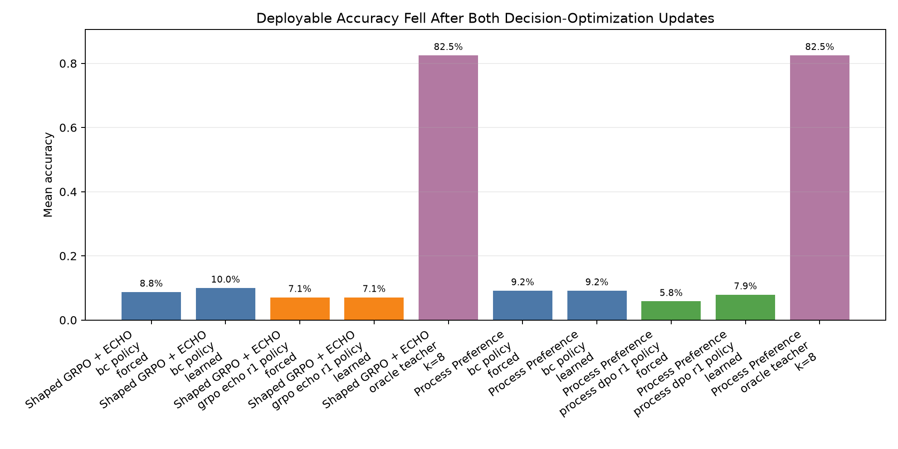
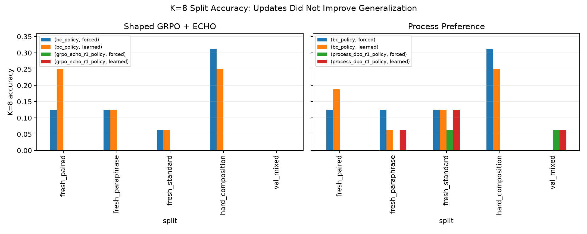
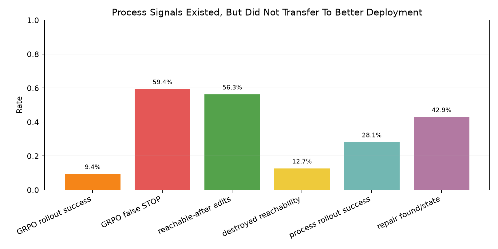
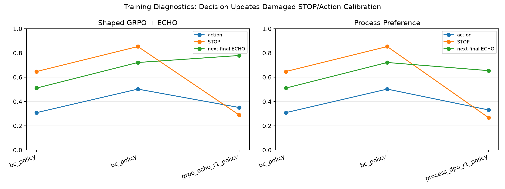

# Qwen Fuyu VM GRPO-ECHO Report

## Summary

This standalone experiment tested whether a Qwen 4B controller can improve a
typed bytecode VM policy when every VM step is one full-model pass over prompt
tokens plus dense VM-state embeddings. The policy never emits natural-language
action tokens. It emits direct structured action/value/ECHO heads only.

The experiment did not pass the scale-up gate. Both decision-optimization arms
created useful-looking process signals, but both reduced deployable accuracy
relative to the behavior-cloned policy. The main failure was not lack of reward
signal; it was that decision updates disturbed action/STOP calibration and
produced worse VM edit trajectories.

## What Ran

- Base model: `Qwen/Qwen3-4B` loaded with 4-bit QLoRA adapters.
- Interface: prompt token embeddings concatenated with dense VM-state tokens via
  `inputs_embeds`; structured heads predicted `STOP`, opcode edits, argument
  edits, solved value, distance, and next-observation ECHO targets.
- Training data per pilot: 32 synthetic train tasks, 16 examples per evaluation
  split, 2 BC epochs, then one decision-optimization round.
- Large checkpoints: `/workspace/large_artifacts/qwen_fuyu_vm_grpo_echo/checkpoints/`.

## Headline Metrics

| arm | phase | mode | mean_accuracy | k8_accuracy | false_stop_rate | mean_steps |
| --- | --- | --- | --- | --- | --- | --- |
| Shaped GRPO + ECHO | bc_policy | forced | 8.8% | 12.5% | 0.0% | 4.00 |
| Shaped GRPO + ECHO | bc_policy | learned | 10.0% | 13.8% | 8.3% | 3.53 |
| Shaped GRPO + ECHO | bc_policy | value_gated | 8.3% | 11.2% | 4.6% | 3.89 |
| Shaped GRPO + ECHO | grpo_echo_r1_policy | forced | 7.1% | 0.0% | 0.0% | 4.00 |
| Shaped GRPO + ECHO | grpo_echo_r1_policy | learned | 7.1% | 0.0% | 4.2% | 3.92 |
| Shaped GRPO + ECHO | grpo_echo_r1_policy | value_gated | 7.1% | 0.0% | 0.0% | 4.00 |
| Shaped GRPO + ECHO | oracle_teacher | k=8 | 82.5% | 82.5% | 0.0% | 5.19 |
| Process Preference | bc_policy | forced | 9.2% | 13.8% | 0.0% | 4.00 |
| Process Preference | bc_policy | learned | 9.2% | 12.5% | 7.1% | 3.60 |
| Process Preference | process_dpo_r1_policy | forced | 5.8% | 2.5% | 0.0% | 4.00 |
| Process Preference | process_dpo_r1_policy | learned | 7.9% | 5.0% | 14.2% | 3.33 |
| Process Preference | oracle_teacher | k=8 | 82.5% | 82.5% | 0.0% | 5.19 |

## Process Signals

The shaped-GRPO arm produced nonzero rollout reward variance and measurable
reachability signal. The process-preference arm produced many on-policy repair
labels and an 80% pairwise ranking accuracy during training. Neither translated
into better deployment.

| arm | states | success/reachability | failure signal |
| --- | --- | --- | --- |
| Shaped GRPO + ECHO | 605 | 9.4% rollout success; 56.3% reachable-after | 59.4% false STOP; 12.7% destroyed reachability |
| Process Preference | 226 | 28.1% rollout success; 97/226 repair labels | 3.5% false-STOP states; 1098 candidates/state |

## Training Diagnostics

| arm | phase | action_acc | stop_acc | rank_acc | next_final | train_states |
| --- | --- | --- | --- | --- | --- | --- |
| Shaped GRPO + ECHO | bc_policy | 30.8% | 64.7% | 0.0% | 51.1% | 237 |
| Shaped GRPO + ECHO | bc_policy | 50.2% | 85.3% | 0.0% | 72.2% | 237 |
| Shaped GRPO + ECHO | grpo_echo_r1_policy | 35.0% | 28.9% | 0.0% | 77.9% | 842 |
| Process Preference | bc_policy | 30.8% | 64.7% | 0.0% | 51.1% | 237 |
| Process Preference | bc_policy | 50.2% | 85.3% | 0.0% | 72.2% | 237 |
| Process Preference | process_dpo_r1_policy | 33.0% | 26.7% | 80.2% | 65.4% | 463 |

## Interpretation

The dense-state whole-network loop is mechanically viable: Qwen can consume the
VM state as embeddings, predict structured actions, predict next VM observations,
and be trained end to end with QLoRA. The failed gate is the decision update.

Shaped GRPO separated sampled trajectories: first-round sampled rollout success
was 9.4%, reward standard deviation was 0.50, and 56.3% of non-STOP edits
preserved reachability. But after one update, mean learned accuracy fell from
10.0% to 7.1%, and K=8 accuracy collapsed to 0% across the five evaluation
splits in the measured modes. The update reduced false STOP but shifted the
policy toward repeated invalid slot edits.

Process preference had a stronger low-variance teacher: 226 on-policy states,
97 repair-labeled states, and 28.1% rollout success before the update. The
pairwise ranking term reached 80.2% training accuracy. Deployment still fell:
learned mean accuracy went from 9.2% to 7.9%, forced mean accuracy went from
9.2% to 5.8%, and learned false STOP doubled from 7.1% to 14.2%.

## Gate Decision

Do not scale this actor-update recipe. The next serious version should separate
the model's roles:

1. Use Qwen as a value/prior model inside verified beam/search rather than as
   the sole actor.
2. Train process preferences on verifier-labeled states, but evaluate them as
   search heuristics before allowing them to directly mutate the policy.
3. Keep ECHO as an ablation, not a core claim; it learns next-state prediction
   but did not protect decision quality here.
4. Add a shuffled-reward/preference control only after the unshuffled signal
   improves deployment on this small gate.

## Reproduction

Main pilot commands are recoverable from each run's `dataset_manifest.json`.
Primary result directories:

- `runs/pilot_shaped_echo_s32_20260624`
- `runs/pilot_process_dpo_s32_20260624`

