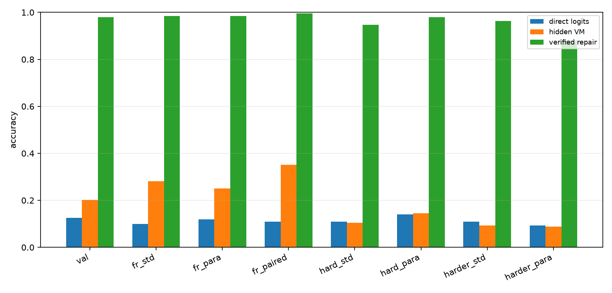
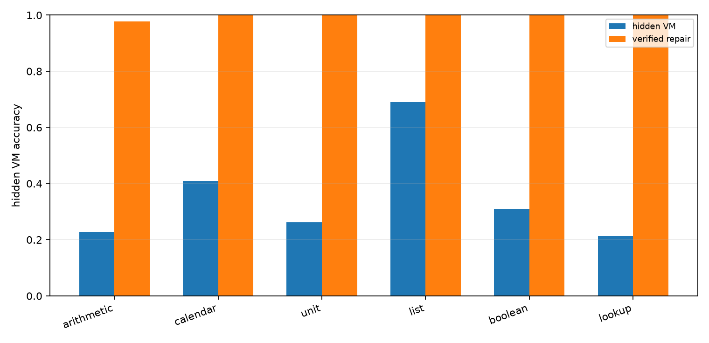
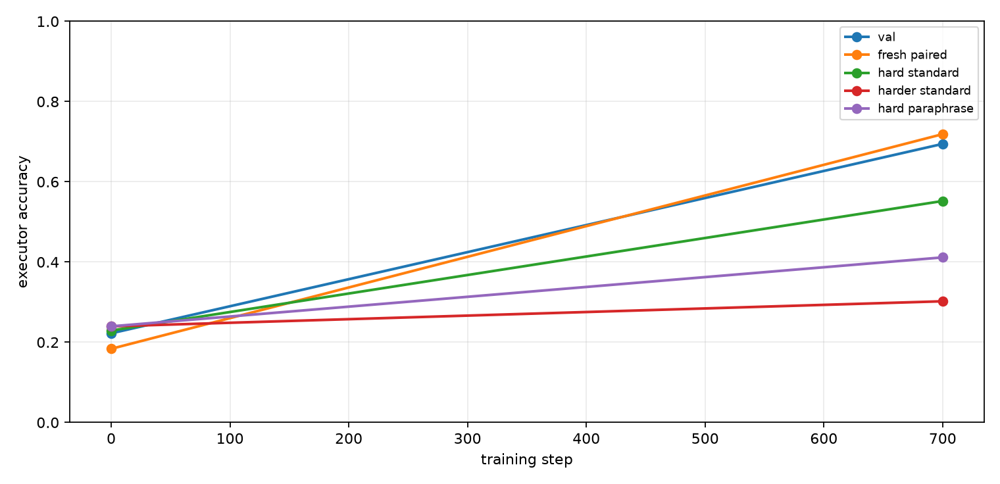
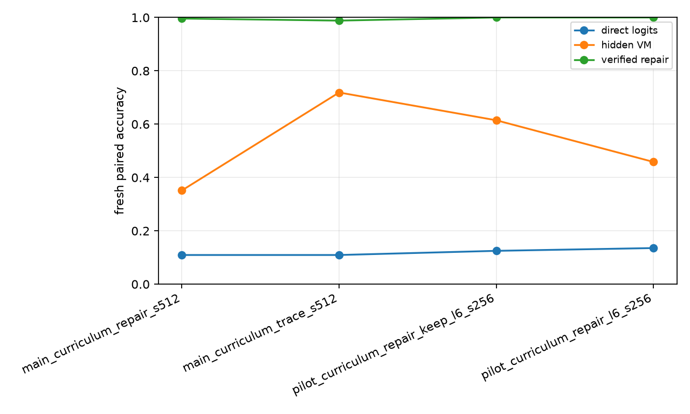

# Qwen Hidden VM Curriculum Repair

## Abstract

This experiment tests whether a Qwen 4B model can learn a more length-robust hidden virtual-machine compiler when posttraining uses a staged length curriculum followed by verifier-guided program repair. The model emits invisible typed VM slots, a deterministic runtime executes those slots, and a local repair pass searches nearby hidden programs that verify against the known answer.

## Setup

- Primary run: `main_curriculum_repair_s512`
- Model: `Qwen/Qwen3-4B`
- Variant: `trace`
- Train examples: `512`
- Train steps: `700`
- Repair steps: `220`
- VM max steps: `10`
- Curriculum schedule: `4:240,6:700`
- Train length range: `1` to `6`
- Eval length: `6`; hard length: `8`; harder length: `10`

The hidden VM uses typed operation slots and copied numeric arguments. Direct logits are the model's next-token numeric answer distribution at the answer marker. Hidden VM accuracy is execution of the compiled invisible program. Repair accuracy is target-aware local search around the compiled program and is reported as a verifier-assisted ceiling, not as a standalone deployable inference path.

## Results

### Final Splits

| Split                   | Direct | Hidden VM | Repair | Program exact | Repair exact | State prefix | Repair found |
| ----------------------- | ------ | --------- | ------ | ------------- | ------------ | ------------ | ------------ |
| val_mixed               | 12.5%  | 20.1%     | 97.9%  | 4.9%          | 36.8%        | 68.1%        | 97.9%        |
| fresh_standard_mixed    | 9.9%   | 28.1%     | 98.4%  | 15.6%         | 48.4%        | 72.7%        | 98.4%        |
| fresh_paraphrase_mixed  | 12.0%  | 25.0%     | 98.4%  | 8.9%          | 30.2%        | 64.8%        | 98.4%        |
| fresh_paired_mixed      | 10.9%  | 35.2%     | 99.6%  | 18.0%         | 47.3%        | 72.1%        | 99.6%        |
| hard_standard_mixed     | 10.9%  | 10.4%     | 94.8%  | 0.0%          | 4.7%         | 56.0%        | 94.8%        |
| hard_paraphrase_mixed   | 14.1%  | 14.6%     | 97.9%  | 0.0%          | 2.6%         | 52.0%        | 97.9%        |
| harder_standard_mixed   | 10.9%  | 9.4%      | 96.4%  | 0.0%          | 0.0%         | 44.1%        | 96.4%        |
| harder_paraphrase_mixed | 9.4%   | 8.9%      | 88.0%  | 0.0%          | 0.0%         | 40.6%        | 88.0%        |
| domain_arithmetic       | 0.0%   | 12.5%     | 100.0% | 9.4%          | 50.0%        | 66.7%        | 100.0%       |
| domain_calendar         | 9.4%   | 40.6%     | 100.0% | 31.2%         | 50.0%        | 78.1%        | 100.0%       |
| domain_unit             | 3.1%   | 9.4%      | 100.0% | 6.2%          | 50.0%        | 69.8%        | 100.0%       |
| domain_list             | 3.1%   | 53.1%     | 100.0% | 0.0%          | 6.2%         | 69.3%        | 100.0%       |
| domain_boolean          | 40.6%  | 37.5%     | 100.0% | 21.9%         | 50.0%        | 68.2%        | 100.0%       |
| domain_lookup           | 0.0%   | 12.5%     | 84.4%  | 3.1%          | 18.8%        | 61.5%        | 84.4%        |



### Domain Breakdown

| Domain     | n     | Direct | Hidden VM | Repair |
| ---------- | ----- | ------ | --------- | ------ |
| arithmetic | 44.00 | 0.0%   | 22.7%     | 97.7%  |
| calendar   | 44.00 | 18.2%  | 40.9%     | 100.0% |
| unit       | 42.00 | 0.0%   | 26.2%     | 100.0% |
| list       | 42.00 | 4.8%   | 69.0%     | 100.0% |
| boolean    | 42.00 | 42.9%  | 31.0%     | 100.0% |
| lookup     | 42.00 | 0.0%   | 21.4%     | 100.0% |



### Training Dynamics

Fresh paired hidden VM accuracy moved from 18.4% at initialization to 35.2% after the full treatment. Verified local repair on the same split reaches 99.6%. The matched trace-only control scores 71.9% on fresh paired, 55.2% on hard length 8, and 30.2% on harder length 10.



### Repair Target Quality

The repair-target pass built 512.00 training targets from 512.00 source examples. Verified repairs were found for 100.0% of source examples, changed-program repairs for 11.3%, with an average of 151.44 local candidates per source example.

### Run Summary

| Run                                  | Variant | Direct | Hidden VM | Repair | Program exact | State prefix |
| ------------------------------------ | ------- | ------ | --------- | ------ | ------------- | ------------ |
| main_curriculum_repair_s512          | trace   | 10.9%  | 35.2%     | 99.6%  | 18.0%         | 72.1%        |
| main_curriculum_trace_s512           | trace   | 10.9%  | 71.9%     | 98.8%  | 55.9%         | 77.3%        |
| pilot_curriculum_repair_keep_l6_s256 | trace   | 12.5%  | 61.5%     | 100.0% | 45.8%         | 70.8%        |
| pilot_curriculum_repair_l6_s256      | trace   | 13.5%  | 45.8%     | 100.0% | 18.8%         | 55.0%        |



## Interpretation

The primary measurement is fresh paired mixed-domain accuracy. Direct logits score 10.9%, while the repair-distilled hidden VM scores 35.2% (+24.2 pp). The matched trace-only curriculum control scores 71.9%, so the repair-distillation treatment changes fresh paired accuracy by -36.7 pp. Verified local repair scores 99.6%, showing that nearby executable headroom remains high even when the argmax compiler is poor.

Program-exact accuracy after repair distillation is 18.0% and state-prefix accuracy is 72.1%. The trace-only control is the best deployable model in this experiment, not the repair-distilled treatment. The repair target pass found verified targets for 100.0% of source examples, but only 11.3% were changed-program repairs; the subsequent no-selection repair phase moved the compiler away from its stable token-local policy.

The hard-length splits are the decisive stress test. The trace-only control trains up to length 6 and reaches 55.2% at length 8 and 30.2% at length 10. The repair-distilled run falls to 10.4% and 9.4% on those same splits.

## Decision

This experiment should be read as a split result. The length curriculum is useful and should be retained. Target-aware local repair is also highly informative: it shows that the model's top-k neighborhood usually contains a correct executable program. The failed part is naive repair distillation from final-answer-verified programs. The next experiment should not simply add more repair steps; it should either distill canonical traces selected by a state-aware verifier, or train a verifier/reranker for inference-time candidate selection before trying to fold repairs back into the compiler.

## Limitations

- The domains are synthetic and deterministic.
- Answers are integers in a bounded value vocabulary.
- Trace supervision supplies exact hidden programs during the curriculum phase.
- Repair accuracy is target-aware and should be read as verifier-assisted headroom.
- The runtime is fixed and hand-designed.
- This is one primary run unless additional runs are added.

## Artifacts

Small experiment files live in:

```text
experiments/qwen_hidden_vm_curriculum_repair/
```

Large artifacts live in:

```text
large_artifacts/qwen_hidden_vm_curriculum_repair/checkpoints/
```

Primary files:

- `analysis/summary.md`
- `analysis/final_metrics.csv`
- `analysis/all_final_metrics.csv`
- `analysis/figures/split_accuracy.png`
- `analysis/figures/domain_accuracy.png`
- `analysis/figures/training_curve.png`
- `analysis/figures/run_summary.png`
- `runs/main_curriculum_repair_s512/metrics.csv`
- `runs/main_curriculum_repair_s512/train_log.csv`
- `reports/qwen_hidden_vm_curriculum_repair_paper.md`
- `reports/qwen_hidden_vm_curriculum_repair_paper.html`
- `checkpoint_manifest.csv`
