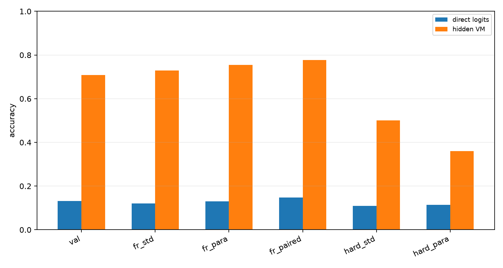
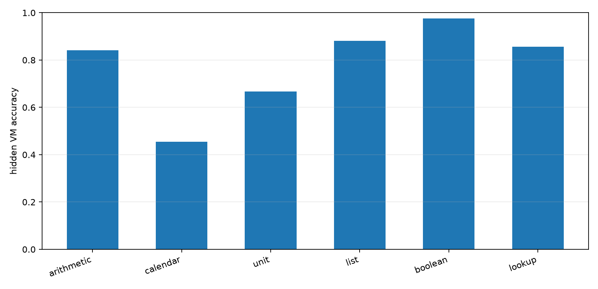
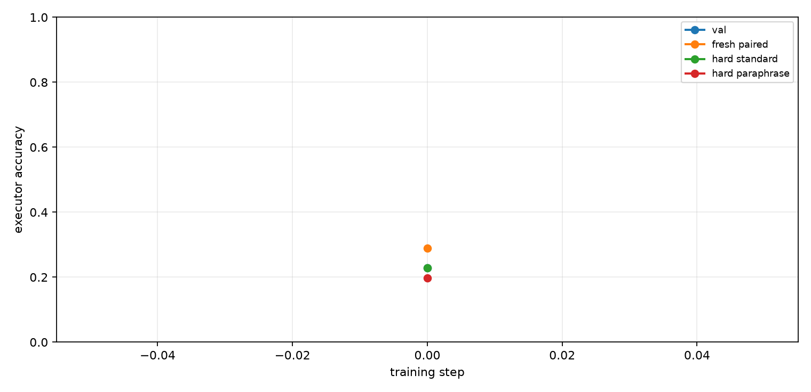
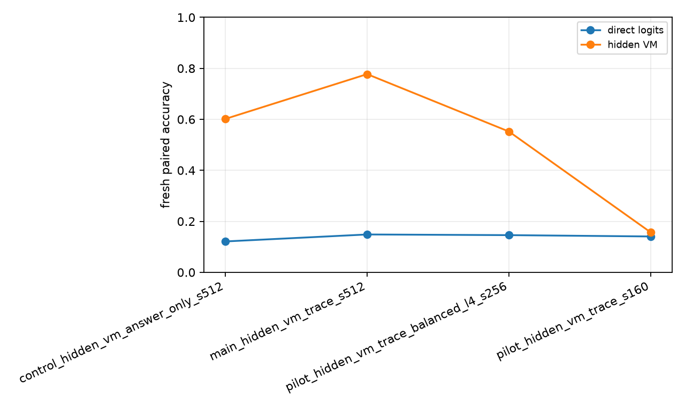

# Qwen Hidden VM Mixed-Domain Compiler

## Abstract

This experiment tests whether a Qwen 4B model can be posttrained to compile several natural-language task families into one hidden typed virtual machine. The model emits invisible VM slots, a deterministic runtime executes those slots, and the final answer is read from the runtime state. The task families are arithmetic chains, calendar shifts, unit-style transforms, list aggregation, boolean thresholding, and lookup/adjust rules.

## Setup

- Primary run: `main_hidden_vm_trace_s512`
- Model: `Qwen/Qwen3-4B`
- Variant: `trace`
- Train examples: `512`
- Train steps: `520`
- VM max steps: `6`
- Train length range: `1` to `4`
- Eval length: `4`; hard length: `6`

The hidden VM uses typed operation slots and copied numeric arguments. Direct logits are the model's next-token numeric answer distribution at the answer marker; hidden VM accuracy is execution of the compiled invisible program.

## Results

### Final Splits

| Split                  | Direct | Hidden VM | Program exact | State prefix | Pair both-correct |
| ---------------------- | ------ | --------- | ------------- | ------------ | ----------------- |
| val_mixed              | 13.2%  | 70.8%     | 63.9%         | 81.8%        | n/a               |
| fresh_standard_mixed   | 12.0%  | 72.9%     | 62.5%         | 79.4%        | n/a               |
| fresh_paraphrase_mixed | 13.0%  | 75.5%     | 63.5%         | 81.4%        | n/a               |
| fresh_paired_mixed     | 14.8%  | 77.7%     | 63.7%         | 81.0%        | 68.8%             |
| hard_standard_mixed    | 10.9%  | 50.0%     | 33.3%         | 68.6%        | n/a               |
| hard_paraphrase_mixed  | 11.5%  | 35.9%     | 19.3%         | 64.9%        | n/a               |
| domain_arithmetic      | 0.0%   | 65.6%     | 65.6%         | 80.5%        | n/a               |
| domain_calendar        | 28.1%  | 56.2%     | 56.2%         | 78.9%        | n/a               |
| domain_unit            | 3.1%   | 71.9%     | 71.9%         | 83.6%        | n/a               |
| domain_list            | 3.1%   | 71.9%     | 43.8%         | 80.5%        | n/a               |
| domain_boolean         | 46.9%  | 90.6%     | 81.2%         | 86.7%        | n/a               |
| domain_lookup          | 0.0%   | 87.5%     | 68.8%         | 79.7%        | n/a               |



### Domain Breakdown

| Domain     | n     | Direct | Hidden VM |
| ---------- | ----- | ------ | --------- |
| arithmetic | 44.00 | 4.5%   | 84.1%     |
| calendar   | 44.00 | 22.7%  | 45.5%     |
| unit       | 42.00 | 0.0%   | 66.7%     |
| list       | 42.00 | 0.0%   | 88.1%     |
| boolean    | 42.00 | 61.9%  | 97.6%     |
| lookup     | 42.00 | 0.0%   | 85.7%     |



### Training Dynamics

Fresh paired hidden VM accuracy moved from 28.9% at initialization to 77.7% after training. Hard standard accuracy at length 6 was 50.0%.



### Run Summary

| Run                                    | Variant     | Direct | Hidden VM | Program exact | State prefix |
| -------------------------------------- | ----------- | ------ | --------- | ------------- | ------------ |
| control_hidden_vm_answer_only_s512     | answer_only | 12.1%  | 60.2%     | 34.4%         | 58.1%        |
| main_hidden_vm_trace_s512              | trace       | 14.8%  | 77.7%     | 63.7%         | 81.0%        |
| pilot_hidden_vm_trace_balanced_l4_s256 | trace       | 14.6%  | 55.2%     | 49.0%         | 70.6%        |
| pilot_hidden_vm_trace_s160             | trace       | 14.1%  | 15.6%     | 7.8%          | 41.4%        |



## Interpretation

The primary measurement is fresh paired mixed-domain accuracy. Direct logits score 14.8%, while the trace-supervised hidden VM scores 77.7% (+62.9 pp). The matched answer-only hidden-VM control scores 60.2%, so trace supervision adds +17.6 pp over the same executable architecture trained only from final answers.

The control is important: final-answer gradients alone do learn a useful latent executor, but the trace run recovers substantially cleaner programs. Program-exact accuracy is 63.7% for the trace run versus 34.4% for answer-only, and state-prefix accuracy is 81.0% versus 58.1%. That gap matters because the end goal is not just to fit short synthetic answers; it is to make the model reliably write an inspectable executable representation.

The hard-length split is the caution flag. The trace run reaches 50.0% on length-6 standard prompts after training on length 1-4 programs, but paraphrased length-6 accuracy is only 35.9%. The learned compiler transfers beyond the training length, but it is not yet a length-general algorithm.

## Decision

This is a positive result for the Qwen-attached direction. A small posttraining run attached a fixed executable substrate to Qwen 3 4B and produced a large improvement over direct next-token answering on fresh symbolic tasks. It does not demonstrate a universal intelligence multiplier, but it does identify a credible mechanism: train the model to compile prompts into a hidden executable intermediate representation, then let a deterministic runtime carry the exact computation.

The highest-impact next experiments are:

1. **Hard-length curriculum and repair.** Train on lengths 1-6, evaluate on 8-10, and add a verifier-driven repair pass where Qwen edits only the hidden program after failed execution. This directly attacks the remaining length-generalization weakness.
2. **Real-task trace distillation.** Build VM traces from tool-verifiable word problems, date arithmetic, unit conversions, table lookup, and small algorithmic tasks, then train the same compiler/runtime interface on natural data rather than synthetic templates.
3. **Policy-gradient fine-tuning after trace warm start.** Treat VM program emission as the action, deterministic execution as the environment transition, and answer verification as reward. Use trace training to initialize the policy, then optimize with a small KL-controlled RL phase to test whether the model can discover shorter or more robust programs than the teacher traces.
4. **Wider residual attachment.** Keep the fixed VM, but feed execution states back into upper-layer Qwen residual streams before answer generation. This tests whether executable latent state can improve ordinary language outputs instead of only producing bounded integer answers.

## Limitations

- The domains are synthetic and deterministic.
- Answers are integers in a bounded value vocabulary.
- Trace supervision supplies exact hidden programs.
- The runtime is fixed and hand-designed.
- This is one primary run unless additional runs are added.

## Artifacts

Small experiment files live in:

```text
experiments/qwen_hidden_vm_mixed_domains/
```

Large artifacts live in:

```text
large_artifacts/qwen_hidden_vm_mixed_domains/checkpoints/
```

Primary files:

- `analysis/summary.md`
- `analysis/final_metrics.csv`
- `analysis/all_final_metrics.csv`
- `analysis/figures/split_accuracy.png`
- `analysis/figures/domain_accuracy.png`
- `analysis/figures/training_curve.png`
- `analysis/figures/run_summary.png`
- `runs/main_hidden_vm_trace_s512/metrics.csv`
- `runs/main_hidden_vm_trace_s512/train_log.csv`
- `reports/qwen_hidden_vm_mixed_domains_paper.md`
- `reports/qwen_hidden_vm_mixed_domains_paper.html`
- `checkpoint_manifest.csv`
