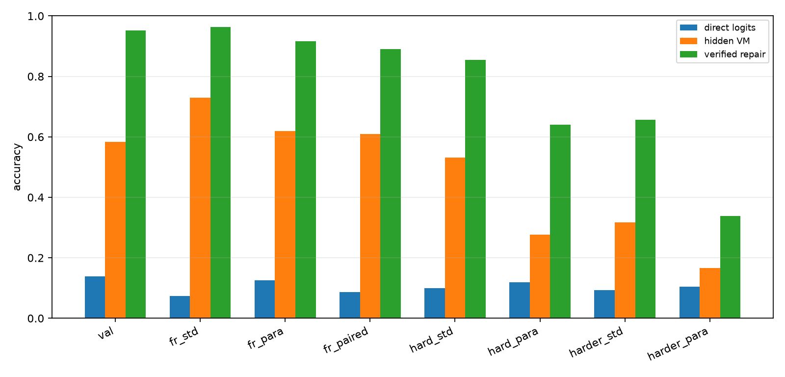
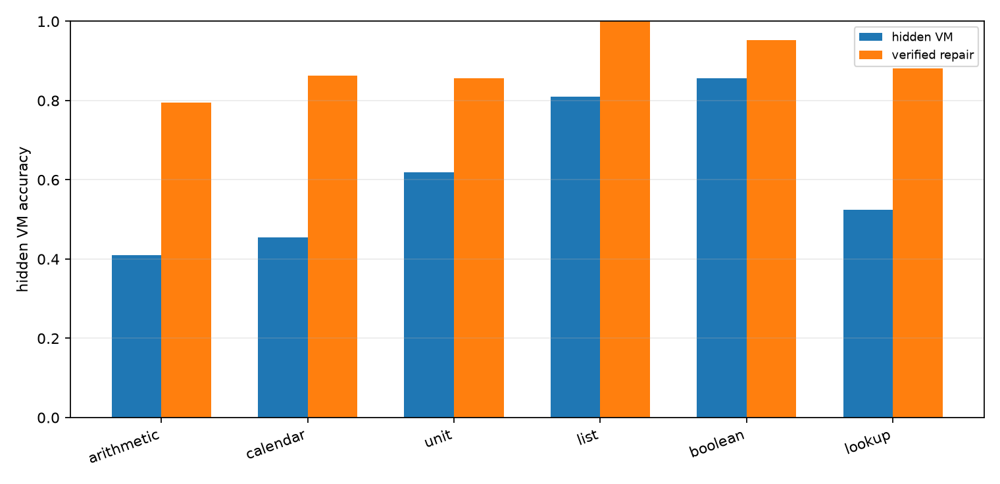
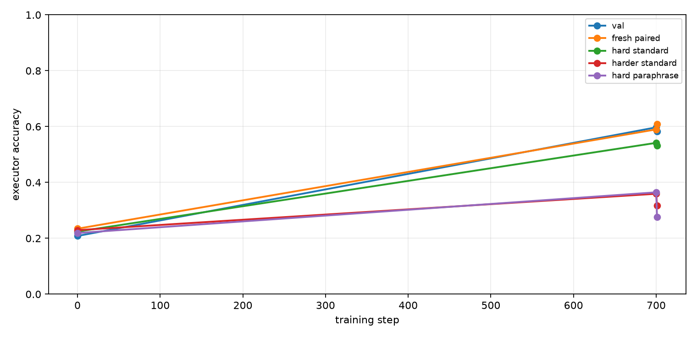
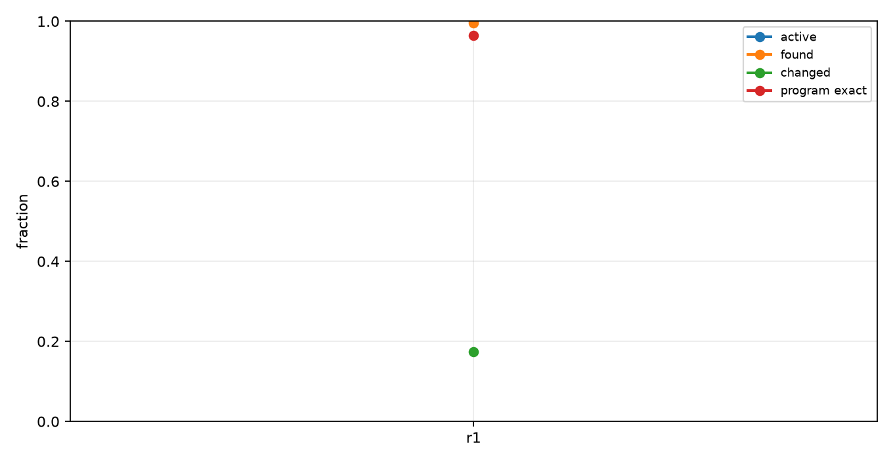
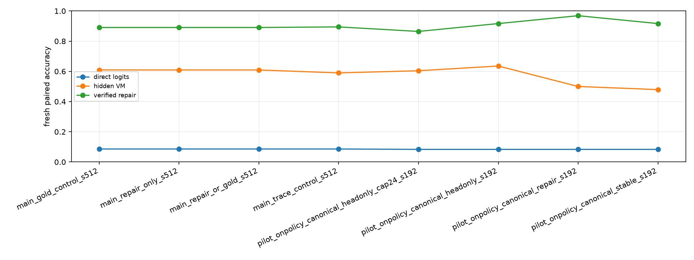

# Qwen Hidden VM On-Policy Canonical Repair

## Abstract

This experiment tests whether a Qwen 4B model can improve a hidden virtual-machine compiler by training on canonical on-policy repair targets. The model emits invisible typed VM slots, a deterministic runtime executes those slots, and local candidate repairs are accepted only when their full intermediate state trajectory matches the canonical trajectory.

## Setup

- Primary run: `main_repair_or_gold_s512`
- Model: `Qwen/Qwen3-4B`
- Variant: `trace`
- Train examples: `512`
- Train steps: `700`
- On-policy rounds: `1`
- Epochs per round: `1`
- Target mode: `repair_or_gold`
- Repair verifier mode: `state`
- VM max steps: `10`
- Curriculum schedule: `4:240,6:700`
- Train length range: `1` to `6`
- Eval length: `6`; hard length: `8`; harder length: `10`

The hidden VM uses typed operation slots and copied numeric arguments. Direct logits are the model's next-token numeric answer distribution at the answer marker. Hidden VM accuracy is execution of the compiled invisible program. Repair accuracy is target-aware state-verified local search around the compiled program and is reported as a headroom measurement, not as a deployable inference path.

## Results

### Final Splits

| Split                   | Direct | Hidden VM | Repair | Program exact | Repair exact | State prefix | Repair found |
| ----------------------- | ------ | --------- | ------ | ------------- | ------------ | ------------ | ------------ |
| val_mixed               | 13.9%  | 58.3%     | 95.1%  | 41.7%         | 83.3%        | 70.8%        | 93.1%        |
| fresh_standard_mixed    | 7.3%   | 72.9%     | 96.4%  | 56.8%         | 87.5%        | 76.3%        | 94.8%        |
| fresh_paraphrase_mixed  | 12.5%  | 62.0%     | 91.7%  | 46.9%         | 80.7%        | 74.5%        | 90.1%        |
| fresh_paired_mixed      | 8.6%   | 60.9%     | 89.1%  | 44.5%         | 73.4%        | 72.8%        | 88.3%        |
| hard_standard_mixed     | 9.9%   | 53.1%     | 85.4%  | 32.3%         | 64.1%        | 67.5%        | 83.9%        |
| hard_paraphrase_mixed   | 12.0%  | 27.6%     | 64.1%  | 8.3%          | 39.6%        | 60.5%        | 61.5%        |
| harder_standard_mixed   | 9.4%   | 31.8%     | 65.6%  | 11.5%         | 39.6%        | 60.7%        | 60.4%        |
| harder_paraphrase_mixed | 10.4%  | 16.7%     | 33.9%  | 2.1%          | 10.9%        | 49.9%        | 26.0%        |
| domain_arithmetic       | 3.1%   | 34.4%     | 90.6%  | 34.4%         | 90.6%        | 62.5%        | 90.6%        |
| domain_calendar         | 12.5%  | 46.9%     | 100.0% | 37.5%         | 75.0%        | 72.4%        | 100.0%       |
| domain_unit             | 0.0%   | 37.5%     | 84.4%  | 37.5%         | 84.4%        | 66.7%        | 84.4%        |
| domain_list             | 0.0%   | 81.2%     | 93.8%  | 46.9%         | 53.1%        | 82.8%        | 90.6%        |
| domain_boolean          | 46.9%  | 93.8%     | 100.0% | 53.1%         | 93.8%        | 72.9%        | 96.9%        |
| domain_lookup           | 0.0%   | 71.9%     | 93.8%  | 43.8%         | 62.5%        | 71.4%        | 90.6%        |



### Domain Breakdown

| Domain     | n     | Direct | Hidden VM | Repair |
| ---------- | ----- | ------ | --------- | ------ |
| arithmetic | 44.00 | 0.0%   | 40.9%     | 79.5%  |
| calendar   | 44.00 | 4.5%   | 45.5%     | 86.4%  |
| unit       | 42.00 | 0.0%   | 61.9%     | 85.7%  |
| list       | 42.00 | 2.4%   | 81.0%     | 100.0% |
| boolean    | 42.00 | 45.2%  | 85.7%     | 95.2%  |
| lookup     | 42.00 | 0.0%   | 52.4%     | 88.1%  |



### Training Dynamics

Fresh paired hidden VM accuracy moved from 23.4% at initialization to 60.9% after the full treatment. State-verified local repair on the same split reaches 89.1%. The trace-only control scores 59.0% on fresh paired, 54.2% on hard length 8, and 35.9% on harder length 10.



### On-Policy Target Quality

The final target pass used 512.00 source examples. Active rows were 100.0%; canonical repairs were found for 99.6%; changed-program repairs were 17.4%; program-exact repaired targets were 96.5%; average local candidates were 152.59.



### Run Summary

| Run                                          | Variant | Direct | Hidden VM | Repair | Program exact | State prefix |
| -------------------------------------------- | ------- | ------ | --------- | ------ | ------------- | ------------ |
| main_gold_control_s512                       | trace   | 8.6%   | 60.9%     | 89.1%  | 44.5%         | 72.8%        |
| main_repair_only_s512                        | trace   | 8.6%   | 60.9%     | 89.1%  | 44.5%         | 72.8%        |
| main_repair_or_gold_s512                     | trace   | 8.6%   | 60.9%     | 89.1%  | 44.5%         | 72.8%        |
| main_trace_control_s512                      | trace   | 8.6%   | 59.0%     | 89.5%  | 44.1%         | 71.0%        |
| pilot_onpolicy_canonical_headonly_cap24_s192 | trace   | 8.3%   | 60.4%     | 86.5%  | 42.7%         | 71.0%        |
| pilot_onpolicy_canonical_headonly_s192       | trace   | 8.3%   | 63.5%     | 91.7%  | 46.9%         | 72.0%        |
| pilot_onpolicy_canonical_repair_s192         | trace   | 8.3%   | 50.0%     | 96.9%  | 37.5%         | 69.3%        |
| pilot_onpolicy_canonical_stable_s192         | trace   | 8.3%   | 47.9%     | 91.7%  | 34.4%         | 68.8%        |



## Interpretation

The primary measurement is fresh paired mixed-domain accuracy. Direct logits score 8.6%, while the on-policy canonical-repair hidden VM scores 60.9% (+52.3 pp). The trace-only control scores 59.0%, so the on-policy treatment changes fresh paired accuracy by +2.0 pp. State-verified local repair scores 89.1%, measuring how often the current top-k neighborhood contains a canonical executable program.

Program-exact accuracy is 44.5% and state-prefix accuracy is 72.8%. The gold-only control scores 60.9% on fresh paired and the repair-only control scores 60.9%; the repair arms therefore do not separate from an extra stabilized gold-trace pass.

The hard-length splits are the decisive stress test. The treatment trains up to length 6 and reaches 53.1% at length 8 and 31.8% at length 10. The trace-only control reaches 54.2% and 35.9% on those same standard hard splits, so the on-policy epoch does not improve length robustness.

## Decision

Canonical on-policy repair should not be scaled in this form. The state verifier produces high-quality targets, but distilling those targets into the compiler gives the same fresh paired result as gold-only training and weakens hard-length robustness relative to the trace-only control. The useful outcome is the headroom measurement: state-verified local search still reaches 89.1% on fresh paired and 85.4% on hard length 8. The next step should keep repair as selection or reranking, or train only on uncertainty-targeted repairs with a much stricter preservation objective.

## Limitations

- The domains are synthetic and deterministic.
- Answers are integers in a bounded value vocabulary.
- Trace supervision supplies exact hidden programs during the curriculum phase.
- Repair accuracy is target-aware and should be read as verifier-assisted headroom.
- Canonical state verification uses synthetic trajectories available in this harness.
- The runtime is fixed and hand-designed.
- Each main arm is one run unless additional seeds are added.

## Artifacts

Small experiment files live in:

```text
experiments/qwen_hidden_vm_onpolicy_canonical_repair/
```

Large artifacts live in:

```text
large_artifacts/qwen_hidden_vm_onpolicy_canonical_repair/checkpoints/
```

Primary files:

- `analysis/summary.md`
- `analysis/final_metrics.csv`
- `analysis/all_final_metrics.csv`
- `analysis/figures/split_accuracy.png`
- `analysis/figures/domain_accuracy.png`
- `analysis/figures/training_curve.png`
- `analysis/figures/target_quality.png`
- `analysis/figures/run_summary.png`
- `runs/main_repair_or_gold_s512/metrics.csv`
- `runs/main_repair_or_gold_s512/train_log.csv`
- `reports/qwen_hidden_vm_onpolicy_canonical_repair_paper.md`
- `reports/qwen_hidden_vm_onpolicy_canonical_repair_paper.html`
- `checkpoint_manifest.csv`
