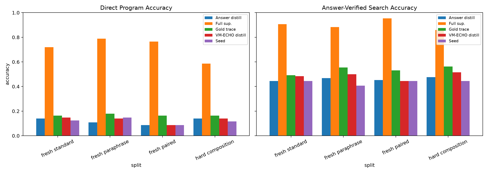
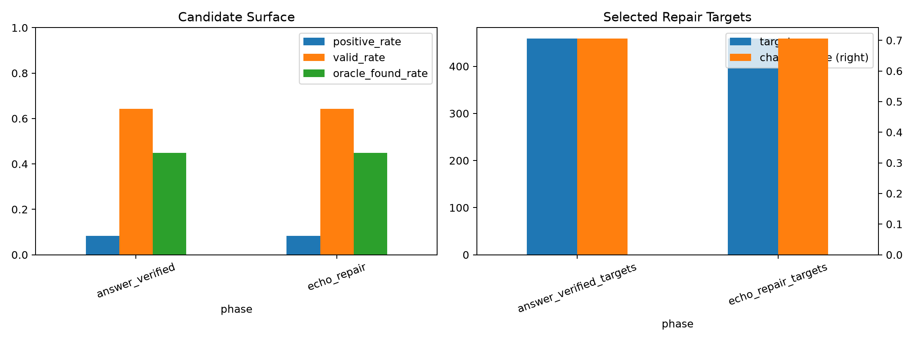
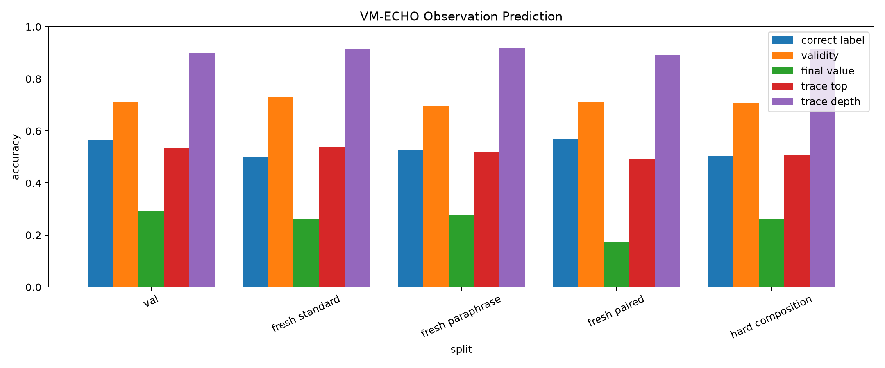
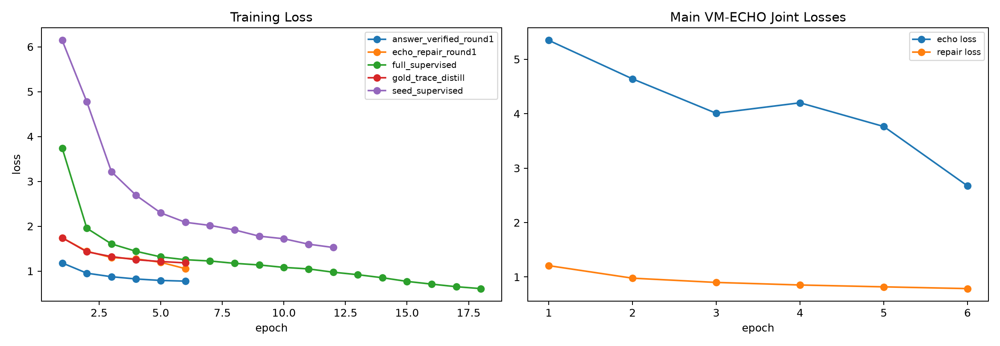
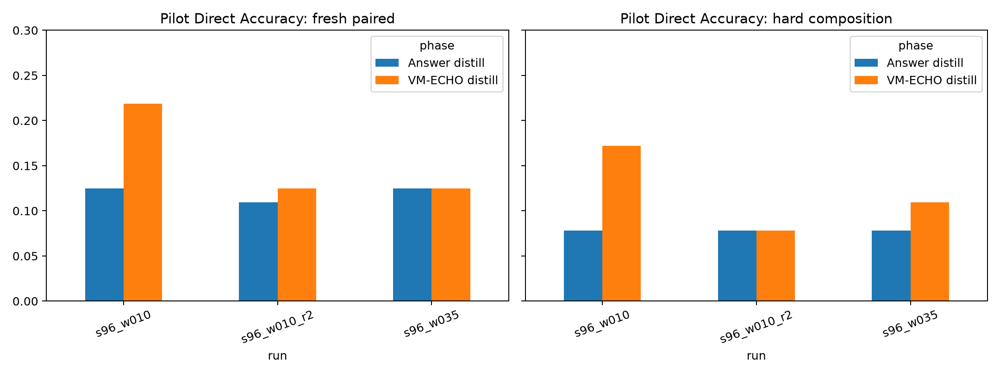

# In-Policy VM-ECHO Distillation

## Abstract

This experiment tests whether a Qwen-attached typed-bytecode compiler improves when it learns the VM consequences of its own proposed programs during repair distillation. The compiler first emits executable candidates from frozen `Qwen/Qwen3-4B` hidden states. Those candidates are executed in a typed VM. The training objective combines answer-verified repair distillation with an integrated observation loss over all sampled candidates: validity, final value, trace top, trace depth, and answer-correctness.

The result is mixed. VM-ECHO learned the observation channels: on the main run, trace-depth prediction reached about 91.5% on fresh-standard candidates and trace-top prediction reached 53.9%. It also improved some answer-search metrics over answer-verified distillation, including hard-composition search from 47.7% to 51.6%. But it did not produce a broad direct-accuracy jump: fresh-paired direct accuracy stayed at 8.6%, while the full-supervised ceiling reached 76.6%.

## Setup

- Base model: `Qwen/Qwen3-4B`, used as a frozen hidden-state feature extractor.
- Compiler: transformer slot decoder over Qwen hidden states.
- Integrated VM-ECHO head: candidate-conditioned transformer sharing the compiler prompt projection.
- Seed examples: `192`.
- Candidate prompts: `1024`.
- Candidate programs: `246784`.
- Candidate positive rate: `8.3%`.
- Prompt-level oracle found rate: `44.8%`.
- Repair targets selected: `459`.
- ECHO loss weight selected by pilot: `0.1`.
- Checkpoints: `large_artifacts/qwen_inpolicy_vm_echo_distillation/checkpoints/main_inpolicy_vm_echo_s192_w010/`.

## Main Results

| Phase | Split | Direct | Answer search | Oracle | ECHO rerank | Program exact |
| --- | --- | ---: | ---: | ---: | ---: | ---: |
| Seed | fresh standard | 12.5% | 44.5% | 44.5% |  | 0.8% |
| Seed | fresh paraphrase | 14.8% | 40.6% | 40.6% |  | 0.8% |
| Seed | fresh paired | 8.6% | 44.5% | 44.5% |  | 0.0% |
| Seed | hard composition | 11.7% | 44.5% | 44.5% |  | 0.0% |
| Answer distill | fresh standard | 14.1% | 44.5% | 44.5% |  | 0.0% |
| Answer distill | fresh paraphrase | 10.9% | 46.9% | 46.9% |  | 0.0% |
| Answer distill | fresh paired | 8.6% | 45.3% | 45.3% |  | 0.0% |
| Answer distill | hard composition | 14.1% | 47.7% | 47.7% |  | 0.8% |
| VM-ECHO distill | fresh standard | 14.8% | 48.4% | 48.4% | 10.9% | 0.8% |
| VM-ECHO distill | fresh paraphrase | 14.1% | 50.0% | 50.0% | 10.2% | 1.6% |
| VM-ECHO distill | fresh paired | 8.6% | 44.5% | 44.5% | 6.2% | 0.0% |
| VM-ECHO distill | hard composition | 14.1% | 51.6% | 51.6% | 8.6% | 0.8% |
| Gold trace | fresh standard | 16.4% | 49.2% | 49.2% |  | 3.9% |
| Gold trace | fresh paraphrase | 18.0% | 55.5% | 55.5% |  | 3.1% |
| Gold trace | fresh paired | 16.4% | 53.1% | 53.1% |  | 5.5% |
| Gold trace | hard composition | 16.4% | 56.2% | 56.2% |  | 3.9% |
| Full sup. | fresh standard | 71.9% | 90.6% | 90.6% |  | 55.5% |
| Full sup. | fresh paraphrase | 78.9% | 88.3% | 88.3% |  | 63.3% |
| Full sup. | fresh paired | 76.6% | 95.3% | 95.3% |  | 63.3% |
| Full sup. | hard composition | 58.6% | 85.9% | 85.9% |  | 39.1% |

## Candidate Surface

| Phase | Round | Targets | Oracle found | Changed | Candidate valid |
| --- | ---: | ---: | ---: | ---: | ---: |
| answer_verified_targets | 1 | 459 | 44.8% | 70.6% | 64.3% |
| echo_repair_targets | 1 | 459 | 44.8% | 70.6% | 64.3% |

The candidate surface is large enough to matter but not large enough to solve the task by itself. The main run generated `246784` candidates from `1024` prompts, and `44.8%` of prompts had at least one answer-correct candidate. This puts a ceiling on what one round of repair distillation can learn.

## VM Observation Learning

VM-ECHO learned validity and trace structure much better than final answer correctness. This is important: the auxiliary loss did train a consequence model, but the learned consequence model was not a useful no-answer reranker. ECHO reranking was below direct decoding on every main split. The useful effect, where present, came from joint training changing the compiler, not from selecting candidates at inference time.

## Training Dynamics

The main ECHO auxiliary loss decreased from `5.35` to `2.67`, while repair loss also improved. A higher pilot weight damaged deployable accuracy, so the auxiliary needs to remain secondary to the repair target.

## Pilot Results

The pilot sweep selected `echo_loss_weight=0.1`. A stronger `0.35` weight over-regularized the compiler. A second in-policy round improved some standard/paraphrase cells, but it removed the fresh-paired and hard direct signal that made the one-round pilot attractive.

## Interpretation

This experiment supports a narrow claim: candidate-consequence prediction can be trained in the same compiler loop without breaking executable decoding, and it can modestly reshape the answer-search surface. It does not support the stronger claim that this objective currently unlocks the full repair oracle or produces a large direct compiler improvement.

The decisive remaining problem is credit assignment among executable candidates. VM-ECHO learned broad consequences such as validity and stack traces, but it did not learn to identify which candidate solves the prompt. The next version should make the preference signal sharper: train on counterfactual candidate pairs from the same prompt, emphasize hard negatives that share validity or final-value plausibility, and expose a more direct representation of the prompt-implied answer to the candidate scorer.

## Artifacts

- `experiments/qwen_inpolicy_vm_echo_distillation/runs/main_inpolicy_vm_echo_s192_w010/metrics.csv`
- `experiments/qwen_inpolicy_vm_echo_distillation/runs/main_inpolicy_vm_echo_s192_w010/train_log.csv`
- `experiments/qwen_inpolicy_vm_echo_distillation/analysis/main_metrics.csv`
- `experiments/qwen_inpolicy_vm_echo_distillation/reports/qwen_inpolicy_vm_echo_distillation_report.md`
- `experiments/qwen_inpolicy_vm_echo_distillation/reports/qwen_inpolicy_vm_echo_distillation_report.html`
