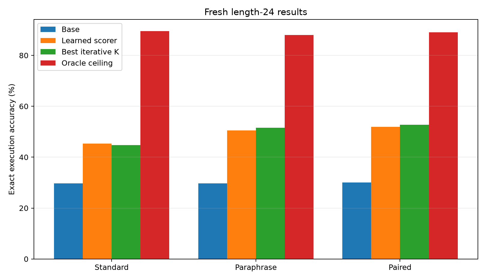
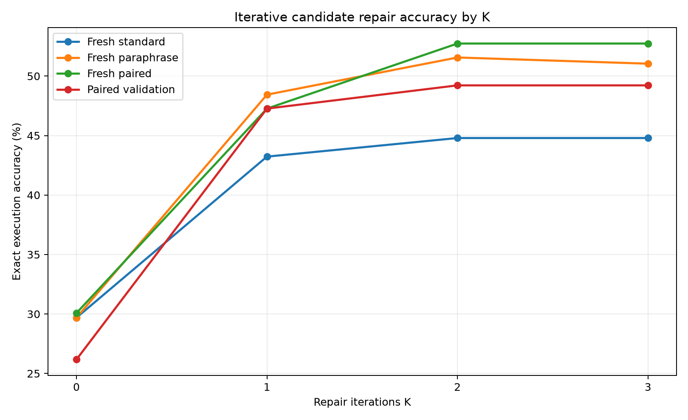
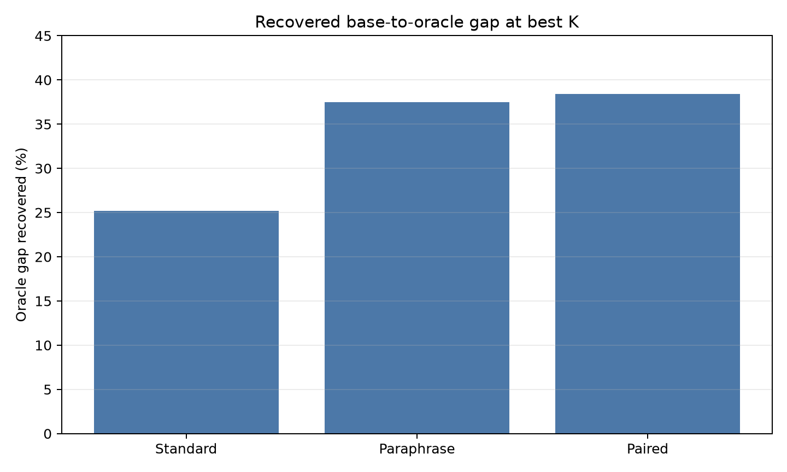
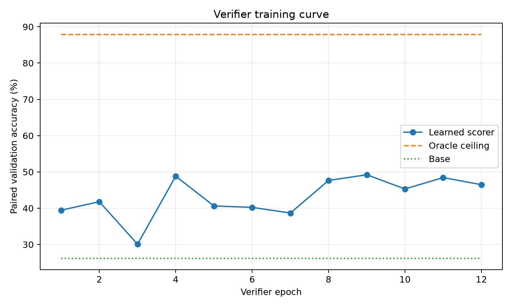
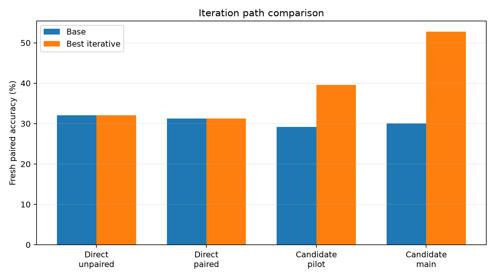

# Qwen Iterative Candidate Repair Policy

## Abstract

This experiment tests whether a frozen Qwen-attached hidden-program compiler can
be improved at inference time by a learned iterative repair loop. The compiler
emits an executable modular-arithmetic program. A small verifier scores local
candidate repairs from execution-trace features. At inference, the repair loop
starts from the base compiled program and may move one slot edit at a time for
`K` iterations.

The primary run trained on 384 length-24 programs and selected checkpoints on a
paired standard/paraphrase validation split. On fresh paired length-24 prompts,
the base compiler reached 30.1%, the
unconstrained learned scorer reached 52.0%,
and the iterative one-edit-at-a-time repair loop reached
52.7% at `K=2`. The local oracle ceiling
was 89.1%.

## Setup

- Substrate: frozen Qwen 4B hidden-program compiler localized in this
  experiment's artifact directory.
- Program domain: length-24 modular arithmetic over modulus 97.
- Hidden program slots: initial value, operation per step, and argument per step.
- Candidate set: top-3 local alternatives with up to two edits around the base
  compiled program.
- Learned component: small transformer verifier over candidate execution traces
  and candidate metadata.
- Iterative rule: at each iteration, move only to a candidate within one slot
  edit of the current candidate if its learned score is higher.
- Primary run: `main_iterative_candidate_scorer_s384`.
- Verifier epochs: 12; selected epoch: 9.

## Main Results

| Split | Base | Learned | Best K | Iterative | Oracle | Delta | Gap |
| --- | --- | --- | --- | --- | --- | --- | --- |
| Fresh standard L24 | 29.7% | 45.3% | 2 | 44.8% | 89.6% | +15.1 pp | 25.2% |
| Fresh paraphrase L24 | 29.7% | 50.5% | 2 | 51.6% | 88.0% | +21.9 pp | 37.5% |
| Fresh paired L24 | 30.1% | 52.0% | 2 | 52.7% | 89.1% | +22.7 pp | 38.4% |

## K Sweep

The K sweep shows most of the gain appears by `K=1`, with a smaller but real
second-step gain on validation, paraphrase, and paired splits. `K=3` adds no
measurable benefit because the candidate set is capped at two edits.

On fresh paired prompts, exact execution moved from 30.1%
at `K=0` to 47.3% at `K=1` and
52.7% at `K=2`.

## Oracle Gap

At `K=2`, the iterative repair loop recovered 38.4%
of the fresh paired base-to-oracle gap, 25.2%
on fresh standard prompts, and 37.5% on
fresh paraphrases.

## Training Dynamics

The verifier's paired-validation accuracy was noisy, so checkpoint selection was
necessary. The selected checkpoint achieved strong fresh transfer despite the
small train set.

## Iteration Path

The direct raw-value repair policy was not robust: one setting damaged fresh
splits and a paired-selected setting mostly learned to copy. The candidate
scorer was the first robust positive arm because it separated proposal quality
from sparse transition control.

## Interpretation

The result supports the narrow claim that an iterative hidden-program repair
loop can convert near-miss Qwen-compiled programs into exact programs without
generating chain-of-thought text. It does not show a universal capability gain:
the task is synthetic, the runtime is hand-designed, and the oracle ceiling
still leaves substantial unrecovered headroom. The important signal is that
iteration over an executable latent representation improved fresh paired exact
execution from 30.1% to
52.7%, slightly beating unconstrained
learned selection on the paired split.

## Limitations

- The verifier is trained with offline exact-state labels.
- The runtime is specialized to modular arithmetic.
- The candidate set is local and capped at two edits.
- `K=3` cannot expose deeper repairs under this candidate budget.
- The base compiler is frozen; this run does not update Qwen weights.

## Artifacts

Small files:

- `experiments/qwen_iterative_repair_policy/runs/main_iterative_candidate_scorer_s384/metrics.csv`
- `experiments/qwen_iterative_repair_policy/runs/main_iterative_candidate_scorer_s384/verifier_train_log.csv`
- `experiments/qwen_iterative_repair_policy/analysis/main_final_metrics.csv`
- `experiments/qwen_iterative_repair_policy/reports/qwen_iterative_repair_policy_paper.md`
- `experiments/qwen_iterative_repair_policy/reports/qwen_iterative_repair_policy_paper.html`

Large files:

- `large_artifacts/qwen_iterative_repair_policy/checkpoints/fixed_compiler_step00800/`
- `large_artifacts/qwen_iterative_repair_policy/checkpoints/main_iterative_candidate_scorer_s384/candidate_trace_verifier.pt`
