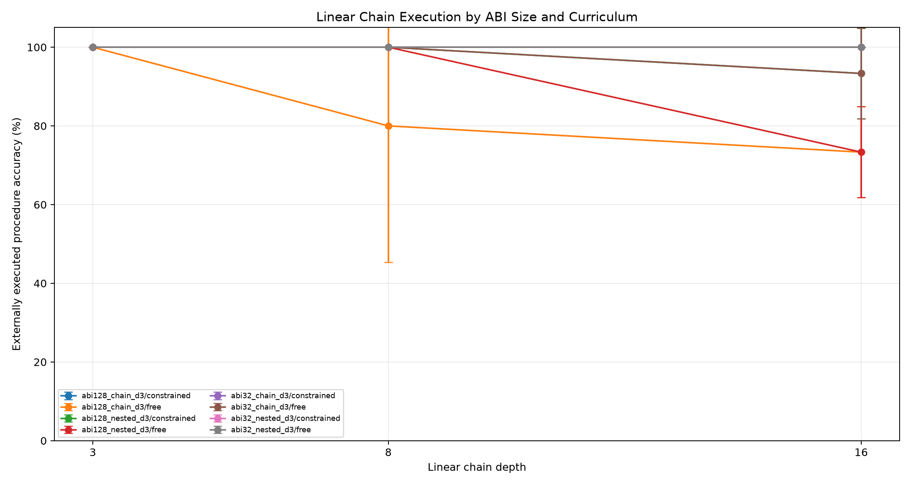
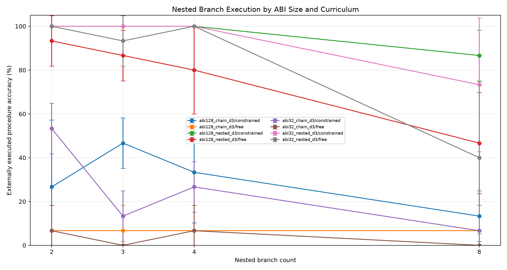
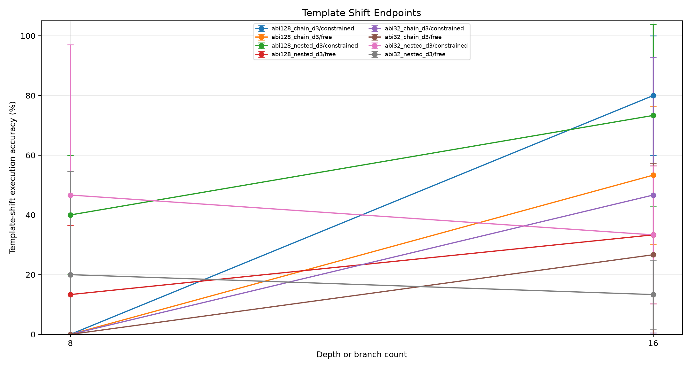
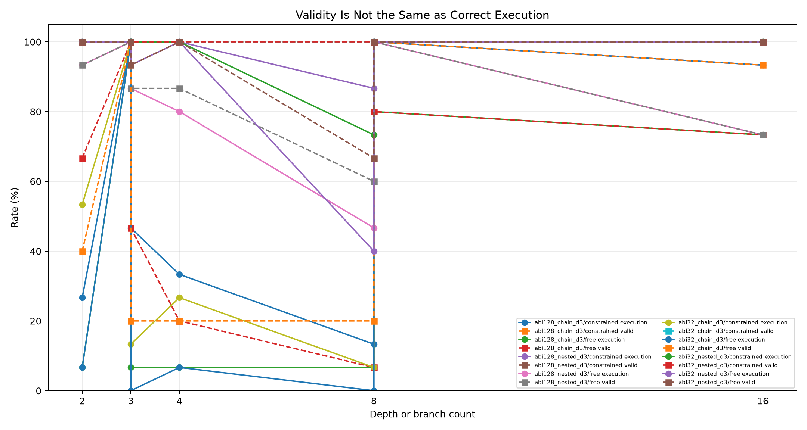
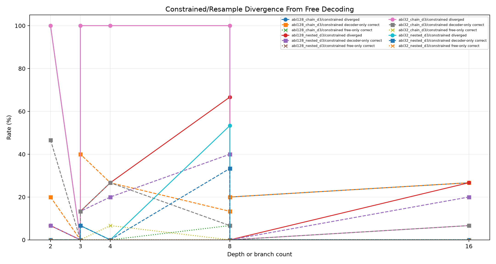
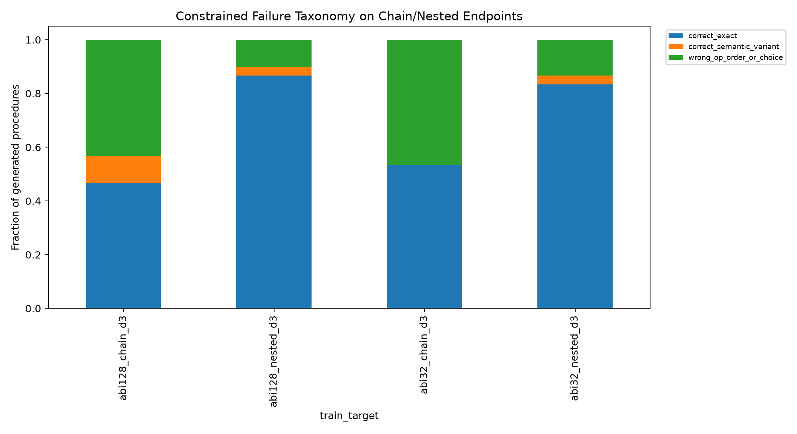
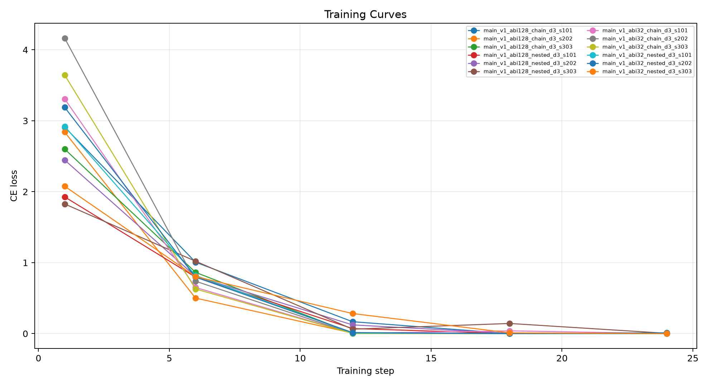

# Qwen Large ABI Nested Compiler

## Abstract

This standalone experiment tests whether a constrained stack-ABI compiler remains reliable when the primitive library grows from 32 to 128 unary operations and when tasks require nested branch sub-procedures. The model emits a program; a deterministic interpreter executes it.

## Method

Four QLoRA adapters are trained over the same numeric stack ABI shape:
- `abi32_chain_d3`: 32 unary operations, chain tasks only, depths 1 to 3.
- `abi128_chain_d3`: 128 unary operations, chain tasks only, depths 1 to 3.
- `abi32_nested_d3`: 32 unary operations, chain depths 1 to 3 plus nested tasks with 2 to 3 branches.
- `abi128_nested_d3`: 128 unary operations, chain depths 1 to 3 plus nested tasks with 2 to 3 branches.

Evaluation sweeps linear chains at depths 3, 8, and 16, plus nested branch tasks with 2, 3, 4, and 8 branches. Template-shifted endpoints test wording robustness. Each adapter is evaluated with free greedy decoding and finite-state constrained decoding. Gold ABI sanity arms check both ABI sizes.

The primary criteria are constrained external execution accuracy on chain depth 16 and nested 8-branch tasks. Valid-program rate alone is not a success metric; the compiler must select the right operations and merge structure, not merely produce parseable syntax.

## Run Configuration

- Primary suite: `main`.
- Seeds: `101,202,303`.
- Evaluation rows: `270` metric rows, `1350` scored examples across curricula and decoder arms.
- QLoRA update steps per adapter: `24`.
- Large adapters are stored outside the experiment tree.

## Primary Results

- Constrained chain depth 3: 32-chain 100.0%; 128-chain 100.0%; 32-nested 100.0%; 128-nested 100.0%.
- Constrained chain depth 8: 32-chain 100.0%; 128-chain 100.0%; 32-nested 100.0%; 128-nested 100.0%.
- Constrained chain depth 16: 32-chain 100.0%; 128-chain 100.0%; 32-nested 100.0%; 128-nested 93.3%.
- Constrained nested 2 branches: 32-chain 53.3%; 128-chain 26.7%; 32-nested 100.0%; 128-nested 100.0%.
- Constrained nested 3 branches: 32-chain 13.3%; 128-chain 46.7%; 32-nested 100.0%; 128-nested 100.0%.
- Constrained nested 4 branches: 32-chain 26.7%; 128-chain 33.3%; 32-nested 100.0%; 128-nested 100.0%.
- Constrained nested 8 branches: 32-chain 6.7%; 128-chain 13.3%; 32-nested 73.3%; 128-nested 86.7%.
- Constrained template chain depth 16: 32-chain 46.7%; 128-chain 80.0%; 32-nested 33.3%; 128-nested 73.3%.
- Constrained template nested 8 branches: 32-chain 0.0%; 128-chain 0.0%; 32-nested 46.7%; 128-nested 40.0%.
- Gold ABI nested-8 sanity: 32-op 100.0% execution, 128-op 100.0% execution.
- At chain depth 16, 128-op chain beats 32-op chain on `0/3` matched seeds; mean per-seed delta 0.0%.
- On 128-op nested-8 tasks, nested curriculum beats chain-only on `3/3` matched seeds; mean per-seed delta 73.3%.

|train_target|arm|split|depth|runs|n_total|exec_accuracy_mean|exec_accuracy_std|valid_exec_rate_mean|correct_given_valid_mean|divergence_rate_mean|constrained_only_rate_mean|free_only_rate_mean|mean_attempts_mean|
|---|---|---|---|---|---|---|---|---|---|---|---|---|---|
|abi128_chain_d3|program_stack_constrained|eval_chain_d16|16|3|15|100.0%|0.0%|100.0%|100.0%|26.7%|26.7%|0.0%|1.00|
|abi128_chain_d3|program_stack_free|eval_chain_d16|16|3|15|73.3%|11.5%|73.3%|100.0%|n/a|n/a|n/a|1.00|
|abi128_nested_d3|program_stack_constrained|eval_chain_d16|16|3|15|93.3%|11.5%|100.0%|93.3%|26.7%|20.0%|0.0%|1.00|
|abi128_nested_d3|program_stack_free|eval_chain_d16|16|3|15|73.3%|11.5%|73.3%|100.0%|n/a|n/a|n/a|1.00|
|abi32_chain_d3|program_stack_constrained|eval_chain_d16|16|3|15|100.0%|0.0%|100.0%|100.0%|6.7%|6.7%|0.0%|1.00|
|abi32_chain_d3|program_stack_free|eval_chain_d16|16|3|15|93.3%|11.5%|93.3%|100.0%|n/a|n/a|n/a|1.00|
|abi32_nested_d3|program_stack_constrained|eval_chain_d16|16|3|15|100.0%|0.0%|100.0%|100.0%|0.0%|0.0%|0.0%|1.00|
|abi32_nested_d3|program_stack_free|eval_chain_d16|16|3|15|100.0%|0.0%|100.0%|100.0%|n/a|n/a|n/a|1.00|
|oracle_abi128|gold_abi_constrained|eval_chain_d16|16|3|15|100.0%|0.0%|100.0%|100.0%|n/a|n/a|n/a|0.00|
|oracle_abi32|gold_abi_constrained|eval_chain_d16|16|3|15|100.0%|0.0%|100.0%|100.0%|n/a|n/a|n/a|0.00|
|abi128_chain_d3|program_stack_constrained|eval_chain_d8|8|3|15|100.0%|0.0%|100.0%|100.0%|20.0%|20.0%|0.0%|1.00|
|abi128_chain_d3|program_stack_free|eval_chain_d8|8|3|15|80.0%|34.6%|80.0%|100.0%|n/a|n/a|n/a|1.00|
|abi128_nested_d3|program_stack_constrained|eval_chain_d8|8|3|15|100.0%|0.0%|100.0%|100.0%|0.0%|0.0%|0.0%|1.00|
|abi128_nested_d3|program_stack_free|eval_chain_d8|8|3|15|100.0%|0.0%|100.0%|100.0%|n/a|n/a|n/a|1.00|
|abi32_chain_d3|program_stack_constrained|eval_chain_d8|8|3|15|100.0%|0.0%|100.0%|100.0%|0.0%|0.0%|0.0%|1.00|
|abi32_chain_d3|program_stack_free|eval_chain_d8|8|3|15|100.0%|0.0%|100.0%|100.0%|n/a|n/a|n/a|1.00|
|abi32_nested_d3|program_stack_constrained|eval_chain_d8|8|3|15|100.0%|0.0%|100.0%|100.0%|0.0%|0.0%|0.0%|1.00|
|abi32_nested_d3|program_stack_free|eval_chain_d8|8|3|15|100.0%|0.0%|100.0%|100.0%|n/a|n/a|n/a|1.00|
|oracle_abi128|gold_abi_constrained|eval_chain_d8|8|3|15|100.0%|0.0%|100.0%|100.0%|n/a|n/a|n/a|0.00|
|oracle_abi32|gold_abi_constrained|eval_chain_d8|8|3|15|100.0%|0.0%|100.0%|100.0%|n/a|n/a|n/a|0.00|
|abi128_chain_d3|program_stack_constrained|eval_chain_template_d16|16|3|15|80.0%|20.0%|100.0%|80.0%|46.7%|26.7%|0.0%|1.00|
|abi128_chain_d3|program_stack_free|eval_chain_template_d16|16|3|15|53.3%|23.1%|53.3%|100.0%|n/a|n/a|n/a|1.00|
|abi128_nested_d3|program_stack_constrained|eval_chain_template_d16|16|3|15|73.3%|30.6%|100.0%|73.3%|66.7%|40.0%|0.0%|1.00|
|abi128_nested_d3|program_stack_free|eval_chain_template_d16|16|3|15|33.3%|23.1%|33.3%|100.0%|n/a|n/a|n/a|1.00|
|abi32_chain_d3|program_stack_constrained|eval_chain_template_d16|16|3|15|46.7%|46.2%|100.0%|46.7%|73.3%|20.0%|0.0%|1.00|
|abi32_chain_d3|program_stack_free|eval_chain_template_d16|16|3|15|26.7%|30.6%|40.0%|62.5%|n/a|n/a|n/a|1.00|
|abi32_nested_d3|program_stack_constrained|eval_chain_template_d16|16|3|15|33.3%|23.1%|100.0%|33.3%|73.3%|20.0%|0.0%|1.00|
|abi32_nested_d3|program_stack_free|eval_chain_template_d16|16|3|15|13.3%|11.5%|46.7%|29.2%|n/a|n/a|n/a|1.00|
|oracle_abi128|gold_abi_constrained|eval_chain_template_d16|16|3|15|100.0%|0.0%|100.0%|100.0%|n/a|n/a|n/a|0.00|
|oracle_abi32|gold_abi_constrained|eval_chain_template_d16|16|3|15|100.0%|0.0%|100.0%|100.0%|n/a|n/a|n/a|0.00|
|abi128_chain_d3|program_stack_constrained|eval_nested_l4|4|3|15|33.3%|23.1%|100.0%|33.3%|100.0%|26.7%|0.0%|1.00|
|abi128_chain_d3|program_stack_free|eval_nested_l4|4|3|15|6.7%|11.5%|20.0%|25.0%|n/a|n/a|n/a|1.00|
|abi128_nested_d3|program_stack_constrained|eval_nested_l4|4|3|15|100.0%|0.0%|100.0%|100.0%|26.7%|20.0%|0.0%|1.00|
|abi128_nested_d3|program_stack_free|eval_nested_l4|4|3|15|80.0%|20.0%|86.7%|91.7%|n/a|n/a|n/a|1.00|
|abi32_chain_d3|program_stack_constrained|eval_nested_l4|4|3|15|26.7%|11.5%|100.0%|26.7%|100.0%|26.7%|6.7%|1.00|
|abi32_chain_d3|program_stack_free|eval_nested_l4|4|3|15|6.7%|11.5%|20.0%|33.3%|n/a|n/a|n/a|1.00|
|abi32_nested_d3|program_stack_constrained|eval_nested_l4|4|3|15|100.0%|0.0%|100.0%|100.0%|0.0%|0.0%|0.0%|1.00|
|abi32_nested_d3|program_stack_free|eval_nested_l4|4|3|15|100.0%|0.0%|100.0%|100.0%|n/a|n/a|n/a|1.00|
|oracle_abi128|gold_abi_constrained|eval_nested_l4|4|3|15|100.0%|0.0%|100.0%|100.0%|n/a|n/a|n/a|0.00|
|oracle_abi32|gold_abi_constrained|eval_nested_l4|4|3|15|100.0%|0.0%|100.0%|100.0%|n/a|n/a|n/a|0.00|
|abi128_chain_d3|program_stack_constrained|eval_nested_l8|8|3|15|13.3%|11.5%|100.0%|13.3%|100.0%|13.3%|6.7%|1.00|
|abi128_chain_d3|program_stack_free|eval_nested_l8|8|3|15|6.7%|11.5%|6.7%|100.0%|n/a|n/a|n/a|1.00|
|abi128_nested_d3|program_stack_constrained|eval_nested_l8|8|3|15|86.7%|11.5%|100.0%|86.7%|66.7%|40.0%|0.0%|1.00|
|abi128_nested_d3|program_stack_free|eval_nested_l8|8|3|15|46.7%|23.1%|60.0%|75.0%|n/a|n/a|n/a|1.00|
|abi32_chain_d3|program_stack_constrained|eval_nested_l8|8|3|15|6.7%|11.5%|100.0%|6.7%|100.0%|6.7%|0.0%|1.00|
|abi32_chain_d3|program_stack_free|eval_nested_l8|8|3|15|0.0%|0.0%|20.0%|0.0%|n/a|n/a|n/a|1.00|
|abi32_nested_d3|program_stack_constrained|eval_nested_l8|8|3|15|73.3%|30.6%|100.0%|73.3%|53.3%|33.3%|0.0%|1.00|
|abi32_nested_d3|program_stack_free|eval_nested_l8|8|3|15|40.0%|34.6%|66.7%|66.7%|n/a|n/a|n/a|1.00|
|oracle_abi128|gold_abi_constrained|eval_nested_l8|8|3|15|100.0%|0.0%|100.0%|100.0%|n/a|n/a|n/a|0.00|
|oracle_abi32|gold_abi_constrained|eval_nested_l8|8|3|15|100.0%|0.0%|100.0%|100.0%|n/a|n/a|n/a|0.00|
|abi128_chain_d3|program_stack_constrained|eval_nested_template_l8|8|3|15|0.0%|0.0%|100.0%|0.0%|100.0%|0.0%|0.0%|1.00|
|abi128_chain_d3|program_stack_free|eval_nested_template_l8|8|3|15|0.0%|0.0%|26.7%|0.0%|n/a|n/a|n/a|1.00|
|abi128_nested_d3|program_stack_constrained|eval_nested_template_l8|8|3|15|40.0%|20.0%|100.0%|40.0%|86.7%|26.7%|0.0%|1.00|
|abi128_nested_d3|program_stack_free|eval_nested_template_l8|8|3|15|13.3%|23.1%|13.3%|100.0%|n/a|n/a|n/a|1.00|
|abi32_chain_d3|program_stack_constrained|eval_nested_template_l8|8|3|15|0.0%|0.0%|100.0%|0.0%|100.0%|0.0%|0.0%|1.00|
|abi32_chain_d3|program_stack_free|eval_nested_template_l8|8|3|15|0.0%|0.0%|20.0%|0.0%|n/a|n/a|n/a|1.00|
|abi32_nested_d3|program_stack_constrained|eval_nested_template_l8|8|3|15|46.7%|50.3%|100.0%|46.7%|73.3%|26.7%|0.0%|1.00|
|abi32_nested_d3|program_stack_free|eval_nested_template_l8|8|3|15|20.0%|34.6%|26.7%|50.0%|n/a|n/a|n/a|1.00|
|oracle_abi128|gold_abi_constrained|eval_nested_template_l8|8|3|15|100.0%|0.0%|100.0%|100.0%|n/a|n/a|n/a|0.00|
|oracle_abi32|gold_abi_constrained|eval_nested_template_l8|8|3|15|100.0%|0.0%|100.0%|100.0%|n/a|n/a|n/a|0.00|

## Interpretation

This experiment separates two questions that matter before scaling a real ABI: whether a larger operation catalog hurts linear chain compilation, and whether branch/sub-procedure structure requires explicit nested supervision.
Operation-scale effect on chain depth 16: 128-op chain training changes execution by 0.0% relative to 32-op chain training.
Nested-curriculum effect at 32 ops on nested-8 tasks: 66.7%.
Nested-curriculum effect at 128 ops on nested-8 tasks: 73.3%.
Template-shifted 128-op nested training reaches 73.3% on chain depth 16 but only 40.0% on nested-8, so wording robustness is not solved for nested branch tasks.
The central positive result is that shallow nested supervision transfers beyond the trained branch counts: both nested curricula reach 100.0% at nested depth 4, and the 128-op nested curriculum reaches 86.7% at nested depth 8.
The operation-catalog result is also positive but narrower: moving from 32 to 128 unary operations does not harm constrained linear-chain compilation, but it does not by itself teach nested structure.
Because constrained decoding supplies only syntactic validity, any execution gain in constrained rows should be read as better operation or merge selection rather than better self-execution.
For `abi128_chain_d3` constrained decoding on chain/nested endpoints, procedures break down as: correct_exact 46.7%, wrong_op_order_or_choice 43.3%, correct_semantic_variant 10.0%.
For `abi128_nested_d3` constrained decoding on chain/nested endpoints, procedures break down as: correct_exact 86.7%, wrong_op_order_or_choice 10.0%, correct_semantic_variant 3.3%.
For `abi32_chain_d3` constrained decoding on chain/nested endpoints, procedures break down as: correct_exact 53.3%, wrong_op_order_or_choice 46.7%.
For `abi32_nested_d3` constrained decoding on chain/nested endpoints, procedures break down as: correct_exact 83.3%, wrong_op_order_or_choice 13.3%, correct_semantic_variant 3.3%.

## Limitations

This experiment tests compilation over a known numeric primitive library. It does not test invention of operations outside the ABI. The finite-state decoder is tied to the task schema and uses task-visible constants plus known line kinds, so results measure operation and merge selection inside a valid grammar. Nested tasks are branch-merge programs, not arbitrary loops or recursion.

## Artifacts

- Metrics: `analysis/summary_by_arm.csv` and `analysis/all_metrics.csv`
- Details: `analysis/all_details.csv`
- Training logs: `analysis/all_train_logs.csv`
- Checkpoints: `/workspace/large_artifacts/qwen_large_abi_nested_compiler/checkpoints`
