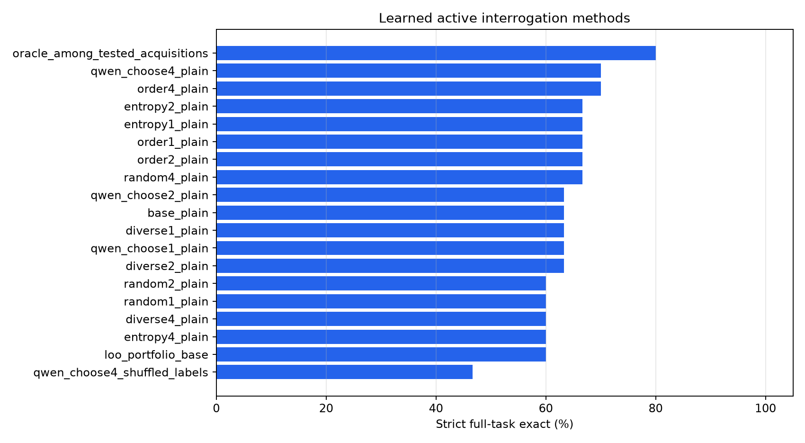
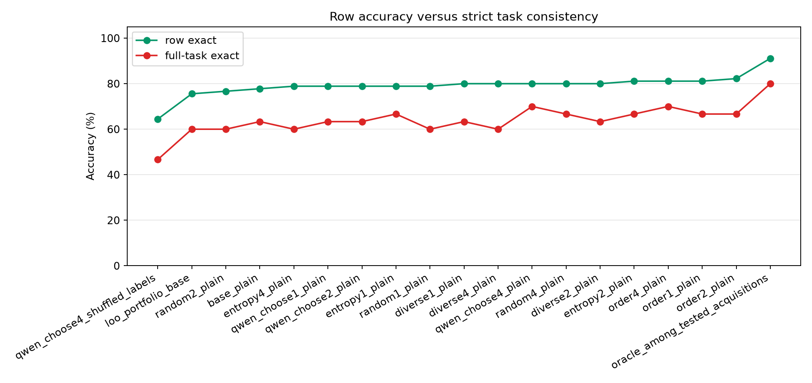
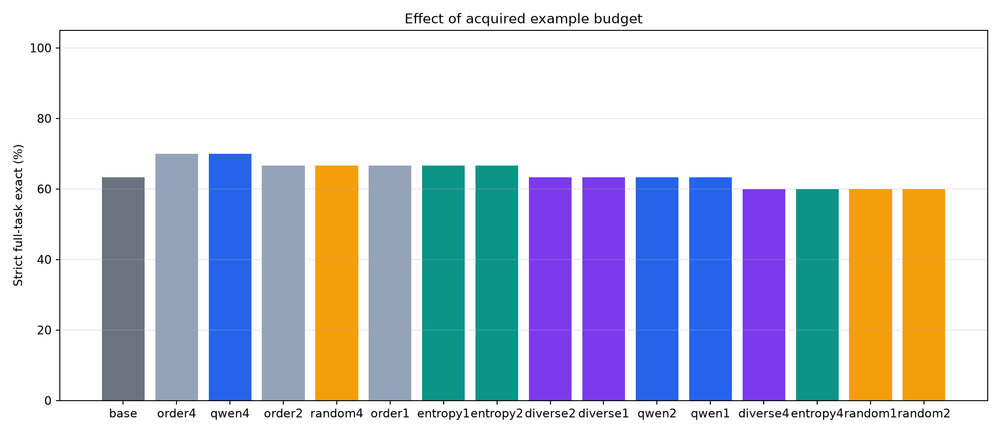
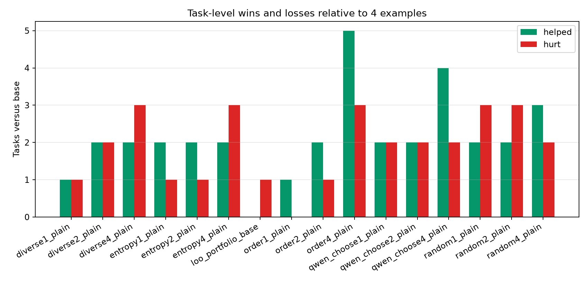
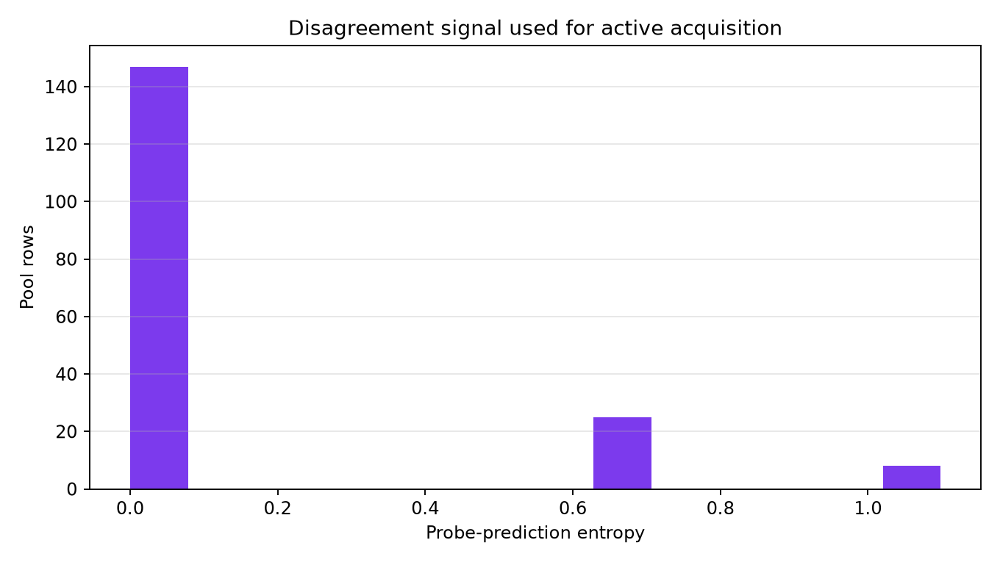
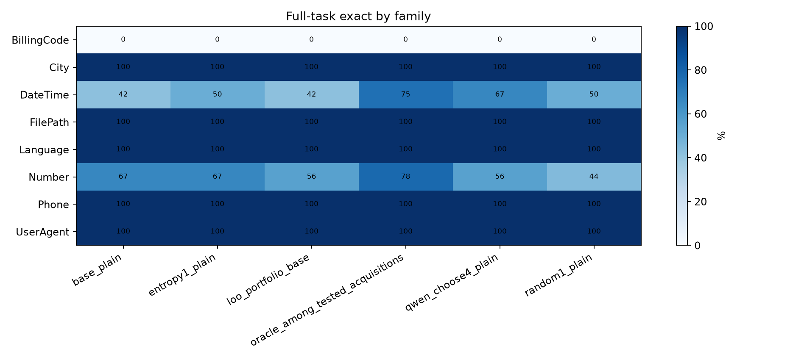

# Learned Active Interrogation

## Question

Can a frozen model improve text-transformation accuracy by choosing which unlabeled examples should be revealed before answering held-out rows?

Each task starts with a small visible set. The model sees additional unlabeled candidate inputs, chooses which ones to reveal, receives the true outputs for those chosen rows, and then answers a separate held-out set. Held-out rows are never used for acquisition.

## Setup

- Run: `main_v1`
- Dataset: public text-transformation tasks.
- Tasks: `30`
- Visible examples per task: `2`
- Acquisition pool examples per task: `6`
- Held-out evaluation rows per task: `3`
- Acquisition budgets: `1,2,4`
- Answer prompt variants for entropy and portfolio diagnostics: `plain, format, consistency`
- Generation records: `2550`

## Main Result

|method|tasks|mean_budget|row_exact|full_task_exact|
|---|---|---|---|---|
|oracle_among_tested_acquisitions|30|1.37|91.1%|80.0%|
|order4_plain|30|4.00|81.1%|70.0%|
|qwen_choose4_plain|30|4.00|80.0%|70.0%|
|order2_plain|30|2.00|82.2%|66.7%|
|random4_plain|30|4.00|80.0%|66.7%|
|order1_plain|30|1.00|81.1%|66.7%|
|entropy1_plain|30|1.00|78.9%|66.7%|
|entropy2_plain|30|2.00|81.1%|66.7%|
|diverse2_plain|30|2.00|80.0%|63.3%|
|base_plain|30|0.00|77.8%|63.3%|
|diverse1_plain|30|1.00|80.0%|63.3%|
|qwen_choose2_plain|30|2.00|78.9%|63.3%|
|qwen_choose1_plain|30|1.00|78.9%|63.3%|
|diverse4_plain|30|4.00|80.0%|60.0%|
|entropy4_plain|30|4.00|78.9%|60.0%|
|loo_portfolio_base|30|0.00|75.6%|60.0%|
|random1_plain|30|1.00|78.9%|60.0%|
|random2_plain|30|2.00|76.7%|60.0%|
|qwen_choose4_shuffled_labels|30|4.00|64.4%|46.7%|

## Interpretation

The baseline with `2` examples solves `63.3%` of tasks. Qwen-chosen acquisition solves `63.3%` with one revealed example and `70.0%` with `4` revealed examples. At the same `4`-example budget, random acquisition solves `66.7%`, order acquisition solves `70.0%`, diversity acquisition solves `60.0%`, and entropy acquisition solves `60.0%`.

The shuffled-label control for Qwen-chosen rows solves `46.7%`. The hidden diagnostic oracle over the tested acquisition policies reaches `80.0%`, which measures whether any tested extra-example choice contained a better move. Visible-example portfolio selection reaches `60.0%`.

A useful active-interrogation result should beat the no-acquisition baseline, order acquisition, random acquisition, diversity acquisition, entropy acquisition, and the shuffled-label control at the same label budget.

## Verdict

Revealing additional labels improves strict task accuracy, but this run does not show that Qwen's acquisition choices are better than a simple fixed-order policy. Qwen-chosen acquisition at budget `4` improves over the no-acquisition baseline from `63.3%` to `70.0%`, helps `4` tasks, and hurts `2` tasks. However, fixed-order acquisition at the same budget reaches `70.0%`, tying or matching the Qwen selector's headline full-task accuracy.

The labels themselves matter: the shuffled-label control drops to `46.7%`. The tested acquisition space has additional headroom, with the hidden diagnostic oracle at `80.0%`. The remaining problem is selecting the right examples more reliably, not whether extra labels can help.

Selector parsing was reliable: fallback parsing was used on `1` of `210` Qwen selection steps. Qwen choice counts by pool index were `0:17, 1:43, 2:39, 3:76, 4:30, 5:5`.

## Charts

## Task-Level Active Versus Random

|task_id|family|features|base|qwen_exact|random_exact|entropy_exact|qwen_helped|qwen_hurt|qwen_indices|random_indices|entropy_indices|loo_variant|
|---|---|---|---|---|---|---|---|---|---|---|---|---|
|DateTime.000019|DateTime|DateTime,Multicolumn|False|True|True|True|True|False|[3, 0, 1, 4]|[0, 2, 4, 5]|[4, 0, 1, 2]|plain|
|DateTime.000027|DateTime|DateTime|False|True|False|False|True|False|[3, 2, 1, 4]|[1, 2, 3, 5]|[0, 2, 3, 1]|plain|
|DateTime.000090|DateTime|DateTime|False|True|True|True|True|False|[3, 2, 1, 4]|[2, 3, 4, 5]|[5, 2, 4, 0]|consistency|
|Number.000009|Number|Numeric|False|True|True|False|True|False|[3, 2, 1, 4]|[0, 1, 3, 4]|[1, 3, 0, 2]|plain|
|BillingCode.000001|BillingCode|Concatenation|False|False|False|False|False|False|[3, 4, 0, 5]|[1, 3, 4, 5]|[0, 1, 2, 3]|plain|
|City.000004|City|Conditional|True|True|True|True|False|False|[3, 2, 1, 4]|[1, 2, 3, 5]|[0, 1, 2, 3]|plain|
|City.000012|City|Substring|True|True|True|True|False|False|[3, 2, 0, 4]|[0, 1, 2, 5]|[0, 1, 2, 3]|plain|
|DateTime.000005|DateTime|Conditional,DateTime|True|True|True|True|False|False|[2, 1, 4, 3]|[1, 2, 3, 5]|[0, 1, 2, 3]|plain|
|DateTime.000021|DateTime|DateTime|False|False|False|False|False|False|[3, 4, 1, 5]|[1, 2, 3, 5]|[1, 2, 5, 0]|plain|
|DateTime.000024|DateTime|DateTime|False|False|False|False|False|False|[3, 2, 1, 4]|[1, 2, 3, 5]|[5, 0, 1, 2]|plain|
|DateTime.000026|DateTime|DateTime|True|True|True|True|False|False|[3, 2, 1, 4]|[1, 2, 3, 4]|[2, 0, 1, 3]|consistency|
|DateTime.000029|DateTime|DateTime|False|False|False|False|False|False|[3, 2, 1, 4]|[0, 1, 4, 5]|[3, 4, 5, 0]|format|
|DateTime.000034|DateTime|DateTime,Substring|True|True|True|True|False|False|[2, 1, 3, 4]|[0, 2, 4, 5]|[0, 1, 2, 3]|plain|
|DateTime.000105|DateTime|DateTime|True|True|True|True|False|False|[3, 2, 1, 4]|[1, 2, 3, 4]|[0, 1, 2, 3]|plain|
|DateTime.000107|DateTime|DateTime|True|True|True|True|False|False|[3, 1, 2, 4]|[0, 1, 3, 4]|[0, 1, 2, 3]|plain|
|DateTime.000113|DateTime|DateTimeRange,DateTimeRounding,DateTime|False|False|False|False|False|False|[3, 2, 1, 4]|[0, 1, 2, 3]|[3, 5, 0, 1]|plain|
|FilePath.000001|FilePath|Conditional,Substring|True|True|True|True|False|False|[3, 2, 1, 5]|[0, 2, 4, 5]|[0, 1, 2, 3]|plain|
|Language.000001|Language|Concatenation,Multicolumn,Substring|True|True|True|True|False|False|[3, 0, 1, 2]|[0, 1, 3, 4]|[0, 1, 2, 3]|plain|
|Number.000011|Number|Numeric,NumericRounding|True|True|True|False|False|False|[3, 2, 1, 4]|[1, 2, 3, 5]|[0, 1, 2, 3]|plain|
|Number.000073|Number|Numeric|False|False|False|False|False|False|[3, 1, 2, 4]|[0, 1, 2, 4]|[0, 3, 4, 1]|plain|
|Number.000075|Number|Concatenation,Numeric|True|True|False|False|False|False|[3, 2, 1, 4]|[1, 3, 4, 5]|[0, 1, 2, 3]|plain|
|Number.000076|Number|Numeric|False|False|False|False|False|False|[3, 2, 1, 0]|[0, 1, 3, 4]|[0, 1, 2, 3]|plain|
|Number.000083|Number|Numeric|True|True|True|True|False|False|[3, 2, 1, 4]|[0, 2, 4, 5]|[0, 1, 2, 3]|plain|
|Number.000088|Number|Substring|True|True|True|True|False|False|[3, 2, 1, 4]|[0, 1, 2, 5]|[0, 1, 2, 3]|plain|
|Phone.000001|Phone|Substring|True|True|True|True|False|False|[3, 2, 0, 4]|[0, 3, 4, 5]|[0, 1, 2, 3]|plain|
|Phone.000006|Phone|Substring|True|True|True|True|False|False|[3, 1, 2, 4]|[1, 2, 3, 5]|[0, 1, 2, 3]|plain|
|Phone.000007|Phone|Substring|True|True|True|True|False|False|[3, 1, 2, 4]|[0, 2, 3, 4]|[0, 1, 2, 3]|plain|
|UserAgent.000006|UserAgent|Substring|True|True|True|True|False|False|[3, 2, 1, 4]|[0, 2, 3, 4]|[0, 1, 2, 3]|plain|
|Number.000082|Number|Numeric|True|False|True|True|False|True|[2, 1, 3, 4]|[1, 2, 3, 5]|[0, 5, 1, 2]|plain|
|Number.000086|Number|Numeric,NumericRange,NumericRounding|True|False|False|False|False|True|[3, 1, 0, 4]|[0, 1, 2, 3]|[3, 1, 2, 4]|consistency|

## Acquisition Diagnostics

|task_id|family|features|qwen_choose1|entropy1|diverse1|random1|order1|qwen_choose2|entropy2|diverse2|random2|order2|qwen_choose4|entropy4|diverse4|random4|order4|loo_variant|loo_plain|loo_format|loo_consistency|
|---|---|---|---|---|---|---|---|---|---|---|---|---|---|---|---|---|---|---|---|---|---|
|BillingCode.000001|BillingCode|Concatenation|[0]|[0]|[3]|[1]|[0]|[3, 4]|[0, 1]|[3, 2]|[1, 5]|[0, 1]|[3, 4, 0, 5]|[0, 1, 2, 3]|[3, 2, 4, 0]|[1, 3, 4, 5]|[0, 1, 2, 3]|plain|100.0%|100.0%|100.0%|
|City.000004|City|Conditional|[3]|[0]|[0]|[2]|[0]|[1, 3]|[0, 1]|[0, 2]|[2, 5]|[0, 1]|[3, 2, 1, 4]|[0, 1, 2, 3]|[0, 2, 1, 3]|[1, 2, 3, 5]|[0, 1, 2, 3]|plain|100.0%|100.0%|100.0%|
|City.000012|City|Substring|[3]|[0]|[3]|[2]|[0]|[3, 0]|[0, 1]|[3, 0]|[2, 5]|[0, 1]|[3, 2, 0, 4]|[0, 1, 2, 3]|[3, 0, 4, 2]|[0, 1, 2, 5]|[0, 1, 2, 3]|plain|100.0%|100.0%|100.0%|
|DateTime.000005|DateTime|Conditional,DateTime|[2]|[0]|[0]|[3]|[0]|[2, 1]|[0, 1]|[0, 1]|[2, 3]|[0, 1]|[2, 1, 4, 3]|[0, 1, 2, 3]|[0, 1, 2, 3]|[1, 2, 3, 5]|[0, 1, 2, 3]|plain|100.0%|100.0%|100.0%|
|DateTime.000019|DateTime|DateTime,Multicolumn|[5]|[4]|[1]|[2]|[0]|[0, 5]|[4, 0]|[1, 3]|[2, 4]|[0, 1]|[3, 0, 1, 4]|[4, 0, 1, 2]|[1, 3, 4, 2]|[0, 2, 4, 5]|[0, 1, 2, 3]|plain|50.0%|50.0%|50.0%|
|DateTime.000021|DateTime|DateTime|[3]|[1]|[0]|[1]|[0]|[3, 1]|[1, 2]|[0, 5]|[1, 3]|[0, 1]|[3, 4, 1, 5]|[1, 2, 5, 0]|[0, 5, 4, 1]|[1, 2, 3, 5]|[0, 1, 2, 3]|plain|0.0%|0.0%|0.0%|
|DateTime.000024|DateTime|DateTime|[3]|[5]|[0]|[3]|[0]|[3, 1]|[5, 0]|[0, 5]|[3, 5]|[0, 1]|[3, 2, 1, 4]|[5, 0, 1, 2]|[0, 5, 1, 2]|[1, 2, 3, 5]|[0, 1, 2, 3]|plain|0.0%|0.0%|0.0%|
|DateTime.000026|DateTime|DateTime|[3]|[2]|[0]|[1]|[0]|[3, 0]|[2, 0]|[0, 5]|[1, 2]|[0, 1]|[3, 2, 1, 4]|[2, 0, 1, 3]|[0, 5, 1, 2]|[1, 2, 3, 4]|[0, 1, 2, 3]|consistency|0.0%|0.0%|50.0%|
|DateTime.000027|DateTime|DateTime|[3]|[0]|[2]|[3]|[0]|[3, 2]|[0, 2]|[2, 1]|[3, 5]|[0, 1]|[3, 2, 1, 4]|[0, 2, 3, 1]|[2, 1, 0, 3]|[1, 2, 3, 5]|[0, 1, 2, 3]|plain|50.0%|0.0%|0.0%|
|DateTime.000029|DateTime|DateTime|[3]|[3]|[0]|[5]|[0]|[3, 0]|[3, 4]|[0, 5]|[1, 5]|[0, 1]|[3, 2, 1, 4]|[3, 4, 5, 0]|[0, 5, 1, 2]|[0, 1, 4, 5]|[0, 1, 2, 3]|format|50.0%|100.0%|100.0%|
|DateTime.000034|DateTime|DateTime,Substring|[3]|[0]|[1]|[5]|[0]|[3, 2]|[0, 1]|[1, 0]|[0, 5]|[0, 1]|[2, 1, 3, 4]|[0, 1, 2, 3]|[1, 0, 2, 3]|[0, 2, 4, 5]|[0, 1, 2, 3]|plain|100.0%|100.0%|50.0%|
|DateTime.000090|DateTime|DateTime|[3]|[5]|[0]|[3]|[0]|[1, 3]|[5, 2]|[0, 1]|[3, 4]|[0, 1]|[3, 2, 1, 4]|[5, 2, 4, 0]|[0, 1, 2, 3]|[2, 3, 4, 5]|[0, 1, 2, 3]|consistency|0.0%|0.0%|100.0%|
|DateTime.000105|DateTime|DateTime|[3]|[0]|[0]|[2]|[0]|[3, 2]|[0, 1]|[0, 1]|[2, 4]|[0, 1]|[3, 2, 1, 4]|[0, 1, 2, 3]|[0, 1, 2, 3]|[1, 2, 3, 4]|[0, 1, 2, 3]|plain|100.0%|100.0%|50.0%|
|DateTime.000107|DateTime|DateTime|[3]|[0]|[0]|[0]|[0]|[1, 2]|[0, 1]|[0, 1]|[0, 3]|[0, 1]|[3, 1, 2, 4]|[0, 1, 2, 3]|[0, 1, 2, 3]|[0, 1, 3, 4]|[0, 1, 2, 3]|plain|100.0%|100.0%|100.0%|
|DateTime.000113|DateTime|DateTimeRange,DateTimeRounding,DateTime|[3]|[3]|[0]|[1]|[0]|[1, 2]|[3, 5]|[0, 1]|[0, 1]|[0, 1]|[3, 2, 1, 4]|[3, 5, 0, 1]|[0, 1, 2, 3]|[0, 1, 2, 3]|[0, 1, 2, 3]|plain|50.0%|50.0%|50.0%|
|FilePath.000001|FilePath|Conditional,Substring|[3]|[0]|[0]|[2]|[0]|[3, 2]|[0, 1]|[0, 1]|[0, 2]|[0, 1]|[3, 2, 1, 5]|[0, 1, 2, 3]|[0, 1, 2, 3]|[0, 2, 4, 5]|[0, 1, 2, 3]|plain|50.0%|50.0%|50.0%|
|Language.000001|Language|Concatenation,Multicolumn,Substring|[3]|[0]|[4]|[1]|[0]|[3, 0]|[0, 1]|[4, 1]|[1, 3]|[0, 1]|[3, 0, 1, 2]|[0, 1, 2, 3]|[4, 1, 0, 5]|[0, 1, 3, 4]|[0, 1, 2, 3]|plain|100.0%|100.0%|100.0%|
|Number.000009|Number|Numeric|[0]|[1]|[1]|[4]|[0]|[1, 3]|[1, 3]|[1, 0]|[1, 4]|[0, 1]|[3, 2, 1, 4]|[1, 3, 0, 2]|[1, 0, 2, 3]|[0, 1, 3, 4]|[0, 1, 2, 3]|plain|100.0%|100.0%|100.0%|
|Number.000011|Number|Numeric,NumericRounding|[3]|[0]|[3]|[3]|[0]|[1, 4]|[0, 1]|[3, 0]|[1, 3]|[0, 1]|[3, 2, 1, 4]|[0, 1, 2, 3]|[3, 0, 1, 2]|[1, 2, 3, 5]|[0, 1, 2, 3]|plain|100.0%|100.0%|100.0%|
|Number.000073|Number|Numeric|[0]|[0]|[2]|[0]|[0]|[1, 3]|[0, 3]|[2, 5]|[0, 2]|[0, 1]|[3, 1, 2, 4]|[0, 3, 4, 1]|[2, 5, 3, 0]|[0, 1, 2, 4]|[0, 1, 2, 3]|plain|0.0%|0.0%|0.0%|
|Number.000075|Number|Concatenation,Numeric|[3]|[0]|[0]|[5]|[0]|[1, 3]|[0, 1]|[0, 3]|[4, 5]|[0, 1]|[3, 2, 1, 4]|[0, 1, 2, 3]|[0, 3, 5, 1]|[1, 3, 4, 5]|[0, 1, 2, 3]|plain|0.0%|0.0%|0.0%|
|Number.000076|Number|Numeric|[1]|[0]|[2]|[1]|[0]|[1, 3]|[0, 1]|[2, 5]|[0, 1]|[0, 1]|[3, 2, 1, 0]|[0, 1, 2, 3]|[2, 5, 3, 0]|[0, 1, 3, 4]|[0, 1, 2, 3]|plain|0.0%|0.0%|0.0%|
|Number.000082|Number|Numeric|[2]|[0]|[0]|[3]|[0]|[2, 1]|[0, 5]|[0, 1]|[1, 3]|[0, 1]|[2, 1, 3, 4]|[0, 5, 1, 2]|[0, 1, 2, 3]|[1, 2, 3, 5]|[0, 1, 2, 3]|plain|100.0%|100.0%|100.0%|
|Number.000083|Number|Numeric|[3]|[0]|[4]|[4]|[0]|[3, 2]|[0, 1]|[4, 5]|[4, 5]|[0, 1]|[3, 2, 1, 4]|[0, 1, 2, 3]|[4, 5, 1, 2]|[0, 2, 4, 5]|[0, 1, 2, 3]|plain|50.0%|50.0%|50.0%|
|Number.000086|Number|Numeric,NumericRange,NumericRounding|[0]|[3]|[0]|[1]|[0]|[1, 3]|[3, 1]|[0, 1]|[0, 1]|[0, 1]|[3, 1, 0, 4]|[3, 1, 2, 4]|[0, 1, 2, 3]|[0, 1, 2, 3]|[0, 1, 2, 3]|consistency|0.0%|0.0%|50.0%|
|Number.000088|Number|Substring|[3]|[0]|[3]|[5]|[0]|[3, 4]|[0, 1]|[3, 0]|[2, 5]|[0, 1]|[3, 2, 1, 4]|[0, 1, 2, 3]|[3, 0, 4, 2]|[0, 1, 2, 5]|[0, 1, 2, 3]|plain|100.0%|100.0%|100.0%|
|Phone.000001|Phone|Substring|[3]|[0]|[0]|[5]|[0]|[3, 2]|[0, 1]|[0, 1]|[0, 5]|[0, 1]|[3, 2, 0, 4]|[0, 1, 2, 3]|[0, 1, 2, 3]|[0, 3, 4, 5]|[0, 1, 2, 3]|plain|100.0%|100.0%|100.0%|
|Phone.000006|Phone|Substring|[3]|[0]|[5]|[2]|[0]|[1, 3]|[0, 1]|[5, 4]|[2, 5]|[0, 1]|[3, 1, 2, 4]|[0, 1, 2, 3]|[5, 4, 1, 2]|[1, 2, 3, 5]|[0, 1, 2, 3]|plain|100.0%|100.0%|100.0%|
|Phone.000007|Phone|Substring|[3]|[0]|[5]|[3]|[0]|[3, 0]|[0, 1]|[5, 4]|[3, 4]|[0, 1]|[3, 1, 2, 4]|[0, 1, 2, 3]|[5, 4, 1, 2]|[0, 2, 3, 4]|[0, 1, 2, 3]|plain|100.0%|100.0%|100.0%|
|UserAgent.000006|UserAgent|Substring|[3]|[0]|[0]|[3]|[0]|[3, 2]|[0, 1]|[0, 1]|[2, 3]|[0, 1]|[3, 2, 1, 4]|[0, 1, 2, 3]|[0, 1, 2, 3]|[0, 2, 3, 4]|[0, 1, 2, 3]|plain|100.0%|100.0%|100.0%|

## Family Breakdown

|method|family|tasks|row_exact|full_task_exact|
|---|---|---|---|---|
|base_plain|BillingCode|1|66.7%|0.0%|
|base_plain|City|2|100.0%|100.0%|
|base_plain|DateTime|12|61.1%|41.7%|
|base_plain|FilePath|1|100.0%|100.0%|
|base_plain|Language|1|100.0%|100.0%|
|base_plain|Number|9|81.5%|66.7%|
|base_plain|Phone|3|100.0%|100.0%|
|base_plain|UserAgent|1|100.0%|100.0%|
|diverse1_plain|BillingCode|1|66.7%|0.0%|
|diverse1_plain|City|2|100.0%|100.0%|
|diverse1_plain|DateTime|12|63.9%|41.7%|
|diverse1_plain|FilePath|1|100.0%|100.0%|
|diverse1_plain|Language|1|100.0%|100.0%|
|diverse1_plain|Number|9|85.2%|66.7%|
|diverse1_plain|Phone|3|100.0%|100.0%|
|diverse1_plain|UserAgent|1|100.0%|100.0%|
|diverse2_plain|BillingCode|1|66.7%|0.0%|
|diverse2_plain|City|2|100.0%|100.0%|
|diverse2_plain|DateTime|12|66.7%|50.0%|
|diverse2_plain|FilePath|1|100.0%|100.0%|
|diverse2_plain|Language|1|100.0%|100.0%|
|diverse2_plain|Number|9|81.5%|55.6%|
|diverse2_plain|Phone|3|100.0%|100.0%|
|diverse2_plain|UserAgent|1|100.0%|100.0%|
|diverse4_plain|BillingCode|1|66.7%|0.0%|
|diverse4_plain|City|2|100.0%|100.0%|
|diverse4_plain|DateTime|12|69.4%|50.0%|
|diverse4_plain|FilePath|1|100.0%|100.0%|
|diverse4_plain|Language|1|100.0%|100.0%|
|diverse4_plain|Number|9|77.8%|44.4%|
|diverse4_plain|Phone|3|100.0%|100.0%|
|diverse4_plain|UserAgent|1|100.0%|100.0%|
|entropy1_plain|BillingCode|1|66.7%|0.0%|
|entropy1_plain|City|2|100.0%|100.0%|
|entropy1_plain|DateTime|12|61.1%|50.0%|
|entropy1_plain|FilePath|1|100.0%|100.0%|
|entropy1_plain|Language|1|100.0%|100.0%|
|entropy1_plain|Number|9|85.2%|66.7%|
|entropy1_plain|Phone|3|100.0%|100.0%|
|entropy1_plain|UserAgent|1|100.0%|100.0%|
|entropy2_plain|BillingCode|1|66.7%|0.0%|
|entropy2_plain|City|2|100.0%|100.0%|
|entropy2_plain|DateTime|12|69.4%|50.0%|
|entropy2_plain|FilePath|1|100.0%|100.0%|
|entropy2_plain|Language|1|100.0%|100.0%|
|entropy2_plain|Number|9|81.5%|66.7%|
|entropy2_plain|Phone|3|100.0%|100.0%|
|entropy2_plain|UserAgent|1|100.0%|100.0%|
|entropy4_plain|BillingCode|1|66.7%|0.0%|
|entropy4_plain|City|2|100.0%|100.0%|
|entropy4_plain|DateTime|12|77.8%|58.3%|
|entropy4_plain|FilePath|1|100.0%|100.0%|
|entropy4_plain|Language|1|100.0%|100.0%|
|entropy4_plain|Number|9|63.0%|33.3%|
|entropy4_plain|Phone|3|100.0%|100.0%|
|entropy4_plain|UserAgent|1|100.0%|100.0%|
|loo_portfolio_base|BillingCode|1|66.7%|0.0%|
|loo_portfolio_base|City|2|100.0%|100.0%|
|loo_portfolio_base|DateTime|12|61.1%|41.7%|
|loo_portfolio_base|FilePath|1|100.0%|100.0%|
|loo_portfolio_base|Language|1|100.0%|100.0%|
|loo_portfolio_base|Number|9|74.1%|55.6%|
|loo_portfolio_base|Phone|3|100.0%|100.0%|
|loo_portfolio_base|UserAgent|1|100.0%|100.0%|
|oracle_among_tested_acquisitions|BillingCode|1|66.7%|0.0%|
|oracle_among_tested_acquisitions|City|2|100.0%|100.0%|
|oracle_among_tested_acquisitions|DateTime|12|86.1%|75.0%|
|oracle_among_tested_acquisitions|FilePath|1|100.0%|100.0%|
|oracle_among_tested_acquisitions|Language|1|100.0%|100.0%|
|oracle_among_tested_acquisitions|Number|9|92.6%|77.8%|
|oracle_among_tested_acquisitions|Phone|3|100.0%|100.0%|
|oracle_among_tested_acquisitions|UserAgent|1|100.0%|100.0%|
|order1_plain|BillingCode|1|66.7%|0.0%|
|order1_plain|City|2|100.0%|100.0%|
|order1_plain|DateTime|12|63.9%|41.7%|
|order1_plain|FilePath|1|100.0%|100.0%|
|order1_plain|Language|1|100.0%|100.0%|
|order1_plain|Number|9|88.9%|77.8%|
|order1_plain|Phone|3|100.0%|100.0%|
|order1_plain|UserAgent|1|100.0%|100.0%|
|order2_plain|BillingCode|1|66.7%|0.0%|
|order2_plain|City|2|100.0%|100.0%|
|order2_plain|DateTime|12|69.4%|50.0%|
|order2_plain|FilePath|1|100.0%|100.0%|
|order2_plain|Language|1|100.0%|100.0%|
|order2_plain|Number|9|85.2%|66.7%|
|order2_plain|Phone|3|100.0%|100.0%|
|order2_plain|UserAgent|1|100.0%|100.0%|
|order4_plain|BillingCode|1|66.7%|0.0%|
|order4_plain|City|2|100.0%|100.0%|
|order4_plain|DateTime|12|80.6%|75.0%|
|order4_plain|FilePath|1|100.0%|100.0%|
|order4_plain|Language|1|100.0%|100.0%|
|order4_plain|Number|9|66.7%|44.4%|
|order4_plain|Phone|3|100.0%|100.0%|
|order4_plain|UserAgent|1|100.0%|100.0%|
|qwen_choose1_plain|BillingCode|1|66.7%|0.0%|
|qwen_choose1_plain|City|2|100.0%|100.0%|
|qwen_choose1_plain|DateTime|12|66.7%|50.0%|
|qwen_choose1_plain|FilePath|1|100.0%|100.0%|
|qwen_choose1_plain|Language|1|100.0%|100.0%|
|qwen_choose1_plain|Number|9|77.8%|55.6%|
|qwen_choose1_plain|Phone|3|100.0%|100.0%|
|qwen_choose1_plain|UserAgent|1|100.0%|100.0%|
|qwen_choose2_plain|BillingCode|1|66.7%|0.0%|
|qwen_choose2_plain|City|2|100.0%|100.0%|
|qwen_choose2_plain|DateTime|12|69.4%|50.0%|
|qwen_choose2_plain|FilePath|1|100.0%|100.0%|
|qwen_choose2_plain|Language|1|100.0%|100.0%|
|qwen_choose2_plain|Number|9|74.1%|55.6%|
|qwen_choose2_plain|Phone|3|100.0%|100.0%|
|qwen_choose2_plain|UserAgent|1|100.0%|100.0%|
|qwen_choose4_plain|BillingCode|1|66.7%|0.0%|
|qwen_choose4_plain|City|2|100.0%|100.0%|
|qwen_choose4_plain|DateTime|12|75.0%|66.7%|
|qwen_choose4_plain|FilePath|1|100.0%|100.0%|
|qwen_choose4_plain|Language|1|100.0%|100.0%|
|qwen_choose4_plain|Number|9|70.4%|55.6%|
|qwen_choose4_plain|Phone|3|100.0%|100.0%|
|qwen_choose4_plain|UserAgent|1|100.0%|100.0%|
|qwen_choose4_shuffled_labels|BillingCode|1|0.0%|0.0%|
|qwen_choose4_shuffled_labels|City|2|66.7%|50.0%|
|qwen_choose4_shuffled_labels|DateTime|12|66.7%|41.7%|
|qwen_choose4_shuffled_labels|FilePath|1|0.0%|0.0%|
|qwen_choose4_shuffled_labels|Language|1|100.0%|100.0%|
|qwen_choose4_shuffled_labels|Number|9|55.6%|33.3%|
|qwen_choose4_shuffled_labels|Phone|3|100.0%|100.0%|
|qwen_choose4_shuffled_labels|UserAgent|1|100.0%|100.0%|
|random1_plain|BillingCode|1|66.7%|0.0%|
|random1_plain|City|2|100.0%|100.0%|
|random1_plain|DateTime|12|66.7%|50.0%|
|random1_plain|FilePath|1|100.0%|100.0%|
|random1_plain|Language|1|100.0%|100.0%|
|random1_plain|Number|9|77.8%|44.4%|
|random1_plain|Phone|3|100.0%|100.0%|
|random1_plain|UserAgent|1|100.0%|100.0%|
|random2_plain|BillingCode|1|66.7%|0.0%|
|random2_plain|City|2|100.0%|100.0%|
|random2_plain|DateTime|12|66.7%|50.0%|
|random2_plain|FilePath|1|100.0%|100.0%|
|random2_plain|Language|1|100.0%|100.0%|
|random2_plain|Number|9|70.4%|44.4%|
|random2_plain|Phone|3|100.0%|100.0%|
|random2_plain|UserAgent|1|100.0%|100.0%|
|random4_plain|BillingCode|1|66.7%|0.0%|
|random4_plain|City|2|100.0%|100.0%|
|random4_plain|DateTime|12|75.0%|58.3%|
|random4_plain|FilePath|1|100.0%|100.0%|
|random4_plain|Language|1|100.0%|100.0%|
|random4_plain|Number|9|70.4%|55.6%|
|random4_plain|Phone|3|100.0%|100.0%|
|random4_plain|UserAgent|1|100.0%|100.0%|

## Files

- `runs/main_v1/generations.csv`
- `runs/main_v1/method_details.csv`
- `runs/main_v1/acquisition_details.csv`
- `runs/main_v1/summary.csv`
- `analysis/summary.csv`
- `analysis/method_details.csv`
- `analysis/acquisition_details.csv`
- `analysis/family_summary.csv`
