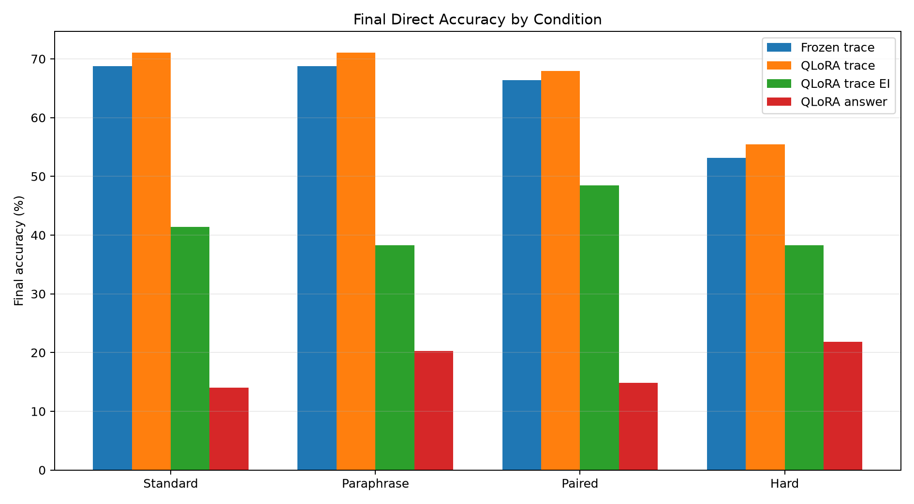
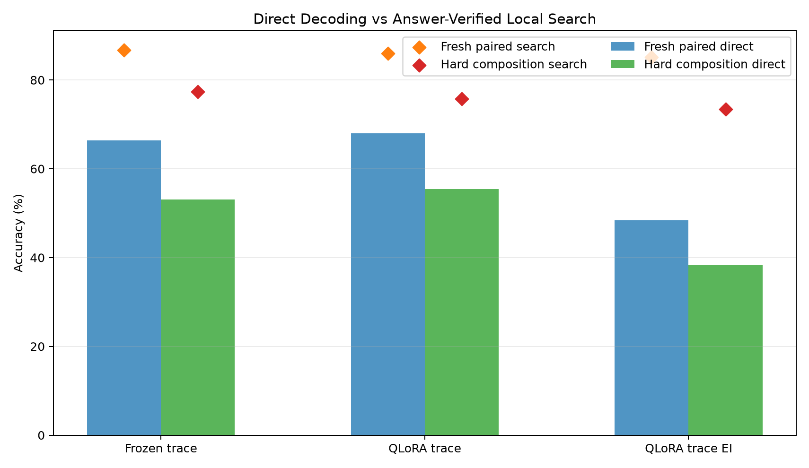
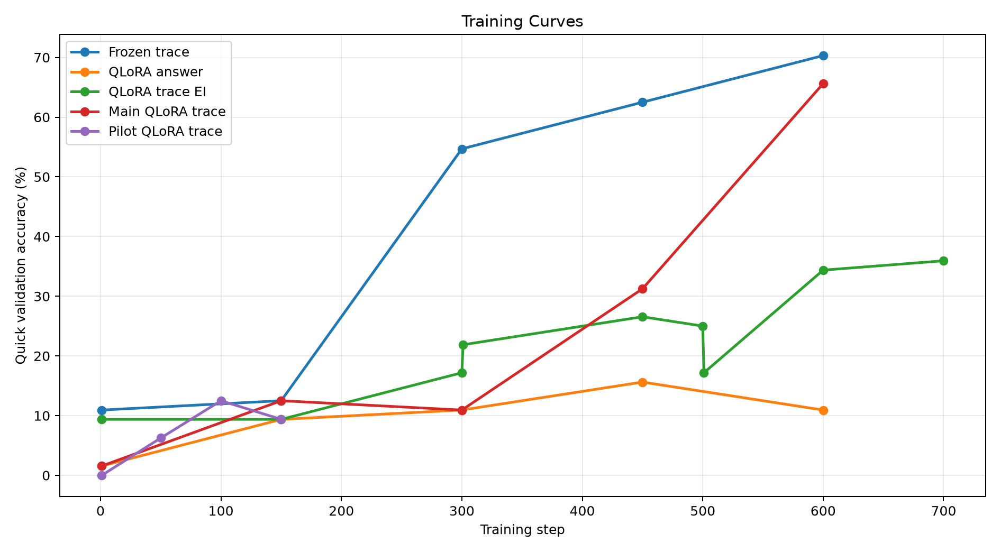
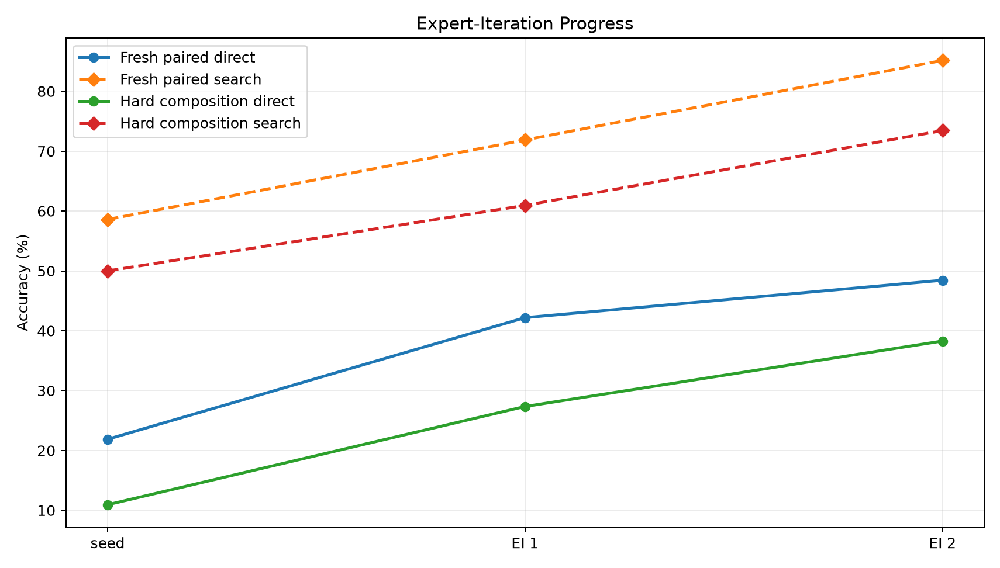
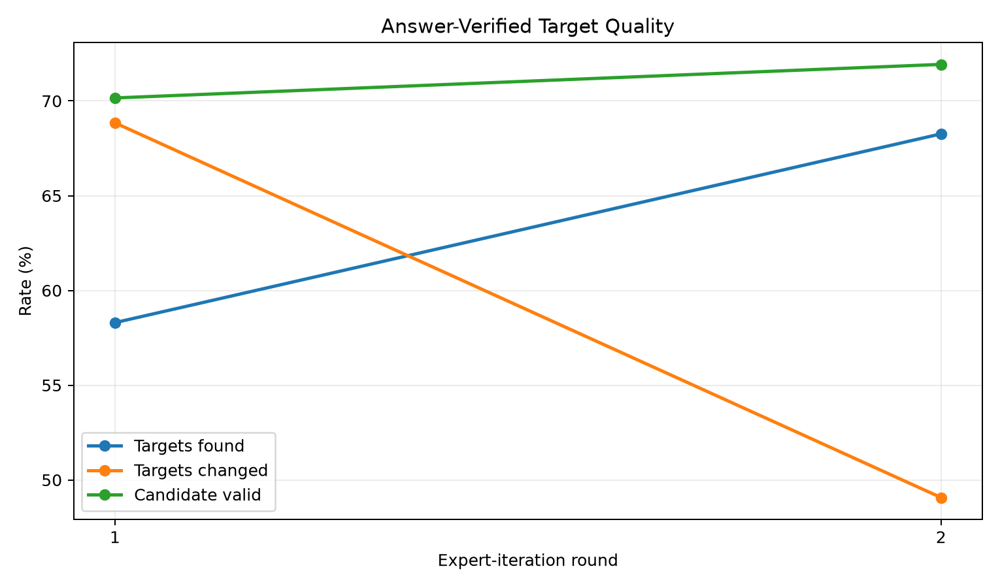

# Qwen LoRA Typed-Bytecode Trace Compiler

## Abstract

This experiment tests whether a local Qwen 4B model can be posttrained to compile short natural-language reasoning tasks into executable typed bytecode. The runtime is a bounded stack machine with arithmetic, comparisons, min/max, modulo, and two table-lookup host calls. The main condition trains QLoRA adapters and a bytecode compiler head from dense gold execution traces. Controls train the same compiler head on frozen Qwen hidden states and train QLoRA only from final answers.

The main QLoRA trace run reached 68.0% direct executable bytecode accuracy on fresh paired prompts and 85.9% when a small answer-verified local search repaired nearby candidates. On hard-composition prompts it reached 55.5% direct and 75.8% with local search. This is a large gain over answer-only training (14.8% fresh paired), but only a modest gain over a frozen-Qwen trace-head control (66.4% fresh paired, 53.1% hard).

## Experimental Question

The question is whether a small posttraining modification can make a 4B language model use an internal executable format: the prompt is read by Qwen, a lightweight compiler emits bytecode, and a fixed VM executes that bytecode to produce the answer. The result should separate three mechanisms:

- whether dense executable trace supervision is much stronger than final-answer labels;
- whether live LoRA adaptation improves over a frozen Qwen feature extractor;
- whether answer-verified expert iteration can turn final-answer feedback into better bytecode targets.

## Runtime

The bytecode VM is a typed stack machine over bounded integer values modulo 97. Programs have at most 16 slots and use these opcodes:

`PAD`, `PUSH`, `ADD`, `SUB`, `MUL`, `MOD`, `MAX`, `MIN`, `GT`, `EQ`, `LOOKUP_A`, `LOOKUP_B`, `END`.

The decoder is constrained to produce stack-valid programs. Direct accuracy means the greedy constrained program executed to the correct answer. Search accuracy means a small local candidate set contained a correct executable program and the answer verifier selected it.

## Data

The task generator creates natural-language prompts with executable gold bytecode across six domains:

- modular arithmetic chains;
- weekday offsets;
- unit scaling;
- list sum/max/min;
- boolean threshold checks;
- table lookup.

Evaluation uses fresh standard prompts, fresh paraphrases, paired standard/paraphrase prompts sharing the same latent program, and a hard-composition split with longer arithmetic, longer lists, and larger offsets/factors.

## Conditions

- `frozen_trace`: Qwen is frozen; hidden states are cached; only the bytecode head trains on gold traces.
- `qlora_trace`: Qwen receives QLoRA adapters; the adapters and bytecode head train jointly on gold traces.
- `qlora_trace_ei`: QLoRA starts from 256 gold traces, then answer-verified local search collects bytecode targets from unlabeled prompts for two training rounds.
- `qlora_answer`: QLoRA and a direct answer head train only on final answer labels.

All QLoRA conditions trained 16.5M adapter parameters, about 0.41% of the model, on NVIDIA RTX 6000 Ada Generation.

## Results

| run                                     | variant        | phase            | split            | direct_metric   | search_accuracy   | program_exact   |
|:----------------------------------------|:---------------|:-----------------|:-----------------|:----------------|:------------------|:----------------|
| control_qwen3_4b_frozen_trace_s512      | frozen_trace   | trace_supervised | fresh_standard   | 68.8%           | 82.0%             | 47.7%           |
| control_qwen3_4b_frozen_trace_s512      | frozen_trace   | trace_supervised | fresh_paraphrase | 68.8%           | 80.5%             | 57.8%           |
| control_qwen3_4b_frozen_trace_s512      | frozen_trace   | trace_supervised | fresh_paired     | 66.4%           | 86.7%             | 50.8%           |
| control_qwen3_4b_frozen_trace_s512      | frozen_trace   | trace_supervised | hard_composition | 53.1%           | 77.3%             | 35.2%           |
| control_qwen3_4b_qlora_answer_s512      | qlora_answer   | answer_only      | fresh_standard   | 14.1%           | n/a               | n/a             |
| control_qwen3_4b_qlora_answer_s512      | qlora_answer   | answer_only      | fresh_paraphrase | 20.3%           | n/a               | n/a             |
| control_qwen3_4b_qlora_answer_s512      | qlora_answer   | answer_only      | fresh_paired     | 14.8%           | n/a               | n/a             |
| control_qwen3_4b_qlora_answer_s512      | qlora_answer   | answer_only      | hard_composition | 21.9%           | n/a               | n/a             |
| main_qwen3_4b_qlora_trace_ei_s256_u1024 | qlora_trace_ei | expert_round_2   | fresh_standard   | 41.4%           | 71.9%             | 32.8%           |
| main_qwen3_4b_qlora_trace_ei_s256_u1024 | qlora_trace_ei | expert_round_2   | fresh_paraphrase | 38.3%           | 71.9%             | 24.2%           |
| main_qwen3_4b_qlora_trace_ei_s256_u1024 | qlora_trace_ei | expert_round_2   | fresh_paired     | 48.4%           | 85.2%             | 30.5%           |
| main_qwen3_4b_qlora_trace_ei_s256_u1024 | qlora_trace_ei | expert_round_2   | hard_composition | 38.3%           | 73.4%             | 26.6%           |
| main_qwen3_4b_qlora_trace_s512          | qlora_trace    | trace_supervised | fresh_standard   | 71.1%           | 85.9%             | 53.9%           |
| main_qwen3_4b_qlora_trace_s512          | qlora_trace    | trace_supervised | fresh_paraphrase | 71.1%           | 84.4%             | 61.7%           |
| main_qwen3_4b_qlora_trace_s512          | qlora_trace    | trace_supervised | fresh_paired     | 68.0%           | 85.9%             | 57.8%           |
| main_qwen3_4b_qlora_trace_s512          | qlora_trace    | trace_supervised | hard_composition | 55.5%           | 75.8%             | 35.2%           |

*Final direct accuracy. For bytecode conditions this is executable bytecode accuracy; for answer-only it is direct answer-head accuracy.*

*Direct bytecode decoding compared with answer-verified local search.*

*Quick validation curves during training.*

*Expert-iteration phase progress on fresh paired and hard-composition splits.*

*Answer-verified target quality during expert iteration.*

## Interpretation

Dense executable trace supervision is the decisive ingredient in this setup. The answer-only control remained low (14.8% fresh paired), while trace-supervised bytecode reached 68.0% fresh paired direct execution and 55.5% hard-composition direct execution. The trained system is not merely producing valid syntax: program exactness reached 57.8% on fresh paired prompts and 35.2% on hard-composition prompts.

Live QLoRA helped, but the effect was smaller than the headline trace-supervision effect. On fresh paired prompts, QLoRA trace was 68.0% versus 66.4% for the frozen trace head, a +1.6 pp difference. On hard composition, QLoRA trace was 55.5% versus 53.1%, a +2.3 pp difference. The strongest conclusion is therefore not that LoRA alone installed a new executor; it is that Qwen's existing hidden states already support a strong executable compiler head when dense trace supervision is available, and light adaptation gives a modest additional lift.

The local-search gap remains important. The main QLoRA run reached 85.9% fresh paired search accuracy while greedy direct execution was 68.0%. That means many failures are near misses: the correct program often appears after small opcode/argument edits. This points toward process-level decoding or verifier-guided prefix search as a more promising next step than simply training a larger final answer head.

Expert iteration partially worked but did not beat dense trace supervision. Fresh paired direct bytecode improved from 21.9% after seed training to 48.4% after two rounds. Round 1 found targets for 58.3% of unlabeled prompts and changed 68.8% of found targets. Round 2 found 68.3% and changed 49.1%. The generated targets were useful, but not as useful as more dense gold traces.

## Limitations

The task distribution is synthetic and still narrow. The VM is deliberately small, and the answer verifier is exact because the generator supplies known answers. Search accuracy should not be read as deployable accuracy unless an external verifier is available. Also, the compiler head is separate from the base LM output head; this is a posttraining-attached executor, not yet a model that emits bytecode through its native token channel.

## Next Experiment

The next high-value experiment should attack the remaining direct/search gap. The best candidate is a prefix-level process verifier for partial bytecode: train a value model over `(prompt, partial program, VM state)` to score whether a prefix can still complete to a correct program, then use beam/A* search over typed bytecode prefixes. That directly targets the observed failure mode: correct programs are often nearby, but greedy slot decoding picks the wrong argument or early opcode.

The second priority is a trace factory with a broader set of crystallized tasks: string normalization, JSON/path extraction, date arithmetic, unit conversion, spreadsheet formulas, regex-like matching, and multi-hop table lookup. This experiment shows executable traces are high-bandwidth supervision; the scaling question is whether a much broader trace corpus preserves the same effect.
