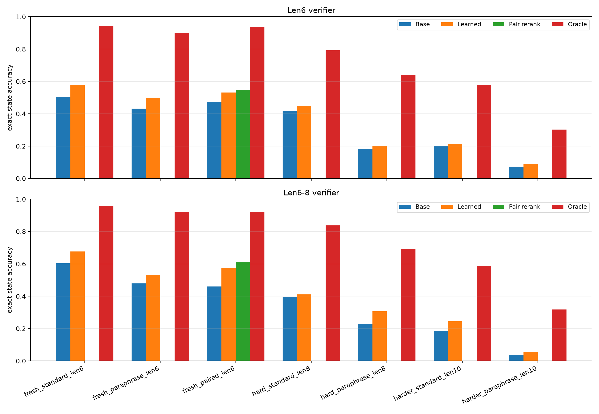
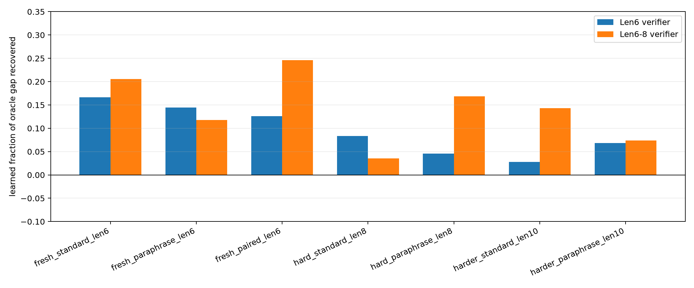
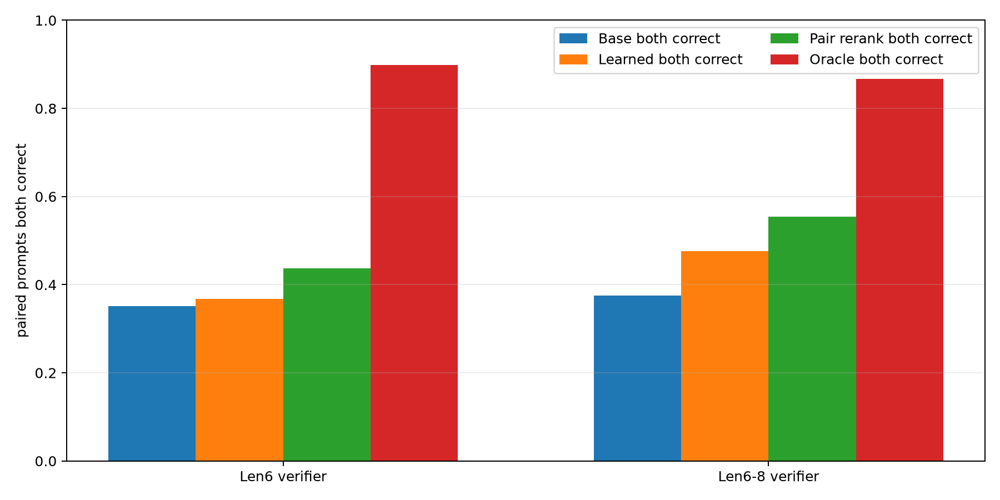
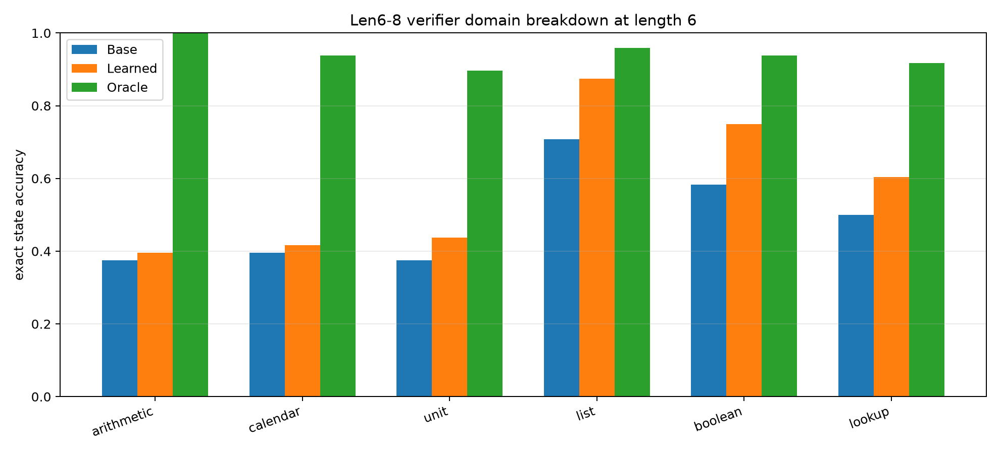
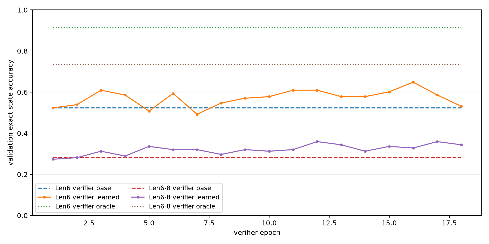

# Qwen Mixed-Domain Candidate-Trace Verifier

## Abstract

This experiment tests whether a small learned verifier can improve a frozen
Qwen-attached hidden-VM compiler by selecting among local executable candidate
traces. The model under test emits a hidden program consisting of an initial
value plus a sequence of VM operations and arguments. The verifier never sees
gold answers or gold states at test time; it scores candidate traces using
compiler priors, local edit metadata, soft-executor support, and the candidate's
own executed trajectory.

The strongest arm trained the verifier on length-6-to-8 traces and selected the
checkpoint on length-8 validation. On fresh paired length-6 prompts, the base
compiler achieved 46.1%, the learned verifier
achieved 57.4%, and paired reranking
achieved 61.3%. That is a learned gain
of +11.3 pp and a paired-rerank gain of +15.2 pp. The same arm
also improved hard paraphrase length-8 from 22.9%
to 30.7% (+7.8 pp) and harder
standard length-10 from 18.8% to
24.5% (+5.7 pp).

The oracle selector remains far higher than the learned verifier. This means the
candidate set often contains a correct executable trace, but the learned scoring
function recovers only a minority of the available headroom.

## Setup

- Backbone/compiler input: a frozen Qwen-attached hidden-VM compiler checkpoint
  localized under this experiment's large-artifact directory.
- VM value modulus: 97.
- VM operations: ADD, SUB, MUL, ADD7, SUB7, SET, MAX, MIN, XOR, GT.
- Domains: arithmetic, calendar, unit conversion, list aggregation, boolean
  thresholding, and table lookup.
- Candidate neighborhood: top-3 compiler values for init/op/arg slots, one-edit
  candidates, same-step op+arg two-edit candidates, and two-argument edits over
  up to the first 10 slots.
- Candidate labels for verifier training: exact answer and exact state trajectory
  match. These labels are offline supervision only.
- Test-time selectors:
  - `base`: unedited compiler argmax trace.
  - `prior`: highest compiler-prior candidate.
  - `soft_trace`: highest soft-executor state-support candidate.
  - `learned`: learned trace-verifier argmax.
  - `pair_rerank`: learned verifier plus agreement bonus across paired standard
    and paraphrased prompts.
  - `oracle`: highest-prior candidate with exact gold state trajectory.

## Main Results

### Length-6 Verifier

| split | base | learned | pair-rerank | oracle | learned delta | oracle gap recovered |
|---|---:|---:|---:|---:|---:|---:|
| `fresh_standard_len6` | 50.5% | 57.8% | n/a | 94.3% | +7.3 pp | 16.7% |
| `fresh_paraphrase_len6` | 43.2% | 50.0% | n/a | 90.1% | +6.8 pp | 14.4% |
| `fresh_paired_len6` | 47.3% | 53.1% | 54.7% | 93.8% | +5.9 pp | 12.6% |
| `hard_standard_len8` | 41.7% | 44.8% | n/a | 79.2% | +3.1 pp | 8.3% |
| `hard_paraphrase_len8` | 18.2% | 20.3% | n/a | 64.1% | +2.1 pp | 4.5% |
| `harder_standard_len10` | 20.3% | 21.4% | n/a | 57.8% | +1.0 pp | 2.8% |
| `harder_paraphrase_len10` | 7.3% | 8.9% | n/a | 30.2% | +1.6 pp | 6.8% |

### Length-6-to-8 Verifier

| split | base | learned | pair-rerank | oracle | learned delta | oracle gap recovered |
|---|---:|---:|---:|---:|---:|---:|
| `fresh_standard_len6` | 60.4% | 67.7% | n/a | 95.8% | +7.3 pp | 20.6% |
| `fresh_paraphrase_len6` | 47.9% | 53.1% | n/a | 92.2% | +5.2 pp | 11.8% |
| `fresh_paired_len6` | 46.1% | 57.4% | 61.3% | 92.2% | +11.3 pp | 24.6% |
| `hard_standard_len8` | 39.6% | 41.1% | n/a | 83.9% | +1.6 pp | 3.5% |
| `hard_paraphrase_len8` | 22.9% | 30.7% | n/a | 69.3% | +7.8 pp | 16.9% |
| `harder_standard_len10` | 18.8% | 24.5% | n/a | 58.9% | +5.7 pp | 14.3% |
| `harder_paraphrase_len10` | 3.6% | 5.7% | n/a | 31.8% | +2.1 pp | 7.4% |

## Oracle Gap

The learned verifier is real but not yet close to the oracle. The length-6-to-8
arm recovers about 24.6% of the fresh
paired length-6 oracle gap and 16.9%
of the hard paraphrase length-8 oracle gap. This is enough to be useful, but it
also shows that most of the selection problem remains unsolved.

## Paired Prompt Behavior

Paired reranking is the cleanest inference-time gain. For the length-6-to-8 arm,
paired prompts both correct improved from 37.5%
under the base compiler to 55.5% with
pair reranking, while the oracle pair ceiling was 86.7%.

## Domain Breakdown

The strongest domain gains in the length-6-to-8 arm were list aggregation,
boolean thresholding, lookup, and unit conversion. Arithmetic and calendar
remain harder for the verifier despite large oracle headroom, suggesting that
the trace features are not yet identifying the right local arithmetic repairs.

## Training Dynamics

| verifier | best epoch | base val | learned val | oracle val |
|---|---:|---:|---:|---:|
| Len6-8 verifier | 12 | 28.1% | 35.9% | 73.4% |
| Len6 verifier | 16 | 52.3% | 64.8% | 91.4% |

The verifier has a narrow useful checkpoint window. Later epochs can over-edit,
so validation-based checkpoint selection is required.

## Interpretation

The experiment supports the narrow claim that hidden executable traces are
repairable by a small learned selection layer. The best arm gives a meaningful
inference-time lift without changing the frozen Qwen compiler. It does not
support a broad claim of large universal intelligence gain: the learned verifier
recovers only part of a much larger oracle candidate-selection ceiling, and the
hardest paraphrase length-10 split remains very weak.

The next technical bottleneck is verifier quality, not candidate availability.
Useful next steps are stronger trace encoders, explicit contrastive training on
base-wrong/repairable groups, and candidate generation that proposes structured
multi-slot fixes without relying on a small local edit budget.
