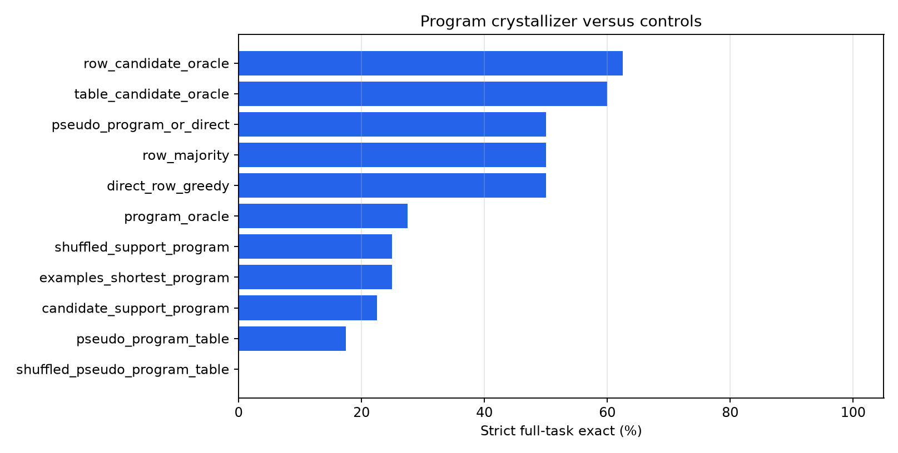
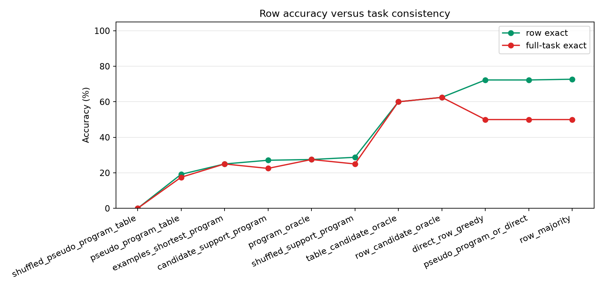
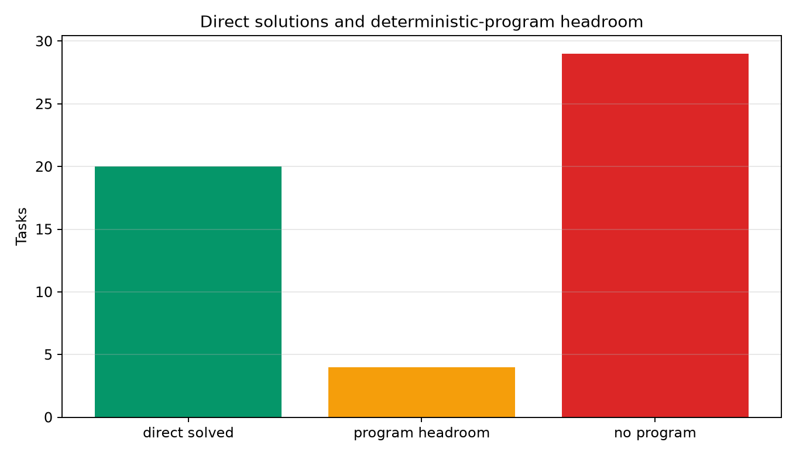
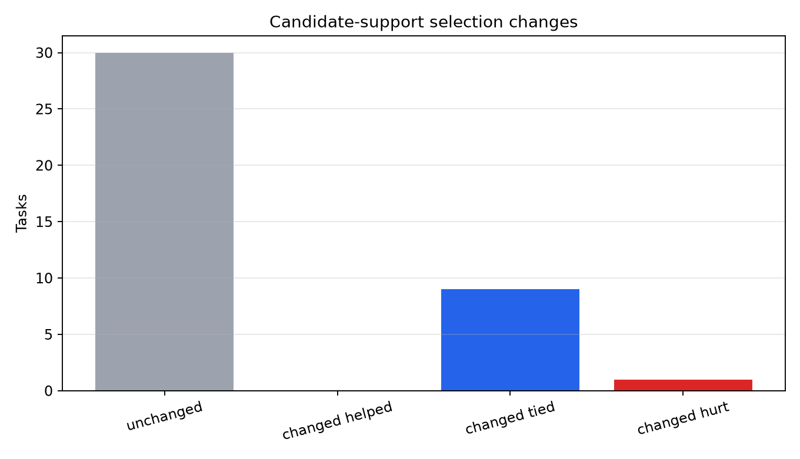
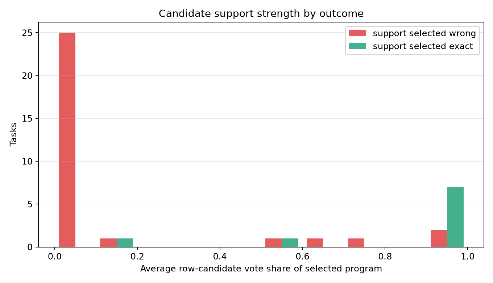
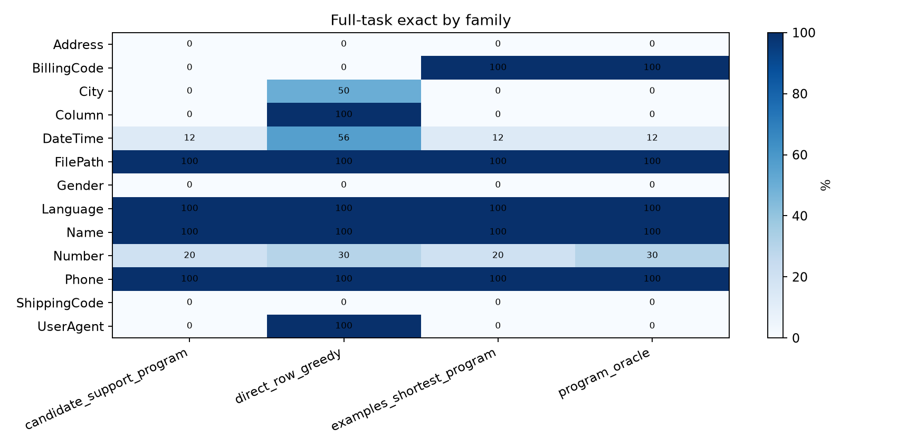

# Noisy Row Program Crystallizer

## Question

Can noisy row-level candidate outputs be crystallized into one deterministic program for an entire text-transformation task?

The experiment uses the language model only to propose row outputs. It then enumerates deterministic programs that exactly match the visible examples and selects the program whose held-out predictions receive the strongest support from the row-candidate pool. Hidden outputs are used only for evaluation and oracle diagnostics.

## Setup

- Run: `main_final`
- Dataset: public text-transformation tasks.
- Tasks: `40`
- Visible examples per task: `4`
- Held-out cap per task: `6`
- Max deterministic programs enumerated per task: `40000`
- Max candidate tables per task: `32`
- Pseudo-program support threshold for fallback: `0.75`
- Row-candidate rows used: `1428`

## Main Result

|method|tasks|row_exact|full_task_exact|
|---|---|---|---|
|row_candidate_oracle|40|62.5%|62.5%|
|table_candidate_oracle|40|60.0%|60.0%|
|direct_row_greedy|40|72.3%|50.0%|
|row_majority|40|72.7%|50.0%|
|pseudo_program_or_direct|40|72.3%|50.0%|
|program_oracle|40|27.5%|27.5%|
|examples_shortest_program|40|25.0%|25.0%|
|shuffled_support_program|40|28.7%|25.0%|
|candidate_support_program|40|27.1%|22.5%|
|pseudo_program_table|40|19.2%|17.5%|
|shuffled_pseudo_program_table|40|0.0%|0.0%|

## Interpretation

Candidate support changes strict full-task exactness by `-27.5` points relative to direct greedy row inference and by `-2.5` points relative to the shortest train-fitting deterministic program. The shuffled-support control is separated by `-2.5` points.

The pseudo-label crystallizer reaches `17.5%` as a pure table selector and `50.0%` with conservative direct fallback. Its shuffled-pseudo control reaches `0.0%`.

The deterministic train-fitting program oracle solves `27.5%` of tasks and the row-candidate oracle solves `62.5%`. Relative to the direct-to-program oracle gap, candidate-support gap capture is not defined because the deterministic-program oracle is below the direct row baseline.

## Diagnostics

- Direct row inference solves `20` of `40` tasks.
- A deterministic train-fitting program can solve `11` of `40` tasks.
- Candidate-support selection solves `9` of `40` tasks.
- Pseudo-label crystallization solves `7` tasks as a pure selector and `20` with direct fallback.
- The direct fallback uses the pseudo-program table on `8` tasks.
- There are `4` direct-missed tasks with a hidden-valid deterministic program; candidate support captures `2` of them.
- Candidate support changes the selected program on `10` tasks: `0` helped and `1` hurt on strict full-task exactness.

## Charts

## Family Breakdown

|method|family|tasks|row_exact|full_task_exact|
|---|---|---|---|---|
|candidate_support_program|Address|2|0.0%|0.0%|
|candidate_support_program|BillingCode|1|33.3%|0.0%|
|candidate_support_program|City|2|25.0%|0.0%|
|candidate_support_program|Column|1|0.0%|0.0%|
|candidate_support_program|DateTime|16|12.5%|12.5%|
|candidate_support_program|FilePath|1|100.0%|100.0%|
|candidate_support_program|Gender|1|66.7%|0.0%|
|candidate_support_program|Language|1|100.0%|100.0%|
|candidate_support_program|Name|1|100.0%|100.0%|
|candidate_support_program|Number|10|23.3%|20.0%|
|candidate_support_program|Phone|2|100.0%|100.0%|
|candidate_support_program|ShippingCode|1|0.0%|0.0%|
|candidate_support_program|UserAgent|1|0.0%|0.0%|
|direct_row_greedy|Address|2|50.0%|0.0%|
|direct_row_greedy|BillingCode|1|33.3%|0.0%|
|direct_row_greedy|City|2|87.5%|50.0%|
|direct_row_greedy|Column|1|100.0%|100.0%|
|direct_row_greedy|DateTime|16|72.9%|56.2%|
|direct_row_greedy|FilePath|1|100.0%|100.0%|
|direct_row_greedy|Gender|1|66.7%|0.0%|
|direct_row_greedy|Language|1|100.0%|100.0%|
|direct_row_greedy|Name|1|100.0%|100.0%|
|direct_row_greedy|Number|10|61.7%|30.0%|
|direct_row_greedy|Phone|2|100.0%|100.0%|
|direct_row_greedy|ShippingCode|1|33.3%|0.0%|
|direct_row_greedy|UserAgent|1|100.0%|100.0%|
|examples_shortest_program|Address|2|0.0%|0.0%|
|examples_shortest_program|BillingCode|1|100.0%|100.0%|
|examples_shortest_program|City|2|0.0%|0.0%|
|examples_shortest_program|Column|1|0.0%|0.0%|
|examples_shortest_program|DateTime|16|12.5%|12.5%|
|examples_shortest_program|FilePath|1|100.0%|100.0%|
|examples_shortest_program|Gender|1|0.0%|0.0%|
|examples_shortest_program|Language|1|100.0%|100.0%|
|examples_shortest_program|Name|1|100.0%|100.0%|
|examples_shortest_program|Number|10|20.0%|20.0%|
|examples_shortest_program|Phone|2|100.0%|100.0%|
|examples_shortest_program|ShippingCode|1|0.0%|0.0%|
|examples_shortest_program|UserAgent|1|0.0%|0.0%|
|program_oracle|Address|2|0.0%|0.0%|
|program_oracle|BillingCode|1|100.0%|100.0%|
|program_oracle|City|2|0.0%|0.0%|
|program_oracle|Column|1|0.0%|0.0%|
|program_oracle|DateTime|16|12.5%|12.5%|
|program_oracle|FilePath|1|100.0%|100.0%|
|program_oracle|Gender|1|0.0%|0.0%|
|program_oracle|Language|1|100.0%|100.0%|
|program_oracle|Name|1|100.0%|100.0%|
|program_oracle|Number|10|30.0%|30.0%|
|program_oracle|Phone|2|100.0%|100.0%|
|program_oracle|ShippingCode|1|0.0%|0.0%|
|program_oracle|UserAgent|1|0.0%|0.0%|
|pseudo_program_or_direct|Address|2|50.0%|0.0%|
|pseudo_program_or_direct|BillingCode|1|33.3%|0.0%|
|pseudo_program_or_direct|City|2|87.5%|50.0%|
|pseudo_program_or_direct|Column|1|100.0%|100.0%|
|pseudo_program_or_direct|DateTime|16|72.9%|56.2%|
|pseudo_program_or_direct|FilePath|1|100.0%|100.0%|
|pseudo_program_or_direct|Gender|1|66.7%|0.0%|
|pseudo_program_or_direct|Language|1|100.0%|100.0%|
|pseudo_program_or_direct|Name|1|100.0%|100.0%|
|pseudo_program_or_direct|Number|10|61.7%|30.0%|
|pseudo_program_or_direct|Phone|2|100.0%|100.0%|
|pseudo_program_or_direct|ShippingCode|1|33.3%|0.0%|
|pseudo_program_or_direct|UserAgent|1|100.0%|100.0%|
|pseudo_program_table|Address|2|0.0%|0.0%|
|pseudo_program_table|BillingCode|1|33.3%|0.0%|
|pseudo_program_table|City|2|0.0%|0.0%|
|pseudo_program_table|Column|1|0.0%|0.0%|
|pseudo_program_table|DateTime|16|12.5%|12.5%|
|pseudo_program_table|FilePath|1|100.0%|100.0%|
|pseudo_program_table|Gender|1|0.0%|0.0%|
|pseudo_program_table|Language|1|100.0%|100.0%|
|pseudo_program_table|Name|1|100.0%|100.0%|
|pseudo_program_table|Number|10|3.3%|0.0%|
|pseudo_program_table|Phone|2|100.0%|100.0%|
|pseudo_program_table|ShippingCode|1|0.0%|0.0%|
|pseudo_program_table|UserAgent|1|0.0%|0.0%|
|row_candidate_oracle|Address|2|0.0%|0.0%|
|row_candidate_oracle|BillingCode|1|0.0%|0.0%|
|row_candidate_oracle|City|2|50.0%|50.0%|
|row_candidate_oracle|Column|1|100.0%|100.0%|
|row_candidate_oracle|DateTime|16|62.5%|62.5%|
|row_candidate_oracle|FilePath|1|100.0%|100.0%|
|row_candidate_oracle|Gender|1|0.0%|0.0%|
|row_candidate_oracle|Language|1|100.0%|100.0%|
|row_candidate_oracle|Name|1|100.0%|100.0%|
|row_candidate_oracle|Number|10|70.0%|70.0%|
|row_candidate_oracle|Phone|2|100.0%|100.0%|
|row_candidate_oracle|ShippingCode|1|0.0%|0.0%|
|row_candidate_oracle|UserAgent|1|100.0%|100.0%|
|row_majority|Address|2|50.0%|0.0%|
|row_majority|BillingCode|1|33.3%|0.0%|
|row_majority|City|2|87.5%|50.0%|
|row_majority|Column|1|100.0%|100.0%|
|row_majority|DateTime|16|74.0%|56.2%|
|row_majority|FilePath|1|100.0%|100.0%|
|row_majority|Gender|1|66.7%|0.0%|
|row_majority|Language|1|100.0%|100.0%|
|row_majority|Name|1|100.0%|100.0%|
|row_majority|Number|10|61.7%|30.0%|
|row_majority|Phone|2|100.0%|100.0%|
|row_majority|ShippingCode|1|33.3%|0.0%|
|row_majority|UserAgent|1|100.0%|100.0%|
|shuffled_pseudo_program_table|Address|2|0.0%|0.0%|
|shuffled_pseudo_program_table|BillingCode|1|0.0%|0.0%|
|shuffled_pseudo_program_table|City|2|0.0%|0.0%|
|shuffled_pseudo_program_table|Column|1|0.0%|0.0%|
|shuffled_pseudo_program_table|DateTime|16|0.0%|0.0%|
|shuffled_pseudo_program_table|FilePath|1|0.0%|0.0%|
|shuffled_pseudo_program_table|Gender|1|0.0%|0.0%|
|shuffled_pseudo_program_table|Language|1|0.0%|0.0%|
|shuffled_pseudo_program_table|Name|1|0.0%|0.0%|
|shuffled_pseudo_program_table|Number|10|0.0%|0.0%|
|shuffled_pseudo_program_table|Phone|2|0.0%|0.0%|
|shuffled_pseudo_program_table|ShippingCode|1|0.0%|0.0%|
|shuffled_pseudo_program_table|UserAgent|1|0.0%|0.0%|
|shuffled_support_program|Address|2|0.0%|0.0%|
|shuffled_support_program|BillingCode|1|100.0%|100.0%|
|shuffled_support_program|City|2|25.0%|0.0%|
|shuffled_support_program|Column|1|0.0%|0.0%|
|shuffled_support_program|DateTime|16|12.5%|12.5%|
|shuffled_support_program|FilePath|1|100.0%|100.0%|
|shuffled_support_program|Gender|1|66.7%|0.0%|
|shuffled_support_program|Language|1|100.0%|100.0%|
|shuffled_support_program|Name|1|100.0%|100.0%|
|shuffled_support_program|Number|10|23.3%|20.0%|
|shuffled_support_program|Phone|2|100.0%|100.0%|
|shuffled_support_program|ShippingCode|1|0.0%|0.0%|
|shuffled_support_program|UserAgent|1|0.0%|0.0%|
|table_candidate_oracle|Address|2|0.0%|0.0%|
|table_candidate_oracle|BillingCode|1|0.0%|0.0%|
|table_candidate_oracle|City|2|50.0%|50.0%|
|table_candidate_oracle|Column|1|100.0%|100.0%|
|table_candidate_oracle|DateTime|16|62.5%|62.5%|
|table_candidate_oracle|FilePath|1|100.0%|100.0%|
|table_candidate_oracle|Gender|1|0.0%|0.0%|
|table_candidate_oracle|Language|1|100.0%|100.0%|
|table_candidate_oracle|Name|1|100.0%|100.0%|
|table_candidate_oracle|Number|10|60.0%|60.0%|
|table_candidate_oracle|Phone|2|100.0%|100.0%|
|table_candidate_oracle|ShippingCode|1|0.0%|0.0%|
|table_candidate_oracle|UserAgent|1|100.0%|100.0%|

## Reachable Headroom Tasks

|task_id|family|features|direct_full_exact|examples_full_exact|support_full_exact|shuffled_full_exact|support_avg_vote_share|train_match_count|support_program|oracle_program|
|---|---|---|---|---|---|---|---|---|---|---|
|BillingCode.000007|BillingCode|Concatenation|False|True|False|True|71.4%|1239|affix[&#x27;[&#x27;,&#x27;]&#x27;](field[[,-1](COL0))|affix[&#x27;&#x27;,&#x27;]&#x27;](COL0)|
|Number.000077|Number|Numeric,NumericRounding|False|False|False|False|57.1%|687|affix[&#x27;&#x27;,&#x27;0&#x27;](slice[0:2](COL0))|affix[&#x27;&#x27;,&#x27;0&#x27;](drop_last[1](COL0))|
|Number.000029|Number|Numeric,NumericRounding|False|True|True|True|57.1%|617|number_round10(COL0)|number_round10(COL0)|
|Number.000049|Number|Numeric,NumericRounding|False|True|True|True|14.3%|624|number_round100(COL0)|number_round100(COL0)|

## Candidate-Support Changes

|task_id|family|features|examples_full_exact|support_full_exact|support_avg_vote_share|support_supported_rows|examples_program|support_program|
|---|---|---|---|---|---|---|---|---|
|Address.000002|Address|Substring|False|False|0.0%|0|map[Aysu Fatma Ahmed 492 24th Place NW,Edison,AK,(896) 388-9065,000-93-6876,38891-&gt;492 24th Place,Fiamma Greco 967 03th Place SE,Long Beach,OK,(129) 734-1247,000-61-4879,03719-&gt;967 03th Place SE](COL0)|map[Place-&gt;492 24th Place,SE,Long-&gt;967 03th Place SE](field[space,-3](COL0))|
|City.000011|City|Conditional|False|False|64.3%|3|map[New York City-&gt;New York City,n.y.c.-&gt;New York City,New York City  -&gt;New York City](COL0)|affix[&#x27;&#x27;,&#x27;ew York City&#x27;](upper(slice[0:1](COL0)))|
|DateTime.000051|DateTime|DateTimeRange,DateTimeRounding,DateTime|False|False|0.0%|0|map[11:12:29-&gt;11:00AM-11:30AM,08:29:52-&gt;8:00AM-8:30AM](COL0)|map[1-&gt;11:00AM-11:30AM,0-&gt;8:00AM-8:30AM](slice[0:1](COL0))|
|DateTime.000081|DateTime|DateTimeRange,DateTimeRounding,DateTime|False|False|16.7%|1|map[6:25PM-&gt;6:15PM-6:45PM,9:44PM-&gt;9:15PM-9:45PM,7:00AM-&gt;6:45AM-7:15AM,11:34PM-&gt;11:15PM-11:45PM](COL0)|map[2-&gt;6:15PM-6:45PM,4-&gt;9:15PM-9:45PM,0-&gt;6:45AM-7:15AM,1-&gt;11:15PM-11:45PM](title(slice[1:3](COL0)))|
|DateTime.000115|DateTime|DateTimeRange,DateTimeRounding,DateTime|False|False|100.0%|6|map[31-Jan-2031 05:54:18-&gt;0-20,17-Jan-1990 13:32:01-&gt;0-20,14-Feb-2034 05:36:07-&gt;0-20,14-Mar-2002 13:16:16-&gt;0-20](COL0)|affix[&#x27;0&#x27;,&#x27;20&#x27;](slice[6:7](COL0))|
|Gender.000001|Gender|Conditional|False|False|90.5%|3|map[M-&gt;0,F-&gt;1](COL0)|map[M-&gt;0,F-&gt;1](initials(COL0))|
|Number.000043|Number|DateTime|False|False|0.0%|0|map[26/4-&gt;04-26,5/11-&gt;11-05,23/9-&gt;09-23,8/12-&gt;12-08](COL0)|map[30-&gt;04-26,0-&gt;11-05,20-&gt;09-23,10-&gt;12-08](number_round10(COL0))|
|Number.000077|Number|Numeric,NumericRounding|False|False|57.1%|3|map[112-&gt;110,117-&gt;110](COL0)|affix[&#x27;&#x27;,&#x27;0&#x27;](slice[0:2](COL0))|
|ShippingCode.000008|ShippingCode|Concatenation,Substring|False|False|0.0%|0|map[1Z 39V 80D 24 0712 870 8-&gt;39V 870,1Z AI7 S7L 39 2136 908 9-&gt;AI7 2136](COL0)|map[9-&gt;39V 870,-&gt;AI7 2136](digits(slice[4:5](COL0)))|
|BillingCode.000007|BillingCode|Concatenation|True|False|71.4%|3|affix[&#x27;&#x27;,&#x27;]&#x27;](COL0)|affix[&#x27;[&#x27;,&#x27;]&#x27;](field[[,-1](COL0))|

## Task Details

|task_id|family|heldout_rows|train_match_count|candidate_tables|coherent_pseudo_tables|program_oracle|table_candidate_oracle|direct_full_exact|examples_full_exact|support_full_exact|pseudo_full_exact|pseudo_or_direct_full_exact|shuffled_pseudo_full_exact|pseudo_avg_vote_share|
|---|---|---|---|---|---|---|---|---|---|---|---|---|---|---|
|BillingCode.000007|BillingCode|3|1239|8|1|True|False|False|True|False|False|False|False|71.4%|
|Number.000077|Number|3|687|18|2|True|True|False|False|False|False|False|False|57.1%|
|Address.000002|Address|3|1404|1|0|False|False|False|False|False|False|False|False|0.0%|
|Address.000013|Address|6|1168|9|0|False|False|False|False|False|False|False|False|0.0%|
|City.000011|City|4|864|4|0|False|False|False|False|False|False|False|False|0.0%|
|DateTime.000027|DateTime|6|1026|32|0|False|False|False|False|False|False|False|False|0.0%|
|DateTime.000051|DateTime|3|1051|4|0|False|False|False|False|False|False|False|False|0.0%|
|DateTime.000076|DateTime|6|568|6|0|False|True|False|False|False|False|False|False|0.0%|
|DateTime.000081|DateTime|6|750|6|0|False|False|False|False|False|False|False|False|0.0%|
|DateTime.000114|DateTime|6|862|32|0|False|False|False|False|False|False|False|False|0.0%|
|DateTime.000115|DateTime|6|1327|1|1|False|False|False|False|False|False|False|False|100.0%|
|DateTime.000116|DateTime|6|907|1|0|False|False|False|False|False|False|False|False|0.0%|
|Gender.000001|Gender|3|540|3|0|False|False|False|False|False|False|False|False|0.0%|
|Number.000008|Number|6|768|8|0|False|False|False|False|False|False|False|False|0.0%|
|Number.000015|Number|6|691|32|0|False|False|False|False|False|False|False|False|0.0%|
|Number.000016|Number|6|687|32|0|False|True|False|False|False|False|False|False|0.0%|
|Number.000075|Number|6|645|8|0|False|True|False|False|False|False|False|False|0.0%|
|ShippingCode.000008|ShippingCode|3|1184|1|0|False|False|False|False|False|False|False|False|0.0%|
|Number.000029|Number|3|617|6|0|True|False|False|True|True|False|False|False|0.0%|
|Number.000049|Number|4|624|32|0|True|False|False|True|True|False|False|False|0.0%|
|City.000010|City|3|574|1|0|False|True|True|False|False|False|True|False|0.0%|
|Column.000001|Column|6|491|1|0|False|True|True|False|False|False|True|False|0.0%|
|DateTime.000007|DateTime|6|974|1|0|False|True|True|False|False|False|True|False|0.0%|
|DateTime.000017|DateTime|6|1027|32|0|False|True|True|False|False|False|True|False|0.0%|
|DateTime.000025|DateTime|6|1027|8|0|False|True|True|False|False|False|True|False|0.0%|
|DateTime.000034|DateTime|6|484|1|0|False|True|True|False|False|False|True|False|0.0%|
|DateTime.000094|DateTime|4|948|1|0|False|True|True|False|False|False|True|False|0.0%|
|DateTime.000108|DateTime|6|862|1|0|False|True|True|False|False|False|True|False|0.0%|
|DateTime.000111|DateTime|6|862|2|0|False|True|True|False|False|False|True|False|0.0%|
|Number.000022|Number|6|701|24|0|False|True|True|False|False|False|True|False|0.0%|
|Number.000028|Number|3|768|1|0|False|True|True|False|False|False|True|False|0.0%|
|Number.000043|Number|6|736|1|0|False|True|True|False|False|False|True|False|0.0%|
|UserAgent.000003|UserAgent|6|805|1|0|False|True|True|False|False|False|True|False|0.0%|
|DateTime.000004|DateTime|6|1891|1|1|True|True|True|True|True|True|True|False|100.0%|
|DateTime.000104|DateTime|6|1199|1|1|True|True|True|True|True|True|True|False|100.0%|
|FilePath.000001|FilePath|6|582|1|1|True|True|True|True|True|True|True|False|100.0%|
|Language.000002|Language|6|1292|1|1|True|True|True|True|True|True|True|False|100.0%|
|Name.000028|Name|6|1054|1|1|True|True|True|True|True|True|True|False|100.0%|
|Phone.000008|Phone|6|1228|1|1|True|True|True|True|True|True|True|False|100.0%|
|Phone.000011|Phone|3|1093|1|1|True|True|True|True|True|True|True|False|100.0%|

## Files

- `runs/main_final/row_candidates.csv`
- `runs/main_final/task_details.csv`
- `runs/main_final/method_details.csv`
- `runs/main_final/summary.csv`
- `analysis/summary.csv`
- `analysis/task_details.csv`
- `analysis/method_details.csv`
- `analysis/family_summary.csv`
