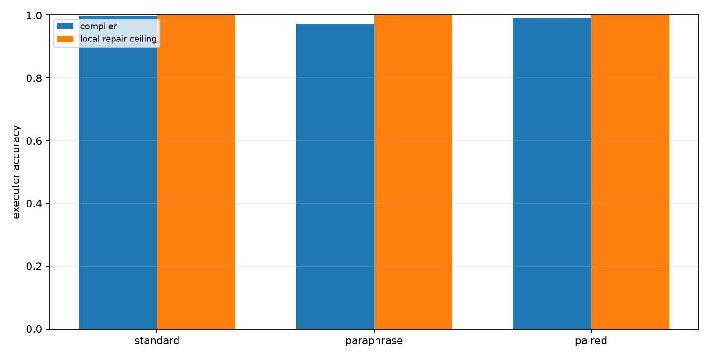
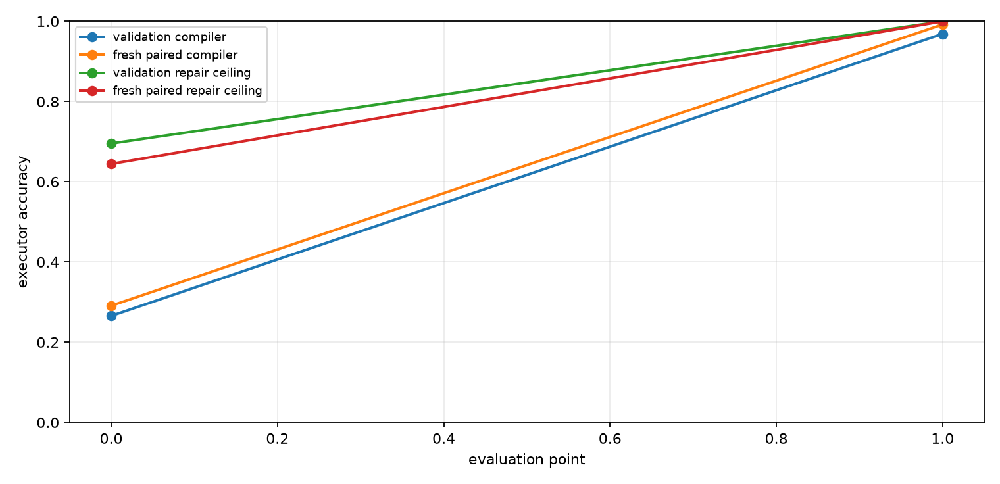
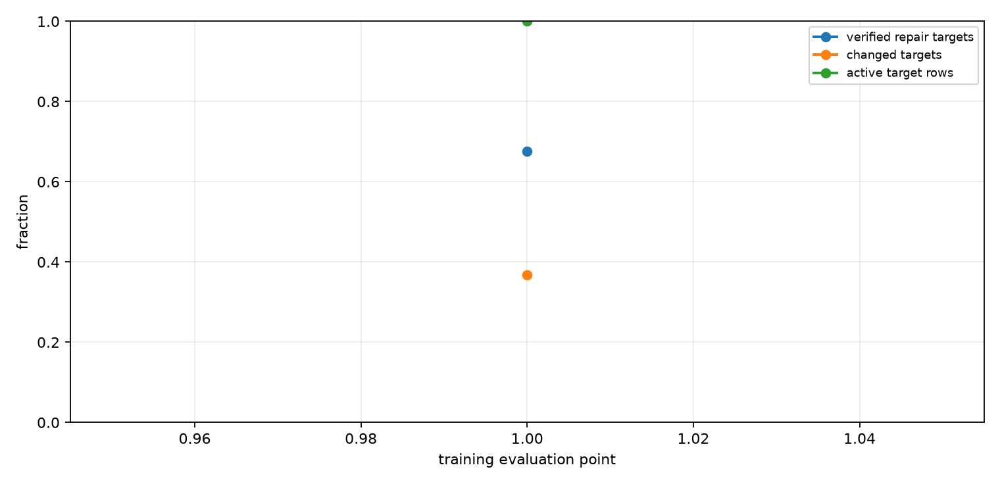
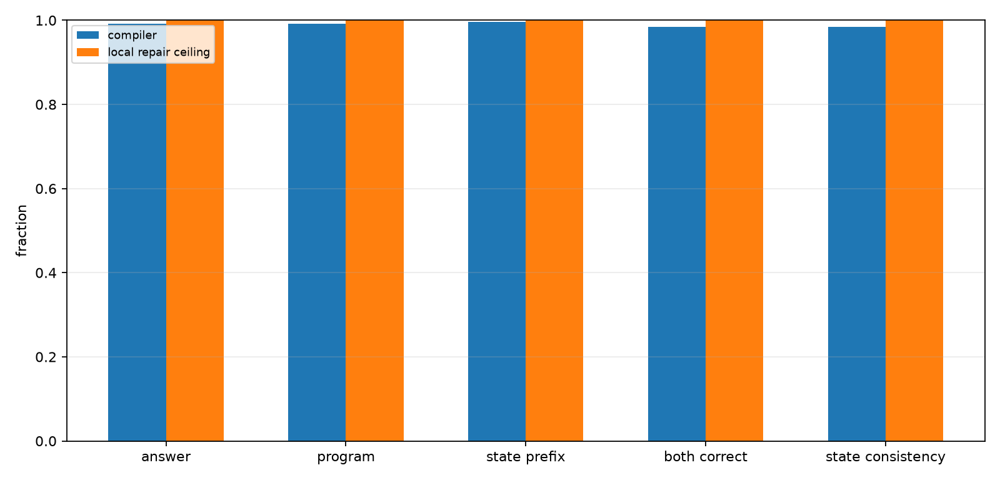
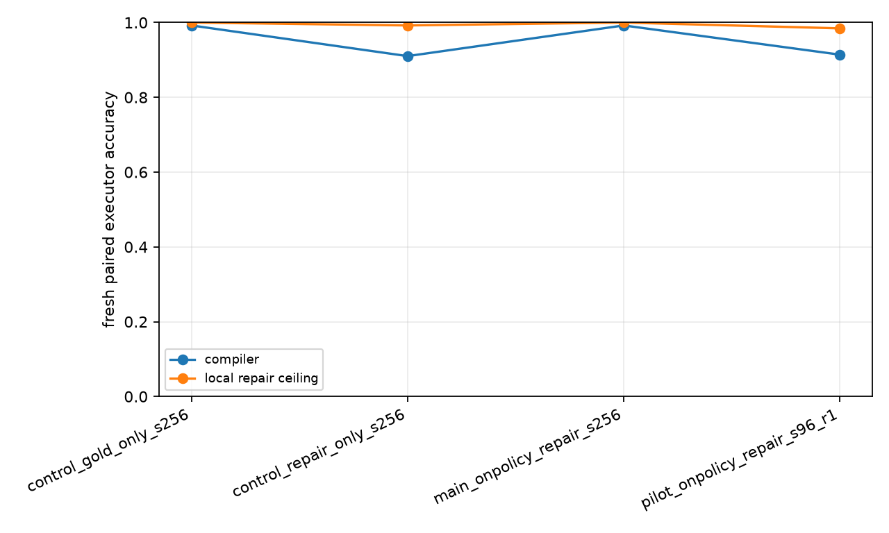

# Qwen On-Policy Repair-to-Compiler Training

## Abstract

This experiment tests whether verified local program repairs can be converted into a better Qwen-attached compiler policy. A QLoRA compiler emits an executable modular-arithmetic program from each prompt. The training loop runs the current compiler on its own prompts, enumerates nearby program edits, keeps targets that pass an exact execution verifier, and fine-tunes the same compiler toward those repaired targets.

## Setup

- Primary run: `main_onpolicy_repair_s256`
- Qwen substrate: `Qwen/Qwen3-4B`
- Modulus: `97`
- Max program length: `24`
- Train examples: `256`
- On-policy rounds: `1`
- Epochs per round: `1`
- Target mode: `repair_or_gold`
- Repair budget: top-k `3`, max edits `2`

The local repair column is a ceiling measured with target-aware verification during analysis and target construction. It is not a deployable inference path. The deployable model is the compiler row after fine-tuning.

## Results

### Final Splits

| Split                  | Compiler | Local repair ceiling | Program exact | State prefix | Repair found |
| ---------------------- | -------- | -------------------- | ------------- | ------------ | ------------ |
| val_len24              | 96.9%    | 100.0%               | 96.9%         | 98.9%        | 100.0%       |
| fresh_standard_len24   | 99.6%    | 100.0%               | 99.6%         | 99.6%        | 100.0%       |
| fresh_paraphrase_len24 | 97.3%    | 100.0%               | 97.3%         | 98.2%        | 100.0%       |
| fresh_paired_len24     | 99.2%    | 100.0%               | 99.2%         | 99.6%        | 100.0%       |



### Baseline To Final

| Split                  | Baseline compiler | Final compiler | Baseline repair ceiling | Final repair ceiling |
| ---------------------- | ----------------- | -------------- | ----------------------- | -------------------- |
| val_len24              | 26.6%             | 96.9%          | 69.5%                   | 100.0%               |
| fresh_standard_len24   | 28.5%             | 99.6%          | 67.2%                   | 100.0%               |
| fresh_paraphrase_len24 | 28.9%             | 97.3%          | 66.8%                   | 100.0%               |
| fresh_paired_len24     | 29.1%             | 99.2%          | 64.5%                   | 100.0%               |



### On-Policy Target Quality

| Round | Epoch | Verified repair targets | Changed targets | Active rows | Avg candidates | Avg verified |
| ----- | ----- | ----------------------- | --------------- | ----------- | -------------- | ------------ |
| 1     | 1     | 67.6%                   | 36.7%           | 100.0%      | 307.00         | 1.02         |



### Fresh Paired Details

| Metric                 | Compiler | Local repair ceiling |
| ---------------------- | -------- | -------------------- |
| Executor accuracy      | 99.2%    | 100.0%               |
| Program exact          | 99.2%    | 100.0%               |
| State prefix fraction  | 99.6%    | 100.0%               |
| Pair both-correct      | 98.4%    | 100.0%               |
| Pair state consistency | 98.4%    | 100.0%               |



### Run Summary

| Run                          | Fresh paired compiler | Fresh paired repair ceiling | Repair found | Program exact |
| ---------------------------- | --------------------- | --------------------------- | ------------ | ------------- |
| control_gold_only_s256       | 99.2%                 | 100.0%                      | 100.0%       | 99.2%         |
| control_repair_only_s256     | 91.0%                 | 99.2%                       | 99.2%        | 91.0%         |
| main_onpolicy_repair_s256    | 99.2%                 | 100.0%                      | 100.0%       | 99.2%         |
| pilot_onpolicy_repair_s96_r1 | 91.4%                 | 98.4%                       | 98.4%        | 90.6%         |



## Interpretation

On the fresh paired split, the compiler moves from 29.1% at the initial evaluation point to 99.2% after on-policy repair training. The measured local repair ceiling at the end is 100.0%, so the compiler recovers 98.9% of the initial compiler-to-repair gap.

Attribution is sharper with controls. The gold-only control reaches 99.2% fresh paired accuracy, matching the mixed repair-or-gold run. The repair-only control, with gold auxiliary losses disabled and unverified rows skipped, still reaches 91.0%. So the headline gain is a real compiler-policy improvement, but it is not uniquely caused by repaired targets; dense gold trace supervision is sufficient under this budget, while verified local repairs alone provide a strong but weaker training signal.

The key result is therefore narrower and more useful: a small amount of trace-level posttraining can turn a weak executable-program compiler into a near-ceiling compiler on fresh prompts, and target-aware local repairs provide a deployable training signal even when gold fallback is removed.

## Limitations

- The task is synthetic modular arithmetic.
- Target construction uses exact execution verification.
- The compiler head and deterministic runtime are specialized to copied numeric programs.
- The local repair ceiling is target-aware and should be read only as headroom.
- The primary result is one run unless more runs are added to the directory.

## Artifacts

Small experiment files live in:

```text
experiments/qwen_onpolicy_repair_compiler/
```

Large artifacts live in:

```text
large_artifacts/qwen_onpolicy_repair_compiler/checkpoints/
```

Primary files:

- `analysis/summary.md`
- `analysis/final_metrics.csv`
- `analysis/all_final_metrics.csv`
- `analysis/figures/executor_accuracy.png`
- `analysis/figures/paired_details.png`
- `analysis/figures/training_curve.png`
- `analysis/figures/target_quality.png`
- `analysis/figures/iteration_summary.png`
- `runs/main_onpolicy_repair_s256/metrics.csv`
- `runs/main_onpolicy_repair_s256/train_log.csv`
- `reports/qwen_onpolicy_repair_compiler_paper.md`
- `reports/qwen_onpolicy_repair_compiler_paper.html`
- `checkpoint_manifest.csv`
