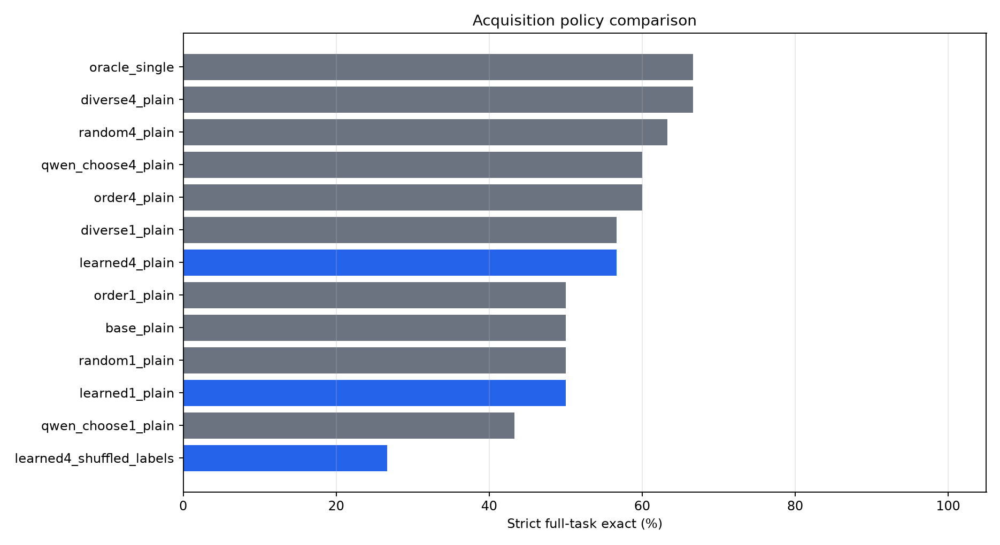
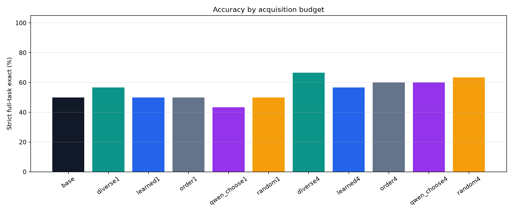
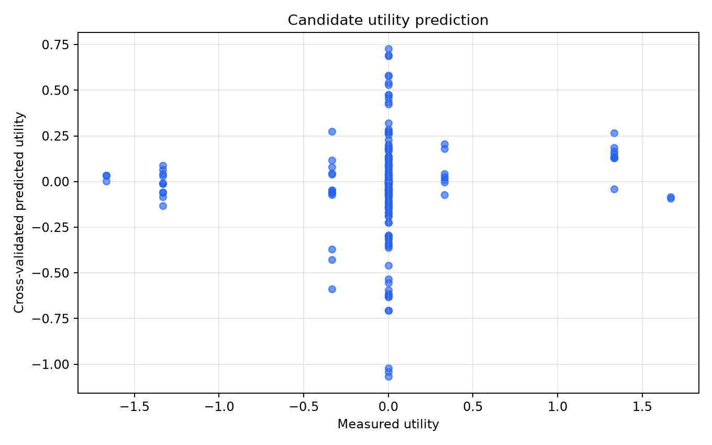
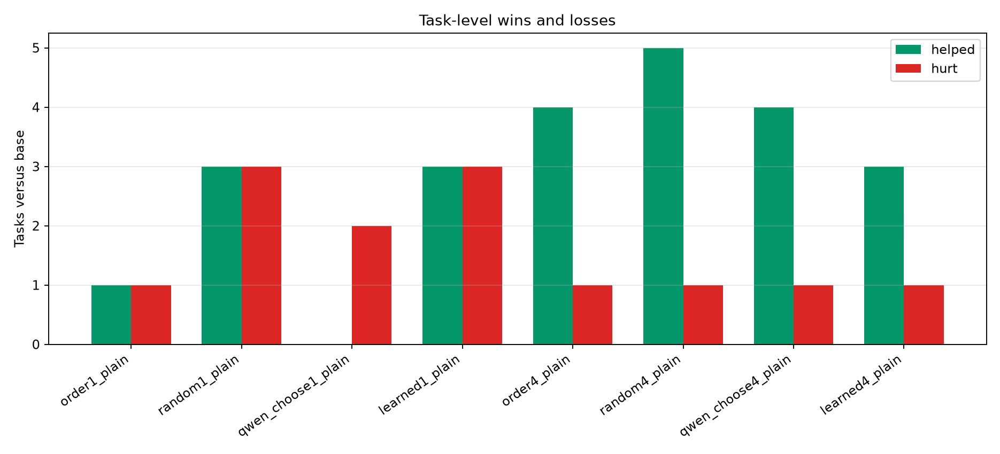
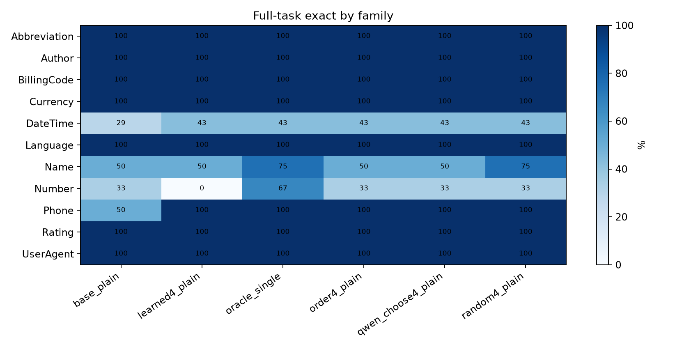

# Oracle-Distilled Acquisition Policy

## Question

Can a supervised acquisition-row scorer choose more useful clarifying examples than fixed, random, or model-chosen acquisition policies?

Each task starts with a small visible set. For every candidate acquisition row, the experiment measures downstream utility by revealing that row's true output and then scoring held-out answers. A cross-validated scorer is trained on other tasks to predict candidate utility for a held-out task.

## Setup

- Run: `main_v1`
- Dataset: public text-transformation tasks.
- Tasks: `30`
- Visible examples per task: `2`
- Acquisition pool examples per task: `6`
- Held-out evaluation rows per task: `3`
- Cross-validation folds: `5`
- Generation records: `1320`

## Main Result

|method|tasks|mean_budget|row_exact|full_task_exact|
|---|---|---|---|---|
|diverse4_plain|30|4.00|76.7%|66.7%|
|oracle_single|30|1.00|78.9%|66.7%|
|random4_plain|30|4.00|75.6%|63.3%|
|order4_plain|30|4.00|72.2%|60.0%|
|qwen_choose4_plain|30|4.00|71.1%|60.0%|
|diverse1_plain|30|1.00|67.8%|56.7%|
|learned4_plain|30|4.00|71.1%|56.7%|
|learned1_plain|30|1.00|65.6%|50.0%|
|base_plain|30|0.00|67.8%|50.0%|
|random1_plain|30|1.00|66.7%|50.0%|
|order1_plain|30|1.00|66.7%|50.0%|
|qwen_choose1_plain|30|1.00|63.3%|43.3%|
|learned4_shuffled_labels|30|4.00|51.1%|26.7%|

## Interpretation

The no-acquisition baseline solves `50.0%` of tasks. The learned scorer solves `50.0%` with one acquired label and `56.7%` with `4` acquired labels. At the same `4`-label budget, fixed-order acquisition solves `60.0%`, random acquisition solves `63.3%`, and Qwen-chosen acquisition solves `60.0%`.

The shuffled-label control for learned `4`-label acquisition solves `26.7%`. The hidden single-acquisition oracle solves `66.7%`, measuring how much headroom exists if the best single row is known.

## Verdict

Mixed negative: learned acquisition uses real signal but is not the best policy. It improves over no acquisition (50.0% -> 56.7%) and separates from shuffled labels (26.7%), but loses to the strongest non-oracle baseline (diverse 4-label, 66.7%). It helps 3 tasks and hurts 1 tasks versus the base prompt.

The strict win condition is learned acquisition beating fixed-order, random, diverse, and Qwen-chosen acquisition at the same label budget while separating from the shuffled-label control. This run should therefore be read by comparing learned acquisition to the best non-oracle baseline, not only to the no-acquisition prompt.

## Charts

## Fold Diagnostics

|fold|train_tasks|test_tasks|candidate_auc|mean_true_utility|mean_predicted_utility|
|---|---|---|---|---|---|
|0|24|6||-20.4%|-5.2%|
|1|24|6|43.8%|-11.1%|2.3%|
|2|24|6|74.3%|0.0%|1.2%|
|3|24|6|96.1%|11.1%|2.1%|
|4|24|6|75.8%|2.8%|-11.1%|

## Candidate Utility Examples

|task_id|family|candidate_idx|utility|utility_row_exact|utility_full_exact|predicted_utility|
|---|---|---|---|---|---|---|
|Abbreviation.000001|Abbreviation|5|0.0%|100.0%|True|-1.3%|
|Abbreviation.000001|Abbreviation|1|0.0%|100.0%|True|-2.5%|
|Abbreviation.000001|Abbreviation|0|0.0%|100.0%|True|-3.3%|
|Abbreviation.000001|Abbreviation|4|0.0%|100.0%|True|-4.2%|
|Abbreviation.000001|Abbreviation|3|0.0%|100.0%|True|-4.3%|
|Abbreviation.000001|Abbreviation|2|0.0%|100.0%|True|-4.4%|
|Author.000001|Author|3|0.0%|100.0%|True|-1.8%|
|Author.000001|Author|2|0.0%|100.0%|True|-3.5%|
|Author.000001|Author|5|0.0%|100.0%|True|-4.5%|
|Author.000001|Author|4|0.0%|100.0%|True|-13.6%|
|Author.000001|Author|0|0.0%|100.0%|True|-29.7%|
|Author.000001|Author|1|0.0%|100.0%|True|-46.0%|
|BillingCode.000002|BillingCode|2|0.0%|100.0%|True|0.6%|
|BillingCode.000002|BillingCode|0|0.0%|100.0%|True|-4.7%|
|BillingCode.000002|BillingCode|1|0.0%|100.0%|True|-4.8%|
|BillingCode.000002|BillingCode|3|0.0%|100.0%|True|-5.3%|
|BillingCode.000002|BillingCode|5|0.0%|100.0%|True|-5.4%|
|BillingCode.000002|BillingCode|4|0.0%|100.0%|True|-5.7%|
|Currency.000004|Currency|0|0.0%|100.0%|True|-18.6%|
|Currency.000004|Currency|1|0.0%|100.0%|True|-18.9%|
|Currency.000004|Currency|2|0.0%|100.0%|True|-22.4%|
|Currency.000004|Currency|3|0.0%|100.0%|True|-30.0%|
|Currency.000004|Currency|4|0.0%|100.0%|True|-34.3%|
|Currency.000004|Currency|5|0.0%|100.0%|True|-36.3%|
|DateTime.000014|DateTime|1|-33.3%|0.0%|False|-4.9%|
|DateTime.000014|DateTime|5|-33.3%|0.0%|False|-37.1%|
|DateTime.000014|DateTime|4|-33.3%|0.0%|False|-42.9%|
|DateTime.000014|DateTime|2|0.0%|33.3%|False|-55.4%|
|DateTime.000014|DateTime|3|-33.3%|0.0%|False|-58.8%|
|DateTime.000014|DateTime|0|0.0%|33.3%|False|-62.0%|
|DateTime.000018|DateTime|0|-133.3%|66.7%|False|-5.8%|
|DateTime.000018|DateTime|3|0.0%|100.0%|True|-7.1%|
|DateTime.000018|DateTime|2|0.0%|100.0%|True|-7.6%|
|DateTime.000018|DateTime|1|-133.3%|66.7%|False|-8.4%|
|DateTime.000018|DateTime|5|0.0%|100.0%|True|-10.7%|
|DateTime.000018|DateTime|4|-133.3%|66.7%|False|-13.4%|
|DateTime.000027|DateTime|3|0.0%|66.7%|False|12.6%|
|DateTime.000027|DateTime|2|-33.3%|33.3%|False|11.8%|
|DateTime.000027|DateTime|0|-33.3%|33.3%|False|4.5%|
|DateTime.000027|DateTime|4|0.0%|66.7%|False|-7.0%|
|DateTime.000027|DateTime|5|0.0%|66.7%|False|-8.1%|
|DateTime.000027|DateTime|1|0.0%|66.7%|False|-14.4%|
|DateTime.000029|DateTime|2|0.0%|33.3%|False|8.0%|
|DateTime.000029|DateTime|3|0.0%|33.3%|False|3.9%|
|DateTime.000029|DateTime|0|0.0%|33.3%|False|0.6%|
|DateTime.000029|DateTime|5|0.0%|33.3%|False|-6.4%|
|DateTime.000029|DateTime|4|0.0%|33.3%|False|-63.2%|
|DateTime.000029|DateTime|1|0.0%|33.3%|False|-70.6%|
|DateTime.000030|DateTime|2|-33.3%|0.0%|False|8.0%|
|DateTime.000030|DateTime|3|-33.3%|0.0%|False|3.9%|
|DateTime.000030|DateTime|0|0.0%|33.3%|False|0.6%|
|DateTime.000030|DateTime|5|-33.3%|0.0%|False|-6.4%|
|DateTime.000030|DateTime|4|0.0%|33.3%|False|-63.2%|
|DateTime.000030|DateTime|1|0.0%|33.3%|False|-70.6%|
|DateTime.000092|DateTime|2|0.0%|100.0%|True|-11.7%|
|DateTime.000092|DateTime|1|0.0%|100.0%|True|-13.0%|
|DateTime.000092|DateTime|0|0.0%|100.0%|True|-14.0%|
|DateTime.000092|DateTime|3|0.0%|100.0%|True|-53.5%|
|DateTime.000092|DateTime|5|0.0%|100.0%|True|-59.5%|
|DateTime.000092|DateTime|4|0.0%|100.0%|True|-61.3%|
|DateTime.000096|DateTime|5|0.0%|66.7%|False|27.8%|
|DateTime.000096|DateTime|4|133.3%|100.0%|True|15.1%|
|DateTime.000096|DateTime|3|133.3%|100.0%|True|13.2%|
|DateTime.000096|DateTime|0|0.0%|66.7%|False|9.6%|
|DateTime.000096|DateTime|2|0.0%|66.7%|False|9.3%|
|DateTime.000096|DateTime|1|0.0%|66.7%|False|8.9%|
|DateTime.000102|DateTime|5|-133.3%|66.7%|False|8.7%|
|DateTime.000102|DateTime|4|-133.3%|66.7%|False|6.6%|
|DateTime.000102|DateTime|1|0.0%|100.0%|True|0.9%|
|DateTime.000102|DateTime|0|0.0%|100.0%|True|0.7%|
|DateTime.000102|DateTime|3|-166.7%|33.3%|False|0.3%|
|DateTime.000102|DateTime|2|0.0%|100.0%|True|0.0%|
|DateTime.000106|DateTime|5|0.0%|0.0%|False|43.6%|
|DateTime.000106|DateTime|4|0.0%|0.0%|False|42.4%|
|DateTime.000106|DateTime|3|0.0%|0.0%|False|26.8%|
|DateTime.000106|DateTime|1|33.3%|33.3%|False|20.6%|
|DateTime.000106|DateTime|0|0.0%|0.0%|False|17.9%|
|DateTime.000106|DateTime|2|0.0%|0.0%|False|17.3%|
|DateTime.000110|DateTime|1|33.3%|66.7%|False|2.6%|
|DateTime.000110|DateTime|0|33.3%|66.7%|False|1.1%|
|DateTime.000110|DateTime|2|0.0%|33.3%|False|-0.0%|
|DateTime.000110|DateTime|3|33.3%|66.7%|False|-7.3%|
|DateTime.000110|DateTime|4|166.7%|100.0%|True|-8.2%|
|DateTime.000110|DateTime|5|166.7%|100.0%|True|-9.2%|
|DateTime.000112|DateTime|0|0.0%|100.0%|True|-16.7%|
|DateTime.000112|DateTime|1|0.0%|100.0%|True|-17.3%|
|DateTime.000112|DateTime|2|0.0%|100.0%|True|-22.3%|
|DateTime.000112|DateTime|3|0.0%|100.0%|True|-102.2%|
|DateTime.000112|DateTime|5|0.0%|100.0%|True|-104.1%|
|DateTime.000112|DateTime|4|0.0%|100.0%|True|-106.7%|
|DateTime.000113|DateTime|5|0.0%|0.0%|False|13.8%|
|DateTime.000113|DateTime|4|0.0%|0.0%|False|12.3%|
|DateTime.000113|DateTime|3|0.0%|0.0%|False|11.2%|
|DateTime.000113|DateTime|1|33.3%|33.3%|False|4.2%|
|DateTime.000113|DateTime|0|0.0%|0.0%|False|3.2%|
|DateTime.000113|DateTime|2|0.0%|0.0%|False|2.6%|
|DateTime.000114|DateTime|1|0.0%|0.0%|False|16.9%|
|DateTime.000114|DateTime|0|0.0%|0.0%|False|8.9%|
|DateTime.000114|DateTime|2|0.0%|0.0%|False|6.0%|
|DateTime.000114|DateTime|3|33.3%|33.3%|False|-0.4%|
|DateTime.000114|DateTime|4|0.0%|0.0%|False|-0.4%|
|DateTime.000114|DateTime|5|0.0%|0.0%|False|-1.0%|
|DateTime.000116|DateTime|4|0.0%|33.3%|False|69.4%|
|DateTime.000116|DateTime|5|0.0%|33.3%|False|68.8%|
|DateTime.000116|DateTime|3|0.0%|33.3%|False|32.1%|
|DateTime.000116|DateTime|1|0.0%|33.3%|False|22.8%|
|DateTime.000116|DateTime|0|0.0%|33.3%|False|20.4%|
|DateTime.000116|DateTime|2|0.0%|33.3%|False|19.6%|
|Language.000001|Language|4|0.0%|100.0%|True|1.7%|
|Language.000001|Language|0|0.0%|100.0%|True|-0.2%|
|Language.000001|Language|1|0.0%|100.0%|True|-0.2%|
|Language.000001|Language|2|0.0%|100.0%|True|-0.2%|
|Language.000001|Language|3|0.0%|100.0%|True|-0.6%|
|Language.000001|Language|5|0.0%|100.0%|True|-6.7%|
|Name.000008|Name|0|-33.3%|0.0%|False|27.4%|
|Name.000008|Name|1|0.0%|33.3%|False|26.9%|
|Name.000008|Name|5|0.0%|33.3%|False|7.3%|
|Name.000008|Name|4|0.0%|33.3%|False|-0.5%|
|Name.000008|Name|2|0.0%|33.3%|False|-7.4%|
|Name.000008|Name|3|0.0%|33.3%|False|-12.0%|

## Task-Level Learned Versus Base

|task_id|base|learned_budget|learned_indices|order_budget|learned_helped|learned_hurt|
|---|---|---|---|---|---|---|
|DateTime.000096|False|True|[5, 4, 3, 0]|False|True|False|
|DateTime.000110|False|True|[1, 0, 2, 3]|True|True|False|
|Phone.000002|False|True|[5, 2, 1, 4]|True|True|False|
|Abbreviation.000001|True|True|[5, 1, 0, 4]|True|False|False|
|Author.000001|True|True|[3, 2, 5, 4]|True|False|False|
|BillingCode.000002|True|True|[2, 0, 1, 3]|True|False|False|
|Currency.000004|True|True|[0, 1, 2, 3]|True|False|False|
|DateTime.000014|False|False|[1, 5, 4, 2]|False|False|False|
|DateTime.000018|True|True|[0, 3, 2, 1]|True|False|False|
|DateTime.000027|False|False|[3, 2, 0, 4]|True|False|False|
|DateTime.000029|False|False|[2, 3, 0, 5]|False|False|False|
|DateTime.000030|False|False|[2, 3, 0, 5]|False|False|False|
|DateTime.000092|True|True|[2, 1, 0, 3]|True|False|False|
|DateTime.000102|True|True|[5, 4, 1, 0]|True|False|False|
|DateTime.000106|False|False|[5, 4, 3, 1]|False|False|False|
|DateTime.000112|True|True|[0, 1, 2, 3]|True|False|False|
|DateTime.000113|False|False|[5, 4, 3, 1]|False|False|False|
|DateTime.000114|False|False|[1, 0, 2, 3]|False|False|False|
|DateTime.000116|False|False|[4, 5, 3, 1]|False|False|False|
|Language.000001|True|True|[4, 0, 1, 2]|True|False|False|
|Name.000008|False|False|[0, 1, 5, 4]|False|False|False|
|Name.000009|True|True|[1, 3, 2, 0]|True|False|False|
|Name.000010|False|False|[4, 1, 5, 3]|False|False|False|
|Name.000013|True|True|[5, 1, 2, 3]|True|False|False|
|Number.000015|False|False|[2, 5, 1, 3]|True|False|False|
|Number.000071|False|False|[4, 5, 3, 1]|False|False|False|
|Phone.000003|True|True|[1, 0, 2, 4]|True|False|False|
|Rating.000001|True|True|[4, 5, 0, 1]|True|False|False|
|UserAgent.000006|True|True|[0, 4, 3, 1]|True|False|False|
|Number.000086|True|False|[3, 0, 5, 2]|False|False|True|

## Family Breakdown

|method|family|tasks|row_exact|full_task_exact|
|---|---|---|---|---|
|base_plain|Abbreviation|1|100.0%|100.0%|
|base_plain|Author|1|100.0%|100.0%|
|base_plain|BillingCode|1|100.0%|100.0%|
|base_plain|Currency|1|100.0%|100.0%|
|base_plain|DateTime|14|50.0%|28.6%|
|base_plain|Language|1|100.0%|100.0%|
|base_plain|Name|4|75.0%|50.0%|
|base_plain|Number|3|55.6%|33.3%|
|base_plain|Phone|2|83.3%|50.0%|
|base_plain|Rating|1|100.0%|100.0%|
|base_plain|UserAgent|1|100.0%|100.0%|
|diverse1_plain|Abbreviation|1|100.0%|100.0%|
|diverse1_plain|Author|1|100.0%|100.0%|
|diverse1_plain|BillingCode|1|100.0%|100.0%|
|diverse1_plain|Currency|1|100.0%|100.0%|
|diverse1_plain|DateTime|14|47.6%|28.6%|
|diverse1_plain|Language|1|100.0%|100.0%|
|diverse1_plain|Name|4|66.7%|50.0%|
|diverse1_plain|Number|3|66.7%|66.7%|
|diverse1_plain|Phone|2|100.0%|100.0%|
|diverse1_plain|Rating|1|100.0%|100.0%|
|diverse1_plain|UserAgent|1|100.0%|100.0%|
|diverse4_plain|Abbreviation|1|100.0%|100.0%|
|diverse4_plain|Author|1|100.0%|100.0%|
|diverse4_plain|BillingCode|1|100.0%|100.0%|
|diverse4_plain|Currency|1|100.0%|100.0%|
|diverse4_plain|DateTime|14|61.9%|50.0%|
|diverse4_plain|Language|1|100.0%|100.0%|
|diverse4_plain|Name|4|83.3%|75.0%|
|diverse4_plain|Number|3|66.7%|33.3%|
|diverse4_plain|Phone|2|100.0%|100.0%|
|diverse4_plain|Rating|1|100.0%|100.0%|
|diverse4_plain|UserAgent|1|100.0%|100.0%|
|learned1_plain|Abbreviation|1|100.0%|100.0%|
|learned1_plain|Author|1|100.0%|100.0%|
|learned1_plain|BillingCode|1|100.0%|100.0%|
|learned1_plain|Currency|1|100.0%|100.0%|
|learned1_plain|DateTime|14|42.9%|14.3%|
|learned1_plain|Language|1|100.0%|100.0%|
|learned1_plain|Name|4|75.0%|75.0%|
|learned1_plain|Number|3|55.6%|33.3%|
|learned1_plain|Phone|2|100.0%|100.0%|
|learned1_plain|Rating|1|100.0%|100.0%|
|learned1_plain|UserAgent|1|100.0%|100.0%|
|learned4_plain|Abbreviation|1|100.0%|100.0%|
|learned4_plain|Author|1|100.0%|100.0%|
|learned4_plain|BillingCode|1|100.0%|100.0%|
|learned4_plain|Currency|1|100.0%|100.0%|
|learned4_plain|DateTime|14|54.8%|42.9%|
|learned4_plain|Language|1|100.0%|100.0%|
|learned4_plain|Name|4|83.3%|50.0%|
|learned4_plain|Number|3|44.4%|0.0%|
|learned4_plain|Phone|2|100.0%|100.0%|
|learned4_plain|Rating|1|100.0%|100.0%|
|learned4_plain|UserAgent|1|100.0%|100.0%|
|learned4_shuffled_labels|Abbreviation|1|33.3%|0.0%|
|learned4_shuffled_labels|Author|1|100.0%|100.0%|
|learned4_shuffled_labels|BillingCode|1|33.3%|0.0%|
|learned4_shuffled_labels|Currency|1|0.0%|0.0%|
|learned4_shuffled_labels|DateTime|14|45.2%|28.6%|
|learned4_shuffled_labels|Language|1|100.0%|100.0%|
|learned4_shuffled_labels|Name|4|66.7%|25.0%|
|learned4_shuffled_labels|Number|3|44.4%|0.0%|
|learned4_shuffled_labels|Phone|2|33.3%|0.0%|
|learned4_shuffled_labels|Rating|1|66.7%|0.0%|
|learned4_shuffled_labels|UserAgent|1|100.0%|100.0%|
|oracle_single|Abbreviation|1|100.0%|100.0%|
|oracle_single|Author|1|100.0%|100.0%|
|oracle_single|BillingCode|1|100.0%|100.0%|
|oracle_single|Currency|1|100.0%|100.0%|
|oracle_single|DateTime|14|64.3%|42.9%|
|oracle_single|Language|1|100.0%|100.0%|
|oracle_single|Name|4|83.3%|75.0%|
|oracle_single|Number|3|77.8%|66.7%|
|oracle_single|Phone|2|100.0%|100.0%|
|oracle_single|Rating|1|100.0%|100.0%|
|oracle_single|UserAgent|1|100.0%|100.0%|
|order1_plain|Abbreviation|1|100.0%|100.0%|
|order1_plain|Author|1|100.0%|100.0%|
|order1_plain|BillingCode|1|100.0%|100.0%|
|order1_plain|Currency|1|100.0%|100.0%|
|order1_plain|DateTime|14|47.6%|21.4%|
|order1_plain|Language|1|100.0%|100.0%|
|order1_plain|Name|4|66.7%|50.0%|
|order1_plain|Number|3|55.6%|33.3%|
|order1_plain|Phone|2|100.0%|100.0%|
|order1_plain|Rating|1|100.0%|100.0%|
|order1_plain|UserAgent|1|100.0%|100.0%|
|order4_plain|Abbreviation|1|100.0%|100.0%|
|order4_plain|Author|1|100.0%|100.0%|
|order4_plain|BillingCode|1|100.0%|100.0%|
|order4_plain|Currency|1|100.0%|100.0%|
|order4_plain|DateTime|14|57.1%|42.9%|
|order4_plain|Language|1|100.0%|100.0%|
|order4_plain|Name|4|75.0%|50.0%|
|order4_plain|Number|3|55.6%|33.3%|
|order4_plain|Phone|2|100.0%|100.0%|
|order4_plain|Rating|1|100.0%|100.0%|
|order4_plain|UserAgent|1|100.0%|100.0%|
|qwen_choose1_plain|Abbreviation|1|100.0%|100.0%|
|qwen_choose1_plain|Author|1|100.0%|100.0%|
|qwen_choose1_plain|BillingCode|1|100.0%|100.0%|
|qwen_choose1_plain|Currency|1|100.0%|100.0%|
|qwen_choose1_plain|DateTime|14|42.9%|21.4%|
|qwen_choose1_plain|Language|1|100.0%|100.0%|
|qwen_choose1_plain|Name|4|66.7%|25.0%|
|qwen_choose1_plain|Number|3|55.6%|33.3%|
|qwen_choose1_plain|Phone|2|83.3%|50.0%|
|qwen_choose1_plain|Rating|1|100.0%|100.0%|
|qwen_choose1_plain|UserAgent|1|100.0%|100.0%|
|qwen_choose4_plain|Abbreviation|1|100.0%|100.0%|
|qwen_choose4_plain|Author|1|100.0%|100.0%|
|qwen_choose4_plain|BillingCode|1|100.0%|100.0%|
|qwen_choose4_plain|Currency|1|100.0%|100.0%|
|qwen_choose4_plain|DateTime|14|52.4%|42.9%|
|qwen_choose4_plain|Language|1|100.0%|100.0%|
|qwen_choose4_plain|Name|4|83.3%|50.0%|
|qwen_choose4_plain|Number|3|55.6%|33.3%|
|qwen_choose4_plain|Phone|2|100.0%|100.0%|
|qwen_choose4_plain|Rating|1|100.0%|100.0%|
|qwen_choose4_plain|UserAgent|1|100.0%|100.0%|
|random1_plain|Abbreviation|1|100.0%|100.0%|
|random1_plain|Author|1|100.0%|100.0%|
|random1_plain|BillingCode|1|100.0%|100.0%|
|random1_plain|Currency|1|100.0%|100.0%|
|random1_plain|DateTime|14|52.4%|35.7%|
|random1_plain|Language|1|100.0%|100.0%|
|random1_plain|Name|4|58.3%|25.0%|
|random1_plain|Number|3|44.4%|0.0%|
|random1_plain|Phone|2|100.0%|100.0%|
|random1_plain|Rating|1|100.0%|100.0%|
|random1_plain|UserAgent|1|100.0%|100.0%|
|random4_plain|Abbreviation|1|100.0%|100.0%|
|random4_plain|Author|1|100.0%|100.0%|
|random4_plain|BillingCode|1|100.0%|100.0%|
|random4_plain|Currency|1|100.0%|100.0%|
|random4_plain|DateTime|14|59.5%|42.9%|
|random4_plain|Language|1|100.0%|100.0%|
|random4_plain|Name|4|91.7%|75.0%|
|random4_plain|Number|3|55.6%|33.3%|
|random4_plain|Phone|2|100.0%|100.0%|
|random4_plain|Rating|1|100.0%|100.0%|
|random4_plain|UserAgent|1|100.0%|100.0%|

## Files

- `runs/main_v1/generations.csv`
- `runs/main_v1/candidate_utilities.csv`
- `runs/main_v1/method_details.csv`
- `runs/main_v1/fold_diagnostics.csv`
- `analysis/*.csv`
- `analysis/figures/*.png`
