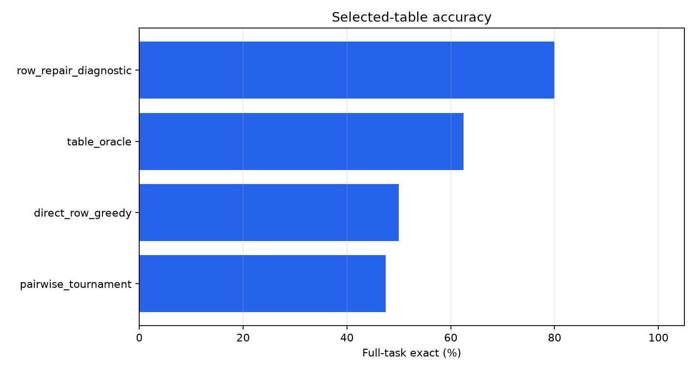
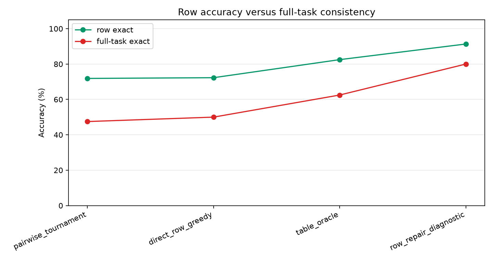
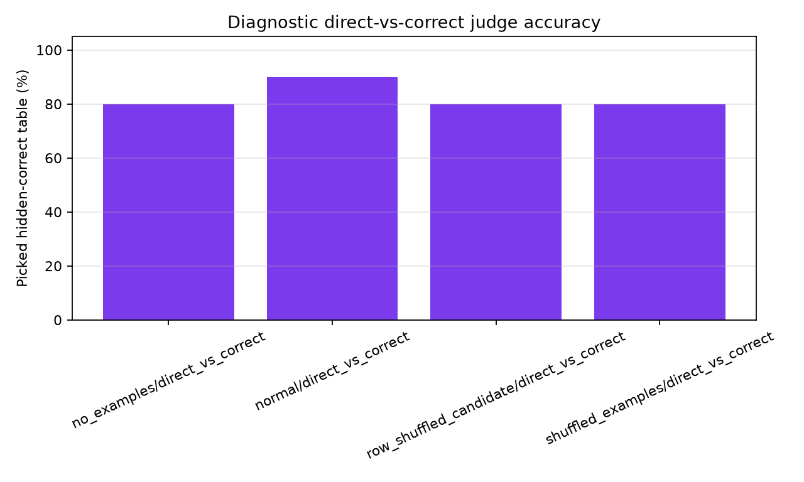
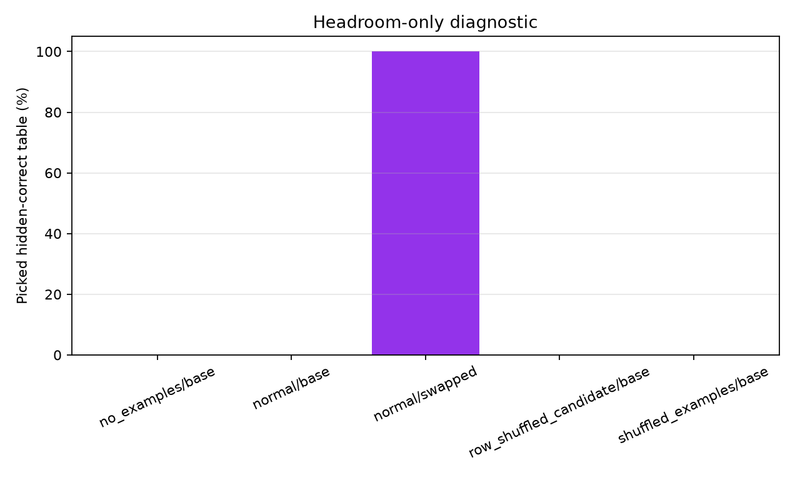
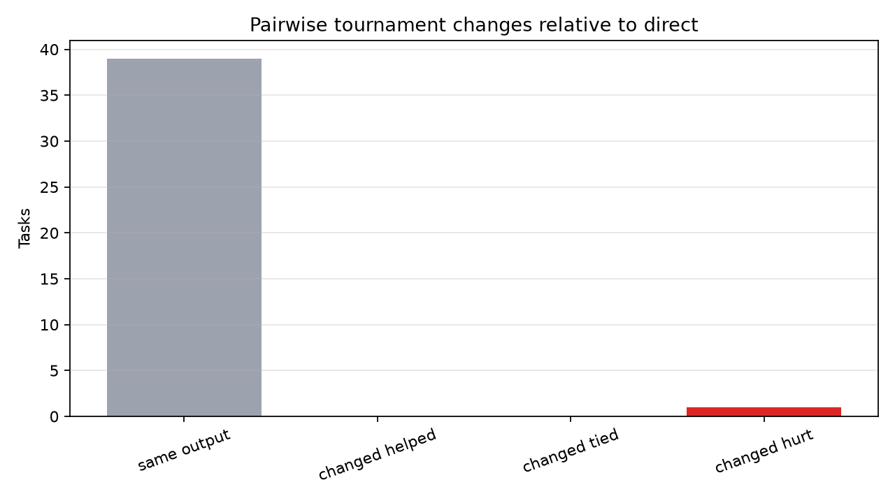
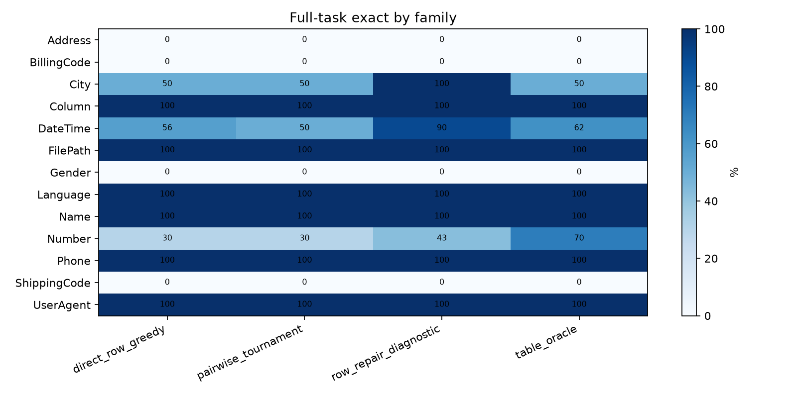

# Pairwise Table Judge

## Question

Can a model choose the more task-consistent full output table when shown examples, query rows, and two candidate tables?

This experiment evaluates pairwise table judging on public text-transformation tasks. The primary deployable method is a tournament over a non-label shortlist of candidate tables. A separate diagnostic compares direct greedy tables against hidden-correct tables when the hidden-correct table is present.

## Setup

- Benchmark root: `/workspace/large_artifacts/qwen_pairwise_table_judge/prose-benchmarks`
- Run: `main_qwen_pairwise_40`
- Tasks: 40
- Candidate table rows: 1370
- Pairwise judgment rows: 336
- Shortlist size: 6
- Train rows per task: 4
- Held-out cap per task: 6

## Main Result

|method|tasks|row_exact|full_task_exact|table_oracle_rate|median_candidate_tables|
|---|---|---|---|---|---|
|row_repair_diagnostic|25|91.3%|80.0%|100.0%|9.00|
|table_oracle|40|82.5%|62.5%|62.5%|9.50|
|direct_row_greedy|40|72.3%|50.0%|62.5%|9.50|
|pairwise_tournament|40|71.9%|47.5%|62.5%|9.50|

## Interpretation

The deployable pairwise tournament changes full-task exact by -2.5 points relative to direct greedy. The table oracle is 12.5 points above direct greedy, so any gap between tournament and oracle is selection headroom. In the all-oracle-task direct-vs-hidden-correct diagnostic, the normal judge picks the hidden-correct table 90.0% of the time, but that aggregate includes saturated tasks where direct and oracle are identical.

On the actual headroom subset, where direct greedy is wrong and a hidden-correct table exists, the normal judge picks the hidden-correct table 0.0% when direct is candidate A and 100.0% when the hidden-correct table is candidate A. This is the critical diagnostic: a large base/swapped gap indicates position bias rather than semantic table judging.

The row-repair diagnostic reaches 80.0% full-task exact. It is not deployable because it uses hidden oracle row alternatives; it measures whether the judge can accept correct row-level replacements when they are explicitly supplied.

## Charts

## Diagnostic Summary

|mode|pair_kind|comparisons|picked_oracle|direct_full_exact|oracle_full_exact|
|---|---|---|---|---|---|
|no_examples|direct_vs_correct|25|80.0%|80.0%|100.0%|
|normal|direct_vs_correct|50|90.0%|80.0%|100.0%|
|row_shuffled_candidate|direct_vs_correct|25|80.0%|80.0%|100.0%|
|shuffled_examples|direct_vs_correct|25|80.0%|80.0%|100.0%|

## Headroom-Only Diagnostic

|mode|order_tag|comparisons|unique_tasks|picked_oracle|picked_candidate_a|
|---|---|---|---|---|---|
|no_examples|base|5|5|0.0%|100.0%|
|normal|base|5|5|0.0%|100.0%|
|normal|swapped|5|5|100.0%|100.0%|
|row_shuffled_candidate|base|5|5|0.0%|100.0%|
|shuffled_examples|base|5|5|0.0%|100.0%|

## Selected Tables

|task_id|family|method|source|row_exact|full_task_exact|candidate_tables|table_candidate_oracle|
|---|---|---|---|---|---|---|---|
|Address.000002|Address|direct_row_greedy|row_greedy|33.3%|False|9|False|
|Address.000013|Address|direct_row_greedy|row_greedy|66.7%|False|17|False|
|BillingCode.000007|BillingCode|direct_row_greedy|row_greedy|33.3%|False|16|False|
|City.000010|City|direct_row_greedy|row_greedy|100.0%|True|9|True|
|City.000011|City|direct_row_greedy|row_greedy|75.0%|False|12|False|
|Column.000001|Column|direct_row_greedy|row_greedy|100.0%|True|9|True|
|DateTime.000004|DateTime|direct_row_greedy|row_greedy|100.0%|True|9|True|
|DateTime.000007|DateTime|direct_row_greedy|row_greedy|100.0%|True|9|True|
|DateTime.000017|DateTime|direct_row_greedy|row_greedy|100.0%|True|44|True|
|DateTime.000025|DateTime|direct_row_greedy|row_greedy|100.0%|True|16|True|
|DateTime.000027|DateTime|direct_row_greedy|row_greedy|50.0%|False|88|False|
|DateTime.000034|DateTime|direct_row_greedy|row_greedy|100.0%|True|9|True|
|DateTime.000051|DateTime|direct_row_greedy|row_greedy|33.3%|False|12|False|
|DateTime.000076|DateTime|direct_row_greedy|row_greedy|66.7%|False|14|True|
|DateTime.000081|DateTime|direct_row_greedy|row_greedy|50.0%|False|14|False|
|DateTime.000094|DateTime|direct_row_greedy|row_greedy|100.0%|True|9|True|
|DateTime.000104|DateTime|direct_row_greedy|row_greedy|100.0%|True|9|True|
|DateTime.000108|DateTime|direct_row_greedy|row_greedy|100.0%|True|9|True|
|DateTime.000111|DateTime|direct_row_greedy|row_greedy|100.0%|True|10|True|
|DateTime.000114|DateTime|direct_row_greedy|row_greedy|16.7%|False|512|False|
|DateTime.000115|DateTime|direct_row_greedy|row_greedy|0.0%|False|9|False|
|DateTime.000116|DateTime|direct_row_greedy|row_greedy|50.0%|False|9|False|
|FilePath.000001|FilePath|direct_row_greedy|row_greedy|100.0%|True|9|True|
|Gender.000001|Gender|direct_row_greedy|row_greedy|66.7%|False|11|False|
|Language.000002|Language|direct_row_greedy|row_greedy|100.0%|True|9|True|
|Name.000028|Name|direct_row_greedy|row_greedy|100.0%|True|9|True|
|Number.000008|Number|direct_row_greedy|row_greedy|33.3%|False|16|False|
|Number.000015|Number|direct_row_greedy|row_greedy|33.3%|False|224|True|
|Number.000016|Number|direct_row_greedy|row_greedy|83.3%|False|40|True|
|Number.000022|Number|direct_row_greedy|row_greedy|100.0%|True|32|True|
|Number.000028|Number|direct_row_greedy|row_greedy|100.0%|True|9|True|
|Number.000029|Number|direct_row_greedy|row_greedy|66.7%|False|14|False|
|Number.000043|Number|direct_row_greedy|row_greedy|100.0%|True|9|True|
|Number.000049|Number|direct_row_greedy|row_greedy|0.0%|False|56|False|
|Number.000075|Number|direct_row_greedy|row_greedy|66.7%|False|16|True|
|Number.000077|Number|direct_row_greedy|row_greedy|33.3%|False|26|True|
|Phone.000008|Phone|direct_row_greedy|row_greedy|100.0%|True|9|True|
|Phone.000011|Phone|direct_row_greedy|row_greedy|100.0%|True|9|True|
|ShippingCode.000008|ShippingCode|direct_row_greedy|row_greedy|33.3%|False|9|False|
|UserAgent.000003|UserAgent|direct_row_greedy|row_greedy|100.0%|True|9|True|
|Address.000002|Address|pairwise_tournament|row_greedy|33.3%|False|9|False|
|Address.000013|Address|pairwise_tournament|row_greedy|66.7%|False|17|False|
|BillingCode.000007|BillingCode|pairwise_tournament|row_greedy|33.3%|False|16|False|
|City.000010|City|pairwise_tournament|row_greedy|100.0%|True|9|True|
|City.000011|City|pairwise_tournament|row_greedy|75.0%|False|12|False|
|Column.000001|Column|pairwise_tournament|row_greedy|100.0%|True|9|True|
|DateTime.000004|DateTime|pairwise_tournament|row_greedy|100.0%|True|9|True|
|DateTime.000007|DateTime|pairwise_tournament|row_greedy|100.0%|True|9|True|
|DateTime.000017|DateTime|pairwise_tournament|row_greedy|100.0%|True|44|True|
|DateTime.000025|DateTime|pairwise_tournament|row_greedy|100.0%|True|16|True|
|DateTime.000027|DateTime|pairwise_tournament|row_greedy|50.0%|False|88|False|
|DateTime.000034|DateTime|pairwise_tournament|row_greedy|100.0%|True|9|True|
|DateTime.000051|DateTime|pairwise_tournament|row_greedy|33.3%|False|12|False|
|DateTime.000076|DateTime|pairwise_tournament|row_greedy|66.7%|False|14|True|
|DateTime.000081|DateTime|pairwise_tournament|row_greedy|50.0%|False|14|False|
|DateTime.000094|DateTime|pairwise_tournament|row_greedy|100.0%|True|9|True|
|DateTime.000104|DateTime|pairwise_tournament|row_greedy|100.0%|True|9|True|
|DateTime.000108|DateTime|pairwise_tournament|row_greedy|100.0%|True|9|True|
|DateTime.000111|DateTime|pairwise_tournament|batch_plain|83.3%|False|10|True|
|DateTime.000114|DateTime|pairwise_tournament|row_greedy|16.7%|False|512|False|
|DateTime.000115|DateTime|pairwise_tournament|row_greedy|0.0%|False|9|False|
|DateTime.000116|DateTime|pairwise_tournament|row_greedy|50.0%|False|9|False|
|FilePath.000001|FilePath|pairwise_tournament|row_greedy|100.0%|True|9|True|
|Gender.000001|Gender|pairwise_tournament|row_greedy|66.7%|False|11|False|
|Language.000002|Language|pairwise_tournament|row_greedy|100.0%|True|9|True|
|Name.000028|Name|pairwise_tournament|row_greedy|100.0%|True|9|True|
|Number.000008|Number|pairwise_tournament|row_greedy|33.3%|False|16|False|
|Number.000015|Number|pairwise_tournament|row_greedy|33.3%|False|224|True|
|Number.000016|Number|pairwise_tournament|row_greedy|83.3%|False|40|True|
|Number.000022|Number|pairwise_tournament|row_greedy|100.0%|True|32|True|
|Number.000028|Number|pairwise_tournament|row_greedy|100.0%|True|9|True|
|Number.000029|Number|pairwise_tournament|row_greedy|66.7%|False|14|False|
|Number.000043|Number|pairwise_tournament|row_greedy|100.0%|True|9|True|
|Number.000049|Number|pairwise_tournament|row_greedy|0.0%|False|56|False|
|Number.000075|Number|pairwise_tournament|row_greedy|66.7%|False|16|True|
|Number.000077|Number|pairwise_tournament|row_greedy|33.3%|False|26|True|
|Phone.000008|Phone|pairwise_tournament|row_greedy|100.0%|True|9|True|
|Phone.000011|Phone|pairwise_tournament|row_greedy|100.0%|True|9|True|
|ShippingCode.000008|ShippingCode|pairwise_tournament|row_greedy|33.3%|False|9|False|
|UserAgent.000003|UserAgent|pairwise_tournament|row_greedy|100.0%|True|9|True|
|City.000010|City|row_repair_diagnostic|row_repair_diagnostic|100.0%|True|9|True|
|Column.000001|Column|row_repair_diagnostic|row_repair_diagnostic|100.0%|True|9|True|
|DateTime.000004|DateTime|row_repair_diagnostic|row_repair_diagnostic|100.0%|True|9|True|
|DateTime.000007|DateTime|row_repair_diagnostic|row_repair_diagnostic|100.0%|True|9|True|
|DateTime.000017|DateTime|row_repair_diagnostic|row_repair_diagnostic|100.0%|True|44|True|
|DateTime.000025|DateTime|row_repair_diagnostic|row_repair_diagnostic|100.0%|True|16|True|
|DateTime.000034|DateTime|row_repair_diagnostic|row_repair_diagnostic|100.0%|True|9|True|
|DateTime.000076|DateTime|row_repair_diagnostic|row_repair_diagnostic|66.7%|False|14|True|
|DateTime.000094|DateTime|row_repair_diagnostic|row_repair_diagnostic|100.0%|True|9|True|
|DateTime.000104|DateTime|row_repair_diagnostic|row_repair_diagnostic|100.0%|True|9|True|
|DateTime.000108|DateTime|row_repair_diagnostic|row_repair_diagnostic|100.0%|True|9|True|
|DateTime.000111|DateTime|row_repair_diagnostic|row_repair_diagnostic|100.0%|True|10|True|
|FilePath.000001|FilePath|row_repair_diagnostic|row_repair_diagnostic|100.0%|True|9|True|
|Language.000002|Language|row_repair_diagnostic|row_repair_diagnostic|100.0%|True|9|True|
|Name.000028|Name|row_repair_diagnostic|row_repair_diagnostic|100.0%|True|9|True|
|Number.000015|Number|row_repair_diagnostic|row_repair_diagnostic|33.3%|False|224|True|
|Number.000016|Number|row_repair_diagnostic|row_repair_diagnostic|83.3%|False|40|True|
|Number.000022|Number|row_repair_diagnostic|row_repair_diagnostic|100.0%|True|32|True|
|Number.000028|Number|row_repair_diagnostic|row_repair_diagnostic|100.0%|True|9|True|
|Number.000043|Number|row_repair_diagnostic|row_repair_diagnostic|100.0%|True|9|True|
|Number.000075|Number|row_repair_diagnostic|row_repair_diagnostic|66.7%|False|16|True|
|Number.000077|Number|row_repair_diagnostic|row_repair_diagnostic|33.3%|False|26|True|
|Phone.000008|Phone|row_repair_diagnostic|row_repair_diagnostic|100.0%|True|9|True|
|Phone.000011|Phone|row_repair_diagnostic|row_repair_diagnostic|100.0%|True|9|True|
|UserAgent.000003|UserAgent|row_repair_diagnostic|row_repair_diagnostic|100.0%|True|9|True|
|Address.000002|Address|table_oracle|row_greedy|33.3%|False|9|False|
|Address.000013|Address|table_oracle|row_greedy|66.7%|False|17|False|
|BillingCode.000007|BillingCode|table_oracle|row_greedy|33.3%|False|16|False|
|City.000010|City|table_oracle|row_greedy|100.0%|True|9|True|
|City.000011|City|table_oracle|row_greedy|75.0%|False|12|False|
|Column.000001|Column|table_oracle|row_greedy|100.0%|True|9|True|
|DateTime.000004|DateTime|table_oracle|row_greedy|100.0%|True|9|True|
|DateTime.000007|DateTime|table_oracle|row_greedy|100.0%|True|9|True|
|DateTime.000017|DateTime|table_oracle|row_greedy|100.0%|True|44|True|
|DateTime.000025|DateTime|table_oracle|row_greedy|100.0%|True|16|True|
|DateTime.000027|DateTime|table_oracle|row_combo|83.3%|False|88|False|
|DateTime.000034|DateTime|table_oracle|row_greedy|100.0%|True|9|True|
|DateTime.000051|DateTime|table_oracle|row_greedy|33.3%|False|12|False|
|DateTime.000076|DateTime|table_oracle|row_combo|100.0%|True|14|True|
|DateTime.000081|DateTime|table_oracle|batch_plain|66.7%|False|14|False|
|DateTime.000094|DateTime|table_oracle|row_greedy|100.0%|True|9|True|
|DateTime.000104|DateTime|table_oracle|row_greedy|100.0%|True|9|True|
|DateTime.000108|DateTime|table_oracle|row_greedy|100.0%|True|9|True|
|DateTime.000111|DateTime|table_oracle|row_greedy|100.0%|True|10|True|
|DateTime.000114|DateTime|table_oracle|row_combo|66.7%|False|512|False|
|DateTime.000115|DateTime|table_oracle|row_greedy|0.0%|False|9|False|
|DateTime.000116|DateTime|table_oracle|row_greedy|50.0%|False|9|False|
|FilePath.000001|FilePath|table_oracle|row_greedy|100.0%|True|9|True|
|Gender.000001|Gender|table_oracle|row_greedy|66.7%|False|11|False|
|Language.000002|Language|table_oracle|row_greedy|100.0%|True|9|True|
|Name.000028|Name|table_oracle|row_greedy|100.0%|True|9|True|
|Number.000008|Number|table_oracle|row_sample0|50.0%|False|16|False|
|Number.000015|Number|table_oracle|row_combo|100.0%|True|224|True|
|Number.000016|Number|table_oracle|row_combo|100.0%|True|40|True|
|Number.000022|Number|table_oracle|row_greedy|100.0%|True|32|True|
|Number.000028|Number|table_oracle|row_greedy|100.0%|True|9|True|
|Number.000029|Number|table_oracle|row_greedy|66.7%|False|14|False|
|Number.000043|Number|table_oracle|row_greedy|100.0%|True|9|True|
|Number.000049|Number|table_oracle|row_combo|75.0%|False|56|False|
|Number.000075|Number|table_oracle|batch_plain|100.0%|True|16|True|
|Number.000077|Number|table_oracle|row_combo|100.0%|True|26|True|
|Phone.000008|Phone|table_oracle|row_greedy|100.0%|True|9|True|
|Phone.000011|Phone|table_oracle|row_greedy|100.0%|True|9|True|
|ShippingCode.000008|ShippingCode|table_oracle|row_greedy|33.3%|False|9|False|
|UserAgent.000003|UserAgent|table_oracle|row_greedy|100.0%|True|9|True|

## Tournament Changes

|task_id|family|direct_source|tournament_source|direct_row_exact|tournament_row_exact|direct_full_exact|tournament_full_exact|delta_row_exact|delta_full_exact|
|---|---|---|---|---|---|---|---|---|---|
|DateTime.000111|DateTime|row_greedy|batch_plain|100.0%|83.3%|True|False|-16.7%|-100.0%|

## Files

- `runs/main_qwen_pairwise_40/table_candidates.csv`
- `runs/main_qwen_pairwise_40/oracle_summary.csv`
- `runs/main_qwen_pairwise_40/pairwise_judgments.csv`
- `runs/main_qwen_pairwise_40/judge_details.csv`
- `runs/main_qwen_pairwise_40/selected_tables.csv`
- `runs/main_qwen_pairwise_40/diagnostic_direct_vs_correct.csv`
- `analysis/summary.csv`
- `analysis/diagnostic_summary.csv`
- `analysis/diagnostic_headroom_summary.csv`
- `analysis/tournament_changes.csv`
- `analysis/selected_tables.csv`
- `analysis/judge_details.csv`
