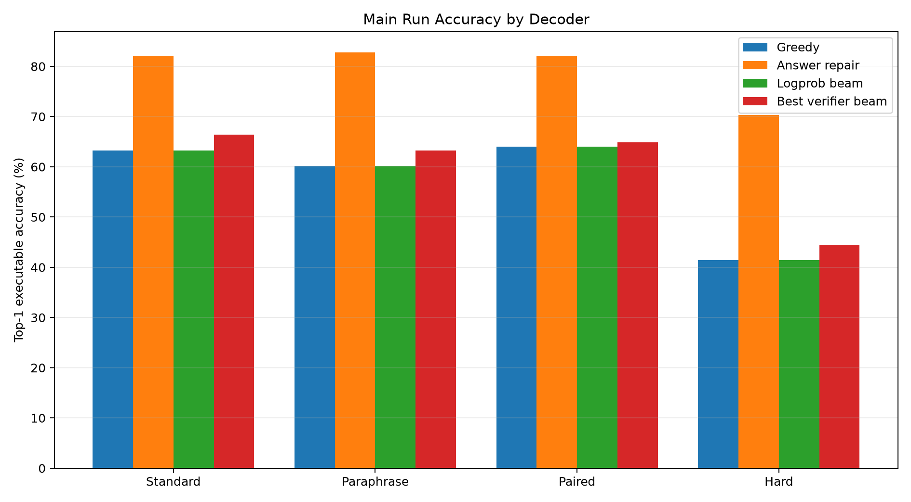
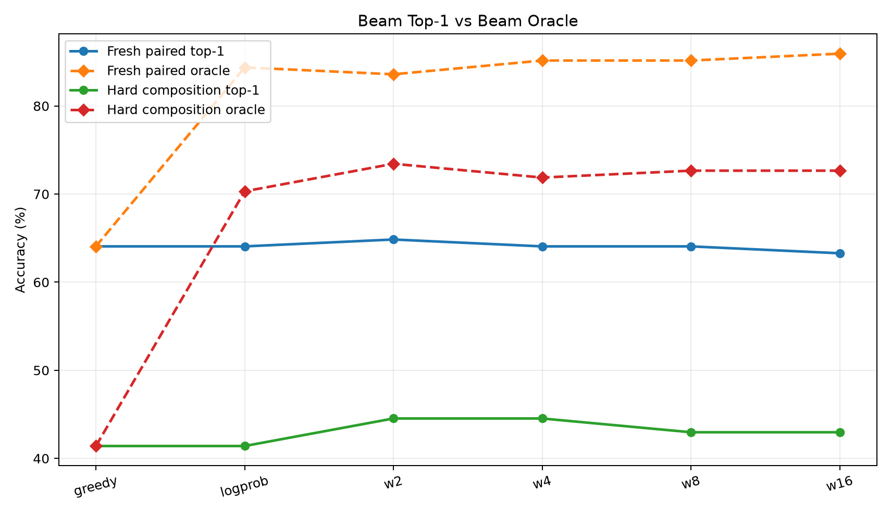
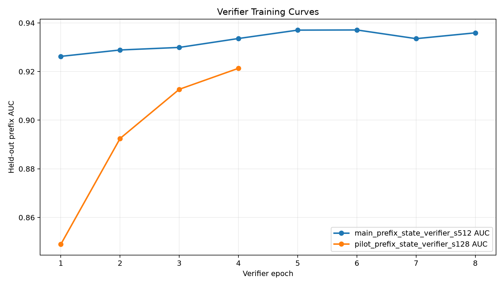
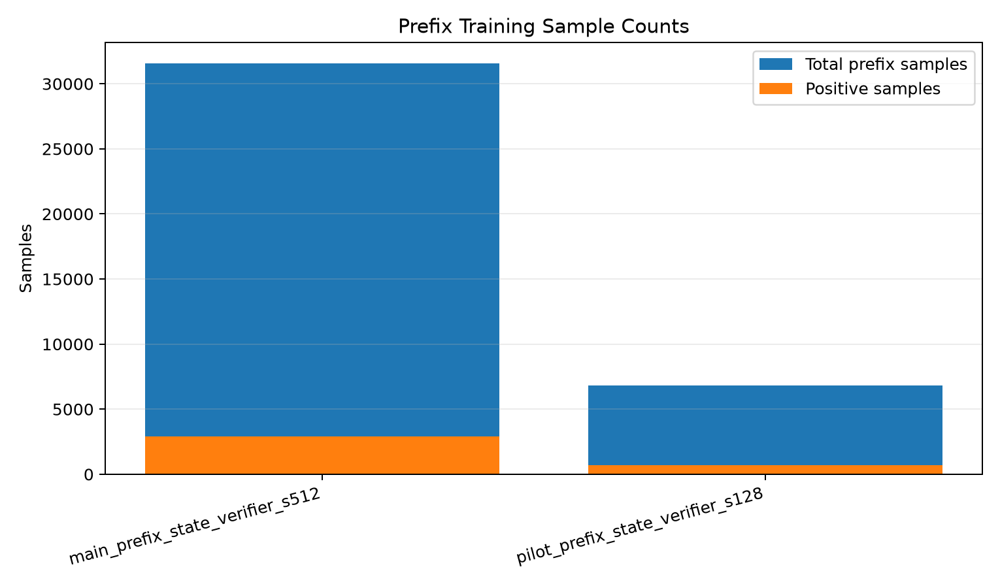

# Qwen Prefix-State Process Verifier

## Abstract

This experiment tests a learned prefix-state verifier for executable bytecode search. A frozen Qwen 4B model encodes the prompt, a trained compiler head emits opcode and argument distributions, and a prefix verifier scores partial bytecode prefixes together with the current VM stack. The verifier is then used to guide typed beam search without using the final answer at decode time.

The verifier learned the prefix classification task well, reaching held-out prefix AUC 0.937 on the main run. It produced modest top-1 decoding gains, especially on hard-composition prompts: hard accuracy improved from 41.4% greedy to 44.5% with `beam_verifier_w2`. Fresh paired accuracy improved from 64.1% greedy to 64.8% with `beam_verifier_w2`. The much larger gap remained between no-answer top-1 decoding and answer-verified repair: fresh paired local answer repair reached 82.0%, and hard-composition local answer repair reached 70.3%.

## Experimental Question

The question is whether a process verifier over partial programs can convert a high-oracle beam into better deployable top-1 bytecode. The verifier sees a prompt representation, the current bytecode prefix, the VM stack after the proposed next action, and the proposed action. It predicts whether the prefix remains consistent with a known correct executable trace.

## Runtime And Decoder

The runtime is a bounded typed stack machine over integers modulo 97. Programs have at most 16 slots and use arithmetic, comparison, min/max, modulo, and lookup opcodes. Search expands only type-valid actions, so invalid stack programs are pruned before scoring.

The evaluated decoders are:

- `greedy`: constrained greedy compiler decoding;
- `local_answer`: complete-program local repair selected by final-answer verification;
- `beam_logprob`: typed beam search using compiler log probability only;
- `beam_verifier_w*`: typed beam search using compiler log probability plus a weighted sum of prefix-verifier log-scores.

## Data And Training

The task generator creates prompts across modular arithmetic chains, weekday offsets, unit scaling, list aggregation, boolean threshold checks, and table lookup. The main run used 512 compiler-trace prompts, 512 verifier prompts, 128 examples per evaluation split, and ran on NVIDIA RTX 6000 Ada Generation.

The verifier training set contained 31,574 prefix samples with 9.2% positives. Positives are gold-consistent executable prefixes; negatives are off-path prefixes generated by the compiler's own typed beam distribution.

## Results

| split            | decoder            | accuracy   | program_exact   | oracle_accuracy   |   mean_expansions |
|:-----------------|:-------------------|:-----------|:----------------|:------------------|------------------:|
| fresh_standard   | greedy             | 63.3%      | 43.8%           | 63.3%             |               1   |
| fresh_standard   | local_answer       | 82.0%      | 47.7%           | 82.0%             |              31.8 |
| fresh_standard   | beam_logprob       | 63.3%      | 43.8%           | 80.5%             |             305.2 |
| fresh_standard   | beam_verifier_w0.5 | 65.6%      | 44.5%           | 82.8%             |             304.7 |
| fresh_standard   | beam_verifier_w1   | 64.1%      | 43.8%           | 82.8%             |             304   |
| fresh_standard   | beam_verifier_w2   | 66.4%      | 45.3%           | 82.8%             |             304.7 |
| fresh_standard   | beam_verifier_w4   | 63.3%      | 44.5%           | 83.6%             |             304.8 |
| fresh_standard   | beam_verifier_w8   | 60.9%      | 43.8%           | 83.6%             |             304.4 |
| fresh_standard   | beam_verifier_w16  | 57.8%      | 41.4%           | 84.4%             |             304.4 |
| fresh_paraphrase | greedy             | 60.2%      | 38.3%           | 60.2%             |               1   |
| fresh_paraphrase | local_answer       | 82.8%      | 45.3%           | 82.8%             |              30.5 |
| fresh_paraphrase | beam_logprob       | 60.2%      | 38.3%           | 82.8%             |             298   |
| fresh_paraphrase | beam_verifier_w0.5 | 62.5%      | 39.1%           | 82.8%             |             295.7 |
| fresh_paraphrase | beam_verifier_w1   | 63.3%      | 39.1%           | 82.0%             |             295   |
| fresh_paraphrase | beam_verifier_w2   | 61.7%      | 38.3%           | 84.4%             |             297.4 |
| fresh_paraphrase | beam_verifier_w4   | 59.4%      | 37.5%           | 85.2%             |             298.1 |
| fresh_paraphrase | beam_verifier_w8   | 57.8%      | 37.5%           | 84.4%             |             297.6 |
| fresh_paraphrase | beam_verifier_w16  | 56.2%      | 36.7%           | 82.8%             |             297.6 |
| fresh_paired     | greedy             | 64.1%      | 47.7%           | 64.1%             |               1   |
| fresh_paired     | local_answer       | 82.0%      | 55.5%           | 82.0%             |              28.1 |
| fresh_paired     | beam_logprob       | 64.1%      | 47.7%           | 84.4%             |             288.4 |
| fresh_paired     | beam_verifier_w0.5 | 63.3%      | 47.7%           | 83.6%             |             288.1 |
| fresh_paired     | beam_verifier_w1   | 63.3%      | 47.7%           | 84.4%             |             286.4 |
| fresh_paired     | beam_verifier_w2   | 64.8%      | 49.2%           | 83.6%             |             290   |
| fresh_paired     | beam_verifier_w4   | 64.1%      | 49.2%           | 85.2%             |             290.3 |
| fresh_paired     | beam_verifier_w8   | 64.1%      | 47.7%           | 85.2%             |             289.7 |
| fresh_paired     | beam_verifier_w16  | 63.3%      | 48.4%           | 85.9%             |             289.8 |
| hard_composition | greedy             | 41.4%      | 29.7%           | 41.4%             |               1   |
| hard_composition | local_answer       | 70.3%      | 34.4%           | 70.3%             |              33.5 |
| hard_composition | beam_logprob       | 41.4%      | 29.7%           | 70.3%             |             315.5 |
| hard_composition | beam_verifier_w0.5 | 42.2%      | 30.5%           | 72.7%             |             312.7 |
| hard_composition | beam_verifier_w1   | 43.8%      | 31.2%           | 73.4%             |             312.4 |
| hard_composition | beam_verifier_w2   | 44.5%      | 31.2%           | 73.4%             |             313.6 |
| hard_composition | beam_verifier_w4   | 44.5%      | 29.7%           | 71.9%             |             315   |
| hard_composition | beam_verifier_w8   | 43.0%      | 28.1%           | 72.7%             |             314.1 |
| hard_composition | beam_verifier_w16  | 43.0%      | 28.1%           | 72.7%             |             313.8 |

*Main run top-1 executable accuracy by decoder.*

*Top-1 beam accuracy compared with beam oracle accuracy.*

*Held-out prefix verifier AUC during training.*

*Prefix sample counts for pilot and main runs.*

## Interpretation

The prefix verifier does learn a meaningful process signal: AUC above 0.93 is not a weak classifier. It also raises some top-1 no-answer accuracy: hard-composition accuracy improved by +3.1 pp, and fresh paired improved by +0.8 pp. However, these gains are much smaller than the available beam/search headroom.

The central result is the distinction between containment and selection. On fresh paired prompts, logprob beam top-1 was 64.1%, but the same beam contained a correct executable program 84.4% of the time. On hard composition, logprob beam top-1 was 41.4%, while the beam oracle was 70.3%. The correct programs are frequently in the beam; this verifier formulation does not yet rank them aggressively enough.

The answer-verified local repair remains a strong upper comparison, reaching 82.0% fresh paired and 70.3% hard. That condition uses final-answer feedback at decode time, so it is not the deployable no-answer setting, but it shows that the compiler's nearby candidate space is much better than greedy decoding.

## Failure Analysis

This verifier is trained mostly as a gold-prefix classifier. That is a useful process signal, but it is not the same as semantic reachability. A prefix can deviate from the canonical trace and still complete to a correct program, while a gold-looking prefix can still lose because of later argument choices. The scorer also accumulates prefix log-sigmoid penalties, which can over-penalize longer correct programs and does not directly optimize final top-1 answer accuracy.

## Next Step

The next version should train a semantic value model rather than an exact-prefix classifier. Labels should come from suffix completion search: for a partial prefix, ask whether any bounded continuation can still execute to the correct answer. That would turn the verifier from "does this match the teacher trace?" into "is this prefix still live?" The search policy should then optimize expected completion success, not prefix exactness.

A second improvement is to distill successful verifier-beam or answer-verified beam programs back into the compiler head, so the direct compiler learns from the high-oracle beam instead of relying on expensive search at inference time.
