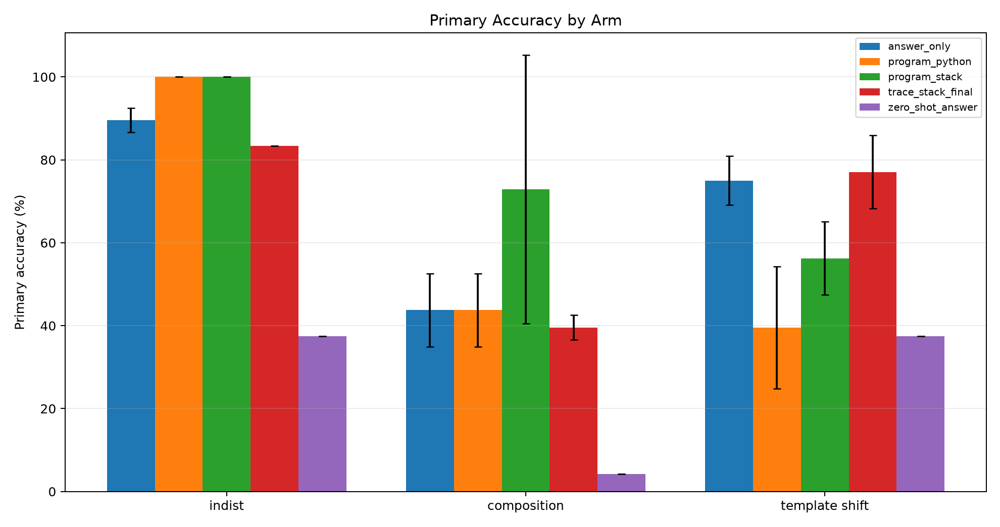
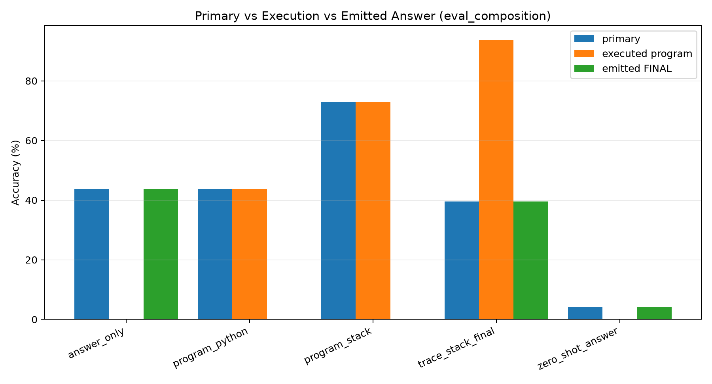
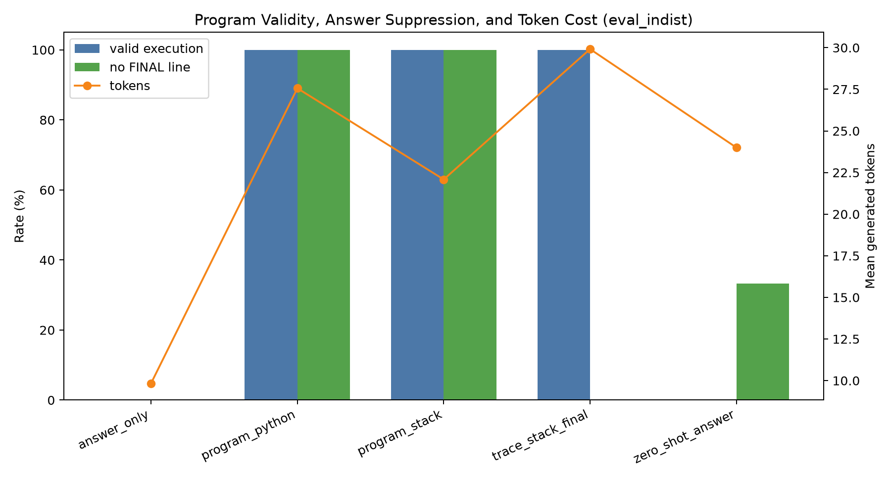
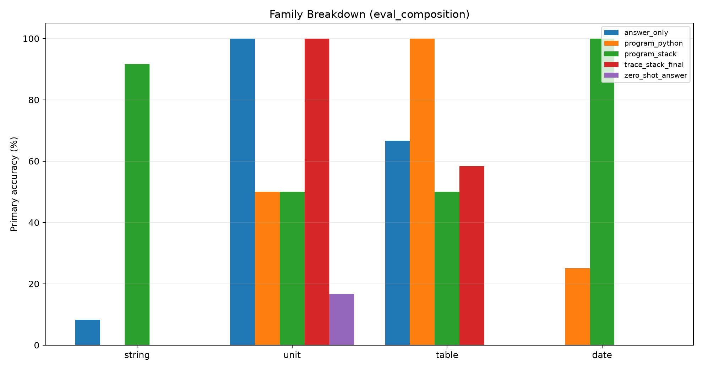
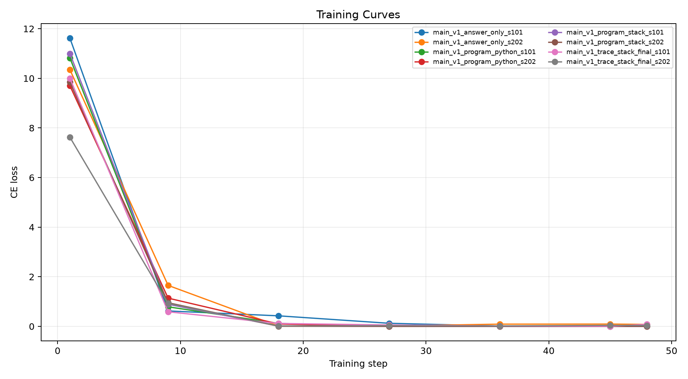

# Qwen Program-Only Executable ABI

## Abstract

This experiment tests whether a local 4B language model can compile deterministic office-style tasks into executable programs when the final answer is absent from the program-only targets. Program-only outputs are parsed and executed by a deterministic interpreter; correctness is based on the interpreter result.

## Method

The task factory creates string, unit-conversion, table-lookup, and date-offset examples. The training split contains atomic operations, while the composition split recombines known primitives into held-out multi-step procedures. Four arms are compared: `answer_only`, `trace_stack_final`, `program_stack`, and `program_python`.

For program-only arms, the primary metric is strict execution accuracy: the generated program must execute to the correct answer and must not contain a `FINAL` line. For answer-emitting arms, the primary metric is exact match on the parsed `FINAL` line.

## Run Configuration

- Primary suite: `main`.
- Adapter seeds: `101,202`.
- Total trained-arm evaluation examples: `576` across arms, splits, and seeds.
- QLoRA update steps per adapter: `48`.
- Large adapters are stored outside the experiment tree.

## Primary Results

- Best in-distribution arm: `program_python` at 100.0%.
- Best held-out composition arm: `program_stack` at 72.9%.
- Best externally executed held-out composition procedure: `trace_stack_final` at 93.8%.
- Best strict program-only composition arm: `program_stack` at 72.9%.

|suite|arm|split|runs|n_total|primary_accuracy_mean|primary_accuracy_std|exec_accuracy_mean|valid_exec_rate_mean|no_final_rate_mean|mean_new_tokens_mean|
|---|---|---|---|---|---|---|---|---|---|---|
|main|program_stack|eval_composition|2|48|72.9%|32.4%|72.9%|72.9%|100.0%|28.90|
|main|answer_only|eval_composition|2|48|43.8%|8.8%|0.0%|0.0%|0.0%|9.92|
|main|program_python|eval_composition|2|48|43.8%|8.8%|43.8%|58.3%|100.0%|33.27|
|main|trace_stack_final|eval_composition|2|48|39.6%|2.9%|93.8%|100.0%|0.0%|34.21|
|main|zero_shot_answer|eval_composition|1|24|4.2%|0.0%|0.0%|0.0%|75.0%|24.00|
|main|program_python|eval_indist|2|48|100.0%|0.0%|100.0%|100.0%|100.0%|27.56|
|main|program_stack|eval_indist|2|48|100.0%|0.0%|100.0%|100.0%|100.0%|22.08|
|main|answer_only|eval_indist|2|48|89.6%|2.9%|0.0%|0.0%|0.0%|9.83|
|main|trace_stack_final|eval_indist|2|48|83.3%|0.0%|100.0%|100.0%|0.0%|29.92|
|main|zero_shot_answer|eval_indist|1|24|37.5%|0.0%|0.0%|0.0%|33.3%|24.00|
|main|trace_stack_final|eval_template_shift|2|48|77.1%|8.8%|50.0%|52.1%|0.0%|29.12|
|main|answer_only|eval_template_shift|2|48|75.0%|5.9%|0.0%|0.0%|0.0%|9.92|
|main|program_stack|eval_template_shift|2|48|56.2%|8.8%|56.2%|56.2%|100.0%|19.88|
|main|program_python|eval_template_shift|2|48|39.6%|14.7%|39.6%|54.2%|100.0%|26.12|
|main|zero_shot_answer|eval_template_shift|1|24|37.5%|0.0%|0.0%|0.0%|25.0%|24.00|

## Interpretation

The strongest procedure-level result is the externally executed `trace_stack_final` program: 93.8% execution accuracy on held-out compositions, with 39.6% final-answer accuracy. The generated procedure can be right while the answer token is wrong, so the emitted `FINAL` line is a confounded score for procedure arms.
The best held-out composition arm was `program_stack`. Its family accuracies were: string 91.7%, unit 50.0%, table 50.0%, date 100.0%.
The strongest strict program-only arm reached 72.9% on held-out compositions, compared with 43.8% for answer-only. This directly measures whether executable compilation improves composition rather than merely producing a plausible answer string.
The same row has seed standard deviation 32.4%, so the result is positive but not yet stable enough to treat as a finished recipe.
The trace-plus-final procedure execution was more stable than strict program-only emission in this compact run: composition execution standard deviation was 8.8%, versus 32.4% for the best strict program-only row.
A program-only win would show that the model learned a useful executable ABI. A program-only loss, especially with high valid-execution rate, indicates that the model can imitate program syntax but still chooses the wrong operations or arguments.

## Limitations

This is a compact controlled run. The generated domains are narrow, and the interpreters intentionally support only a small operation set. The result should be read as an ABI and supervision test, not a benchmark of general assistant capability.

## Artifacts

- Metrics: `analysis/summary_by_arm.csv` and `analysis/all_metrics.csv`
- Details: `analysis/all_details.csv`
- Training logs: `analysis/all_train_logs.csv`
- Checkpoints: `/workspace/large_artifacts/qwen_program_only_executable_abi/checkpoints`
