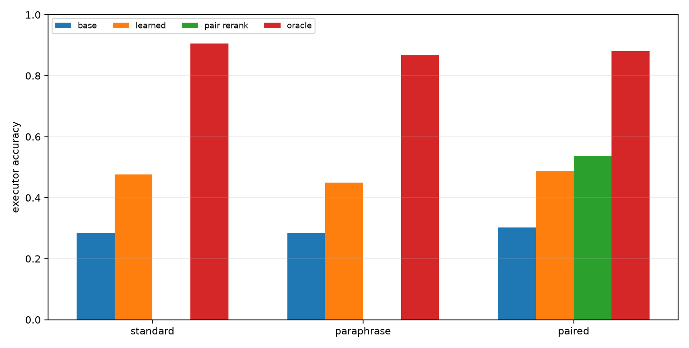
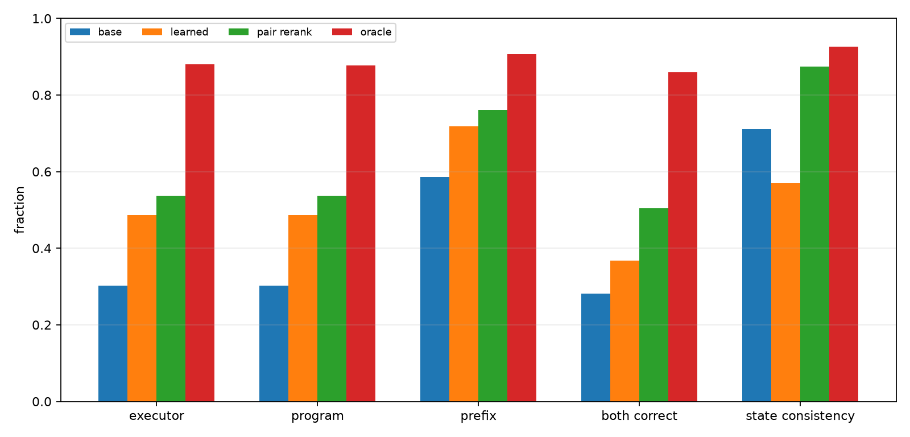
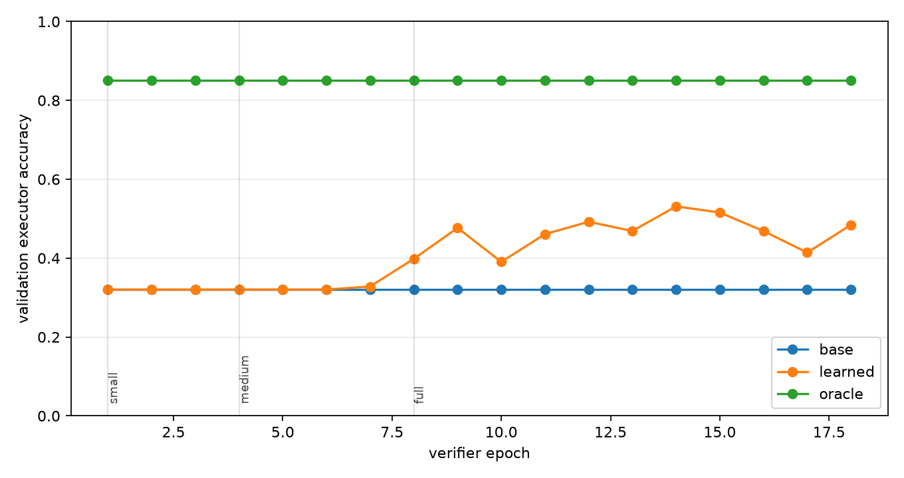

# Qwen Progressive Repair Compiler

## Abstract

This experiment tests a deployable repair-selection layer for a frozen Qwen-attached numeric compiler. The compiler converts a prompt into an executable modular-arithmetic program. Around that program, the system enumerates local edits and trains a small transformer verifier to choose among candidate execution traces without seeing the true answer or true state trajectory at test time.

The new variable is a progressive candidate-space curriculum. The verifier starts on small one-edit neighborhoods and then trains on the full two-edit repair space. Final evaluation uses the full candidate space for all methods.

## Setup

- Primary run: `main_progressive_repair_s512`
- Qwen substrate: `Qwen/Qwen3-4B`
- Modulus: `97`
- Max program length: `24`
- Best verifier epoch: `14`

Candidate labels are computed offline from exact trajectories. At evaluation time, the learned verifier receives only candidate-local information: copied slots, edit metadata, compiler probabilities, predicted states, and soft-executor support.

## Results

### Fresh Splits

| Split | Base | Learned | Pair rerank | Oracle | Gap recovered |
|---|---|---|---|---|---|
| fresh_standard_len24 | 28.5% | 47.7% | n/a | 90.6% | 30.8% |
| fresh_paraphrase_len24 | 28.5% | 44.9% | n/a | 86.7% | 28.2% |
| fresh_paired_len24 | 30.3% | 48.6% | 53.7% | 88.1% | 31.8% |



### Fresh Paired Details

| Metric | Base | Learned | Pair rerank | Oracle |
|---|---|---|---|---|
| Executor accuracy | 30.3% | 48.6% | 53.7% | 88.1% |
| Program exact | 30.3% | 48.6% | 53.7% | 87.7% |
| State prefix fraction | 58.6% | 71.9% | 76.2% | 90.7% |
| Pair both-correct | 28.1% | 36.7% | 50.4% | 85.9% |
| Pair state consistency | 71.1% | 57.0% | 87.5% | 92.6% |



### Training Dynamics

The training curve tracks validation accuracy on the full candidate set after every verifier epoch. Stage labels mark the candidate budget used for that part of training.



## Interpretation

On the fresh paired split, the learned verifier moves exact execution from 30.3% to 48.6%. The oracle ceiling is 88.1%, so the learned selector recovers 31.8% of the measured base-to-oracle gap. Pair reranking is a separate consistency control for paired prompt renderings; it reaches 53.7% executor accuracy on the paired split.

The key bottleneck is still selection quality. The candidate space often contains a correct executable program, but the learned verifier does not always identify it. The experiment therefore supports continuing toward verifier-to-compiler distillation or joint training, because the current external selector converts only part of the available local-repair headroom.

The staged curriculum is not, by itself, the breakthrough mechanism in this run. Validation accuracy stayed near the base compiler through the small and medium stages, then improved only after the verifier trained on the full candidate neighborhood. That points to a practical next step: use the full repair space from the start or distill full-space successful choices into the compiler rather than relying on a long warm-up over easier neighborhoods.

## Limitations

- The task is synthetic modular arithmetic.
- The compiler and runtime are specialized.
- Candidate labels use exact trajectories during training.
- The verifier consumes engineered trace features rather than only raw hidden states.
- Pair reranking requires paired prompt renderings and is not a single-prompt method.

## Artifacts

Small experiment files live in:

```text
experiments/qwen_progressive_repair_compiler/
```

Large artifacts live in:

```text
large_artifacts/qwen_progressive_repair_compiler/checkpoints/
```

Primary files:

- `analysis/summary.md`
- `analysis/final_metrics.csv`
- `analysis/all_final_metrics.csv`
- `analysis/figures/executor_accuracy.png`
- `analysis/figures/paired_details.png`
- `analysis/figures/training_curve.png`
- `runs/main_progressive_repair_s512/metrics.csv`
- `runs/main_progressive_repair_s512/verifier_train_log.csv`
- `reports/qwen_progressive_repair_compiler_paper.md`
- `reports/qwen_progressive_repair_compiler_paper.html`
- `checkpoint_manifest.csv`
