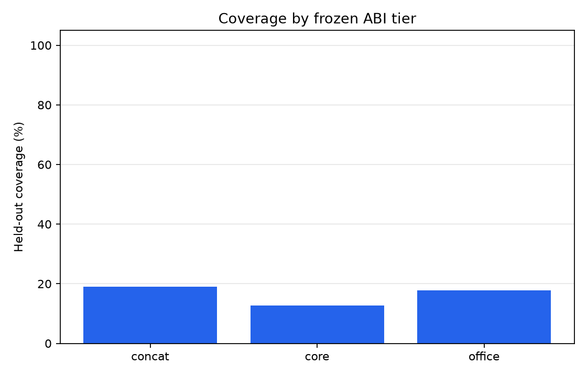
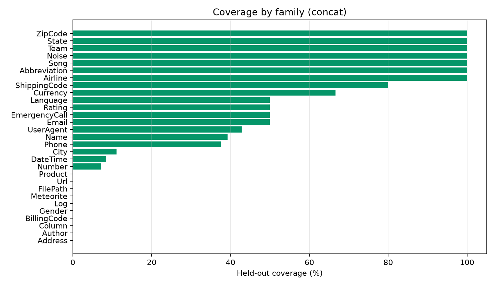
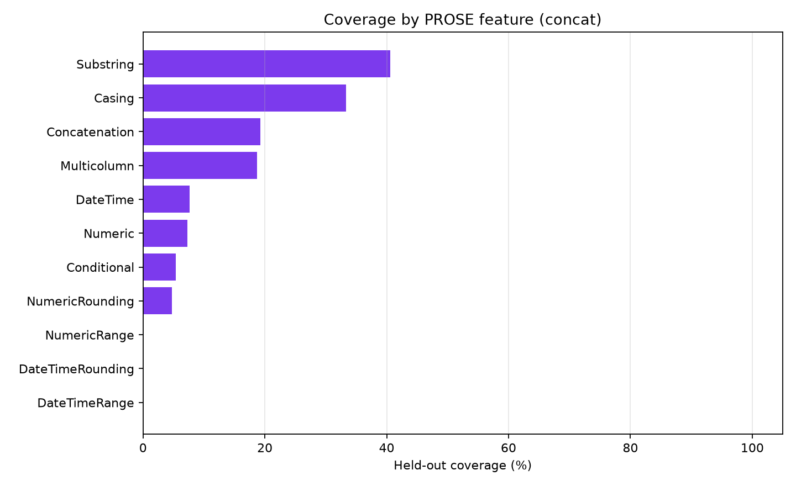
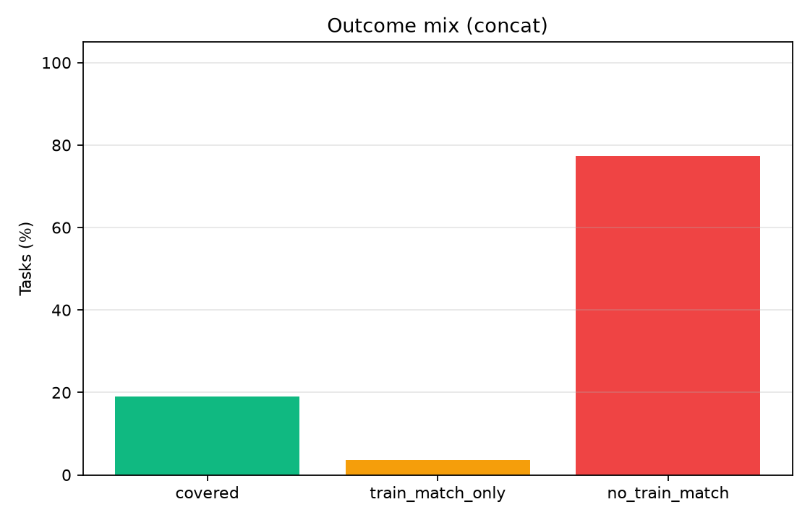
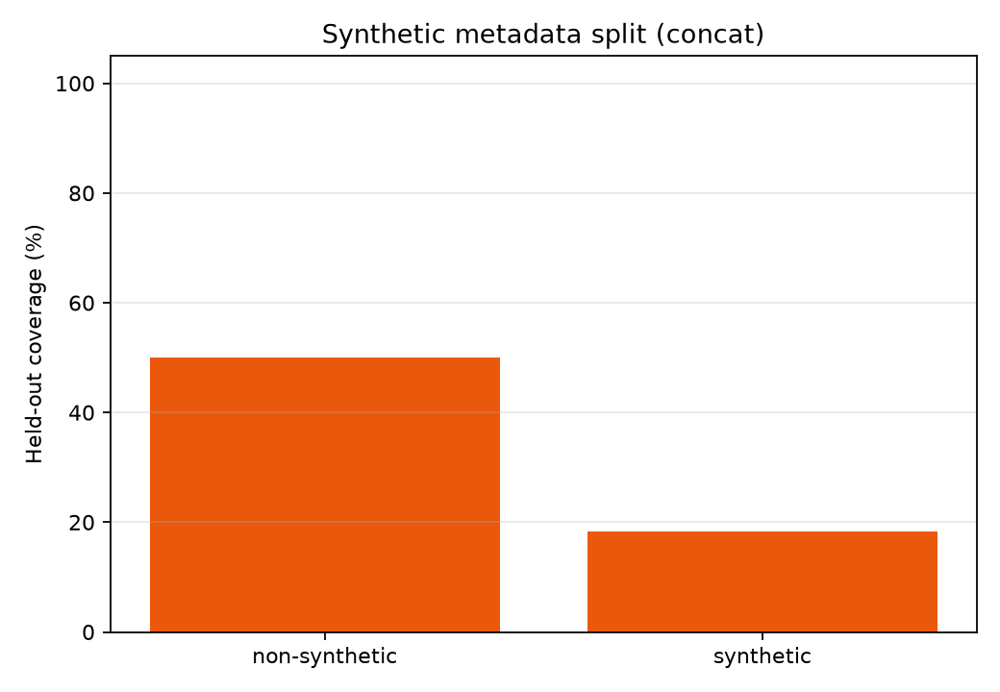
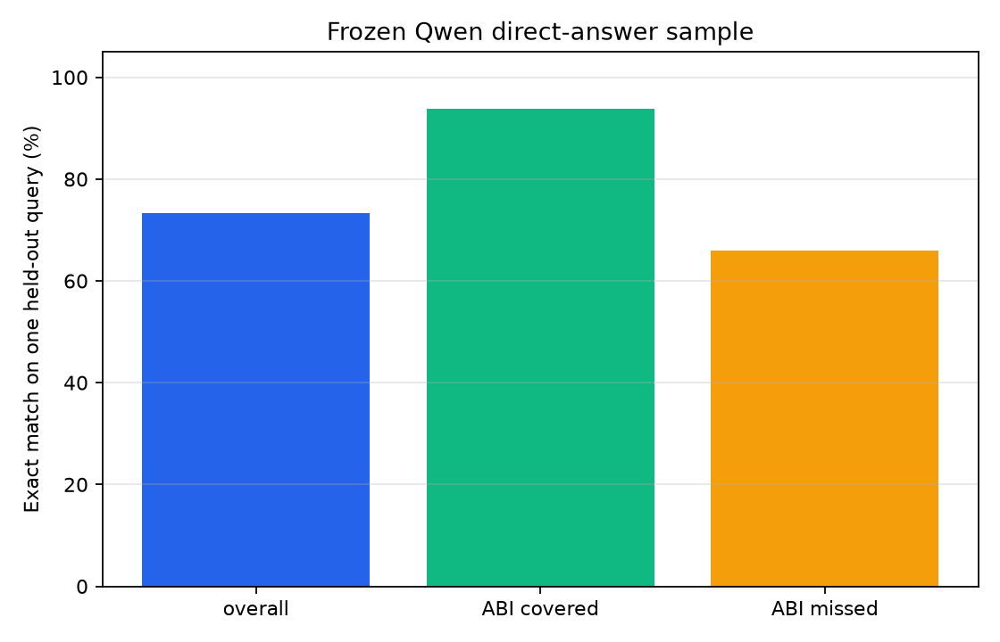

# Qwen Public PROSE ABI Gate

## Abstract

This standalone experiment evaluates a frozen deterministic transformation ABI on the public Microsoft PROSE `Transformation.Text` benchmark. A program is selected from train examples and counted only if it also matches held-out examples from the same task.

## Method

- Dataset: Microsoft PROSE public benchmark suite, `Transformation.Text`.
- Tasks with too few examples are excluded so every scored task has held-out examples.
- Split: first `4` examples, capped by task size, are train examples; up to `50` following examples are held out.
- Frozen ABI tiers: `core` surface extraction/casing, `office` adds regex/date/number/domain primitives, `concat` adds two-part concatenation over ABI expressions.
- Train-only fits are counted as failures because they do not validate task semantics on held-out rows.

## Run Configuration

- Suite: `main`.
- Scored tasks: `309`.
- Public benchmark checkout: `/workspace/large_artifacts/qwen_public_prose_abi_gate/prose-benchmarks`.

## Primary Results

- Best frozen tier coverage: 19.1% (59/309 tasks).
- Train-only/coincidence failures: 3.6% (11 tasks).
- No-train-match failures: 77.3% (239 tasks).
- Synthetic-metadata coverage: 18.3% (55/301 tasks).
- Non-synthetic-metadata coverage: 50.0% (4/8 tasks).

### Frozen Qwen Direct-Answer Sample

- Model: `Qwen/Qwen3-4B`.
- Sample: `60` tasks, seed `20260627`.
- Prompt: first `4` examples, then one held-out query.
- Exact match on that one held-out query: 73.3% (44/60 tasks).
- This is a diagnostic baseline, not the same metric as ABI coverage: it scores one held-out query, while ABI coverage requires one program to match all held-out rows.

|slice|tasks|exact|
|---|---|---|
|overall|60|0.73|
|abi_covered=False|44|0.66|
|abi_covered=True|16|0.94|
|family=DateTime|22|0.50|
|family=Name|4|1.00|
|family=Number|14|0.79|
|family=Phone|6|1.00|

#### Qwen Sample Misses

|task_id|family|features|abi_covered|exact|target|prediction|
|---|---|---|---|---|---|---|
|BillingCode.000007|BillingCode|Concatenation|False|False|11529]|[11529]|
|DateTime.000006|DateTime|Concatenation,DateTimeRange,DateTimeRounding,DateTime,Multicolumn|False|False|Fri 8:00-9:00|Thu 8:00-9:00|
|DateTime.000014|DateTime|DateTime|False|False|Friday #1 February 2013|Saturday #1 February 2013|
|DateTime.000046|DateTime|DateTime|False|False|1952 7 2|7/2/1952 2 2|
|DateTime.000056|DateTime|DateTimeRange,DateTimeRounding,DateTime|False|False|11AM-1PM|Noon-2PM|
|DateTime.000065|DateTime|DateTimeRange,DateTimeRounding,DateTime|False|False|12:30PM-12:44PM|12:00PM-12:45PM|
|DateTime.000066|DateTime|DateTimeRange,DateTimeRounding,DateTime|False|False|12:40PM-12:49PM|12:40PM-12:41PM|
|DateTime.000067|DateTime|DateTimeRange,DateTimeRounding,DateTime|False|False|12:00PM-1:20PM|11:30AM-12:50PM|
|DateTime.000088|DateTime|DateTimeRounding,DateTime|False|False|4:00PM|8:00AM|
|DateTime.000093|DateTime|DateTime|False|False|1990-03-07|1990-11-07|
|DateTime.000106|DateTime|DateTime|False|False|Mon|Wed|
|DateTime.000115|DateTime|DateTimeRange,DateTimeRounding,DateTime|False|False|40-60|0-20|
|Noise.000001|Noise|Concatenation,Multicolumn|True|False|%@^zxi**d^gx%i ry!d!!e*grumyr%$$#(k|col0=%@^zxi**d^gx%i ry! col1=d!!e*grumyr%$$#(k|
|Number.000015|Number|Numeric,NumericRounding|False|False|-22600|-22500|
|Number.000031|Number|Numeric,NumericRounding|False|False|43.5|43.0|
|Number.000094|Number|Concatenation,Numeric|False|False|₹56,343|₹5,6343|

### Overall By Tier

|tier|tasks|coverage|train_match_rate|train_only_rate|no_train_match_rate|median_candidates|
|---|---|---|---|---|---|---|
|concat|309|19.1%|22.7%|3.6%|77.3%|56833.00|
|core|309|12.6%|15.2%|2.6%|84.8%|109.00|
|office|309|17.8%|21.0%|3.2%|79.0%|1057.00|

### Feature Coverage

|feature|tasks|coverage|train_only_rate|
|---|---|---|---|
|DateTimeRange|36|0.0%|0.0%|
|DateTimeRounding|44|0.0%|0.0%|
|NumericRange|7|0.0%|0.0%|
|NumericRounding|42|4.8%|2.4%|
|Conditional|37|5.4%|10.8%|
|Numeric|82|7.3%|2.4%|
|DateTime|117|7.7%|4.3%|
|Multicolumn|16|18.8%|0.0%|
|Concatenation|52|19.2%|0.0%|
|Casing|9|33.3%|0.0%|
|Substring|111|40.5%|3.6%|

### Lowest-Coverage Families

|family|tasks|coverage|train_only_rate|
|---|---|---|---|
|Address|6|0.0%|16.7%|
|Author|1|0.0%|0.0%|
|BillingCode|6|0.0%|0.0%|
|Column|2|0.0%|0.0%|
|FilePath|1|0.0%|100.0%|
|Gender|3|0.0%|0.0%|
|Log|4|0.0%|0.0%|
|Meteorite|1|0.0%|0.0%|
|Product|2|0.0%|50.0%|
|Url|1|0.0%|0.0%|
|Number|84|7.1%|2.4%|
|DateTime|106|8.5%|4.7%|
|City|9|11.1%|0.0%|
|Phone|16|37.5%|0.0%|
|Name|28|39.3%|3.6%|
|UserAgent|7|42.9%|0.0%|
|Email|6|50.0%|0.0%|
|EmergencyCall|2|50.0%|0.0%|
|Language|2|50.0%|0.0%|
|Rating|2|50.0%|0.0%|
|Currency|3|66.7%|0.0%|
|ShippingCode|10|80.0%|0.0%|
|Abbreviation|1|100.0%|0.0%|
|Airline|1|100.0%|0.0%|
|Noise|1|100.0%|0.0%|
|Song|1|100.0%|0.0%|
|State|1|100.0%|0.0%|
|Team|1|100.0%|0.0%|
|ZipCode|1|100.0%|0.0%|

### Covered Program Examples

|task_id|family|features|num_examples|program_depth|program|
|---|---|---|---|---|---|
|Abbreviation.000001|Abbreviation|Concatenation,Conditional,Substring|52|1.00|initials(COL0)|
|Airline.000002|Airline|Substring|5|1.00|field[,,0](COL0)|
|City.000012|City|Substring|22|1.00|field[,,1](COL0)|
|Currency.000003|Currency|Numeric,Substring|20|1.00|number_2dp(COL0)|
|Currency.000005|Currency|Numeric,Substring|100|1.00|number_2dp(COL0)|
|DateTime.000003|DateTime|DateTime|10|1.00|time_hour(COL0)|
|DateTime.000004|DateTime|Concatenation,DateTime,Multicolumn|20|1.00|concat[&#x27; &#x27;](COL0,COL1)|
|DateTime.000013|DateTime|Conditional,DateTime|230|0.00|COL0|
|DateTime.000037|DateTime|DateTime|5|1.00|title(COL0)|
|DateTime.000092|DateTime|DateTime|32|1.00|time_hour(COL0)|
|DateTime.000102|DateTime|DateTime|20|1.00|time_hour(COL0)|
|DateTime.000103|DateTime|DateTime|20|1.00|field[:,1](COL0)|
|DateTime.000104|DateTime|DateTime|20|1.00|alpha(COL0)|
|DateTime.000105|DateTime|DateTime|20|1.00|field[:,2](COL0)|
|Email.000010|Email|Substring|10|1.00|email_domain(COL0)|
|Email.000011|Email|Substring|10|1.00|field[.,0](COL0)|
|Email.000013|Email|Substring|100|1.00|email_domain(COL0)|
|EmergencyCall.000003|EmergencyCall|Casing,Substring|12|2.00|title(field[;,1](COL0))|
|Language.000002|Language|Multicolumn,Substring|51|1.00|file_stem(COL1)|
|Name.000008|Name|Concatenation,Substring|20|1.00|first_last_initials(COL0)|
|Name.000014|Name|Substring|10|1.00|first_word(COL0)|
|Name.000025|Name|Casing,Concatenation,Substring|10|2.00|lower(initials_sp(COL0))|

### Train-Only Failures

|task_id|family|features|num_examples|program|
|---|---|---|---|---|
|Address.000012|Address|Conditional,Substring|10|number_int(COL0)|
|DateTime.000012|DateTime|Conditional,DateTime|10|field[space,-1](COL0)|
|DateTime.000096|DateTime|DateTime|20|field[-,4](COL0)|
|DateTime.000097|DateTime|DateTime|20|field[-,2](COL0)|
|DateTime.000099|DateTime|DateTime|20|field[-,0](COL0)|
|DateTime.000101|DateTime|DateTime|20|field[-,0](COL0)|
|FilePath.000001|FilePath|Conditional,Substring|17|file_stem(COL0)|
|Name.000037|Name|Conditional,Substring|20|field[,,1](COL0)|
|Number.000010|Number|Numeric,NumericRounding|40|COL0|
|Number.000082|Number|Numeric|20|number_int(COL0)|
|Product.000003|Product|Substring|5|concat[&#x27; &#x27;](number_int(COL0),last_word(COL0))|

### No-Train-Match Failures

|task_id|family|features|num_examples|
|---|---|---|---|
|Address.000002|Address|Substring|5|
|Address.000003|Address|Substring|5|
|Address.000009|Address|Concatenation,Multicolumn|10|
|Address.000013|Address|Conditional,Substring|10|
|Address.000014|Address|Substring|29|
|Author.000001|Author|Conditional,DateTime|39|
|BillingCode.000001|BillingCode|Concatenation|11|
|BillingCode.000002|BillingCode|Concatenation,Substring|11|
|BillingCode.000003|BillingCode|Concatenation|5|
|BillingCode.000004|BillingCode|Concatenation|5|
|BillingCode.000005|BillingCode|Concatenation,Substring|5|
|BillingCode.000007|BillingCode|Concatenation|5|
|City.000004|City|Conditional|20|
|City.000005|City|Conditional|14|
|City.000006|City|Conditional|5|
|City.000007|City|Conditional|5|
|City.000008|City|Conditional|5|
|City.000009|City|Conditional,Substring|6|
|City.000010|City|Conditional,Numeric|6|
|City.000011|City|Conditional|7|
|Column.000001|Column|Concatenation,Conditional,Substring|10|
|Column.000002|Column|Casing,Concatenation,Conditional,Substring|10|
|Currency.000004|Currency|Numeric,Substring|20|
|DateTime.000005|DateTime|Conditional,DateTime|27|
|DateTime.000006|DateTime|Concatenation,DateTimeRange,DateTimeRounding,DateTime,Multicolumn|1000|
|DateTime.000007|DateTime|DateTime|25|
|DateTime.000008|DateTime|DateTimeRange,DateTimeRounding,DateTime|20|
|DateTime.000009|DateTime|DateTime|100|

## Interpretation

This public benchmark is a hard gate because task definitions come from an independent repository rather than this experiment's generator. It directly tests whether a frozen transformation ABI covers independent string-transformation tasks under held-out validation.
The result is negative for this frozen ABI: the best tier covers only 19.1%, and most misses are no-train-match failures rather than held-out coincidence failures. The ABI is therefore too narrow for the public `Transformation.Text` suite without substantial primitive expansion or a retrieval step that selects a domain-specific ABI.
The frozen-Qwen direct-answer diagnostic points in a different direction: the model often infers these public transformations from examples even when the frozen ABI has no matching program. That suggests the immediate bottleneck is not that the transformations are impossible for the model; it is that the fixed ABI does not expose the right operations for this benchmark.
The train-only column is load-bearing. Those tasks are exactly the cases where a plausible expression fits examples but fails held-out rows, so they are excluded from coverage.

## Limitations

This run covers `Transformation.Text`, not `Split.Text` or `Extraction.Text`. The ABI is a fixed template library rather than a complete PROSE-style DSL, so misses can reflect missing primitives or bounded search. The benchmark itself contains mostly synthetic data according to its metadata, though it is independent public data rather than generated by this experiment.

## Artifacts

- Details: `analysis/details.csv`
- Overall summary: `analysis/overall_summary.csv`
- Family summary: `analysis/family_summary.csv`
- Feature summary: `analysis/feature_summary.csv`
- Frozen Qwen direct-answer sample: `analysis/qwen_direct_sample.csv`
- Public benchmark checkout: `/workspace/large_artifacts/qwen_public_prose_abi_gate/prose-benchmarks`
