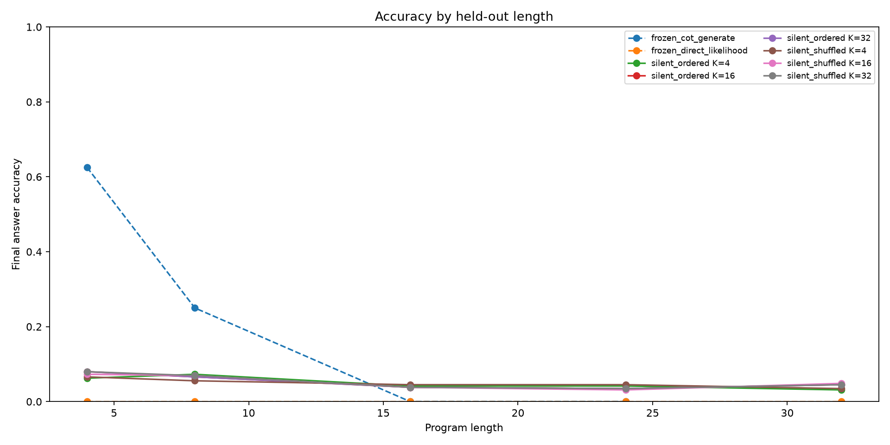
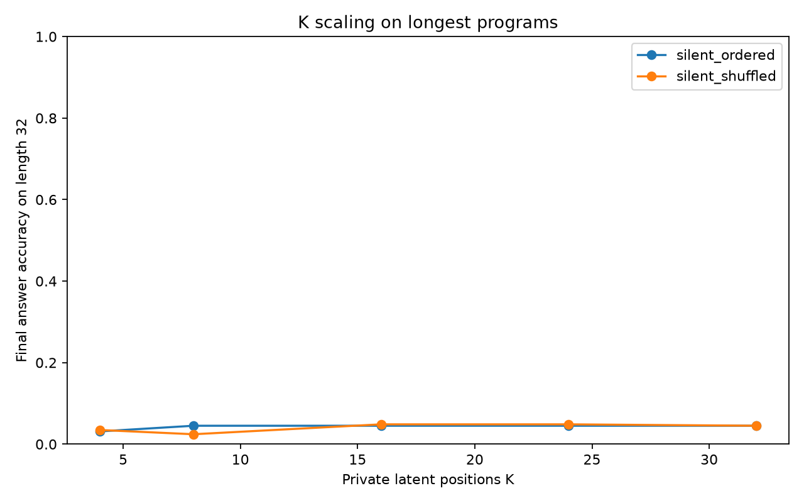
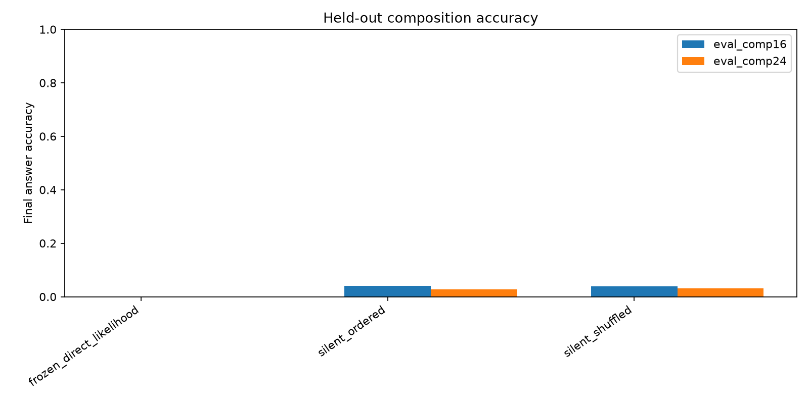
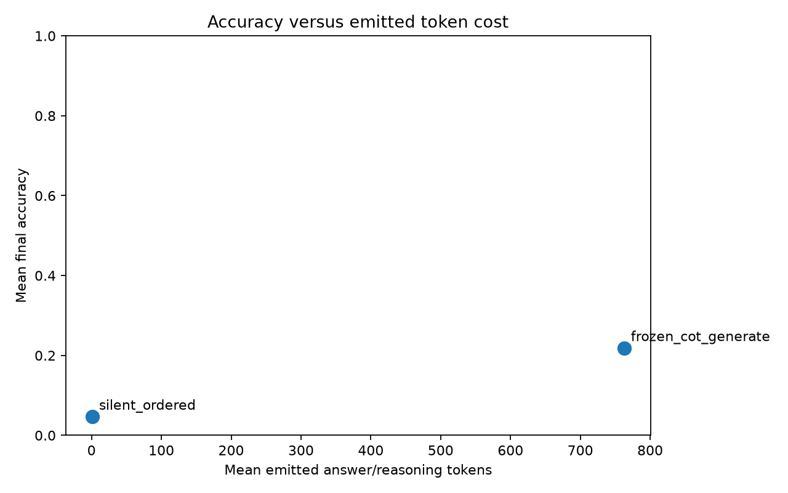
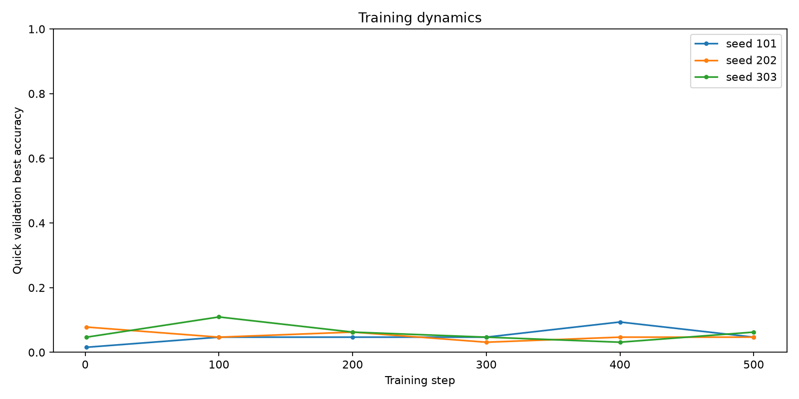

# Qwen Python-Shaped Silent Executor Report

## Summary

This standalone experiment tests whether a Qwen 4B model can execute
Python-shaped mini-programs with private latent compute positions instead of
emitting an explicit execution trace.

Best silent ordered length-32 accuracy was 6.2% at K=8.

The result is a controlled negative for the tested silent-execution recipe: ordered latent compute reaches 8.0% on trained-length-4 programs and 4.5% on held-out length-32 programs, with held-out-composition length-24 at 3.1%. The shuffled-compute control matches or exceeds the ordered arm, so the K curve does not support private sequential execution.

Thinking CoT reached 62.5% on length 4 with 746.5 emitted tokens, but fell to 0.0% on length 24 with 768.0 emitted tokens.

On length 32, ordered silent compute peaked at 4.5% (K=8, state accuracy 5.5%), while shuffled compute peaked at 4.9% (K=16).

The primary decision criterion is held-out length and held-out operation
composition. Accuracy at trained lengths is not sufficient evidence of
execution; the silent arm must generalize beyond the lengths and operation
compositions used during posttraining. The shuffled-compute arm uses the same
number of private latent positions but randomizes their order, separating
ordered latent computation from extra capacity.

## Setup

- Base model: `Qwen/Qwen3-4B`.
- Train lengths: `4,8,16`.
- Held-out lengths: `24,32`.
- Value range: integers `0..31`.
- Private compute positions: `4,8,16,24,32`.
- Training seeds: `101,202,303`.
- Large artifacts: `/workspace/large_artifacts/qwen_python_shaped_silent_executor`.

## Frozen Probe And CoT Baseline

The frozen probe scores final answers directly with numeric continuation
likelihood. The CoT baseline generates explicit intermediate states and is
scored on both final answer and state accuracy.

| arm                      | split       |   k |   n | final_accuracy   | state_accuracy   |   mean_output_tokens |
|:-------------------------|:------------|----:|----:|:-----------------|:-----------------|---------------------:|
| frozen_direct_likelihood | eval_len4   |   0 |  16 | 0.0%             | n/a              |                  1   |
| frozen_direct_likelihood | eval_len8   |   0 |  16 | 0.0%             | n/a              |                  1   |
| frozen_direct_likelihood | eval_len16  |   0 |  16 | 0.0%             | n/a              |                  1   |
| frozen_direct_likelihood | eval_len24  |   0 |  16 | 0.0%             | n/a              |                  1   |
| frozen_direct_likelihood | eval_len32  |   0 |  16 | 0.0%             | n/a              |                  1   |
| frozen_direct_likelihood | eval_comp16 |   0 |  16 | 0.0%             | n/a              |                  1   |
| frozen_direct_likelihood | eval_comp24 |   0 |  16 | 0.0%             | n/a              |                  1   |
| frozen_cot_generate      | eval_len4   |  -1 |   8 | 62.5%            | 50.0%            |                746.5 |
| frozen_cot_generate      | eval_len8   |  -1 |   8 | 25.0%            | 0.0%             |                768   |
| frozen_cot_generate      | eval_len16  |  -1 |   8 | 0.0%             | 2.3%             |                768   |
| frozen_cot_generate      | eval_len24  |  -1 |   8 | 0.0%             | 0.0%             |                768   |

## K Scaling

| arm             | split       |   k | final_accuracy   | state_accuracy   |   n |
|:----------------|:------------|----:|:-----------------|:-----------------|----:|
| silent_ordered  | eval_comp16 |   4 | 2.1%             | 6.2%             |  96 |
| silent_ordered  | eval_comp16 |   8 | 4.5%             | 5.8%             |  96 |
| silent_ordered  | eval_comp16 |  16 | 4.5%             | 4.8%             |  96 |
| silent_ordered  | eval_comp16 |  24 | 4.5%             | 4.8%             |  96 |
| silent_ordered  | eval_comp16 |  32 | 4.5%             | 4.8%             |  96 |
| silent_ordered  | eval_comp24 |   4 | 1.0%             | 5.3%             |  96 |
| silent_ordered  | eval_comp24 |   8 | 3.1%             | 5.4%             |  96 |
| silent_ordered  | eval_comp24 |  16 | 3.1%             | 5.5%             |  96 |
| silent_ordered  | eval_comp24 |  24 | 3.1%             | 5.1%             |  96 |
| silent_ordered  | eval_comp24 |  32 | 3.1%             | 5.1%             |  96 |
| silent_ordered  | eval_len16  |   4 | 4.2%             | 6.5%             |  96 |
| silent_ordered  | eval_len16  |   8 | 3.8%             | 6.0%             |  96 |
| silent_ordered  | eval_len16  |  16 | 3.8%             | 5.7%             |  96 |
| silent_ordered  | eval_len16  |  24 | 3.8%             | 5.6%             |  96 |
| silent_ordered  | eval_len16  |  32 | 3.8%             | 5.6%             |  96 |
| silent_ordered  | eval_len24  |   4 | 4.2%             | 8.0%             |  96 |
| silent_ordered  | eval_len24  |   8 | 3.5%             | 6.5%             |  96 |
| silent_ordered  | eval_len24  |  16 | 3.5%             | 5.6%             |  96 |
| silent_ordered  | eval_len24  |  24 | 3.5%             | 5.4%             |  96 |
| silent_ordered  | eval_len24  |  32 | 3.5%             | 5.4%             |  96 |
| silent_ordered  | eval_len32  |   4 | 3.1%             | 6.4%             |  96 |
| silent_ordered  | eval_len32  |   8 | 4.5%             | 5.5%             |  96 |
| silent_ordered  | eval_len32  |  16 | 4.5%             | 5.3%             |  96 |
| silent_ordered  | eval_len32  |  24 | 4.5%             | 4.8%             |  96 |
| silent_ordered  | eval_len32  |  32 | 4.5%             | 5.0%             |  96 |
| silent_ordered  | eval_len4   |   4 | 6.2%             | 8.2%             |  96 |
| silent_ordered  | eval_len4   |   8 | 8.0%             | 8.2%             |  96 |
| silent_ordered  | eval_len4   |  16 | 8.0%             | 8.2%             |  96 |
| silent_ordered  | eval_len4   |  24 | 8.0%             | 8.2%             |  96 |
| silent_ordered  | eval_len4   |  32 | 8.0%             | 8.2%             |  96 |
| silent_ordered  | eval_len8   |   4 | 7.3%             | 6.4%             |  96 |
| silent_ordered  | eval_len8   |   8 | 6.6%             | 6.2%             |  96 |
| silent_ordered  | eval_len8   |  16 | 6.6%             | 6.2%             |  96 |
| silent_ordered  | eval_len8   |  24 | 6.6%             | 6.3%             |  96 |
| silent_ordered  | eval_len8   |  32 | 6.6%             | 6.3%             |  96 |
| silent_shuffled | eval_comp16 |   4 | 2.8%             | 5.8%             |  96 |
| silent_shuffled | eval_comp16 |   8 | 3.1%             | 4.7%             |  96 |
| silent_shuffled | eval_comp16 |  16 | 4.5%             | 4.9%             |  96 |
| silent_shuffled | eval_comp16 |  24 | 4.2%             | 4.7%             |  96 |
| silent_shuffled | eval_comp16 |  32 | 4.9%             | 5.0%             |  96 |
| silent_shuffled | eval_comp24 |   4 | 2.8%             | 5.5%             |  96 |
| silent_shuffled | eval_comp24 |   8 | 2.8%             | 5.0%             |  96 |
| silent_shuffled | eval_comp24 |  16 | 3.1%             | 5.0%             |  96 |
| silent_shuffled | eval_comp24 |  24 | 3.5%             | 4.9%             |  96 |
| silent_shuffled | eval_comp24 |  32 | 3.1%             | 4.7%             |  96 |
| silent_shuffled | eval_len16  |   4 | 4.5%             | 5.5%             |  96 |
| silent_shuffled | eval_len16  |   8 | 4.5%             | 4.6%             |  96 |
| silent_shuffled | eval_len16  |  16 | 3.8%             | 4.9%             |  96 |
| silent_shuffled | eval_len16  |  24 | 3.8%             | 4.8%             |  96 |
| silent_shuffled | eval_len16  |  32 | 3.8%             | 5.3%             |  96 |
| silent_shuffled | eval_len24  |   4 | 4.5%             | 4.9%             |  96 |
| silent_shuffled | eval_len24  |   8 | 3.5%             | 5.3%             |  96 |
| silent_shuffled | eval_len24  |  16 | 3.1%             | 5.0%             |  96 |
| silent_shuffled | eval_len24  |  24 | 2.8%             | 4.9%             |  96 |
| silent_shuffled | eval_len24  |  32 | 3.5%             | 4.9%             |  96 |
| silent_shuffled | eval_len32  |   4 | 3.5%             | 5.2%             |  96 |
| silent_shuffled | eval_len32  |   8 | 2.4%             | 4.5%             |  96 |
| silent_shuffled | eval_len32  |  16 | 4.9%             | 4.7%             |  96 |
| silent_shuffled | eval_len32  |  24 | 4.9%             | 4.6%             |  96 |
| silent_shuffled | eval_len32  |  32 | 4.5%             | 4.7%             |  96 |
| silent_shuffled | eval_len4   |   4 | 6.6%             | 6.2%             |  96 |
| silent_shuffled | eval_len4   |   8 | 5.9%             | 6.5%             |  96 |
| silent_shuffled | eval_len4   |  16 | 7.3%             | 5.6%             |  96 |
| silent_shuffled | eval_len4   |  24 | 7.6%             | 6.6%             |  96 |
| silent_shuffled | eval_len4   |  32 | 8.0%             | 5.1%             |  96 |
| silent_shuffled | eval_len8   |   4 | 5.6%             | 4.9%             |  96 |
| silent_shuffled | eval_len8   |   8 | 5.9%             | 4.9%             |  96 |
| silent_shuffled | eval_len8   |  16 | 6.9%             | 6.1%             |  96 |
| silent_shuffled | eval_len8   |  24 | 6.2%             | 5.9%             |  96 |
| silent_shuffled | eval_len8   |  32 | 6.9%             | 5.9%             |  96 |

## Held-Out Composition

| arm                      |   seed | split       |   k | final_accuracy   | state_accuracy   |   mean_output_tokens |
|:-------------------------|-------:|:------------|----:|:-----------------|:-----------------|---------------------:|
| silent_ordered           |    101 | eval_comp16 |   4 | 2.1%             | 6.2%             |                    1 |
| silent_ordered           |    101 | eval_comp16 |   8 | 3.1%             | 5.5%             |                    1 |
| silent_ordered           |    101 | eval_comp16 |  16 | 3.1%             | 4.3%             |                    1 |
| silent_ordered           |    101 | eval_comp16 |  24 | 3.1%             | 4.3%             |                    1 |
| silent_ordered           |    101 | eval_comp16 |  32 | 3.1%             | 4.3%             |                    1 |
| silent_shuffled          |    101 | eval_comp16 |   4 | 2.1%             | 4.4%             |                    1 |
| silent_shuffled          |    101 | eval_comp16 |   8 | 3.1%             | 4.4%             |                    1 |
| silent_shuffled          |    101 | eval_comp16 |  16 | 3.1%             | 4.2%             |                    1 |
| silent_shuffled          |    101 | eval_comp16 |  24 | 3.1%             | 4.4%             |                    1 |
| silent_shuffled          |    101 | eval_comp16 |  32 | 3.1%             | 4.4%             |                    1 |
| silent_ordered           |    101 | eval_comp24 |   4 | 1.0%             | 4.4%             |                    1 |
| silent_ordered           |    101 | eval_comp24 |   8 | 4.2%             | 5.7%             |                    1 |
| silent_ordered           |    101 | eval_comp24 |  16 | 4.2%             | 5.5%             |                    1 |
| silent_ordered           |    101 | eval_comp24 |  24 | 4.2%             | 5.1%             |                    1 |
| silent_ordered           |    101 | eval_comp24 |  32 | 4.2%             | 5.1%             |                    1 |
| silent_shuffled          |    101 | eval_comp24 |   4 | 2.1%             | 4.2%             |                    1 |
| silent_shuffled          |    101 | eval_comp24 |   8 | 4.2%             | 5.9%             |                    1 |
| silent_shuffled          |    101 | eval_comp24 |  16 | 4.2%             | 5.5%             |                    1 |
| silent_shuffled          |    101 | eval_comp24 |  24 | 4.2%             | 5.0%             |                    1 |
| silent_shuffled          |    101 | eval_comp24 |  32 | 4.2%             | 4.9%             |                    1 |
| silent_ordered           |    202 | eval_comp16 |   4 | 2.1%             | 5.7%             |                    1 |
| silent_ordered           |    202 | eval_comp16 |   8 | 8.3%             | 5.6%             |                    1 |
| silent_ordered           |    202 | eval_comp16 |  16 | 8.3%             | 4.3%             |                    1 |
| silent_ordered           |    202 | eval_comp16 |  24 | 8.3%             | 4.2%             |                    1 |
| silent_ordered           |    202 | eval_comp16 |  32 | 8.3%             | 4.3%             |                    1 |
| silent_shuffled          |    202 | eval_comp16 |   4 | 4.2%             | 5.7%             |                    1 |
| silent_shuffled          |    202 | eval_comp16 |   8 | 4.2%             | 4.0%             |                    1 |
| silent_shuffled          |    202 | eval_comp16 |  16 | 8.3%             | 4.6%             |                    1 |
| silent_shuffled          |    202 | eval_comp16 |  24 | 8.3%             | 4.0%             |                    1 |
| silent_shuffled          |    202 | eval_comp16 |  32 | 8.3%             | 4.2%             |                    1 |
| silent_ordered           |    202 | eval_comp24 |   4 | 1.0%             | 5.7%             |                    1 |
| silent_ordered           |    202 | eval_comp24 |   8 | 4.2%             | 4.8%             |                    1 |
| silent_ordered           |    202 | eval_comp24 |  16 | 4.2%             | 5.1%             |                    1 |
| silent_ordered           |    202 | eval_comp24 |  24 | 4.2%             | 4.8%             |                    1 |
| silent_ordered           |    202 | eval_comp24 |  32 | 4.2%             | 4.8%             |                    1 |
| silent_shuffled          |    202 | eval_comp24 |   4 | 4.2%             | 5.7%             |                    1 |
| silent_shuffled          |    202 | eval_comp24 |   8 | 3.1%             | 3.5%             |                    1 |
| silent_shuffled          |    202 | eval_comp24 |  16 | 4.2%             | 4.4%             |                    1 |
| silent_shuffled          |    202 | eval_comp24 |  24 | 4.2%             | 5.2%             |                    1 |
| silent_shuffled          |    202 | eval_comp24 |  32 | 4.2%             | 4.8%             |                    1 |
| silent_ordered           |    303 | eval_comp16 |   4 | 2.1%             | 6.5%             |                    1 |
| silent_ordered           |    303 | eval_comp16 |   8 | 2.1%             | 6.4%             |                    1 |
| silent_ordered           |    303 | eval_comp16 |  16 | 2.1%             | 5.8%             |                    1 |
| silent_ordered           |    303 | eval_comp16 |  24 | 2.1%             | 5.7%             |                    1 |
| silent_ordered           |    303 | eval_comp16 |  32 | 2.1%             | 5.7%             |                    1 |
| silent_shuffled          |    303 | eval_comp16 |   4 | 2.1%             | 7.3%             |                    1 |
| silent_shuffled          |    303 | eval_comp16 |   8 | 2.1%             | 5.7%             |                    1 |
| silent_shuffled          |    303 | eval_comp16 |  16 | 2.1%             | 5.9%             |                    1 |
| silent_shuffled          |    303 | eval_comp16 |  24 | 1.0%             | 5.9%             |                    1 |
| silent_shuffled          |    303 | eval_comp16 |  32 | 3.1%             | 6.5%             |                    1 |
| silent_ordered           |    303 | eval_comp24 |   4 | 1.0%             | 5.7%             |                    1 |
| silent_ordered           |    303 | eval_comp24 |   8 | 1.0%             | 5.7%             |                    1 |
| silent_ordered           |    303 | eval_comp24 |  16 | 1.0%             | 5.9%             |                    1 |
| silent_ordered           |    303 | eval_comp24 |  24 | 1.0%             | 5.3%             |                    1 |
| silent_ordered           |    303 | eval_comp24 |  32 | 1.0%             | 5.3%             |                    1 |
| silent_shuffled          |    303 | eval_comp24 |   4 | 2.1%             | 6.5%             |                    1 |
| silent_shuffled          |    303 | eval_comp24 |   8 | 1.0%             | 5.7%             |                    1 |
| silent_shuffled          |    303 | eval_comp24 |  16 | 1.0%             | 5.1%             |                    1 |
| silent_shuffled          |    303 | eval_comp24 |  24 | 2.1%             | 4.5%             |                    1 |
| silent_shuffled          |    303 | eval_comp24 |  32 | 1.0%             | 4.5%             |                    1 |
| frozen_direct_likelihood |     -1 | eval_comp16 |   0 | 0.0%             | n/a              |                    1 |
| frozen_direct_likelihood |     -1 | eval_comp24 |   0 | 0.0%             | n/a              |                    1 |

## Token Cost

## Training Dynamics

|   seed |   step |   k |   shuffle_train |    loss |   final_loss |   state_loss | quick_best_final_accuracy   |
|-------:|-------:|----:|----------------:|--------:|-------------:|-------------:|:----------------------------|
|    101 |      1 |  16 |               0 | 6.8775  |      3.4548  |      3.42271 | 1.6%                        |
|    101 |    100 |  16 |               0 | 6.08486 |      2.88249 |      3.20237 | 4.7%                        |
|    101 |    200 |  32 |               0 | 6.94451 |      3.6356  |      3.30891 | 4.7%                        |
|    101 |    300 |  32 |               0 | 6.66169 |      3.31026 |      3.35143 | 4.7%                        |
|    101 |    400 |   8 |               0 | 6.59244 |      3.11415 |      3.47829 | 9.4%                        |
|    101 |    500 |   8 |               0 | 6.48572 |      3.26102 |      3.2247  | 4.7%                        |
|    202 |      1 |  32 |               0 | 7.07435 |      3.60426 |      3.47009 | 7.8%                        |
|    202 |    100 |  16 |               0 | 7.74787 |      3.9714  |      3.77647 | 4.7%                        |
|    202 |    200 |   8 |               0 | 6.22488 |      3.20113 |      3.02375 | 6.2%                        |
|    202 |    300 |  16 |               0 | 6.97321 |      3.54642 |      3.4268  | 3.1%                        |
|    202 |    400 |  32 |               0 | 6.6744  |      3.36998 |      3.30442 | 4.7%                        |
|    202 |    500 |  16 |               0 | 6.28751 |      3.08885 |      3.19866 | 4.7%                        |
|    303 |      1 |   8 |               0 | 7.21715 |      3.61773 |      3.59942 | 4.7%                        |
|    303 |    100 |   4 |               0 | 6.27121 |      3.313   |      2.95821 | 10.9%                       |
|    303 |    200 |   8 |               0 | 5.83825 |      3.0105  |      2.82775 | 6.2%                        |
|    303 |    300 |   8 |               0 | 8.10723 |      4.23574 |      3.87149 | 4.7%                        |
|    303 |    400 |   8 |               0 | 6.8929  |      3.36954 |      3.52336 | 3.1%                        |
|    303 |    500 |   8 |               0 | 7.26673 |      3.6519  |      3.61482 | 6.2%                        |

## Interpretation Guide

A positive result requires the ordered silent arm to improve with K on longer
programs while the shuffled-compute control does not show the same curve. It
also requires held-out length and held-out composition performance to remain
strong; otherwise the model has learned a distribution-specific transducer
rather than an executable procedure.

## Artifacts

- Run directory: `experiments/qwen_python_shaped_silent_executor/runs/main_python_shaped_silent_executor_v1/`
- Reports: `experiments/qwen_python_shaped_silent_executor/reports/`
- Checkpoints: `large_artifacts/qwen_python_shaped_silent_executor/checkpoints/main_python_shaped_silent_executor_v1/`
