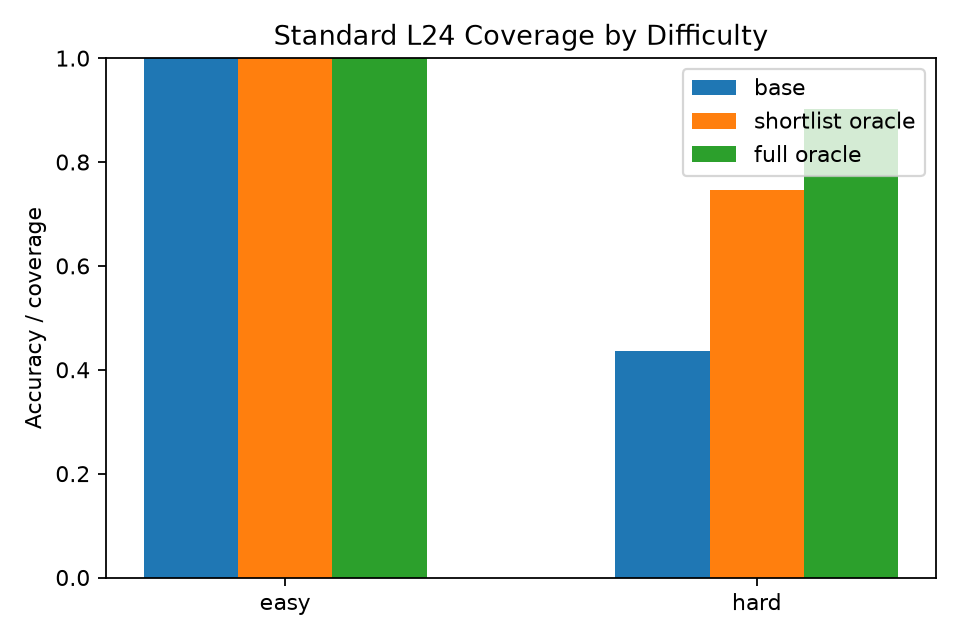
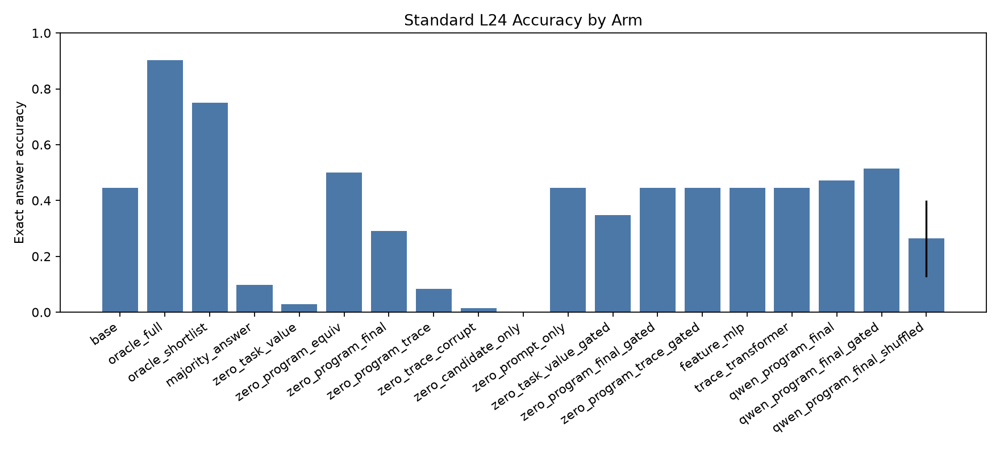
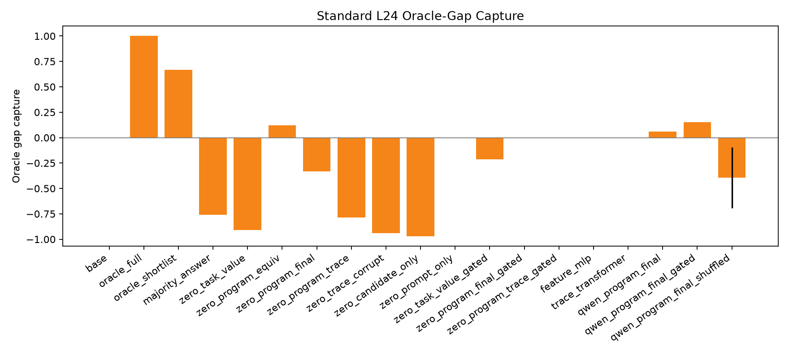
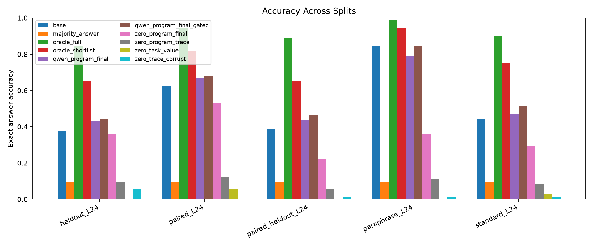

# Qwen Readable Candidate Verifier Report

## Summary

This standalone experiment tests whether a Qwen reader can select executable repair candidates when the task and candidate are rendered as readable pseudocode, claimed final values, and optional execution traces. Learned selectors are trained only from offline labels; at inference they do not receive the target answer or target state.

On `standard_L24`, the best non-oracle selector was `qwen_program_final_gated` at 51.4% accuracy and 15.2% oracle-gap capture versus 44.4% for no repair.

The best mean ranking AUC on `standard_L24` was `feature_mlp` at 0.799.

Frozen program-equivalence reading reached 50.0% accuracy with AUC 0.677; adding full trace text dropped to 8.3% with AUC 0.620, while corrupted trace dropped to 1.4% with AUC 0.486.

## Setup

- Base reader: `Qwen/Qwen3-4B`.

- Candidate shortlist size: `64`.

- Held-out source seed: `789`.

- Train groups per non-held-out source: `32`; validation groups per non-held-out source: `12`; eval groups per source/split: `24`.

- Frozen readable modes: `task_value,program_equiv,program_final,program_trace,trace_corrupt,candidate_only,prompt_only`.

- Trained Qwen head modes: `program_final`.

Selectors:

- `base`: no repair.

- `oracle_full`: best answer-correct candidate in the full candidate pool.

- `oracle_shortlist`: best answer-correct candidate in the deployable shortlist.

- `majority_answer`: chooses the most common claimed final value in the shortlist.

- `zero_task_value`: frozen Qwen reads the task program and scores candidates by the logit of each candidate's claimed final value.

- `zero_program_equiv`: frozen Qwen reads task program and candidate program, then answers whether they return the same value.

- `zero_program_final`: frozen Qwen reads task program, candidate program, and candidate claimed final value.

- `zero_program_trace`: frozen Qwen also receives a readable execution trace.

- `zero_trace_corrupt`: same as trace mode but with corrupted state order.

- `qwen_<mode>`: learned groupwise ranking head over frozen Qwen embeddings for that readable mode.

- `_gated`: validation-tuned base fallback for the corresponding score.

- Additional controls: prompt-only, candidate-only, feature-only, trace-only, and shuffled-label arms.

## Candidate Coverage

| split              |   groups |   avg_full_candidates |   avg_shortlist |   avg_target_answer_count |   avg_target_answer_margin | base_accuracy   | shortlist_oracle_accuracy   | full_oracle_accuracy   | shortlist_oracle_capture   |
|:-------------------|---------:|----------------------:|----------------:|--------------------------:|---------------------------:|:----------------|:----------------------------|:-----------------------|:---------------------------|
| heldout_L24        |       72 |                   177 |              64 |                     1.208 |                     -2.667 | 37.5%           | 65.3%                       | 84.7%                  | 77.0%                      |
| paired_L24         |       72 |                   177 |              64 |                     1.222 |                     -2.222 | 62.5%           | 81.9%                       | 94.4%                  | 86.8%                      |
| paired_heldout_L24 |       72 |                   177 |              64 |                     1.042 |                     -2.444 | 38.9%           | 65.3%                       | 88.9%                  | 73.4%                      |
| paraphrase_L24     |       72 |                   177 |              64 |                     1.75  |                     -1.861 | 84.7%           | 94.4%                       | 98.6%                  | 95.8%                      |
| standard_L24       |       72 |                   177 |              64 |                     1.431 |                     -2.472 | 44.4%           | 75.0%                       | 90.3%                  | 83.1%                      |
| train_mixed_L24    |       64 |                   177 |              64 |                     1.75  |                     -1.75  | 81.2%           | 96.9%                       | 100.0%                 | 96.9%                      |
| val_mixed_L24      |       24 |                   177 |              64 |                     1.167 |                     -2.583 | 75.0%           | 83.3%                       | 91.7%                  | 90.9%                      |

## Standard L24 Gate

| arm                         | mean_accuracy   | mean_gap_capture   | mean_auc   |   mean_changed |   mean_damage |   mean_recovery |
|:----------------------------|:----------------|:-------------------|:-----------|---------------:|--------------:|----------------:|
| base                        | 44.4%           | 0.0%               | n/a        |          0     |         0     |           0     |
| feature_mlp                 | 44.4%           | 0.0%               | 0.799      |          0     |         0     |           0     |
| majority_answer             | 9.7%            | -75.8%             | n/a        |          0.875 |         0.781 |           0     |
| oracle_full                 | 90.3%           | 100.0%             | n/a        |          0.458 |         0     |           0.825 |
| oracle_shortlist            | 75.0%           | 66.7%              | n/a        |          0.306 |         0     |           0.55  |
| qwen_program_final          | 47.2%           | 6.1%               | 0.669      |          0.569 |         0.094 |           0.125 |
| qwen_program_final_gated    | 51.4%           | 15.2%              | 0.669      |          0.299 |         0     |           0.125 |
| qwen_program_final_shuffled | 26.4%           | -39.4%             | 0.662      |          0.771 |         0.516 |           0.087 |
| trace_transformer           | 44.4%           | 0.0%               | 0.689      |          0     |         0     |           0     |
| zero_candidate_only         | 0.0%            | -97.0%             | 0.477      |          1     |         1     |           0     |
| zero_candidate_only_gated   | 36.1%           | -18.2%             | 0.477      |          0.139 |         0.188 |           0     |
| zero_program_equiv          | 50.0%           | 12.1%              | 0.677      |          0.486 |         0     |           0.1   |
| zero_program_equiv_gated    | 50.0%           | 12.1%              | 0.677      |          0.486 |         0     |           0.1   |
| zero_program_final          | 29.2%           | -33.3%             | 0.648      |          0.694 |         0.406 |           0.05  |
| zero_program_final_gated    | 44.4%           | 0.0%               | 0.648      |          0.056 |         0.031 |           0.025 |
| zero_program_trace          | 8.3%            | -78.8%             | 0.620      |          0.917 |         0.906 |           0.075 |
| zero_program_trace_gated    | 44.4%           | 0.0%               | 0.620      |          0     |         0     |           0     |
| zero_prompt_only            | 44.4%           | 0.0%               | 0.500      |          0     |         0     |           0     |
| zero_prompt_only_gated      | 44.4%           | 0.0%               | 0.500      |          0     |         0     |           0     |
| zero_task_value             | 2.8%            | -90.9%             | 0.462      |          0.972 |         0.938 |           0     |
| zero_task_value_gated       | 34.7%           | -21.2%             | 0.462      |          0.139 |         0.219 |           0     |
| zero_trace_corrupt          | 1.4%            | -93.9%             | 0.486      |          1     |         0.969 |           0     |
| zero_trace_corrupt_gated    | 44.4%           | 0.0%               | 0.486      |          0.028 |         0     |           0     |

## Easy/Hard Standard L24 Readout

| difficulty   | arm                      |   seed |   n | accuracy   | gap_capture   | ranking_auc   | changed_fraction   | damage_rate   | recovery_rate   |
|:-------------|:-------------------------|-------:|----:|:-----------|:--------------|:--------------|:-------------------|:--------------|:----------------|
| easy         | base                     |     -1 |   1 | 100.0%     | n/a           | n/a           | 0.0%               | 0.0%          | n/a             |
| hard         | base                     |     -1 |  71 | 43.7%      | 0.0%          | n/a           | 0.0%               | 0.0%          | 0.0%            |
| easy         | oracle_shortlist         |     -1 |   1 | 100.0%     | n/a           | n/a           | 0.0%               | 0.0%          | n/a             |
| hard         | oracle_shortlist         |     -1 |  71 | 74.6%      | 66.7%         | n/a           | 31.0%              | 0.0%          | 55.0%           |
| easy         | majority_answer          |     -1 |   1 | 100.0%     | n/a           | n/a           | 0.0%               | 0.0%          | n/a             |
| hard         | majority_answer          |     -1 |  71 | 8.5%       | -75.8%        | n/a           | 88.7%              | 80.6%         | 0.0%            |
| easy         | zero_task_value          |     -1 |   1 | 0.0%       | n/a           | 0.220         | 100.0%             | 100.0%        | n/a             |
| hard         | zero_task_value          |     -1 |  71 | 2.8%       | -87.9%        | 0.467         | 97.2%              | 93.5%         | 0.0%            |
| easy         | zero_program_final       |     -1 |   1 | 100.0%     | n/a           | 0.763         | 0.0%               | 0.0%          | n/a             |
| hard         | zero_program_final       |     -1 |  71 | 28.2%      | -33.3%        | 0.646         | 70.4%              | 41.9%         | 5.0%            |
| easy         | zero_program_trace       |     -1 |   1 | 0.0%       | n/a           | 0.780         | 100.0%             | 100.0%        | n/a             |
| hard         | zero_program_trace       |     -1 |  71 | 8.5%       | -75.8%        | 0.617         | 91.5%              | 90.3%         | 7.5%            |
| easy         | zero_trace_corrupt       |     -1 |   1 | 0.0%       | n/a           | 0.819         | 100.0%             | 100.0%        | n/a             |
| hard         | zero_trace_corrupt       |     -1 |  71 | 1.4%       | -90.9%        | 0.480         | 100.0%             | 96.8%         | 0.0%            |
| easy         | qwen_program_final       |    101 |   1 | 100.0%     | n/a           | 0.715         | 0.0%               | 0.0%          | n/a             |
| hard         | qwen_program_final       |    101 |  71 | 46.5%      | 6.1%          | 0.670         | 57.7%              | 9.7%          | 12.5%           |
| easy         | qwen_program_final_gated |    101 |   1 | 100.0%     | n/a           | 0.715         | 0.0%               | 0.0%          | n/a             |
| hard         | qwen_program_final_gated |    101 |  71 | 50.7%      | 15.2%         | 0.670         | 29.6%              | 0.0%          | 12.5%           |
| easy         | qwen_program_final       |    202 |   1 | 100.0%     | n/a           | 0.722         | 0.0%               | 0.0%          | n/a             |
| hard         | qwen_program_final       |    202 |  71 | 46.5%      | 6.1%          | 0.666         | 57.7%              | 9.7%          | 12.5%           |
| easy         | qwen_program_final_gated |    202 |   1 | 100.0%     | n/a           | 0.722         | 0.0%               | 0.0%          | n/a             |
| hard         | qwen_program_final_gated |    202 |  71 | 50.7%      | 15.2%         | 0.666         | 31.0%              | 0.0%          | 12.5%           |

## Split Results

| split              | arm                      |   seed | accuracy   | gap_capture   | ranking_auc   | changed_fraction   | damage_rate   | recovery_rate   |
|:-------------------|:-------------------------|-------:|:-----------|:--------------|:--------------|:-------------------|:--------------|:----------------|
| heldout_L24        | base                     |     -1 | 37.5%      | 0.0%          | n/a           | 0.0%               | 0.0%          | 0.0%            |
| paired_L24         | base                     |     -1 | 62.5%      | 0.0%          | n/a           | 0.0%               | 0.0%          | 0.0%            |
| paired_heldout_L24 | base                     |     -1 | 38.9%      | 0.0%          | n/a           | 0.0%               | 0.0%          | 0.0%            |
| paraphrase_L24     | base                     |     -1 | 84.7%      | 0.0%          | n/a           | 0.0%               | 0.0%          | 0.0%            |
| standard_L24       | base                     |     -1 | 44.4%      | 0.0%          | n/a           | 0.0%               | 0.0%          | 0.0%            |
| heldout_L24        | oracle_full              |     -1 | 84.7%      | 100.0%        | n/a           | 47.2%              | 0.0%          | 75.6%           |
| paired_L24         | oracle_full              |     -1 | 94.4%      | 100.0%        | n/a           | 31.9%              | 0.0%          | 85.2%           |
| paired_heldout_L24 | oracle_full              |     -1 | 88.9%      | 100.0%        | n/a           | 50.0%              | 0.0%          | 81.8%           |
| paraphrase_L24     | oracle_full              |     -1 | 98.6%      | 100.0%        | n/a           | 13.9%              | 0.0%          | 90.9%           |
| standard_L24       | oracle_full              |     -1 | 90.3%      | 100.0%        | n/a           | 45.8%              | 0.0%          | 82.5%           |
| heldout_L24        | oracle_shortlist         |     -1 | 65.3%      | 58.8%         | n/a           | 27.8%              | 0.0%          | 44.4%           |
| paired_L24         | oracle_shortlist         |     -1 | 81.9%      | 60.9%         | n/a           | 19.4%              | 0.0%          | 51.9%           |
| paired_heldout_L24 | oracle_shortlist         |     -1 | 65.3%      | 52.8%         | n/a           | 26.4%              | 0.0%          | 43.2%           |
| paraphrase_L24     | oracle_shortlist         |     -1 | 94.4%      | 70.0%         | n/a           | 9.7%               | 0.0%          | 63.6%           |
| standard_L24       | oracle_shortlist         |     -1 | 75.0%      | 66.7%         | n/a           | 30.6%              | 0.0%          | 55.0%           |
| heldout_L24        | majority_answer          |     -1 | 9.7%       | -58.8%        | n/a           | 80.6%              | 74.1%         | 0.0%            |
| paired_L24         | majority_answer          |     -1 | 9.7%       | -165.2%       | n/a           | 87.5%              | 84.4%         | 0.0%            |
| paired_heldout_L24 | majority_answer          |     -1 | 9.7%       | -58.3%        | n/a           | 86.1%              | 82.1%         | 4.5%            |
| paraphrase_L24     | majority_answer          |     -1 | 9.7%       | -540.0%       | n/a           | 90.3%              | 88.5%         | 0.0%            |
| standard_L24       | majority_answer          |     -1 | 9.7%       | -75.8%        | n/a           | 87.5%              | 78.1%         | 0.0%            |
| heldout_L24        | zero_task_value          |     -1 | 0.0%       | -79.4%        | 0.581         | 98.6%              | 100.0%        | 0.0%            |
| paired_L24         | zero_task_value          |     -1 | 5.6%       | -178.3%       | 0.527         | 95.8%              | 97.8%         | 11.1%           |
| paired_heldout_L24 | zero_task_value          |     -1 | 0.0%       | -77.8%        | 0.588         | 98.6%              | 100.0%        | 0.0%            |
| paraphrase_L24     | zero_task_value          |     -1 | 0.0%       | -610.0%       | 0.533         | 100.0%             | 100.0%        | 0.0%            |
| standard_L24       | zero_task_value          |     -1 | 2.8%       | -90.9%        | 0.462         | 97.2%              | 93.8%         | 0.0%            |
| heldout_L24        | zero_task_value_gated    |     -1 | 36.1%      | -2.9%         | 0.581         | 6.9%               | 3.7%          | 0.0%            |
| paired_L24         | zero_task_value_gated    |     -1 | 59.7%      | -8.7%         | 0.527         | 6.9%               | 4.4%          | 0.0%            |
| paired_heldout_L24 | zero_task_value_gated    |     -1 | 36.1%      | -5.6%         | 0.588         | 11.1%              | 7.1%          | 0.0%            |
| paraphrase_L24     | zero_task_value_gated    |     -1 | 70.8%      | -100.0%       | 0.533         | 20.8%              | 16.4%         | 0.0%            |
| standard_L24       | zero_task_value_gated    |     -1 | 34.7%      | -21.2%        | 0.462         | 13.9%              | 21.9%         | 0.0%            |
| heldout_L24        | zero_program_equiv       |     -1 | 44.4%      | 14.7%         | 0.751         | 58.3%              | 3.7%          | 13.3%           |
| paired_L24         | zero_program_equiv       |     -1 | 62.5%      | 0.0%          | 0.824         | 37.5%              | 8.9%          | 14.8%           |
| paired_heldout_L24 | zero_program_equiv       |     -1 | 45.8%      | 13.9%         | 0.745         | 56.9%              | 3.6%          | 13.6%           |
| paraphrase_L24     | zero_program_equiv       |     -1 | 84.7%      | 0.0%          | 0.733         | 9.7%               | 0.0%          | 0.0%            |
| standard_L24       | zero_program_equiv       |     -1 | 50.0%      | 12.1%         | 0.677         | 48.6%              | 0.0%          | 10.0%           |
| heldout_L24        | zero_program_final       |     -1 | 36.1%      | -2.9%         | 0.738         | 65.3%              | 22.2%         | 11.1%           |
| paired_L24         | zero_program_final       |     -1 | 52.8%      | -30.4%        | 0.786         | 47.2%              | 20.0%         | 7.4%            |
| paired_heldout_L24 | zero_program_final       |     -1 | 22.2%      | -33.3%        | 0.698         | 76.4%              | 50.0%         | 4.5%            |
| paraphrase_L24     | zero_program_final       |     -1 | 36.1%      | -350.0%       | 0.663         | 59.7%              | 57.4%         | 0.0%            |
| standard_L24       | zero_program_final       |     -1 | 29.2%      | -33.3%        | 0.648         | 69.4%              | 40.6%         | 5.0%            |
| heldout_L24        | zero_program_final_gated |     -1 | 40.3%      | 5.9%          | 0.738         | 5.6%               | 0.0%          | 4.4%            |
| paired_L24         | zero_program_final_gated |     -1 | 63.9%      | 4.3%          | 0.786         | 2.8%               | 0.0%          | 3.7%            |
| paired_heldout_L24 | zero_program_final_gated |     -1 | 40.3%      | 2.8%          | 0.698         | 6.9%               | 0.0%          | 2.3%            |
| paraphrase_L24     | zero_program_final_gated |     -1 | 81.9%      | -20.0%        | 0.663         | 2.8%               | 3.3%          | 0.0%            |
| standard_L24       | zero_program_final_gated |     -1 | 44.4%      | 0.0%          | 0.648         | 5.6%               | 3.1%          | 2.5%            |
| heldout_L24        | zero_program_trace       |     -1 | 9.7%       | -58.8%        | 0.712         | 88.9%              | 81.5%         | 4.4%            |
| paired_L24         | zero_program_trace       |     -1 | 12.5%      | -156.5%       | 0.652         | 87.5%              | 82.2%         | 3.7%            |
| paired_heldout_L24 | zero_program_trace       |     -1 | 5.6%       | -66.7%        | 0.640         | 91.7%              | 85.7%         | 0.0%            |
| paraphrase_L24     | zero_program_trace       |     -1 | 11.1%      | -530.0%       | 0.655         | 87.5%              | 86.9%         | 0.0%            |
| standard_L24       | zero_program_trace       |     -1 | 8.3%       | -78.8%        | 0.620         | 91.7%              | 90.6%         | 7.5%            |
| heldout_L24        | zero_program_trace_gated |     -1 | 37.5%      | 0.0%          | 0.712         | 0.0%               | 0.0%          | 0.0%            |
| paired_L24         | zero_program_trace_gated |     -1 | 62.5%      | 0.0%          | 0.652         | 0.0%               | 0.0%          | 0.0%            |
| paired_heldout_L24 | zero_program_trace_gated |     -1 | 38.9%      | 0.0%          | 0.640         | 0.0%               | 0.0%          | 0.0%            |
| paraphrase_L24     | zero_program_trace_gated |     -1 | 84.7%      | 0.0%          | 0.655         | 0.0%               | 0.0%          | 0.0%            |
| standard_L24       | zero_program_trace_gated |     -1 | 44.4%      | 0.0%          | 0.620         | 0.0%               | 0.0%          | 0.0%            |
| heldout_L24        | zero_trace_corrupt       |     -1 | 5.6%       | -67.6%        | 0.582         | 94.4%              | 88.9%         | 2.2%            |
| paired_L24         | zero_trace_corrupt       |     -1 | 0.0%       | -195.7%       | 0.444         | 100.0%             | 100.0%        | 0.0%            |
| paired_heldout_L24 | zero_trace_corrupt       |     -1 | 1.4%       | -75.0%        | 0.520         | 97.2%              | 96.4%         | 0.0%            |
| paraphrase_L24     | zero_trace_corrupt       |     -1 | 1.4%       | -600.0%       | 0.471         | 98.6%              | 98.4%         | 0.0%            |
| standard_L24       | zero_trace_corrupt       |     -1 | 1.4%       | -93.9%        | 0.486         | 100.0%             | 96.9%         | 0.0%            |
| heldout_L24        | qwen_program_final       |    101 | 43.1%      | 11.8%         | 0.752         | 51.4%              | 3.7%          | 11.1%           |
| paired_L24         | qwen_program_final       |    101 | 66.7%      | 13.0%         | 0.802         | 30.6%              | 2.2%          | 14.8%           |
| paired_heldout_L24 | qwen_program_final       |    101 | 44.4%      | 11.1%         | 0.742         | 58.3%              | 7.1%          | 13.6%           |
| paraphrase_L24     | qwen_program_final       |    101 | 79.2%      | -40.0%        | 0.741         | 18.1%              | 6.6%          | 0.0%            |
| standard_L24       | qwen_program_final       |    101 | 47.2%      | 6.1%          | 0.671         | 56.9%              | 9.4%          | 12.5%           |
| heldout_L24        | qwen_program_final_gated |    101 | 44.4%      | 14.7%         | 0.752         | 20.8%              | 0.0%          | 11.1%           |
| paired_L24         | qwen_program_final_gated |    101 | 68.1%      | 17.4%         | 0.802         | 16.7%              | 0.0%          | 14.8%           |
| paired_heldout_L24 | qwen_program_final_gated |    101 | 47.2%      | 16.7%         | 0.742         | 31.9%              | 0.0%          | 13.6%           |
| paraphrase_L24     | qwen_program_final_gated |    101 | 84.7%      | 0.0%          | 0.741         | 2.8%               | 0.0%          | 0.0%            |
| standard_L24       | qwen_program_final_gated |    101 | 51.4%      | 15.2%         | 0.671         | 29.2%              | 0.0%          | 12.5%           |
| heldout_L24        | qwen_program_final       |    202 | 43.1%      | 11.8%         | 0.756         | 51.4%              | 3.7%          | 11.1%           |
| paired_L24         | qwen_program_final       |    202 | 66.7%      | 13.0%         | 0.797         | 29.2%              | 2.2%          | 14.8%           |
| paired_heldout_L24 | qwen_program_final       |    202 | 43.1%      | 8.3%          | 0.746         | 59.7%              | 7.1%          | 11.4%           |
| paraphrase_L24     | qwen_program_final       |    202 | 79.2%      | -40.0%        | 0.739         | 18.1%              | 6.6%          | 0.0%            |
| standard_L24       | qwen_program_final       |    202 | 47.2%      | 6.1%          | 0.667         | 56.9%              | 9.4%          | 12.5%           |
| heldout_L24        | qwen_program_final_gated |    202 | 44.4%      | 14.7%         | 0.756         | 23.6%              | 0.0%          | 11.1%           |
| paired_L24         | qwen_program_final_gated |    202 | 68.1%      | 17.4%         | 0.797         | 18.1%              | 0.0%          | 14.8%           |
| paired_heldout_L24 | qwen_program_final_gated |    202 | 45.8%      | 13.9%         | 0.746         | 30.6%              | 0.0%          | 11.4%           |
| paraphrase_L24     | qwen_program_final_gated |    202 | 84.7%      | 0.0%          | 0.739         | 2.8%               | 0.0%          | 0.0%            |
| standard_L24       | qwen_program_final_gated |    202 | 51.4%      | 15.2%         | 0.667         | 30.6%              | 0.0%          | 12.5%           |

## Held-Out Source Readout

| arm                         |   seed | accuracy   | base_accuracy   | oracle_accuracy   | gap_capture   | ranking_auc   | changed_fraction   | damage_rate   | recovery_rate   |
|:----------------------------|-------:|:-----------|:----------------|:------------------|:--------------|:--------------|:-------------------|:--------------|:----------------|
| base                        |     -1 | 91.7%      | 91.7%           | 95.8%             | 0.0%          | n/a           | 0.0%               | 0.0%          | 0.0%            |
| oracle_full                 |     -1 | 95.8%      | 91.7%           | 95.8%             | 100.0%        | n/a           | 4.2%               | 0.0%          | 50.0%           |
| oracle_shortlist            |     -1 | 95.8%      | 91.7%           | 95.8%             | 100.0%        | n/a           | 4.2%               | 0.0%          | 50.0%           |
| majority_answer             |     -1 | 12.5%      | 91.7%           | 95.8%             | -1900.0%      | n/a           | 87.5%              | 86.4%         | 0.0%            |
| zero_task_value             |     -1 | 4.2%       | 91.7%           | 95.8%             | -2100.0%      | 0.448         | 95.8%              | 95.5%         | 0.0%            |
| zero_task_value_gated       |     -1 | 75.0%      | 91.7%           | 95.8%             | -400.0%       | 0.448         | 16.7%              | 18.2%         | 0.0%            |
| zero_program_equiv          |     -1 | 95.8%      | 91.7%           | 95.8%             | 100.0%        | 0.770         | 8.3%               | 0.0%          | 50.0%           |
| zero_program_equiv_gated    |     -1 | 95.8%      | 91.7%           | 95.8%             | 100.0%        | 0.770         | 8.3%               | 0.0%          | 50.0%           |
| zero_program_final          |     -1 | 54.2%      | 91.7%           | 95.8%             | -900.0%       | 0.718         | 45.8%              | 40.9%         | 0.0%            |
| zero_program_final_gated    |     -1 | 87.5%      | 91.7%           | 95.8%             | -100.0%       | 0.718         | 4.2%               | 4.5%          | 0.0%            |
| zero_program_trace          |     -1 | 12.5%      | 91.7%           | 95.8%             | -1900.0%      | 0.634         | 87.5%              | 86.4%         | 0.0%            |
| zero_program_trace_gated    |     -1 | 91.7%      | 91.7%           | 95.8%             | 0.0%          | 0.634         | 0.0%               | 0.0%          | 0.0%            |
| zero_trace_corrupt          |     -1 | 0.0%       | 91.7%           | 95.8%             | -2200.0%      | 0.513         | 100.0%             | 100.0%        | 0.0%            |
| zero_trace_corrupt_gated    |     -1 | 91.7%      | 91.7%           | 95.8%             | 0.0%          | 0.513         | 4.2%               | 0.0%          | 0.0%            |
| zero_candidate_only         |     -1 | 0.0%       | 91.7%           | 95.8%             | -2200.0%      | 0.448         | 100.0%             | 100.0%        | 0.0%            |
| zero_candidate_only_gated   |     -1 | 75.0%      | 91.7%           | 95.8%             | -400.0%       | 0.448         | 16.7%              | 18.2%         | 0.0%            |
| zero_prompt_only            |     -1 | 91.7%      | 91.7%           | 95.8%             | 0.0%          | 0.500         | 0.0%               | 0.0%          | 0.0%            |
| zero_prompt_only_gated      |     -1 | 91.7%      | 91.7%           | 95.8%             | 0.0%          | 0.500         | 0.0%               | 0.0%          | 0.0%            |
| feature_mlp                 |    101 | 91.7%      | 91.7%           | 95.8%             | 0.0%          | 0.989         | 0.0%               | 0.0%          | 0.0%            |
| trace_transformer           |    101 | 91.7%      | 91.7%           | 95.8%             | 0.0%          | 0.794         | 0.0%               | 0.0%          | 0.0%            |
| qwen_program_final          |    101 | 87.5%      | 91.7%           | 95.8%             | -100.0%       | 0.769         | 16.7%              | 9.1%          | 50.0%           |
| qwen_program_final_gated    |    101 | 95.8%      | 91.7%           | 95.8%             | 100.0%        | 0.769         | 8.3%               | 0.0%          | 50.0%           |
| qwen_program_final_shuffled |    101 | 37.5%      | 91.7%           | 95.8%             | -1300.0%      | 0.720         | 62.5%              | 59.1%         | 0.0%            |
| feature_mlp                 |    202 | 91.7%      | 91.7%           | 95.8%             | 0.0%          | 0.993         | 0.0%               | 0.0%          | 0.0%            |
| trace_transformer           |    202 | 91.7%      | 91.7%           | 95.8%             | 0.0%          | 0.828         | 0.0%               | 0.0%          | 0.0%            |
| qwen_program_final          |    202 | 87.5%      | 91.7%           | 95.8%             | -100.0%       | 0.769         | 16.7%              | 9.1%          | 50.0%           |
| qwen_program_final_gated    |    202 | 95.8%      | 91.7%           | 95.8%             | 100.0%        | 0.769         | 8.3%               | 0.0%          | 50.0%           |
| qwen_program_final_shuffled |    202 | 62.5%      | 91.7%           | 95.8%             | -700.0%       | 0.766         | 37.5%              | 31.8%         | 0.0%            |

## Training Dynamics

| arm                         |   seed |   epoch |   train_loss | val_accuracy   | val_damage_rate   | val_recovery_rate   |   val_utility |
|:----------------------------|-------:|--------:|-------------:|:---------------|:------------------|:--------------------|--------------:|
| qwen_program_final_shuffled |    101 |       8 |        3.711 | 0.0%           | 100.0%            | 0.0%                |         -0.75 |
| qwen_program_final          |    101 |       8 |        0.71  | 75.0%          | 5.6%              | 16.7%               |          0.75 |
| feature_mlp                 |    101 |       8 |        0.062 | 75.0%          | 0.0%              | 0.0%                |          0.75 |
| trace_transformer           |    101 |       8 |        1.435 | 75.0%          | 0.0%              | 0.0%                |          0.75 |
| trace_transformer           |    202 |       8 |        1.372 | 75.0%          | 0.0%              | 0.0%                |          0.75 |
| feature_mlp                 |    202 |       8 |        0.067 | 75.0%          | 0.0%              | 0.0%                |          0.75 |
| qwen_program_final          |    202 |       8 |        0.918 | 75.0%          | 5.6%              | 16.7%               |          0.75 |
| qwen_program_final_shuffled |    202 |       8 |        3.657 | 0.0%           | 100.0%            | 0.0%                |         -0.75 |

## Interpretation

The decisive measurement is not raw accuracy alone. The report separates candidate coverage from selector capture, because a selector cannot choose a correct program that is absent from its candidate shortlist. A useful selector should capture a stable fraction of the available oracle gap, rank correct candidates above wrong candidates, make nontrivial repairs, and avoid damaging already-correct base programs. Easy and hard rows test whether failures are caused by representation readability or by candidate sets where the target answer is not distinguishable from simple shortlist statistics. In this run the easy/hard split is itself diagnostic: only one `standard_L24` group was easy under the claimed-output frequency criterion, so most of the evaluated repair decisions sit in the hard regime.

## Artifacts

- Run directory: `/workspace/experiments/qwen_readable_candidate_verifier/runs/main_qwen_readable_candidate_verifier_v5`

- Large embeddings: `/workspace/large_artifacts/qwen_readable_candidate_verifier/embeddings/main_qwen_readable_candidate_verifier_v1`

- Large checkpoints: `/workspace/large_artifacts/qwen_readable_candidate_verifier/checkpoints/main_qwen_readable_candidate_verifier_v5`

- Metrics CSV: `/workspace/experiments/qwen_readable_candidate_verifier/reports/metrics.csv`

- Candidate summary CSV: `/workspace/experiments/qwen_readable_candidate_verifier/reports/candidate_summary.csv`
