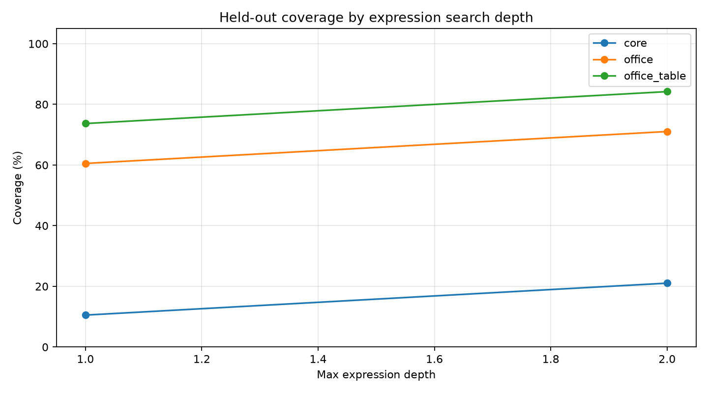
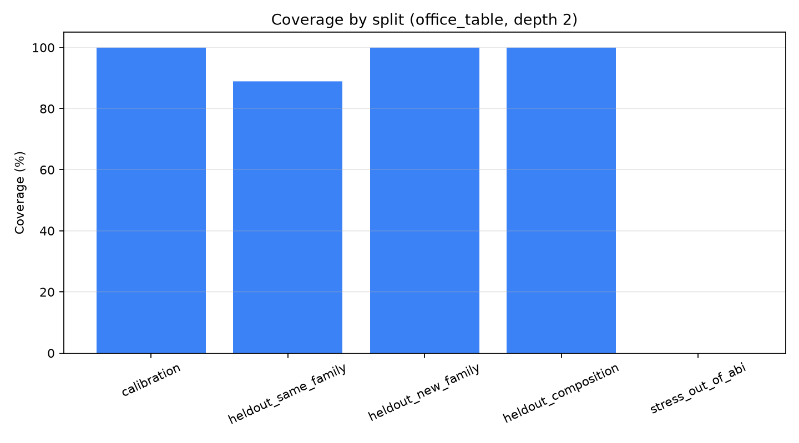
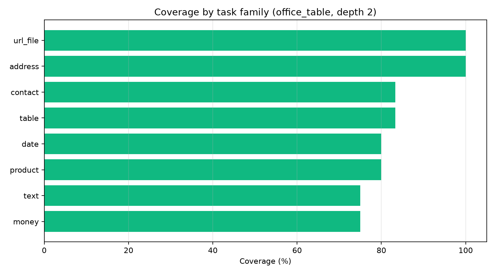
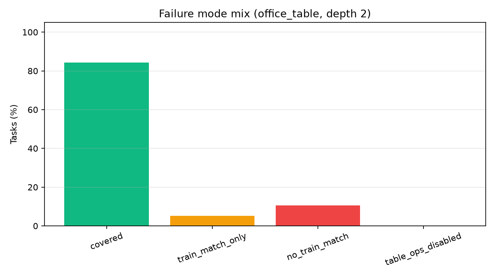
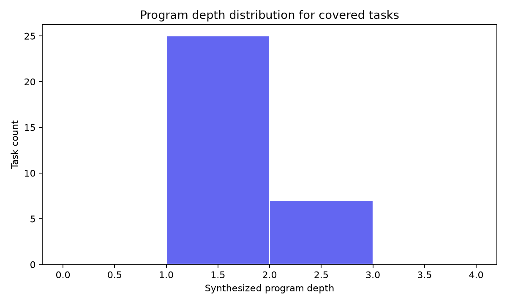

# Qwen Real Task ABI Coverage Gate

## Abstract

This standalone experiment tests whether a frozen office-data ABI covers real-style deterministic tasks that were not generated from that ABI. It uses oracle enumeration, not model training: the result is a decomposability gate for whether a large compiler corpus is worth building.

## Method

- The ABI is a fixed library of scalar string/date/money/contact/file operations plus small-table aggregation templates.
- Task references are ordinary Python functions over hand-curated examples; task outputs are not produced by stored ABI programs.
- The oracle enumerates expressions from visible fields/constants, fits train examples, then tests held-out examples for each task.
- ABI variants are `core`, `office`, and `office_table`; the primary gate is `office_table` at the largest search depth.

## Run Configuration

- Suite: `main`.
- Tasks: `38` total, `6` table tasks under the primary slice.
- Primary ABI/depth: `office_table`, depth `2`.
- Large artifacts directory: `/workspace/large_artifacts/qwen_real_task_abi_coverage_gate`.

## Primary Results

- Overall held-out coverage: 84.2% (32/38 tasks).
- Calibration coverage: 100.0% (10/10).
- Non-calibration coverage: 78.6% (22/28).
- Held-out composition coverage: 100.0% (8/8).
- Stress/out-of-ABI coverage: 0.0% (0/5).
- Table-task coverage: 83.3% (5/6).
- Train-match-only rate: 5.3%.
- No-train-match rate: 10.5%.

### Overall By ABI

|variant|max_depth|tasks|heldout_covered|train_match_rate|train_match_only|no_train_match|
|---|---|---|---|---|---|---|
|core|1|38|10.5%|15.8%|5.3%|84.2%|
|core|2|38|21.1%|26.3%|5.3%|73.7%|
|office|1|38|60.5%|65.8%|5.3%|34.2%|
|office|2|38|71.1%|76.3%|5.3%|23.7%|
|office_table|1|38|73.7%|78.9%|5.3%|21.1%|
|office_table|2|38|84.2%|89.5%|5.3%|10.5%|

### Primary Split Summary

|split|tasks|heldout_covered|train_match_rate|train_match_only|no_train_match|
|---|---|---|---|---|---|
|calibration|10|100.0%|100.0%|0.0%|0.0%|
|heldout_composition|8|100.0%|100.0%|0.0%|0.0%|
|heldout_new_family|6|100.0%|100.0%|0.0%|0.0%|
|heldout_same_family|9|93.3%|100.0%|6.7%|0.0%|
|stress_out_of_abi|5|0.0%|20.0%|20.0%|80.0%|

### Covered Program Examples

|task_id|family|split|program_depth|program|
|---|---|---|---|---|
|address_city|address|heldout_new_family|1.00|city_before_state(FIELD(address))|
|address_state|address|heldout_new_family|1.00|us_state(FIELD(address))|
|address_zip5|address|heldout_new_family|1.00|zip5(FIELD(address))|
|contact_email_company|contact|heldout_same_family|1.00|email_company(FIELD(email))|
|contact_email_domain|contact|calibration|1.00|email_domain(FIELD(email))|
|contact_name_initials|contact|calibration|1.00|initials(FIELD(name))|
|contact_phone_e164|contact|calibration|1.00|phone_e164_us(FIELD(phone))|
|contact_phone_last4|contact|heldout_same_family|1.00|phone_last4(FIELD(phone))|
|date_days_between|date|heldout_composition|1.00|date_diff_days(FIELD(end),FIELD(start))|
|date_month_name|date|heldout_same_family|1.00|date_month_name(FIELD(date))|
|date_quarter_label|date|heldout_same_family|1.00|date_quarter(FIELD(date))|
|date_to_iso|date|calibration|1.00|date_iso(FIELD(date))|
|money_cents|money|calibration|1.00|money_cents(FIELD(price))|
|money_line_total_cents|money|heldout_composition|2.00|mul(FIELD(qty),alnum(FIELD(price)))|
|money_percent_decimal|money|calibration|1.00|percent_float(FIELD(discount))|
|code_after_colon|product|heldout_same_family|1.00|digits(FIELD(code))|
|sku_prefix|product|calibration|1.00|sku_prefix(FIELD(sku))|
|sku_suffix|product|heldout_same_family|1.00|sku_suffix(FIELD(sku))|

### Uncovered Examples

|task_id|family|split|failure_reason|train_match|program|
|---|---|---|---|---|---|
|contact_normalize_name|contact|heldout_same_family|train_match_only|True|title(FIELD(name))|
|date_fiscal_year_july|date|stress_out_of_abi|no_train_match|False||
|money_discounted_total|money|stress_out_of_abi|no_train_match|False||
|sku_middle_segment|product|stress_out_of_abi|train_match_only|True|digits(FIELD(sku))|
|table_latest_paid_amount|table|stress_out_of_abi|no_train_match|False||
|phrase_slug|text|stress_out_of_abi|no_train_match|False||

## Interpretation

The fixed ABI covers a meaningful fraction of real-style deterministic tasks, but coverage is far from universal. The gap between calibration and stress splits is the main signal: common office transforms decompose well, while tasks that require bespoke fiscal logic, middle-token extraction, discount formulas, or latest-row selection expose missing primitives or missing control patterns.
The positive read is that held-out composition and held-out new-family tasks are covered in this catalog, including table filters and aggregations. The negative read is equally important: every deliberately out-of-ABI stress task fails, so the ABI cannot be treated as an open-ended intelligence multiplier without a retrieval/extension path for missing primitives.
A train-match-only result is treated as a warning rather than success: it means the ABI/search can fit visible examples but does not identify the actual task robustly on held-out examples.
This is a gate, not a compiler result. If the target domain is restricted to covered families, the ABI direction has a real base to build on. If the target domain includes the uncovered stress patterns, the ABI must be expanded or paired with retrieval/tooling before model training is worth scaling.
The next decisive step is a less hand-curated corpus: either production-like task logs or a public deterministic transformation benchmark, with the ABI frozen before evaluating that set.

## Limitations

The tasks are hand-curated real-style examples, not production logs or a public benchmark. That is stronger than factory-generated ABI compositions but still not a definitive real-world coverage estimate. The oracle is bounded by the implemented search space, so some misses may be search misses rather than true ABI misses. The table ABI is intentionally small and does not include sorting or window operations.

## Artifacts

- Details: `analysis/details.csv`
- Summary: `analysis/summary.csv` and `analysis/overall_summary.csv`
- Task catalog: `analysis/task_catalog.json`
- Large artifacts directory: `/workspace/large_artifacts/qwen_real_task_abi_coverage_gate`
