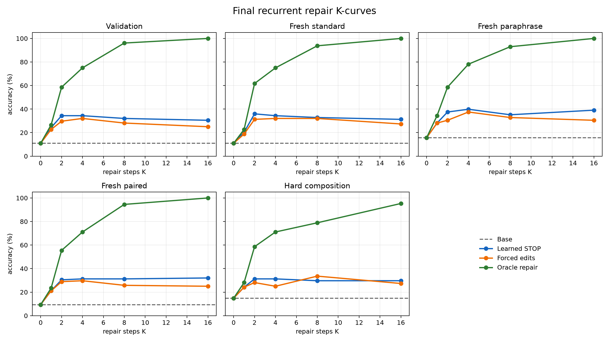
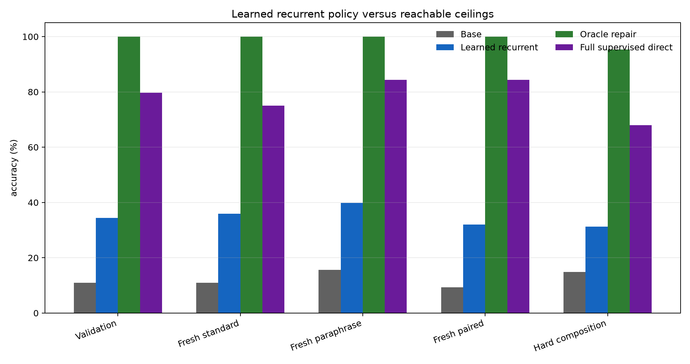
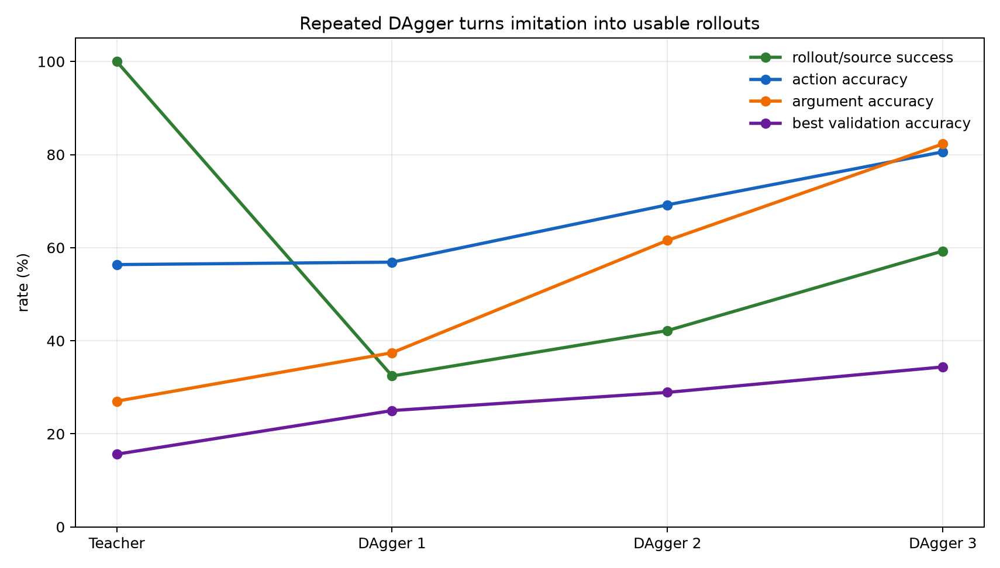
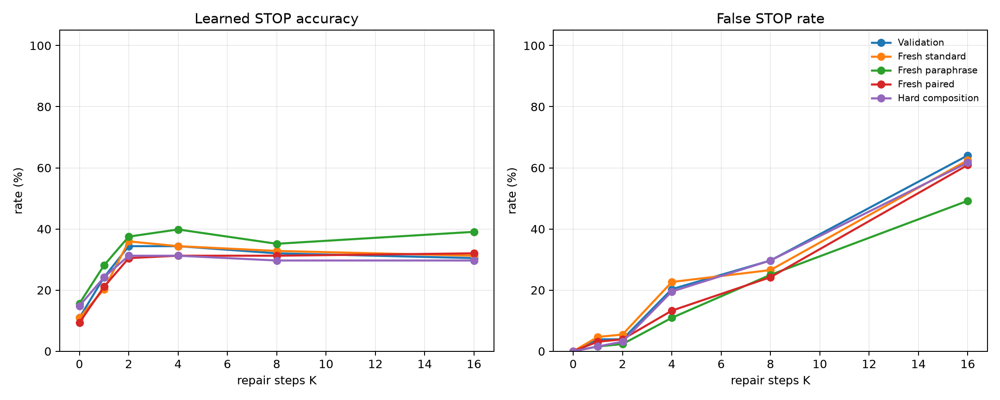
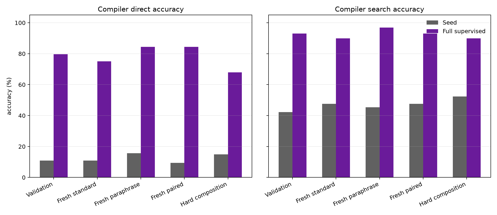

# Recurrent VM Repair Policy Attached to Frozen Qwen

## Abstract

This experiment tests whether a frozen 4B language model can be given a learned recurrent program-repair loop at posttraining time. A compiler reads frozen `Qwen/Qwen3-4B` token hidden states and emits a typed stack-machine program. A repair policy then runs as an MDP: observe the prompt features, current program, and VM execution trace; choose one edit or STOP; execute the edited program; repeat for up to `K` private steps.

The result is a partial but real positive. The final learned recurrent policy improves over the seed compiler on every split, reaching 34.4% validation accuracy and 39.8% fresh-paraphrase accuracy from 10.9% and 15.6% base accuracy. Three rounds of DAgger raise training-rollout success from 32.4% to 59.3%. The oracle repair policy still reaches 95.3%-100.0%, and the full supervised compiler reaches 68.0%-84.4% direct accuracy. The recurrent loop is useful, but the remaining gap is large.

## Setup

- Base model: `Qwen/Qwen3-4B`, frozen and used as a hidden-state feature extractor.
- Trainable modules: typed bytecode compiler and recurrent edit/STOP policy.
- Seed compiler examples: `192`.
- Recurrent-policy training examples: `1024`.
- Full-supervised ceiling examples: `1024`, combined with the seed set.
- Evaluation size: `128` per split.
- VM: stack bytecode with `PUSH`, arithmetic, comparisons, table lookup, `END`, and `PAD`.
- Recurrent budgets: `K = 0, 1, 2, 4, 8, 16`.
- Main run: `main_recurrent_vm_repair_crossattn_dagger3_s192_c1024`.
- Large checkpoints: `large_artifacts/qwen_recurrent_vm_repair_policy/checkpoints/main_recurrent_vm_repair_crossattn_dagger3_s192_c1024/`.

## Method

The seed compiler emits an initial program from frozen Qwen hidden states. The repair policy receives:

- token-level frozen Qwen hidden states through cross-attention;
- the current bytecode program;
- VM validity, final value, stack-top trace, and stack-depth trace;
- the current recurrent step index.

It predicts one of three action kinds: STOP, edit an opcode slot, or edit an argument slot. Oracle trajectories are generated by comparing the current program to the gold program and taking one edit at a time. DAgger then rolls out the learned policy, labels the states it actually visits with the oracle next action, and retrains on the accumulated state set.

## Main Results

| Split            | Base   | Learned STOP   | Forced edits   | Oracle repair   | Full sup. direct   | Full sup. search   |
|:-----------------|:-------|:---------------|:---------------|:----------------|:-------------------|:-------------------|
| Validation       | 10.9%  | 34.4% (K=2)    | 32.0% (K=4)    | 100.0%          | 79.7%              | 93.0%              |
| Fresh standard   | 10.9%  | 35.9% (K=2)    | 32.0% (K=4)    | 100.0%          | 75.0%              | 89.8%              |
| Fresh paraphrase | 15.6%  | 39.8% (K=4)    | 37.5% (K=4)    | 100.0%          | 84.4%              | 96.9%              |
| Fresh paired     | 9.4%   | 32.0% (K=16)   | 29.7% (K=4)    | 100.0%          | 84.4%              | 93.0%              |
| Hard composition | 14.8%  | 31.2% (K=2)    | 33.6% (K=8)    | 95.3%           | 68.0%              | 89.8%              |

## DAgger Dynamics

| Phase          | Source success   | Action acc.   | Arg acc.   | Val best     | Hard best   |
|:---------------|:-----------------|:--------------|:-----------|:-------------|:------------|
| Teacher policy | 100.0%           | 56.4%         | 27.0%      | 15.6% (K=2)  | 21.1% (K=2) |
| DAgger round 1 | 32.4%            | 56.9%         | 37.4%      | 25.0% (K=16) | 29.7% (K=4) |
| DAgger round 2 | 42.2%            | 69.2%         | 61.6%      | 28.9% (K=16) | 28.1% (K=4) |
| DAgger round 3 | 59.3%            | 80.6%         | 82.3%      | 34.4% (K=2)  | 31.2% (K=2) |

The important signal is not just lower training loss. Repeated on-policy correction changes rollout success: the policy succeeds on 32.4% of first-round visited programs, 42.2% in round 2, and 59.3% in round 3. Argument accuracy also rises from 37.4% after round 1 to 82.3% after round 3, which matters because argument edits carry the numeric content of the prompt.

## STOP Behavior

Learned STOP is helpful at moderate `K`, but it remains imperfect. The final policy often peaks at `K=2` or `K=4`; larger `K` can introduce false STOPs or unnecessary edits, especially on paired prompts. This is a learning problem, not an environment reachability problem, because the oracle repair policy remains near perfect.

## Compiler Ceiling

The full-supervised compiler ceiling is high: direct accuracy reaches 68.0-84.4%, and answer-verified search reaches 89.8-96.9%. That confirms the frozen Qwen features contain enough information for the bytecode task. The recurrent policy has learned a meaningful part of the repair process, but not enough to match dense supervised program learning.

## Interpretation

This experiment supports a narrow claim: a Qwen-attached recurrent VM repair loop can turn extra private compute steps into better answers under learned policy control. The strongest evidence is the DAgger progression plus the final learned K-curves. The policy is not merely a static reranker; it executes a sequence of edits, observes the VM after each edit, and improves as the state distribution is corrected.

The result does not support a broad claim of universal intelligence gain. The oracle and full-supervised ceilings show much more is reachable, but the learned policy still leaves most of the oracle gap open. The bottleneck is now policy learning: STOP calibration, choosing the right number of edits, and robust argument edits under prompt variation.

## Next Experiments

1. Add a learned value function over VM states and train the policy with advantage-weighted imitation so STOP is tied to expected answer improvement.
2. Distill oracle trajectories with dense intermediate value targets, not only next-action labels.
3. Use beam-style recurrent repair with a learned verifier over resulting VM states, then distill the best repair path back into the one-action policy.
4. Replace gold-program edit distance with answer-equivalent repair targets so the policy is not punished for alternate correct programs.
5. Test a token-output bridge where the same recurrent VM state is fed back into Qwen over multiple turns until a learned halt decision fires.

## Artifacts

- Script: `experiments/qwen_recurrent_vm_repair_policy/src/qwen_recurrent_vm_repair_policy_experiment.py`
- Analysis: `experiments/qwen_recurrent_vm_repair_policy/src/analyze_qwen_recurrent_vm_repair_policy.py`
- Main run: `experiments/qwen_recurrent_vm_repair_policy/runs/main_recurrent_vm_repair_crossattn_dagger3_s192_c1024/`
- Aggregate metrics: `experiments/qwen_recurrent_vm_repair_policy/analysis/`
- Markdown report: `experiments/qwen_recurrent_vm_repair_policy/reports/qwen_recurrent_vm_repair_policy_report.md`
- HTML report: `experiments/qwen_recurrent_vm_repair_policy/reports/qwen_recurrent_vm_repair_policy_report.html`
