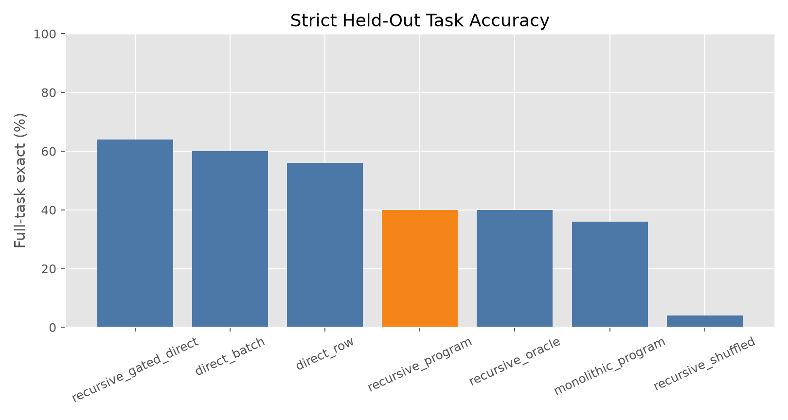
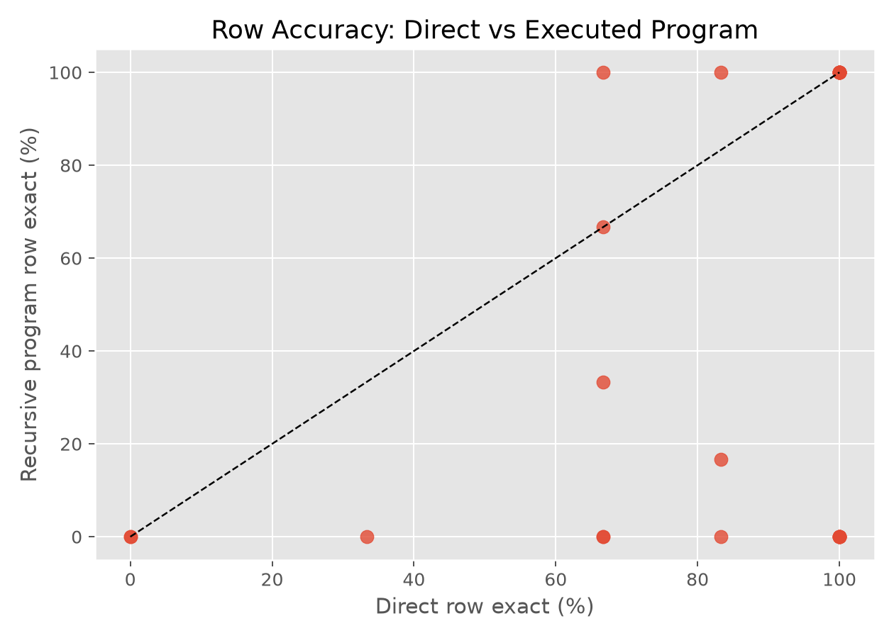
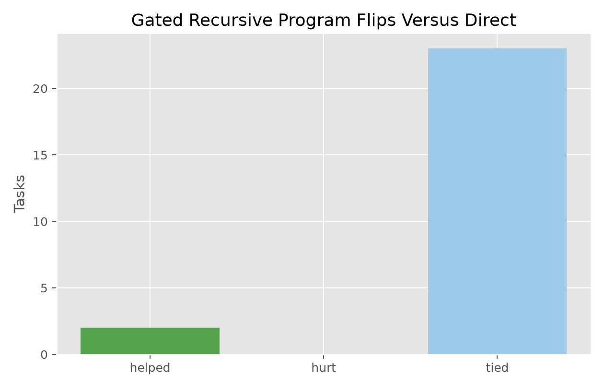

# Recursive Ephemeral Program Induction

## Question

Can a frozen language model convert sparse input-output examples into a task-local executable program that is more consistent than direct row-by-row answering?

The method asks the model to write a Python `transform(row)` function. Candidate programs are executed on visible examples. Only visible examples are used for selection and repair. Held-out rows are used only for final scoring.

## Setup

- Run: `main_v1`
- Dataset: public text-transformation tasks.
- Tasks: `25`
- Visible examples per task: `4`
- Held-out cap per task: `6`
- Program variants: `monolithic,robust`
- Repair rounds: `1`
- Elapsed seconds: `1444.2`

## Main Result

| method                 |   tasks | row_exact   | full_task_exact   | train_pass_rate   |   tasks_helped_vs_direct |   tasks_hurt_vs_direct |
|:-----------------------|--------:|:------------|:------------------|:------------------|-------------------------:|-----------------------:|
| recursive_gated_direct |      25 | 82.7%       | 64.0%             | 44.0%             |                        2 |                      0 |
| direct_batch           |      25 | 76.0%       | 60.0%             |                   |                        2 |                      1 |
| direct_row             |      25 | 80.7%       | 56.0%             |                   |                        0 |                      0 |
| recursive_program      |      25 | 44.7%       | 40.0%             | 52.0%             |                        2 |                      6 |
| recursive_oracle       |      25 | 44.7%       | 40.0%             | 52.0%             |                        2 |                      6 |
| monolithic_program     |      25 | 40.7%       | 36.0%             | 48.0%             |                        2 |                      7 |
| recursive_shuffled     |      25 | 6.0%        | 4.0%              | 20.0%             |                        1 |                     14 |

## Interpretation

Direct row-by-row answering solves `56.0%` of tasks under strict full-task exactness. The selected recursive executable program solves `40.0%`. The gated recursive method, which falls back to direct answering when no non-memorizing train-passing program is available, solves `64.0%`. The hidden diagnostic oracle over train-passing generated programs solves `40.0%`, and at least one recursive candidate passes visible examples on `52.0%` of tasks.

The gated recursive method helps `2` tasks and hurts `0` tasks relative to direct row-by-row answering.

The shuffled-label control is included to check whether executable programs can be induced from mismatched examples. A useful executable-program result should beat both direct answering and this shuffled control.

## Program Diagnostics

The raw executable-program arm is not deployable by itself: it passes visible examples on `52.0%` of tasks but drops to `40.0%` full-task exact and hurts `6` tasks that direct row-by-row answering solved. Most damage comes from train-fitting programs that are too narrow, often literal branches or partial parsers.

The gated arm uses an executable program only when a train-passing candidate does not look like a literal example table; otherwise it falls back to direct row-by-row answering. It uses generated programs on `11/25` tasks, solves `16/25` tasks overall, and captures both program-only wins without introducing any direct-baseline losses.

The shuffled-label control solves only `1/25` tasks and hurts `14` direct-baseline successes, so the generated programs are not succeeding from formatting alone. The useful signal is real, but sparse.

## Charts

## Task Details

| task_id            | family      |   heldout_rows | direct_full_exact   | recursive_full_exact   | recursive_gated_full_exact   | recursive_oracle_full_exact   |   recursive_train_pass_count | recursive_gated_used_program   | recursive_gated_helped_vs_direct   | recursive_gated_hurt_vs_direct   |
|:-------------------|:------------|---------------:|:--------------------|:-----------------------|:-----------------------------|:------------------------------|-----------------------------:|:-------------------------------|:-----------------------------------|:---------------------------------|
| Number.000044      | Number      |              6 | False               | True                   | True                         | True                          |                            1 | True                           | True                               | False                            |
| Number.000093      | Number      |              3 | False               | True                   | True                         | True                          |                            1 | True                           | True                               | False                            |
| BillingCode.000002 | BillingCode |              6 | True                | False                  | True                         | False                         |                            0 | False                          | False                              | False                            |
| City.000011        | City        |              3 | False               | False                  | False                        | False                         |                            1 | False                          | False                              | False                            |
| Currency.000004    | Currency    |              6 | True                | True                   | True                         | True                          |                            1 | True                           | False                              | False                            |
| DateTime.000012    | DateTime    |              6 | False               | False                  | False                        | False                         |                            1 | True                           | False                              | False                            |
| DateTime.000035    | DateTime    |              6 | True                | False                  | True                         | False                         |                            0 | False                          | False                              | False                            |
| DateTime.000077    | DateTime    |              6 | False               | False                  | False                        | False                         |                            0 | False                          | False                              | False                            |
| DateTime.000083    | DateTime    |              6 | False               | False                  | False                        | False                         |                            0 | False                          | False                              | False                            |
| DateTime.000088    | DateTime    |              6 | False               | False                  | False                        | False                         |                            0 | False                          | False                              | False                            |
| DateTime.000094    | DateTime    |              4 | True                | False                  | True                         | False                         |                            0 | False                          | False                              | False                            |
| DateTime.000098    | DateTime    |              6 | False               | False                  | False                        | False                         |                            0 | False                          | False                              | False                            |
| Email.000013       | Email       |              6 | True                | True                   | True                         | True                          |                            2 | True                           | False                              | False                            |
| FilePath.000001    | FilePath    |              6 | True                | False                  | True                         | False                         |                            0 | False                          | False                              | False                            |
| Name.000013        | Name        |              6 | True                | True                   | True                         | True                          |                            2 | True                           | False                              | False                            |
| Name.000026        | Name        |              6 | True                | False                  | True                         | False                         |                            0 | False                          | False                              | False                            |
| Name.000028        | Name        |              6 | True                | True                   | True                         | True                          |                            2 | True                           | False                              | False                            |
| Number.000048      | Number      |              4 | True                | False                  | True                         | False                         |                            0 | False                          | False                              | False                            |
| Number.000074      | Number      |              6 | False               | False                  | False                        | False                         |                            0 | False                          | False                              | False                            |
| Number.000075      | Number      |              6 | False               | False                  | False                        | False                         |                            0 | False                          | False                              | False                            |
| Number.000081      | Number      |              6 | False               | False                  | False                        | False                         |                            1 | False                          | False                              | False                            |
| Number.000088      | Number      |              6 | True                | True                   | True                         | True                          |                            1 | True                           | False                              | False                            |
| Phone.000005       | Phone       |              6 | True                | True                   | True                         | True                          |                            1 | True                           | False                              | False                            |
| Phone.000017       | Phone       |              6 | True                | True                   | True                         | True                          |                            1 | True                           | False                              | False                            |
| Rating.000001      | Rating      |              6 | True                | True                   | True                         | True                          |                            1 | True                           | False                              | False                            |

## Family Summary

| family      |   direct_row |   monolithic_program |   recursive_gated_direct |   recursive_oracle |   recursive_program |
|:------------|-------------:|---------------------:|-------------------------:|-------------------:|--------------------:|
| BillingCode |        1     |                0     |                    1     |              0     |               0     |
| City        |        0     |                0     |                    0     |              0     |               0     |
| Currency    |        1     |                1     |                    1     |              1     |               1     |
| DateTime    |        0.286 |                0     |                    0.286 |              0     |               0     |
| Email       |        1     |                1     |                    1     |              1     |               1     |
| FilePath    |        1     |                0     |                    1     |              0     |               0     |
| Name        |        1     |                0.667 |                    1     |              0.667 |               0.667 |
| Number      |        0.286 |                0.429 |                    0.571 |              0.429 |               0.429 |
| Phone       |        1     |                1     |                    1     |              1     |               1     |
| Rating      |        1     |                0     |                    1     |              1     |               1     |

## Limitations

Generated code is sandboxed by a conservative AST pass, so some potentially valid programs may be rejected. The benchmark tasks are public text transformations and do not cover arbitrary software engineering problems. Full-task exact is intentionally strict and can be much lower than row accuracy.

## Artifacts

- Run directory: `/workspace/experiments/qwen_recursive_ephemeral_program_induction/runs/main_v1`
- Summary: `analysis/summary.csv`
- Task details: `analysis/task_summary.csv`
- Candidate programs: `analysis/candidates.csv`
- Figures: `analysis/figures/`
