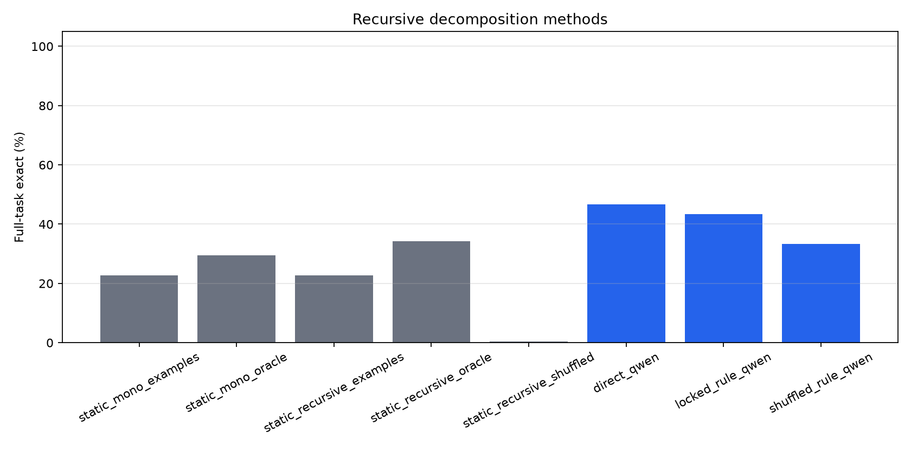
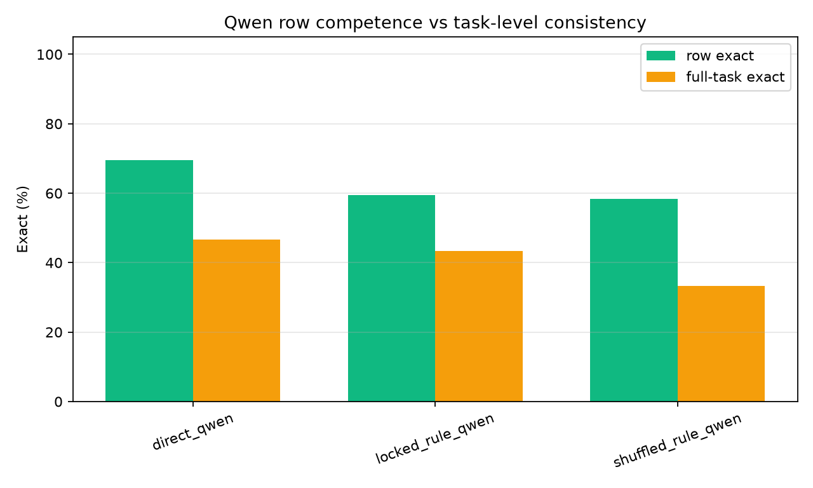
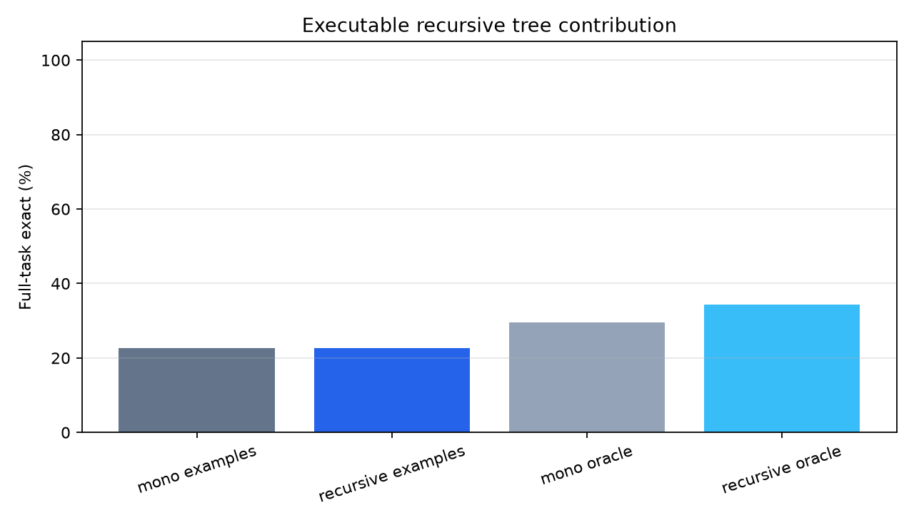
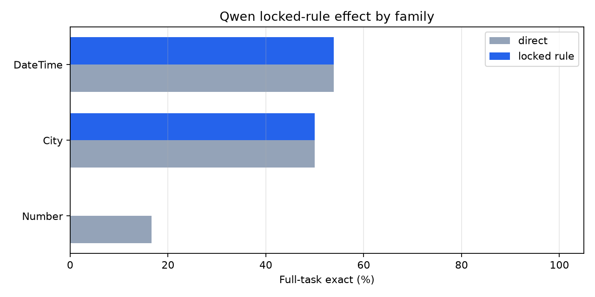
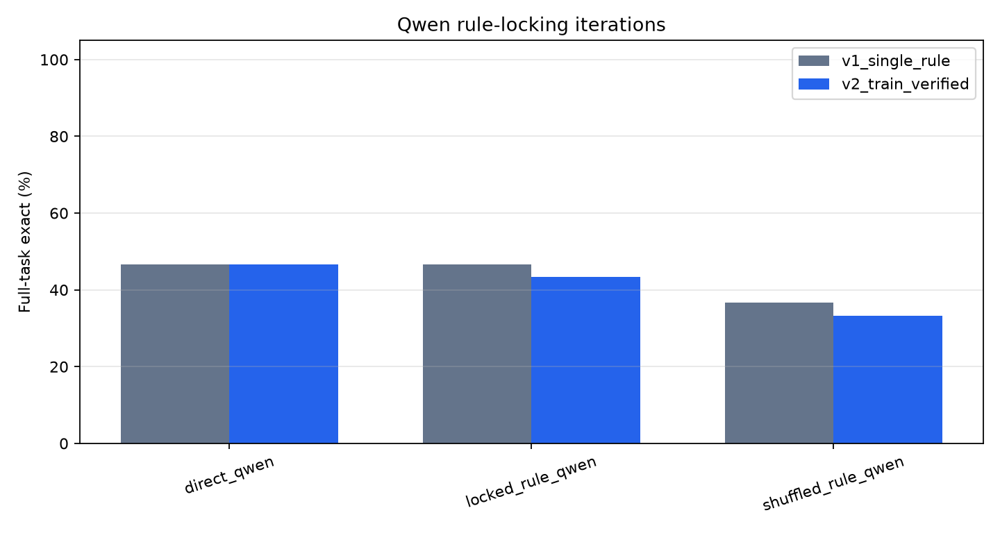

# Recursive Task Decomposition on Public Text Transformations

## Abstract

This standalone experiment tests whether recursive task decomposition improves task-level consistency on public text-transformation tasks. It compares executable recursive decomposition trees with a frozen language-model rule-locking procedure: first infer one reusable rule, then apply that same rule to every held-out row.

## Method

- Dataset: public Microsoft PROSE `Transformation.Text` tasks.
- Split: first `4` examples are training examples; up to `50` held-out examples are scored for static methods.
- Primary metric: full-task exact. A task is correct only if every held-out row is exact.
- Static recursive decomposition: derive output templates from delimiters or token/literal structure, synthesize child transformations for each slot, and compose the children into a tree.
- Qwen locked-rule decomposition: frozen Qwen writes one reusable rule/decomposition from the examples, then answers each held-out row while conditioned on that same rule.
- Shuffled controls: static recursive synthesis on rotated labels, and Qwen application with a rule from another task.

## Run Configuration

- Suite: `main_v2_train_verified_rules`.
- Static tasks: `309`.
- Qwen tasks: `30`.
- Qwen model: `Qwen/Qwen3-4B`.
- Static max candidates: `12000`.
- Recursive depth: `2`; child limit: `5`.
- Qwen held-out cap: `6` rows per task.

## Primary Results

### Static Executable Decomposition

|method|tasks|full_exact|row_exact|
|---|---|---|---|
|static_mono_examples|309|22.7%|27.2%|
|static_mono_oracle|309|29.4%|n/a|
|static_recursive_examples|309|22.7%|27.2%|
|static_recursive_oracle|309|34.3%|n/a|
|static_recursive_shuffled|309|0.3%|0.4%|

### Frozen Qwen Decomposition

|method|tasks|full_exact|row_exact|
|---|---|---|---|
|direct_qwen|30|46.7%|69.4%|
|locked_rule_qwen|30|43.3%|59.4%|
|shuffled_rule_qwen|30|33.3%|58.3%|

### Qwen Iteration Comparison

The first Qwen iteration used one generated decomposition rule per task. The second iteration generated three rule styles and selected the rule that best reproduced the training examples before held-out application. Both iterations used the same 30-task sample.

|iteration|method|tasks|full_exact|row_exact|
|---|---|---|---|---|
|v1_single_rule|direct_qwen|30|46.7%|69.4%|
|v1_single_rule|locked_rule_qwen|30|46.7%|61.7%|
|v1_single_rule|shuffled_rule_qwen|30|36.7%|53.6%|
|v2_train_verified|direct_qwen|30|46.7%|69.4%|
|v2_train_verified|locked_rule_qwen|30|43.3%|59.4%|
|v2_train_verified|shuffled_rule_qwen|30|33.3%|58.3%|

### Static Coverage By Family

|family|tasks|mono_oracle|recursive_oracle|mono_examples|recursive_examples|
|---|---|---|---|---|---|
|Column|2|0.00|0.00|0.00|0.00|
|Product|2|0.00|0.00|0.00|0.00|
|Author|1|0.00|0.00|0.00|0.00|
|FilePath|1|0.00|0.00|0.00|0.00|
|Meteorite|1|0.00|0.00|0.00|0.00|
|City|9|0.11|0.11|0.00|0.00|
|DateTime|106|0.11|0.14|0.09|0.09|
|Number|84|0.19|0.21|0.13|0.13|
|Gender|3|0.33|0.33|0.33|0.33|
|Address|6|0.17|0.50|0.00|0.00|
|EmergencyCall|2|0.50|0.50|0.00|0.00|
|Rating|2|0.50|0.50|0.50|0.50|
|Phone|16|0.50|0.56|0.38|0.38|
|UserAgent|7|0.57|0.57|0.43|0.43|
|Name|28|0.61|0.64|0.43|0.43|
|Email|6|0.67|0.67|0.67|0.67|
|ShippingCode|10|0.80|0.80|0.70|0.70|
|BillingCode|6|1.00|1.00|0.67|0.67|
|Log|4|0.00|1.00|0.00|0.00|
|Currency|3|1.00|1.00|1.00|1.00|
|Language|2|0.50|1.00|0.50|0.50|
|Abbreviation|1|1.00|1.00|1.00|1.00|
|Airline|1|1.00|1.00|1.00|1.00|
|Noise|1|1.00|1.00|1.00|1.00|
|Song|1|1.00|1.00|1.00|1.00|
|State|1|1.00|1.00|1.00|1.00|
|Team|1|1.00|1.00|1.00|1.00|
|Url|1|0.00|1.00|0.00|0.00|
|ZipCode|1|1.00|1.00|1.00|1.00|

### Qwen Task-Level Details

|task_id|family|heldout_rows|direct_row_exact|locked_row_exact|shuffled_row_exact|direct_full_exact|locked_full_exact|shuffled_full_exact|locked_minus_direct_rows|
|---|---|---|---|---|---|---|---|---|---|
|DateTime.000076|DateTime|6|66.7%|100.0%|66.7%|False|True|False|0.33|
|City.000010|City|3|100.0%|100.0%|100.0%|True|True|True|0.00|
|Column.000001|Column|6|100.0%|100.0%|100.0%|True|True|True|0.00|
|DateTime.000004|DateTime|6|100.0%|100.0%|100.0%|True|True|True|0.00|
|DateTime.000007|DateTime|6|100.0%|100.0%|100.0%|True|True|True|0.00|
|DateTime.000025|DateTime|6|100.0%|100.0%|66.7%|True|True|False|0.00|
|DateTime.000094|DateTime|4|100.0%|100.0%|50.0%|True|True|False|0.00|
|DateTime.000104|DateTime|6|100.0%|100.0%|100.0%|True|True|True|0.00|
|DateTime.000108|DateTime|6|100.0%|100.0%|83.3%|True|True|False|0.00|
|FilePath.000001|FilePath|6|100.0%|100.0%|100.0%|True|True|True|0.00|
|Language.000002|Language|6|100.0%|100.0%|100.0%|True|True|True|0.00|
|Phone.000011|Phone|3|100.0%|100.0%|100.0%|True|True|True|0.00|
|UserAgent.000003|UserAgent|6|100.0%|100.0%|100.0%|True|True|True|0.00|
|DateTime.000114|DateTime|6|0.0%|16.7%|0.0%|False|False|False|0.17|
|Address.000002|Address|3|33.3%|33.3%|33.3%|False|False|False|0.00|
|BillingCode.000007|BillingCode|3|33.3%|33.3%|33.3%|False|False|False|0.00|
|DateTime.000081|DateTime|6|50.0%|50.0%|33.3%|False|False|False|0.00|
|DateTime.000115|DateTime|6|0.0%|0.0%|0.0%|False|False|False|0.00|
|Gender.000001|Gender|3|66.7%|66.7%|66.7%|False|False|False|0.00|
|Number.000008|Number|6|33.3%|33.3%|33.3%|False|False|False|0.00|
|Number.000049|Number|4|25.0%|25.0%|25.0%|False|False|False|0.00|
|ShippingCode.000008|ShippingCode|3|33.3%|33.3%|0.0%|False|False|False|0.00|
|DateTime.000116|DateTime|6|50.0%|33.3%|33.3%|False|False|False|-0.17|
|Number.000075|Number|6|66.7%|50.0%|50.0%|False|False|False|-0.17|
|DateTime.000017|DateTime|6|100.0%|66.7%|50.0%|True|False|False|-0.33|
|DateTime.000051|DateTime|3|33.3%|0.0%|33.3%|False|False|False|-0.33|
|Number.000077|Number|3|33.3%|0.0%|100.0%|False|False|True|-0.33|
|City.000011|City|4|75.0%|25.0%|25.0%|False|False|False|-0.50|
|Number.000016|Number|6|83.3%|0.0%|33.3%|False|False|False|-0.83|
|Number.000022|Number|6|100.0%|16.7%|33.3%|True|False|False|-0.83|

### Example Locked Rules

|task_id|family|rule_chars|rule|
|---|---|---|---|
|Address.000002|Address|245|Take the input and split it into parts using commas as delimiters. The first part contains the name and a number followed by a place and direction. Extract the number and place portion, then take the first part of the split result as the output.|
|BillingCode.000007|BillingCode|116|Keep the input as is.  
Substep 1: Extract the input string.  
Substep 2: Return the extracted string as the output.|
|City.000010|City|88|Replace any input that is &quot;None&quot; with &quot;0&quot;. For all other inputs, return the input as is.|
|City.000011|City|123|If the input is &quot;New York City&quot;, &quot;n.y.c.&quot;, or &quot;New York City  &quot;, output &quot;New York City&quot;. Otherwise, output the input as is.|
|Column.000001|Column|218|If the input starts with &quot;Coln&quot;, remove the &quot;n&quot; and keep the rest as is. If the input is &quot;ID&quot;, output &quot;Col1&quot;. If the input is &quot;Coln&quot; followed by a number, output &quot;Col&quot; followed by that number. Otherwise, output &quot;Col1&quot;.|
|DateTime.000004|DateTime|107|Take the value from col0 and col1, format col0 as &quot;HH:MM:SS&quot;, and concatenate the formatted col0 with col1.|
|DateTime.000007|DateTime|88|Take the input date time string, extract the year and month, and format as &quot;Month Year&quot;.|
|DateTime.000017|DateTime|166|Split the input into parts based on separators (space, hyphen, slash), then reformat each part into day/month/year format, combining them in the order day/month/year.|
|DateTime.000025|DateTime|529|**Rule: Extract and reformat date components**

1. **Split the input into components**: Separate the date into month, day, and year (or equivalent parts).
2. **Map the month abbreviation to its full name**: Convert abbreviations like &quot;Mar&quot; to &quot;March&quot; (though examples use abbreviations, this step is for consistency).
3. **Reformat the day**: Convert the day into a two-digit format if necessary (e.g., &quot;1&quot; → &quot;01&quot;, &quot;30&quot; → &quot;30&quot;).
4. **Reformat the year**: Extract the last two digits of the year (e.g., &quot;2002&quot; → &quot;02&quot;, &quot;1953&quot; → &quot;53|
|DateTime.000051|DateTime|365|If the input is a time in HH:MM:SS format:  
If the hour is 11, then format as &quot;11:00AM-11:30AM&quot;;  
If the hour is 8, then format as &quot;8:00AM-8:30AM&quot;;  
If the hour is 12, then format as &quot;12:00PM-12:30PM&quot;;  
If the hour is 0, then format as &quot;12:00AM-12:30AM&quot;;  
If the input is empty or null, then return &quot;N/A&quot;;  
If the input is an abbreviation like &quot;11:00AM&quot;, then|
|DateTime.000076|DateTime|235|Take the input time in the format HH:MM. Extract the hour part (HH). If the hour is between 00 and 19, output &quot;0:00-19:00&quot;. If the hour is between 20 and 39, output &quot;20:00-39:00&quot;. If the hour is between 40 and 59, output &quot;40:00-59:00&quot;.|
|DateTime.000081|DateTime|434|**Rule:**  
Given a time in HH:MMAM/PM format, decompose into:  
1. Extract hour and minute.  
2. If minute &lt; 15, subtract (minute - 0) from hour, add 15 minutes, and set the new start time.  
3. If minute &gt;= 15 and &lt; 45, set start time to hour:15 and end time to hour:45.  
4. If minute &gt;= 45, add (60 - minute) to hour, set start time to (hour + 1):15 and end time to (hour + 1):45.  
5. Combine start and end times into &quot;start-time|
|DateTime.000094|DateTime|281|Parse the input date into components (year, month, day). If the date is in the format &quot;DD.MM.YYYY&quot; or &quot;DD. MMM YYYY&quot;, extract the day, month, and year. If the date is in the format &quot;MMM DD YYYY&quot; or &quot;DD MMM YYYY&quot;, extract the day, month, and year. Format the output as &quot;YYYY-MM-DD&quot;.|
|DateTime.000104|DateTime|241|Extract the third character from the date portion of the input string. The date portion is in the format &quot;DD-Mon-YYYY&quot;, so the third character is the first letter of the month (e.g., &quot;Jan&quot;, &quot;Feb&quot;, &quot;Mar&quot;). Return that character as the output.|
|DateTime.000108|DateTime|243|Parse the input date and time string. Extract the day and month from the date part. Format the output as MM/DD/YYYY, where MM is the month abbreviation (Jan=1, Feb=2, ..., Dec=12), DD is the day, and YYYY is the year. The time part is ignored.|
|DateTime.000114|DateTime|149|Take the day of the month from the input date. If the day is less than or equal to 15, output &quot;15-30&quot;. If the day is greater than 15, output &quot;30-45&quot;.|

## Figures

## Interpretation

Executable recursion changes the static oracle from 29.4% to 34.3%. The examples-selected recursive tree reaches 22.7%, compared with 22.7% for monolithic expressions and 0.3% for the shuffled-label control.
For frozen Qwen, direct answering reaches 69.4% row exact and 46.7% full-task exact. The locked-rule decomposition reaches 59.4% row exact and 43.3% full-task exact. The shuffled-rule control reaches 58.3% row exact and 33.3% full-task exact.
The locked-rule full-task delta over direct answering is -3.3%. Positive values mean decomposition improved consistency; negative values mean rule commitment damaged useful row-level inference.
The iteration comparison is negative for this form of recursive decomposition. A single generated rule tied direct Qwen on full-task exact but reduced row exact. Train-verifying three rule styles did not recover the lost row competence and lowered full-task exact by one task. The shuffled-rule controls are lower than the real-rule arms, so the generated rules carry task signal; the problem is that the signal is not reliably better than Qwen's direct row-level inference.

## Limitations

The Qwen arm is capped for runtime and uses deterministic decoding. The static recursive tree only explores delimiter and token-template decompositions, not arbitrary semantic subgoals. Full-task exact is intentionally strict and can be much lower than row exact when a method is inconsistent across rows.

## Artifacts

- Static details: `analysis/static_details.csv`
- Qwen rules: `analysis/qwen_rules.csv`
- Qwen task summary: `analysis/qwen_task_details.csv`
- Qwen row details: `analysis/qwen_row_details.csv`
- Iteration comparison: `analysis/iteration_comparison.csv`
- Figures: `analysis/figures/`
- Benchmark mirror: `/workspace/large_artifacts/qwen_recursive_task_decomposition/prose-benchmarks`
