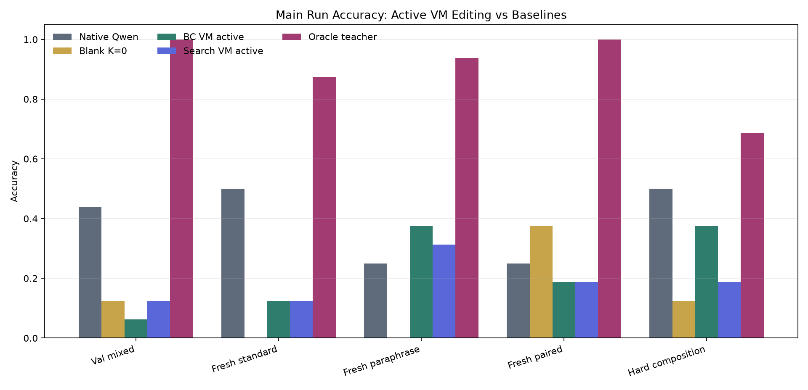
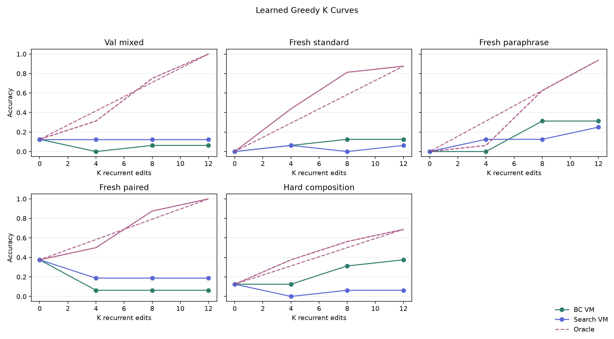
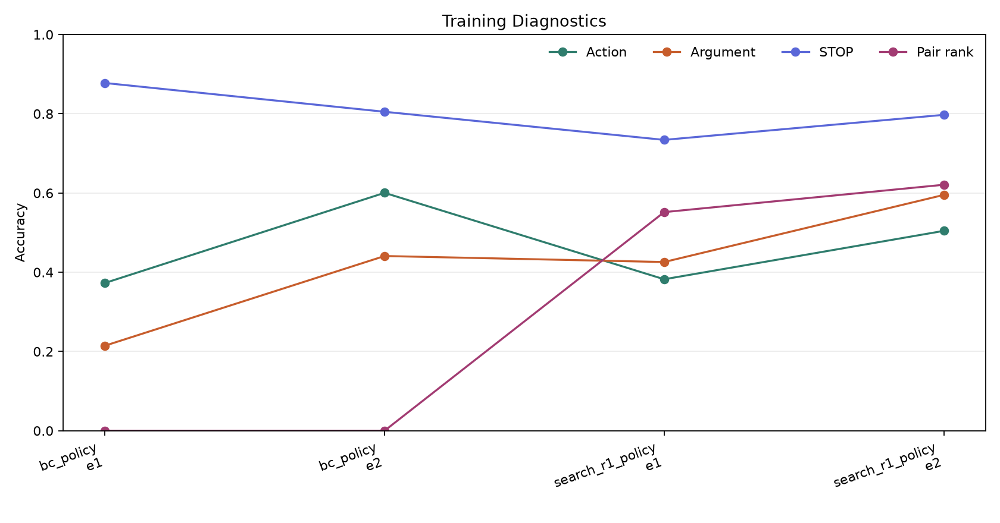
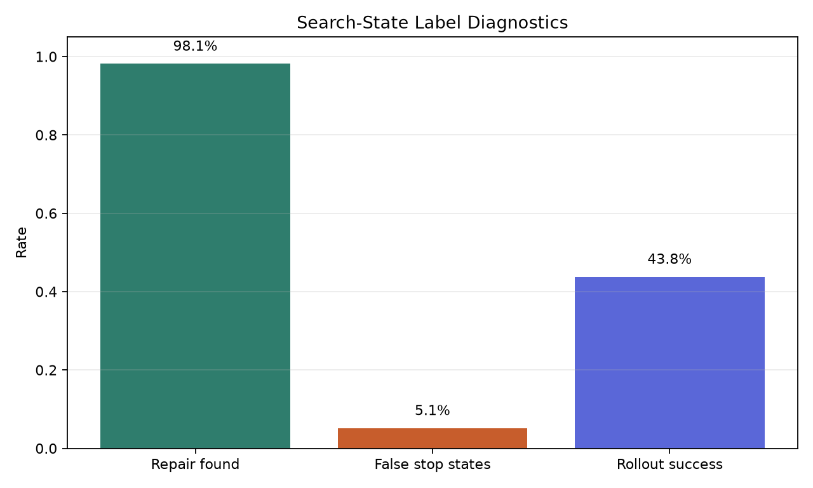
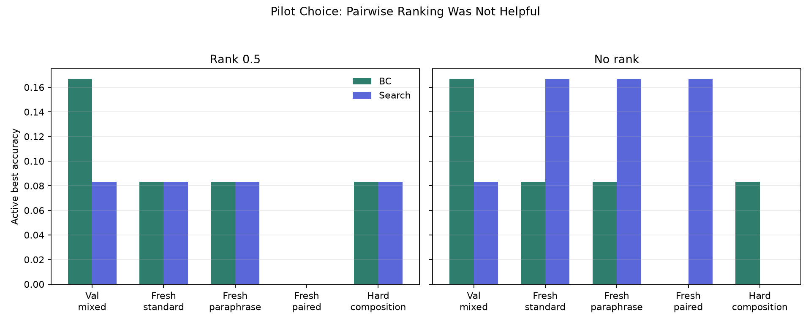

# Search-Augmented Rollout Distillation

## Verdict

Search-augmented rollout distillation did not improve the main active VM controller. The behavior-cloned VM controller already produced the best active score on three of five splits, tied search on one, and search improved only val mixed from 6.2% to 12.5%, still far below native Qwen. The oracle teacher remained much higher at 68.8% to 100.0%, so the task and VM action space still have large headroom.

The main positive result is narrow: the behavior-cloned VM controller beat native Qwen on fresh paraphrase tasks when using active K>0 edits (37.5% vs 25.0%). The search-distilled controller did not preserve that gain and did not close the oracle gap.

## What Was Tested

This experiment trains `Qwen/Qwen3-4B` as a recurrent controller for a typed bytecode VM. Each recurrent step is one Qwen forward pass over the task prompt plus dense VM-state tokens. The model predicts one structured edit action or `STOP`; the VM executes the current program; then the updated VM state is fed back into the model for the next step.

The intervention is search-augmented rollout distillation. After behavior cloning on gold traces, the learned policy is rolled out on training tasks. For each policy-visited state, bounded repair search finds a verified completion when possible. The model is then trained on the first action of that repaired trajectory.

## Main Accuracy

These are active K>0 VM-editing scores except for the explicit blank column. This avoids counting passive K=0 blank-program hits as real recurrent computation.

| Split            | Native Qwen   | Blank K=0   | BC VM active   | Search VM active   | Oracle teacher   |
|:-----------------|:--------------|:------------|:---------------|:-------------------|:-----------------|
| Val mixed        | 43.8%         | 12.5%       | 6.2%           | 12.5%              | 100.0%           |
| Fresh standard   | 50.0%         | 0.0%        | 12.5%          | 12.5%              | 87.5%            |
| Fresh paraphrase | 25.0%         | 0.0%        | 37.5%          | 31.2%              | 93.8%            |
| Fresh paired     | 25.0%         | 37.5%       | 18.8%          | 18.8%              | 100.0%           |
| Hard composition | 50.0%         | 12.5%       | 37.5%          | 18.8%              | 68.8%            |

## K Curves

The greedy learned policy shows no clean monotonic K-scaling. Some splits improve with more edits, but others stay flat or degrade. The oracle curve confirms that high accuracy is reachable in the same VM environment when the trajectory is chosen correctly.

## Training Diagnostics

| Phase            |   Epoch | Action acc   | Arg acc   | STOP acc   | Pair-rank acc   |   States |
|:-----------------|--------:|:-------------|:----------|:-----------|:----------------|---------:|
| bc_policy        |       1 | 37.3%        | 21.5%     | 87.8%      | 0.0%            |      901 |
| bc_policy        |       2 | 60.0%        | 44.1%     | 80.5%      | 0.0%            |      901 |
| search_r1_policy |       1 | 38.2%        | 42.6%     | 73.4%      | 55.2%           |     1703 |
| search_r1_policy |       2 | 50.4%        | 59.5%     | 79.7%      | 62.1%           |     1703 |

Behavior cloning reached 60.0% local action accuracy, but active solve accuracy remained much lower. Search-distillation collected many verified repair labels, but training on those labels reduced local action accuracy to 50.4% and did not improve the active controller.

## Repair Diagnostics

Search-state collection found verified completions for 787 of 802 policy-visited states (98.1%). It also saw 41 false-stop states and 43.8% rollout success before retraining.

## Pilot Result

The first pilot used pairwise positive-vs-negative ranking with weight 0.5. It did not improve rollout accuracy and made the second on-policy collection worse. The selected main recipe disabled the ranking loss and trained two epochs on search-labeled states.

## Interpretation

The experiment gives a clear negative result for this specific recipe. The bottleneck is not simply obtaining verified repair labels: the main run found verified completions for 98.1% of policy-visited states. The problem is turning those labels into a policy that chooses useful global trajectories at inference time.

The strongest evidence is the gap between local and global metrics. Behavior cloning reached 60.0% action accuracy, and the oracle teacher reached 68.8% to 100.0% by split, but the best active deployable VM score was only 37.5%. Search-distillation increased neither the best active score nor the K-scaling pattern.

## Next Experiment

The next high-impact experiment should stop treating repaired trajectories as ordinary one-step imitation labels. The more direct attack is rollout-level optimization: sample complete VM rollouts, score them with exact VM reward and false-stop penalties, then train preference or policy-gradient updates over full trajectories. The assets from this experiment are enough to do that: a recurrent dense-state controller, a value/distance head, exact executable rewards, and a repair procedure that can produce successful contrastive rollouts.
